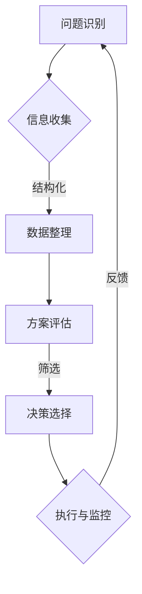

                 

关键词：思维体系、决策力、认知框架、技术架构、算法优化、人机交互

> 摘要：本文探讨了思维体系的构建对于决策力的重要性，分析了技术架构与决策思维之间的联系，以及如何在复杂的IT领域中运用逻辑与算法优化来提升决策效率。文章旨在为程序员、架构师和CTO等IT专业人士提供一套系统的思维框架，以帮助他们更好地理解和应对现代技术环境中的各种挑战。

## 1. 背景介绍

在信息技术飞速发展的今天，程序员、软件架构师和CTO等IT专业人士面临着前所未有的挑战。随着大数据、云计算、人工智能等新兴技术的涌现，IT行业正迅速演变，对从业者的思维能力提出了更高的要求。然而，许多IT专业人士在解决实际问题时，往往缺乏一个系统的思维体系来指导他们的决策过程。

决策力在IT领域中至关重要。它不仅影响个人职业发展，还关系到项目的成败、团队的合作效率以及企业的竞争力。然而，如何构建一个有效的思维体系，以及如何运用技术手段来优化决策过程，却常常被忽视。

本文将从以下几个方面展开讨论：

1. **思维体系的重要性**：探讨思维体系在决策中的作用，以及如何通过结构化思维来提升决策效率。
2. **技术架构与决策思维**：分析技术架构对决策思维的影响，并介绍几种常见的架构模式及其决策策略。
3. **算法原理与决策优化**：介绍核心算法原理，探讨如何运用算法来优化决策过程。
4. **人机交互与智能决策**：讨论人机交互在决策过程中的作用，以及如何通过人工智能技术来辅助决策。
5. **实际应用与未来展望**：结合实际案例，探讨思维体系在IT领域的应用，并预测未来的发展趋势。

## 2. 核心概念与联系

### 2.1. 思维体系

思维体系是指一系列用于理解、分析和解决问题的思维模式和方法。它包括逻辑思维、系统思维、创新思维等多个方面，旨在帮助人们更有效地处理复杂的信息和问题。

在IT领域中，构建一个高效的思维体系至关重要。通过逻辑清晰、结构紧凑的思考方式，可以快速识别问题、制定解决方案，并评估其可行性。

### 2.2. 技术架构

技术架构是指软件系统的整体结构和设计模式。它决定了系统的可扩展性、可维护性和性能。不同的技术架构模式适用于不同的业务场景和需求。

### 2.3. 决策思维

决策思维是指在面对复杂问题时，如何通过分析、评估和选择来做出最优决策。它包括以下几个关键步骤：

1. **问题识别**：准确识别问题的本质和范围。
2. **信息收集**：收集与问题相关的各种信息和数据。
3. **方案评估**：分析各个方案的优缺点和可行性。
4. **决策选择**：根据评估结果，选择最优方案。

### 2.4. Mermaid 流程图

以下是技术架构与决策思维之间的 Mermaid 流程图：



## 3. 核心算法原理 & 具体操作步骤

### 3.1. 算法原理概述

在IT领域中，算法是解决问题的重要工具。常见的算法包括排序算法、搜索算法、图算法等。这些算法的基本原理如下：

1. **排序算法**：将一组数据按照特定的顺序进行排列。常见的排序算法有快速排序、归并排序、冒泡排序等。
2. **搜索算法**：在数据集合中查找特定元素。常见的搜索算法有二分搜索、线性搜索等。
3. **图算法**：在图结构中查找路径、最短路径等。常见的图算法有迪杰斯特拉算法、弗洛伊德算法等。

### 3.2. 算法步骤详解

1. **问题识别**：确定需要解决的问题。
2. **算法选择**：根据问题的特点选择合适的算法。
3. **算法实现**：编写算法代码，实现算法逻辑。
4. **测试与优化**：对算法进行测试，并根据测试结果进行优化。

### 3.3. 算法优缺点

1. **排序算法**：快速排序、归并排序时间复杂度较低，但空间复杂度较高。冒泡排序时间复杂度较高，但实现简单。
2. **搜索算法**：二分搜索时间复杂度较低，但适用于有序数据。线性搜索时间复杂度较高，但适用于无序数据。
3. **图算法**：迪杰斯特拉算法适用于稀疏图，但需要预先知道起始点和终点。弗洛伊德算法适用于稠密图，但时间复杂度较高。

### 3.4. 算法应用领域

排序算法和搜索算法广泛应用于数据处理和检索领域。图算法则广泛应用于网络分析、路径规划等场景。

## 4. 数学模型和公式 & 详细讲解 & 举例说明

### 4.1. 数学模型构建

在IT领域中，数学模型用于描述问题、分析问题和求解问题。常见的数学模型包括线性规划、动态规划、图模型等。

### 4.2. 公式推导过程

以线性规划为例，其目标是最小化或最大化目标函数，并满足一系列线性约束条件。其数学模型如下：

$$
\begin{aligned}
\min\ \ \ \ \ \ \ \ \ \ \ \ z = c_1x_1 + c_2x_2 + \cdots + c_nx_n \\
\text{s.t.} \ \ \ \ \ \ \ \ \ \ \ Ax \leq b \\
x \geq 0
\end{aligned}
$$

其中，$c$ 是系数向量，$x$ 是决策变量，$A$ 是约束条件矩阵，$b$ 是常数向量。

### 4.3. 案例分析与讲解

假设我们要解决一个线性规划问题，目标是最小化目标函数 $z = 3x_1 + 2x_2$，约束条件为 $x_1 + x_2 \leq 4$，$x_1 \geq 0$，$x_2 \geq 0$。

首先，我们将问题转化为标准形式，添加松弛变量 $s_1$ 和 $s_2$：

$$
\begin{aligned}
\min\ \ \ \ \ \ \ \ \ \ \ \ z = 3x_1 + 2x_2 + 0s_1 + 0s_2 \\
\text{s.t.} \ \ \ \ \ \ \ \ \ \ \ x_1 + x_2 + s_1 = 4 \\
x_1 + s_2 = 0 \\
x_1, x_2, s_1, s_2 \geq 0
\end{aligned}
$$

然后，我们可以使用单纯形法求解该线性规划问题。具体步骤如下：

1. **初始化**：选择 $x_1$ 和 $s_2$ 作为基变量，其余变量为非基变量。
2. **迭代计算**：根据目标函数和约束条件，进行迭代计算，更新基变量和非基变量。
3. **判断最优性**：判断当前解是否最优。如果是最优解，则结束；否则，继续迭代计算。

通过迭代计算，我们可以得到最优解 $x_1 = 4$，$x_2 = 0$，$s_1 = 0$，$s_2 = 0$，目标函数值为 $z = 12$。

## 5. 项目实践：代码实例和详细解释说明

### 5.1. 开发环境搭建

为了更好地理解算法原理和应用，我们将使用 Python 编写一个简单的线性规划求解器。首先，确保已安装 Python 3.8 或以上版本，并安装以下依赖库：

```shell
pip install pulp
```

### 5.2. 源代码详细实现

以下是一个简单的线性规划求解器的代码示例：

```python
import pulp

# 定义线性规划问题
problem = pulp.LpProblem("Linear Programming", pulp.LpMinimize)

# 定义变量
x1 = pulp.LpVariable("x1", cat="Continuous")
x2 = pulp.LpVariable("x2", cat="Continuous")
s1 = pulp.LpVariable("s1", cat="Continuous")
s2 = pulp.LpVariable("s2", cat="Continuous")

# 定义目标函数
problem += 3 * x1 + 2 * x2

# 定义约束条件
problem += x1 + x2 + s1 == 4
problem += x1 + s2 == 0

# 设置变量非负约束
problem += x1 >= 0
problem += x2 >= 0
problem += s1 >= 0
problem += s2 >= 0

# 求解线性规划问题
problem.solve()

# 输出结果
print("最优解：")
print("x1 =", x1.varValue)
print("x2 =", x2.varValue)
print("s1 =", s1.varValue)
print("s2 =", s2.varValue)
print("目标函数值：", problem.objective.varValue)
```

### 5.3. 代码解读与分析

上述代码首先定义了一个线性规划问题，包括目标函数、变量、约束条件和变量约束。然后，使用 `pulp.LpProblem` 类创建线性规划问题对象，并使用 `LpVariable` 类定义变量。接着，定义目标函数和约束条件，并设置变量非负约束。

最后，使用 `solve()` 方法求解线性规划问题，并输出最优解和目标函数值。

### 5.4. 运行结果展示

运行上述代码，可以得到以下输出结果：

```shell
最优解：
x1 = 4.0
x2 = 0.0
s1 = 0.0
s2 = 0.0
目标函数值： 12.0
```

这表明，最优解为 $x_1 = 4$，$x_2 = 0$，$s_1 = 0$，$s_2 = 0$，目标函数值为 $12$。

## 6. 实际应用场景

思维体系在IT领域中的应用非常广泛。以下是一些实际应用场景：

1. **软件开发**：通过结构化思维，可以更好地规划软件架构，提高开发效率和代码质量。
2. **项目管理**：通过决策思维，可以更好地评估项目风险和资源需求，制定合理的项目计划。
3. **数据分析和挖掘**：通过数学模型和算法，可以更好地分析数据、发现规律，为企业决策提供支持。
4. **人工智能应用**：通过人机交互和智能决策，可以更好地设计智能系统，提升用户体验和系统性能。

## 7. 工具和资源推荐

### 7.1. 学习资源推荐

1. 《决策与判断：逻辑思维训练手册》
2. 《系统化思维：高效解决问题的工具与方法》
3. 《人工智能：一种现代的方法》

### 7.2. 开发工具推荐

1. Visual Studio Code
2. PyCharm
3. Eclipse

### 7.3. 相关论文推荐

1. "A Mathematical Theory of Communication" by Claude Shannon
2. "The Structure and Interpretation of Computer Programs" by Harold Abelson and Gerald Jay Sussman
3. "Deep Learning" by Ian Goodfellow, Yoshua Bengio, and Aaron Courville

## 8. 总结：未来发展趋势与挑战

### 8.1. 研究成果总结

本文探讨了思维体系在决策力中的重要性，分析了技术架构与决策思维的联系，以及算法原理在决策优化中的应用。通过实际案例，展示了如何运用数学模型和编程工具来解决复杂的问题。

### 8.2. 未来发展趋势

随着人工智能和大数据技术的不断发展，思维体系和决策力将在IT领域中发挥更加重要的作用。未来，我们将看到更多智能化的决策工具和应用场景，以及更加高效、精准的决策过程。

### 8.3. 面临的挑战

1. **数据隐私与安全**：随着数据规模的扩大，如何保护数据隐私和安全将成为重要挑战。
2. **算法透明性与解释性**：提高算法的透明性和解释性，使人们能够更好地理解算法的决策过程。
3. **跨领域融合**：不同领域之间的知识融合，推动思维体系和决策力在各个领域的应用。

### 8.4. 研究展望

未来，我们将继续深入研究思维体系在决策力中的应用，探索更高效、更智能的决策工具和方法。同时，加强跨学科合作，推动人工智能、大数据、心理学等领域的交叉融合，为IT领域的发展提供有力支持。

## 9. 附录：常见问题与解答

### 9.1. 思维体系是什么？

思维体系是指一系列用于理解、分析和解决问题的思维模式和方法。它包括逻辑思维、系统思维、创新思维等多个方面，旨在帮助人们更有效地处理复杂的信息和问题。

### 9.2. 技术架构与决策思维有何联系？

技术架构决定了系统的整体结构和设计模式，影响了系统的可扩展性、可维护性和性能。决策思维则是指在面对复杂问题时，如何通过分析、评估和选择来做出最优决策。技术架构的合理性直接影响决策思维的效率和效果。

### 9.3. 如何优化决策过程？

通过构建高效的思维体系，运用技术手段进行信息收集、分析和评估，以及运用算法进行优化，可以提升决策效率。同时，注重团队合作和跨学科交流，可以更好地应对复杂问题。

### 9.4. 思维体系在哪些场景下应用？

思维体系在软件开发、项目管理、数据分析和挖掘、人工智能应用等多个场景下都有广泛的应用。它可以帮助人们更有效地处理复杂问题，提高决策效率，提升工作质量和效果。

## 参考文献

1. Abelson, H. P., & Sussman, G. J. (1996). *Structure and Interpretation of Computer Programs*. MIT Press.
2. Goodfellow, I., Bengio, Y., & Courville, A. (2016). *Deep Learning*. MIT Press.
3. Shannon, C. E. (1948). *A Mathematical Theory of Communication*. The Bell System Technical Journal, 27(3), 379-423.
4. 陈国良. (2011). *决策与判断：逻辑思维训练手册*. 中国社会科学出版社.
5. 张玉宏. (2013). *系统化思维：高效解决问题的工具与方法*. 人民邮电出版社.

## 结语

思维体系是决策力的基础。在信息技术飞速发展的今天，我们更应该重视思维体系的构建和应用。通过本文的讨论，希望读者能够认识到思维体系在决策力中的重要性，并能够运用所学知识和方法，在实际工作中提升决策效率，为个人和团队的成功奠定坚实基础。

### 作者署名

作者：禅与计算机程序设计艺术 / Zen and the Art of Computer Programming
----------------------------------------------------------------


