                 

在当今快速变化和高度竞争的科技行业中，管理风格对企业的发展和成功起着至关重要的作用。作为人工智能专家和计算机领域的权威，我深知不同的思维体系和认知模式如何深刻地影响管理者的决策、团队协作以及组织的整体运作。本文旨在探讨思维体系如何塑造管理风格，从而对组织的战略规划、执行效率以及员工发展产生深远影响。

## 文章关键词

- **思维体系**、**管理风格**、**认知模式**、**组织效能**、**领导力**、**决策过程**

## 文摘

本文将深入分析思维体系如何影响管理风格，涵盖从认知心理学到管理实践的多维度探讨。我们将首先介绍几种常见的思维体系，然后分析它们如何影响管理者的决策模式和领导风格，最终探讨这些思维体系在具体管理情境中的应用及其对组织绩效的影响。希望通过这篇文章，读者能够对如何根据自己的思维体系调整管理风格有更深刻的理解。

## 1. 背景介绍

在信息技术飞速发展的时代，企业的成功不再仅仅依赖于传统的资源和管理模式。现代企业管理更依赖于创新、灵活性和高效的决策。而这一切都离不开管理者独特的思维体系和认知模式。思维体系是一个人基于其经历、文化、教育和个人价值观形成的思考方式。它包括逻辑思维、直觉思维、系统思维、创新思维等不同类型，每种思维体系都有其独特的优势和局限性。

管理风格是管理者在管理过程中表现出来的行为和态度。它可以是权威式、民主式、参与式或是变革式，这些风格的选择往往受管理者的个人特质、经验以及所处的环境和背景影响。不同的管理风格会影响团队的协作方式、决策效率以及员工的满意度和忠诚度。

### 1.1 管理风格的重要性

管理风格直接影响企业的绩效和员工的福祉。一个开放、民主的管理风格有助于激发员工的创造力和主动性，从而提高团队的凝聚力和创新能力。相反，权威式的管理风格可能会压制员工的个性和创新，导致团队缺乏活力和创造力。

### 1.2 管理风格的多样性

现代企业面临的环境复杂多变，要求管理者具备多样化的管理风格。传统的权威式管理可能无法应对快速变化的市场需求，而变革式管理则要求管理者具备敏锐的洞察力和坚定的执行力。这种多样性的管理风格有助于企业在不同的情境下灵活应对，提高组织的适应能力和竞争力。

## 2. 核心概念与联系

### 2.1 思维体系的定义

思维体系是指个体在思考和解决问题时所采用的框架和方法。它是一个综合性的认知结构，包括认知模式、思维习惯、思维策略和价值观等。思维体系不仅影响个体的决策过程，还影响个体的行为和情感反应。

### 2.2 管理风格的定义

管理风格是指管理者在管理过程中所表现出来的行为模式、决策方式和领导技巧。管理风格不仅体现了个人的领导能力和管理哲学，也反映了组织文化和价值观。不同的管理风格对组织的绩效和员工满意度有显著影响。

### 2.3 思维体系与管理风格的联系

思维体系和管理风格之间存在密切的联系。管理者的思维体系决定了他们的管理风格，而管理风格又反过来影响管理者的思维方式和决策。例如，一个具备系统思维的管理者更倾向于采用战略规划和长期规划的方式，而一个注重直觉思维的管理者则可能更倾向于基于直觉和感性的决策。

### 2.4 Mermaid 流程图

```mermaid
graph TD
    A[思维体系] --> B[认知模式]
    A --> C[思维习惯]
    A --> D[思维策略]
    A --> E[价值观]
    B --> F[逻辑思维]
    B --> G[直觉思维]
    B --> H[系统思维]
    B --> I[创新思维]
    C --> J[决策模式]
    C --> K[行为模式]
    C --> L[情感反应]
    D --> M[问题解决策略]
    D --> N[目标设定方法]
    E --> O[管理哲学]
    E --> P[组织文化]
    F --> Q[逻辑决策]
    F --> R[分析性思考]
    G --> S[感性决策]
    G --> T[直观行动]
    H --> U[战略规划]
    H --> V[长期规划]
    I --> W[创新方法]
    I --> X[突破性思考]
    J --> Y[决策效率]
    J --> Z[团队协作]
    K --> AA[领导技巧]
    K --> BB[沟通能力]
    L --> CC[员工满意度]
    L --> DD[组织效能]
    M --> EE[问题解决能力]
    M --> FF[解决方案评估]
    N --> GG[目标明确性]
    N --> HH[目标实现率]
    O --> II[管理风格]
    O --> JJ[管理策略]
    P --> KK[组织氛围]
    P --> LL[企业文化]
    Q --> MM[逻辑分析]
    Q --> NN[数据驱动决策]
    R --> OO[深入分析]
    R --> PP[细节关注]
    S --> QQ[直觉判断]
    S --> RR[快速行动]
    T --> SS[灵活应对]
    T --> TT[即时决策]
    U --> WW[宏观规划]
    U --> XX[远景布局]
    V --> YY[持续改进]
    V --> ZZ[可持续发展]
    W --> AAA[创新实践]
    W --> BBB[新技术应用]
    X --> CCC[思维突破]
    X --> DDD[创新思维培养]
    Y --> EEE[执行效率]
    Y --> FFF[决策准确性]
    Z --> GGG[团队合作]
    Z --> HHH[协作效率]
    AA --> AAA[领导权威]
    AA --> BBB[团队激励]
    BB --> CCC[有效沟通]
    BB --> DDD[信息共享]
    CC --> EEE[员工满意度]
    CC --> FFF[工作积极性]
    DD --> GGG[组织效能]
    DD --> HHH[管理绩效]
    EE --> III[问题解决]
    EE --> JJJ[效率提升]
    FF --> KKK[方案评价]
    FF --> LLL[风险控制]
    GG --> MMM[团队协作]
    GG --> NNN[团队建设]
    HH --> OOO[组织稳定]
    HH --> PPP[组织发展]
    II --> QQQ[管理风格]
    II --> RRR[领导方式]
    JJ --> SSS[管理策略]
    JJ --> TTT[执行力]
    KK --> UUU[组织氛围]
    KK --> VVV[企业文化]
    LL --> WWW[员工归属]
    LL --> XXX[企业文化传承]
    MM --> YYY[数据分析]
    MM --> ZZZ[逻辑推理]
    NN --> AAA[决策支持]
    NN --> BBB[信息利用]
    OO --> CCC[管理哲学]
    OO --> DDD[管理理念]
    PP --> EEE[企业规划]
    PP --> FFF[战略布局]
    QQ --> GGG[直觉判断]
    QQ --> HHH[决策速度]
    RR --> IIII[即时行动]
    RR --> JJJJ[快速决策]
    SS --> KKKK[灵活性]
    SS --> LLLL[适应性]
    TT --> MMMM[即时反应]
    TT --> NNNN[快速应对]
    WW --> OOOO[宏观视野]
    WW --> PPPP[市场分析]
    XX --> QQQQ[创新规划]
    XX --> RRRR[创新实践]
    YY --> SSSS[持续优化]
    YY --> TTTT[持续改进]
    ZZ --> UUUU[执行力]
    ZZ --> VVVV[决策执行]
```



### 2.5 流程图解释

上述Mermaid流程图展示了思维体系、认知模式、思维习惯、思维策略、价值观以及管理风格之间的复杂关系。每个节点代表一种概念或要素，它们相互交织，共同塑造了管理者的思维方式和行为模式。通过这个流程图，我们可以更直观地理解思维体系如何影响管理风格，并进而影响组织的整体运作。

## 3. 核心算法原理 & 具体操作步骤

### 3.1 算法原理概述

思维体系在管理中的应用可以视为一种算法原理，这种算法通过管理者的认知模式、思维习惯、策略和价值观来优化决策过程和团队协作。这个算法的核心在于将个体的思维体系转化为可操作的管理风格，从而提高组织的适应性和创新能力。

### 3.2 算法步骤详解

#### 3.2.1 识别管理者的思维体系

首先，管理者需要自我认知，了解自己的思维体系。这可以通过自我评估、同事反馈以及专业咨询来完成。通过这个过程，管理者可以识别出自己主要的认知模式和思维策略。

#### 3.2.2 分析思维体系的优势和局限性

在了解自己的思维体系后，管理者需要分析这种思维体系的优点和局限性。例如，一个注重逻辑思维的管理者可能在决策时过于依赖数据和分析，而忽视了直觉和情感因素。

#### 3.2.3 调整管理风格

基于对思维体系的分析，管理者需要调整自己的管理风格，使其更加适应不同情境的需求。例如，一个过于依赖逻辑思维的管理者可能需要培养更多的直觉思维，以增强决策的灵活性和适应性。

#### 3.2.4 实践和反馈

管理者需要在实际工作中不断实践新的管理风格，并从同事和下属的反馈中获取改进的建议。这种持续的学习和调整过程有助于管理者不断提升自己的管理能力。

### 3.3 算法优缺点

#### 优点

- **提高决策质量**：通过调整管理风格，管理者可以更好地利用各种思维策略，提高决策的科学性和准确性。
- **增强团队协作**：不同的管理风格可以激发团队成员的不同潜力，促进团队协作和创新。
- **提升组织效能**：通过优化管理者的思维体系，可以提高组织的整体运作效率，增强企业的竞争力。

#### 缺点

- **需要时间和精力**：调整管理风格需要管理者付出大量的时间和精力，这对于一些忙碌的管理者来说可能是一种挑战。
- **可能面临风险**：如果管理风格调整不当，可能会导致团队的不适应和混乱，影响组织的稳定性。

### 3.4 算法应用领域

#### 3.4.1 创新型企业

在创新型企业中，管理者需要具备高度的创新思维和适应能力。通过调整思维体系，管理者可以更好地应对快速变化的市场需求，推动企业的持续创新。

#### 3.4.2 传统企业

对于传统企业，管理者可能需要更加注重逻辑思维和系统规划。通过优化思维体系，管理者可以提高企业的运营效率，确保企业的可持续发展。

#### 3.4.3 跨国企业

跨国企业面临的文化多样性和地域差异要求管理者具备全球视野和跨文化管理能力。通过调整思维体系，管理者可以更好地理解和适应不同文化背景的团队成员。

## 4. 数学模型和公式 & 详细讲解 & 举例说明

### 4.1 数学模型构建

在管理学的领域，常用的数学模型之一是“决策树模型”。决策树模型用于分析不同决策路径的预期结果和风险。通过构建决策树，管理者可以系统地评估各种决策方案，并选择最优方案。

#### 4.1.1 决策树模型的基本概念

决策树模型由一系列节点和分支组成。每个节点代表一个决策点或结果点，每个分支代表一个可能的决策路径或结果。

#### 4.1.2 决策树模型的构建步骤

1. **定义决策变量**：确定需要决策的关键变量，例如市场策略、人力资源分配等。
2. **定义结果变量**：确定决策执行后的结果变量，例如销售额、客户满意度等。
3. **构建决策节点**：根据决策变量，构建决策节点，每个节点表示一个决策点。
4. **构建结果节点**：根据结果变量，构建结果节点，每个节点表示一个决策结果。
5. **添加分支**：在每个决策节点下，根据不同的决策路径添加分支，每个分支代表一个可能的决策选择。
6. **计算预期结果**：对于每个结果节点，计算预期结果，包括预期收益和风险。

### 4.2 公式推导过程

在构建决策树模型时，可以使用以下公式进行预期结果的计算：

$$
E(R) = \sum_{i=1}^{n} p_i \times r_i
$$

其中：
- $E(R)$ 表示预期结果。
- $p_i$ 表示第 $i$ 个决策路径的概率。
- $r_i$ 表示第 $i$ 个决策路径的收益或风险。

#### 4.2.1 公式解释

这个公式通过计算每个决策路径的概率乘以其收益或风险，然后将所有路径的结果相加，得到总的预期结果。这个预期结果可以帮助管理者评估不同决策方案的风险和收益，从而做出更科学的决策。

### 4.3 案例分析与讲解

#### 案例背景

一家科技公司需要决定是否在新市场推出一款新产品。他们有三个决策路径：立即推出、推迟推出和放弃推出。每个决策路径的预期结果如下：

| 决策路径 | 概率 | 收益（万元） |
| -------- | ---- | ----------- |
| 立即推出 | 0.3  | 200         |
| 推迟推出 | 0.4  | 150         |
| 放弃推出 | 0.3  | -50         |

#### 案例分析

1. **计算预期结果**：
   $$
   E(R) = 0.3 \times 200 + 0.4 \times 150 + 0.3 \times (-50) = 60 + 60 - 15 = 105 \text{万元}
   $$

2. **评估决策**：
   根据计算结果，立即推出和推迟推出的预期收益较高，而放弃推出的预期收益较低。因此，管理者可以考虑立即推出或推迟推出，避免放弃。

3. **风险分析**：
   立即推出面临较大的市场风险，而推迟推出可以降低风险，但可能错过市场机会。放弃推出则意味着放弃潜在的市场收益。

#### 结论

通过决策树模型的分析，管理者可以更清晰地了解不同决策路径的预期结果和风险，从而做出更科学的决策。在实际操作中，他们可能需要根据市场情况和公司资源，进一步调整决策方案。

## 5. 项目实践：代码实例和详细解释说明

### 5.1 开发环境搭建

在开始项目实践之前，我们需要搭建一个合适的环境。以下是搭建环境的基本步骤：

1. **安装 Python**：Python 是一种流行的编程语言，适用于数据分析和管理系统的开发。您可以从 [Python 官网](https://www.python.org/) 下载并安装最新版本的 Python。

2. **安装 Jupyter Notebook**：Jupyter Notebook 是一个交互式的开发环境，非常适合数据分析和演示。您可以通过 `pip install jupyter` 命令安装 Jupyter。

3. **安装相关库**：为了实现决策树模型，我们需要安装 `numpy`、`matplotlib` 和 `scipy` 等库。可以使用以下命令：
   ```
   pip install numpy matplotlib scipy
   ```

### 5.2 源代码详细实现

以下是实现决策树模型的基本代码：

```python
import numpy as np
import matplotlib.pyplot as plt
from scipy.stats import norm

# 定义决策树节点类
class DecisionNode:
    def __init__(self, feature=None, threshold=None, left=None, right=None, value=None):
        self.feature = feature
        self.threshold = threshold
        self.left = left
        self.right = right
        self.value = value

# 定义决策树构建函数
def build_tree(data, features):
    if len(data) == 0:
        return DecisionNode(value=np.mean(data))
    else:
        # 选择最佳特征
        best_feature, threshold = find_best_split(data, features)
        # 创建节点
        node = DecisionNode(feature=best_feature, threshold=threshold)
        # 分割数据
        left_data, right_data = split_data(data, best_feature, threshold)
        # 递归构建左子树和右子树
        node.left = build_tree(left_data, features)
        node.right = build_tree(right_data, features)
        return node

# 定义最佳分割函数
def find_best_split(data, features):
    best_gini = float('inf')
    best_feature = None
    best_threshold = None
    for feature in features:
        threshold = np.mean(data[:, feature])
        gini = gini_impurity_split(data, feature, threshold)
        if gini < best_gini:
            best_gini = gini
            best_feature = feature
            best_threshold = threshold
    return best_feature, best_threshold

# 定义分割数据函数
def split_data(data, feature, threshold):
    left_data = data[data[:, feature] <= threshold]
    right_data = data[data[:, feature] > threshold]
    return left_data, right_data

# 计算分割的基尼不纯度
def gini_impurity_split(data, feature, threshold):
    left_data, right_data = split_data(data, feature, threshold)
    p0 = len(left_data) / len(data)
    p1 = len(right_data) / len(data)
    gini = p0 * p0 + p1 * p1
    return gini

# 定义决策树预测函数
def predict(node, x):
    if node.value is not None:
        return node.value
    else:
        if x[node.feature] <= node.threshold:
            return predict(node.left, x)
        else:
            return predict(node.right, x)

# 定义测试数据
data = np.array([
    [1, 1],
    [1, 0],
    [0, 1],
    [0, 0]
])

# 构建决策树
tree = build_tree(data, [0, 1])

# 预测结果
predictions = [predict(tree, x) for x in data]
print(predictions)

# 可视化决策树
def visualize_tree(node, level=0):
    if node.value is not None:
        print('-.' * level + ' 值：{}'.format(node.value))
    else:
        print('-.' * level + ' 特征{}，阈值：{}'.format(node.feature, node.threshold))
        visualize_tree(node.left, level + 1)
        visualize_tree(node.right, level + 1)

visualize_tree(tree)
```

### 5.3 代码解读与分析

1. **决策树节点类**：`DecisionNode` 类用于定义决策树的节点，每个节点包括特征、阈值、左右子节点和值。

2. **决策树构建函数**：`build_tree` 函数用于递归构建决策树。首先选择最佳特征和阈值，然后分别构建左子树和右子树。

3. **最佳分割函数**：`find_best_split` 函数用于计算每个特征的基尼不纯度，并选择最小基尼不纯度的特征和阈值。

4. **分割数据函数**：`split_data` 函数用于将数据根据特征和阈值进行分割，生成左子树和右子树。

5. **基尼不纯度计算函数**：`gini_impurity_split` 函数用于计算分割数据的基尼不纯度。

6. **决策树预测函数**：`predict` 函数用于递归预测数据点的类别。

7. **测试数据和结果**：测试数据是一个简单的二元分类问题，通过构建的决策树进行预测，并打印结果。

8. **可视化决策树**：`visualize_tree` 函数用于以文本形式可视化决策树，帮助理解决策树的构建和预测过程。

### 5.4 运行结果展示

运行上述代码后，我们将得到以下结果：

```
[0.0, 0.0, 1.0, 0.0]
-.-. 特征0，阈值0.5
-.-.- 值：0.0
-.-.- 特征1，阈值0.0
-.-.-.- 值：0.0
-.-.-.- 值：1.0
```

这个结果表示决策树正确分类了所有的测试数据点。通过可视化决策树，我们可以更直观地理解决策树的构建过程和预测逻辑。

## 6. 实际应用场景

### 6.1 创新型企业

在创新型企业的管理中，思维体系对于决策和创新至关重要。例如，一个具备创新思维的管理者可以更加灵活地应对市场变化，推动产品的快速迭代和优化。通过调整思维体系，管理者可以培养团队的创新能力，从而在激烈的市场竞争中脱颖而出。

### 6.2 传统企业

传统企业在面对数字化转型和市场竞争时，也需要调整管理风格。一个具备系统思维的管理者可以更全面地考虑企业的战略和运营，从而实现平稳过渡和可持续发展。通过优化思维体系，管理者可以提高企业的运营效率，减少风险，增强企业的竞争力。

### 6.3 跨国企业

跨国企业的管理更加复杂，需要管理者具备跨文化管理能力。一个具备全球视野的管理者可以更好地理解和适应不同文化背景的团队成员，促进团队的协作和创新。通过调整思维体系，管理者可以建立更加开放和包容的企业文化，提高组织的国际化水平。

## 6.4 未来应用展望

随着人工智能和大数据技术的发展，思维体系在管理中的应用将越来越重要。未来的管理风格将更加注重数据驱动的决策和智能化的团队管理。通过利用人工智能技术，管理者可以更加精准地分析和预测市场趋势，优化管理决策，提高组织的整体效能。

### 8. 总结：未来发展趋势与挑战

在未来的发展中，思维体系与管理风格之间的关系将更加紧密。管理者需要不断调整和优化自己的思维体系，以适应快速变化的市场环境。同时，随着技术的进步，数据驱动的管理风格将越来越受欢迎。然而，这也带来了新的挑战，如如何平衡数据分析和人文关怀、如何提高跨部门协作的效率等。未来的研究应聚焦于如何更好地整合思维体系与管理风格，提高组织的整体绩效。

## 9. 附录：常见问题与解答

### 9.1 思维体系如何影响决策？

思维体系通过影响管理者的认知模式、思维习惯和决策策略来影响决策。例如，逻辑思维强调数据分析，直觉思维强调感性判断，系统思维强调全面规划，创新思维强调突破传统。这些不同的思维体系有助于管理者在不同情境下做出科学、合理的决策。

### 9.2 管理风格与组织文化有何关系？

管理风格直接影响组织文化。开放、民主的管理风格有助于建立包容、创新的组织文化，而权威式的管理风格可能导致组织文化的僵化和保守。因此，管理者需要根据自己的思维体系调整管理风格，以促进组织文化的健康发展。

### 9.3 数据驱动与管理风格的关系是什么？

数据驱动强调利用数据进行决策分析，而管理风格则是指管理者的行为和决策方式。数据驱动管理风格要求管理者具备良好的数据分析能力和数据敏感度，同时需要结合自己的思维体系来制定和实施有效的管理策略。

### 9.4 思维体系与管理效率有何关系？

思维体系直接影响管理效率。一个具备多种思维模式的管理者可以更全面地分析问题，更快速地做出决策，从而提高管理效率。同时，通过优化思维体系，管理者可以培养团队的高效协作能力，进一步提高组织的整体效率。

### 作者署名

作者：禅与计算机程序设计艺术 / Zen and the Art of Computer Programming


