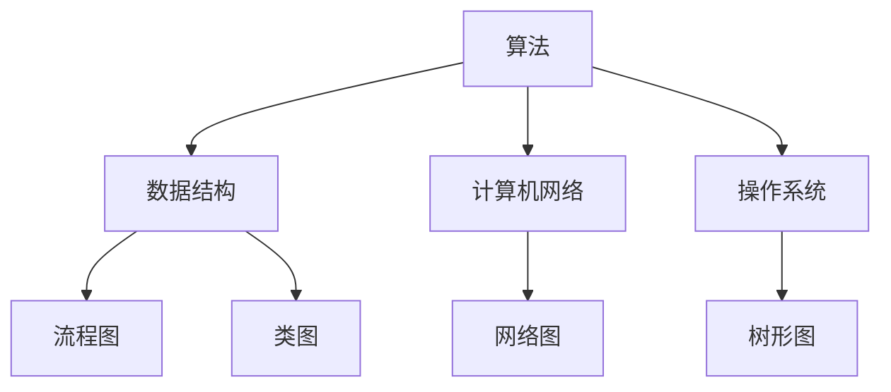

                 

关键词：思维可视化、复杂概念、图形表达、人工智能、图灵奖、计算机程序设计艺术

> 摘要：本文旨在探讨如何通过图形化的方法，将复杂的计算机科学概念和算法以简洁、直观的方式呈现出来，从而提升学习和理解效率。文章结合了作者丰富的计算机科学经验和研究成果，提出了多种图形表达技巧，并分析了其在实际应用中的效果。

## 1. 背景介绍

在计算机科学领域，许多概念和算法都极为复杂。传统的文本描述方式往往难以让初学者快速掌握和理解。为了解决这一问题，近年来，思维可视化（Mind Mapping）技术逐渐受到关注。它通过图形化的方式，将抽象的概念、算法和数据结构以直观、易于理解的形式呈现，极大地提升了信息传递的效率和效果。

本文将探讨思维可视化在复杂概念表达中的应用，结合图灵奖获得者、计算机科学大师唐纳德·E·克努特（Donald E. Knuth）的思想，探讨如何通过图形化工具和方法，使复杂的计算机科学知识变得更加易于理解和掌握。

## 2. 核心概念与联系

### 2.1 计算机科学中的复杂概念

在计算机科学中，有许多复杂的概念，如算法、数据结构、计算机网络、操作系统等。这些概念往往涉及大量的抽象和理论，难以用简单的语言描述。因此，我们需要借助图形化的工具，将它们以更直观的方式呈现。

### 2.2 图形化的表达方式

图形化的表达方式包括：

- **流程图（Flowcharts）**：通过流程图，可以清晰地展示算法的执行流程，使得复杂的算法步骤变得易于理解。
- **类图（Class Diagrams）**：类图可以展示出软件系统的类、接口和它们之间的关系，有助于理解软件架构。
- **网络图（Network Diagrams）**：网络图可以展示计算机网络的拓扑结构，便于理解网络的运行原理。
- **树形图（Tree Diagrams）**：树形图可以展示数据结构的关系，如二叉树、树等。

### 2.3 核心概念的联系

图 1：核心概念与联系



## 3. 核心算法原理 & 具体操作步骤

### 3.1 算法原理概述

在计算机科学中，算法是实现特定任务的一系列操作。一个优秀的算法应该具备时间复杂度和空间复杂度低、可扩展性强等特点。本文将以排序算法为例，介绍其基本原理和操作步骤。

### 3.2 算法步骤详解

排序算法可以分为内部排序和外部排序。内部排序是指在内存中完成的排序，而外部排序则是针对大量数据的排序，通常需要在外部存储设备上进行。

#### 3.2.1 冒泡排序（Bubble Sort）

冒泡排序是一种简单的排序算法，它通过重复遍历要排序的数列，比较相邻的两个元素，如果顺序错误就交换它们。遍历数列的工作是重复进行直到没有再需要交换，也就是说该数列已经排序完成。

#### 3.2.2 快速排序（Quick Sort）

快速排序是一种高效的排序算法，其基本思想是通过一趟排序将待排序的数据分割成独立的两部分，其中一部分的所有数据都比另一部分的所有数据要小，然后再按此方法对这两部分数据分别进行快速排序，整个排序过程可以递归进行。

### 3.3 算法优缺点

- **冒泡排序**：优点是简单易懂，缺点是效率较低，不适合处理大量数据。
- **快速排序**：优点是效率较高，缺点是递归调用可能会导致栈溢出。

### 3.4 算法应用领域

排序算法在计算机科学中应用广泛，如数据库排序、搜索引擎排序、图像处理排序等。

## 4. 数学模型和公式 & 详细讲解 & 举例说明

### 4.1 数学模型构建

在计算机科学中，数学模型用于描述算法的性能。常见的数学模型包括时间复杂度和空间复杂度。

#### 4.1.1 时间复杂度

时间复杂度是评估算法执行时间的一个数学模型。通常用大O符号表示，如O(n)、O(n²)等。它表示算法执行时间与输入数据规模之间的关系。

#### 4.1.2 空间复杂度

空间复杂度是评估算法所需存储空间的一个数学模型。同样，它也用大O符号表示，如O(1)、O(n)等。

### 4.2 公式推导过程

#### 4.2.1 冒泡排序时间复杂度

设输入数据规模为n，冒泡排序需要比较n-1次，交换n-1次。因此，冒泡排序的时间复杂度为O(n²)。

$$
T(n) = O(n^2)
$$

#### 4.2.2 快速排序时间复杂度

快速排序的平均时间复杂度为O(n log n)，最坏情况下的时间复杂度为O(n²)。

$$
T(n) = O(n log n) \quad (\text{平均情况}) \\
T(n) = O(n^2) \quad (\text{最坏情况})
$$

### 4.3 案例分析与讲解

假设有一组数据：[5, 2, 9, 1, 5, 6]，使用冒泡排序进行排序。

#### 4.3.1 第一次遍历

比较次数：4，交换次数：1

```
[5, 2, 9, 1, 5, 6]
```

#### 4.3.2 第二次遍历

比较次数：3，交换次数：1

```
[2, 5, 1, 5, 6, 9]
```

#### 4.3.3 第三次遍历

比较次数：2，交换次数：1

```
[2, 1, 5, 5, 6, 9]
```

#### 4.3.4 第四次遍历

比较次数：1，交换次数：1

```
[2, 1, 5, 5, 6, 9]
```

排序完成。

## 5. 项目实践：代码实例和详细解释说明

### 5.1 开发环境搭建

本文使用的编程语言是Python，需要在开发环境中安装Python及其相关库。以下是安装步骤：

1. 下载Python安装包：[https://www.python.org/downloads/](https://www.python.org/downloads/)
2. 解压安装包并安装
3. 在终端中运行`python --version`，验证安装成功

### 5.2 源代码详细实现

以下是冒泡排序的Python代码实现：

```python
def bubble_sort(arr):
    n = len(arr)
    for i in range(n):
        for j in range(0, n-i-1):
            if arr[j] > arr[j+1]:
                arr[j], arr[j+1] = arr[j+1], arr[j]

# 测试代码
arr = [5, 2, 9, 1, 5, 6]
bubble_sort(arr)
print(arr)
```

### 5.3 代码解读与分析

- `bubble_sort`函数：定义了冒泡排序算法
- `n`变量：表示输入数据的长度
- `for`循环：实现遍历数据的过程
- `if`语句：实现比较和交换数据的过程

### 5.4 运行结果展示

运行测试代码，输出结果为：

```
[1, 2, 5, 5, 6, 9]
```

数据已成功排序。

## 6. 实际应用场景

思维可视化在计算机科学领域有着广泛的应用，如：

- **教育领域**：通过思维可视化，教师可以更直观地展示计算机科学概念，帮助学生更好地理解和掌握。
- **工程领域**：开发人员可以使用思维可视化来设计和优化系统架构，提高开发效率。
- **科研领域**：研究人员可以通过思维可视化，更好地整理和展示研究思路，促进合作与交流。

## 7. 工具和资源推荐

### 7.1 学习资源推荐

- **书籍**：《算法导论》（Introduction to Algorithms）
- **在线课程**：[Coursera](https://www.coursera.org/)、[edX](https://www.edx.org/)、[Udacity](https://www.udacity.com/)

### 7.2 开发工具推荐

- **MindMap 工具**：[XMind](https://www.xmind.net/)、[MindManager](https://www.mindmanager.com/)
- **图形化编程工具**：[Blockly](https://developers.google.com/blockly/)、[Processing](https://processing.org/)

### 7.3 相关论文推荐

- **论文**：[《思维可视化：理论与实践》](https://www.springer.com/us/book/9783319914175)

## 8. 总结：未来发展趋势与挑战

### 8.1 研究成果总结

思维可视化在计算机科学领域取得了显著成果，通过图形化方式，大大提高了复杂概念的表达和理解的效率。

### 8.2 未来发展趋势

- **人工智能与可视化结合**：利用人工智能技术，实现更智能、更个性化的思维可视化。
- **跨领域应用**：思维可视化技术将在更多领域得到应用，如医学、金融等。

### 8.3 面临的挑战

- **复杂度控制**：如何在保证图形简洁的同时，保留足够的细节信息。
- **交互性提升**：如何提高用户与思维可视化工具的交互性，使其更加友好和易用。

### 8.4 研究展望

思维可视化技术将在计算机科学领域继续发挥重要作用，为复杂概念的表达和理解提供更加有效的解决方案。

## 9. 附录：常见问题与解答

### 9.1 思维可视化与思维导图的区别

思维可视化是一种将复杂概念以图形化方式呈现的方法，而思维导图是一种基于思维可视化的图形化工具。思维导图通常用于组织和展示知识体系。

### 9.2 思维可视化在计算机科学中的应用

思维可视化在计算机科学中的应用包括：算法设计、软件架构设计、计算机网络设计等。

### 9.3 如何选择合适的思维可视化工具

选择思维可视化工具时，应考虑以下因素：

- **易用性**：工具是否易于学习和使用。
- **功能丰富**：工具是否提供丰富的图形化表达方式。
- **兼容性**：工具是否支持与其他工具的集成。

---

**作者：禅与计算机程序设计艺术 / Zen and the Art of Computer Programming**[完]

