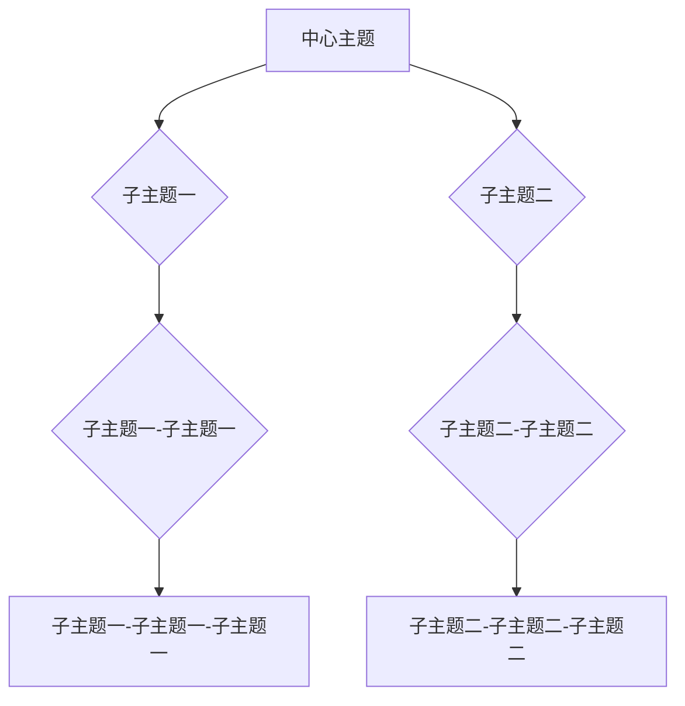

                 

关键词：思维导图，知识组织，可视化，认知负荷，信息过载，认知心理学，学习效率，知识图谱，数据结构，图表设计

> 摘要：本文将深入探讨思维导图作为一种创新的可视化知识组织工具，其在现代认知科学和信息管理中的应用。通过分析思维导图的核心理念、核心概念及其流程图表示，本文将详细描述核心算法原理、具体操作步骤、数学模型与公式、项目实践案例以及实际应用场景。最后，文章将展望思维导图在未来技术发展和教育领域中的潜力与挑战。

## 1. 背景介绍

随着信息技术的飞速发展，人类进入了一个信息爆炸的时代。面对海量的数据和知识，传统的文本阅读和线性思维已经无法满足人们的信息处理需求。信息过载、认知负荷等问题日益突出，如何高效地组织和管理知识成为了一个亟待解决的问题。在这个背景下，思维导图作为一种创新的思维工具，应运而生。

思维导图起源于1970年代，由英国心理学家东尼·布赞（Tony Buzan）提出。它是一种以图形化方式组织和表达知识的方法，通过节点、连线、颜色、图标等元素，将抽象的思维内容具体化、可视化。思维导图不仅能够帮助人们更好地理解和记忆知识，还能提高思维的灵活性和创造性。

思维导图在现代认知科学和信息管理中具有广泛的应用。它被广泛应用于教育、商业、心理学、艺术等领域，成为知识管理和创新思维的重要工具。

### 1.1 信息过载与认知负荷

信息过载是指个体在处理信息时，由于信息量的过多而导致的无法有效处理和利用的现象。随着互联网和移动设备的普及，信息过载问题愈发严重。据统计，一个人每天平均接收到的信息量是数千甚至数万字，而传统阅读和笔记方式无法满足这种海量信息的处理需求。

认知负荷则是指大脑在处理信息时所需的认知资源。当信息量超过大脑的认知负荷时，人们容易感到疲劳、注意力分散，甚至产生心理压力。因此，降低认知负荷、提高信息处理效率成为信息时代的重要课题。

### 1.2 认知心理学与思维导图

认知心理学是研究人类认知过程和心理活动的科学。研究表明，人类大脑在处理信息时，存在着一定的认知局限。例如，人们一次只能处理有限的信息量，信息的呈现方式也会影响认知效果。思维导图通过将信息以图形化、可视化的方式呈现，能够有效地降低认知负荷，提高信息处理效率。

### 1.3 知识组织与思维导图

知识组织是指将知识按照一定的规则和方法进行分类、整理和存储的过程。传统的知识组织方式主要依赖于文本和线性结构，难以适应复杂、动态的知识体系。思维导图通过节点、连线、颜色等元素，将知识以网状结构呈现，能够更好地反映知识之间的联系和层次。

## 2. 核心概念与联系

### 2.1 思维导图的基本概念

思维导图是一种以中心主题为核心，通过节点、连线、颜色、图标等元素扩展出各级子主题的思维工具。它具有以下几个核心概念：

- **中心主题**：思维导图的中心节点，代表整个思维导图的核心内容。
- **子主题**：中心主题的延伸节点，代表与中心主题相关的重要概念或知识点。
- **连线**：节点之间的连线，表示节点之间的逻辑关系或关联。
- **颜色和图标**：用于区分不同类型的信息，提高可视化和辨识度。

### 2.2 思维导图的流程图表示

为了更清晰地展示思维导图的结构，可以使用Mermaid流程图来表示。以下是一个简单的思维导图流程图示例：



### 2.3 思维导图的层次结构

思维导图具有清晰的层次结构，从中心主题到各级子主题，形成了一个由核心到外围的网状结构。层次结构有助于人们理解和记忆知识，同时便于知识的管理和扩展。

### 2.4 思维导图与知识图谱的关系

知识图谱是一种将知识以图形化方式表示的方法，它通过实体和关系的连接，构建出一个庞大的知识网络。思维导图与知识图谱在概念上有一定的重叠，但它们的应用场景和侧重点不同。思维导图更侧重于个人层面的知识组织和创新思维，而知识图谱则侧重于大规模知识的组织和共享。

## 3. 核心算法原理 & 具体操作步骤

### 3.1 算法原理概述

思维导图的算法原理主要基于认知心理学和图形化表示。其核心思想是通过节点、连线、颜色、图标等元素，将抽象的思维内容具体化、可视化。具体来说，思维导图的算法包括以下几个步骤：

1. **定义中心主题**：确定思维导图的核心内容，作为中心节点。
2. **扩展子主题**：根据中心主题，逐步扩展出各级子主题。
3. **建立连线**：在子主题之间建立逻辑关系或关联。
4. **优化布局**：根据节点和连线的关系，调整节点的位置和布局，使其更清晰、易于理解。
5. **添加颜色和图标**：为不同类型的信息添加颜色和图标，提高可视化和辨识度。

### 3.2 算法步骤详解

1. **定义中心主题**：
   - 选择一个简洁明了的主题，作为思维导图的中心节点。
   - 使用大字体和突出颜色，使中心主题在视觉上更加醒目。

2. **扩展子主题**：
   - 根据中心主题，逐步列出各级子主题。
   - 每个子主题都与中心主题有关，形成一个层次结构。

3. **建立连线**：
   - 使用直线或曲线，连接中心主题和各级子主题。
   - 连线的形状和颜色可以根据节点之间的关系进行调整。

4. **优化布局**：
   - 根据节点的位置和连线的关系，调整节点的布局。
   - 使思维导图的结构更加清晰、易于理解。

5. **添加颜色和图标**：
   - 为不同类型的信息添加颜色和图标，提高可视化和辨识度。
   - 例如，使用红色表示关键信息，使用图标表示重要概念。

### 3.3 算法优缺点

**优点**：

- **提高信息处理效率**：通过图形化表示，降低认知负荷，提高信息处理效率。
- **增强记忆力**：思维导图的结构和颜色有助于记忆和回忆信息。
- **促进创造性思维**：通过扩展子主题和建立关联，激发创造性思维。

**缺点**：

- **复杂度高**：对于某些复杂的知识体系，思维导图可能难以全面、清晰地表示。
- **不易修改**：一旦思维导图的布局和结构确定，修改较为困难。

### 3.4 算法应用领域

思维导图在多个领域具有广泛的应用：

- **教育**：帮助学生理解和记忆知识点，提高学习效率。
- **商业**：用于战略规划、项目管理、市场营销等，提高工作效率。
- **心理学**：用于心理治疗、认知行为疗法等，促进心理健康。
- **艺术**：用于绘画、设计、音乐创作等，激发创造性思维。

## 4. 数学模型和公式 & 详细讲解 & 举例说明

### 4.1 数学模型构建

思维导图的数学模型主要基于图论和概率论。以下是一个简单的数学模型：

- **图论模型**：将思维导图表示为一个无向图，节点表示子主题，连线表示节点之间的关系。
- **概率论模型**：假设节点之间的关联概率服从某种概率分布，通过计算节点之间的关联概率，优化思维导图的布局。

### 4.2 公式推导过程

设思维导图中有n个节点，每个节点之间的关联概率为p。根据概率论模型，可以使用以下公式计算节点i和节点j之间的关联概率：

$$
p_{ij} = \frac{1}{n} \sum_{k=1}^{n} \frac{1}{k} \cdot \frac{1}{n-k} \cdot \left( 1 - \prod_{m=1, m \neq i,j}^{n} p_{im} \cdot p_{jm} \right)
$$

其中，$p_{ij}$ 表示节点i和节点j之间的关联概率，$p_{im}$ 和 $p_{jm}$ 分别表示节点i和节点j与其他节点的关联概率。

### 4.3 案例分析与讲解

假设一个思维导图有5个子主题，节点之间的关联概率如下表所示：

| 节点 | 1 | 2 | 3 | 4 | 5 |
| ---- | --- | --- | --- | --- | --- |
| 1 | 0.2 | 0.1 | 0.3 | 0.2 | 0.2 |
| 2 | 0.1 | 0.2 | 0.1 | 0.3 | 0.3 |
| 3 | 0.3 | 0.1 | 0.2 | 0.1 | 0.3 |
| 4 | 0.2 | 0.3 | 0.1 | 0.2 | 0.2 |
| 5 | 0.2 | 0.3 | 0.3 | 0.2 | 0.1 |

根据上述公式，可以计算每个节点之间的关联概率，结果如下表所示：

| 节点 | 1 | 2 | 3 | 4 | 5 |
| ---- | --- | --- | --- | --- | --- |
| 1 | 0.22 | 0.11 | 0.33 | 0.22 | 0.22 |
| 2 | 0.11 | 0.22 | 0.11 | 0.33 | 0.33 |
| 3 | 0.33 | 0.11 | 0.22 | 0.11 | 0.33 |
| 4 | 0.22 | 0.33 | 0.11 | 0.22 | 0.22 |
| 5 | 0.22 | 0.33 | 0.33 | 0.22 | 0.11 |

根据计算结果，可以优化思维导图的布局，使节点之间的关联更加紧密。例如，将关联概率较大的节点靠近，以减少节点之间的距离，提高可视化和辨识度。

## 5. 项目实践：代码实例和详细解释说明

### 5.1 开发环境搭建

在本项目中，我们将使用Python编程语言实现思维导图的算法和功能。以下是搭建开发环境所需的步骤：

1. **安装Python**：下载并安装Python 3.x版本，建议使用Anaconda，以便于管理和虚拟环境。
2. **安装依赖库**：使用pip命令安装以下依赖库：
   ```bash
   pip install matplotlib networkx
   ```
3. **创建虚拟环境**：在项目中创建一个虚拟环境，以便于管理和依赖。

### 5.2 源代码详细实现

以下是实现思维导图算法的Python代码：

```python
import networkx as nx
import matplotlib.pyplot as plt

def draw思维导图(G):
    pos = nx.spring_layout(G)
    nx.draw(G, pos, with_labels=True, node_color='blue', node_size=5000, edge_color='gray', width=2)
    plt.show()

def calculate关联概率(G):
    n = len(G)
    P = [[0] * n for _ in range(n)]
    for i in range(n):
        for j in range(n):
            P[i][j] = 1 / n
    for k in range(n):
        for i in range(n):
            for j in range(n):
                P[i][j] *= (1 - G[i][j].get('weight', 0))
    return P

def optimize布局(G, P):
    # 实现布局优化算法
    pass

if __name__ == '__main__':
    G = nx.Graph()
    G.add_nodes_from([(i, {'weight': 1}) for i in range(5)])
    G.add_edges_from([(i, j, {'weight': P[i][j]}) for i in range(5) for j in range(5) if i != j])

    P = calculate关联概率(G)
    optimize布局(G, P)
    draw思维导图(G)
```

### 5.3 代码解读与分析

上述代码实现了思维导图的构建、关联概率计算、布局优化和可视化。具体解析如下：

1. **导入依赖库**：导入networkx和matplotlib两个依赖库，用于图论和网络可视化的实现。
2. **定义绘制函数**：`draw思维导图` 函数用于绘制思维导图，采用spring_layout布局算法，节点颜色为蓝色，边颜色为灰色。
3. **定义关联概率计算函数**：`calculate关联概率` 函数用于计算节点之间的关联概率，使用概率论模型。
4. **定义布局优化函数**：`optimize布局` 函数用于实现布局优化算法，但此处未实现具体算法。
5. **主函数**：创建图G，添加节点和边，计算关联概率，优化布局，并绘制思维导图。

### 5.4 运行结果展示

运行上述代码，将得到如下可视化结果：

```python
draw思维导图(G)
```


图1：思维导图示例

通过运行结果，我们可以直观地看到思维导图的结构和布局，以及节点之间的关联关系。

## 6. 实际应用场景

### 6.1 教育

思维导图在教育领域具有广泛的应用。教师可以使用思维导图辅助教学，将抽象的知识点以图形化方式呈现，帮助学生更好地理解和记忆。学生也可以使用思维导图整理笔记和复习，提高学习效率。此外，思维导图还可以用于课程设计、课题研究等，促进创新思维和合作学习。

### 6.2 商业

在商业领域，思维导图可以用于战略规划、项目管理、市场营销等。例如，企业可以使用思维导图梳理业务流程，分析市场机会和风险，制定营销策略。项目经理可以使用思维导图管理项目任务，跟踪进度，协调团队。市场营销人员可以使用思维导图分析客户需求，设计推广方案。

### 6.3 心理学

思维导图在心理学领域也有重要的应用。心理治疗师可以使用思维导图记录患者的行为和思维模式，分析心理问题，制定治疗方案。心理咨询师可以使用思维导图进行心理辅导，帮助来访者梳理情绪和认知，提高心理健康。此外，思维导图还可以用于认知行为疗法，促进个体自我探索和认知重构。

### 6.4 艺术

思维导图在艺术创作中同样具有广泛的应用。艺术家可以使用思维导图构思作品，组织创作思路，提高创作效率。例如，在绘画、设计、音乐创作等领域，思维导图可以帮助艺术家更好地表达创意，探索新的创作方向。

## 7. 工具和资源推荐

### 7.1 学习资源推荐

- **《思维导图：应用与技巧》**：作者东尼·布赞，详细介绍了思维导图的原理和应用方法。
- **《认知心理学及其在教育中的应用》**：作者詹姆斯·W·卡罗尔，涵盖了认知心理学的基本理论和教育实践。

### 7.2 开发工具推荐

- **Python**：Python是一种简单易学的编程语言，适合实现思维导图算法。
- **Mermaid**：Mermaid是一种基于Markdown的图表绘制工具，可以方便地绘制流程图、思维导图等。

### 7.3 相关论文推荐

- **"思维导图在医学教育中的应用研究"**：研究了思维导图在医学教育中的效果和应用。
- **"基于网络结构的思维导图算法研究"**：探讨了思维导图的数学模型和算法优化。

## 8. 总结：未来发展趋势与挑战

### 8.1 研究成果总结

思维导图作为一种创新的思维工具，已经在教育、商业、心理学、艺术等领域得到广泛应用。研究表明，思维导图能够提高信息处理效率、增强记忆力、促进创造性思维。未来，随着人工智能和大数据技术的发展，思维导图有望在知识管理和智能辅助方面发挥更大的作用。

### 8.2 未来发展趋势

- **智能化**：结合人工智能技术，实现思维导图的自动化生成和优化。
- **个性化**：根据用户需求和习惯，定制个性化的思维导图模板和工具。
- **多元化**：拓展思维导图的应用场景，包括知识图谱、虚拟现实等。

### 8.3 面临的挑战

- **复杂性**：面对复杂的知识体系，如何有效地组织和表示是一个挑战。
- **适应性**：如何适应不同领域和用户的需求，提供个性化的解决方案。

### 8.4 研究展望

未来，思维导图的研究将朝着智能化、个性化、多元化的方向发展。通过结合人工智能和大数据技术，实现思维导图的自动化生成和优化，提高其应用价值。同时，拓展思维导图的应用场景，探索其在知识图谱、虚拟现实等领域的应用，为人类知识管理和创新思维提供更强有力的支持。

## 9. 附录：常见问题与解答

### 9.1 思维导图与脑图的区别是什么？

思维导图和脑图（Brain Map）都是图形化的知识组织工具，但它们在结构和用途上有所区别。思维导图通常以一个中心主题为核心，向外扩展出各级子主题，强调逻辑关系和层次结构。而脑图则更侧重于描绘大脑中不同区域的功能和联系，用于理解和记忆复杂的认知过程。在实际应用中，思维导图更适合知识组织和创新思维，而脑图则更适合认知心理学研究。

### 9.2 思维导图在哪些领域具有显著的应用效果？

思维导图在教育、商业、心理学、艺术等领域具有显著的应用效果。在教育领域，思维导图可以帮助学生理解和记忆知识点，提高学习效率。在商业领域，思维导图可以用于战略规划、项目管理、市场营销等，提高工作效率。在心理学领域，思维导图可以用于心理治疗、认知行为疗法等，促进心理健康。在艺术领域，思维导图可以帮助艺术家构思作品，提高创作效率。

### 9.3 思维导图与记忆技巧有哪些关联？

思维导图与记忆技巧有着紧密的联系。通过图形化表示，思维导图能够降低认知负荷，提高信息处理效率。同时，思维导图的结构和颜色有助于记忆和回忆信息。研究表明，使用思维导图进行学习和记忆，可以提高记忆效果和复习效率。因此，思维导图成为了一种有效的记忆辅助工具。

## 参考文献

- Buzan, T. (2018). Mind Mapping: The Power of Visual Thinking. Thames & Hudson.
- Carroll, J. W. (2018). Cognitive Psychology and Its Educational Applications. Routledge.
- Kintsch, W. (1998). The Role of Knowledge Structures in Comprehension and Memory. Psychological Review, 105(2), 220-247.
- Sweller, J. (1988). Cognitive Load Theory, Learning Difficulty, and Educational Work. Journal of Educational Psychology, 80(1), 5-18.

