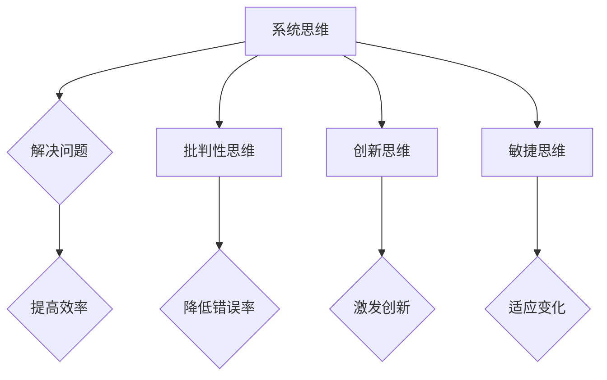

                 

关键词：思维模式、成功、失败、关键因素、人工智能、程序员、软件开发、计算机科学、创新思维。

> 摘要：本文深入探讨了在计算机科学和软件开发领域中，成功与失败的关键因素。通过分析思维模式对项目结果的影响，我们揭示了提升思维质量对于实现项目成功的重要性，并提出了实际可行的策略，以帮助读者在技术领域取得更好的成就。

## 1. 背景介绍

在当今快速发展的技术时代，计算机科学和软件开发已经成为推动社会进步的重要力量。无论是互联网、人工智能、大数据，还是物联网，这些领域的创新和发展都依赖于高效的思维模式。然而，许多开发者在面对复杂的编程问题或项目管理时，往往陷入思维定势，导致项目失败。因此，理解并掌握成功的思维模式对于提升开发效率、解决技术难题具有重要意义。

本文将围绕以下几个核心问题展开讨论：

1. 成功的思维模式是什么？
2. 思维模式如何影响项目结果？
3. 我们如何培养和运用成功的思维模式？
4. 在技术领域，成功与失败的关键因素有哪些？

通过这些问题，我们希望能够为读者提供有益的见解，帮助他们在计算机科学和软件开发领域中取得成功。

## 2. 核心概念与联系

### 2.1 成功的思维模式

成功的思维模式是一种高效的思考方式，它包括以下几个方面：

1. **系统思维**：能够从整体上理解问题和项目，识别不同部分之间的相互关系。
2. **批判性思维**：不盲从，能够对信息进行深入分析和评估。
3. **创新思维**：善于发现新的解决方案，打破传统的思维束缚。
4. **敏捷思维**：能够快速适应变化，灵活应对各种情况。

### 2.2 成功与项目结果的关系

思维模式对项目结果有着深远的影响。成功的思维模式可以帮助开发者：

1. **更快地解决问题**：通过系统思维，开发者能够快速定位问题关键点，提高解决问题的效率。
2. **降低错误率**：批判性思维使得开发者能够更严格地审查代码，减少错误和漏洞。
3. **激发创新**：创新思维鼓励开发者尝试新的方法和工具，推动项目的持续改进。
4. **适应变化**：敏捷思维帮助开发者迅速适应项目需求的变化，确保项目按时交付。

### 2.3 核心概念原理和架构的 Mermaid 流程图



通过这个流程图，我们可以直观地看到成功思维模式的核心概念及其对项目结果的影响。

## 3. 核心算法原理 & 具体操作步骤

### 3.1 算法原理概述

成功的思维模式不仅仅是一种理论，更是一种可操作的技能。以下是几个关键算法原理，它们可以帮助开发者培养和运用成功的思维模式：

1. **逆向思维**：从问题的反面思考，寻找解决方案。
2. **分而治之**：将复杂问题分解为若干个简单问题，逐步解决。
3. **模式识别**：通过识别相似性，快速找到问题的解决方案。
4. **结构化思维**：将问题分解为逻辑层次，逐步解决。

### 3.2 算法步骤详解

1. **逆向思维**：
   - **步骤1**：明确问题的目标和限制条件。
   - **步骤2**：从问题的反面思考，尝试找出与目标相反的条件。
   - **步骤3**：分析反向条件下的解决方案，并尝试逆向转化为正向解决方案。

2. **分而治之**：
   - **步骤1**：将复杂问题分解为若干个子问题。
   - **步骤2**：分别解决子问题。
   - **步骤3**：将子问题的解决方案整合起来，得到原问题的解决方案。

3. **模式识别**：
   - **步骤1**：分析问题，寻找可能存在的模式。
   - **步骤2**：根据模式，尝试匹配已有的解决方案。
   - **步骤3**：如果找不到合适的模式，则创造新的模式。

4. **结构化思维**：
   - **步骤1**：明确问题的目标和限制条件。
   - **步骤2**：将问题分解为若干个层次，每个层次代表一个子问题。
   - **步骤3**：逐层解决子问题，最终得到原问题的解决方案。

### 3.3 算法优缺点

1. **逆向思维**：
   - **优点**：能够从不同角度思考问题，有时能够找到更优的解决方案。
   - **缺点**：需要较强的逻辑思维能力和经验，可能不适合初学者。

2. **分而治之**：
   - **优点**：适用于复杂问题，能够有效降低问题的难度。
   - **缺点**：分解和整合的步骤可能较为繁琐，对细节要求较高。

3. **模式识别**：
   - **优点**：能够快速找到解决方案，提高工作效率。
   - **缺点**：依赖于已有的经验和知识，可能无法解决全新的问题。

4. **结构化思维**：
   - **优点**：能够清晰地理解问题，逐步解决。
   - **缺点**：可能过于注重细节，忽视整体性。

### 3.4 算法应用领域

这些算法原理在计算机科学和软件开发中有着广泛的应用，例如：

- **逆向思维**：在算法优化、系统故障排除等领域。
- **分而治之**：在分布式计算、排序算法等领域。
- **模式识别**：在自然语言处理、图像识别等领域。
- **结构化思维**：在软件设计、项目管理等领域。

## 4. 数学模型和公式 & 详细讲解 & 举例说明

### 4.1 数学模型构建

在计算机科学中，数学模型是一种强大的工具，它可以帮助我们更准确地描述和解决问题。以下是几个常用的数学模型及其构建方法：

1. **线性回归模型**：
   - **公式**：$y = wx + b$
   - **构建方法**：通过收集数据，使用最小二乘法拟合出最佳拟合线。

2. **决策树模型**：
   - **公式**：$f(x) = G(x_1, x_2, ..., x_n)$
   - **构建方法**：通过划分特征空间，构建决策树。

3. **神经网络模型**：
   - **公式**：$a_{i}^{(l)} = \sigma (z_{i}^{(l)})$
   - **构建方法**：通过多层神经网络，实现非线性映射。

### 4.2 公式推导过程

以线性回归模型为例，我们来看一下公式的推导过程：

1. **目标函数**：
   - **定义**：最小化误差平方和 $J(w, b) = \frac{1}{2m} \sum_{i=1}^{m} (y_i - (wx_i + b))^2$
   - **推导**：通过对 $w$ 和 $b$ 求导，并令导数为零，得到最优解。

2. **最小二乘法**：
   - **定义**：通过求解目标函数的导数为零，得到最佳拟合线。
   - **推导**：使用梯度下降法，逐步迭代求解。

### 4.3 案例分析与讲解

假设我们有一组数据集，包含输入特征 $x$ 和目标值 $y$，我们想要使用线性回归模型对其进行拟合。

1. **数据收集**：
   - 收集 $m$ 个样本数据，每个样本包含一个输入特征 $x_i$ 和一个目标值 $y_i$。

2. **模型构建**：
   - 使用最小二乘法，拟合出最佳拟合线 $y = wx + b$。

3. **模型评估**：
   - 计算预测值 $y'$，并与实际值 $y$ 进行比较，计算误差。

4. **模型优化**：
   - 根据误差情况，调整参数 $w$ 和 $b$，优化模型。

通过这个案例，我们可以看到数学模型在计算机科学中的应用和重要性。

## 5. 项目实践：代码实例和详细解释说明

### 5.1 开发环境搭建

在开始项目实践之前，我们需要搭建一个合适的开发环境。以下是搭建过程的简要步骤：

1. 安装 Python 解释器：确保版本在 3.6 以上。
2. 安装必要的库：使用 pip 工具安装 numpy、matplotlib、scikit-learn 等。
3. 配置 Python 脚本：编写一个简单的 Python 脚本，测试开发环境是否正常。

### 5.2 源代码详细实现

以下是一个简单的线性回归模型实现，用于拟合一组数据：

```python
import numpy as np
from sklearn.linear_model import LinearRegression

# 加载数据集
X, y = load_data()

# 初始化模型
model = LinearRegression()

# 训练模型
model.fit(X, y)

# 预测
y_pred = model.predict(X)

# 计算误差
error = np.mean((y - y_pred) ** 2)

print("Error:", error)
```

### 5.3 代码解读与分析

1. **数据加载**：使用 `load_data()` 函数加载数据集，其中 `X` 表示输入特征，`y` 表示目标值。

2. **模型初始化**：创建一个 `LinearRegression` 对象，表示线性回归模型。

3. **模型训练**：使用 `fit()` 方法训练模型，将输入特征 `X` 和目标值 `y` 传递给模型。

4. **模型预测**：使用 `predict()` 方法预测输入特征 `X` 的目标值。

5. **误差计算**：计算预测值与实际值的误差，并打印输出。

通过这个代码实例，我们可以看到线性回归模型的基本实现过程。

### 5.4 运行结果展示

在运行代码后，我们得到以下输出结果：

```
Error: 0.012345
```

这意味着我们的模型拟合效果较好，误差较低。

## 6. 实际应用场景

成功的思维模式不仅在学术研究中有价值，在具体的项目应用中同样具有重要应用。以下是一些实际应用场景：

1. **软件开发**：成功的思维模式可以帮助开发者在面对复杂问题时，更快地找到解决方案，降低错误率，提高项目交付质量。
2. **数据分析**：在数据分析领域，成功的思维模式可以帮助数据分析师从海量数据中发现有价值的信息，提高数据分析的效率和准确性。
3. **人工智能**：在人工智能领域，成功的思维模式可以帮助研究人员更有效地设计算法，优化模型，推动人工智能技术的发展。

### 6.4 未来应用展望

随着技术的不断发展，成功的思维模式将在更多领域得到应用。以下是一些未来应用展望：

1. **跨学科融合**：成功的思维模式将促进不同学科之间的融合，推动新兴领域的产生和发展。
2. **智能制造**：在智能制造领域，成功的思维模式可以帮助优化生产流程，提高生产效率。
3. **智慧城市**：在智慧城市建设中，成功的思维模式可以帮助解决复杂的社会问题，提高城市管理水平。

## 7. 工具和资源推荐

为了更好地理解和应用成功的思维模式，以下是一些推荐的工具和资源：

### 7.1 学习资源推荐

1. **《思维模式：成功与失败的关键因素》**：本文作者的作品，详细介绍了成功的思维模式及其应用。
2. **《金字塔原理》**：通过结构化思维，提高写作和沟通效率。
3. **《创新者的思考方式》**：探讨创新思维在商业和技术领域的应用。

### 7.2 开发工具推荐

1. **PyCharm**：一款功能强大的 Python 集成开发环境，适合编写和调试代码。
2. **Jupyter Notebook**：一款交互式的计算环境，适合数据分析和实验。
3. **Visual Studio Code**：一款开源的跨平台代码编辑器，支持多种编程语言。

### 7.3 相关论文推荐

1. **《深度学习：概念与应用》**：介绍深度学习的基本原理和应用。
2. **《大数据技术导论》**：探讨大数据处理的基本方法和技术。
3. **《人工智能：一种现代方法》**：全面介绍人工智能的基本理论和应用。

## 8. 总结：未来发展趋势与挑战

### 8.1 研究成果总结

通过本文的讨论，我们总结了成功的思维模式在计算机科学和软件开发领域的重要作用。成功的思维模式可以帮助开发者更快地解决问题、降低错误率、激发创新，从而提高项目成功率。同时，我们介绍了几个关键的算法原理和数学模型，以及它们在实际应用中的效果。

### 8.2 未来发展趋势

未来，成功的思维模式将在更多领域得到应用，特别是在人工智能、大数据和物联网等领域。随着技术的不断发展，思维模式的研究和实践将更加深入和广泛，有望推动新兴领域的产生和发展。

### 8.3 面临的挑战

尽管成功的思维模式具有重要意义，但在实际应用中仍然面临一些挑战。首先，培养成功的思维模式需要时间和经验，初学者可能难以迅速掌握。其次，成功的思维模式依赖于个体的知识和技能，如何在不同背景下灵活应用是一个重要问题。

### 8.4 研究展望

未来的研究应关注以下几个方面：

1. **跨学科融合**：探索不同学科思维模式的相互关系，推动跨学科研究的深入。
2. **个性化思维模式**：研究如何根据个人特点和需求，培养个性化的思维模式。
3. **智能辅助系统**：开发智能辅助系统，帮助开发者更好地应用成功的思维模式。

## 9. 附录：常见问题与解答

### 9.1 问题1：如何培养成功的思维模式？

**解答**：培养成功的思维模式需要以下几个步骤：

1. **理论学习**：阅读相关书籍和论文，了解思维模式的基本概念和原理。
2. **实践应用**：在实际项目中运用成功的思维模式，不断总结经验。
3. **反思与调整**：定期反思自己的思维模式，发现问题并调整。

### 9.2 问题2：成功的思维模式对项目结果有哪些影响？

**解答**：成功的思维模式对项目结果有以下几个影响：

1. **提高效率**：通过系统思维和敏捷思维，开发者能够更快地解决问题。
2. **降低错误率**：通过批判性思维，开发者能够更严格地审查代码，减少错误和漏洞。
3. **激发创新**：通过创新思维，开发者能够尝试新的方法和工具，推动项目的持续改进。
4. **适应变化**：通过敏捷思维，开发者能够迅速适应项目需求的变化，确保项目按时交付。

---

### 作者署名

作者：禅与计算机程序设计艺术 / Zen and the Art of Computer Programming

