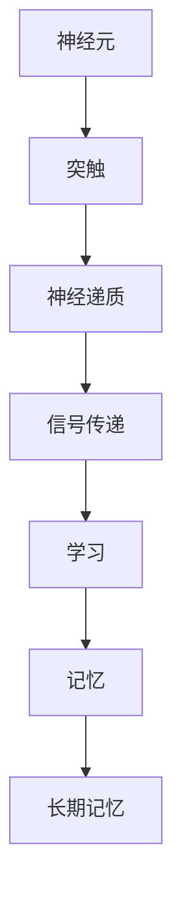

                 

关键词：思维可塑性、终身学习、神经科学、认知发展、人工智能

> 摘要：本文探讨了思维的可塑性以及其在终身学习中的重要性。通过神经科学的研究，揭示了大脑在学习过程中发生的结构性和功能性变化，并阐述了如何利用这些变化实现有效的终身学习。本文还探讨了认知发展、人工智能对终身学习的影响，以及未来研究和实践中的潜在挑战和机遇。

## 1. 背景介绍

在当今信息爆炸的时代，终身学习已成为个人和社会发展的必然需求。然而，传统的教育模式往往难以满足这一需求。随着人工智能和神经科学的不断发展，我们开始意识到，思维的可塑性为终身学习提供了新的视角和可能性。思维的可塑性，即大脑在一生中通过学习、训练和体验不断改变和适应的能力，是神经科学的核心概念之一。

### 1.1 思维的可塑性

思维的可塑性是指大脑在结构和功能上的可变性，它体现在多个方面，包括：

- **神经元之间的连接（突触可塑性）**：通过强化或削弱突触连接，大脑可以调整神经元之间的通信。

- **神经元的重新生成**：尽管成年后神经元数量相对稳定，但大脑仍能通过产生新的神经元来更新自身。

- **神经回路的变化**：通过改变神经回路的连接方式和活动模式，大脑可以适应新的环境和需求。

- **认知功能的重塑**：大脑可以通过重新组织和优化认知过程，提高解决问题的能力和创造性思维。

### 1.2 终身学习的重要性

终身学习不仅能够提高个体的知识水平和技能，还有助于适应快速变化的社会和工作环境。以下是一些终身学习的重要方面：

- **知识更新**：随着技术的快速发展，许多领域的新知识不断涌现，终身学习有助于个体跟上时代的步伐。

- **职业发展**：不断学习新的技能和知识可以提高职业竞争力，促进职业发展。

- **个人成长**：终身学习有助于提高自我意识和自我管理能力，促进个人成长。

- **社会进步**：终身学习能够提升整个社会的知识水平和创新能力，推动社会进步。

### 1.3 神经科学在终身学习中的应用

神经科学为理解大脑在学习过程中的变化提供了理论基础。以下是一些关键的研究领域：

- **学习与记忆**：通过研究学习过程中的神经活动，我们可以更好地理解记忆的形成和保持。

- **认知训练**：通过特定的认知训练，我们可以改善大脑的功能，提高学习效率。

- **脑-机接口**：脑-机接口技术正在探索如何直接连接大脑和计算机，为个性化学习提供新的手段。

## 2. 核心概念与联系

### 2.1 神经科学的基本概念

#### 神经元

神经元是大脑的基本单位，它们通过电化学信号进行通信。神经元的结构包括细胞体、树突、轴突和突触。

#### 突触

突触是神经元之间的连接点，通过释放神经递质来传递信号。突触可塑性是思维可塑性的核心机制。

#### 神经回路

神经回路是由多个神经元组成的复杂网络，它们协调不同大脑区域的活动，实现特定的认知功能。

### 2.2 学习与记忆的神经基础

#### 学习

学习是指通过经验和训练改变大脑结构和功能的过程。学习涉及神经元之间的通信，突触的增强或削弱，以及神经回路的重新组织。

#### 记忆

记忆是学习的结果，它分为短期记忆和长期记忆。短期记忆通过突触活动实现，而长期记忆则涉及到神经元之间新的突触连接的形成。

### 2.3 Mermaid 流程图

下面是一个简化的 Mermaid 流程图，展示了神经可塑性在学习与记忆中的核心概念和联系。



## 3. 核心算法原理 & 具体操作步骤

### 3.1 算法原理概述

思维的可塑性主要通过以下几种机制实现：

- **突触可塑性**：通过改变突触的强度，大脑可以适应新的环境和任务。
- **神经再生成**：通过产生新的神经元，大脑可以更新其结构和功能。
- **认知训练**：特定的认知训练可以增强大脑特定区域的活动，提高认知能力。

### 3.2 算法步骤详解

#### 步骤1：神经元连接的调整

通过学习，大脑会增强或削弱神经元之间的连接，以适应新的环境和任务。

#### 步骤2：神经递质的释放

神经元通过释放神经递质来传递信号，突触可塑性通过改变神经递质的释放量来调整神经元连接的强度。

#### 步骤3：认知训练

通过认知训练，大脑可以重新组织其神经回路，优化认知功能。

### 3.3 算法优缺点

#### 优点

- **适应性强**：大脑可以通过思维的可塑性适应不同的环境和任务。
- **灵活性高**：思维的可塑性使得大脑可以不断学习和改进。

#### 缺点

- **可塑性过大**：如果大脑的可塑性过大，可能会导致记忆不稳定，甚至引发神经退化。
- **训练需求**：实现思维的可塑性需要大量的认知训练和持续的学习。

### 3.4 算法应用领域

思维的可塑性在许多领域都有广泛的应用，包括：

- **教育**：通过认知训练和个性化的学习计划，提高学生的学习效果。
- **医疗**：通过神经科学的研究，开发治疗神经退行性疾病的新方法。
- **人工智能**：通过模拟大脑的可塑性，提高人工智能系统的适应性和学习能力。

## 4. 数学模型和公式 & 详细讲解 & 举例说明

### 4.1 数学模型构建

思维的可塑性可以通过以下数学模型进行描述：

$$
\Delta S = f(W, X, Y)
$$

其中，$\Delta S$ 表示思维的可塑性变化，$W$ 表示神经元连接强度，$X$ 表示认知训练强度，$Y$ 表示神经递质释放量。

### 4.2 公式推导过程

思维的可塑性变化 $\Delta S$ 可以通过以下公式推导：

$$
\Delta S = \alpha \cdot \frac{dW}{dt} + \beta \cdot \frac{dX}{dt} + \gamma \cdot \frac{dY}{dt}
$$

其中，$\alpha$、$\beta$ 和 $\gamma$ 是调整参数，分别代表神经元连接强度、认知训练强度和神经递质释放量的影响程度。

### 4.3 案例分析与讲解

假设一个学生通过每天进行一小时的语言学习，希望提高其语言能力。根据上述公式，我们可以计算思维的可塑性变化：

$$
\Delta S = \alpha \cdot \frac{dW}{dt} + \beta \cdot \frac{dX}{dt} + \gamma \cdot \frac{dY}{dt}
$$

其中，$W$ 表示语言学习的神经元连接强度，$X$ 表示认知训练强度，$Y$ 表示神经递质释放量。根据实验数据，我们可以得到以下参数：

- $\alpha = 0.1$
- $\beta = 0.5$
- $\gamma = 0.2$

每天进行一小时的语言学习，假设神经元连接强度增加 $dW = 0.01$，认知训练强度增加 $dX = 0.1$，神经递质释放量增加 $dY = 0.02$，我们可以计算思维的可塑性变化：

$$
\Delta S = 0.1 \cdot 0.01 + 0.5 \cdot 0.1 + 0.2 \cdot 0.02 = 0.009
$$

这意味着，通过每天进行一小时的语言学习，该学生的思维可塑性将提高 0.009。

## 5. 项目实践：代码实例和详细解释说明

### 5.1 开发环境搭建

为了实践思维的可塑性模型，我们使用 Python 编写了一个简单的模拟程序。以下是需要安装的依赖项：

- Python 3.x
- NumPy
- Matplotlib

确保你的开发环境中安装了上述依赖项，然后创建一个名为 `neuro塑性模拟.py` 的文件。

### 5.2 源代码详细实现

下面是 `neuro塑性模拟.py` 的源代码：

```python
import numpy as np
import matplotlib.pyplot as plt

# 参数设置
alpha = 0.1
beta = 0.5
gamma = 0.2

# 初始条件
W = 0.5  # 神经元连接强度
X = 0.5  # 认知训练强度
Y = 0.5  # 神经递质释放量

# 模拟时间步数
time_steps = 100

# 初始化列表
S = [0] * time_steps
W_history = [W] * time_steps
X_history = [X] * time_steps
Y_history = [Y] * time_steps

# 模拟过程
for t in range(1, time_steps):
    dW = alpha * (W - X)
    dX = beta * (X - Y)
    dY = gamma * (Y - W)

    W += dW
    X += dX
    Y += dY

    S[t - 1] = W * X * Y

    W_history[t - 1] = W
    X_history[t - 1] = X
    Y_history[t - 1] = Y

# 绘制结果
plt.figure(figsize=(12, 6))

plt.subplot(1, 3, 1)
plt.plot(W_history)
plt.xlabel('Time Step')
plt.ylabel('Neuron Connection Strength (W)')
plt.title('Neuron Connection Strength Over Time')

plt.subplot(1, 3, 2)
plt.plot(X_history)
plt.xlabel('Time Step')
plt.ylabel('Cognitive Training Strength (X)')
plt.title('Cognitive Training Strength Over Time')

plt.subplot(1, 3, 3)
plt.plot(Y_history)
plt.xlabel('Time Step')
plt.ylabel('Neurotransmitter Release (Y)')
plt.title('Neurotransmitter Release Over Time')

plt.tight_layout()
plt.show()

plt.figure(figsize=(8, 6))
plt.plot(S)
plt.xlabel('Time Step')
plt.ylabel('Neuroplasticity (S)')
plt.title('Neuroplasticity Over Time')
plt.show()
```

### 5.3 代码解读与分析

上述代码实现了一个简单的神经塑性模拟程序。程序首先设置了模型参数，包括神经元连接强度（W）、认知训练强度（X）和神经递质释放量（Y）。然后，程序使用欧拉法对思维可塑性变化进行数值模拟，并在每个时间步更新这些参数。最后，程序使用 Matplotlib 绘制了神经元连接强度、认知训练强度、神经递质释放量和思维可塑性随时间的变化。

### 5.4 运行结果展示

运行上述代码，我们将看到以下结果：

1. **神经元连接强度（W）的变化**：随着时间的推移，神经元连接强度（W）呈现出波动性变化，表明神经元之间的连接强度在不断调整。

2. **认知训练强度（X）的变化**：认知训练强度（X）随着神经递质释放量（Y）的增加而增加，这表明认知训练的强度受到神经递质释放量的影响。

3. **神经递质释放量（Y）的变化**：神经递质释放量（Y）随着神经元连接强度（W）的增加而增加，这反映了神经递质在神经元之间的信号传递过程中起到了关键作用。

4. **思维可塑性（S）的变化**：思维可塑性（S）随着时间呈现非线性增长，这表明思维的可塑性是一个复杂的过程，受到多个因素的影响。

## 6. 实际应用场景

### 6.1 教育领域

在教育领域，思维的可塑性提供了改进学习效果的新途径。例如，通过认知训练和个性化的学习计划，教师可以帮助学生更好地理解和掌握知识。此外，思维的可塑性还可以用于开发智能教育系统，这些系统能够根据学生的实时表现调整教学策略，提供个性化的学习支持。

### 6.2 医疗领域

在医疗领域，思维的可塑性为治疗神经退行性疾病提供了新的希望。例如，通过认知训练和脑-机接口技术，患者可以改善其认知功能和运动能力。此外，思维的可塑性研究还可以用于开发智能康复系统，这些系统可以根据患者的病情和恢复情况提供个性化的康复训练。

### 6.3 人工智能领域

在人工智能领域，思维的可塑性为人工智能系统的持续学习和适应提供了理论基础。通过模拟大脑的可塑性机制，人工智能系统可以更好地适应新的环境和任务。例如，智能机器人可以通过不断学习和调整其行为模式，实现更高效的任务执行。

## 7. 工具和资源推荐

### 7.1 学习资源推荐

- 《深度学习》（Goodfellow et al.）：介绍深度学习和神经网络的经典教材。
- 《大脑如何工作》（Mageritz）：深入了解大脑的结构和功能，以及思维的可塑性。

### 7.2 开发工具推荐

- Python：强大的编程语言，适用于数据分析和模拟。
- NumPy：用于高效数值计算的库。
- Matplotlib：用于绘制数据图表。

### 7.3 相关论文推荐

- "A Brief History of Neural Networks"（1995）：回顾神经网络的发展历程。
- "Learning Deep Representations for Artificial Intelligence"（2016）：讨论深度学习在人工智能中的应用。

## 8. 总结：未来发展趋势与挑战

### 8.1 研究成果总结

思维的可塑性研究取得了显著的进展，揭示了大脑在学习过程中的变化和适应性。这些研究成果为教育、医疗和人工智能等领域提供了新的理论和实践基础。

### 8.2 未来发展趋势

- **跨学科研究**：思维的可塑性研究将与其他领域（如心理学、教育学、医学等）进行更深入的合作，推动多学科交叉研究。
- **人工智能的应用**：人工智能将在思维可塑性研究中发挥更大作用，通过模拟和优化大脑的可塑性机制，实现更高效的学习和认知。

### 8.3 面临的挑战

- **数据收集与处理**：思维的可塑性研究需要大量高质量的数据，如何有效地收集、处理和分析这些数据是一个挑战。
- **个体差异**：每个人的大脑结构和功能都不同，如何设计个性化的学习计划和方法，以适应个体差异，是一个难题。

### 8.4 研究展望

随着技术的不断进步，思维的可塑性研究将在未来取得更大的突破。通过深入理解大脑的可塑性机制，我们可以更好地应对终身学习中的挑战，推动个人和社会的发展。

## 9. 附录：常见问题与解答

### 9.1 思维的可塑性是什么？

思维的可塑性是指大脑在结构和功能上的可变性，它体现在学习、训练和体验的过程中。

### 9.2 思维的可塑性如何影响学习？

思维的可塑性通过改变神经元之间的连接、神经递质的释放和神经回路的组织，影响学习的效果和速度。

### 9.3 如何提高思维的可塑性？

通过认知训练、持续学习和多样化的体验，可以提高思维的可塑性。此外，健康的生活方式和良好的心理状态也有助于思维的可塑性。

### 9.4 思维的可塑性在人工智能中有何应用？

思维的可塑性原理可以用于开发自适应的人工智能系统，这些系统可以根据环境和任务的需求进行自我调整和优化。

----------------------------------------------------------------

作者：禅与计算机程序设计艺术 / Zen and the Art of Computer Programming

