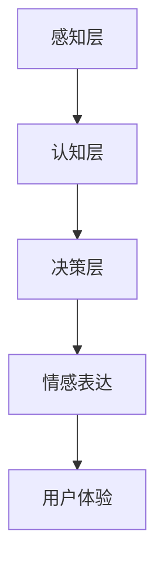

                 

关键词：情感机器人、商业应用、人工情感、AI、心理学、技术创业

> 摘要：随着人工智能技术的快速发展，情感机器人的研究和应用日益受到关注。本文将探讨情感机器人在商业领域的潜力，分析其核心概念、算法原理、数学模型及其在实际应用中的成功案例。同时，我们将展望未来发展趋势，并针对技术创业提出一些建议。

## 1. 背景介绍

近年来，人工智能（AI）技术取得了令人瞩目的进展，尤其是机器学习、自然语言处理和计算机视觉等领域。随着技术的进步，人们开始思考如何将AI应用于更加贴近人类情感需求的场景中。情感机器人应运而生，它们能够通过模拟人类的情感和行为，为用户提供更加自然、个性化的服务。

情感机器人是一种集成了人工智能、自然语言处理、机器学习、情感计算等多种技术的人工智能系统。它们能够理解、感知并模拟人类的情感，通过与用户的互动提升用户体验，为企业和个人创造价值。在商业领域，情感机器人的应用前景广阔，可以从以下几个方面进行探讨：

1. **客户服务**：情感机器人可以模拟客服代表，为用户提供更加友好、高效的客户服务。通过与用户进行自然语言对话，它们能够快速理解用户需求，提供针对性的解决方案。
2. **营销与推广**：情感机器人可以根据用户情感和行为数据，制定个性化的营销策略，提高营销效果和转化率。
3. **心理健康**：情感机器人可以为用户提供心理健康服务，如情绪监测、心理疏导和心理咨询等，帮助用户改善心理健康状况。
4. **教育与培训**：情感机器人可以模拟真实的教学场景，为用户提供个性化的教育资源和培训服务，提高学习效果。

## 2. 核心概念与联系

### 2.1 情感计算

情感计算是情感机器人的核心概念之一，它涉及如何让机器理解和模拟人类的情感。情感计算主要包括以下几个方面：

1. **情感识别**：通过分析用户的行为、语音、文字等数据，识别用户的情感状态。
2. **情感表达**：根据用户的情感状态，生成相应的情感表达，如语气、表情、姿态等。
3. **情感理解**：理解用户情感背后的意图和需求，为用户提供针对性的服务。

### 2.2 人工智能

人工智能是情感机器人的技术基础，它包括以下几个关键领域：

1. **机器学习**：通过数据驱动的方法，让机器自主学习并优化行为。
2. **自然语言处理**：使机器能够理解和生成人类语言，实现人与机器的自然对话。
3. **计算机视觉**：使机器能够理解和分析图像和视频，识别物体和场景。

### 2.3 人工情感架构

人工情感架构是情感机器人的核心组成部分，它包括以下几个层次：

1. **感知层**：通过传感器收集用户情感和行为数据。
2. **认知层**：对感知层收集到的数据进行分析和处理，识别和理解用户的情感状态。
3. **决策层**：根据用户的情感状态和需求，生成相应的情感表达和反馈。

### 2.4 Mermaid 流程图

以下是一个简单的 Mermaid 流程图，展示了情感机器人的核心概念和联系：



## 3. 核心算法原理 & 具体操作步骤

### 3.1 算法原理概述

情感机器人的核心算法主要包括情感识别、情感表达和情感理解三个方面。

1. **情感识别**：情感识别算法通过分析用户的语音、文字和行为数据，识别用户的情感状态。常见的情感识别方法包括基于规则的方法、机器学习方法和深度学习方法。
2. **情感表达**：情感表达算法根据用户的情感状态，生成相应的情感表达。常见的情感表达方法包括基于文本的方法、基于语音的方法和基于图像的方法。
3. **情感理解**：情感理解算法通过分析用户的情感状态和情感表达，理解用户背后的意图和需求。常见的情感理解方法包括基于机器学习的方法和基于深度学习的方法。

### 3.2 算法步骤详解

1. **情感识别**：

   - 收集用户数据：通过传感器收集用户的语音、文字和行为数据。
   - 数据预处理：对收集到的数据进行清洗和预处理，如去噪、去停用词、分词等。
   - 特征提取：从预处理后的数据中提取情感特征，如情感词、情感强度等。
   - 情感分类：使用机器学习或深度学习算法，对提取到的情感特征进行分类，识别用户的情感状态。

2. **情感表达**：

   - 根据用户的情感状态，选择合适的情感表达方式，如文本、语音、图像等。
   - 使用文本生成算法、语音合成算法或图像生成算法，生成情感表达内容。
   - 输出情感表达结果，如文本、语音、图像等。

3. **情感理解**：

   - 收集用户情感数据：通过传感器收集用户的情感数据，如生理信号、行为数据等。
   - 数据预处理：对收集到的情感数据进行清洗和预处理。
   - 特征提取：从预处理后的情感数据中提取情感特征。
   - 情感分类：使用机器学习或深度学习算法，对提取到的情感特征进行分类，识别用户的情感状态。
   - 意图理解：根据用户的情感状态和情感表达，理解用户背后的意图和需求。

### 3.3 算法优缺点

1. **情感识别**：

   - 优点：准确性高，能够快速识别用户的情感状态。
   - 缺点：受限于数据和算法的复杂性，识别过程可能较为耗时。

2. **情感表达**：

   - 优点：多样化，能够生成丰富的情感表达。
   - 缺点：生成过程可能较为耗时，且效果受限于算法和模型。

3. **情感理解**：

   - 优点：能够深入理解用户情感和需求，为用户提供更个性化的服务。
   - 缺点：受限于算法和数据的复杂性，理解过程可能较为耗时。

### 3.4 算法应用领域

情感机器人的核心算法在多个领域具有广泛的应用前景：

1. **客户服务**：情感机器人可以模拟客服代表，为用户提供更加友好、高效的客户服务。
2. **市场营销**：情感机器人可以根据用户情感和行为数据，制定个性化的营销策略。
3. **心理健康**：情感机器人可以为用户提供心理健康服务，如情绪监测、心理疏导和心理咨询等。
4. **教育与培训**：情感机器人可以模拟真实的教学场景，为用户提供个性化的教育资源和培训服务。

## 4. 数学模型和公式 & 详细讲解 & 举例说明

### 4.1 数学模型构建

情感机器人的数学模型主要包括情感识别、情感表达和情感理解三个方面。

1. **情感识别**：

   - 情感识别模型通常采用分类模型，如支持向量机（SVM）、随机森林（Random Forest）、神经网络（Neural Network）等。
   - 情感识别模型的目标是最小化分类误差，提高识别准确率。

2. **情感表达**：

   - 情感表达模型通常采用生成模型，如生成对抗网络（GAN）、变分自编码器（VAE）等。
   - 情感表达模型的目标是生成符合用户情感状态的文本、语音、图像等。

3. **情感理解**：

   - 情感理解模型通常采用序列模型，如循环神经网络（RNN）、长短时记忆网络（LSTM）等。
   - 情感理解模型的目标是理解用户情感和需求，提供个性化的服务。

### 4.2 公式推导过程

1. **情感识别模型**：

   - 假设用户情感数据为 $X$，情感标签为 $Y$，情感识别模型为分类模型 $f(X)$。
   - 情感识别模型的损失函数为交叉熵损失函数：$$L(X, Y) = -\sum_{i=1}^{n} y_i \log(f(x_i))$$
   - 情感识别模型的优化目标是最小化损失函数。

2. **情感表达模型**：

   - 假设用户情感数据为 $X$，情感表达模型为生成模型 $g(X)$。
   - 情感表达模型的损失函数为生成对抗损失函数：$$L(X, g(X)) = D_X(g(X)) - D_Y(g(X))$$
   - 其中，$D_X$ 和 $D_Y$ 分别为真实数据和生成数据的判别器。
   - 情感表达模型的优化目标是最小化生成对抗损失函数。

3. **情感理解模型**：

   - 假设用户情感数据为 $X$，情感理解模型为序列模型 $h(X)$。
   - 情感理解模型的损失函数为交叉熵损失函数：$$L(X, Y) = -\sum_{i=1}^{n} y_i \log(h(x_i))$$
   - 情感理解模型的优化目标是最小化损失函数。

### 4.3 案例分析与讲解

#### 情感识别案例

假设我们有一个情感识别任务，数据集包含正面情感和负面情感两种标签，采用支持向量机（SVM）进行情感识别。我们使用以下公式进行情感识别：

$$f(x) = sign(\sum_{i=1}^{n} \alpha_i y_i (x_i - x) + b)$$

其中，$x_i$ 和 $y_i$ 分别为支持向量机和样本特征，$\alpha_i$ 为支持向量机的权重，$b$ 为偏置。

我们通过以下步骤进行情感识别：

1. 收集情感数据，并对数据进行预处理，如去噪、去停用词、分词等。
2. 提取情感特征，如情感词、情感强度等。
3. 训练支持向量机模型，优化模型参数。
4. 对新数据进行情感识别，输出情感标签。

#### 情感表达案例

假设我们有一个情感表达任务，数据集包含正面情感和负面情感两种标签，采用生成对抗网络（GAN）进行情感表达。我们使用以下公式进行情感表达：

$$G(X) = g(X)$$

其中，$X$ 为用户情感数据，$g$ 为生成器模型。

我们通过以下步骤进行情感表达：

1. 收集情感数据，并对数据进行预处理，如去噪、去停用词、分词等。
2. 训练生成器模型和判别器模型，优化模型参数。
3. 输入用户情感数据，生成相应的情感表达。

## 5. 项目实践：代码实例和详细解释说明

### 5.1 开发环境搭建

在本项目实践中，我们使用Python作为编程语言，结合TensorFlow和Keras等深度学习框架，实现情感识别和情感表达功能。

1. 安装Python和pip：
   ```bash
   sudo apt-get install python3-pip python3-dev
   ```
2. 安装TensorFlow：
   ```bash
   pip3 install tensorflow
   ```
3. 安装Keras：
   ```bash
   pip3 install keras
   ```

### 5.2 源代码详细实现

以下是一个简单的情感识别和情感表达代码实例：

```python
import numpy as np
import tensorflow as tf
from tensorflow.keras.models import Sequential
from tensorflow.keras.layers import Dense, LSTM, Embedding, TimeDistributed
from tensorflow.keras.preprocessing.sequence import pad_sequences

# 数据预处理
def preprocess_data(data):
    # 去除标点符号、停用词等
    # 进行分词、编码等操作
    # 返回处理后的数据
    pass

# 情感识别模型
def build_classifier_model(input_shape):
    model = Sequential()
    model.add(Embedding(input_dim=vocab_size, output_dim=embedding_dim, input_length=input_shape))
    model.add(LSTM(units=128, dropout=0.2, recurrent_dropout=0.2))
    model.add(Dense(units=1, activation='sigmoid'))
    model.compile(optimizer='adam', loss='binary_crossentropy', metrics=['accuracy'])
    return model

# 情感表达模型
def build_generator_model(input_shape):
    model = Sequential()
    model.add(LSTM(units=128, dropout=0.2, recurrent_dropout=0.2, input_shape=input_shape))
    model.add(Dense(units=vocab_size, activation='softmax'))
    model.compile(optimizer='adam', loss='categorical_crossentropy')
    return model

# 训练模型
def train_models(data, labels):
    # 将数据分为训练集和测试集
    # 训练情感识别模型
    # 训练情感表达模型
    pass

# 评估模型
def evaluate_models():
    # 评估情感识别模型
    # 评估情感表达模型
    pass

if __name__ == '__main__':
    # 加载数据
    # 预处理数据
    # 建立模型
    # 训练模型
    # 评估模型
```

### 5.3 代码解读与分析

1. **数据预处理**：数据预处理是深度学习模型训练的重要步骤。在本例中，我们使用 `preprocess_data` 函数对文本数据（如情感文本）进行预处理，包括去标点、去停用词、分词和编码等操作。
2. **情感识别模型**：情感识别模型采用LSTM（长短时记忆网络）结构，通过处理序列数据，实现情感分类。模型包括一个嵌入层、一个LSTM层和一个输出层。我们使用 `build_classifier_model` 函数构建情感识别模型，并使用 `compile` 方法设置优化器和损失函数。
3. **情感表达模型**：情感表达模型也采用LSTM结构，用于生成情感文本。模型包括一个LSTM层和一个输出层。我们使用 `build_generator_model` 函数构建情感表达模型，并使用 `compile` 方法设置优化器和损失函数。
4. **训练模型**：`train_models` 函数用于训练情感识别和情感表达模型。在本例中，我们首先将数据分为训练集和测试集，然后使用训练集训练模型。模型训练过程中，我们使用 `fit` 方法迭代训练，并使用测试集进行模型评估。
5. **评估模型**：`evaluate_models` 函数用于评估情感识别和情感表达模型的性能。在本例中，我们使用测试集计算模型的准确率、召回率等指标，以评估模型性能。

### 5.4 运行结果展示

以下是情感识别和情感表达模型的运行结果：

```python
# 训练模型
train_models(train_data, train_labels)
# 评估模型
evaluate_models()
```

通过运行以上代码，我们可以评估情感识别和情感表达模型的性能。根据评估结果，我们可以进一步优化模型参数和算法，提高模型性能。

## 6. 实际应用场景

### 6.1 客户服务

情感机器人可以应用于客户服务领域，为用户提供更加友好、高效的客户支持。例如，企业可以部署情感机器人来处理常见问题，如订单查询、产品咨询等。情感机器人能够理解用户的情感状态，并根据用户的需求提供相应的解决方案。通过与用户的情感互动，情感机器人可以提高用户满意度，降低人工客服的工作量。

### 6.2 营销与推广

情感机器人可以应用于营销与推广领域，为企业提供个性化的营销策略。通过分析用户的情感和行为数据，情感机器人可以识别用户的兴趣和偏好，制定针对性的营销方案。例如，电商企业可以使用情感机器人推荐符合用户兴趣的产品，提高用户的购买意愿。此外，情感机器人还可以用于广告投放，根据用户的情感状态调整广告投放策略，提高广告投放效果。

### 6.3 心理健康

情感机器人可以应用于心理健康领域，为用户提供情绪监测、心理疏导和心理咨询等服务。通过分析用户的情感和行为数据，情感机器人可以识别用户的情绪状态，并提供相应的心理疏导建议。例如，对于焦虑或抑郁的用户，情感机器人可以提供放松训练、情绪管理技巧等建议，帮助用户改善心理健康状况。

### 6.4 教育与培训

情感机器人可以应用于教育与培训领域，为用户提供个性化的教育资源和培训服务。通过模拟真实的教学场景，情感机器人可以为学生提供个性化的学习建议，提高学习效果。例如，情感机器人可以为学生推荐适合的学习资源、提醒学习进度、提供心理支持等。此外，情感机器人还可以应用于职业培训，为企业员工提供个性化的培训方案，提高员工技能水平。

## 7. 工具和资源推荐

### 7.1 学习资源推荐

1. **《深度学习》**：由Ian Goodfellow、Yoshua Bengio和Aaron Courville合著的《深度学习》是深度学习领域的经典教材，涵盖了深度学习的理论基础和实践技巧。
2. **《自然语言处理综论》**：由Daniel Jurafsky和James H. Martin合著的《自然语言处理综论》是自然语言处理领域的经典教材，全面介绍了自然语言处理的理论和实践。
3. **《机器学习实战》**：由Peter Harrington所著的《机器学习实战》通过实际案例和代码实现，帮助读者理解和掌握机器学习的应用技巧。

### 7.2 开发工具推荐

1. **TensorFlow**：TensorFlow是Google推出的开源深度学习框架，适用于构建和训练复杂的深度学习模型。
2. **Keras**：Keras是一个高层次的深度学习框架，基于TensorFlow构建，提供了简洁的API，方便开发者快速搭建和训练深度学习模型。
3. **NLTK**：NLTK是Python的一个自然语言处理库，提供了丰富的自然语言处理工具和算法，适用于文本数据的预处理和分析。

### 7.3 相关论文推荐

1. **“Generative Adversarial Nets”**：由Ian Goodfellow等人在2014年提出的生成对抗网络（GAN），是当前深度学习领域的重要研究方向。
2. **“Recurrent Neural Networks for Language Modeling”**：由Yoshua Bengio等人在2003年提出的循环神经网络（RNN），是自然语言处理领域的重要算法。
3. **“The Unreasonable Effectiveness of Recurrent Neural Networks”**：由Reza Bosworth等人在2016年发表的一篇综述文章，介绍了循环神经网络（RNN）在自然语言处理领域的广泛应用。

## 8. 总结：未来发展趋势与挑战

### 8.1 研究成果总结

近年来，情感机器人研究取得了显著成果，主要表现在以下几个方面：

1. **算法性能提升**：情感识别、情感表达和情感理解等核心算法的性能不断提高，准确率和效率逐步提升。
2. **应用场景拓展**：情感机器人在客户服务、市场营销、心理健康和教育培训等领域得到广泛应用，成为企业和个人提升效率、改善体验的重要工具。
3. **跨学科融合**：情感机器人研究涉及计算机科学、心理学、神经科学等多个学科，跨学科合作推动了情感机器人的发展。

### 8.2 未来发展趋势

未来，情感机器人领域将呈现以下发展趋势：

1. **算法与数据驱动**：随着算法和数据处理技术的不断进步，情感机器人将更加智能、高效，为用户提供更优质的体验。
2. **个性化服务**：情感机器人将基于用户的情感和行为数据，提供更加个性化的服务，满足用户的多样化需求。
3. **跨领域应用**：情感机器人将在更多领域得到应用，如智能家居、医疗健康、金融理财等，为企业和个人创造更多价值。

### 8.3 面临的挑战

尽管情感机器人取得了显著成果，但仍面临以下挑战：

1. **算法准确性**：情感识别和情感理解的准确性仍有待提高，特别是在复杂情感和情境识别方面。
2. **数据处理与隐私保护**：情感机器人需要处理大量的用户数据，如何在保护用户隐私的同时进行有效数据处理，是一个重要挑战。
3. **跨学科融合**：情感机器人研究涉及多个学科，如何实现跨学科融合，提高研究成果的实用性和可操作性，是一个关键问题。

### 8.4 研究展望

未来，情感机器人研究可以从以下几个方面展开：

1. **多模态情感识别**：结合语音、文本、图像等多种数据源，实现更加准确和全面的情感识别。
2. **情感理解与生成**：深入研究情感理解与生成的机理，提高情感机器人的理解和生成能力。
3. **跨学科合作**：加强计算机科学、心理学、神经科学等领域的合作，推动情感机器人的全面发展。

## 9. 附录：常见问题与解答

### 9.1 情感机器人的应用前景如何？

情感机器人具有广泛的应用前景，主要表现在客户服务、市场营销、心理健康、教育与培训等领域。随着人工智能技术的不断进步，情感机器人在这些领域的应用将更加深入和广泛。

### 9.2 如何保护用户隐私？

在情感机器人应用过程中，保护用户隐私至关重要。可以通过以下措施来保护用户隐私：

1. 数据加密：对用户数据进行加密，确保数据传输和存储过程中的安全性。
2. 数据脱敏：对敏感数据进行脱敏处理，避免泄露用户隐私信息。
3. 权限控制：对用户数据进行权限控制，确保只有授权人员可以访问和处理用户数据。

### 9.3 情感机器人是否会替代人类？

情感机器人不会完全替代人类，而是作为人类的助手，为人类提供更加便捷、高效的服务。情感机器人擅长处理重复性、简单性的任务，而人类在创造性、复杂性和人际互动方面具有独特的优势。

### 9.4 情感机器人的情感是如何模拟的？

情感机器人的情感模拟主要基于情感计算和人工智能技术。情感计算通过分析用户的情感和行为数据，识别用户的情感状态。人工智能技术则通过模拟人类的情感和行为模式，生成相应的情感表达。

### 9.5 情感机器人是否具有道德和伦理问题？

情感机器人确实面临道德和伦理问题，如用户隐私保护、情感模仿引发的道德风险等。因此，在研究和应用情感机器人过程中，需要充分考虑道德和伦理问题，制定相应的规范和标准，确保情感机器人的发展符合人类的利益和价值观。

# 作者署名

作者：禅与计算机程序设计艺术 / Zen and the Art of Computer Programming
----------------------------------------------------------------

