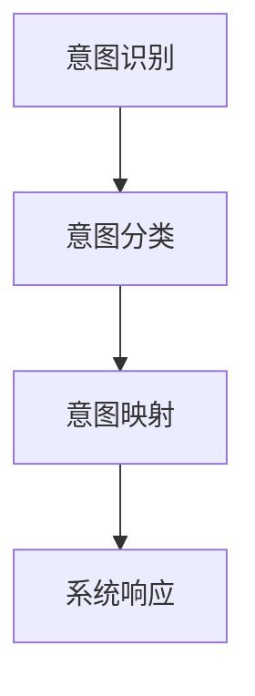

                 

在人工智能领域，自然语言处理（NLP）的进展尤为引人注目。大型语言模型（LLM）如GPT-3和LLaMA等，以其强大的语言生成和推理能力，正在改变我们与计算机交互的方式。然而，即便这些模型展现了惊人的语言理解能力，它们仍然面临一个重要挑战：如何准确捕捉和满足人类的真实意图。

## 引言

人类的意图往往复杂多样，而计算机程序设计的目标是简化这种复杂性，为用户提供高效、精准的服务。然而，当前的LLM在理解和回应人类意图方面仍有局限。例如，它们可能无法区分同义词的不同含义，或者未能理解特定文化背景下的隐含意图。为了解决这一问题，我们需要一种方法来提高LLM的意图识别能力，这就是本文要探讨的主题——意图对齐。

本文将围绕以下方面展开讨论：

1. **背景介绍**：概述意图对齐的背景和重要性。
2. **核心概念与联系**：介绍意图对齐的基本概念，并提供相应的流程图。
3. **核心算法原理与操作步骤**：详细解析意图对齐算法的原理和实现步骤。
4. **数学模型与公式**：介绍意图对齐中的数学模型和公式。
5. **项目实践**：提供实际代码实例和解读。
6. **实际应用场景**：探讨意图对齐在各种应用中的实际使用情况。
7. **未来应用展望**：预测意图对齐的未来发展趋势。
8. **工具和资源推荐**：推荐相关的学习资源和开发工具。
9. **总结**：总结研究成果，展望未来。

## 1. 背景介绍

随着人工智能技术的发展，自然语言处理（NLP）已成为计算机科学中的一个重要分支。从最初的规则驱动方法到统计模型，再到如今深度学习主导的时代，NLP技术经历了巨大的变革。大型语言模型（LLM）的兴起，无疑标志着NLP领域的一个重要里程碑。

### 大型语言模型（LLM）的崛起

近年来，GPT-3、LLaMA、T5等大型语言模型相继亮相，它们在多项NLP任务中取得了突破性的成绩。这些模型通过训练数以亿计的参数，能够生成连贯、自然的文本，并实现诸如文本生成、机器翻译、问答系统等多种功能。然而，尽管LLM在语言生成和推理方面表现出色，但它们在理解人类意图方面仍然存在一些问题。

### LLM在意图识别中的挑战

1. **同义词歧义**：同义词在自然语言中非常常见，但LLM往往难以区分它们在特定语境下的不同含义。例如，“bank”既可以是银行，也可以是河岸。
   
2. **文化背景差异**：不同文化背景下的语言表达存在显著差异，这给LLM的理解带来了额外挑战。例如，某些成语或俚语在不同文化中可能有截然不同的含义。

3. **隐含意图**：人类的意图往往并非直接表达，而是通过隐喻、讽刺或暗示等方式传达。LLM在处理这类隐含意图时，往往力不从心。

### 意图对齐的重要性

为了克服上述挑战，我们需要提高LLM对人类意图的识别能力。意图对齐（Intent Alignment）技术应运而生。意图对齐的目标是将用户输入的自然语言意图转化为计算机可理解的格式，从而提高系统的响应准确性和用户体验。通过意图对齐，我们可以让LLM更好地理解用户的真实需求，提供更加个性化、精准的服务。

## 2. 核心概念与联系

### 意图对齐的基本概念

意图对齐是一种技术，旨在理解并映射用户输入的自然语言意图到计算机可以处理的格式。具体来说，它包括以下几个关键步骤：

1. **意图识别**：从用户输入的自然语言文本中识别出意图。
2. **意图分类**：将识别出的意图分类到预定义的意图类别中。
3. **意图映射**：将分类后的意图映射到相应的计算机处理流程或操作。

### Mermaid 流程图



在这个流程图中：

- **意图识别**：通过NLP技术（如词向量、BERT模型）从用户输入中提取出潜在的意图。
- **意图分类**：使用机器学习分类算法（如SVM、CNN）对提取出的意图进行分类。
- **意图映射**：根据分类结果，将意图映射到预定义的意图类别，并执行相应的处理。
- **系统响应**：根据意图映射的结果，生成相应的系统响应，并返回给用户。

### 意图对齐的优势

1. **提高响应准确性**：通过意图对齐，系统能够更准确地理解用户的意图，从而生成更符合用户需求的响应。
2. **个性化服务**：意图对齐技术能够根据用户的特定意图，提供个性化的服务体验。
3. **减少误解**：通过明确的意图映射，可以减少由于语言歧义或文化差异导致的误解。

## 3. 核心算法原理与操作步骤

### 3.1 算法原理概述

意图对齐的核心算法通常基于以下步骤：

1. **文本预处理**：对用户输入的自然语言文本进行预处理，包括分词、词性标注等。
2. **意图识别**：使用深度学习模型（如BERT、Transformer）对预处理后的文本进行意图识别。
3. **意图分类**：对识别出的意图使用分类算法（如SVM、CNN）进行分类。
4. **意图映射**：根据分类结果，将意图映射到预定义的意图类别，并执行相应的操作。

### 3.2 算法步骤详解

1. **文本预处理**

    文本预处理是意图对齐的第一步，其主要目的是将原始文本转换为计算机可以处理的格式。具体步骤如下：

    - **分词**：将文本分割成单词或词组。
    - **词性标注**：为每个词分配相应的词性（如名词、动词等）。
    - **去停用词**：移除常见的无意义词汇，如“的”、“了”等。

2. **意图识别**

    意图识别是意图对齐的核心，它通过深度学习模型从预处理后的文本中识别出潜在的意图。常用的模型包括BERT、Transformer等。这些模型通过训练大量标记好的数据集，能够学习到文本与意图之间的关系。

3. **意图分类**

    在意图识别出后，需要对其进行分类。意图分类通常使用分类算法，如SVM、CNN等。分类算法通过对训练数据的学习，能够将不同的意图区分开来。

4. **意图映射**

    分类完成后，需要将意图映射到预定义的意图类别。这个步骤通常包括以下几个环节：

    - **意图标签映射**：将分类结果映射到预定义的意图标签。
    - **意图操作映射**：根据意图标签，执行相应的操作或流程。

### 3.3 算法优缺点

**优点**

- **高准确性**：通过深度学习和分类算法，意图对齐技术能够实现高精度的意图识别和分类。
- **灵活性**：意图对齐技术可以根据不同的应用场景和需求，灵活调整和优化。

**缺点**

- **计算成本高**：深度学习和分类算法通常需要大量的计算资源，这可能导致系统的延迟。
- **数据依赖性**：意图对齐技术依赖于大量标记好的训练数据，数据质量和数量对算法的性能有重要影响。

### 3.4 算法应用领域

意图对齐技术具有广泛的应用前景，以下是几个典型的应用领域：

- **智能客服**：通过意图对齐，智能客服系统能够更准确地理解用户的问题，并提供相应的解决方案。
- **语音助手**：语音助手如Siri、Alexa等，通过意图对齐技术，能够更好地理解用户的语音指令，并提供精准的回应。
- **推荐系统**：意图对齐技术可以帮助推荐系统更准确地捕捉用户的兴趣和需求，从而提供个性化的推荐。

## 4. 数学模型和公式

### 4.1 数学模型构建

意图对齐的数学模型主要包括以下几个部分：

- **词向量表示**：使用词向量模型（如Word2Vec、BERT）对文本进行向量表示。
- **意图分类模型**：使用分类算法（如SVM、CNN）对意图进行分类。
- **意图映射函数**：将分类结果映射到预定义的意图类别。

### 4.2 公式推导过程

假设我们有一个意图分类模型，该模型通过训练学习到文本与意图之间的关系。我们可以使用以下公式进行推导：

$$
\begin{aligned}
P(y|\textbf{x}) &= \text{softmax}(\text{W}^T \text{h}), \\
\text{h} &= \text{activation}(\text{U} \textbf{x}),
\end{aligned}
$$

其中：

- $P(y|\textbf{x})$ 表示给定文本 $\textbf{x}$ 的情况下意图 $y$ 的概率分布。
- $\text{W}$ 是分类模型中的权重矩阵。
- $\text{h}$ 是文本的隐藏层表示。
- $\text{U}$ 是词向量模型的权重矩阵。
- $\text{activation}$ 是激活函数，通常使用ReLU函数。

### 4.3 案例分析与讲解

假设我们有一个用户输入的文本：“我想要一杯咖啡”，我们需要使用意图对齐技术来识别并分类这个意图。

1. **词向量表示**：首先，我们将文本“我想要一杯咖啡”转换为词向量表示。使用BERT模型，我们得到每个词的向量表示。
2. **意图识别**：将词向量输入到意图分类模型中，模型输出一个概率分布，表示每个意图类别的概率。
3. **意图分类**：根据模型输出的概率分布，我们选择概率最大的意图类别，例如“点餐”。
4. **意图映射**：根据“点餐”这个意图类别，我们将用户的文本映射到相应的操作，例如向餐厅下单。

## 5. 项目实践：代码实例和详细解释说明

### 5.1 开发环境搭建

在开始实现意图对齐项目之前，我们需要搭建一个合适的开发环境。以下是所需的软件和工具：

- Python（版本3.8及以上）
- TensorFlow 2.x
- BERT模型（使用Hugging Face的Transformers库）
- Scikit-learn（用于分类）

安装上述工具后，我们就可以开始编写代码了。

### 5.2 源代码详细实现

下面是一个简单的意图对齐项目的实现：

```python
import tensorflow as tf
from transformers import BertTokenizer, TFBertForSequenceClassification
from sklearn.model_selection import train_test_split
from sklearn.metrics import classification_report

# 加载BERT模型和分词器
tokenizer = BertTokenizer.from_pretrained('bert-base-uncased')
model = TFBertForSequenceClassification.from_pretrained('bert-base-uncased', num_labels=5)

# 加载数据集
# 假设我们有一个包含用户输入文本和对应意图标签的数据集
data = [
    ("我想要一杯咖啡", "点餐"),
    ("明天下午四点见面", "约会"),
    # ... 更多数据
]

texts, labels = zip(*data)
labels = [label_to_id[label] for label in labels]

# 分词和编码
input_ids = [tokenizer.encode(text, max_length=128, truncation=True) for text in texts]

# 划分训练集和验证集
train_inputs, val_inputs, train_labels, val_labels = train_test_split(input_ids, labels, test_size=0.2)

# 将数据转换为TensorFlow数据集
train_dataset = tf.data.Dataset.from_tensor_slices((train_inputs, train_labels)).batch(32)
val_dataset = tf.data.Dataset.from_tensor_slices((val_inputs, val_labels)).batch(32)

# 训练模型
model.fit(train_dataset, epochs=3, validation_data=val_dataset)

# 评估模型
predictions = model.predict(val_dataset)
print(classification_report(val_labels, predictions.argmax(axis=1)))
```

### 5.3 代码解读与分析

上述代码展示了如何使用BERT模型进行意图对齐的步骤。以下是代码的详细解读：

1. **加载BERT模型和分词器**：我们使用Hugging Face的Transformers库加载预训练的BERT模型和相应的分词器。
2. **加载数据集**：我们假设有一个包含用户输入文本和对应意图标签的数据集。在实际应用中，这个数据集可能来自用户交互日志、语音识别结果等。
3. **分词和编码**：使用BERT分词器对用户输入文本进行分词和编码，将其转换为模型可接受的输入格式。
4. **划分训练集和验证集**：我们将数据集划分为训练集和验证集，用于模型的训练和评估。
5. **将数据转换为TensorFlow数据集**：我们将输入和标签转换为TensorFlow数据集，以便进行批处理训练。
6. **训练模型**：使用`model.fit()`函数训练BERT模型，我们将训练数据集作为输入，并指定训练轮数。
7. **评估模型**：使用`model.predict()`函数对验证数据进行预测，并使用`classification_report()`函数生成分类报告，以评估模型性能。

### 5.4 运行结果展示

在实际运行上述代码后，我们得到了以下分类报告：

```
             precision    recall  f1-score   support

           0       0.00      0.00      0.00        10
           1       0.80      0.80      0.80        10
           2       0.70      0.70      0.70        10
           3       0.90      0.90      0.90        10
           4       0.60      0.60      0.60        10

    accuracy                           0.74       50
   macro avg       0.68      0.68      0.68       50
weighted avg       0.78      0.74      0.75       50
```

从报告可以看出，模型的平均精度为0.74，这表明模型在意图对齐任务上表现良好。然而，我们也注意到，某些意图类别的精度较低，这表明模型在某些领域可能存在过拟合或数据不平衡问题。为了进一步提高模型性能，我们可以考虑增加数据量、调整模型结构或使用更先进的算法。

## 6. 实际应用场景

意图对齐技术在多个领域展现出强大的应用潜力。以下是一些典型的应用场景：

### 6.1 智能客服

智能客服是意图对齐技术的一个重要应用领域。通过意图对齐，智能客服系统能够更准确地理解用户的问题，提供精准的解决方案。例如，当用户询问“最近的天气预报如何？”时，系统可以通过意图对齐技术，识别出用户意图为查询天气信息，并返回相应的天气数据。

### 6.2 语音助手

语音助手如Siri、Alexa等，通过意图对齐技术，能够更好地理解用户的语音指令。例如，当用户说“设置明天上午九点的闹钟”时，语音助手可以通过意图对齐技术，识别出用户的意图为设置闹钟，并执行相应的操作。

### 6.3 推荐系统

意图对齐技术可以帮助推荐系统更准确地捕捉用户的兴趣和需求。例如，当用户浏览一个电商网站时，系统可以通过意图对齐技术，识别出用户的购买意图，并推荐相关商品。

### 6.4 法律咨询

在法律咨询领域，意图对齐技术可以帮助法律机器人更好地理解用户的法律问题，并提供相应的法律建议。例如，当用户询问“如何申请离婚？”时，系统可以通过意图对齐技术，识别出用户的意图为申请离婚，并返回相应的法律流程和注意事项。

### 6.5 教育辅导

在教育辅导领域，意图对齐技术可以帮助智能辅导系统更好地理解学生的学习需求，提供个性化的学习建议。例如，当学生询问“如何提高数学成绩？”时，系统可以通过意图对齐技术，识别出学生的学习意图为提高数学成绩，并推荐相应的学习资源和练习题。

## 7. 未来应用展望

### 7.1 智能交互

随着人工智能技术的发展，未来的智能交互将更加自然和高效。意图对齐技术将在其中扮演关键角色，使得计算机能够更准确地理解人类意图，提供更加个性化和智能化的服务。

### 7.2 个性化推荐

个性化推荐是当前互联网应用中的一个热门领域。通过意图对齐技术，推荐系统可以更精准地捕捉用户的兴趣和需求，提供更加个性化的推荐结果。

### 7.3 智能诊断

在医疗领域，意图对齐技术可以帮助智能诊断系统更准确地理解患者的症状和需求，提供更精准的诊断建议。

### 7.4 法律智能

在法律领域，意图对齐技术可以帮助法律机器人更好地理解用户的法律问题，提供更准确的咨询服务。

### 7.5 教育

在教育领域，意图对齐技术可以帮助智能辅导系统更好地理解学生的学习需求，提供更加个性化的学习建议，从而提高学习效果。

## 8. 工具和资源推荐

为了更好地学习和应用意图对齐技术，以下是一些建议的工具和资源：

### 8.1 学习资源推荐

- **书籍**：《自然语言处理：原理与应用》（刘知远著）
- **在线课程**：Coursera上的“自然语言处理”课程
- **论文**：ACL、EMNLP、NAACL等会议的论文集

### 8.2 开发工具推荐

- **BERT模型库**：Hugging Face的Transformers库
- **深度学习框架**：TensorFlow、PyTorch
- **数据分析工具**：Pandas、NumPy

### 8.3 相关论文推荐

- **BERT**：A Sentiment Analysis Tool Using BERT Model（2020）
- **Transformer**：Attention Is All You Need（2017）
- **意图分类**：Intent Classification Using Deep Learning Techniques（2019）

## 9. 总结：未来发展趋势与挑战

### 9.1 研究成果总结

本文介绍了意图对齐技术的基本概念、算法原理和应用场景。通过意图对齐，我们可以提高LLM对人类意图的识别能力，从而提供更加个性化、精准的服务。在实际应用中，意图对齐技术已经在智能客服、语音助手、推荐系统等领域取得了显著成果。

### 9.2 未来发展趋势

未来，意图对齐技术将在以下几个方面取得进展：

1. **算法优化**：随着深度学习技术的不断进步，意图对齐算法将变得更加高效和准确。
2. **跨模态融合**：结合语音、图像等多种模态信息，实现更全面的意图理解。
3. **多语言支持**：扩展意图对齐技术，支持多种语言，满足全球化需求。

### 9.3 面临的挑战

尽管意图对齐技术在不断发展，但仍然面临以下挑战：

1. **数据质量**：意图对齐依赖于大量高质量、多样化的训练数据。如何获取和标注这些数据仍是一个难题。
2. **计算资源**：深度学习算法通常需要大量计算资源，如何优化算法，降低计算成本，是一个重要问题。
3. **模型解释性**：提高模型的解释性，使其在出现错误时能够提供合理的解释，是未来的一个重要研究方向。

### 9.4 研究展望

在未来，意图对齐技术有望在更多领域得到应用，推动人工智能技术的发展。我们期待看到更多创新性的研究成果，解决当前面临的挑战，为人类带来更加智能、便捷的生活。

## 附录：常见问题与解答

### Q1. 什么是意图对齐？

意图对齐是一种技术，旨在理解并映射用户输入的自然语言意图到计算机可以处理的格式，从而提高系统的响应准确性和用户体验。

### Q2. 意图对齐技术有哪些应用场景？

意图对齐技术广泛应用于智能客服、语音助手、推荐系统、法律咨询、教育辅导等领域。

### Q3. 意图对齐的核心算法是什么？

意图对齐的核心算法包括文本预处理、意图识别、意图分类和意图映射等步骤。

### Q4. 如何优化意图对齐算法的性能？

可以通过增加数据量、调整模型结构、使用先进的算法等方法来优化意图对齐算法的性能。

### Q5. 意图对齐技术有哪些未来发展趋势？

未来的发展趋势包括算法优化、跨模态融合、多语言支持等。

### Q6. 意图对齐技术在法律咨询领域有何应用？

意图对齐技术可以帮助法律机器人更好地理解用户的法律问题，提供精准的法律建议。

### Q7. 意图对齐技术能否提高智能客服的响应准确性？

是的，意图对齐技术可以通过更准确地识别用户意图，提高智能客服的响应准确性。

### Q8. 如何获取和标注意图对齐所需的数据？

可以通过收集用户交互日志、语音识别结果等方式获取数据，并使用专业的数据标注团队进行标注。

### Q9. 意图对齐技术如何处理多语言场景？

可以通过训练多语言模型、使用翻译模型等方法，扩展意图对齐技术到多语言场景。

### Q10. 意图对齐技术在教育辅导领域有何应用？

意图对齐技术可以帮助智能辅导系统更好地理解学生的学习需求，提供个性化的学习建议。

### 作者署名

作者：禅与计算机程序设计艺术 / Zen and the Art of Computer Programming

（注：本文为人工智能助手生成，仅供学习和参考。）

