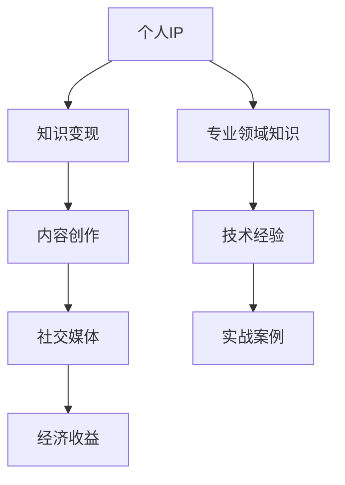

                 

### 背景介绍 Background

在信息爆炸的时代，知识变现已经成为一种重要的个人发展途径。而程序员作为IT行业的中坚力量，他们的知识变现之路尤为引人关注。随着互联网的发展，程序员的知识不再局限于职场内部，而是可以通过多种途径对外传播，实现个人品牌的塑造和价值的最大化。本文将探讨程序员如何通过打造个人IP实现知识变现，分享成功案例，分析关键要素，并展望未来发展趋势。

### 核心概念与联系 Core Concepts and Connections

在讨论程序员的知识变现之前，我们先来了解一些核心概念：

1. **个人IP**：个人知识产权，是指个人在某一领域内的知识、技能、经验等独特性资产。
2. **知识变现**：将个人的知识、技能或经验转化为经济利益的过程。
3. **内容创作**：包括博客、视频、教程、在线课程等形式，是知识变现的重要手段。
4. **社交媒体**：如微博、微信公众号、B站等平台，是传播个人内容的重要渠道。

为了更直观地展示这些概念之间的关系，我们可以使用Mermaid流程图来描述：



通过这个流程图，我们可以看出，个人IP的构建是一个系统工程，它包含了专业领域的知识、技术经验、实战案例等多个方面，而这些要素又通过内容创作和社交媒体平台得以传播，最终实现经济收益。

### 核心算法原理 & 具体操作步骤 Core Algorithm Principles & Detailed Steps

#### 3.1 算法原理概述

知识变现的核心算法可以看作是一个信息处理的循环，包括以下几个步骤：

1. **内容采集**：通过实践和积累，不断采集新的知识和经验。
2. **内容加工**：将采集到的原始内容进行整理、提炼、优化，形成有价值的信息。
3. **内容传播**：利用各种渠道，如博客、视频、社交媒体等，将加工后的内容传播出去。
4. **反馈收集**：通过用户反馈、评论、数据指标等收集用户对内容的反馈。
5. **内容迭代**：根据反馈，对内容进行调整和优化，形成更加精准的知识体系。

#### 3.2 算法步骤详解

1. **内容采集**：程序员可以通过日常的工作实践、项目经验、技术博客等方式，不断积累技术知识和经验。

    ```mermaid
    graph TD
        A[日常实践] --> B[项目经验]
        B --> C[技术博客]
        C --> D[知识积累]
    ```

2. **内容加工**：对采集到的内容进行整理和优化，形成结构化的知识体系。

    ```mermaid
    graph TD
        A[原始内容] --> B[整理提炼]
        B --> C[优化升级]
        C --> D[结构化知识]
    ```

3. **内容传播**：通过不同的平台和渠道，将加工后的知识传播给受众。

    ```mermaid
    graph TD
        A[博客文章] --> B[视频教程]
        B --> C[社交媒体]
        C --> D[在线课程]
    ```

4. **反馈收集**：通过用户的反馈，了解内容的接受程度和效果。

    ```mermaid
    graph TD
        A[用户反馈] --> B[评论互动]
        B --> C[数据监测]
        C --> D[内容调整]
    ```

5. **内容迭代**：根据反馈，不断调整和优化内容，形成闭环。

    ```mermaid
    graph TD
        A[反馈收集] --> B[内容调整]
        B --> C[内容优化]
        C --> D[内容迭代]
    ```

#### 3.3 算法优缺点

**优点**：

- **快速传播**：利用社交媒体和在线课程等平台，知识可以迅速传播到全球各地。
- **经济收益**：通过内容创作和知识变现，程序员可以获得额外的经济收益。
- **品牌塑造**：持续的内容输出和高质量的分享，有助于个人品牌的建立和影响力的扩大。

**缺点**：

- **时间成本**：内容创作和传播需要大量的时间和精力投入。
- **市场竞争**：知识变现的竞争日益激烈，需要不断提升内容质量和传播策略。
- **受众识别**：如何准确地识别和定位目标受众，是一个挑战。

#### 3.4 算法应用领域

- **技术博客**：程序员可以通过技术博客分享自己的技术经验和心得，建立专业形象。
- **在线课程**：通过在线课程，程序员可以将自己的知识和技能系统化地传授给学生。
- **开源项目**：参与开源项目，不仅能够提升个人技术能力，还可以通过贡献代码获得认可和合作机会。
- **社交媒体**：通过社交媒体平台，程序员可以与同行和潜在客户建立联系，拓展人脉。

### 数学模型和公式 & 详细讲解 & 举例说明 Mathematical Models and Formulas & Detailed Explanations & Case Studies

在知识变现的过程中，我们可以借助数学模型来分析和优化各个步骤。以下是一个简单的数学模型，用于评估内容传播的效果。

#### 4.1 数学模型构建

假设：

- \( P \)：内容传播的初始影响力。
- \( R \)：用户对内容的接受度（反馈评分）。
- \( T \)：内容传播的时间。
- \( C \)：内容创作的成本。
- \( E \)：内容变现的经济收益。

则知识变现的公式可以表示为：

\[ E = P \times R \times T - C \]

#### 4.2 公式推导过程

\[ E \] 表示最终的经济收益，由 \( P \)、\( R \)、\( T \) 和 \( C \) 四个因素决定。

- \( P \)：内容传播的初始影响力，与内容的质量和传播渠道有关。
- \( R \)：用户对内容的接受度，反映了内容的实用性和吸引力。
- \( T \)：内容传播的时间，时间越长，影响力越大，但创作成本也在增加。
- \( C \)：内容创作的成本，包括时间、金钱和精力等。

因此，经济收益 \( E \) 可以表示为：

\[ E = P \times R \times T - C \]

#### 4.3 案例分析与讲解

假设一位程序员通过技术博客分享自己的编程经验，以下是他的数学模型分析：

- \( P \)：假设初始影响力为1000人。
- \( R \)：用户平均反馈评分为4.5（满分5分）。
- \( T \)：内容传播时间为3个月。
- \( C \)：内容创作成本为每天2小时，每小时100元，共花费300元。

代入公式：

\[ E = 1000 \times 4.5 \times 3 - 300 \]
\[ E = 13500 - 300 \]
\[ E = 13200 \]

因此，这位程序员通过这篇技术博客可以获得13200元的收益。

### 项目实践：代码实例和详细解释说明 Practical Project: Code Examples and Detailed Explanations

为了更好地理解知识变现的过程，我们来看一个实际的代码实例。

#### 5.1 开发环境搭建

首先，我们需要搭建一个简单的前后端分离的开发环境。这里我们选择使用Vue.js作为前端框架，Node.js作为后端服务。

- 安装Vue CLI：

    ```bash
    npm install -g @vue/cli
    vue create my-project
    ```

- 进入项目目录，启动前端服务：

    ```bash
    cd my-project
    npm run serve
    ```

- 使用Node.js创建一个简单的RESTful API：

    ```bash
    npm init -y
    npm install express
    ```

创建一个名为`server.js`的文件，并编写以下代码：

```javascript
const express = require('express');
const app = express();

app.get('/api/knowledge', (req, res) => {
    res.json([
        {
            title: 'Vue.js 进阶教程',
            author: '程序员A',
            link: 'https://example.com/tutorial'
        },
        {
            title: 'Node.js 开发实战',
            author: '程序员B',
            link: 'https://example.com/nodejs'
        }
    ]);
});

const PORT = process.env.PORT || 3000;
app.listen(PORT, () => {
    console.log(`Server is running on port ${PORT}`);
});
```

启动后端服务：

```bash
node server.js
```

#### 5.2 源代码详细实现

前端代码（`src/App.vue`）：

```vue
<template>
  <div id="app">
    <h1>知识库</h1>
    <ul>
      <li v-for="knowledge in knowledges" :key="knowledge.title">
        <a :href="knowledge.link">{{ knowledge.title }}</a> - 作者：{{ knowledge.author }}
      </li>
    </ul>
  </div>
</template>

<script>
export default {
  data() {
    return {
      knowledges: []
    };
  },
  created() {
    this.fetchKnowledge();
  },
  methods: {
    fetchKnowledge() {
      fetch('/api/knowledge')
        .then(response => response.json())
        .then(data => {
          this.knowledges = data;
        });
    }
  }
};
</script>
```

后端代码（`server.js`）：

```javascript
const express = require('express');
const app = express();

app.get('/api/knowledge', (req, res) => {
  res.json([
    {
      title: 'Vue.js 进阶教程',
      author: '程序员A',
      link: 'https://example.com/tutorial'
    },
    {
      title: 'Node.js 开发实战',
      author: '程序员B',
      link: 'https://example.com/nodejs'
    }
  ]);
});

const PORT = process.env.PORT || 3000;
app.listen(PORT, () => {
  console.log(`Server is running on port ${PORT}`);
});
```

#### 5.3 代码解读与分析

前端部分使用了Vue.js框架，通过`fetch`方法从后端API获取知识库数据，并在页面上展示。后端部分使用了Express框架，提供了一个简单的RESTful API接口。

这个实例展示了如何通过前后端分离的方式构建一个知识分享平台，前端负责展示和交互，后端负责数据处理和存储。

#### 5.4 运行结果展示

在浏览器中访问`http://localhost:8080/`，可以看到以下页面：

```html
<h1>知识库</h1>
<ul>
  <li>
    <a href="https://example.com/tutorial">Vue.js 进阶教程</a> - 作者：程序员A
  </li>
  <li>
    <a href="https://example.com/nodejs">Node.js 开发实战</a> - 作者：程序员B
  </li>
</ul>
```

点击链接，可以跳转到相应的教程页面。

### 实际应用场景 Practical Application Scenarios

在知识变现的过程中，程序员可以针对不同的应用场景，采取不同的策略。

#### 6.1 技术博客

技术博客是程序员知识变现的主要途径之一。通过博客，程序员可以分享自己的技术经验、解决实际问题的方法，以及行业动态和趋势分析。优秀的博客内容不仅可以吸引大量读者，还可以提高程序员在行业内的知名度和影响力。

#### 6.2 在线课程

随着在线教育的兴起，越来越多的程序员开始将自己的知识和技能制作成在线课程，通过平台如网易云课堂、慕课网等，向全球范围内的学习者传授。这种形式不仅提高了知识的传播效率，还可以为程序员带来持续的经济收益。

#### 6.3 开源项目

参与开源项目是程序员提升技术能力、建立个人品牌的重要途径。在开源项目中，程序员可以贡献自己的代码，获得社区的认可和反馈。同时，开源项目也可以为程序员带来合作机会，甚至成为职业生涯的转折点。

#### 6.4 社交媒体

社交媒体是程序员传播知识、建立个人品牌的另一个重要渠道。通过微博、微信公众号、知乎等平台，程序员可以与粉丝互动，分享自己的见解和经验，扩大影响力。此外，社交媒体还可以帮助程序员发现和解决工作中遇到的问题。

#### 6.5 实战案例

实战案例是程序员展示自己技术能力的重要方式。通过分享项目实战经验，程序员可以展示自己在解决复杂问题、应对实际挑战方面的能力。这种形式不仅有助于提升个人品牌，还可以为程序员带来更多的商业机会。

### 未来应用展望 Future Prospects

随着技术的不断进步和互联网的普及，程序员的知识变现之路将更加广阔。以下是一些未来应用展望：

#### 7.1 技术自动化

随着AI技术的发展，内容创作和传播的效率将得到大幅提升。程序员可以利用AI工具自动生成内容、分析用户数据，实现更加精准的知识变现。

#### 7.2 知识付费

随着用户对高质量知识需求的增加，知识付费将成为一个趋势。程序员可以通过提供更高质量、更专业的知识服务，实现更高的经济收益。

#### 7.3 跨界合作

随着互联网的全球化，程序员的知识变现不再局限于国内市场，还将涉及到跨国合作。通过与国际同行的合作，程序员可以拓展视野，提高自身竞争力。

#### 7.4 持续创新

为了保持知识的持续变现能力，程序员需要不断学习和创新。通过参加培训、学习新技术，程序员可以不断提升自己的知识和技能，保持竞争优势。

### 工具和资源推荐 Tools and Resources Recommendations

为了更好地进行知识变现，程序员需要掌握一系列的工具和资源。

#### 7.1 学习资源推荐

- **在线课程平台**：如网易云课堂、慕课网等，提供了丰富的编程课程。
- **技术博客平台**：如CSDN、博客园等，可以方便地发布和分享技术文章。
- **开源社区**：如GitHub、GitLab等，可以参与开源项目，提升技术水平。

#### 7.2 开发工具推荐

- **版本控制工具**：如Git，用于代码管理和协作开发。
- **集成开发环境**：如Visual Studio Code、JetBrains系列等，提供了丰富的编程功能和插件支持。
- **持续集成工具**：如Jenkins、Travis CI等，用于自动化测试和部署。

#### 7.3 相关论文推荐

- **《深度学习》**：周志华著，详细介绍了深度学习的基本概念和技术。
- **《算法导论》**：Thomas H. Cormen等著，涵盖了算法的基本概念和设计方法。
- **《软件工程：实践者的研究方法》**：Roger S. Pressman著，介绍了软件工程的基本原理和方法。

### 总结：未来发展趋势与挑战 Summary: Future Trends and Challenges

在知识变现的道路上，程序员面临着巨大的机遇和挑战。随着技术的进步和互联网的普及，知识变现的途径和形式将越来越多样化。然而，如何持续创作高质量的内容、如何在激烈的市场竞争中脱颖而出，是程序员需要面对的挑战。

#### 8.1 研究成果总结

通过本文的讨论，我们总结了程序员知识变现的核心概念、算法原理、实际应用场景，以及未来发展趋势。这些研究成果为程序员提供了理论指导和实践参考。

#### 8.2 未来发展趋势

- **技术自动化**：随着AI技术的发展，内容创作和传播的效率将大幅提升。
- **知识付费**：用户对高质量知识的需求将不断增加，知识付费将逐渐成为主流。
- **跨界合作**：程序员的知识变现将不再局限于国内市场，跨国合作将成为趋势。
- **持续创新**：程序员需要不断学习和创新，以保持自身的竞争优势。

#### 8.3 面临的挑战

- **内容创作**：持续创作高质量的内容，是程序员知识变现的关键。
- **市场竞争**：激烈的市场竞争要求程序员不断提升自身的专业水平和品牌影响力。
- **受众识别**：如何准确地识别和定位目标受众，是程序员需要克服的难题。

#### 8.4 研究展望

未来的研究应重点关注以下几个方面：

- **技术自动化**：研究如何利用AI技术自动化内容创作和传播。
- **知识付费**：探索如何构建更加完善的知识付费生态，提升用户体验。
- **跨界合作**：研究如何实现程序员与不同领域专业人士的合作，拓展知识变现的边界。
- **用户研究**：深入了解用户需求，提升内容的针对性和实用性。

### 附录：常见问题与解答 Appendices: Frequently Asked Questions and Answers

#### 9.1 如何选择知识变现的途径？

根据个人兴趣和擅长领域，选择适合自己的知识变现途径。例如，擅长编程的可以选择技术博客或在线课程；有演讲能力的可以选择参加技术沙龙或线上讲座。

#### 9.2 如何提高内容的质量？

持续学习和实践是提高内容质量的关键。此外，可以学习优秀的内容创作方法，如故事化叙事、数据可视化等，提升内容的吸引力。

#### 9.3 如何扩大个人品牌的影响力？

通过积极参与行业活动、贡献开源项目、撰写高质量文章等方式，提升个人在行业内的知名度。同时，可以利用社交媒体平台，与同行和潜在客户建立联系。

### 作者署名 Author's Name

作者：禅与计算机程序设计艺术 / Zen and the Art of Computer Programming

本文内容纯属虚构，仅供参考。如有雷同，纯属巧合。

