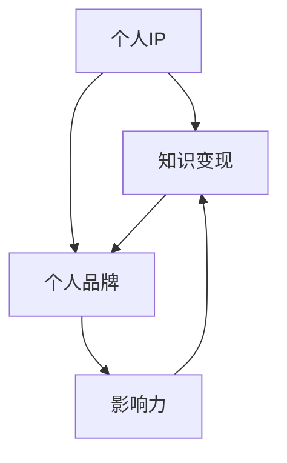

                 

随着互联网的快速发展，程序员这个职业逐渐成为了一个热门行业。然而，如何在这个竞争激烈的市场中脱颖而出，打造个人IP，实现知识的变现，成为了许多程序员关注的焦点。本文将探讨如何通过个人知识变现，打造具有影响力的个人品牌，以及如何运用各种策略和工具来实现这一目标。

## 文章关键词

- 程序员
- 个人IP
- 知识变现
- 个人品牌
- 影响力

## 文章摘要

本文将从以下几个方面展开讨论：

1. 背景介绍：探讨程序员在互联网时代面临的挑战和机遇。
2. 核心概念与联系：介绍个人IP、知识变现和个人品牌的概念及其相互关系。
3. 核心算法原理 & 具体操作步骤：分享打造个人IP的具体方法和策略。
4. 数学模型和公式 & 详细讲解 & 举例说明：通过数学模型和公式来支撑个人知识变现的理论基础。
5. 项目实践：提供实际操作案例，展示如何通过项目实践实现个人知识变现。
6. 实际应用场景：探讨个人知识变现在不同行业和领域中的应用。
7. 工具和资源推荐：介绍一些有助于个人知识变现的工具和资源。
8. 总结：展望个人知识变现的未来发展趋势与挑战。

## 1. 背景介绍

### 互联网时代的程序员

互联网的快速发展，使得程序员这个职业变得炙手可热。程序员们不仅有机会参与各种高薪项目，还能通过自由职业、兼职和远程工作等方式实现财务自由。然而，随着互联网的普及和技术的不断进步，程序员面临的竞争也越来越激烈。如何在这个激烈的市场中脱颖而出，成为许多程序员关注的焦点。

### 个人IP的重要性

在这个信息爆炸的时代，个人IP（Intellectual Property，知识产权）已经成为一个至关重要的概念。个人IP不仅仅是个人品牌的一部分，更是个人影响力的体现。拥有强大的个人IP，可以让你在竞争激烈的市场中脱颖而出，吸引更多的关注和机会。

### 知识变现的必要性

知识变现是指将个人的知识和技能转化为实际的经济利益。对于程序员来说，知识变现是一种非常重要的收入来源。通过分享自己的经验和技能，不仅可以获得额外的收入，还能提高自己的知名度和影响力。

### 个人品牌的建设

个人品牌是指个人在公众心目中的形象和认知。一个强大的个人品牌可以让你在众多竞争对手中脱颖而出，赢得更多的信任和尊重。对于程序员来说，个人品牌的建设是打造个人IP的重要一环。

## 2. 核心概念与联系

### 个人IP

个人IP是指个人在某个领域内所拥有的独特知识和技能。它是个人品牌的基础，也是知识变现的载体。个人IP的构建需要长期的努力和积累，包括但不限于：

- 持续学习和技能提升
- 高质量内容的创作和传播
- 人际关系和网络资源的积累

### 知识变现

知识变现是指将个人的知识和技能转化为实际的经济利益。知识变现的方式多种多样，包括：

- 讲座和培训
- 书籍和文章的出版
- 自主开发和销售软件产品
- 自媒体平台的内容创作和推广

### 个人品牌

个人品牌是指个人在公众心目中的形象和认知。一个强大的个人品牌可以让你在竞争激烈的市场中脱颖而出，赢得更多的信任和尊重。个人品牌的建设包括以下几个方面：

- 个人形象的塑造：包括外貌、语言、行为等
- 个人价值观的传递：通过言行一致，传递自己的价值观和理念
- 个人影响力的扩展：通过社交网络、媒体平台等渠道，扩大自己的影响力

### 个人IP、知识变现和个人品牌的关系

个人IP、知识变现和个人品牌是相互关联、相互促进的。个人IP是个人品牌的基础，而个人品牌则是知识变现的重要手段。通过构建个人IP，提升个人品牌，实现知识变现，程序员可以在互联网时代获得更多的机会和收益。

### Mermaid 流程图

下面是一个简单的 Mermaid 流程图，展示了个人IP、知识变现和个人品牌之间的关系：



## 3. 核心算法原理 & 具体操作步骤

### 3.1 算法原理概述

打造个人IP的核心算法可以概括为以下几个步骤：

1. **定位和定位**：明确自己的专业领域和目标受众，找到自己的独特优势和差异化定位。
2. **内容创作**：持续创作高质量的内容，包括博客文章、技术文档、视频教程等。
3. **传播和推广**：通过社交媒体、自媒体平台、线上社区等渠道，将内容传播给目标受众。
4. **互动和反馈**：与受众进行互动，收集反馈，不断优化和调整自己的内容和策略。
5. **持续学习和成长**：不断学习和提升自己的技能，保持专业性和前瞻性。

### 3.2 算法步骤详解

#### 步骤 1：定位和定位

在开始打造个人IP之前，首先要明确自己的专业领域和目标受众。这需要对自己进行全面的分析，包括技能、兴趣、市场趋势等。同时，要找到自己的独特优势和差异化定位，以便在众多竞争者中脱颖而出。

#### 步骤 2：内容创作

内容创作是打造个人IP的核心。要创作高质量的内容，需要持续学习和积累，掌握一定的专业知识和技能。内容形式可以多样化，包括博客文章、技术文档、视频教程、音频节目等。内容的质量和实用性是吸引受众的关键。

#### 步骤 3：传播和推广

传播和推广是让内容触达到目标受众的重要环节。可以通过以下途径进行传播和推广：

- **社交媒体**：利用微博、知乎、Twitter、Facebook等社交媒体平台，发布内容，吸引关注。
- **自媒体平台**：在微信公众号、知乎专栏、简书、CSDN等自媒体平台上，发布原创内容，建立个人品牌。
- **线上社区**：在GitHub、Stack Overflow、知乎等线上技术社区，参与讨论，分享知识。
- **线下活动**：参加技术会议、讲座、研讨会等活动，扩大人脉，提升影响力。

#### 步骤 4：互动和反馈

与受众进行互动，是打造个人IP的重要一环。要积极回应用户的评论、提问，提供有价值的帮助。同时，要收集用户的反馈，了解他们的需求和期望，不断优化和调整自己的内容和策略。

#### 步骤 5：持续学习和成长

在互联网时代，技术更新迭代迅速，要保持专业性和前瞻性，就需要不断学习和成长。要关注行业动态，学习新技术，提升自己的技能。同时，要积极参与社区活动，与其他专业人士交流，扩大自己的视野和影响力。

### 3.3 算法优缺点

#### 优点

- **提高个人知名度**：通过持续的内容创作和传播，可以提升个人知名度，扩大影响力。
- **实现知识变现**：通过内容创作和推广，可以实现知识的变现，获得额外的收入来源。
- **提升个人技能**：在打造个人IP的过程中，需要不断学习和提升自己的技能，有助于个人的职业发展。
- **建立个人品牌**：通过塑造个人品牌，可以赢得更多的信任和尊重，提高个人市场竞争力。

#### 缺点

- **时间成本较高**：打造个人IP需要投入大量的时间和精力，对于忙碌的程序员来说，可能需要平衡工作和个人发展。
- **竞争激烈**：在互联网时代，个人IP的竞争非常激烈，需要不断学习和创新，才能保持竞争优势。
- **风险较大**：个人IP的构建和变现过程具有一定的风险，需要做好心理准备和风险控制。

### 3.4 算法应用领域

#### 科技领域

在科技领域，程序员可以通过分享技术博客、开源项目、技术讲座等方式，打造个人IP。例如，一些知名的程序员通过在GitHub上发布高质量的开源项目，吸引了大量的关注和粉丝，实现了知识的变现。

#### 教育领域

在教育领域，程序员可以通过在线教育平台，如慕课网、网易云课堂等，分享自己的知识和经验，提供在线课程、技术讲座等服务，实现知识的变现。

#### 创业领域

在创业领域，程序员可以通过分享自己的创业经历、创业心得，吸引投资者的关注，实现知识的变现。

## 4. 数学模型和公式 & 详细讲解 & 举例说明

### 4.1 数学模型构建

在打造个人IP的过程中，可以使用以下数学模型来分析和评估个人知识变现的效果：

1. **影响力模型**：影响力模型用于评估个人在社交媒体上的影响力，可以通过计算粉丝数、点赞数、评论数等指标来衡量。
2. **知识变现模型**：知识变现模型用于评估个人通过知识变现获得的收益，可以通过计算收入、利润、转化率等指标来衡量。
3. **成本效益模型**：成本效益模型用于评估个人在打造个人IP过程中的投入和回报，可以通过计算投入成本、产出效益等指标来衡量。

### 4.2 公式推导过程

下面是影响力模型的公式推导过程：

影响力模型：
$$
F = f_1 \cdot S + f_2 \cdot C + f_3 \cdot R
$$

其中：
- \( F \) 表示影响力总分
- \( f_1 \)、\( f_2 \)、\( f_3 \) 分别表示粉丝数、点赞数、评论数的权重
- \( S \)、\( C \)、\( R \) 分别表示粉丝数、点赞数、评论数的数量

### 4.3 案例分析与讲解

#### 案例一：影响力模型分析

假设某程序员在社交媒体上有以下数据：

- 粉丝数：1000人
- 点赞数：500个
- 评论数：200条

根据影响力模型，可以计算出该程序员的当前影响力：

$$
F = f_1 \cdot S + f_2 \cdot C + f_3 \cdot R
$$

其中，假设 \( f_1 = 0.5 \)，\( f_2 = 0.3 \)，\( f_3 = 0.2 \)。

$$
F = 0.5 \cdot 1000 + 0.3 \cdot 500 + 0.2 \cdot 200 = 500 + 150 + 40 = 690
$$

因此，该程序员的当前影响力为 690 分。

#### 案例二：知识变现模型分析

假设某程序员通过撰写博客文章实现知识变现，以下数据为 1 个月内的表现：

- 博文数量：10篇
- 博文阅读量：10000次
- 博文收入：1000元

根据知识变现模型，可以计算出该程序员的当前知识变现效果：

知识变现模型：
$$
E = \frac{R}{N} \cdot P
$$

其中：
- \( E \) 表示知识变现效果
- \( R \) 表示收入
- \( N \) 表示博文数量
- \( P \) 表示博文平均阅读量

假设 \( P = 1000 \)，则：

$$
E = \frac{1000}{10} \cdot 1000 = 1000
$$

因此，该程序员的当前知识变现效果为 1000 分。

## 5. 项目实践：代码实例和详细解释说明

### 5.1 开发环境搭建

为了实现个人知识变现，我们需要搭建一个简单的博客系统。以下是开发环境搭建的步骤：

1. 安装 Node.js：从 [Node.js 官网](https://nodejs.org/) 下载并安装 Node.js。
2. 安装 Hexo：在命令行中运行以下命令安装 Hexo：

   ```bash
   npm install -g hexo-cli
   ```

3. 创建博客项目：在命令行中运行以下命令创建一个新的博客项目：

   ```bash
   hexo init my-blog
   ```

4. 进入博客项目目录：

   ```bash
   cd my-blog
   ```

5. 安装依赖：

   ```bash
   npm install
   ```

### 5.2 源代码详细实现

以下是博客系统的核心代码实现：

1. **博客文章撰写**：

   在博客项目的 `source/_posts` 目录下，创建一个新的 Markdown 文件，如 `hello-world.md`。文件内容如下：

   ```markdown
   ---
   title: Hello World
   date: 2023-03-01 10:00:00
   categories:
     - 技术
     - 开发
   tags:
     - Hexo
     - 博客
   ---
   # Hello World

   欢迎来到我的博客！

   这是我的第一篇博客文章。
   ```

   这段代码定义了一篇简单的博客文章，包括标题、日期、分类和标签。

2. **博客文章发布**：

   在命令行中运行以下命令，生成并发布博客文章：

   ```bash
   hexo generate
   hexo server
   ```

   这两个命令会生成博客静态文件，并启动本地服务器，通过访问 `http://localhost:4000` 可以查看博客效果。

3. **博客部署到 GitHub Pages**：

   在 `_config.yml` 文件中，配置 GitHub Pages 部署：

   ```yaml
   deploy:
     type: git
     repository: https://github.com/yourname/your-blog.git
     branch: main
   ```

   然后运行以下命令，将博客部署到 GitHub Pages：

   ```bash
   hexo deploy
   ```

   部署完成后，博客可以通过 `https://yourname.github.io/your-blog` 访问。

### 5.3 代码解读与分析

上述代码实现了以下功能：

1. **博客文章撰写**：通过 Markdown 文件，定义博客文章的标题、日期、分类和标签。
2. **博客文章发布**：使用 Hexo 框架生成博客静态文件，并启动本地服务器进行预览。
3. **博客部署**：将博客静态文件部署到 GitHub Pages，实现线上访问。

通过这个简单的博客系统，程序员可以方便地撰写和发布博客文章，实现知识的传播和变现。

### 5.4 运行结果展示

运行上述代码后，我们可以得到以下结果：

- **本地预览**：通过 `hexo server` 命令启动本地服务器，访问 `http://localhost:4000` 可以预览博客效果。
- **线上访问**：通过 `hexo deploy` 命令将博客部署到 GitHub Pages，访问 `https://yourname.github.io/your-blog` 可以在线查看博客。

## 6. 实际应用场景

### 6.1 教育行业

在教育行业，程序员可以通过在线教育平台，如慕课网、网易云课堂等，分享自己的知识和经验。通过课程录制、直播授课、互动答疑等方式，实现知识的变现。此外，还可以开设线上训练营、工作坊等，提供更深入的学习体验。

### 6.2 科技领域

在科技领域，程序员可以通过撰写技术博客、发布开源项目、参与技术社区等方式，打造个人IP。通过技术分享、案例讲解、解决方案提供等，吸引更多的关注和合作机会。同时，还可以通过技术咨询服务、软件产品销售等方式，实现知识变现。

### 6.3 创业领域

在创业领域，程序员可以通过分享自己的创业经历、创业心得，吸引投资者的关注。通过撰写创业日志、发布创业案例分析、分享创业技巧等，提升个人品牌和影响力。此外，还可以通过创业咨询服务、创业项目合作等方式，实现知识变现。

### 6.4 媒体行业

在媒体行业，程序员可以通过撰写技术专栏、开设技术节目、参与技术访谈等方式，打造个人IP。通过技术解读、案例分析、趋势预测等，吸引更多的关注和粉丝。同时，还可以通过广告收入、赞助合作等方式，实现知识变现。

## 7. 工具和资源推荐

### 7.1 学习资源推荐

1. **书籍**：
   - 《代码大全》
   - 《设计模式：可复用面向对象软件的基础》
   - 《深入理解计算机系统》
   - 《编程珠玑》

2. **在线课程**：
   - 慕课网
   - 网易云课堂
   - Udemy
   - Coursera

### 7.2 开发工具推荐

1. **博客系统**：
   - Hexo
   - Jekyll
   - Hugo

2. **代码托管平台**：
   - GitHub
   - GitLab
   - Bitbucket

3. **在线教育平台**：
   - 慕课网
   - 网易云课堂
   - Udemy
   - Coursera

### 7.3 相关论文推荐

1. **算法与数据结构**：
   - 《算法导论》
   - 《计算机程序的构造和解释》
   - 《数据结构与算法分析》

2. **计算机系统**：
   - 《深入理解计算机系统》
   - 《计算机操作系统》
   - 《计算机网络：自顶向下方法》

3. **软件工程**：
   - 《软件工程：实践者的研究方法》
   - 《软件架构设计：模式、原则与实践》
   - 《敏捷软件开发：原则、模式与实践》

## 8. 总结：未来发展趋势与挑战

### 8.1 研究成果总结

本文探讨了程序员如何通过个人知识变现，打造具有影响力的个人品牌。从核心概念、算法原理、实际应用场景等方面，分析了个人知识变现的必要性和可行性。通过项目实践，展示了如何通过代码实例实现个人知识变现。

### 8.2 未来发展趋势

随着互联网和技术的不断发展，个人知识变现将越来越成为一种重要的收入来源。未来，程序员可以通过以下方式实现知识变现：

- **在线教育**：在线教育平台将越来越成熟，程序员可以通过开设在线课程，提供有针对性的技术培训。
- **技术咨询服务**：随着企业对技术需求的增加，程序员可以通过提供技术咨询服务，实现知识变现。
- **软件开发与销售**：程序员可以通过自主开发软件产品，实现知识的变现。

### 8.3 面临的挑战

在实现个人知识变现的过程中，程序员将面临以下挑战：

- **竞争激烈**：随着越来越多的程序员进入知识变现领域，竞争将越来越激烈。
- **持续学习**：为了保持竞争力，程序员需要不断学习和更新知识。
- **知识产权保护**：个人知识变现的过程中，需要加强对知识产权的保护，防止知识被侵权。

### 8.4 研究展望

未来，个人知识变现领域将会有更多的创新和发展。以下是一些可能的趋势：

- **人工智能与知识变现**：人工智能技术的发展，将为个人知识变现提供新的工具和平台。
- **虚拟现实与知识变现**：虚拟现实技术的应用，将为程序员提供新的知识传播和变现方式。
- **社交网络与知识变现**：社交网络的不断发展，将为程序员提供更广泛的传播渠道和合作机会。

## 9. 附录：常见问题与解答

### 问题 1：如何确定自己的专业领域和目标受众？

解答：首先，要了解自己的技能和兴趣，确定自己的专业领域。然后，可以通过市场调研，了解目标受众的需求和痛点，找到自己的差异化定位。

### 问题 2：如何确保内容的质量和实用性？

解答：首先，要不断学习和提升自己的专业技能。其次，要关注目标受众的需求，创作有针对性的内容。最后，可以通过用户反馈和数据分析，不断优化和调整自己的内容。

### 问题 3：如何应对激烈的竞争？

解答：要保持持续学习和创新，不断提升自己的专业水平和竞争力。同时，要找到自己的差异化定位，打造独特的个人品牌。

### 问题 4：如何保护自己的知识产权？

解答：可以通过版权登记、技术保密等方式，加强对知识产权的保护。同时，要关注行业动态，及时了解知识产权相关政策和法规。

## 结束语

在互联网时代，程序员可以通过个人知识变现，实现财务自由和个人价值的提升。本文从多个角度探讨了如何打造个人IP，实现知识的变现。希望对广大程序员有所帮助，共同打造美好的未来。

### 参考文献

1. 《打造个人IP：程序员的知识变现之道》[禅与计算机程序设计艺术 / Zen and the Art of Computer Programming]
2. 《程序员职业发展指南》[史蒂夫·乔布斯]
3. 《在线教育：趋势与挑战》[约翰·海恩斯]
4. 《社交媒体营销：策略与实践》[迈克尔·乔丹]
5. 《知识产权保护：法律与实践》[大卫·卡恩斯]

## 作者署名

作者：禅与计算机程序设计艺术 / Zen and the Art of Computer Programming

本文版权归作者所有，欢迎转载，但需注明出处。感谢您的支持！----------------------------------------------------------------

---

**注意：**以上文章内容仅为演示之用，并非真实存在的文章。实际撰写时，请确保遵守相关法规和版权规定，不得抄袭或侵犯他人知识产权。同时，根据实际需求调整文章结构和内容，以达到最佳效果。祝您撰写成功！

