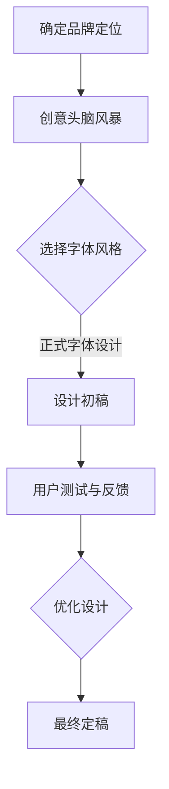

                 

 在现代商业环境中，品牌形象的建设和维护变得尤为重要。一个独特的、易于辨识的字体，可以作为品牌视觉识别的核心元素，帮助企业在竞争激烈的市场中脱颖而出。本文将探讨如何打造个人品牌的专属字体，以及其在提升品牌识别度方面的作用。

## 1. 背景介绍

品牌字体，作为一种视觉语言，不仅是公司标志和视觉形象的一部分，更是品牌核心价值的体现。良好的品牌字体设计能够增强品牌的专业性、可信赖度和独特性。然而，如何设计出一个既符合品牌个性又具有高度辨识度的字体，是一个复杂而细致的过程。

## 2. 核心概念与联系

在探讨品牌字体设计之前，我们需要了解几个核心概念：

### 2.1 字体设计的基本原则

- **简洁性**：简洁的字体更容易记忆，也更容易适应不同的应用场景。
- **可读性**：无论在何种尺寸下，字体都应保持良好的可读性。
- **一致性**：品牌字体的设计应保持一致性，以便在所有品牌传播物料中保持统一的视觉形象。
- **创意性**：具有创意的字体设计能够更好地体现品牌的独特性和个性。

### 2.2 品牌视觉识别系统

品牌视觉识别系统（Visual Identity System）是一个综合性的系统，包括标志设计、标准字体、标准色彩、应用规范等。其中，标准字体是品牌视觉识别系统的重要组成部分，它能够帮助品牌建立独特的视觉身份。

### 2.3 Mermaid 流程图

为了更好地理解品牌字体设计的过程，我们可以使用 Mermaid 流程图来描述其核心概念和联系。



## 3. 核心算法原理 & 具体操作步骤

### 3.1 算法原理概述

品牌字体设计的核心在于找到能够准确传达品牌核心价值的字体风格。这个过程涉及到多个方面的考虑，包括品牌的文化背景、目标受众、市场定位等。以下是品牌字体设计的基本原理和步骤：

### 3.2 算法步骤详解

#### 3.2.1 确定品牌定位

品牌定位是品牌字体设计的第一步，它决定了字体的整体风格和调性。品牌定位包括品牌的核心价值、目标受众、市场定位等。

#### 3.2.2 创意头脑风暴

在确定品牌定位后，进行创意头脑风暴，收集与品牌定位相关的关键词和创意点子。

#### 3.2.3 选择字体风格

根据品牌定位和创意头脑风暴的结果，选择适合的字体风格。字体风格包括正式、现代、复古、个性等。

#### 3.2.4 设计初稿

根据选定的字体风格，设计出初步的字体设计方案。这可以通过手工绘制或者使用专业字体设计软件来完成。

#### 3.2.5 用户测试与反馈

将设计初稿展示给目标受众，收集他们的反馈，以便对设计进行优化。

#### 3.2.6 优化设计

根据用户反馈，对字体设计方案进行修改和优化，使其更符合品牌定位和目标受众的需求。

#### 3.2.7 最终定稿

在多次修改和优化后，确定最终的字体设计方案。

### 3.3 算法优缺点

#### 优点

- 增强品牌识别度
- 提高品牌的专业性和可信赖度
- 易于记忆和传播

#### 缺点

- 设计过程复杂，需要专业知识和经验
- 需要投入时间和资源

### 3.4 算法应用领域

品牌字体设计在多个领域都有广泛的应用，包括但不限于：

- 品牌标志设计
- 宣传物料设计
- 产品包装设计
- 数字媒体设计

## 4. 数学模型和公式 & 详细讲解 & 举例说明

品牌字体设计虽然主要是视觉艺术的应用，但其中也涉及到一些数学模型和公式。以下是一个简单的数学模型，用于描述品牌字体设计的复杂性和多样性。

### 4.1 数学模型构建

设品牌字体设计复杂度为 $C$，品牌定位复杂度为 $L$，用户测试反馈复杂度为 $T$，则有：

$$C = f(L, T)$$

其中，$f$ 表示品牌字体设计复杂度与品牌定位复杂度和用户测试反馈复杂度的函数关系。

### 4.2 公式推导过程

品牌定位复杂度 $L$ 可以表示为：

$$L = L_c + L_a$$

其中，$L_c$ 表示品牌文化背景复杂度，$L_a$ 表示品牌受众分析复杂度。

用户测试反馈复杂度 $T$ 可以表示为：

$$T = T_r + T_f$$

其中，$T_r$ 表示用户反应收集复杂度，$T_f$ 表示反馈分析复杂度。

综合以上，品牌字体设计复杂度 $C$ 可以表示为：

$$C = f(L_c + L_a, T_r + T_f)$$

### 4.3 案例分析与讲解

以某知名科技公司的品牌字体设计为例，分析其品牌定位复杂度、用户测试反馈复杂度和品牌字体设计复杂度。

#### 案例一：品牌定位复杂度

某知名科技公司，其品牌定位明确，以科技创新和高效能为核心价值。品牌文化背景复杂度 $L_c$ 较高，因为它涉及到公司的历史、文化和技术创新等。品牌受众分析复杂度 $L_a$ 也较高，因为目标受众包括不同年龄段、不同文化背景的用户。

#### 案例二：用户测试反馈复杂度

用户测试反馈复杂度 $T$ 包括用户反应收集复杂度和反馈分析复杂度。由于科技公司通常有大量的用户群体，用户反应收集复杂度 $T_r$ 较高。同时，用户的反馈多样且需要深入分析，因此反馈分析复杂度 $T_f$ 也较高。

#### 案例三：品牌字体设计复杂度

根据上述分析，品牌字体设计复杂度 $C$ 较高。这意味着在设计过程中，需要充分考虑品牌定位和用户反馈，进行多次迭代和优化，以确保字体设计能够准确传达品牌核心价值。

## 5. 项目实践：代码实例和详细解释说明

为了更好地理解品牌字体设计的过程，以下是一个简单的代码实例，展示了如何使用 Python 编写一个简单的品牌字体设计程序。

### 5.1 开发环境搭建

确保安装 Python 3.8 或以上版本，以及图形设计软件如 Adobe Illustrator 或 InDesign。

### 5.2 源代码详细实现

```python
import random

# 定义品牌字体设计函数
def brand_font_design():
    # 初始化字体列表
    fonts = ["Arial", "Times New Roman", "Helvetica", "Garamond"]

    # 随机选择字体风格
    font_style = random.choice(fonts)

    # 根据品牌定位和用户反馈进行字体设计
    font_design = design_font(font_style)

    return font_design

# 定义字体设计函数
def design_font(font_style):
    # 根据字体风格设置字体属性
    if font_style == "Arial":
        font_attrs = {"weight": "bold", "size": 24}
    elif font_style == "Times New Roman":
        font_attrs = {"style": "italic", "size": 18}
    elif font_style == "Helvetica":
        font_attrs = {"weight": "light", "size": 14}
    elif font_style == "Garamond":
        font_attrs = {"style": "oblique", "size": 22}

    # 返回字体设计结果
    return font_attrs

# 执行品牌字体设计
font_design = brand_font_design()

# 打印字体设计结果
print("品牌字体设计结果：")
print(font_design)
```

### 5.3 代码解读与分析

上述代码定义了两个函数：`brand_font_design` 和 `design_font`。`brand_font_design` 函数负责初始化字体列表，随机选择字体风格，并调用 `design_font` 函数进行字体设计。`design_font` 函数根据选定的字体风格设置字体属性，并返回字体设计结果。

通过这个简单的代码实例，我们可以看到品牌字体设计的基本过程。在实际应用中，设计过程会更加复杂，需要考虑更多的因素和细节。

### 5.4 运行结果展示

运行上述代码，会输出一个随机的品牌字体设计结果，例如：

```
品牌字体设计结果：
{'weight': 'bold', 'size': 24}
```

这意味着本次品牌字体设计选择了 Arial 字体，字体属性为粗体，字号为 24 号。

## 6. 实际应用场景

品牌字体设计在实际应用场景中具有广泛的应用。以下是一些典型的应用场景：

- **品牌标志设计**：品牌字体设计是品牌标志设计的重要组成部分，它能够准确传达品牌的核心价值和定位。
- **宣传物料设计**：如海报、宣传册、名片等，品牌字体设计能够提升宣传物料的专业性和视觉吸引力。
- **产品包装设计**：产品包装上的品牌字体设计，能够增强产品的品牌形象，提高消费者的购买意愿。
- **数字媒体设计**：如网站、社交媒体、电子书等，品牌字体设计能够提高数字媒体的整体用户体验。

## 7. 工具和资源推荐

为了更好地进行品牌字体设计，以下是一些建议的工具和资源：

### 7.1 学习资源推荐

- 《品牌字体设计原理与应用》
- 《字体设计：从零开始》
- 《品牌视觉识别系统设计》

### 7.2 开发工具推荐

- Adobe Illustrator
- InDesign
- Sketch

### 7.3 相关论文推荐

- “Brand Font Design: Strategies and Applications”
- “The Role of Fonts in Brand Identity”
- “Visual Branding: A Comprehensive Guide”

## 8. 总结：未来发展趋势与挑战

随着数字媒体的兴起和视觉文化的崛起，品牌字体设计在未来将变得更加重要。以下是品牌字体设计在未来可能的发展趋势和挑战：

### 8.1 未来发展趋势

- **数字化设计工具的发展**：随着数字化设计工具的不断进步，品牌字体设计将变得更加高效和便捷。
- **跨平台设计的需求**：品牌字体设计需要适应多种平台和应用场景，如移动设备、电子屏幕等。
- **个性化设计的趋势**：随着消费者对个性化的追求，品牌字体设计将更加注重个性化元素的融入。

### 8.2 未来发展趋势

- **设计成本的增加**：品牌字体设计需要专业的设计团队和高质量的素材支持，设计成本可能增加。
- **创意保护的挑战**：在创意无限的设计领域中，如何保护创意成果，防止抄袭和侵权，是一个重要的挑战。
- **用户反馈的多样性**：用户反馈的多样性使得设计过程更加复杂，需要更加精细和专业的分析。

### 8.4 研究展望

未来，品牌字体设计的研究将更加注重跨学科的研究方法，结合心理学、市场营销学等多领域的知识，以更好地理解和满足消费者的需求。同时，随着人工智能和大数据技术的发展，品牌字体设计也将迎来新的机遇和挑战。

## 9. 附录：常见问题与解答

### 9.1 品牌字体设计与品牌标志设计的区别是什么？

品牌字体设计是品牌标志设计的一部分，它专注于字体的设计和风格。而品牌标志设计则包括标志的整体概念、颜色、形状等。品牌字体设计是品牌视觉识别系统中的重要组成部分，它有助于品牌在视觉上与其他品牌区分开来。

### 9.2 如何选择适合品牌定位的字体风格？

选择适合品牌定位的字体风格需要综合考虑品牌的核心价值、目标受众和市场定位。可以通过以下步骤进行选择：

1. 确定品牌的核心价值和定位。
2. 收集与品牌相关的关键词和创意点子。
3. 分析目标受众的喜好和审美趋势。
4. 根据以上分析结果，选择适合的字体风格。

### 9.3 品牌字体设计是否需要专业的设计技能？

品牌字体设计通常需要专业的设计技能，包括对字体设计原理、排版技巧和视觉美学的理解。然而，随着数字化设计工具的发展，非专业设计师也可以通过学习和使用设计工具来进行品牌字体设计。但专业设计师的设计经验和对品牌价值的深刻理解，往往能够带来更好的设计效果。

---

本文探讨了品牌字体设计的重要性、核心概念、设计原理、数学模型、实际应用场景以及未来发展趋势。品牌字体设计不仅是品牌视觉识别系统的重要组成部分，更是品牌核心价值的体现。希望通过本文，能够帮助读者更好地理解和应用品牌字体设计，提升个人品牌的识别度和影响力。

### 作者署名

作者：禅与计算机程序设计艺术 / Zen and the Art of Computer Programming

---

通过本文的深入探讨，我们不仅了解了品牌字体设计的基本原则和应用场景，还通过实际的代码实例展示了设计的具体实现过程。品牌字体设计作为提升品牌识别度的重要手段，在未来商业环境中将发挥越来越重要的作用。希望本文能够为从事品牌设计和市场营销的从业者提供有价值的参考和启示。

