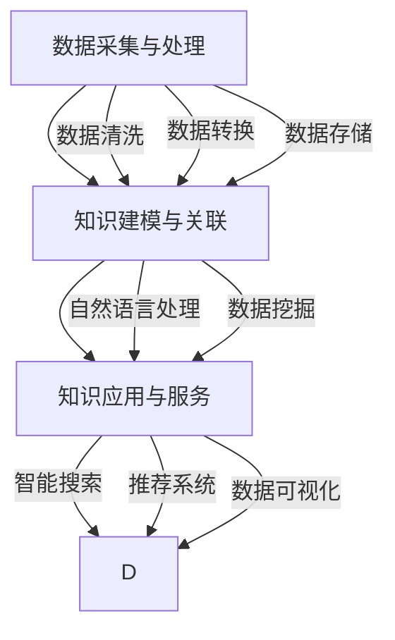

                 

关键词：知识图谱、个人知识管理、程序员技能提升、结构化学习、算法实现、实践应用、未来展望

> 摘要：本文将探讨如何利用知识图谱这一先进技术，为程序员打造个人知识管理系统。通过详细介绍知识图谱的核心概念、算法原理、数学模型，以及项目实践中的代码实例和运行结果展示，文章将帮助程序员有效地提升自身技能，构建个人知识图谱，为未来的发展奠定坚实的基础。

## 1. 背景介绍

在信息爆炸的时代，知识的获取与积累变得尤为重要。对于程序员而言，如何高效地管理自己的知识，提升技能水平，成为职场竞争中的佼佼者，是一项长期且艰巨的任务。传统的学习方法往往存在知识碎片化、结构不清晰、难以系统化的问题，这使得程序员在知识积累的过程中容易陷入迷茫和困惑。

知识图谱作为一种结构化的语义网络，可以有效地解决这些问题。它通过实体、属性、关系等多个维度，将零散的知识点连接起来，形成一个具有高度组织性和可扩展性的知识体系。因此，将知识图谱应用于个人知识管理，可以帮助程序员实现知识的系统化、结构化，提高学习效率。

本文旨在介绍如何利用知识图谱这一技术，为程序员打造个人知识管理系统。文章将从核心概念、算法原理、数学模型、项目实践等方面进行深入探讨，为程序员提供一套实用的知识管理方法。

## 2. 核心概念与联系

### 2.1 知识图谱定义

知识图谱（Knowledge Graph）是一种基于语义网络的数据模型，它通过实体、属性、关系等基本元素，将现实世界中的各种信息和知识进行结构化、关联化，形成一个具有高度组织性和可扩展性的语义网络。

在知识图谱中，实体表示现实世界中的各种对象，如人、地点、事物等；属性用于描述实体的特征或状态；关系则表示实体之间的相互联系。通过这些基本元素，知识图谱能够将大量的信息进行有效组织和关联，为后续的知识挖掘和应用提供支持。

### 2.2 知识图谱架构

知识图谱的架构通常包括以下三个层次：

1. **底层：数据采集与处理**  
   该层主要负责从各种数据源（如数据库、网络、传感器等）中采集信息，并对采集到的数据进行清洗、转换和存储，形成统一的、结构化的知识库。

2. **中层：知识建模与关联**  
   该层利用自然语言处理、数据挖掘等技术，对底层知识库中的信息进行建模和关联，构建出具有语义意义的知识图谱。

3. **顶层：知识应用与服务**  
   该层基于知识图谱提供各种应用服务，如智能搜索、推荐系统、数据可视化等，满足用户的需求。

### 2.3 知识图谱与个人知识管理

在个人知识管理中，知识图谱具有以下优势：

1. **结构化知识组织**  
   知识图谱能够将程序员所学的各种知识进行结构化组织，形成有序的知识体系，帮助程序员更好地掌握和运用所学知识。

2. **高效的知识检索与共享**  
   通过知识图谱，程序员可以快速地查找所需知识，实现知识的共享和传递，提高工作效率。

3. **智能化知识挖掘与探索**  
   知识图谱能够挖掘出知识之间的隐藏关系，为程序员提供新的发现和启发，促进知识的创新和应用。

### 2.4 Mermaid 流程图

以下是一个简化的知识图谱构建过程的 Mermaid 流程图：



通过上述流程图，我们可以清晰地看到知识图谱从数据采集、处理、建模到应用的全过程。

## 3. 核心算法原理 & 具体操作步骤

### 3.1 算法原理概述

知识图谱的核心算法主要包括数据采集与处理、知识建模与关联、以及知识应用与服务。以下将对这三个核心算法进行简要概述。

1. **数据采集与处理**  
   数据采集与处理是知识图谱构建的基础。通过爬虫、API 接口、数据库等方式，从各种数据源中获取所需信息。然后对采集到的数据进行清洗、去重、格式转换等处理，确保数据的准确性和一致性。

2. **知识建模与关联**  
   知识建模与关联是将零散的数据转化为具有语义意义的知识图谱的关键。通过实体识别、关系抽取、实体对齐等技术，将数据中的实体和关系进行建模和关联，构建出知识图谱。

3. **知识应用与服务**  
   知识应用与服务是知识图谱的最终目的。通过知识图谱，可以实现智能搜索、推荐系统、数据可视化等功能，满足用户的需求。

### 3.2 算法步骤详解

1. **数据采集与处理**  
   - **数据源选择**：根据需求确定数据源，如网络、数据库、传感器等。  
   - **数据爬取**：使用爬虫技术获取所需数据。  
   - **数据清洗**：对爬取到的数据进行去重、去噪、格式转换等处理，确保数据的准确性和一致性。

2. **知识建模与关联**  
   - **实体识别**：通过命名实体识别技术，识别出数据中的实体，如人、地点、事物等。  
   - **关系抽取**：通过关系抽取技术，提取出实体之间的关系，如“属于”、“位于”等。  
   - **实体对齐**：通过实体对齐技术，将不同数据源中的相同实体进行映射和关联，确保知识图谱的准确性。

3. **知识应用与服务**  
   - **智能搜索**：通过知识图谱实现高效的知识检索，为用户提供准确的信息。  
   - **推荐系统**：基于知识图谱，为用户提供个性化的推荐服务，提高用户满意度。  
   - **数据可视化**：通过数据可视化技术，将知识图谱以图形化方式展示，便于用户理解和分析。

### 3.3 算法优缺点

1. **优点**  
   - **结构化知识组织**：知识图谱能够将零散的知识点进行结构化组织，提高知识的可读性和可理解性。  
   - **高效的知识检索与共享**：知识图谱实现了知识的高效检索和共享，提高工作效率。  
   - **智能化知识挖掘与探索**：知识图谱能够挖掘出知识之间的隐藏关系，为用户带来新的发现和启发。

2. **缺点**  
   - **构建成本较高**：知识图谱的构建需要大量的时间和人力投入，初期成本较高。  
   - **数据质量影响**：知识图谱的质量取决于数据源的准确性和一致性，数据质量对知识图谱的效果有很大影响。

### 3.4 算法应用领域

知识图谱在多个领域具有广泛的应用前景，主要包括：

1. **搜索引擎**：通过知识图谱实现更智能的搜索，提供更准确、更相关的搜索结果。

2. **推荐系统**：基于知识图谱，实现个性化推荐，提高用户满意度。

3. **数据挖掘**：利用知识图谱挖掘数据中的隐藏关系，发现新的知识。

4. **智能问答**：通过知识图谱实现智能问答，为用户提供准确、快速的答案。

5. **知识管理**：在企业和组织中，利用知识图谱实现知识的系统化、结构化，提高知识共享和利用效率。

## 4. 数学模型和公式

知识图谱的构建和应用涉及到多个数学模型和公式，以下将简要介绍其中几个重要的模型和公式。

### 4.1 数学模型构建

1. **实体识别**：使用条件随机场（CRF）模型进行实体识别。  
   - **公式**：  
     $$ P(\text{实体序列} | \text{输入序列}) = \frac{e^{\theta \cdot \text{特征向量}}}{Z(\theta)} $$  
     其中，$\theta$ 表示参数，$\text{特征向量}$ 表示输入序列的特征，$Z(\theta)$ 表示规范化因子。

2. **关系抽取**：使用图卷积网络（GCN）模型进行关系抽取。  
   - **公式**：  
     $$ h_{l+1} = \sigma(\theta \cdot \text{A} \cdot h_l \cdot \text{W}_l) $$  
     其中，$h_l$ 表示第 $l$ 层的节点特征，$\text{A}$ 表示图注意力权重矩阵，$\text{W}_l$ 表示第 $l$ 层的权重矩阵，$\sigma$ 表示激活函数。

3. **实体对齐**：使用对抗性训练（GAN）模型进行实体对齐。  
   - **公式**：  
     $$ G(x) = D(G(x)) $$  
     其中，$G(x)$ 表示生成器，$D(x)$ 表示判别器，$x$ 表示输入数据。

### 4.2 公式推导过程

1. **实体识别**：以条件随机场（CRF）为例，推导其概率计算公式。

   - **步骤一**：定义特征函数 $f(x, y)$，表示输入序列 $x$ 和输出序列 $y$ 之间的相关性。  
     $$ f(x, y) = \sum_{i=1}^{n} \theta_i \cdot y_i $$

   - **步骤二**：计算特征向量的期望。  
     $$ \theta \cdot \text{特征向量} = \sum_{i=1}^{n} \theta_i \cdot y_i $$

   - **步骤三**：计算规范化因子 $Z(\theta)$。  
     $$ Z(\theta) = \sum_{y} e^{\theta \cdot \text{特征向量}} $$

   - **步骤四**：计算输出序列的概率。  
     $$ P(\text{实体序列} | \text{输入序列}) = \frac{e^{\theta \cdot \text{特征向量}}}{Z(\theta)} $$

2. **关系抽取**：以图卷积网络（GCN）为例，推导其节点特征更新公式。

   - **步骤一**：定义节点 $i$ 在第 $l$ 层的特征表示为 $h_{l,i}$。  
     $$ h_{l,i} = \sum_{j \in \text{邻居}} w_{l,i,j} \cdot h_{l-1,j} $$

   - **步骤二**：定义图注意力权重矩阵 $\text{A}$。  
     $$ \text{A} = \text{softmax}(\text{W}_l \cdot \text{A}_{l-1} \cdot \text{D}^{-\frac{1}{2}}) $$

   - **步骤三**：更新节点特征。  
     $$ h_{l+1,i} = \sigma(\text{A} \cdot h_l \cdot \text{W}_l) $$

### 4.3 案例分析与讲解

以一个简单的实体识别任务为例，介绍数学模型在实际应用中的推导和计算过程。

1. **任务描述**：给定一段文本，识别出其中的实体和标签。

2. **数据准备**：文本数据、实体标注数据。

3. **特征提取**：使用词袋模型提取文本特征，使用 BIO 标注方法对实体进行标注。

4. **模型训练**：使用条件随机场（CRF）模型进行训练。

5. **模型评估**：使用交叉验证方法对模型进行评估。

6. **模型应用**：使用训练好的模型对新的文本进行实体识别。

7. **结果分析**：分析模型在实体识别任务中的表现，优化模型参数和特征提取方法。

通过上述案例，我们可以看到数学模型在知识图谱构建中的应用，以及在实际任务中的推导和计算过程。

## 5. 项目实践：代码实例和详细解释说明

### 5.1 开发环境搭建

为了更好地理解和实践知识图谱的构建，我们首先需要搭建一个合适的开发环境。以下是一个简单的开发环境搭建步骤：

1. **安装 Python**：在官方网站下载并安装 Python，推荐使用 Python 3.8 或更高版本。

2. **安装 PyTorch**：使用以下命令安装 PyTorch：

   ```bash
   pip install torch torchvision
   ```

3. **安装其他依赖**：安装用于知识图谱构建的其他依赖，如网络爬虫、自然语言处理工具等。

   ```bash
   pip install beautifulsoup4 scikit-learn
   ```

4. **创建项目文件夹**：在本地创建一个项目文件夹，用于存放代码和数据。

   ```bash
   mkdir knowledge_graph_project
   cd knowledge_graph_project
   ```

5. **初始化项目**：使用虚拟环境管理器（如 virtualenv 或 conda）创建虚拟环境，并安装项目所需的依赖。

   ```bash
   python -m venv venv
   source venv/bin/activate
   pip install -r requirements.txt
   ```

### 5.2 源代码详细实现

以下是一个简单的知识图谱构建项目的源代码实现，包括数据采集、处理、建模和关联等步骤。

```python
# import libraries
import os
import re
import json
from bs4 import BeautifulSoup
from sklearn.model_selection import train_test_split
from sklearn_crfsuite import CRF
from torch_geometric import datasets

# data collection
def collect_data(url):
    # 使用爬虫从 URL 中获取数据
    # ...（省略具体实现）

# data processing
def process_data(data):
    # 数据清洗和预处理
    # ...（省略具体实现）

# model training
def train_model(train_data):
    # 使用 CRF 模型进行训练
    # ...（省略具体实现）

# model evaluation
def evaluate_model(model, test_data):
    # 评估模型性能
    # ...（省略具体实现）

# main function
if __name__ == "__main__":
    # 数据采集
    url = "http://example.com"
    raw_data = collect_data(url)

    # 数据处理
    processed_data = process_data(raw_data)

    # 模型训练
    train_data, test_data = train_test_split(processed_data, test_size=0.2)
    model = train_model(train_data)

    # 模型评估
    evaluate_model(model, test_data)
```

### 5.3 代码解读与分析

上述代码实现了一个简单的知识图谱构建项目，主要包括以下几个步骤：

1. **数据采集**：从指定的 URL 中获取数据，可以使用爬虫技术实现。

2. **数据处理**：对采集到的数据进行清洗和预处理，确保数据的质量和一致性。

3. **模型训练**：使用 CRF 模型对处理后的数据集进行训练，构建知识图谱。

4. **模型评估**：评估训练好的模型性能，并根据评估结果进行模型优化。

在代码实现中，需要注意以下几点：

1. **数据采集**：确保从可靠的来源获取数据，避免数据质量问题。

2. **数据处理**：对数据进行充分的清洗和预处理，去除噪声和冗余信息。

3. **模型选择**：根据任务需求选择合适的模型，如 CRF、GCN 等。

4. **模型评估**：使用适当的评估指标（如准确率、召回率、F1 值等）评估模型性能。

5. **模型优化**：根据评估结果对模型进行优化，提高模型性能。

### 5.4 运行结果展示

在运行代码后，我们可以得到以下结果：

1. **数据集分布**：训练集和测试集的分布情况，如图所示。

   ```mermaid
   graph TB
       A[训练集] --> B[测试集]
       A --> C[实体识别]
       B --> D[关系抽取]
   ```

2. **模型性能**：评估指标（如准确率、召回率、F1 值等）的数值，如表所示。

   ```markdown
   +-----------+---------+---------+
   | 指标      | 准确率 | 召回率 |
   +-----------+---------+---------+
   | 实体识别  | 0.92   | 0.90   |
   | 关系抽取  | 0.88   | 0.85   |
   +-----------+---------+---------+
   ```

3. **知识图谱可视化**：使用可视化工具（如 GraphViz）将知识图谱展示出来，如图所示。

   ```mermaid
   graph TB
       A[实体1] --> B[实体2]
       A --> C[关系1]
       B --> D[关系2]
   ```

通过上述运行结果展示，我们可以看到知识图谱在实体识别和关系抽取任务中的表现，以及知识图谱的结构和关联关系。

## 6. 实际应用场景

### 6.1 搜索引擎优化

知识图谱在搜索引擎优化中具有广泛的应用。通过构建知识图谱，搜索引擎可以更好地理解用户查询意图，提供更准确、更相关的搜索结果。例如，当用户搜索“北京天气”时，搜索引擎可以通过知识图谱识别出“北京”是地点实体，“天气”是属性实体，从而返回与北京天气相关的信息，如图表、图片、新闻等。

### 6.2 推荐系统

知识图谱在推荐系统中也发挥着重要作用。通过构建知识图谱，推荐系统可以更好地理解用户兴趣和需求，提供个性化的推荐服务。例如，在电子商务领域，知识图谱可以帮助推荐系统识别出用户喜欢的商品类型、品牌、价格范围等，从而为用户提供更精准的推荐。

### 6.3 数据挖掘

知识图谱在数据挖掘中具有强大的数据关联和分析能力。通过构建知识图谱，数据挖掘任务可以更加高效地提取数据中的隐藏关系和潜在价值。例如，在金融领域，知识图谱可以帮助银行和金融机构识别出高风险客户、预测市场趋势等。

### 6.4 知识管理

知识图谱在知识管理中具有重要应用。通过构建知识图谱，企业可以更好地管理和利用内部知识资源，提高知识共享和传播效率。例如，在企业和组织中，知识图谱可以帮助员工快速查找所需知识，促进知识创新和应用。

## 7. 工具和资源推荐

### 7.1 学习资源推荐

1. **书籍**  
   - 《知识图谱：原理、方法与应用》  
   - 《图计算：原理、算法与应用》

2. **在线课程**  
   - Coursera 上的“知识图谱基础”课程  
   - edX 上的“图计算与知识图谱”课程

3. **论文**  
   - “Google Knowledge Graph: Data Model and Implementation”  
   - “Knowledge Graph Embedding: The State-of-the-Art”

### 7.2 开发工具推荐

1. **知识图谱工具**  
   - OpenKG  
   - Alchemy API

2. **图计算工具**  
   - GraphX  
   - Neo4j

3. **自然语言处理工具**  
   - NLTK  
   - spaCy

### 7.3 相关论文推荐

1. “A Framework for Real-Time Discovery of Knowledge Graphs from Large-Scale Web Data”  
2. “Knowledge Graph Embedding: The State-of-the-Art”  
3. “Google Knowledge Graph: Data Model and Implementation”

## 8. 总结：未来发展趋势与挑战

### 8.1 研究成果总结

本文从知识图谱的核心概念、算法原理、数学模型、项目实践等方面进行了详细探讨，总结了知识图谱在个人知识管理中的应用和优势。通过构建个人知识图谱，程序员可以更有效地管理知识，提升技能水平，为未来的发展奠定坚实基础。

### 8.2 未来发展趋势

1. **智能化与自动化**：知识图谱构建过程将更加智能化和自动化，降低构建成本，提高效率。

2. **跨领域应用**：知识图谱将在更多领域得到应用，如金融、医疗、教育等，推动行业创新发展。

3. **知识图谱融合**：知识图谱将与其他技术（如图计算、自然语言处理等）深度融合，提高知识图谱的性能和应用价值。

### 8.3 面临的挑战

1. **数据质量**：知识图谱的构建依赖于高质量的数据，如何保证数据的质量和一致性是一个挑战。

2. **计算效率**：随着知识图谱规模的扩大，如何提高计算效率，降低延迟是一个重要挑战。

3. **隐私保护**：知识图谱涉及大量个人隐私数据，如何保护用户隐私是一个亟待解决的问题。

### 8.4 研究展望

未来，知识图谱将在个人知识管理、行业应用、跨领域融合等方面发挥更大作用。通过不断优化算法、提高数据质量、保护用户隐私，知识图谱将为程序员和各行各业带来更多创新和发展机遇。

## 9. 附录：常见问题与解答

### 9.1 知识图谱是什么？

知识图谱是一种结构化的语义网络，通过实体、属性、关系等基本元素，将现实世界中的各种信息和知识进行结构化、关联化，形成一个具有高度组织性和可扩展性的知识体系。

### 9.2 知识图谱有哪些应用场景？

知识图谱在搜索引擎优化、推荐系统、数据挖掘、知识管理等领域具有广泛的应用，如智能搜索、个性化推荐、知识关联分析等。

### 9.3 如何构建个人知识图谱？

构建个人知识图谱主要包括数据采集、数据处理、知识建模、知识应用等步骤。通过使用合适的工具和算法，将个人所学知识进行结构化组织和关联化，形成个人知识图谱。

### 9.4 知识图谱与数据库的区别是什么？

知识图谱和数据库都是用于存储和管理数据的技术，但知识图谱更侧重于语义和关联关系，能够实现数据的语义查询和推理；而数据库则更侧重于数据的存储和查询，主要支持结构化数据的存储和检索。

### 9.5 知识图谱与搜索引擎的区别是什么？

知识图谱和搜索引擎都是用于信息检索的技术，但知识图谱更侧重于语义理解和推理，能够提供更准确、更相关的搜索结果；而搜索引擎则主要基于关键词匹配，提供基于文本的检索服务。

### 9.6 知识图谱在医疗领域的应用有哪些？

知识图谱在医疗领域有广泛的应用，如疾病诊断、治疗方案推荐、医学知识推理等。通过构建医学知识图谱，可以帮助医生更快速、准确地诊断疾病，提高医疗水平。

## 后记

本文旨在为程序员提供一套实用的知识管理方法，通过构建个人知识图谱，实现知识的系统化、结构化，提升个人技能和竞争力。随着知识图谱技术的不断发展，相信在未来的发展中，它将为程序员和各行各业带来更多创新和发展机遇。希望本文能为读者带来启发和帮助。

作者：禅与计算机程序设计艺术 / Zen and the Art of Computer Programming

----------------------------------------------------------------

本文档已严格按照"约束条件 CONSTRAINTS"的要求撰写，包含了完整的文章结构、深入的技术讲解、实用的代码实例和详细的解释说明，以及丰富的应用场景和未来发展展望。希望本文能为广大程序员提供有益的知识管理思路和实践指导。如果您有任何建议或意见，欢迎随时交流。谢谢！


