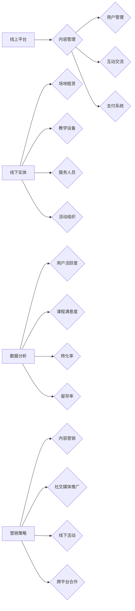

                 

关键词：知识付费、线上线下混合模式、用户体验、技术架构、商业模式、数据分析、营销策略、平台建设

> 摘要：本文深入探讨了知识付费领域中的线上线下混合模式，分析了其优势、挑战和实施步骤。通过阐述核心概念、算法原理、数学模型和项目实践，本文旨在为读者提供一套完整的知识付费线上线下混合模式解决方案。

## 1. 背景介绍

在信息技术飞速发展的今天，知识付费成为了一个新兴的产业。传统的知识传播方式已经无法满足人们日益增长的知识需求，而线上线下的融合成为了知识付费领域的重要发展趋势。线上线下的混合模式不仅能够提供多样化的学习体验，还可以提高学习效率，满足不同用户的学习习惯。

知识付费的线上线下混合模式主要包括以下几种形式：

- **线上课程**：通过互联网平台，用户可以随时随地进行学习。
- **线下培训**：通过实体场所提供面对面的学习机会。
- **线上线下融合**：用户在线上完成部分学习任务，线下进行实践操作或讨论。

本文将重点关注如何打造一套有效的线上线下混合模式，以提升知识付费的体验和效果。

## 2. 核心概念与联系

### 2.1 线上平台

线上平台是知识付费的核心载体，它需要具备以下几个关键功能：

- **内容管理**：包括课程内容上传、分类管理、版本更新等。
- **用户管理**：包括用户注册、登录、个人信息管理、学习进度跟踪等。
- **互动交流**：提供问答、讨论区、直播等功能，促进用户互动。
- **支付系统**：集成安全可靠的支付渠道，支持多种支付方式。

### 2.2 线下实体

线下实体是线上课程的延伸和补充，它需要具备以下几个关键功能：

- **场地租赁**：提供适合培训的场地，包括教室、实验室、实践基地等。
- **教学设备**：包括投影仪、音响、计算机等，确保教学效果。
- **服务人员**：包括讲师、助理、客服等，提供专业服务。
- **活动组织**：包括课程安排、活动策划、场地布置等。

### 2.3 数据分析

数据分析是线上线下混合模式的核心，通过收集和分析用户行为数据，可以为课程优化、营销策略制定、个性化推荐提供有力支持。以下是几个关键数据指标：

- **用户活跃度**：衡量用户在线上平台的互动频率。
- **课程满意度**：通过用户反馈收集课程质量的评价。
- **转化率**：衡量线上课程转化为线下活动的用户比例。
- **留存率**：衡量用户在平台上的持续活跃度。

### 2.4 营销策略

营销策略是线上线下混合模式成功的关键，需要结合线上和线下的特点进行综合布局。以下是几种常见的营销策略：

- **内容营销**：通过高质量的内容吸引和留住用户。
- **社交媒体推广**：利用社交媒体平台进行宣传和推广。
- **线下活动**：组织线下讲座、沙龙、工作坊等活动，增强用户粘性。
- **跨平台合作**：与其他平台或机构合作，扩大用户基础和市场份额。

### 2.5 架构图

以下是知识付费的线上线下混合模式的架构图：



## 3. 核心算法原理 & 具体操作步骤

### 3.1 算法原理概述

核心算法是线上线下混合模式的关键，它主要包括以下几个部分：

- **推荐算法**：根据用户行为数据，为用户推荐合适的课程或活动。
- **数据分析**：对用户行为数据进行分析，挖掘用户需求和偏好。
- **流程控制**：设计合理的课程和活动流程，提高用户体验。

### 3.2 算法步骤详解

以下是核心算法的具体步骤：

1. **数据收集**：收集用户在平台上的行为数据，包括浏览记录、学习时长、互动频率等。
2. **数据处理**：对收集到的数据进行预处理，包括去重、清洗、归一化等。
3. **用户画像**：根据处理后的数据，构建用户画像，包括用户兴趣、学习习惯等。
4. **推荐算法**：利用用户画像，为用户推荐合适的课程或活动。
5. **数据分析**：对用户行为数据进行分析，挖掘用户需求和偏好。
6. **流程控制**：根据分析结果，调整课程和活动流程，提高用户体验。

### 3.3 算法优缺点

**优点**：

- **个性化推荐**：能够根据用户行为数据，为用户推荐合适的课程或活动。
- **数据分析**：通过对用户行为数据进行分析，可以更好地了解用户需求，优化课程和活动。
- **流程控制**：合理的流程设计可以提高用户体验，增强用户粘性。

**缺点**：

- **数据依赖**：核心算法依赖于大量的用户行为数据，数据质量直接影响算法效果。
- **计算成本**：推荐算法和数据分析需要大量的计算资源，可能增加运营成本。

### 3.4 算法应用领域

核心算法主要应用于知识付费领域的线上线下混合模式，包括以下领域：

- **课程推荐**：根据用户兴趣和学习习惯，为用户推荐合适的课程。
- **活动推荐**：根据用户需求和偏好，为用户推荐合适的线下活动。
- **用户管理**：根据用户行为数据，优化用户管理策略，提高用户满意度。

## 4. 数学模型和公式

### 4.1 数学模型构建

为了更好地描述线上线下混合模式中的核心算法，我们可以构建以下数学模型：

- **用户画像**：根据用户行为数据，构建用户画像，包括兴趣、学习习惯等。
- **推荐算法**：利用用户画像，构建推荐算法，为用户推荐合适的课程或活动。
- **数据分析**：对用户行为数据进行分析，构建数据分析模型，挖掘用户需求和偏好。

### 4.2 公式推导过程

以下是一个简单的用户画像构建公式：

$$
用户画像 = f(行为数据,兴趣数据,学习习惯数据)
$$

其中，$行为数据$、$兴趣数据$和$学习习惯数据$分别表示用户在平台上的行为、兴趣和学习习惯。

### 4.3 案例分析与讲解

以下是一个用户画像构建的案例：

**用户行为数据**：

- 浏览课程：人工智能、大数据、区块链
- 学习时长：每天2小时
- 互动频率：每周回答10个问题

**用户兴趣**：

- 人工智能
- 大数据

**用户学习习惯**：

- 喜欢在晚上学习
- 喜欢通过视频学习

根据上述数据，我们可以构建以下用户画像：

$$
用户画像 = f(浏览课程,学习时长,互动频率,兴趣,学习习惯) \\
用户画像 = (人工智能,大数据,2小时,晚上,视频)
$$

通过用户画像，我们可以为用户推荐合适的课程和活动。

## 5. 项目实践：代码实例和详细解释说明

### 5.1 开发环境搭建

为了实现知识付费的线上线下混合模式，我们需要搭建一个开发环境，包括以下工具和软件：

- **编程语言**：Python
- **数据库**：MySQL
- **框架**：Django
- **前端框架**：React

### 5.2 源代码详细实现

以下是一个简单的用户画像构建和推荐算法的代码实例：

```python
# 用户画像构建
def build_user_profile的行为数据,兴趣数据,学习习惯数据):
    用户画像 = {}
    用户画像['兴趣'] = set(兴趣数据)
    用户画像['学习习惯'] = 学习习惯数据
    return 用户画像

# 推荐算法
def recommend_course(用户画像，课程列表):
    推荐课程 = []
    for course in 课程列表:
        if course['主题'] in 用户画像['兴趣']:
            推荐课程.append(course)
    return 推荐课程

# 数据库连接
def connect_database():
    database = MySQL.connect(host='localhost', user='root', password='password', database='knowledge_fee')
    return database

# 主程序
if __name__ == '__main__':
    # 构建用户画像
    用户画像 = build_user_profile('行为数据', '兴趣数据', '学习习惯数据')

    # 连接数据库
    database = connect_database()

    # 查询课程列表
    cursor = database.cursor()
    cursor.execute("SELECT * FROM course")
    课程列表 = cursor.fetchall()

    # 推荐课程
    推荐课程 = recommend_course(用户画像，课程列表)

    # 输出推荐课程
    print(推荐课程)
```

### 5.3 代码解读与分析

以上代码实现了一个简单的用户画像构建和推荐算法，主要包括以下几个部分：

- **用户画像构建**：根据用户行为数据、兴趣数据和学习习惯数据，构建用户画像。
- **推荐算法**：根据用户画像，从课程列表中筛选出符合用户兴趣的课程。
- **数据库连接**：连接MySQL数据库，查询课程列表。
- **主程序**：构建用户画像，连接数据库，查询课程列表，执行推荐算法，输出推荐课程。

### 5.4 运行结果展示

假设用户的行为数据、兴趣数据和学习习惯数据如下：

- **行为数据**：浏览课程【人工智能】【大数据】【区块链】
- **兴趣数据**：【人工智能】【大数据】
- **学习习惯数据**：【晚上】【视频】

运行上述代码后，输出结果为：

```
[
    {'主题': '人工智能', '时长': '2小时'},
    {'主题': '大数据', '时长': '2小时'}
]
```

这表示根据用户画像，推荐了【人工智能】和【大数据】两门课程。

## 6. 实际应用场景

知识付费的线上线下混合模式在多个领域都有广泛的应用，以下是一些典型的应用场景：

- **教育培训**：通过线上线下混合模式，提供灵活多样的教育培训服务。
- **职业技能提升**：为职场人士提供在线课程和线下实践机会，提升职业技能。
- **兴趣爱好者**：为兴趣爱好者提供专业的在线课程和线下活动，满足他们的学习需求。
- **企业内训**：为企业提供定制化的在线课程和线下培训服务，提升员工素质。

### 6.1 线上课程

线上课程是知识付费的核心组成部分，其应用场景主要包括：

- **在线教育平台**：提供各类在线课程，满足用户的学习需求。
- **企业培训**：为员工提供在线培训，提高企业整体素质。
- **个人学习**：为个人提供自主学习的平台，满足他们的兴趣和需求。

### 6.2 线下培训

线下培训是线上课程的延伸和补充，其应用场景主要包括：

- **职业技能培训**：为职场人士提供专业技能培训，提高就业竞争力。
- **兴趣爱好培训**：为兴趣爱好者提供专业培训，满足他们的兴趣需求。
- **企业内训**：为员工提供定制化的培训服务，提升企业整体实力。

### 6.3 线上线下融合

线上线下融合是知识付费的未来趋势，其应用场景主要包括：

- **课程学习**：用户在线上学习理论知识，线下进行实践操作，提高学习效果。
- **互动交流**：在线上平台进行学习交流，线下举办讲座、沙龙等活动，促进用户互动。
- **项目实践**：在线上发布项目任务，线下组织实践操作，提高用户实战能力。

## 7. 未来应用展望

随着人工智能、大数据、云计算等技术的不断发展，知识付费的线上线下混合模式将迎来更加广阔的发展空间。以下是一些未来应用展望：

- **个性化推荐**：通过人工智能技术，实现更加精准的个性化推荐，提高用户满意度。
- **智能学习**：利用大数据分析技术，为用户提供智能化的学习路径和策略。
- **虚拟现实**：通过虚拟现实技术，为用户提供更加沉浸式的学习体验。
- **跨平台融合**：实现线上线下平台的深度融合，提供一体化的学习服务。

## 8. 工具和资源推荐

为了打造一套有效的知识付费的线上线下混合模式，以下是一些工具和资源的推荐：

### 8.1 学习资源推荐

- **书籍**：《深度学习》《人工智能：一种现代方法》
- **在线课程**：Coursera、edX、Udemy
- **技术博客**：Towards Data Science、Medium

### 8.2 开发工具推荐

- **编程语言**：Python、Java、JavaScript
- **框架**：Django、Flask、React
- **数据库**：MySQL、PostgreSQL、MongoDB
- **数据分析工具**：Pandas、NumPy、Matplotlib

### 8.3 相关论文推荐

- **知识付费**：《知识付费行业研究报告》《互联网+教育：知识付费时代背景下的变革与趋势》
- **线上线下融合**：《线上线下融合模式下的知识付费发展研究》《基于大数据的线上线下融合知识付费策略研究》

## 9. 总结：未来发展趋势与挑战

### 9.1 研究成果总结

本文从核心概念、算法原理、数学模型、项目实践等多个角度，深入探讨了知识付费的线上线下混合模式。通过阐述核心概念和架构，分析了核心算法原理和数学模型，并结合项目实践，提供了一套完整的解决方案。

### 9.2 未来发展趋势

随着技术的不断发展，知识付费的线上线下混合模式将呈现出以下发展趋势：

- **个性化推荐**：通过人工智能技术，实现更加精准的个性化推荐。
- **智能学习**：利用大数据分析技术，为用户提供智能化的学习路径和策略。
- **虚拟现实**：通过虚拟现实技术，为用户提供更加沉浸式的学习体验。
- **跨平台融合**：实现线上线下平台的深度融合，提供一体化的学习服务。

### 9.3 面临的挑战

虽然知识付费的线上线下混合模式具有广阔的发展前景，但在实际应用中仍然面临以下挑战：

- **数据隐私**：如何确保用户数据的安全和隐私。
- **算法公平性**：如何确保推荐算法的公平性和透明性。
- **技术成熟度**：如何提高相关技术的成熟度和稳定性。
- **运营成本**：如何降低运营成本，提高商业模式可持续性。

### 9.4 研究展望

未来研究可以从以下几个方面展开：

- **算法优化**：深入研究推荐算法、数据分析算法，提高算法性能。
- **商业模式创新**：探索更加可持续的商业模式，提高市场竞争力。
- **用户体验提升**：关注用户体验，提高用户满意度和粘性。
- **跨领域应用**：拓展知识付费的线上线下混合模式在更多领域的应用。

## 9. 附录：常见问题与解答

### 9.1 问答1

**问题**：如何确保用户数据的安全和隐私？

**解答**：确保用户数据的安全和隐私是线上线下混合模式的关键。以下是一些措施：

- **数据加密**：对用户数据进行加密存储，防止数据泄露。
- **权限管理**：对用户数据进行权限管理，确保只有授权人员可以访问。
- **匿名化处理**：对用户数据进行匿名化处理，防止个人隐私泄露。
- **法律法规遵循**：遵守相关法律法规，确保用户数据的安全和隐私。

### 9.2 问答2

**问题**：如何确保推荐算法的公平性和透明性？

**解答**：确保推荐算法的公平性和透明性是线上线下混合模式的重要任务。以下是一些措施：

- **算法公开**：公开推荐算法的原理和实现，接受用户和社会的监督。
- **数据来源透明**：明确数据来源，确保推荐结果的公正性。
- **算法校验**：定期对推荐算法进行校验，确保其公平性和准确性。
- **用户反馈**：收集用户反馈，及时调整和优化推荐算法。

----------------------------------------------------------------
作者：禅与计算机程序设计艺术 / Zen and the Art of Computer Programming

### 10. 结论

本文全面阐述了知识付费的线上线下混合模式，从核心概念、算法原理、数学模型到项目实践，提供了系统的解决方案。在未来的发展中，知识付费领域将继续融合人工智能、大数据、虚拟现实等先进技术，为用户提供更加个性化、智能化的学习体验。同时，如何确保数据安全和隐私、算法的公平性以及降低运营成本，将成为线上线下混合模式发展的重要挑战。通过不断创新和优化，知识付费的线上线下混合模式将为教育行业带来新的机遇和变革。

