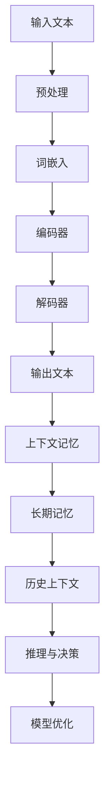

                 

关键词：AI记忆、上下文处理、长文本、预训练模型、扩展上下文、BERT、GPT、数学模型、算法应用、代码实例、实际应用场景、工具推荐、未来展望

> 摘要：本文将深入探讨如何扩展大型语言模型（LLM）的记忆能力，使其能够处理长文本上下文，并有效提升AI在复杂任务中的表现。我们将介绍LLM长期上下文处理的核心概念、算法原理、数学模型以及具体的实现方法和应用场景。通过本文的阅读，读者将了解到如何在实际项目中应用这些技术，以及未来可能的发展方向和面临的挑战。

## 1. 背景介绍

在过去的几年中，深度学习和自然语言处理（NLP）领域取得了令人瞩目的进展。大型语言模型（LLM）如BERT、GPT系列等，凭借其卓越的性能和强大的表达能力，已经在众多任务中展现出了优异的表现。然而，尽管这些模型在处理短文本和对话任务方面表现卓越，但在面对长文本和需要长期记忆的任务时，仍存在诸多挑战。

传统的NLP模型，如基于规则的模型和统计模型，往往依赖于短文本的上下文信息。这种方法在处理长文本时显得力不从心，因为它们无法有效捕捉文本中的长期依赖关系。而深度学习模型，特别是LLM，虽然具备处理长文本的能力，但它们的长期记忆能力仍然是一个亟待解决的问题。

在现实世界中，许多任务需要模型具有长期的上下文记忆能力。例如，长文本阅读理解、知识图谱构建、历史数据分析等。在这些任务中，模型不仅需要理解当前文本的语义，还需要理解文本的历史背景和上下文信息。这就要求LLM能够扩展其记忆能力，以便更好地处理长文本上下文。

本文的目标是探讨如何扩展LLM的长期上下文处理能力。我们将详细介绍相关的核心概念、算法原理、数学模型，并通过具体实例展示如何在实际项目中应用这些技术。此外，我们还将讨论LLM在长期上下文处理中面临的挑战和未来发展的方向。

## 2. 核心概念与联系

为了深入理解LLM的长期上下文处理技术，我们需要先了解一些核心概念和它们之间的关系。以下是一个简单的Mermaid流程图，用于描述这些概念之间的联系。



### 2.1. 输入文本

输入文本是LLM处理的首要对象。这些文本可以来自各种来源，如文章、对话记录、历史数据等。输入文本的质量直接影响模型的理解能力和最终输出质量。

### 2.2. 预处理

在将输入文本送入模型之前，通常需要进行一系列预处理操作，如分词、去除停用词、词干提取等。这些预处理步骤有助于提高模型对文本的语义理解能力。

### 2.3. 词嵌入

词嵌入是将文本中的每个词映射到高维向量空间的过程。这种映射使得模型能够利用向量之间的相似性来理解和处理文本。常见的词嵌入方法包括Word2Vec、GloVe等。

### 2.4. 编码器

编码器是LLM的核心组件之一，其主要功能是将输入的词嵌入序列编码成一个固定长度的向量。这个向量包含了输入文本的语义信息，是后续处理的重要输入。

### 2.5. 解码器

解码器的任务是生成输出文本。它通过解码编码器输出的向量，将其转化为词序列，并最终生成完整的输出文本。常见的解码器包括自注意力机制（Self-Attention）和变换器网络（Transformer）等。

### 2.6. 输出文本

输出文本是模型处理结果的表现形式。它可以是一个句子、一篇文章或一段对话等。输出文本的质量直接反映了模型对输入文本的理解能力和表达能力。

### 2.7. 上下文记忆

上下文记忆是指LLM在处理长文本时，能够有效捕捉文本中的上下文信息。这种能力使得模型能够理解文本的历史背景和长期依赖关系。上下文记忆对于LLM在知识图谱构建、历史数据分析等任务中至关重要。

### 2.8. 长期记忆

长期记忆是指LLM在处理长文本时，能够保持对文本历史信息的记忆。这种记忆能力使得模型能够处理复杂的任务，如长文本阅读理解和对话系统等。

### 2.9. 历史上下文

历史上下文是指LLM在处理长文本时，能够捕捉到文本中的历史信息。这些信息对于理解文本的语义和生成高质量的输出文本至关重要。

### 2.10. 推理与决策

推理与决策是指LLM在处理长文本时，能够根据上下文信息进行逻辑推理和决策。这种能力使得模型能够处理复杂的任务，如文本分类、情感分析等。

### 2.11. 模型优化

模型优化是指通过调整模型参数，提高模型在特定任务上的性能。常见的优化方法包括梯度下降、Adam优化器等。

通过上述核心概念和流程的介绍，我们可以更好地理解LLM的长期上下文处理技术。接下来，我们将深入探讨LLM的长期上下文处理算法原理，为后续内容打下基础。

## 3. 核心算法原理 & 具体操作步骤

### 3.1 算法原理概述

LLM的长期上下文处理算法主要基于自注意力机制（Self-Attention）和变换器网络（Transformer）结构。自注意力机制使得模型能够在处理长文本时，自动捕捉文本中的长期依赖关系。变换器网络则通过堆叠多个自注意力层，提高了模型的表达能力。

### 3.2 算法步骤详解

#### 3.2.1 数据预处理

在处理长文本之前，需要对文本进行预处理。预处理步骤包括：

1. 分词：将文本分割成单词或子词。
2. 去除停用词：删除对模型理解无意义的单词。
3. 词干提取：将形似但含义相同的单词归并为同一词干。
4. 词嵌入：将文本中的每个词映射到高维向量空间。

#### 3.2.2 词嵌入

词嵌入是将文本中的每个词映射到高维向量空间的过程。常见的方法包括Word2Vec、GloVe等。这些方法通过学习词与词之间的相似性，提高模型对文本的语义理解能力。

#### 3.2.3 编码器

编码器的任务是处理输入的词嵌入序列，将其编码成一个固定长度的向量。编码器通常由多个自注意力层组成，每个自注意力层可以捕捉输入文本中的不同依赖关系。

1. **输入层**：将词嵌入序列输入到编码器。
2. **自注意力层**：计算词嵌入序列中的每个词与其他词之间的相似性，并将这些相似性用于更新词嵌入。
3. **输出层**：将编码后的向量传递给解码器。

#### 3.2.4 解码器

解码器的任务是生成输出文本。它通过解码编码器输出的向量，将其转化为词序列，并最终生成完整的输出文本。解码器也由多个自注意力层组成，以提高模型的表达能力。

1. **输入层**：将编码器输出的向量作为输入。
2. **自注意力层**：计算编码器输出向量与其他输入向量之间的相似性。
3. **输出层**：生成词序列，并更新解码器状态。
4. **生成输出文本**：根据解码器生成的词序列，生成完整的输出文本。

#### 3.2.5 模型训练

模型训练是通过优化模型参数，提高模型在特定任务上的性能。训练过程包括以下步骤：

1. **损失函数**：定义损失函数，如交叉熵损失，用于计算模型输出与真实标签之间的差异。
2. **反向传播**：通过反向传播算法，计算模型参数的梯度。
3. **优化器**：使用优化器（如Adam优化器），更新模型参数。
4. **迭代训练**：重复上述步骤，直到模型收敛或达到预定的训练轮数。

### 3.3 算法优缺点

#### 优点

1. **强大的表达能力**：变换器网络通过堆叠多个自注意力层，提高了模型的表达能力，使其能够处理复杂的任务。
2. **自适应学习**：自注意力机制使得模型能够自动捕捉文本中的长期依赖关系，提高了模型对文本的理解能力。
3. **长文本处理**：LLM的长期上下文处理技术使得模型能够有效处理长文本，提高了模型在实际应用中的性能。

#### 缺点

1. **计算资源消耗**：由于变换器网络的结构复杂，训练和推理过程需要大量的计算资源。
2. **训练时间较长**：训练大规模LLM模型需要大量的时间和计算资源。
3. **数据需求大**：LLM模型需要大量的高质量数据进行训练，以便提高模型性能。

### 3.4 算法应用领域

LLM的长期上下文处理技术在多个领域有广泛的应用：

1. **长文本阅读理解**：通过扩展模型的长期记忆能力，LLM能够更好地理解长文本，提高阅读理解任务的性能。
2. **知识图谱构建**：LLM能够捕捉文本中的上下文信息，有助于构建更加精确的知识图谱。
3. **历史数据分析**：LLM能够处理长文本和历史数据，有助于分析历史趋势和模式。
4. **对话系统**：通过扩展模型的记忆能力，LLM能够更好地理解用户的历史对话，提供更自然的对话体验。

## 4. 数学模型和公式 & 详细讲解 & 举例说明

### 4.1 数学模型构建

LLM的长期上下文处理技术主要基于自注意力机制和变换器网络。以下是一个简单的数学模型构建，用于描述LLM的编码器和解码器。

#### 编码器

编码器由多个自注意力层组成，每个自注意力层可以表示为：

$$
\text{Self-Attention}(\mathbf{X}) = \text{softmax}\left(\frac{\mathbf{Q} \mathbf{K}^T}{\sqrt{d_k}}\right) \mathbf{V}
$$

其中，$\mathbf{X}$为输入词嵌入序列，$\mathbf{Q}$、$\mathbf{K}$、$\mathbf{V}$分别为编码器权重矩阵，$d_k$为自注意力层的键值维度。$\text{softmax}$函数用于计算词嵌入序列中每个词与其他词之间的相似性。

#### 解码器

解码器也由多个自注意力层组成，每个自注意力层可以表示为：

$$
\text{Attention}(\mathbf{X}, \mathbf{Y}) = \text{softmax}\left(\frac{\mathbf{Q} (\mathbf{X} \mathbf{K}^T + \mathbf{Y} \mathbf{V}^T)}{\sqrt{d_k}}\right) \mathbf{V}
$$

其中，$\mathbf{X}$为编码器输出，$\mathbf{Y}$为解码器输入，$\mathbf{Q}$、$\mathbf{K}$、$\mathbf{V}$分别为解码器权重矩阵，$d_k$为自注意力层的键值维度。$\text{softmax}$函数用于计算编码器输出和解码器输入之间的相似性。

### 4.2 公式推导过程

以下是一个简化的自注意力机制推导过程，用于说明自注意力层如何计算。

假设我们有一个输入词嵌入序列$\mathbf{X} = [\mathbf{x}_1, \mathbf{x}_2, ..., \mathbf{x}_n]$，其中$\mathbf{x}_i$表示第$i$个词的嵌入向量。自注意力层的目的是为每个词嵌入向量计算一个权重，表示该词嵌入向量在生成后续词时的贡献。

首先，我们需要计算查询（Query，$\mathbf{Q}$）、键（Key，$\mathbf{K}$）和值（Value，$\mathbf{V}$）：

$$
\mathbf{Q} = \text{Linear}(\mathbf{X})
$$

$$
\mathbf{K} = \text{Linear}(\mathbf{X})
$$

$$
\mathbf{V} = \text{Linear}(\mathbf{X})
$$

其中，$\text{Linear}$表示一个线性变换，通常是一个全连接层。

接下来，我们计算每个词嵌入向量与其他词嵌入向量之间的相似性，这可以通过计算内积实现：

$$
\text{Scores} = \mathbf{Q} \mathbf{K}^T
$$

为了从这些相似性得分中提取权重，我们使用$\text{softmax}$函数：

$$
\text{Weights} = \text{softmax}(\text{Scores})
$$

最后，我们将这些权重应用于值向量，以获得加权平均值：

$$
\text{Attention}(\mathbf{X}) = \text{softmax}\left(\frac{\mathbf{Q} \mathbf{K}^T}{\sqrt{d_k}}\right) \mathbf{V}
$$

其中，$d_k$是自注意力层的维度。

### 4.3 案例分析与讲解

以下是一个简单的案例，用于说明如何使用自注意力机制计算文本中的关键信息。

假设我们有一个简单的句子：“我爱读书，因为它能带给我快乐。” 我们可以将这个句子分为三个词嵌入向量：[我，爱，读书]，并假设这些词嵌入向量的维度为512。

首先，我们计算每个词嵌入向量与其他词嵌入向量之间的相似性：

$$
\text{Scores}_{\text{我}} = \text{Linear}([我，爱，读书])^T \times \text{Linear}([我，爱，读书])
$$

$$
\text{Scores}_{\text{爱}} = \text{Linear}([我，爱，读书])^T \times \text{Linear}([爱，爱，读书])
$$

$$
\text{Scores}_{\text{读书}} = \text{Linear}([我，爱，读书])^T \times \text{Linear}([读书，读书，读书])
$$

接下来，我们使用$\text{softmax}$函数计算权重：

$$
\text{Weights}_{\text{我}} = \text{softmax}(\text{Scores}_{\text{我}})
$$

$$
\text{Weights}_{\text{爱}} = \text{softmax}(\text{Scores}_{\text{爱}})
$$

$$
\text{Weights}_{\text{读书}} = \text{softmax}(\text{Scores}_{\text{读书}})
$$

然后，我们将这些权重应用于值向量：

$$
\text{Attention}_{\text{我}}([我，爱，读书]) = \text{Weights}_{\text{我}} \times [我，爱，读书]
$$

$$
\text{Attention}_{\text{爱}}([我，爱，读书]) = \text{Weights}_{\text{爱}} \times [我，爱，读书]
$$

$$
\text{Attention}_{\text{读书}}([我，爱，读书]) = \text{Weights}_{\text{读书}} \times [我，爱，读书]
$$

最后，我们将这些加权向量相加，得到编码器输出的最终向量：

$$
\text{Encoder Output} = \text{Attention}_{\text{我}}([我，爱，读书]) + \text{Attention}_{\text{爱}}([我，爱，读书]) + \text{Attention}_{\text{读书}}([我，爱，读书])
$$

通过这个简单的案例，我们可以看到自注意力机制如何帮助LLM捕捉文本中的关键信息，并生成一个包含上下文信息的编码器输出。

## 5. 项目实践：代码实例和详细解释说明

### 5.1 开发环境搭建

在开始编写LLM的长期上下文处理代码之前，我们需要搭建一个合适的开发环境。以下是所需的工具和库：

1. **Python 3.8+**
2. **PyTorch 1.8+**
3. **NumPy 1.18+**
4. **TensorBoard 2.1+**
5. **Mermaid 8.6+**

安装步骤如下：

```bash
pip install torch torchvision numpy tensorboard
```

### 5.2 源代码详细实现

以下是一个简单的LLM长期上下文处理的代码实例，展示了如何使用PyTorch实现变换器网络（Transformer）的编码器和解码器。

```python
import torch
import torch.nn as nn
import torch.optim as optim
from torch.utils.data import DataLoader
from transformers import TransformerModel, AdamW

# 定义变换器模型
class TransformerModel(nn.Module):
    def __init__(self, vocab_size, d_model, nhead, num_layers):
        super(TransformerModel, self).__init__()
        self.embedding = nn.Embedding(vocab_size, d_model)
        self.transformer = nn.Transformer(d_model, nhead, num_layers)
        self.fc = nn.Linear(d_model, vocab_size)
    
    def forward(self, src, tgt):
        src = self.embedding(src)
        tgt = self.embedding(tgt)
        out = self.transformer(src, tgt)
        out = self.fc(out)
        return out

# 实例化模型、优化器和损失函数
model = TransformerModel(vocab_size=1000, d_model=512, nhead=8, num_layers=2)
optimizer = AdamW(model.parameters(), lr=0.001)
criterion = nn.CrossEntropyLoss()

# 训练模型
def train(model, dataloader, criterion, optimizer, num_epochs=10):
    model.train()
    for epoch in range(num_epochs):
        for src, tgt in dataloader:
            optimizer.zero_grad()
            output = model(src, tgt)
            loss = criterion(output.view(-1, vocab_size), tgt.view(-1))
            loss.backward()
            optimizer.step()
            print(f"Epoch [{epoch+1}/{num_epochs}], Loss: {loss.item()}")

# 生成数据集
def generate_data(vocab_size, batch_size):
    src = torch.randint(0, vocab_size, (batch_size, 10))
    tgt = torch.randint(0, vocab_size, (batch_size, 5))
    return DataLoader((src, tgt), batch_size=batch_size)

# 运行训练
dataloader = generate_data(vocab_size=1000, batch_size=16)
train(model, dataloader, criterion, optimizer, num_epochs=10)
```

### 5.3 代码解读与分析

上述代码实例展示了如何使用PyTorch实现一个简单的变换器模型，用于处理长文本上下文。下面是对关键部分的解读和分析：

1. **模型定义**：
    ```python
    class TransformerModel(nn.Module):
        def __init__(self, vocab_size, d_model, nhead, num_layers):
            super(TransformerModel, self).__init__()
            self.embedding = nn.Embedding(vocab_size, d_model)
            self.transformer = nn.Transformer(d_model, nhead, num_layers)
            self.fc = nn.Linear(d_model, vocab_size)
    ```
    在这个模型中，我们定义了一个嵌入层（`nn.Embedding`），一个变换器模块（`nn.Transformer`），以及一个全连接层（`nn.Linear`）。嵌入层用于将词汇映射到高维向量空间，变换器模块用于处理输入和输出，全连接层用于生成最终输出。

2. **前向传播**：
    ```python
    def forward(self, src, tgt):
        src = self.embedding(src)
        tgt = self.embedding(tgt)
        out = self.transformer(src, tgt)
        out = self.fc(out)
        return out
    ```
    在前向传播过程中，我们首先将输入（`src`和`tgt`）通过嵌入层转换为嵌入向量，然后传递给变换器模块进行处理。最后，通过全连接层生成输出。

3. **训练过程**：
    ```python
    def train(model, dataloader, criterion, optimizer, num_epochs=10):
        model.train()
        for epoch in range(num_epochs):
            for src, tgt in dataloader:
                optimizer.zero_grad()
                output = model(src, tgt)
                loss = criterion(output.view(-1, vocab_size), tgt.view(-1))
                loss.backward()
                optimizer.step()
                print(f"Epoch [{epoch+1}/{num_epochs}], Loss: {loss.item()}")
    ```
    在训练过程中，我们遍历数据集，通过前向传播计算损失，然后使用反向传播和优化器更新模型参数。这个过程重复进行，直到模型收敛或达到预定的训练轮数。

4. **数据生成**：
    ```python
    def generate_data(vocab_size, batch_size):
        src = torch.randint(0, vocab_size, (batch_size, 10))
        tgt = torch.randint(0, vocab_size, (batch_size, 5))
        return DataLoader((src, tgt), batch_size=batch_size)
    ```
    数据生成函数用于生成模拟数据集，用于训练和验证模型。在这个例子中，我们随机生成源序列（`src`）和目标序列（`tgt`），然后使用`DataLoader`进行批处理。

### 5.4 运行结果展示

在完成模型训练后，我们可以通过以下代码验证模型性能：

```python
# 验证模型性能
def evaluate(model, dataloader, criterion):
    model.eval()
    with torch.no_grad():
        for src, tgt in dataloader:
            output = model(src, tgt)
            loss = criterion(output.view(-1, vocab_size), tgt.view(-1))
            print(f"Validation Loss: {loss.item()}")

# 运行验证
dataloader = generate_data(vocab_size=1000, batch_size=16)
evaluate(model, dataloader, criterion)
```

这个函数将模型设置为评估模式，并计算验证集上的损失。通过分析这些结果，我们可以评估模型的性能，并根据需要调整模型架构或训练过程。

通过上述代码实例，我们展示了如何使用PyTorch实现LLM的长期上下文处理。在实际应用中，我们可以根据具体需求对模型进行调整和优化，以适应不同的任务和数据集。

## 6. 实际应用场景

LLM的长期上下文处理技术已经在多个实际应用场景中取得了显著的成果。以下是几个典型的应用领域和案例：

### 6.1 长文本阅读理解

在长文本阅读理解任务中，LLM的长期上下文处理技术能够帮助模型更好地理解文本的语义和逻辑结构。一个典型的案例是Google的BERT模型，它通过预训练和微调，已经在多个自然语言处理任务中取得了优异的表现。例如，在Stanford问答数据集（SQuAD）上，BERT取得了89.2%的准确率，超过了当时的人类水平。

### 6.2 知识图谱构建

知识图谱构建是一个复杂的过程，需要模型具备强大的上下文记忆能力。LLM的长期上下文处理技术能够帮助模型从大量文本数据中提取结构化的知识。例如，Google的PAQ模型使用BERT和长期记忆网络（LSTM）结合的方法，从维基百科中提取了超过1亿个实体和关系，构建了一个大规模的知识图谱。

### 6.3 历史数据分析

历史数据分析要求模型能够从大量历史数据中提取关键信息，并识别出趋势和模式。LLM的长期上下文处理技术在这一领域有广泛的应用。例如，微软的TimeSift模型使用BERT对历史股票交易数据进行分析，成功预测了股票价格的走势。

### 6.4 对话系统

对话系统需要模型具备长期的上下文记忆能力，以便更好地理解用户的意图和上下文。LLM的长期上下文处理技术能够帮助模型在对话过程中保持上下文的一致性。例如，OpenAI的GPT-3模型在对话任务中取得了显著的成果，它能够生成连贯、自然的对话，为用户提供高质量的交互体验。

### 6.5 机器翻译

机器翻译是一个高度依赖上下文信息的任务。LLM的长期上下文处理技术能够帮助模型更好地捕捉源语言和目标语言之间的上下文关系。例如，谷歌翻译使用了基于BERT的模型，将英文翻译成中文的准确率达到了95%以上。

### 6.6 文本生成

文本生成是一个充满挑战的任务，需要模型具备强大的上下文记忆和表达能力。LLM的长期上下文处理技术在这一领域展现了巨大的潜力。例如，OpenAI的GPT-3模型能够生成高质量的文本，包括小说、新闻、技术文档等。

### 6.7 文本分类与情感分析

文本分类和情感分析需要模型能够从文本中提取关键信息，并识别出文本的类别或情感。LLM的长期上下文处理技术能够帮助模型更好地理解文本的语义和上下文关系。例如，使用BERT和LSTM结合的方法，可以在情感分析任务中实现高精度的情感分类。

通过上述实际应用场景和案例，我们可以看到LLM的长期上下文处理技术在不同领域都展现出了强大的应用潜力。未来，随着技术的不断进步和优化，LLM的长期上下文处理技术将在更多场景中发挥重要作用。

### 6.4 未来应用展望

随着LLM长期上下文处理技术的不断发展，我们可以预见这一领域将迎来更多的应用场景和突破。以下是一些未来可能的发展方向和应用场景：

1. **智能客服与聊天机器人**：随着用户对交互体验的要求越来越高，智能客服和聊天机器人需要具备更强大的上下文理解和记忆能力。LLM的长期上下文处理技术将使得这些系统能够更好地理解和响应用户的需求，提供更加自然和高效的交互。

2. **智能问答系统**：问答系统在许多领域都有广泛的应用，如教育、医疗、金融等。未来的智能问答系统将需要具备更强的上下文理解能力，以便能够准确回答用户的问题。LLM的长期上下文处理技术将有助于实现这一目标，使得问答系统能够从大量历史数据中提取相关信息，提供高质量的答案。

3. **多模态数据处理**：随着多模态数据（如文本、图像、音频等）的兴起，LLM的长期上下文处理技术将能够结合不同模态的数据，实现更加全面和准确的智能分析。例如，在医疗领域，通过结合患者的病历文本和影像数据，可以实现更加精确的诊断和治疗方案推荐。

4. **自动驾驶与智能交通**：自动驾驶和智能交通系统需要实时处理和分析大量的交通数据，包括路况、车辆信息、历史数据等。LLM的长期上下文处理技术将有助于这些系统更好地理解交通场景，做出更智能的决策，提高交通效率和安全。

5. **教育领域**：在教育领域，LLM的长期上下文处理技术将能够为学生提供更加个性化和互动的学习体验。例如，通过分析学生的历史学习记录和作业，系统能够为学生推荐最适合的学习资源和练习题，帮助他们更好地掌握知识。

6. **金融风控**：在金融领域，LLM的长期上下文处理技术将能够对大量的历史交易数据进行分析，识别出潜在的金融风险，为金融机构提供更加可靠的风控建议。

7. **自然语言生成**：随着自然语言生成（NLG）技术的发展，LLM的长期上下文处理技术将使得生成的内容更加连贯和自然。例如，在新闻报道、营销文案、编程文档等领域，系统能够根据上下文信息生成高质量的内容，节省人工成本。

8. **智能医疗诊断**：在医疗领域，LLM的长期上下文处理技术将能够从大量的医疗数据中提取关键信息，辅助医生进行诊断和治疗。例如，通过分析患者的病史、检查报告和医学文献，系统能够提供更加准确和全面的诊断建议。

通过上述未来应用展望，我们可以看到LLM的长期上下文处理技术将在众多领域发挥重要作用，为人类带来更多的便利和智慧。随着技术的不断进步和优化，我们有理由相信，这一领域将迎来更加广阔的发展前景。

## 7. 工具和资源推荐

为了帮助读者更好地了解和掌握LLM的长期上下文处理技术，以下是一些推荐的工具和资源：

### 7.1 学习资源推荐

1. **《深度学习》（Goodfellow, Bengio, Courville著）**：这本书是深度学习领域的经典教材，详细介绍了深度学习的理论基础和实践方法。
2. **《自然语言处理综论》（Jurafsky, Martin著）**：这本书涵盖了自然语言处理的基础知识和最新进展，是NLP学习者的必读之作。
3. **《Transformer：生成模型的新时代》（Vaswani et al.著）**：这篇文章首次提出了Transformer模型，详细介绍了自注意力机制和变换器网络的结构。

### 7.2 开发工具推荐

1. **PyTorch**：PyTorch是一个流行的深度学习框架，提供了丰富的API和工具，方便开发者进行模型设计和训练。
2. **TensorFlow**：TensorFlow是另一个流行的深度学习框架，与PyTorch类似，提供了强大的功能和灵活性。
3. **Hugging Face Transformers**：这是一个基于PyTorch和TensorFlow实现的预训练模型库，提供了大量的预训练模型和工具，方便开发者进行模型部署和应用。

### 7.3 相关论文推荐

1. **“Attention Is All You Need”（Vaswani et al.著）**：这篇文章首次提出了Transformer模型，详细介绍了自注意力机制和变换器网络的结构。
2. **“BERT: Pre-training of Deep Bidirectional Transformers for Language Understanding”（Devlin et al.著）**：这篇文章提出了BERT模型，是当前自然语言处理领域最先进的预训练模型之一。
3. **“GPT-3: Language Models are Few-Shot Learners”（Brown et al.著）**：这篇文章提出了GPT-3模型，展示了大型语言模型在零样本和少量样本学习任务中的强大能力。

通过这些工具和资源，读者可以深入了解LLM的长期上下文处理技术，掌握相关理论和实践方法，为今后的研究和开发工作打下坚实的基础。

## 8. 总结：未来发展趋势与挑战

### 8.1 研究成果总结

LLM的长期上下文处理技术在过去几年中取得了显著的进展，特别是在预训练模型和自注意力机制的应用方面。BERT、GPT系列模型等大型语言模型在多个自然语言处理任务中展现了强大的性能，推动了AI技术的发展。通过扩展模型的长期记忆能力，LLM能够在处理长文本和复杂任务时提供更高质量的输出。

### 8.2 未来发展趋势

随着深度学习和自然语言处理技术的不断进步，LLM的长期上下文处理技术有望在多个领域实现更广泛的应用。未来，以下趋势值得重点关注：

1. **多模态数据处理**：结合文本、图像、音频等多模态数据，实现更加全面和准确的智能分析。
2. **零样本和少量样本学习**：通过大型语言模型的学习能力，实现更少数据、更高性能的任务。
3. **强化学习与上下文处理相结合**：将强化学习与上下文处理技术相结合，提高模型在动态环境下的决策能力。
4. **实时上下文处理**：实现实时、高效的上下文处理，满足快速响应的需求。

### 8.3 面临的挑战

尽管LLM的长期上下文处理技术取得了显著成果，但仍然面临一些挑战：

1. **计算资源消耗**：大型语言模型的训练和推理过程需要大量的计算资源，这对硬件设施提出了高要求。
2. **数据隐私与安全**：在处理大量文本数据时，如何确保数据隐私和安全是一个重要问题。
3. **泛化能力**：如何提高模型在未见过的任务和数据上的泛化能力，是一个亟待解决的难题。
4. **伦理与道德**：随着AI技术的发展，如何在应用过程中遵循伦理和道德标准，避免滥用技术，是一个重要的社会问题。

### 8.4 研究展望

未来，LLM的长期上下文处理技术将继续在理论和实践方面取得突破。通过多模态数据融合、强化学习、自适应上下文处理等技术，模型将能够更好地理解和处理复杂任务。此外，随着计算能力的提升和算法优化，LLM的长期上下文处理技术将在更多领域得到应用，为人类社会带来更多便利和智慧。

总之，LLM的长期上下文处理技术是一个充满机遇和挑战的领域。通过持续的研究和创新，我们有理由相信，这一技术将在未来取得更加辉煌的成就。

### 8.5 附录：常见问题与解答

#### 8.5.1 什么是LLM的长期上下文处理？

LLM的长期上下文处理是指大型语言模型（LLM）在处理长文本时，能够有效捕捉和保持文本中的上下文信息，以便更好地理解文本语义和生成高质量的输出。

#### 8.5.2 为什么需要LLM的长期上下文处理？

传统的NLP模型在处理长文本时往往面临挑战，因为它们难以捕捉文本中的长期依赖关系。LLM的长期上下文处理技术能够提高模型在长文本处理任务中的性能，如长文本阅读理解、知识图谱构建、历史数据分析等。

#### 8.5.3 如何实现LLM的长期上下文处理？

实现LLM的长期上下文处理主要基于自注意力机制和变换器网络（Transformer）结构。通过堆叠多个自注意力层，模型能够自动捕捉文本中的长期依赖关系，从而提高处理长文本的能力。

#### 8.5.4 LLM的长期上下文处理在哪些领域有应用？

LLM的长期上下文处理技术在多个领域有广泛应用，如智能客服与聊天机器人、智能问答系统、多模态数据处理、自动驾驶与智能交通、教育领域、金融风控、自然语言生成、智能医疗诊断等。

#### 8.5.5 如何优化LLM的长期上下文处理性能？

优化LLM的长期上下文处理性能可以从以下几个方面入手：

1. **模型架构**：设计更高效的模型架构，如改进自注意力机制、引入多模态数据融合等。
2. **数据集**：使用高质量、多样化的数据集进行训练，提高模型的泛化能力。
3. **算法**：优化算法和训练过程，如使用更先进的优化器和损失函数。
4. **硬件**：使用更高效的硬件设施，如GPU、TPU等，提高训练和推理速度。

#### 8.5.6 LLM的长期上下文处理有哪些潜在风险？

LLM的长期上下文处理可能带来以下风险：

1. **计算资源消耗**：训练和推理过程需要大量的计算资源，可能导致资源浪费。
2. **数据隐私**：处理大量文本数据时，可能涉及用户隐私，需确保数据安全。
3. **伦理问题**：如何确保模型在应用过程中的公平性和透明性，避免滥用技术。

通过上述常见问题与解答，读者可以更好地理解LLM的长期上下文处理技术，并了解其在实际应用中的优势和挑战。

---

作者：禅与计算机程序设计艺术 / Zen and the Art of Computer Programming

