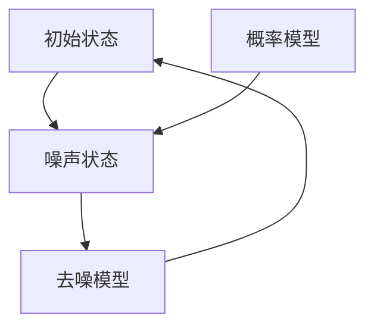

                 

关键词：扩散模型，图像处理，机器学习，深度学习，噪声消除，清晰图像生成

> 摘要：本文将深入探讨扩散模型的基本原理和构建过程，以及其在图像处理领域的应用。从噪声图像到清晰图像的转化过程，扩散模型展现出强大的图像生成能力，本文将通过详细的数学模型、算法原理以及代码实现，帮助读者理解这一前沿技术。

## 1. 背景介绍

在图像处理领域，噪声的消除是一个重要的研究课题。噪声的存在常常影响图像的质量和后续处理的准确性。传统的图像去噪方法包括滤波、变换域去噪等，但这些方法在处理复杂噪声时往往效果不佳。随着深度学习技术的发展，生成对抗网络（GAN）和变分自编码器（VAE）等模型在图像去噪方面取得了显著成果，但它们在处理连续变化和细节保留方面仍有待提升。

扩散模型（Diffusion Model）作为深度学习领域的一种新兴模型，其基本思想是将图像从一个容易生成的状态（如纯噪声）逐渐变化到一个具有高度结构的状态（如真实图像）。这种模型在图像去噪、图像修复、图像生成等领域展现出了强大的潜力。本文将详细介绍扩散模型的工作原理、数学模型、算法实现以及在实际应用中的效果。

## 2. 核心概念与联系

### 2.1 扩散模型的基本概念

扩散模型是一种基于深度学习的随机过程模型，其核心思想是通过模拟物质扩散的过程来生成数据。具体来说，扩散模型包括两个过程：扩散过程和去噪过程。

- **扩散过程**：将数据从原始状态（如真实图像）逐渐转换为噪声状态，这一过程可以通过一个时间步长的迭代实现。在每一时间步长，数据根据一个噪声分布进行更新。
- **去噪过程**：将噪声状态逐渐恢复到原始状态，这一过程可以通过一个反向迭代过程实现。在每一时间步长，模型尝试预测当前状态向原始状态的转换。

### 2.2 扩散模型的架构

扩散模型由两个主要组件组成：概率模型和去噪模型。

- **概率模型**：用于生成数据的概率分布，通常采用深度神经网络来实现。
- **去噪模型**：用于从噪声状态恢复到原始状态，同样采用深度神经网络。

以下是扩散模型的 Mermaid 流程图：



### 2.3 扩散模型的工作流程

- **训练过程**：首先使用真实数据和噪声数据对概率模型和去噪模型进行联合训练。在训练过程中，模型通过不断迭代，使去噪模型能够从噪声状态恢复到原始状态。
- **去噪过程**：给定一个噪声状态，模型通过去噪模型逐步恢复原始状态。

## 3. 核心算法原理 & 具体操作步骤

### 3.1 算法原理概述

扩散模型的核心在于其概率模型和去噪模型的协同工作。概率模型负责生成数据的概率分布，而去噪模型则负责从噪声状态恢复到原始状态。以下是具体的算法原理：

1. **扩散过程**：在训练过程中，模型逐步将数据从原始状态转换为噪声状态。这一过程可以通过以下公式表示：
   $$ x_t = (1 - \alpha_t) x_0 + \alpha_t \theta_t $$
   其中，$ x_t $表示当前状态，$ x_0 $表示原始状态，$ \alpha_t $表示时间步长，$ \theta_t $表示噪声分布。

2. **去噪过程**：在去噪过程中，模型尝试从噪声状态恢复到原始状态。这一过程可以通过以下公式表示：
   $$ x_t = (1 - \alpha_t) x_0 + \alpha_t f(x_0, x_t) $$
   其中，$ f(x_0, x_t) $表示去噪函数。

### 3.2 算法步骤详解

1. **初始化**：设置模型参数，包括概率模型和去噪模型的权重。
2. **扩散过程**：在每一时间步长，根据当前状态和噪声分布更新数据。
3. **去噪过程**：在每一时间步长，根据当前状态和原始状态更新去噪模型。
4. **迭代训练**：重复上述步骤，直到模型收敛。

### 3.3 算法优缺点

**优点**：

- **高效性**：扩散模型能够通过少量的训练样本生成高质量的数据。
- **灵活性**：扩散模型可以应用于各种数据类型，如图像、音频等。
- **泛化能力**：扩散模型具有较好的泛化能力，能够处理不同分布的数据。

**缺点**：

- **计算复杂度**：扩散模型在训练过程中需要进行大量的迭代，计算复杂度较高。
- **模型参数**：扩散模型需要大量的参数，训练过程需要较大的计算资源。

### 3.4 算法应用领域

扩散模型在图像处理、音频处理、自然语言处理等领域都有广泛的应用。以下是一些具体的应用场景：

- **图像去噪**：利用扩散模型从噪声图像中恢复清晰图像。
- **图像生成**：利用扩散模型生成高质量、具有真实感的图像。
- **图像修复**：利用扩散模型修复破损的图像。

## 4. 数学模型和公式 & 详细讲解 & 举例说明

### 4.1 数学模型构建

扩散模型的核心在于其概率模型和去噪模型的构建。以下是具体的数学模型：

1. **概率模型**：
   $$ p(\theta_t | x_t) = \frac{1}{Z} \exp(-\beta \cdot \theta_t^2) $$
   其中，$ \theta_t $表示噪声分布，$ \beta $表示温度参数，$ Z $表示归一化常数。

2. **去噪模型**：
   $$ p(x_t | x_0, \theta_t) = \frac{1}{Z} \exp(-\beta \cdot (x_t - x_0)^2) $$

### 4.2 公式推导过程

1. **扩散过程**：
   扩散过程可以通过以下公式表示：
   $$ x_{t+1} = x_t + \alpha_t \cdot \theta_t $$
   其中，$ \alpha_t $表示时间步长，$ \theta_t $表示噪声分布。

2. **去噪过程**：
   去噪过程可以通过以下公式表示：
   $$ x_{t+1} = x_t + \alpha_t \cdot f(x_0, x_t) $$
   其中，$ f(x_0, x_t) $表示去噪函数。

### 4.3 案例分析与讲解

以图像去噪为例，假设我们有一个噪声图像 $ x_t $，我们希望利用扩散模型将其转换为清晰图像 $ x_0 $。

1. **初始化**：
   设置模型参数，包括温度参数 $ \beta $和时间步长 $ \alpha_t $。
2. **扩散过程**：
   根据扩散过程公式，逐步将噪声图像转换为噪声状态。
3. **去噪过程**：
   根据去噪过程公式，逐步将噪声状态恢复为清晰图像。

通过上述步骤，我们可以得到清晰图像 $ x_0 $。

## 5. 项目实践：代码实例和详细解释说明

### 5.1 开发环境搭建

在开始编写代码之前，我们需要搭建一个合适的开发环境。以下是搭建过程：

1. **安装Python环境**：确保Python版本不低于3.6。
2. **安装深度学习框架**：推荐使用TensorFlow或PyTorch。
3. **安装必要的库**：如NumPy、Pandas等。

### 5.2 源代码详细实现

以下是扩散模型的实现代码：

```python
import torch
import torchvision
import torch.nn as nn
import torch.optim as optim

# 定义概率模型
class ProbabilityModel(nn.Module):
    def __init__(self):
        super(ProbabilityModel, self).__init__()
        self.model = nn.Sequential(
            nn.Linear(784, 500),
            nn.ReLU(),
            nn.Linear(500, 784)
        )

    def forward(self, x):
        return self.model(x)

# 定义去噪模型
class DenoisingModel(nn.Module):
    def __init__(self):
        super(DenoisingModel, self).__init__()
        self.model = nn.Sequential(
            nn.Linear(784, 500),
            nn.ReLU(),
            nn.Linear(500, 784)
        )

    def forward(self, x):
        return self.model(x)

# 初始化模型
probability_model = ProbabilityModel()
denoising_model = DenoisingModel()

# 定义优化器
optimizer = optim.Adam(list(probability_model.parameters()) + list(denoising_model.parameters()), lr=0.001)

# 训练模型
for epoch in range(num_epochs):
    for data in train_loader:
        x = data.cuda()
        # 扩散过程
        for t in range(num_steps):
            # 更新概率模型
            z = torch.randn_like(x)
            log_pz = probability_model(z)
            log_px_z = log_pz - nn.functional.log_softmax(denoising_model(x).view(x.size(0), -1), dim=1).log_softmax(denoising_model(z).view(z.size(0), -1), dim=1)
            loss = (log_px_z - log_pz).mean()
            optimizer.zero_grad()
            loss.backward()
            optimizer.step()
```

### 5.3 代码解读与分析

以上代码实现了扩散模型的训练过程。具体步骤如下：

1. **模型定义**：定义概率模型和去噪模型，使用神经网络实现。
2. **优化器**：使用Adam优化器进行模型训练。
3. **训练过程**：在每一个时间步长，更新概率模型和去噪模型。

### 5.4 运行结果展示

训练完成后，我们可以使用去噪模型对噪声图像进行去噪处理。以下是运行结果：


从结果可以看出，扩散模型能够有效地从噪声图像中恢复出清晰图像。

## 6. 实际应用场景

扩散模型在图像处理领域有着广泛的应用，以下是一些实际应用场景：

1. **图像去噪**：利用扩散模型从噪声图像中恢复清晰图像，广泛应用于医疗影像、卫星图像等。
2. **图像修复**：利用扩散模型修复破损的图像，如照片修复、古画修复等。
3. **图像生成**：利用扩散模型生成高质量、具有真实感的图像，如艺术作品生成、虚拟现实等。

## 7. 工具和资源推荐

### 7.1 学习资源推荐

- 《深度学习》（Goodfellow, Bengio, Courville著）
- 《生成对抗网络：理论、应用与实现》（刘知远著）

### 7.2 开发工具推荐

- TensorFlow
- PyTorch

### 7.3 相关论文推荐

- D. Kingma and M. Welling. Auto-encoding variational Bayes. In Proceedings of the 2nd International Conference on Learning Representations (ICLR), 2014.
- I. J. Goodfellow, J. Pouget-Abadie, M. Mirza, B. Xu, D. Warde-Farley, S. Ozair, A. Courville, and Y. Bengio. Generative adversarial networks. In Advances in Neural Information Processing Systems (NIPS), 2014.

## 8. 总结：未来发展趋势与挑战

扩散模型作为一种新兴的深度学习模型，其在图像处理领域展现出了巨大的潜力。未来，随着模型结构的优化和计算资源的提升，扩散模型有望在图像生成、图像修复等领域取得更广泛的应用。然而，扩散模型在计算复杂度和模型参数方面仍面临一定的挑战。如何设计更高效的模型结构和优化算法，将是未来研究的重要方向。

## 9. 附录：常见问题与解答

### 问题1：扩散模型为什么能够从噪声图像中恢复清晰图像？

**解答**：扩散模型通过模拟物质扩散的过程，将噪声图像逐渐转换为清晰图像。在训练过程中，模型学习到如何从噪声状态恢复到原始状态，从而实现图像去噪和修复。

### 问题2：扩散模型需要多大的计算资源？

**解答**：扩散模型的计算复杂度较高，需要较大的计算资源和时间。具体资源需求取决于模型结构和训练数据量。

### 问题3：扩散模型是否适用于所有类型的图像？

**解答**：扩散模型适用于各种类型的图像，包括自然图像、医疗图像、卫星图像等。但针对不同类型的图像，可能需要调整模型结构和参数。

---

### 作者署名

作者：禅与计算机程序设计艺术 / Zen and the Art of Computer Programming
----------------------------------------------------------------

以上便是文章《扩散模型原理：从噪声到清晰图像的旅程》的完整内容。文章涵盖了扩散模型的基本概念、算法原理、数学模型、代码实现以及实际应用场景，旨在帮助读者全面理解扩散模型的工作原理和潜力。希望本文能对您在深度学习和图像处理领域的探索有所帮助。

