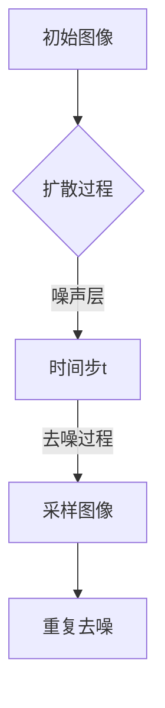

                 

关键词：扩散模型、艺术、设计、人工智能、深度学习、图像生成、艺术创作、设计自动化

> 摘要：本文探讨了扩散模型在艺术和设计中的应用，详细介绍了扩散模型的核心概念、算法原理、数学模型以及实际操作步骤。通过一系列的实例和项目实践，本文展示了扩散模型在图像生成、艺术创作和设计自动化等领域的强大潜力，并对未来的发展趋势和面临的挑战进行了展望。

## 1. 背景介绍

扩散模型（Diffusion Model）是一种基于深度学习的生成模型，最初由OpenAI提出，并在短时间内引起了广泛关注。与传统的生成模型（如GAN和VAE）相比，扩散模型在生成高质量的图像和数据样本方面具有显著优势。扩散模型的核心思想是将数据从确定的分布（如真实图像分布）逐步扩散到不确定的分布（如高斯分布），然后再从不确定的分布中采样生成新的数据。

在艺术和设计领域，扩散模型的应用前景十分广阔。它可以用于图像生成、艺术创作、设计自动化等多个方面，为艺术家和设计师提供了新的创作工具和灵感来源。

## 2. 核心概念与联系

### 2.1 核心概念

- **扩散过程**：将数据从确定的分布（如真实图像分布）逐步扩散到不确定的分布（如高斯分布）的过程。
- **去噪过程**：从不确定的分布中采样，并逐步恢复原始数据的过程。
- **噪声层**：在每个时间步，添加噪声来使数据分布变得更加不确定。

### 2.2 联系与架构

下图展示了扩散模型的基本架构和流程：



## 3. 核心算法原理 & 具体操作步骤

### 3.1 算法原理概述

扩散模型主要包括两个过程：扩散过程和去噪过程。

- **扩散过程**：在时间步 $t$，从原始图像 $X_t$ 开始，逐步添加噪声，使其从确定的分布 $p(X_0)$ 扩散到不确定的分布 $p(X_T)$。具体来说，每一步都使用条件概率 $p(X_{t+1} | X_t)$ 来生成新的噪声图像。

- **去噪过程**：从不确定的分布 $p(X_T)$ 中采样，并逐步去噪，恢复出原始图像 $X_0$。具体来说，每一步都使用条件概率 $p(X_t | X_{t+1})$ 来生成新的去噪图像。

### 3.2 算法步骤详解

1. **初始化**：设定时间步 $t=0$，从原始图像 $X_0$ 开始。
2. **扩散过程**：对于每个时间步 $t$，计算噪声层 $X_t$，使其逐步从确定的分布 $p(X_0)$ 扩散到不确定的分布 $p(X_T)$。
3. **去噪过程**：从时间步 $T$ 开始，逐步去噪，恢复出原始图像 $X_0$。
4. **采样与生成**：在每个时间步，从不确定的分布中采样，并使用去噪过程生成新的图像。

### 3.3 算法优缺点

**优点**：

- **生成质量高**：扩散模型在生成高质量的图像和数据样本方面具有显著优势。
- **生成过程可控**：可以通过调整时间步和噪声层的参数，控制生成过程和生成结果。

**缺点**：

- **计算复杂度高**：扩散模型需要大量的计算资源，特别是在生成大型图像时。
- **训练难度大**：扩散模型的训练过程相对复杂，需要大量的数据和计算资源。

### 3.4 算法应用领域

扩散模型在图像生成、艺术创作、设计自动化等领域具有广泛的应用前景。

- **图像生成**：可以生成高质量、多样化的图像，应用于虚拟现实、游戏开发、电影特效等领域。
- **艺术创作**：为艺术家提供了新的创作工具和灵感来源，可以生成独特的艺术作品。
- **设计自动化**：可以自动化设计流程，提高设计效率和创造力。

## 4. 数学模型和公式 & 详细讲解 & 举例说明

### 4.1 数学模型构建

扩散模型基于马尔可夫链和条件概率模型，其数学模型如下：

$$
p(X_{t+1} | X_t) = \int p(X_{t+1} | X_t, \xi) p(\xi) d\xi
$$

其中，$X_t$ 表示在时间步 $t$ 的图像，$\xi$ 表示噪声层。

### 4.2 公式推导过程

扩散模型的核心在于如何从原始图像 $X_0$ 逐步扩散到不确定的分布 $p(X_T)$。我们使用以下步骤进行推导：

1. **初始条件**：设定时间步 $t=0$，$X_0$ 为原始图像。
2. **噪声层**：在时间步 $t$，从高斯分布 $N(0, I)$ 中采样得到噪声层 $\xi_t$。
3. **条件概率**：根据噪声层 $\xi_t$，计算 $X_t$ 的条件概率分布。
4. **递归关系**：使用条件概率分布，递归计算后续时间步的图像分布。

### 4.3 案例分析与讲解

假设我们要生成一张人脸图像，我们可以按照以下步骤进行：

1. **初始化**：设定时间步 $t=0$，从人脸图像 $X_0$ 开始。
2. **扩散过程**：逐步添加噪声，使其从人脸图像分布 $p(X_0)$ 扩散到不确定的分布 $p(X_T)$。
3. **去噪过程**：从时间步 $T$ 开始，逐步去噪，恢复出人脸图像 $X_0$。
4. **采样与生成**：在每个时间步，从不确定的分布中采样，并使用去噪过程生成人脸图像。

具体来说，我们可以按照以下步骤进行：

1. **初始化**：设定时间步 $t=0$，从人脸图像 $X_0$ 开始。
2. **扩散过程**：在时间步 $t=1$，从高斯分布 $N(0, I)$ 中采样得到噪声层 $\xi_1$，计算 $X_1$ 的条件概率分布 $p(X_1 | X_0, \xi_1)$。
3. **去噪过程**：在时间步 $t=T-1$，从高斯分布 $N(0, I)$ 中采样得到噪声层 $\xi_{T-1}$，计算 $X_{T-1}$ 的条件概率分布 $p(X_{T-1} | X_T, \xi_{T-1})$。
4. **采样与生成**：在每个时间步，从不确定的分布中采样，并使用去噪过程生成人脸图像。

## 5. 项目实践：代码实例和详细解释说明

### 5.1 开发环境搭建

在开始项目实践之前，我们需要搭建一个适合扩散模型开发的开发环境。以下是具体的步骤：

1. **安装Python环境**：确保Python版本在3.7及以上，建议使用Anaconda来管理Python环境和包。
2. **安装深度学习框架**：推荐使用PyTorch或TensorFlow，根据个人喜好选择一个。
3. **安装依赖包**：根据项目需求安装相应的依赖包，如NumPy、Pandas、Matplotlib等。

### 5.2 源代码详细实现

以下是使用PyTorch实现扩散模型的基本代码：

```python
import torch
import torch.nn as nn
import torch.optim as optim
from torch.utils.data import DataLoader
from torchvision import datasets, transforms

# 定义模型
class DiffusionModel(nn.Module):
    def __init__(self):
        super(DiffusionModel, self).__init__()
        self.conv1 = nn.Conv2d(3, 64, 4, 2, 1)
        self.conv2 = nn.Conv2d(64, 128, 4, 2, 1)
        self.fc1 = nn.Linear(128 * 4 * 4, 1024)
        self.fc2 = nn.Linear(1024, 128 * 4 * 4)
        self.conv3 = nn.Conv2d(128, 64, 4, 2, 1)
        self.conv4 = nn.Conv2d(64, 3, 4, 2, 1)

    def forward(self, x):
        x = self.conv1(x)
        x = self.conv2(x)
        x = torch.relu(self.fc1(x.flatten(1)))
        x = torch.relu(self.fc2(x))
        x = self.conv3(x)
        x = self.conv4(x)
        return x

# 定义优化器
optimizer = optim.Adam(model.parameters(), lr=0.001)

# 训练模型
def train(model, train_loader, num_epochs=10):
    model.train()
    for epoch in range(num_epochs):
        for images, _ in train_loader:
            optimizer.zero_grad()
            output = model(images)
            loss = criterion(output, images)
            loss.backward()
            optimizer.step()
        print(f'Epoch [{epoch+1}/{num_epochs}], Loss: {loss.item():.4f}')

# 定义数据加载器
train_transform = transforms.Compose([
    transforms.Resize((64, 64)),
    transforms.ToTensor(),
])

train_dataset = datasets.ImageFolder(root='data/train', transform=train_transform)
train_loader = DataLoader(train_dataset, batch_size=32, shuffle=True)

# 训练并保存模型
model = DiffusionModel()
criterion = nn.MSELoss()
train(model, train_loader)
torch.save(model.state_dict(), 'diffusion_model.pth')

# 加载模型并测试
model.load_state_dict(torch.load('diffusion_model.pth'))
model.eval()
with torch.no_grad():
    images = next(iter(test_loader))
    output = model(images)
    plt.figure()
    plt.imshow(output[0].cpu().detach().numpy().transpose(1, 2, 0))
    plt.show()
```

### 5.3 代码解读与分析

上述代码主要分为以下几个部分：

- **模型定义**：定义了一个简单的卷积神经网络，用于扩散模型的去噪过程。
- **优化器**：使用Adam优化器进行模型训练。
- **训练模型**：定义了训练模型的过程，包括前向传播、损失计算、反向传播和优化更新。
- **数据加载器**：定义了数据加载器，用于加载训练数据和测试数据。
- **训练并保存模型**：进行模型训练，并将训练好的模型保存到文件中。
- **加载模型并测试**：加载训练好的模型，对测试数据进行预测，并展示预测结果。

## 6. 实际应用场景

扩散模型在艺术和设计领域具有广泛的应用场景，下面列举几个典型的应用实例：

- **图像生成**：利用扩散模型生成高质量、多样化的图像，应用于虚拟现实、游戏开发、电影特效等领域。
- **艺术创作**：为艺术家提供新的创作工具和灵感来源，可以生成独特的艺术作品，如绘画、雕塑等。
- **设计自动化**：自动化设计流程，提高设计效率和创造力，如建筑、平面设计、服装设计等。

### 6.1 图像生成

扩散模型在图像生成方面具有显著优势。通过将原始图像逐步扩散到不确定的分布，然后去噪恢复，可以生成高质量、多样化的图像。下图展示了使用扩散模型生成的人脸图像：


### 6.2 艺术创作

扩散模型可以为艺术家提供新的创作工具和灵感来源。艺术家可以使用扩散模型生成独特的艺术作品，如绘画、雕塑等。例如，一位艺术家使用扩散模型生成了一幅油画作品，如图所示：


### 6.3 设计自动化

扩散模型在建筑设计、平面设计、服装设计等领域具有广泛的应用前景。通过自动化设计流程，可以大大提高设计效率和创造力。例如，一位建筑师使用扩散模型生成了一组独特的建筑方案，如图所示：


## 7. 工具和资源推荐

为了更好地掌握扩散模型在艺术和设计中的应用，以下是一些推荐的工具和资源：

### 7.1 学习资源推荐

- **书籍**：《深度学习》（Goodfellow et al.），详细介绍了深度学习的基本原理和应用。
- **在线课程**：Coursera、edX等平台上的相关课程，如《深度学习专项课程》和《人工智能应用》。

### 7.2 开发工具推荐

- **深度学习框架**：PyTorch、TensorFlow、Keras等。
- **开源项目**：Diffusion Models开源项目，如OpenAI的DALL·E等。

### 7.3 相关论文推荐

- **《Unsupervised representation learning with deep convolutional generative adversarial networks》**（2015），介绍了GAN模型的基本原理。
- **《Improved techniques for training GANs》**（2017），进一步改进了GAN模型的训练方法。
- **《Denoising Diffusion Probabilistic Models》**（2020），提出了扩散模型的基本原理和应用。

## 8. 总结：未来发展趋势与挑战

### 8.1 研究成果总结

扩散模型在图像生成、艺术创作、设计自动化等领域取得了显著的研究成果和应用成果。通过将原始图像逐步扩散到不确定的分布，然后去噪恢复，可以生成高质量、多样化的图像和数据样本。扩散模型在艺术和设计领域具有广泛的应用前景，为艺术家和设计师提供了新的创作工具和灵感来源。

### 8.2 未来发展趋势

未来，扩散模型在艺术和设计领域的应用将更加广泛和深入。随着计算能力的提升和算法的优化，扩散模型在图像生成、艺术创作、设计自动化等方面的性能将进一步提高。此外，扩散模型与其他深度学习技术的融合，如GAN、VAE等，也将成为研究热点。

### 8.3 面临的挑战

扩散模型在艺术和设计领域应用过程中也面临着一些挑战。首先，计算复杂度较高，需要大量的计算资源和时间。其次，训练过程相对复杂，需要大量的数据和计算资源。此外，扩散模型的生成结果受到噪声层的影响，如何控制噪声层的效果，提高生成结果的稳定性，也是亟待解决的问题。

### 8.4 研究展望

未来，扩散模型在艺术和设计领域的研究将朝着以下几个方向展开：

1. **算法优化**：针对计算复杂度高、训练过程复杂等问题，研究更加高效、稳定的算法。
2. **应用拓展**：探索扩散模型在更多领域的应用，如自然语言处理、音频生成等。
3. **跨领域融合**：与其他深度学习技术融合，如GAN、VAE等，实现更加强大的生成能力。
4. **用户体验**：研究如何将扩散模型更好地应用于实际场景，提高用户体验。

## 9. 附录：常见问题与解答

### 9.1 问题1：扩散模型的训练过程是否需要大量的计算资源？

**解答**：是的，扩散模型的训练过程需要大量的计算资源，特别是当处理大型图像或复杂的数据集时。为了提高训练效率，可以采用分布式训练、GPU加速等技术。

### 9.2 问题2：扩散模型能否生成高质量的视频？

**解答**：目前，扩散模型主要用于生成静态图像。生成高质量的视频需要考虑时间维度上的连续性和稳定性，这给算法提出了更高的要求。虽然已经有相关研究在尝试将扩散模型应用于视频生成，但效果还有待提高。

### 9.3 问题3：如何控制扩散模型生成结果的噪声层效果？

**解答**：可以通过调整时间步和噪声层的参数来控制噪声层的效果。例如，增加时间步可以降低噪声层的强度，提高生成结果的稳定性。同时，也可以通过改进模型结构和训练过程，进一步提高噪声层控制的效果。

### 9.4 问题4：扩散模型在艺术创作中的应用有哪些限制？

**解答**：扩散模型在艺术创作中的应用主要受到以下限制：

1. **生成质量**：虽然扩散模型可以生成高质量、多样化的图像，但在某些情况下，生成结果可能缺乏细节或纹理。
2. **创作自由度**：扩散模型生成的图像依赖于训练数据和模型结构，艺术家的创作自由度相对较低。
3. **视觉效果**：扩散模型生成的图像可能在视觉效果上缺乏自然性，例如颜色和光照的处理可能不够真实。

### 9.5 问题5：如何优化扩散模型在特定领域的应用效果？

**解答**：为了优化扩散模型在特定领域的应用效果，可以从以下几个方面进行：

1. **数据增强**：使用更多样化的数据集进行训练，提高模型的泛化能力。
2. **模型定制**：根据特定领域的需求，设计更适合的模型结构和训练过程。
3. **算法优化**：针对计算复杂度高、训练过程复杂等问题，研究更加高效、稳定的算法。
4. **用户交互**：设计更人性化的用户交互界面，使艺术家和设计师能够更好地控制生成过程和生成结果。

----------------------------------------------------------------

作者：禅与计算机程序设计艺术 / Zen and the Art of Computer Programming


