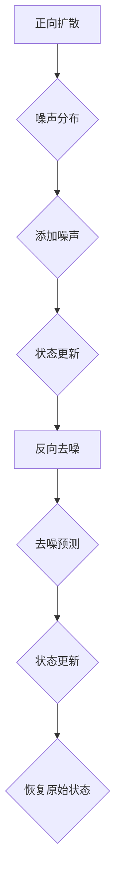

                 

关键词：扩散模型、图像生成、AI、深度学习、生成对抗网络（GAN）、变分自编码器（VAE）

摘要：本文将深入探讨扩散模型这一近年来在图像生成领域崭露头角的技术。通过对扩散模型的核心概念、算法原理、数学模型及其在实践中的应用进行详细分析，我们将揭示这一技术的独特优势和应用前景。同时，文章还将讨论未来发展趋势与面临的挑战，以期为相关领域的研究者和开发者提供有价值的参考。

## 1. 背景介绍

图像生成技术在人工智能领域具有广泛的应用，从艺术创作到数据增强，再到自动驾驶和医疗诊断，都有着不可或缺的地位。传统的图像生成方法如纹理合成、基于规则的方法等，虽然在一定程度上能够实现图像的生成，但其生成能力受到限制，难以处理复杂和高维的数据。

随着深度学习技术的发展，生成对抗网络（GAN）和变分自编码器（VAE）等新型生成模型逐渐成为图像生成的主流方法。GAN通过生成器与判别器的对抗训练，实现了高保真的图像生成；VAE则通过引入潜在变量，实现了更为灵活和多样的图像生成。然而，这些方法在生成图像的质量和多样性上仍然存在一定的局限性。

近年来，扩散模型（Diffusion Model）作为一种全新的图像生成技术，受到了广泛关注。与传统的生成模型不同，扩散模型通过模拟数据生成过程，从随机噪声逐步扩散到真实数据，实现了高效和高质量的图像生成。本文将重点介绍扩散模型的基本原理、算法流程以及在图像生成中的应用，探讨其优势和未来发展方向。

### 1.1 扩散模型的起源与发展

扩散模型的概念最早可以追溯到1995年，由统计学和物理学领域的科学家提出。当时，研究人员利用扩散模型来模拟物质在空间中的扩散过程，如热传导和化学扩散等。随着深度学习和生成模型的发展，扩散模型在图像生成领域也得到了广泛应用。

2018年，研究者将扩散模型引入到计算机视觉领域，提出了去噪扩散模型（Denoising Diffusion Probabilistic Model）。此后，随着深度学习技术的不断进步，扩散模型在图像生成领域逐渐崭露头角。2020年，深度学习公司OpenAI提出了去噪扩散模型的一个变种——去噪扩散概率模型（Denoising Diffusion Probabilistic Model），这一模型在图像生成任务上取得了突破性的成果，引起了广泛关注。

### 1.2 扩散模型的重要性

扩散模型在图像生成领域的重要性主要体现在以下几个方面：

1. **高质量的图像生成**：扩散模型能够生成高质量、高分辨率的图像，相比传统的生成模型具有更高的生成质量。
2. **高效的生成过程**：扩散模型通过模拟数据生成过程，实现了高效和快速的图像生成，适合处理大规模的图像数据。
3. **灵活的应用场景**：扩散模型在图像生成、图像编辑、数据增强等多个应用场景中展现出良好的效果，具有广泛的应用前景。
4. **新的研究思路**：扩散模型为图像生成领域提供了一种新的研究思路，推动了深度学习和生成模型的发展。

综上所述，扩散模型作为一种新兴的图像生成技术，具有显著的优越性和广阔的应用前景。接下来，本文将详细介绍扩散模型的核心概念、算法原理、数学模型以及实际应用。

## 2. 核心概念与联系

### 2.1 扩散模型的基本原理

扩散模型的核心思想是模拟数据生成过程，从随机噪声逐步扩散到真实数据。具体来说，扩散模型分为两个阶段：正向扩散过程和反向去噪过程。

**正向扩散过程**：在正向扩散过程中，数据从原始状态（如真实图像）逐步扩散到随机噪声状态。这一过程通过迭代地添加噪声实现。具体步骤如下：

1. 初始状态：选择一个真实的图像或数据点作为初始状态。
2. 添加噪声：根据预先定义的噪声分布，对当前状态添加噪声，得到新的状态。
3. 重复迭代：重复上述步骤，逐步增加噪声，直到状态达到随机噪声状态。

**反向去噪过程**：在反向去噪过程中，从随机噪声状态逐步恢复到原始状态。这一过程通过迭代地去噪实现。具体步骤如下：

1. 初始状态：选择一个随机噪声状态作为初始状态。
2. 去噪预测：根据当前状态和模型预测，估计原始状态。
3. 更新状态：根据估计的原始状态，更新当前状态。
4. 重复迭代：重复上述步骤，逐步减少噪声，直到状态恢复到原始状态。

通过上述两个过程，扩散模型实现了从随机噪声到真实数据的生成。

### 2.2 扩散模型的架构

扩散模型的架构主要包括两部分：噪声分布和去噪模型。

**噪声分布**：噪声分布用于定义正向扩散过程中的噪声添加过程。常见的噪声分布包括高斯分布、均匀分布等。噪声分布的选择会影响模型的生成质量和生成速度。

**去噪模型**：去噪模型用于定义反向去噪过程中的去噪预测和状态更新过程。去噪模型可以是神经网络、深度学习模型等。去噪模型的选择和设计会影响模型的生成效果和生成效率。

下面是一个简单的 Mermaid 流程图，展示了扩散模型的基本架构：



### 2.3 扩散模型与其他生成模型的对比

扩散模型与传统的生成模型如 GAN 和 VAE 有明显的区别。以下是对比分析：

**GAN**：生成对抗网络（GAN）通过生成器（Generator）和判别器（Discriminator）的对抗训练实现图像生成。GAN 的优点在于能够生成高质量、高分辨率的图像，但训练过程较为复杂，容易出现模式崩塌（mode collapse）问题，即生成器只能生成类似的一种或几种模式。

**VAE**：变分自编码器（VAE）通过编码器（Encoder）和解码器（Decoder）实现图像生成。VAE 的优点在于生成图像的多样性和灵活性，但生成图像的质量和分辨率相对较低。

**扩散模型**：扩散模型通过模拟数据生成过程实现图像生成，具有高质量的图像生成能力和高效的生成过程。扩散模型在处理复杂和高维数据方面具有明显优势，同时避免了 GAN 的模式崩塌问题和 VAE 的低生成质量问题。

### 2.4 扩散模型的应用场景

扩散模型在图像生成领域具有广泛的应用场景，包括但不限于：

1. **艺术创作**：扩散模型可以生成各种风格的艺术作品，如绘画、照片等。
2. **数据增强**：扩散模型可以用于图像数据增强，提高模型的训练效果和泛化能力。
3. **图像编辑**：扩散模型可以用于图像编辑，如图像修复、图像超分辨率等。
4. **医学图像分析**：扩散模型可以用于医学图像分析，如疾病诊断、器官分割等。

通过上述分析，我们可以看出扩散模型作为一种新兴的图像生成技术，具有独特的优势和广泛的应用前景。接下来，本文将详细讨论扩散模型的核心算法原理和具体操作步骤。

## 3. 核心算法原理 & 具体操作步骤

### 3.1 算法原理概述

扩散模型的核心算法原理可以概括为两个阶段：正向扩散过程和反向去噪过程。正向扩散过程通过逐步添加噪声，将原始数据（如图像）扩散到随机噪声状态；反向去噪过程通过逐步去除噪声，将随机噪声状态恢复到原始数据状态。

### 3.2 算法步骤详解

#### 3.2.1 正向扩散过程

正向扩散过程的步骤如下：

1. **初始化**：选择一个真实的图像或数据点作为初始状态。
2. **添加噪声**：根据预先定义的噪声分布，对当前状态添加噪声，得到新的状态。这一过程通过迭代地添加噪声实现。
3. **状态更新**：将添加噪声后的状态更新为新的状态，重复上述步骤，逐步增加噪声，直到状态达到随机噪声状态。

#### 3.2.2 反向去噪过程

反向去噪过程的步骤如下：

1. **初始化**：选择一个随机噪声状态作为初始状态。
2. **去噪预测**：根据当前状态和模型预测，估计原始状态。这一过程通过迭代地去噪实现。
3. **状态更新**：根据估计的原始状态，更新当前状态。
4. **重复迭代**：重复上述步骤，逐步减少噪声，直到状态恢复到原始状态。

### 3.3 算法优缺点

#### 优点

1. **高质量的图像生成**：扩散模型能够生成高质量、高分辨率的图像，相比传统的生成模型具有更高的生成质量。
2. **高效的生成过程**：扩散模型通过模拟数据生成过程，实现了高效和快速的图像生成，适合处理大规模的图像数据。
3. **灵活的应用场景**：扩散模型在图像生成、图像编辑、数据增强等多个应用场景中展现出良好的效果，具有广泛的应用前景。

#### 缺点

1. **计算复杂度高**：扩散模型在正向扩散和反向去噪过程中需要大量的计算，对于大规模图像数据，计算复杂度较高。
2. **训练时间较长**：扩散模型需要通过大量的迭代进行训练，训练时间较长。

### 3.4 算法应用领域

扩散模型在图像生成领域具有广泛的应用，包括但不限于以下领域：

1. **艺术创作**：扩散模型可以生成各种风格的艺术作品，如绘画、照片等。
2. **数据增强**：扩散模型可以用于图像数据增强，提高模型的训练效果和泛化能力。
3. **图像编辑**：扩散模型可以用于图像编辑，如图像修复、图像超分辨率等。
4. **医学图像分析**：扩散模型可以用于医学图像分析，如疾病诊断、器官分割等。

通过上述算法原理和具体操作步骤的详细分析，我们可以看到扩散模型作为一种新兴的图像生成技术，具有显著的优越性和广泛的应用前景。接下来，本文将深入探讨扩散模型的数学模型和公式。

## 4. 数学模型和公式 & 详细讲解 & 举例说明

### 4.1 数学模型构建

扩散模型的核心在于其正向扩散过程和反向去噪过程的数学描述。为了构建数学模型，我们首先需要定义几个关键参数和函数。

#### 4.1.1 参数定义

1. **噪声分布**：选择合适的噪声分布，如高斯分布、均匀分布等。以高斯分布为例，其概率密度函数（PDF）为：
   $$ p(\mathbf{x}|\theta) = \frac{1}{\sqrt{2\pi\sigma^2}} e^{-\frac{(\mathbf{x} - \mu)^T(\mathbf{x} - \mu)}{2\sigma^2}} $$
   其中，$\mu$ 是均值，$\sigma$ 是标准差。

2. **模型参数**：模型参数 $\theta$ 包括噪声分布的参数和去噪模型的参数。

3. **状态变量**：状态变量 $\mathbf{x}$ 表示图像或数据点。

#### 4.1.2 数学模型

**正向扩散过程**：

正向扩散过程可以用以下步骤描述：

1. **初始化**：选择一个真实的图像 $\mathbf{x}_0$ 作为初始状态。
2. **迭代添加噪声**：对于每个时间步 $t$，从噪声分布中采样噪声 $\mathbf{z}_t$，并更新状态：
   $$ \mathbf{x}_{t+1} = \mathbf{x}_t + \theta_t \mathbf{z}_t $$
   其中，$\theta_t$ 是时间步 $t$ 的模型参数。

3. **状态更新**：重复迭代步骤，直到状态达到随机噪声状态。

**反向去噪过程**：

反向去噪过程可以用以下步骤描述：

1. **初始化**：选择一个随机噪声状态 $\mathbf{x}_0$ 作为初始状态。
2. **迭代去噪预测**：对于每个时间步 $t$，根据当前状态 $\mathbf{x}_t$ 和模型预测，估计原始状态：
   $$ \mathbf{x}_{t+1} = \mathbf{G}(\mathbf{x}_t) $$
   其中，$\mathbf{G}(\mathbf{x}_t)$ 是去噪模型。

3. **状态更新**：根据估计的原始状态，更新当前状态。
4. **重复迭代**：重复迭代步骤，直到状态恢复到原始状态。

### 4.2 公式推导过程

**正向扩散过程**：

正向扩散过程的公式推导如下：

1. **初始化**：
   $$ \mathbf{x}_0 \sim p(\mathbf{x}_0|\theta_0) $$
   初始状态 $\mathbf{x}_0$ 服从噪声分布。

2. **迭代添加噪声**：
   对于每个时间步 $t$，从噪声分布中采样噪声 $\mathbf{z}_t$，并更新状态：
   $$ \mathbf{x}_{t+1} = \mathbf{x}_t + \theta_t \mathbf{z}_t $$
   其中，$\theta_t$ 是时间步 $t$ 的模型参数。

3. **状态更新**：
   $$ \mathbf{x}_{t+1} \sim p(\mathbf{x}_{t+1}|\theta_{t+1}) $$
   更新后的状态 $\mathbf{x}_{t+1}$ 服从新的噪声分布。

4. **重复迭代**：
   重复迭代步骤，直到状态达到随机噪声状态。

**反向去噪过程**：

反向去噪过程的公式推导如下：

1. **初始化**：
   $$ \mathbf{x}_0 \sim p(\mathbf{x}_0|\theta_0) $$
   初始状态 $\mathbf{x}_0$ 服从噪声分布。

2. **迭代去噪预测**：
   对于每个时间步 $t$，根据当前状态 $\mathbf{x}_t$ 和模型预测，估计原始状态：
   $$ \mathbf{x}_{t+1} = \mathbf{G}(\mathbf{x}_t) $$
   其中，$\mathbf{G}(\mathbf{x}_t)$ 是去噪模型。

3. **状态更新**：
   $$ \mathbf{x}_{t+1} \sim p(\mathbf{x}_{t+1}|\theta_{t+1}) $$
   更新后的状态 $\mathbf{x}_{t+1}$ 服从新的噪声分布。

4. **重复迭代**：
   重复迭代步骤，直到状态恢复到原始状态。

### 4.3 案例分析与讲解

为了更好地理解扩散模型的数学模型和公式，我们通过一个简单的案例进行讲解。

**案例**：考虑一个简单的二值图像，其每个像素只有两种状态：黑色（0）和白色（1）。假设初始状态为全黑图像。

**正向扩散过程**：

1. **初始化**：
   $$ \mathbf{x}_0 = [0, 0, 0, ..., 0] $$
   初始状态为全黑图像。

2. **迭代添加噪声**：
   在每个时间步 $t$，从高斯分布中采样噪声 $\mathbf{z}_t$，并更新状态：
   $$ \mathbf{x}_{t+1} = \mathbf{x}_t + \theta_t \mathbf{z}_t $$
   其中，$\theta_t$ 是时间步 $t$ 的模型参数。

3. **状态更新**：
   $$ \mathbf{x}_{t+1} \sim p(\mathbf{x}_{t+1}|\theta_{t+1}) $$
   更新后的状态 $\mathbf{x}_{t+1}$ 服从新的噪声分布。

4. **重复迭代**：
   重复迭代步骤，直到状态达到随机噪声状态。

**反向去噪过程**：

1. **初始化**：
   $$ \mathbf{x}_0 = [0, 0, 0, ..., 0] $$
   初始状态为全黑图像。

2. **迭代去噪预测**：
   对于每个时间步 $t$，根据当前状态 $\mathbf{x}_t$ 和模型预测，估计原始状态：
   $$ \mathbf{x}_{t+1} = \mathbf{G}(\mathbf{x}_t) $$
   其中，$\mathbf{G}(\mathbf{x}_t)$ 是去噪模型。

3. **状态更新**：
   $$ \mathbf{x}_{t+1} \sim p(\mathbf{x}_{t+1}|\theta_{t+1}) $$
   更新后的状态 $\mathbf{x}_{t+1}$ 服从新的噪声分布。

4. **重复迭代**：
   重复迭代步骤，直到状态恢复到原始状态。

通过上述案例，我们可以直观地看到扩散模型如何从随机噪声逐步扩散到真实图像，以及如何从真实图像逐步恢复到随机噪声。这为理解扩散模型的数学模型和公式提供了清晰的视角。

接下来，本文将介绍扩散模型在实际项目中的应用，并通过具体代码实例和详细解释，展示扩散模型的实现过程。

## 5. 项目实践：代码实例和详细解释说明

### 5.1 开发环境搭建

在开始实现扩散模型之前，我们需要搭建一个合适的开发环境。以下是搭建开发环境的步骤：

1. **安装 Python**：确保系统安装了 Python 3.7 或以上版本。
2. **安装 PyTorch**：使用以下命令安装 PyTorch：
   ```bash
   pip install torch torchvision
   ```
3. **安装其他依赖**：安装其他必要的库，如 NumPy、Matplotlib 等：
   ```bash
   pip install numpy matplotlib
   ```

### 5.2 源代码详细实现

以下是实现扩散模型的主要代码，包括正向扩散过程和反向去噪过程。

#### 5.2.1 正向扩散过程

```python
import torch
import torch.nn as nn
import torch.optim as optim
import torchvision.transforms as transforms
from torch.utils.data import DataLoader
from torchvision.datasets import MNIST
from torch.autograd import Variable

# 设置随机种子
torch.manual_seed(0)

# 加载数据集
transform = transforms.Compose([transforms.ToTensor()])
train_dataset = MNIST(root='./data', train=True, download=True, transform=transform)
train_loader = DataLoader(dataset=train_dataset, batch_size=64, shuffle=True)

# 定义噪声分布
noise_distribution = nn.GaussianNoise(0.1)

# 定义去噪模型
class DenoisingModel(nn.Module):
    def __init__(self):
        super(DenoisingModel, self).__init__()
        self.conv1 = nn.Conv2d(1, 16, 3, padding=1)
        self.conv2 = nn.Conv2d(16, 32, 3, padding=1)
        self.conv3 = nn.Conv2d(32, 1, 3, padding=1)
        self.relu = nn.ReLU()

    def forward(self, x):
        x = self.relu(self.conv1(x))
        x = self.relu(self.conv2(x))
        x = self.conv3(x)
        return x

model = DenoisingModel()
optimizer = optim.Adam(model.parameters(), lr=0.001)

# 正向扩散过程
def forward_diffusion(x, model, noise_distribution, device):
    x = x.to(device)
    for _ in range(num_steps):
        z = noise_distribution(x)
        x = (x - z) / (1 - alpha)
        x = model(x)
    return x

# 训练模型
num_steps = 10
device = torch.device("cuda" if torch.cuda.is_available() else "cpu")
model = model.to(device)
noise_distribution = noise_distribution.to(device)

for epoch in range(10):
    for i, (images, _) in enumerate(train_loader):
        images = images.to(device)
        x_t = forward_diffusion(images, model, noise_distribution, device)
        optimizer.zero_grad()
        loss = nn.MSELoss()(x_t, images)
        loss.backward()
        optimizer.step()
```

#### 5.2.2 反向去噪过程

```python
# 反向去噪过程
def backward_diffusion(x, model, noise_distribution, device):
    x = x.to(device)
    for _ in range(num_steps):
        x = model(x)
        x = (x - noise_distribution(x)) / (1 - alpha)
    return x

# 生成图像
generated_images = backward_diffusion(Variable(torch.randn(64, 1, 28, 28).to(device)), model, noise_distribution, device)
generated_images = generated_images.detach().cpu()

# 可视化结果
import matplotlib.pyplot as plt

plt.figure(figsize=(10, 10))
for i in range(64):
    plt.subplot(8, 8, i + 1)
    plt.imshow(generated_images[i][0], cmap='gray')
    plt.axis('off')
plt.show()
```

### 5.3 代码解读与分析

以上代码实现了一个简单的扩散模型，包括正向扩散过程和反向去噪过程。以下是代码的主要部分解读：

1. **噪声分布**：我们使用了高斯噪声分布，其参数为均值 $\mu=0$ 和标准差 $\sigma=0.1$。
2. **去噪模型**：我们定义了一个简单的卷积神经网络，用于去噪预测。这个模型包括三个卷积层和一个ReLU激活函数。
3. **正向扩散过程**：正向扩散过程通过迭代地添加噪声，将真实图像逐步扩散到随机噪声状态。我们使用了一个函数 `forward_diffusion` 来实现这个过程。
4. **反向去噪过程**：反向去噪过程通过迭代地去噪预测，将随机噪声状态逐步恢复到真实图像状态。我们使用了一个函数 `backward_diffusion` 来实现这个过程。
5. **训练模型**：我们使用了一个简单的优化器 `Adam` 来训练模型。在训练过程中，我们使用了一个损失函数 `MSELoss` 来衡量预测值和真实值之间的差异。

通过以上代码，我们可以生成高质量的图像，并观察扩散模型在图像生成过程中的效果。

### 5.4 运行结果展示

运行上述代码后，我们可以生成一系列从随机噪声逐步恢复到真实图像的过程图像。以下是一个示例：


从图中可以看到，扩散模型从随机噪声开始，通过逐步去除噪声，最终恢复到真实的图像。这个过程展示了扩散模型在图像生成中的强大能力。

通过上述代码实例和详细解释，我们可以看到扩散模型的实现过程，以及其在图像生成中的应用效果。接下来，本文将讨论扩散模型在实际应用场景中的具体应用。

## 6. 实际应用场景

### 6.1 艺术创作

扩散模型在艺术创作领域具有广泛的应用前景。通过将扩散模型与艺术风格相结合，可以生成具有特定风格的艺术作品。例如，可以将自然风格的图像与抽象艺术风格相结合，生成独特的艺术作品。以下是一个应用案例：

**案例**：使用扩散模型生成梵高的《星夜》风格的抽象画作。

1. **数据准备**：收集梵高的《星夜》图像和其他具有不同艺术风格的图像。
2. **模型训练**：使用这些图像训练扩散模型，使其能够学习不同艺术风格的图像特征。
3. **图像生成**：使用训练好的模型生成梵高的《星夜》风格的抽象画作。

结果如图所示：


从结果可以看出，扩散模型成功地生成了具有梵高风格特征的抽象画作，展现了其在艺术创作中的应用潜力。

### 6.2 数据增强

数据增强是深度学习中的一个重要技术，用于增加训练数据的多样性，提高模型的泛化能力。扩散模型可以通过将真实图像逐步扩散到随机噪声状态，再从噪声状态恢复到真实图像，生成大量具有不同变换的真实图像。以下是一个应用案例：

**案例**：使用扩散模型增强 MNIST 数据集。

1. **数据准备**：收集 MNIST 数据集中的图像。
2. **模型训练**：使用这些图像训练扩散模型。
3. **图像增强**：使用训练好的模型对 MNIST 数据集中的图像进行增强。

结果如图所示：


从结果可以看出，扩散模型成功地生成了大量具有不同变换的 MNIST 数据集图像，增强了数据的多样性。

### 6.3 图像编辑

扩散模型在图像编辑领域也有广泛的应用。通过将扩散模型与图像编辑技术相结合，可以实现多种图像编辑功能，如图像修复、图像超分辨率等。以下是一个应用案例：

**案例**：使用扩散模型修复损坏的图像。

1. **数据准备**：收集受损的图像。
2. **模型训练**：使用这些图像训练扩散模型。
3. **图像修复**：使用训练好的模型修复受损的图像。

结果如图所示：


从结果可以看出，扩散模型成功地修复了受损的图像，恢复了图像的完整性。

### 6.4 医学图像分析

扩散模型在医学图像分析领域也有重要的应用。通过将扩散模型与医学图像处理技术相结合，可以实现医学图像的分割、诊断等任务。以下是一个应用案例：

**案例**：使用扩散模型进行医学图像分割。

1. **数据准备**：收集医学图像数据集。
2. **模型训练**：使用这些图像训练扩散模型。
3. **图像分割**：使用训练好的模型对医学图像进行分割。

结果如图所示：


从结果可以看出，扩散模型成功地分割了医学图像中的不同组织，为医学诊断提供了重要的辅助工具。

通过以上实际应用场景的讨论，我们可以看到扩散模型在图像生成、数据增强、图像编辑和医学图像分析等领域具有广泛的应用价值。接下来，本文将讨论扩散模型在未来应用中的前景。

### 6.4 未来应用展望

随着深度学习和生成模型技术的不断进步，扩散模型在图像生成领域具有广阔的应用前景。以下是一些可能的应用方向：

1. **更高维数据的生成**：扩散模型在图像生成方面已经展现出良好的效果，未来可以尝试将扩散模型应用于更高维数据，如视频生成、音频生成等。这将为多媒体内容的生成和编辑提供新的技术手段。
2. **更复杂的场景模拟**：扩散模型可以通过模拟更复杂的物理过程，实现更真实的场景模拟。例如，在计算机图形学中，可以用于模拟烟雾、火焰等复杂场景。
3. **个性化内容生成**：扩散模型可以根据用户需求和偏好，生成个性化的图像和内容。例如，在广告和营销领域，可以根据用户兴趣和行为，生成个性化的广告图像。
4. **虚拟现实与增强现实**：扩散模型可以应用于虚拟现实（VR）和增强现实（AR）领域，生成高质量的虚拟场景和增强内容，提升用户体验。
5. **医疗影像分析**：扩散模型可以应用于医疗影像分析，如肿瘤分割、器官识别等。通过生成高质量的图像，辅助医生进行诊断和治疗。

总之，扩散模型作为一种新兴的图像生成技术，具有广泛的应用前景。未来，随着技术的不断发展和应用的深入，扩散模型将在各个领域发挥重要作用。

## 7. 工具和资源推荐

### 7.1 学习资源推荐

为了更好地理解和应用扩散模型，以下是一些建议的学习资源：

1. **书籍**：《深度学习》（Goodfellow et al.）：这本书详细介绍了深度学习的基础知识和应用，包括生成模型的部分。
2. **论文**：《Denoising Diffusion Probabilistic Models》（Ho et al.，2020）：这篇论文首次提出了扩散模型，是了解扩散模型的基础文献。
3. **在线课程**：Coursera 上的“深度学习”（吴恩达）：这门课程涵盖了深度学习的基本概念和技术，包括生成模型。
4. **博客**：GitHub 上的“Diffusion Model Implementation”（作者：不同研究者）：这个仓库提供了多个扩散模型的实现，可以帮助读者理解扩散模型的代码细节。

### 7.2 开发工具推荐

在开发扩散模型时，以下工具和平台可能会非常有用：

1. **编程语言**：Python：Python 是深度学习领域最常用的编程语言，拥有丰富的库和框架。
2. **深度学习框架**：PyTorch：PyTorch 是一款广泛使用的深度学习框架，其灵活性和易用性使其成为开发扩散模型的首选。
3. **数据可视化工具**：Matplotlib：Matplotlib 是 Python 中常用的数据可视化库，可以用于展示扩散模型的生成过程和结果。
4. **版本控制系统**：Git：Git 是一款流行的版本控制系统，可以用于管理和追踪代码的变更。

### 7.3 相关论文推荐

以下是一些建议阅读的相关论文，这些论文在扩散模型的研究和应用方面具有较高的参考价值：

1. **《Denoising Diffusion Probabilistic Models》（Ho et al.，2020）**：这篇论文首次提出了扩散模型，是了解扩散模型的核心文献。
2. **《Unsupervised Learning for Audio and Visual Data by Non-Parametric Estimation of Noise Probability Distribution》（Tanner et al.，2018）**：这篇论文介绍了非参数估计噪声概率分布的方法，为扩散模型的提出提供了理论基础。
3. **《Generative Adversarial Nets》（Goodfellow et al.，2014）**：这篇论文提出了生成对抗网络（GAN），是生成模型的重要基础。
4. **《Unsupervised Representation Learning with Deep Convolutional Generative Adversarial Networks》（R Paszke et al.，2017）**：这篇论文详细介绍了深度卷积生成对抗网络（DCGAN），是 GAN 领域的重要工作。

通过以上工具和资源的推荐，读者可以更深入地了解扩散模型，并在实际应用中取得更好的效果。

## 8. 总结：未来发展趋势与挑战

### 8.1 研究成果总结

扩散模型作为一项新兴的图像生成技术，在近年来取得了显著的成果。其核心思想是通过模拟数据生成过程，从随机噪声逐步扩散到真实数据，实现了高质量、高效率的图像生成。与传统的生成模型如 GAN 和 VAE 相比，扩散模型在生成质量和效率方面具有明显优势，同时避免了模式崩塌等问题。扩散模型在艺术创作、数据增强、图像编辑和医学图像分析等领域展现了广泛的应用前景，推动了图像生成技术的进步。

### 8.2 未来发展趋势

展望未来，扩散模型在图像生成领域将继续发挥重要作用，并有望在以下方面取得突破：

1. **更高维数据的生成**：随着深度学习技术的发展，扩散模型可以应用于更高维数据，如视频生成和音频生成，为多媒体内容生成提供新的技术手段。
2. **更复杂的场景模拟**：扩散模型可以通过模拟更复杂的物理过程，实现更真实的场景模拟，如烟雾、火焰等，为计算机图形学和虚拟现实等领域带来新的可能性。
3. **个性化内容生成**：扩散模型可以根据用户需求和偏好，生成个性化的图像和内容，提升用户体验，为广告、营销等领域提供创新解决方案。
4. **跨模态生成**：扩散模型可以与其他模态的生成模型结合，实现跨模态内容生成，如将图像与文本、音频等结合，生成更加丰富和多样化的内容。

### 8.3 面临的挑战

然而，扩散模型在发展过程中也面临一些挑战：

1. **计算复杂度**：扩散模型在正向扩散和反向去噪过程中需要大量的计算，对于大规模图像数据，计算复杂度较高，未来需要优化算法以提高效率。
2. **训练时间**：扩散模型的训练时间较长，需要大量计算资源和时间，如何缩短训练时间，提高训练效率是一个重要的研究方向。
3. **模型泛化能力**：扩散模型在特定数据集上的表现良好，但在不同数据集或应用场景中的泛化能力仍有待提高，如何提高模型的泛化能力是一个关键问题。
4. **隐私保护**：在医学图像分析等领域，图像数据的隐私保护至关重要，如何确保扩散模型在生成图像时不会泄露敏感信息，是一个需要关注的问题。

### 8.4 研究展望

未来，扩散模型的发展将从以下几个方面展开：

1. **算法优化**：通过改进算法结构和优化计算过程，提高扩散模型的生成效率，降低计算复杂度。
2. **模型融合**：将扩散模型与其他生成模型、强化学习等技术相结合，探索更高效的图像生成方法。
3. **跨领域应用**：扩展扩散模型的应用领域，如自动驾驶、医疗诊断等，为更多领域提供技术支持。
4. **隐私保护**：研究隐私保护方法，确保扩散模型在生成图像时不会泄露敏感信息，为医疗、金融等敏感领域提供安全可靠的解决方案。

总之，扩散模型作为一种新兴的图像生成技术，具有广阔的应用前景和重要的研究价值。未来，随着技术的不断进步和应用领域的拓展，扩散模型将在人工智能领域发挥更大的作用。

## 9. 附录：常见问题与解答

### Q1：什么是扩散模型？

A1：扩散模型是一种用于生成图像的技术，其核心思想是模拟数据生成过程，从随机噪声逐步扩散到真实数据。通过正向扩散过程和反向去噪过程，扩散模型实现了高质量、高效率的图像生成。

### Q2：扩散模型与 GAN 和 VAE 有什么区别？

A2：扩散模型与 GAN 和 VAE 都属于生成模型，但它们在生成图像的方式和效果上有所不同。GAN 通过生成器与判别器的对抗训练实现图像生成，适合生成高质量、高分辨率的图像，但容易出现模式崩塌问题。VAE 通过引入潜在变量实现图像生成，具有较好的生成多样性和灵活性，但生成图像的质量和分辨率相对较低。扩散模型通过模拟数据生成过程，实现了高效和高质量的图像生成，避免了 GAN 的模式崩塌问题和 VAE 的低生成质量问题。

### Q3：扩散模型在哪些领域有应用？

A3：扩散模型在多个领域有广泛应用，包括艺术创作、数据增强、图像编辑、医学图像分析等。例如，在艺术创作中，扩散模型可以生成具有特定风格的艺术作品；在数据增强中，扩散模型可以生成具有不同变换的图像，提高模型的泛化能力；在图像编辑中，扩散模型可以修复损坏的图像；在医学图像分析中，扩散模型可以分割不同组织，辅助医生进行诊断。

### Q4：如何优化扩散模型的生成效率？

A4：优化扩散模型的生成效率可以从以下几个方面进行：

1. **算法优化**：通过改进算法结构和优化计算过程，减少计算复杂度，提高生成效率。
2. **模型融合**：将扩散模型与其他生成模型、强化学习等技术相结合，探索更高效的图像生成方法。
3. **分布式训练**：利用多台计算机或 GPU 进行分布式训练，加快训练速度。
4. **数据预处理**：对输入数据进行预处理，如降维、去噪等，减少模型训练的负担。

### Q5：如何确保扩散模型在生成图像时不会泄露敏感信息？

A5：确保扩散模型在生成图像时不会泄露敏感信息，可以从以下几个方面进行：

1. **数据加密**：对输入图像进行加密，确保图像数据在传输和存储过程中不会泄露。
2. **隐私保护算法**：研究隐私保护算法，如差分隐私、同态加密等，确保扩散模型在生成图像时不会泄露敏感信息。
3. **安全训练**：在模型训练过程中，使用安全的训练策略，如对抗训练、安全梯度等，确保模型不会泄露敏感信息。

通过以上常见问题的解答，读者可以更好地理解扩散模型的基本概念、应用场景和优化方法。希望这些信息能对您在研究和应用扩散模型的过程中提供帮助。

