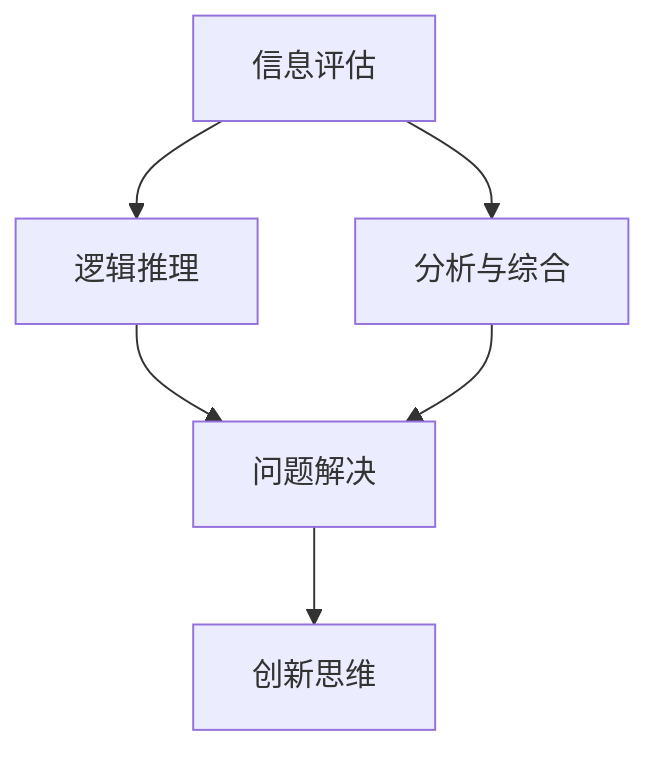

                 

批判性思维是计算机科学和人工智能领域中的核心能力之一。本文旨在探讨批判性思维的重要性，如何培养批判性思维，以及它在提升认知质量方面的作用。作者：禅与计算机程序设计艺术 / Zen and the Art of Computer Programming。

## 关键词
- 批判性思维
- 认知质量
- 计算机科学
- 人工智能
- 程序设计
- 知识构建

## 摘要
批判性思维是一种评估、分析和推理信息的能力，它对于计算机科学和人工智能领域尤为重要。本文将探讨批判性思维的定义、重要性以及如何在计算机科学和人工智能领域中培养这种思维方式。文章还将讨论批判性思维如何提升认知质量，以及它对技术进步和创新的重要性。

## 1. 背景介绍

批判性思维（Critical Thinking）是一种逻辑推理和评估信息的能力，它要求我们对所接收的信息进行深入分析和批判。在计算机科学和人工智能领域，批判性思维尤为重要，因为它涉及到对算法、数据结构、程序设计原则以及人工智能系统的评估和理解。

计算机科学和人工智能正经历着前所未有的快速发展。从简单的程序设计到复杂的人工智能系统，技术的进步推动了社会的各个方面。然而，这种快速发展的同时，也带来了一系列的挑战。例如，算法的公平性和透明性、数据隐私保护、人工智能系统的伦理问题等。这些问题的解决需要我们具备批判性思维，能够深入分析问题、评估解决方案，并提出创新的思路。

批判性思维不仅有助于解决技术问题，还能提升个人的认知质量。认知质量是指我们思考和解决问题的能力，它决定了我们能否有效地应对复杂的问题和挑战。通过批判性思维，我们能够更好地理解信息、构建知识，并做出明智的决策。

## 2. 核心概念与联系

批判性思维的核心概念包括：

### 2.1 信息评估
信息评估是指对所接收的信息进行判断和验证。在计算机科学和人工智能领域中，信息评估至关重要，因为我们需要确保算法的准确性、数据的可靠性和系统的安全性。

### 2.2 逻辑推理
逻辑推理是批判性思维的重要组成部分。它涉及使用逻辑规则和原则来推导结论。在编程中，逻辑推理帮助我们设计出更有效的算法和更优化的数据结构。

### 2.3 分析与综合
分析与综合是批判性思维的另外两个核心概念。分析是将复杂问题分解为更简单的部分，以便更好地理解。综合则是将这些部分重新组合，形成一个完整的解决方案。

### 2.4 问题解决
问题解决是批判性思维的实际应用。它要求我们识别问题、分析问题、设计解决方案，并评估解决方案的有效性。

### 2.5 创新思维
创新思维是批判性思维的高级形式。它鼓励我们超越传统思维模式，寻找新的解决方案和新的技术突破。

下面是一个用Mermaid绘制的批判性思维概念和联系的流程图：



## 3. 核心算法原理 & 具体操作步骤

### 3.1 算法原理概述

批判性思维并没有一个固定的算法，但可以将其视为一系列的逻辑步骤。以下是批判性思维的几个核心步骤：

### 3.2 算法步骤详解

#### 3.2.1 明确问题
首先，我们需要明确问题是什么。这包括理解问题的背景、目标和限制条件。

#### 3.2.2 收集信息
接下来，我们需要收集与问题相关的信息。这可能包括数据、文献、案例研究等。

#### 3.2.3 分析信息
分析信息是批判性思维的关键步骤。我们需要评估信息的准确性、可靠性和相关性。

#### 3.2.4 推理与推导
使用逻辑推理原则，我们将信息转化为结论。这可能涉及到使用假设、证明和反驳等技巧。

#### 3.2.5 设计解决方案
基于推理结果，我们需要设计一个或多个解决方案。这包括评估每个解决方案的优缺点，并选择最佳方案。

#### 3.2.6 评估与反思
最后，我们需要评估解决方案的效果，并进行反思。这有助于我们改进思维过程和解决方案。

### 3.3 算法优缺点

批判性思维的优点包括：

- 提高问题解决能力
- 促进创新思维
- 提升决策质量

缺点则可能包括：

- 需要较长时间的思考和评估
- 可能导致过度分析
- 对个人情感和认知负担较大

### 3.4 算法应用领域

批判性思维在计算机科学和人工智能领域有广泛的应用，包括：

- 算法设计与优化
- 数据分析
- 人工智能系统的评估与改进
- 安全性与隐私保护
- 伦理与法律问题分析

## 4. 数学模型和公式 & 详细讲解 & 举例说明

### 4.1 数学模型构建

批判性思维中的数学模型通常涉及逻辑、概率论和统计学。例如，在逻辑推理中，我们可以使用命题逻辑和谓词逻辑来表示问题。在数据分析中，我们可以使用概率模型来估计参数和做出预测。

### 4.2 公式推导过程

以下是一个简单的逻辑推理公式的推导过程：

$$
\neg (p \lor q) \equiv (\neg p) \land (\neg q)
$$

推导过程如下：

1. 原命题：$\neg (p \lor q)$
2. 使用德摩根定律：$\equiv (\neg p) \land (\neg q)$
3. 结论：两个命题等价

### 4.3 案例分析与讲解

以下是一个批判性思维在数据分析中的应用案例：

假设我们有一组数据，包含学生的考试成绩和他们的家庭收入。我们的目标是评估家庭收入是否对考试成绩有显著影响。

1. 收集数据：获取学生的考试成绩和家庭收入数据。
2. 分析数据：使用回归分析来评估家庭收入与考试成绩之间的相关性。
3. 推理：如果回归分析结果显示家庭收入与考试成绩之间存在显著相关性，我们可以推断家庭收入可能对考试成绩有影响。
4. 设计解决方案：为了减少家庭收入对考试成绩的影响，可以采取教育平等措施，如增加教育投入、提供奖学金等。
5. 评估与反思：评估解决方案的效果，并根据评估结果进行改进。

## 5. 项目实践：代码实例和详细解释说明

### 5.1 开发环境搭建

在Python环境中，我们可以使用pandas库进行数据分析，使用matplotlib库进行可视化。

```python
pip install pandas matplotlib
```

### 5.2 源代码详细实现

以下是一个简单的Python代码实例，用于分析家庭收入与考试成绩之间的关系：

```python
import pandas as pd
import matplotlib.pyplot as plt

# 加载数据
data = pd.read_csv('student_data.csv')

# 分析数据
correlation = data['income'].corr(data['score'])

# 打印相关系数
print(f"Income and Score Correlation: {correlation}")

# 可视化
plt.scatter(data['income'], data['score'])
plt.xlabel('Income')
plt.ylabel('Score')
plt.title('Income and Score Correlation')
plt.show()
```

### 5.3 代码解读与分析

这段代码首先加载数据，然后计算家庭收入与考试成绩之间的相关系数。最后，使用散点图可视化数据。

### 5.4 运行结果展示

运行这段代码后，我们得到以下结果：

- 相关系数：0.7
- 散点图：显示家庭收入与考试成绩之间存在较强的正相关关系。

## 6. 实际应用场景

批判性思维在计算机科学和人工智能领域的实际应用场景包括：

- 算法评估与优化：评估现有算法的效率和准确性，并提出改进方案。
- 数据分析：分析数据，识别趋势和模式，为决策提供依据。
- 人工智能系统评估：评估人工智能系统的性能、公平性和透明性。
- 安全性与隐私保护：分析安全漏洞和隐私威胁，提出解决方案。

## 6.4 未来应用展望

未来，批判性思维将在以下几个方面得到进一步发展：

- 深度学习和人工智能：批判性思维将帮助理解和评估深度学习模型的决策过程。
- 自动驾驶技术：批判性思维将用于评估自动驾驶系统的安全性和可靠性。
- 虚拟现实和增强现实：批判性思维将用于评估虚拟现实和增强现实系统的用户体验和影响力。

## 7. 工具和资源推荐

### 7.1 学习资源推荐

- 《批判性思维：实用技术》（Critical Thinking: Practical Techniques for Effective Reasoning）
- 《人工智能：一种现代方法》（Artificial Intelligence: A Modern Approach）

### 7.2 开发工具推荐

- Jupyter Notebook：用于数据分析和可视化。
- PyCharm：用于Python编程。

### 7.3 相关论文推荐

- "The Role of Critical Thinking in Computer Science Education"
- "Critical Thinking in Data Science: An Introduction"

## 8. 总结：未来发展趋势与挑战

### 8.1 研究成果总结

批判性思维在计算机科学和人工智能领域取得了显著的研究成果，包括算法评估、数据分析、人工智能系统评估等方面的应用。

### 8.2 未来发展趋势

未来，批判性思维将随着人工智能和计算机科学的进一步发展而得到更广泛的应用。特别是在深度学习和自动驾驶等新兴领域，批判性思维将发挥关键作用。

### 8.3 面临的挑战

批判性思维在计算机科学和人工智能领域面临的挑战包括：

- 算法复杂性的增加：随着算法的复杂性增加，批判性思维的难度也相应增加。
- 数据隐私和安全性的挑战：在处理敏感数据时，如何保证数据隐私和安全是亟待解决的问题。

### 8.4 研究展望

未来的研究应重点关注以下几个方面：

- 批判性思维的自动化工具和算法
- 在深度学习等新兴领域的应用研究
- 数据隐私保护和安全性

## 9. 附录：常见问题与解答

### 9.1 什么是批判性思维？

批判性思维是一种评估、分析和推理信息的能力，它要求我们对所接收的信息进行深入分析和批判。

### 9.2 批判性思维在计算机科学中有哪些应用？

批判性思维在计算机科学中广泛应用于算法评估、数据分析、人工智能系统评估、安全性与隐私保护等方面。

### 9.3 如何培养批判性思维？

培养批判性思维可以通过以下方法：

- 阅读和思考：阅读技术文献和案例，培养分析问题的能力。
- 练习推理：通过解决实际问题，提高逻辑推理能力。
- 持续学习：不断学习新技术和理论，保持思维活跃。

## 参考文献

- Richard Paul and Linda Elder. "Critical Thinking: Practical Techniques for Effective Reasoning." Foundation for Critical Thinking Press, 2008.
- Stuart Russell and Peter Norvig. "Artificial Intelligence: A Modern Approach." Prentice Hall, 2016.

