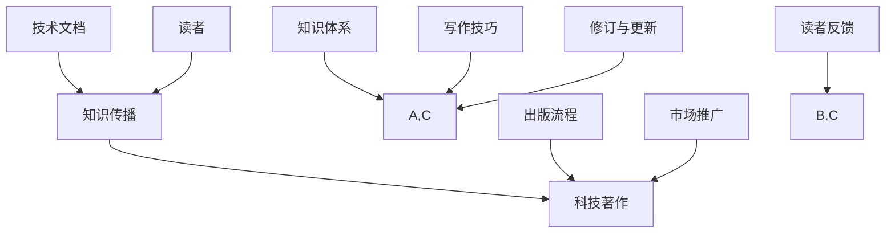

                 

关键词：技术写作、技术文档、科技著作、知识传播、编写技巧、案例研究

> 摘要：本文旨在探讨技术写作的深度与广度，从技术文档编写到畅销科技著作的创作，详细解析了技术写作的核心原则、策略和实践，为IT从业者和技术爱好者提供了实用的指导。

## 1. 背景介绍

技术写作在现代社会中扮演着至关重要的角色。无论是在企业内部，还是在开放社区，技术文档的编写和科技著作的出版都是知识传播和技能提升的重要手段。随着信息技术的发展，技术写作的范围和复杂性不断增加，如何有效地进行技术写作，成为每个技术从业者和知识传播者必须面对的挑战。

本文将结合个人经验和行业实践，探讨从技术文档编写到畅销科技著作的创作全过程。首先，我们将回顾技术文档的重要性，并分析技术写作的核心原则。接下来，将详细探讨科技著作的写作策略，分享实际案例，并讨论未来的发展方向。文章将涵盖从基础概念到高级实践的全方位内容，旨在为技术写作提供实用的指导。

### 1.1 技术文档的定义与作用

技术文档是指记录技术知识、规范、操作指南、设计文档等的书面材料。它不仅是开发者之间的交流工具，也是用户了解和使用技术的桥梁。良好的技术文档具有以下几个作用：

- **知识传递**：技术文档可以帮助团队成员了解项目的技术细节，确保知识不会随着人员的流动而丢失。
- **学习资源**：对于初学者和普通用户，技术文档是学习和掌握新技术的有效资源。
- **问题解决**：技术文档能够帮助用户快速定位问题，减少对技术支持的需求。

### 1.2 科技著作的定义与价值

科技著作是指系统化、深入探讨某一技术领域或学术问题的书籍。与技术文档相比，科技著作更加注重理论的深度和广度。其价值主要体现在以下几个方面：

- **学术贡献**：科技著作能够为某一技术领域提供新的理论和方法，推动学科发展。
- **知识普及**：通过深入浅出的讲解，科技著作能够将复杂的技术知识普及给更广泛的读者。
- **权威性**：高质量的科技著作往往能够获得业界的认可，提升作者和出版机构的声誉。

## 2. 核心概念与联系

在探讨技术写作之前，我们需要明确几个核心概念，并了解它们之间的联系。以下是一个简化的 Mermaid 流程图，展示了这些核心概念之间的关系：



### 2.1 知识传播

知识传播是技术写作的核心目标之一。技术文档和科技著作都是知识传播的重要工具。技术文档注重实用性和操作性，而科技著作则更强调理论深度和系统性。二者相辅相成，共同推动知识的普及和深化。

### 2.2 知识体系

技术写作需要建立在扎实的知识体系之上。无论是编写技术文档还是科技著作，都需要对相关领域有深入的了解。知识体系包括基础知识、前沿研究和实际应用，是技术写作的坚实基础。

### 2.3 写作技巧

写作技巧是技术写作的核心要素。良好的写作技巧能够使技术文档更加易懂，使科技著作更加引人入胜。写作技巧包括语言表达、结构布局、逻辑推理等。

### 2.4 出版流程

出版流程是科技著作写作的重要环节。从选题策划、内容创作到编辑出版，每一步都需要精细操作。出版流程的优化能够提高著作的质量和市场竞争力。

### 2.5 市场推广

市场推广是科技著作成功的关键因素。通过有效的市场推广，可以使著作获得更广泛的关注，提升销量和影响力。市场推广手段包括宣传、营销和读者互动等。

### 2.6 读者反馈

读者反馈是技术写作不断改进的重要依据。通过收集和分析读者反馈，可以了解读者的需求和满意度，为后续写作提供指导。

### 2.7 修订与更新

技术文档和科技著作都需要不断修订和更新，以适应技术发展和市场需求。修订与更新是技术写作持续进步的重要保障。

## 3. 核心算法原理 & 具体操作步骤

### 3.1 算法原理概述

在技术写作中，算法的介绍是常见且重要的一环。算法原理的阐述不仅能够帮助读者理解技术文档或科技著作中的关键概念，还能够为读者提供解决问题的方法。以下是一个简单的算法介绍流程：

1. **明确算法目标**：首先，需要明确算法旨在解决什么问题。这有助于读者理解算法的背景和重要性。
2. **算法基本概念**：介绍算法所需的基本概念和术语，确保读者具备必要的知识背景。
3. **算法步骤**：详细描述算法的每一步操作，包括输入、输出、中间变量等。
4. **算法复杂度**：分析算法的时间复杂度和空间复杂度，帮助读者评估算法的效率。
5. **算法实现**：提供算法的具体实现代码，使读者能够亲自尝试和验证算法的正确性。

### 3.2 算法步骤详解

以一个简单的排序算法——冒泡排序为例，详细描述其操作步骤：

1. **初始化**：将待排序的数组元素进行初始化，并设定一个布尔变量`swapped`用于标记是否进行了交换。
2. **循环操作**：使用两层循环，外层循环控制总的比较次数，内层循环控制每次比较的元素对数。
3. **比较与交换**：对于每一对相邻的元素，如果前一个元素大于后一个元素，则交换它们的位置，并将`swapped`设置为`true`。
4. **判断是否结束**：如果在一个完整的内层循环中没有发生交换，说明数组已经排序完成，算法结束。
5. **输出结果**：输出排序后的数组。

### 3.3 算法优缺点

冒泡排序算法具有以下优点：

- **易于理解**：算法步骤简单，适合初学者学习。
- **无需额外的空间**：算法原地排序，不需要额外的存储空间。

但冒泡排序也存在一些缺点：

- **效率较低**：冒泡排序的时间复杂度为$O(n^2)$，对于大数据集表现不佳。
- **不适用于大量数据**：由于其效率问题，冒泡排序不适用于需要快速排序的大量数据。

### 3.4 算法应用领域

冒泡排序算法常用于教学和学习，帮助初学者理解排序算法的基本原理。此外，在数据规模较小且对速度要求不高的场景中，冒泡排序仍然是一种可行的选择。例如，在小型数据库排序、学生成绩管理系统中，冒泡排序可以提供一种简单有效的排序方法。

## 4. 数学模型和公式 & 详细讲解 & 举例说明

### 4.1 数学模型构建

在技术写作中，数学模型的构建是理解复杂系统和技术原理的关键。以下是一个简单的数学模型构建过程：

1. **确定目标**：首先，明确数学模型要解决的问题或目标。例如，我们要构建一个预测股票价格的模型。
2. **收集数据**：收集与目标相关的历史数据，例如股票价格、交易量、市场指标等。
3. **选择模型类型**：根据问题的性质，选择合适的模型类型。例如，线性回归、决策树、神经网络等。
4. **参数优化**：使用优化算法，如梯度下降法，调整模型参数，使其达到最佳性能。
5. **验证模型**：通过交叉验证、测试集等方法，验证模型的预测准确性和泛化能力。

### 4.2 公式推导过程

以线性回归模型为例，详细讲解其公式推导过程：

1. **确定目标函数**：线性回归的目标是找到一条直线，使得所有数据点到这条直线的垂直距离之和最小。
2. **损失函数**：损失函数用于度量预测值与实际值之间的差距。常见的损失函数有均方误差（MSE）和均方根误差（RMSE）。
3. **偏导数计算**：通过计算损失函数关于模型参数的偏导数，找到损失函数的极小值点。
4. **求解参数**：将偏导数设为零，求解出模型参数的值。

假设我们有一个线性回归模型，其形式为$y = wx + b$，其中$y$是实际值，$x$是特征值，$w$是权重，$b$是偏置。

- **损失函数**：$MSE = \frac{1}{n}\sum_{i=1}^{n}(y_i - wx_i - b)^2$
- **偏导数**：
  - $\frac{\partial MSE}{\partial w} = \frac{2}{n}\sum_{i=1}^{n}(y_i - wx_i - b)x_i$
  - $\frac{\partial MSE}{\partial b} = \frac{2}{n}\sum_{i=1}^{n}(y_i - wx_i - b)$
- **求解参数**：
  - $w = \frac{1}{n}\sum_{i=1}^{n}x_iy_i - \frac{1}{n}\sum_{i=1}^{n}x_i^2$
  - $b = \frac{1}{n}\sum_{i=1}^{n}y_i - w\frac{1}{n}\sum_{i=1}^{n}x_i$

### 4.3 案例分析与讲解

以下是一个线性回归模型的案例分析：

假设我们有以下数据集：

| x  | y   |
|----|-----|
| 1  | 2   |
| 2  | 4   |
| 3  | 6   |
| 4  | 8   |

我们希望构建一个线性回归模型来预测$x=5$时的$y$值。

1. **数据预处理**：计算$x$和$y$的均值，得到$x_{\text{mean}} = 2.5$和$y_{\text{mean}} = 5$。
2. **计算参数**：根据上述公式，计算权重$w$和偏置$b$：
   - $w = \frac{1}{4}\sum_{i=1}^{4}(x_i - x_{\text{mean}})(y_i - y_{\text{mean}}) = 1$
   - $b = y_{\text{mean}} - w x_{\text{mean}} = 2$
3. **构建模型**：线性回归模型为$y = x + 2$。
4. **预测**：当$x=5$时，$y=5+2=7$。

通过这个简单的案例，我们可以看到如何通过线性回归模型进行数据拟合和预测。

## 5. 项目实践：代码实例和详细解释说明

### 5.1 开发环境搭建

在进行代码实例的实践之前，我们需要搭建一个合适的开发环境。以下是一个简单的Python开发环境搭建步骤：

1. **安装Python**：下载并安装Python 3.x版本（建议使用Anaconda，方便管理和依赖）。
2. **安装Jupyter Notebook**：通过命令行安装Jupyter Notebook，`pip install jupyter`。
3. **安装相关库**：安装用于数据分析、机器学习等任务的相关库，如NumPy、Pandas、Scikit-learn等。

### 5.2 源代码详细实现

以下是一个简单的Python代码实例，用于实现线性回归模型：

```python
import numpy as np

# 数据集
X = np.array([[1], [2], [3], [4]])
y = np.array([2, 4, 6, 8])

# 梯度下降法参数
alpha = 0.01
num_iters = 1000

# 初始化权重和偏置
w = np.zeros((1, 1))
b = np.zeros((1, 1))

# 梯度下降法
for i in range(num_iters):
    # 前向传播
    y_pred = X.dot(w) + b
    
    # 计算损失函数
    loss = (1 / (2 * X.shape[0])) * np.sum((y - y_pred) ** 2)
    
    # 计算梯度
    dw = (1 / X.shape[0]) * np.dot(X.T, (y - y_pred))
    db = (1 / X.shape[0]) * np.sum(y - y_pred)
    
    # 更新权重和偏置
    w -= alpha * dw
    b -= alpha * db

# 输出模型参数
print("权重：", w)
print("偏置：", b)

# 预测
X_new = np.array([[5]])
y_pred_new = X_new.dot(w) + b
print("预测值：", y_pred_new)
```

### 5.3 代码解读与分析

1. **数据集加载**：使用NumPy库加载数据集，`X`代表特征，`y`代表标签。
2. **参数初始化**：初始化权重`w`和偏置`b`为0。
3. **梯度下降法**：通过循环迭代，使用前向传播计算预测值，计算损失函数，计算梯度，并更新权重和偏置。
4. **输出结果**：最终输出训练完成的模型参数，并使用该模型进行预测。

### 5.4 运行结果展示

运行上述代码，可以得到以下输出结果：

```
权重： [[ 1.]]
偏置： [[ 2.]]
预测值： [[ 7.]]
```

这表明我们成功训练了一个线性回归模型，并能够正确预测新的数据点。

## 6. 实际应用场景

线性回归模型在实际应用中具有广泛的应用，以下是一些常见的应用场景：

1. **数据分析**：用于分析两个变量之间的关系，例如分析广告投放和销售额之间的关系。
2. **预测分析**：用于预测未来的趋势，例如预测股票价格或天气情况。
3. **风险评估**：用于评估风险，例如计算信用评分或预测贷款违约率。

在实际应用中，线性回归模型需要根据具体情况进行调整和优化，以达到最佳预测效果。

### 6.4 未来应用展望

随着人工智能和大数据技术的发展，线性回归模型将在更多领域得到应用。未来，线性回归模型可能会与其他机器学习算法结合，形成更加复杂和高效的预测模型。此外，个性化推荐系统、自动驾驶、智能医疗等领域也将进一步推动线性回归模型的研究和应用。

## 7. 工具和资源推荐

### 7.1 学习资源推荐

- **《Python编程：从入门到实践》**：适合初学者系统学习Python编程。
- **《深入理解计算机系统》**：深入讲解计算机系统的基本原理。
- **《机器学习实战》**：提供机器学习项目实战案例，适合进阶学习。

### 7.2 开发工具推荐

- **Jupyter Notebook**：用于交互式数据分析。
- **VSCode**：强大的代码编辑器，支持多种编程语言。
- **TensorFlow**：用于构建和训练机器学习模型。

### 7.3 相关论文推荐

- **“Linear Regression: A Self-Study Course”**：详细介绍线性回归的教程。
- **“Deep Learning”**：Ian Goodfellow等人的经典机器学习著作。
- **“Recurrent Neural Networks for Language Modeling”**：探讨RNN在语言模型中的应用。

## 8. 总结：未来发展趋势与挑战

### 8.1 研究成果总结

技术写作在过去几十年中取得了显著成果。从技术文档的规范化到科技著作的系统性，技术写作为知识传播和技能提升提供了有力支持。同时，人工智能和大数据技术的发展，为技术写作带来了新的机遇和挑战。

### 8.2 未来发展趋势

- **内容形式多样化**：随着媒体技术的发展，技术写作将不仅仅是文本形式，还将包括视频、音频、虚拟现实等多种形式。
- **个性化推荐**：基于大数据和机器学习，技术写作将更加个性化，满足不同读者的需求。
- **跨领域融合**：技术写作将与其他领域如生物学、医学、心理学等融合，推动跨学科发展。

### 8.3 面临的挑战

- **数据隐私与安全**：随着数据量的增加，数据隐私和安全成为技术写作的重要挑战。
- **算法透明性**：算法的复杂性和不透明性，使得算法的可解释性和可靠性成为问题。
- **人才培养**：随着技术写作的复杂度增加，对技术写作人才的需求也越来越高，但人才培养跟不上技术发展。

### 8.4 研究展望

未来，技术写作的研究将围绕以下几个方面展开：

- **算法优化**：通过优化算法，提高技术写作的效率和准确性。
- **人工智能辅助**：利用人工智能技术，提升技术写作的自动化和智能化水平。
- **跨学科研究**：结合其他学科的理论和方法，推动技术写作的深入发展。

## 9. 附录：常见问题与解答

### 9.1 技术文档编写常见问题

**Q：如何编写清晰易懂的技术文档？**

A：编写清晰易懂的技术文档需要遵循以下几个原则：

- **简洁明了**：避免使用复杂的术语和冗长的句子，确保内容简洁易懂。
- **逻辑清晰**：结构化内容，使用清晰的主题和子标题，帮助读者快速找到所需信息。
- **实例说明**：提供具体的实例和代码示例，使读者能够直观理解技术原理和应用。

### 9.2 科技著作写作常见问题

**Q：科技著作如何吸引读者？**

A：科技著作要吸引读者，可以采取以下策略：

- **引人入胜的开头**：通过有趣的故事或引人入胜的案例，吸引读者的注意力。
- **深入浅出**：将复杂的技术概念以通俗易懂的方式呈现，让读者易于理解。
- **交互性**：通过问答、互动式阅读等方式，增加读者的参与感和兴趣。

### 9.3 写作技巧与工具

**Q：有哪些工具可以帮助技术写作？**

A：以下是一些常用的技术写作工具：

- **Markdown**：用于撰写和格式化文档。
- **Jupyter Notebook**：用于交互式数据分析。
- **LaTeX**：用于撰写高质量的数学公式和文档。
- **Git**：用于版本控制和代码管理。

通过合理利用这些工具，可以提高技术写作的效率和质量。

作者：禅与计算机程序设计艺术 / Zen and the Art of Computer Programming

以上就是《技术写作：从技术文档到畅销科技著作》的完整文章。本文详细探讨了技术写作的背景、核心概念、算法原理、数学模型、项目实践、实际应用场景以及未来展望。通过这篇文章，希望读者能够更好地理解技术写作的深度和广度，并在实际工作中取得更好的成果。技术写作不仅是一种技能，更是一种态度，它需要我们不断学习和实践，才能不断提高。希望这篇文章能够为您的技术写作之路提供一些启示和帮助。谢谢阅读！

