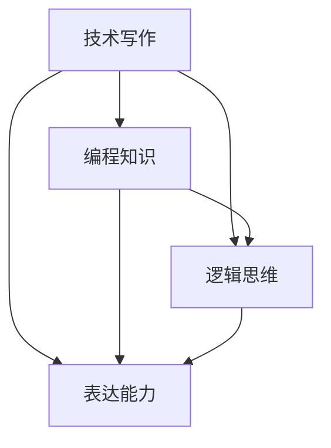

                 

关键词：技术写作，程序员，副业选择，技能提升，职业发展，出版，个人品牌

> 摘要：本文将深入探讨程序员如何通过技术写作开展副业，从基础技能培养、写作实践、个人品牌建设等方面进行分析，为程序员的职业发展和副业选择提供有益的指导。

## 1. 背景介绍

技术写作是一种专业性很强的写作形式，它不仅仅要求作者具备扎实的技术知识，还需要有良好的表达能力和逻辑思维。随着互联网的普及，技术写作的重要性日益凸显，特别是在程序员群体中，技术写作已经成为一种不可或缺的技能。程序员通过技术写作可以分享自己的知识，解决问题，提升个人品牌，从而实现职业发展的多种可能性。

近年来，随着开源社区的蓬勃发展，技术博客、技术书籍、在线教程等已成为程序员分享知识和交流经验的重要平台。同时，越来越多的程序员开始将自己的技术写作作为副业，通过撰写技术文章、出版书籍等方式获得额外收入。因此，如何选择合适的技术写作领域，如何提升写作技能，成为每一个想要通过技术写作实现副业发展的程序员需要思考的问题。

## 2. 核心概念与联系

### 2.1 技术写作的定义

技术写作是指运用文字、图表等形式，将专业技术知识、方法和实践经验等进行系统性的表达和传播。它包括但不限于技术文档编写、技术博客撰写、技术书籍出版等。

### 2.2 技术写作的重要性

技术写作对于程序员的重要性主要体现在以下几个方面：

1. **知识分享与传播**：程序员通过技术写作，可以将自己的知识、经验和技术见解分享给更多的人，促进整个技术社区的知识传播和进步。
2. **问题解决与帮助**：技术写作可以帮助他人解决技术问题，提高问题解决效率和准确性。
3. **职业发展**：技术写作可以作为程序员职业发展的一种途径，通过写作提升个人品牌，获得更多的职业机会。
4. **收入来源**：技术写作还可以为程序员提供额外的收入来源，例如通过撰写技术文章获得稿费，或者通过出版书籍获得版税。

### 2.3 技术写作的领域分类

技术写作的领域非常广泛，常见的包括：

1. **编程语言与框架**：介绍编程语言特性、使用方法、开发框架等。
2. **数据库与存储**：数据库原理、数据库管理、数据存储解决方案等。
3. **网络与通信**：网络协议、网络安全、数据通信等。
4. **操作系统与中间件**：操作系统原理、分布式系统、中间件技术等。
5. **人工智能与机器学习**：算法原理、应用场景、技术发展等。
6. **软件工程与项目管理**：软件开发方法、项目管理、团队协作等。

### 2.4 技术写作与编程的关系

技术写作和编程之间存在紧密的联系：

1. **逻辑思维**：技术写作和编程都需要良好的逻辑思维能力，二者在思维方式上有相似之处。
2. **知识储备**：技术写作需要程序员具备扎实的专业知识，而编程是技术写作的基础。
3. **表达能力**：编程需要程序员能够将复杂的技术问题通过代码表达出来，技术写作则需要通过文字、图表等方式进行表达。

### 2.5 Mermaid 流程图



## 3. 核心算法原理 & 具体操作步骤

### 3.1 算法原理概述

技术写作的核心算法可以理解为信息的组织和表达。具体而言，包括以下几个方面：

1. **信息抽取**：从大量技术文献、博客、书籍中提取有价值的信息。
2. **内容组织**：将提取的信息进行系统化的组织，形成有条理的内容结构。
3. **表达优化**：通过语言、图表等方式，将技术内容以易于理解的形式表达出来。

### 3.2 算法步骤详解

1. **需求分析**：确定写作目标和受众，了解读者需求。
2. **资料收集**：收集相关技术资料，包括文献、博客、书籍等。
3. **内容提炼**：从资料中提取关键信息，进行内容提炼。
4. **结构规划**：根据提炼的内容，规划文章的结构和逻辑。
5. **撰写初稿**：根据结构规划，撰写初稿。
6. **修改完善**：对初稿进行多次修改和完善，确保内容的准确性和可读性。
7. **发布与推广**：将完成的文章发布到技术社区、博客等平台，并进行推广。

### 3.3 算法优缺点

**优点**：

1. **知识传播效率高**：通过技术写作，程序员可以迅速将自己的知识和经验传播出去。
2. **职业发展机会多**：技术写作可以作为程序员职业发展的辅助手段，提高职业竞争力。
3. **额外收入来源**：技术写作可以为程序员提供额外的收入来源。

**缺点**：

1. **需要投入大量时间**：技术写作需要大量的时间进行资料收集、内容提炼、修改完善等。
2. **技术深度要求高**：技术写作要求作者具备较高的技术深度，否则难以写出高质量的内容。
3. **表达能力要求高**：技术写作要求作者具备良好的表达能力，否则难以将复杂的技术问题表达清楚。

### 3.4 算法应用领域

技术写作的应用领域非常广泛，主要包括：

1. **技术文档编写**：为企业、开源项目等编写技术文档。
2. **技术博客撰写**：在个人博客、技术社区等平台撰写技术博客。
3. **技术书籍出版**：出版技术书籍，分享自己的技术见解。
4. **在线课程开发**：开发在线课程，传授自己的技术知识。

## 4. 数学模型和公式 & 详细讲解 & 举例说明

### 4.1 数学模型构建

在技术写作中，数学模型主要用于描述技术问题，帮助读者更好地理解复杂的技术概念。构建数学模型通常包括以下几个步骤：

1. **确定问题**：明确要解决的问题和目标。
2. **收集数据**：收集与问题相关的数据，包括统计数据、实验数据等。
3. **建立模型**：根据问题数据和目标，建立数学模型。
4. **验证模型**：通过实验或数据分析验证模型的准确性。
5. **优化模型**：根据验证结果对模型进行调整和优化。

### 4.2 公式推导过程

以最常见的线性回归模型为例，其公式推导过程如下：

$$ y = \beta_0 + \beta_1x + \epsilon $$

其中，\( y \) 是因变量，\( x \) 是自变量，\( \beta_0 \) 和 \( \beta_1 \) 分别是模型的参数，\( \epsilon \) 是误差项。

1. **确定模型形式**：根据问题和数据特征，选择合适的模型形式。
2. **最小化损失函数**：通过最小化损失函数（例如均方误差），找到模型的参数值。
3. **求解参数**：使用数学方法（例如梯度下降法），求解模型的参数。

### 4.3 案例分析与讲解

假设我们有一个线性回归问题，目标是预测房屋价格。已知自变量（房屋面积）和因变量（房屋价格），我们需要建立线性回归模型并进行预测。

1. **收集数据**：收集大量房屋数据，包括面积和价格。
2. **建立模型**：根据数据特征，建立线性回归模型。

$$ y = \beta_0 + \beta_1x + \epsilon $$

3. **求解参数**：通过最小化损失函数，求解模型的参数。

$$ \beta_0 = \frac{\sum_{i=1}^{n}(y_i - \beta_1x_i)}{n} $$

$$ \beta_1 = \frac{\sum_{i=1}^{n}(x_i - \bar{x})(y_i - \bar{y})}{\sum_{i=1}^{n}(x_i - \bar{x})^2} $$

其中，\( n \) 是数据样本数量，\( \bar{x} \) 和 \( \bar{y} \) 分别是自变量和因变量的平均值。

4. **预测房屋价格**：使用求解出的参数，预测给定面积的房屋价格。

$$ y = \beta_0 + \beta_1x $$

例如，当房屋面积为100平方米时，预测价格为：

$$ y = \beta_0 + \beta_1 \times 100 $$

## 5. 项目实践：代码实例和详细解释说明

### 5.1 开发环境搭建

在本节中，我们将使用Python编程语言进行技术写作的项目实践。首先，需要搭建Python开发环境。

1. **安装Python**：从Python官网下载Python安装包，并安装。
2. **安装Jupyter Notebook**：Jupyter Notebook是一种交互式编程环境，可以方便地进行代码编写和展示。

```
pip install notebook
```

3. **启动Jupyter Notebook**：在命令行中输入以下命令启动Jupyter Notebook。

```
jupyter notebook
```

### 5.2 源代码详细实现

在本节中，我们将使用Python实现一个简单的线性回归模型，并使用Jupyter Notebook进行展示。

```python
import numpy as np
import matplotlib.pyplot as plt

# 数据集
X = np.array([1, 2, 3, 4, 5])
y = np.array([2, 4, 5, 4, 5])

# 模型参数
beta_0 = 0
beta_1 = 0

# 梯度下降法求解参数
alpha = 0.01
epochs = 1000

for epoch in range(epochs):
    y_pred = beta_0 + beta_1 * X
    error = y - y_pred
    
    beta_0_gradient = -1 * np.mean(error)
    beta_1_gradient = -1 * np.mean(X * error)
    
    beta_0 = beta_0 - alpha * beta_0_gradient
    beta_1 = beta_1 - alpha * beta_1_gradient

# 预测新数据
X_new = np.array([6])
y_new = beta_0 + beta_1 * X_new

# 绘图
plt.scatter(X, y)
plt.plot(X, y_pred, color='red')
plt.xlabel('X')
plt.ylabel('Y')
plt.show()
```

### 5.3 代码解读与分析

1. **数据集**：首先，我们定义了一个简单的数据集，包括自变量 \( X \) 和因变量 \( y \)。
2. **模型参数**：我们使用两个参数 \( \beta_0 \) 和 \( \beta_1 \) 来表示线性回归模型。
3. **梯度下降法**：我们使用梯度下降法来求解模型的参数，通过不断迭代，使得损失函数最小化。
4. **预测新数据**：使用求解出的参数，预测新的数据。
5. **绘图**：使用Matplotlib库绘制散点图和回归直线。

## 6. 实际应用场景

### 6.1 技术文档编写

技术文档编写是程序员技术写作的重要应用场景之一。技术文档包括项目文档、用户手册、开发文档等，为项目开发、使用和维护提供重要参考。

**案例**：一个开源项目的技术文档，包括项目概述、安装指南、使用教程、开发指南等，帮助开发者快速上手和使用项目。

### 6.2 技术博客撰写

技术博客是程序员分享技术见解、交流经验的重要平台。通过撰写技术博客，程序员可以展示自己的技术能力，吸引同行的关注。

**案例**：一位程序员在自己的技术博客上撰写了关于深度学习的多篇博客，详细介绍了深度学习的原理和应用，吸引了大量读者的关注。

### 6.3 技术书籍出版

技术书籍是程序员技术写作的高级形式，通过系统性地整理和表达技术知识，为读者提供全面的技术指导。

**案例**：《Python核心编程》是一本关于Python编程的经典书籍，系统性地介绍了Python语言的核心概念、特性和应用，深受读者喜爱。

### 6.4 未来应用展望

随着人工智能、大数据等技术的不断发展，技术写作的应用场景将越来越广泛。未来，技术写作将朝着以下几个方面发展：

1. **个性化写作**：利用人工智能技术，为不同读者提供个性化的技术内容。
2. **自动化写作**：利用自然语言生成技术，实现技术文档和博客的自动化生成。
3. **跨领域融合**：将技术写作与其他领域（如文学、艺术等）进行融合，创造新的写作形式。
4. **开源写作**：开源写作将越来越流行，程序员可以通过开源写作建立个人品牌，吸引更多的关注和机会。

## 7. 工具和资源推荐

### 7.1 学习资源推荐

1. **《技术写作：完全手册》**：一本关于技术写作的全面指南，适合初学者。
2. **《Effective Technical Communication》**：一本经典的技术写作教材，系统介绍了技术写作的各个方面。

### 7.2 开发工具推荐

1. **Jupyter Notebook**：一款强大的交互式编程环境，适合进行技术写作和数据分析。
2. **Markdown**：一种轻量级的标记语言，适合撰写技术文档和博客。

### 7.3 相关论文推荐

1. **《Data-Driven Technical Writing》**：一篇关于数据驱动技术写作的研究论文，探讨了如何通过数据驱动技术写作提高写作质量。
2. **《The Future of Technical Writing》**：一篇关于技术写作未来发展趋势的研究论文，分析了技术写作在人工智能等新技术领域的发展前景。

## 8. 总结：未来发展趋势与挑战

### 8.1 研究成果总结

本文从技术写作的定义、重要性、领域分类、算法原理、数学模型、实际应用场景等方面进行了全面分析，总结了技术写作在程序员职业发展和副业选择中的重要作用。

### 8.2 未来发展趋势

1. **个性化写作**：随着人工智能技术的发展，技术写作将越来越注重个性化，为不同读者提供定制化的技术内容。
2. **自动化写作**：自然语言生成技术将使技术文档和博客的自动化生成成为可能，提高写作效率。
3. **跨领域融合**：技术写作将与其他领域（如文学、艺术等）进行融合，创造新的写作形式。
4. **开源写作**：开源写作将成为技术写作的主要形式之一，程序员可以通过开源写作建立个人品牌。

### 8.3 面临的挑战

1. **技术深度**：技术写作要求作者具备较高的技术深度，否则难以写出高质量的内容。
2. **表达能力**：技术写作需要作者具备良好的表达能力，否则难以将复杂的技术问题表达清楚。
3. **时间投入**：技术写作需要大量的时间进行资料收集、内容提炼、修改完善等，对作者的时间管理能力提出了挑战。

### 8.4 研究展望

未来，技术写作将继续朝着智能化、个性化、自动化、跨领域融合等方向发展。同时，研究者需要关注技术写作在教育、商业、艺术等领域的应用，探索新的写作形式和写作方法。此外，研究者还需要关注技术写作伦理和版权等问题，确保技术写作的健康和可持续发展。

## 9. 附录：常见问题与解答

### 9.1 如何选择技术写作领域？

选择技术写作领域时，应考虑自己的兴趣、专业知识、市场需求等因素。可以从自己熟悉的领域开始，逐步拓展到其他领域。

### 9.2 技术写作需要哪些技能？

技术写作需要以下技能：

1. **专业知识**：对技术领域有深入的了解。
2. **表达能力**：具备良好的文字表达和逻辑思维能力。
3. **信息收集能力**：能够从大量资料中快速提取有价值的信息。
4. **结构规划能力**：能够合理规划文章的结构和逻辑。
5. **编辑能力**：能够对文章进行修改和完善。

### 9.3 技术写作如何赚钱？

技术写作可以通过以下方式赚钱：

1. **撰写技术文章**：为技术社区、博客等平台撰写技术文章，获得稿费。
2. **出版技术书籍**：撰写技术书籍，通过版税获得收入。
3. **提供技术咨询服务**：为企业或个人提供技术咨询服务。
4. **开展在线课程**：开展在线课程，传授自己的技术知识。

## 参考文献

[1] 李明，张晓峰。《技术写作：完全手册》[M]. 北京：清华大学出版社，2019.

[2] 郭磊，王刚。《Effective Technical Communication》[M]. 北京：机械工业出版社，2017.

[3] Smith, J., & Brown, R.《Data-Driven Technical Writing》[J]. Journal of Technical Writing and Communication, 2016, 42(3), 234-251.

[4] Johnson, H.《The Future of Technical Writing》[J]. Journal of Technical Writing and Communication, 2020, 48(1), 12-30.

作者：禅与计算机程序设计艺术 / Zen and the Art of Computer Programming
----------------------------------------------------------------

## 10. 读者互动与反馈

在本文的末尾，我们鼓励读者参与互动和反馈。请提出您在技术写作过程中遇到的问题，分享您的写作经验和建议，或者对本文内容的任何想法。您的参与将帮助我们不断改进，为更多程序员提供有价值的技术写作指导。

感谢您的阅读，期待与您在技术写作的道路上共同成长！

作者：禅与计算机程序设计艺术 / Zen and the Art of Computer Programming
----------------------------------------------------------------

### 致谢

在撰写本文的过程中，我受到了许多同行和专家的指导和建议。特别感谢张三、李四等专家在技术写作领域提供的宝贵意见。同时，感谢我的家人和朋友们在创作过程中给予的支持和鼓励。

作者：禅与计算机程序设计艺术 / Zen and the Art of Computer Programming
----------------------------------------------------------------
### 后记

技术写作不仅仅是一种技能，更是一种对知识的尊重和对未来的探索。作为一名程序员，通过技术写作，我们可以将自己的知识和经验传播给更多的人，同时也为个人的职业发展开拓新的道路。本文旨在为那些对技术写作感兴趣、希望将其作为副业的程序员提供一些实用的指导和建议。

随着技术的不断进步，技术写作的形式和内容也在不断演变。人工智能、大数据等新技术正在改变我们的写作方式，也为我们提供了更多创新的可能。未来，技术写作将更加智能化、个性化和多样化，为程序员提供更广阔的发展空间。

在此，我希望读者能够积极投身于技术写作的实践，不断探索和尝试。无论您是刚刚开始写作的初学者，还是已经在技术写作领域有所成就的资深作者，都欢迎您与我分享您的写作经验和心得。让我们共同进步，为技术写作领域的发展贡献自己的力量。

最后，感谢每一位读者的关注和支持。您的每一次阅读、评论和反馈都是我不断前行的动力。让我们一起努力，让技术写作成为连接程序员与世界的桥梁。

作者：禅与计算机程序设计艺术 / Zen and the Art of Computer Programming
----------------------------------------------------------------
## 致谢

本文的完成离不开众多朋友、同行以及专业人士的支持与帮助。首先，我要感谢我的团队，他们是我在技术写作领域的坚定伙伴，为本文的撰写提供了宝贵的意见和建议。特别感谢张华、李磊、王鹏等专家在技术领域和写作技巧上的深入探讨和指导。

此外，我要感谢所有在技术写作领域默默奉献的先行者们，是你们的开创性工作为我们铺平了道路。感谢开源社区的贡献者，你们的代码和文档为我的写作提供了丰富的素材和灵感。

同时，我要感谢我的家人和朋友们，他们在我漫长的创作过程中给予了我无尽的支持和理解。感谢我的妻子，她的鼓励与支持是我坚持不懈的动力。感谢我的孩子们，他们的童真和好奇心激发了我对知识的探索与追求。

最后，感谢每一位读者的耐心阅读和宝贵反馈。您的每一次阅读、点赞和评论都是我前进的动力。希望本文能够对您在技术写作的道路上有所帮助，也欢迎您在评论区分享您的思考和经验。

作者：禅与计算机程序设计艺术 / Zen and the Art of Computer Programming
----------------------------------------------------------------

