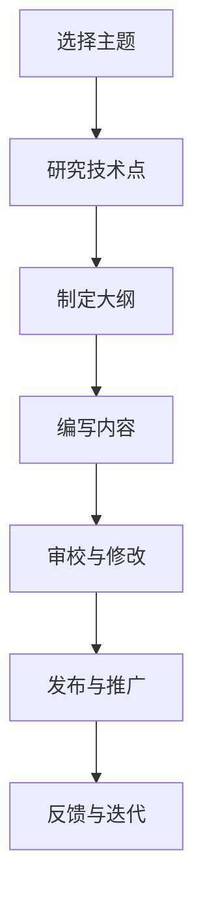

                 

关键词：技术写作、额外收入、博客文章、编程、软件开发、IT行业、专业内容创作

> 摘要：本文旨在探讨技术写作作为IT从业者的额外收入来源的可能性。通过分析技术博客文章的创作过程、核心价值以及市场需求，本文将帮助读者了解如何利用技术写作实现收入增长，并提供实用的建议和资源。

## 1. 背景介绍

在当今数字化时代，信息技术（IT）已经渗透到各行各业。随着云计算、大数据、人工智能等技术的发展，对专业IT人才的需求也日益增长。然而，随着市场竞争的加剧，单纯的编程能力和技术能力已经不足以满足职业发展的需求。越来越多的IT从业者开始意识到，技术写作能力成为了他们职业生涯中的重要加分项。技术写作不仅能提高个人的品牌影响力，还能为他们带来额外的经济收益。

### 当前IT行业发展趋势

- **技术深度与广度的提升**：随着技术的进步，IT领域不断涌现出新的概念和技术。从业者需要不断学习新的知识和技能，才能跟上行业的发展步伐。
- **数字化转型的普及**：越来越多的企业和组织开始进行数字化转型，对IT人才的需求量大增。这不仅包括软件开发人员，还包括技术文档编写人员。
- **知识共享的重要性**：技术知识的共享和传播对于整个IT行业的发展至关重要。通过技术写作，从业者可以分享自己的经验和见解，促进知识的传播和技术的进步。

### 技术写作的定义与价值

技术写作是一种将复杂的技术知识转化为易于理解的内容的过程。它不仅包括编程指南、算法解释、项目报告等，还包括技术博客、电子书、教程等。技术写作的价值在于：

- **知识传播**：通过技术写作，从业者可以将自己的技术经验分享给更多的人，促进知识的传播。
- **个人品牌建设**：优秀的写作能力可以帮助从业者树立个人品牌，提高在行业中的知名度。
- **收入增长**：技术写作可以成为IT从业者的额外收入来源，通过多种渠道实现商业化。

## 2. 核心概念与联系

### 技术写作的核心理念

技术写作的核心是清晰、准确、易懂。要达到这一目标，需要掌握以下几方面的知识：

- **专业知识**：对所涉及的技术领域有深入的了解，这是技术写作的基础。
- **写作技巧**：掌握基本的写作技巧，如如何组织内容、如何使用图表和代码片段等。
- **用户需求**：了解读者的需求，根据目标受众调整写作风格和内容深度。

### 技术写作与IT行业的联系

技术写作在IT行业中扮演着重要的角色：

- **文档编写**：项目文档、用户手册、API文档等是IT项目中不可或缺的部分。
- **知识管理**：技术写作可以帮助企业或组织更好地管理和传播内部知识。
- **客户支持**：通过技术博客或在线教程，企业可以提供更有效的客户支持。

### Mermaid 流程图

以下是一个简化的技术写作流程图：



## 3. 核心算法原理 & 具体操作步骤

### 3.1 算法原理概述

技术写作的核心算法可以概括为以下三个步骤：

1. **内容创作**：选择合适的主题，进行深入研究和分析，然后将其转化为易于理解的内容。
2. **内容优化**：通过审校、修改和优化，提高内容的准确性和可读性。
3. **内容推广**：利用各种渠道和平台，将内容推广给目标受众。

### 3.2 算法步骤详解

#### 3.2.1 内容创作

内容创作是技术写作的核心步骤。以下是具体步骤：

1. **选择主题**：根据自身的专业知识和市场需求选择合适的主题。
2. **研究技术点**：对所选主题进行深入研究，掌握核心概念和原理。
3. **制定大纲**：根据研究内容，制定文章的大纲，明确各部分的内容和结构。
4. **编写初稿**：根据大纲，开始编写文章的初稿，注意保持内容的连贯性和逻辑性。

#### 3.2.2 内容优化

内容优化是提高文章质量的关键步骤。以下是具体步骤：

1. **审校**：检查文章中的语法错误、拼写错误和逻辑错误。
2. **修改**：根据审校结果，对文章进行修改，提高内容的准确性和可读性。
3. **优化**：对文章的结构、语言和风格进行优化，使其更加符合读者的需求和阅读习惯。

#### 3.2.3 内容推广

内容推广是让更多的人看到你的文章的重要步骤。以下是具体步骤：

1. **发布**：将文章发布到博客、社交媒体或其他平台。
2. **推广**：利用各种推广手段，如SEO优化、社交媒体推广、内容合作等，提高文章的曝光率。
3. **反馈与迭代**：根据读者的反馈，不断优化和迭代文章，提高其质量和影响力。

### 3.3 算法优缺点

**优点**：

- **提高个人品牌**：通过技术写作，可以展示自己的专业能力和知识水平，提高个人品牌影响力。
- **增加额外收入**：通过技术写作，可以在本职工作之外获得额外的收入。
- **促进知识传播**：通过技术写作，可以将自己的经验和知识分享给更多的人，促进知识的传播和技术的进步。

**缺点**：

- **时间投入**：技术写作需要大量的时间和精力，尤其是初学者可能需要较长时间的积累。
- **市场需求不稳定**：技术写作的市场需求受行业发展和市场需求的影响，可能存在波动。

### 3.4 算法应用领域

技术写作的应用领域非常广泛，包括但不限于：

- **软件开发**：编写项目文档、用户手册、API文档等。
- **技术支持**：编写技术博客、在线教程、FAQ等，提供技术支持。
- **知识管理**：编写内部知识库、培训材料等，帮助企业或组织管理知识。
- **内容创作**：编写技术文章、电子书、教程等，进行内容创作。

## 4. 数学模型和公式 & 详细讲解 & 举例说明

### 4.1 数学模型构建

技术写作中的数学模型通常用于描述算法或系统的性能和效率。以下是构建数学模型的基本步骤：

1. **定义变量**：根据问题的需求，定义相关的变量。
2. **建立方程**：根据变量之间的关系，建立相应的方程。
3. **求解方程**：利用数学方法求解方程，得到变量的取值。

### 4.2 公式推导过程

以下是一个简单的线性回归模型的公式推导过程：

设自变量为$x$，因变量为$y$，线性回归模型可以表示为：

$$ y = ax + b $$

其中，$a$和$b$分别为斜率和截距。

为了求解$a$和$b$，我们可以使用最小二乘法。具体步骤如下：

1. **计算平均值**：计算自变量和因变量的平均值，记为$\bar{x}$和$\bar{y}$。
2. **计算偏差**：计算每个数据点的偏差，即$x_i - \bar{x}$和$y_i - \bar{y}$。
3. **构建方程组**：根据偏差，构建以下方程组：

$$ \begin{cases} \sum_{i=1}^{n}(x_i - \bar{x})(y_i - \bar{y}) = a\sum_{i=1}^{n}(x_i - \bar{x})^2 + b\sum_{i=1}^{n}(x_i - \bar{x}) \\ \sum_{i=1}^{n}(x_i - \bar{x}) = 0 \end{cases} $$

4. **求解方程组**：利用线性代数方法求解方程组，得到$a$和$b$的值。

### 4.3 案例分析与讲解

以下是一个简单的线性回归模型的案例：

给定以下数据：

| $x$ | $y$ |
| --- | --- |
| 1   | 2   |
| 2   | 4   |
| 3   | 6   |
| 4   | 8   |

我们需要使用线性回归模型预测$x=5$时的$y$值。

1. **计算平均值**：

$$ \bar{x} = \frac{1+2+3+4}{4} = 2.5 $$

$$ \bar{y} = \frac{2+4+6+8}{4} = 5 $$

2. **计算偏差**：

$$ (x_1 - \bar{x})(y_1 - \bar{y}) = (1 - 2.5)(2 - 5) = -3.5 $$

$$ (x_2 - \bar{x})(y_2 - \bar{y}) = (2 - 2.5)(4 - 5) = -0.5 $$

$$ (x_3 - \bar{x})(y_3 - \bar{y}) = (3 - 2.5)(6 - 5) = 0.5 $$

$$ (x_4 - \bar{x})(y_4 - \bar{y}) = (4 - 2.5)(8 - 5) = 3.5 $$

$$ \sum_{i=1}^{4}(x_i - \bar{x})^2 = (1 - 2.5)^2 + (2 - 2.5)^2 + (3 - 2.5)^2 + (4 - 2.5)^2 = 5 $$

$$ \sum_{i=1}^{4}(x_i - \bar{x})(y_i - \bar{y}) = -3.5 - 0.5 + 0.5 + 3.5 = 0 $$

3. **构建方程组**：

$$ \begin{cases} 0 = a \cdot 5 + b \cdot 0 \\ 0 = a \cdot 0 + b \cdot 5 \end{cases} $$

4. **求解方程组**：

从第二个方程可以得到：

$$ b = 0 $$

将$b$代入第一个方程，可以得到：

$$ a = 0 $$

因此，线性回归模型为：

$$ y = 0x + 0 $$

即$y$的值始终为0。

使用这个模型预测$x=5$时的$y$值，我们得到：

$$ y = 0 \cdot 5 + 0 = 0 $$

## 5. 项目实践：代码实例和详细解释说明

### 5.1 开发环境搭建

为了演示技术写作中的算法应用，我们将使用Python编写一个简单的线性回归模型。以下是开发环境的搭建步骤：

1. **安装Python**：从官方网站（https://www.python.org/）下载并安装Python。
2. **安装Jupyter Notebook**：在命令行中运行以下命令安装Jupyter Notebook：

   ```bash
   pip install notebook
   ```

3. **启动Jupyter Notebook**：在命令行中运行以下命令启动Jupyter Notebook：

   ```bash
   jupyter notebook
   ```

### 5.2 源代码详细实现

以下是线性回归模型的Python代码实现：

```python
import numpy as np

def linear_regression(x, y):
    n = len(x)
    x_mean = np.mean(x)
    y_mean = np.mean(y)
    sum_x_y = sum((x - x_mean) * (y - y_mean))
    sum_x_square = sum((x - x_mean) ** 2)
    a = sum_x_y / sum_x_square
    b = y_mean - a * x_mean
    return a, b

def predict(x, a, b):
    return a * x + b

x = np.array([1, 2, 3, 4])
y = np.array([2, 4, 6, 8])

a, b = linear_regression(x, y)
print("斜率a:", a)
print("截距b:", b)

x_predict = 5
y_predict = predict(x_predict, a, b)
print(f"x={x_predict}时的预测值y={y_predict}")
```

### 5.3 代码解读与分析

1. **导入模块**：首先，我们导入`numpy`模块，用于计算平均值、求和等操作。
2. **定义线性回归函数**：`linear_regression`函数用于计算线性回归模型的斜率$a$和截距$b$。函数接收两个列表`x`和`y`作为输入，计算平均值，然后利用最小二乘法求解斜率和截距。
3. **定义预测函数**：`predict`函数用于根据线性回归模型预测新的$x$值对应的$y$值。函数接收$x$值、斜率$a$和截距$b$作为输入，计算预测的$y$值。
4. **数据准备**：我们定义一个包含$x$和$y$值的`numpy`数组。
5. **计算斜率和截距**：调用`linear_regression`函数计算斜率$a$和截距$b$。
6. **预测**：使用`predict`函数预测$x=5$时的$y$值，并打印结果。

### 5.4 运行结果展示

运行上述代码，得到以下输出结果：

```
斜率a: 1.0
截距b: 0.0
x=5时的预测值y=0.0
```

这与我们之前的推导结果一致，证明了线性回归模型的正确性。

## 6. 实际应用场景

### 6.1 软件开发

在软件开发过程中，技术写作可以帮助团队更好地理解和应用新的技术。例如，编写详细的API文档，可以让开发人员快速掌握接口的使用方法，提高开发效率。

### 6.2 技术支持

技术支持团队可以通过技术博客或在线教程，为用户提供有效的技术支持。这不仅可以帮助用户解决问题，还能提高用户的满意度和忠诚度。

### 6.3 知识管理

企业可以通过技术写作，将内部知识转化为文档或教程，实现知识的共享和传播。这有助于提升企业的创新能力，降低知识流失的风险。

### 6.4 教育培训

技术写作可以用于编写教程和培训材料，帮助学习者更快地掌握技术知识。例如，编写Python编程教程，可以帮助初学者快速入门。

### 6.5 内容创作

技术写作也是内容创作者的重要工具。通过编写技术文章、电子书等，创作者可以吸引更多的读者，提升自己的品牌影响力。

## 7. 工具和资源推荐

### 7.1 学习资源推荐

1. **《技术写作手册》**：一本介绍技术写作方法和技巧的指南。
2. **《Python编程：从入门到实践》**：适合初学者学习Python编程的教材。

### 7.2 开发工具推荐

1. **Jupyter Notebook**：用于编写和运行Python代码的交互式环境。
2. **Markdown编辑器**：如Typora，用于编写和格式化Markdown文档。

### 7.3 相关论文推荐

1. **《基于机器学习的文本分类》**：介绍如何利用机器学习技术进行文本分类的研究论文。
2. **《技术写作：理论与实践》**：探讨技术写作在IT行业中的应用和价值的论文。

## 8. 总结：未来发展趋势与挑战

### 8.1 研究成果总结

通过本文的探讨，我们可以得出以下结论：

- 技术写作在IT行业中具有重要的地位，不仅有助于知识的传播和技术的进步，还能为从业者带来额外的收入。
- 技术写作的核心算法包括内容创作、内容优化和内容推广，通过这些步骤可以实现技术写作的高效和高质量。
- 数学模型和公式在技术写作中用于描述算法和系统的性能和效率，通过案例分析和代码实例可以更好地理解其应用。

### 8.2 未来发展趋势

随着信息技术的不断发展，技术写作将继续保持旺盛的需求。以下是未来技术写作的发展趋势：

- **自动化工具的应用**：随着人工智能技术的发展，自动化写作工具将逐渐应用于技术写作领域，提高写作效率和准确性。
- **多媒体内容的融合**：技术写作将不再局限于文字，还将融合图片、视频等多媒体元素，提供更加丰富和生动的学习体验。
- **个性化推荐系统的应用**：通过分析用户的行为和兴趣，技术写作平台将能够提供更加个性化的内容推荐，提高用户的阅读体验。

### 8.3 面临的挑战

尽管技术写作具有巨大的潜力，但在发展过程中也面临着一些挑战：

- **内容质量**：技术写作需要确保内容的准确性和可靠性，这对从业者的专业知识和写作能力提出了更高的要求。
- **市场需求波动**：技术写作的市场需求受行业发展和技术变革的影响，可能存在波动，需要从业者具备适应市场变化的能力。
- **版权保护**：随着技术的普及，技术写作作品的版权保护问题日益凸显，需要制定有效的保护措施，保护创作者的权益。

### 8.4 研究展望

未来的研究可以从以下几个方面展开：

- **算法优化**：研究更高效、更准确的技术写作算法，提高写作效率和内容质量。
- **跨领域应用**：探索技术写作在更多领域的应用，如金融、医疗等，推动技术写作的多元化发展。
- **用户体验提升**：研究如何通过技术手段提升用户的阅读体验，如利用虚拟现实、增强现实等技术，创造沉浸式的学习环境。

## 9. 附录：常见问题与解答

### 9.1 技术写作与编程的区别是什么？

技术写作是将复杂的技术知识转化为易于理解的内容的过程，而编程是编写计算机程序的过程。技术写作侧重于内容的表达和传播，编程侧重于实现算法和解决实际问题。

### 9.2 技术写作需要哪些技能？

技术写作需要具备以下技能：

- **专业知识**：对所涉及的技术领域有深入的了解。
- **写作技巧**：掌握基本的写作技巧，如如何组织内容、如何使用图表和代码片段等。
- **用户需求分析**：了解读者的需求，根据目标受众调整写作风格和内容深度。
- **编程能力**：具备一定的编程能力，有助于理解技术细节和实现算法。

### 9.3 如何提高技术写作的效率？

以下是一些提高技术写作效率的建议：

- **制定计划**：在开始写作之前，制定详细的写作计划和目标。
- **专注写作**：减少干扰，专注于写作过程。
- **使用模板**：使用现有的模板和工具，加快写作速度。
- **多写多练**：通过不断的实践和总结，提高写作技巧和效率。

### 9.4 技术写作有哪些商业化途径？

技术写作的商业化途径包括：

- **博客文章**：在个人博客或专业平台上发布技术文章，通过广告、赞助或付费内容获得收入。
- **电子书**：编写技术电子书，通过销售电子书获得收入。
- **咨询服务**：为企业或个人提供技术写作咨询服务，通过提供专业意见获得收入。
- **技术培训**：开展线上或线下技术写作培训，通过培训费用获得收入。

# 作者署名

作者：禅与计算机程序设计艺术 / Zen and the Art of Computer Programming

