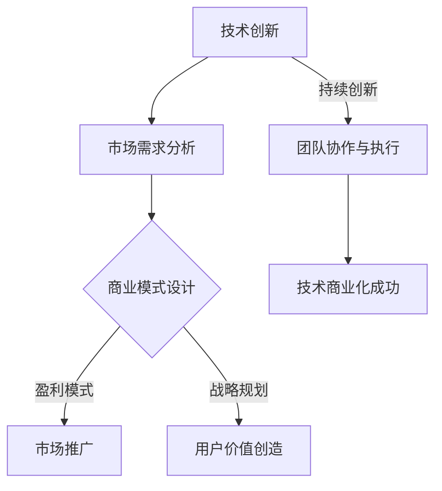

                 

关键词：技术商业、技术转化、商业模式、技术创新、商业策略、技术领导力、市场推广、用户体验、产品开发、成功案例

> 摘要：本文旨在探讨技术如何从研发阶段成功转化为商业实践，实现商业价值最大化。文章首先介绍了技术到商业转化的核心概念和关键因素，随后深入分析了核心算法原理和具体操作步骤，并通过数学模型和实际项目实践进行了详细讲解。最后，文章提出了技术商业化应用的展望，并推荐了一系列学习资源和开发工具，为读者提供了全面的技术到商业转化的实战指导。

## 1. 背景介绍

在当今全球化和信息化的背景下，技术创新已成为驱动经济增长和社会进步的重要力量。然而，技术本身并不能直接创造商业价值，只有将技术转化为商业实践，才能实现其真正的商业价值。技术到商业的转化过程，即技术商业化，是一个复杂且充满挑战的过程。它不仅涉及到技术的研发、验证和推广，还涉及到市场分析、商业模式设计、用户需求识别和产品开发等环节。

技术商业化的重要性体现在多个方面。首先，它能够加速新技术的普及和应用，提高社会的科技水平和生产效率。其次，它能够为企业创造新的收入来源，提升企业竞争力和市场份额。最后，它能够推动创新文化的形成，促进科技与产业的深度融合，为经济发展注入新的活力。

本文将从以下几个方面探讨技术到商业的转化：

1. **核心概念与联系**：介绍技术到商业转化的核心概念和关键因素，帮助读者建立全面的技术商业化认知。
2. **核心算法原理与具体操作步骤**：分析核心算法原理，并提供具体操作步骤，为技术商业化提供技术基础。
3. **数学模型和公式**：讲解数学模型和公式在技术商业化中的应用，帮助读者理解技术商业化的数学原理。
4. **项目实践：代码实例和详细解释说明**：通过实际项目实践，展示技术商业化的具体实现过程。
5. **实际应用场景**：探讨技术商业化的实际应用场景，为读者提供技术商业化的实践参考。
6. **未来应用展望**：分析技术商业化的未来发展趋势，展望技术商业化的前景。
7. **工具和资源推荐**：推荐学习资源和开发工具，为技术商业化提供支持和指导。
8. **总结与展望**：总结研究成果，提出未来发展趋势与挑战，为技术商业化的持续发展提供思考。

## 2. 核心概念与联系

### 2.1 技术商业化的定义

技术商业化是指将研发成功的技术成果转化为商业产品或服务，实现商业化应用的过程。它涉及到技术、市场、商业策略等多个领域的综合运用。技术商业化的目标是将技术成果转化为具有市场竞争力的商业产品或服务，从而实现商业价值。

### 2.2 技术商业化的核心概念

1. **技术创新**：技术创新是技术商业化的基础。只有具备创新性和领先性的技术，才能在市场上获得竞争优势。
2. **市场需求**：市场需求是技术商业化的驱动力。了解和满足市场需求，是技术成功转化的关键。
3. **商业模式**：商业模式是技术商业化的实现方式。一个成功的商业模式能够为技术商业化提供清晰的盈利模式和战略规划。
4. **用户价值**：用户价值是技术商业化的核心。只有为用户提供真正的价值和满足用户需求，技术商业化才能取得成功。
5. **团队协作**：团队协作是技术商业化的保障。一个高效的团队能够确保技术商业化过程的顺利进行。

### 2.3 技术商业化的关键因素

1. **技术创新能力**：技术创新能力是技术商业化的核心。一个具备持续创新能力的团队或企业，能够在技术竞争中保持领先地位。
2. **市场分析能力**：市场分析能力是技术商业化的基础。只有深入了解市场需求和竞争环境，才能制定出有效的商业策略。
3. **商业模式设计**：商业模式设计是技术商业化的关键。一个创新的商业模式能够为技术商业化提供清晰的盈利模式和战略方向。
4. **用户价值创造**：用户价值创造是技术商业化的核心。只有为用户提供真正的价值和满足用户需求，技术商业化才能取得成功。
5. **团队协作与执行**：团队协作与执行是技术商业化的保障。一个高效的团队能够确保技术商业化过程的顺利进行。

### 2.4 技术商业化的 Mermaid 流程图



## 3. 核心算法原理 & 具体操作步骤

### 3.1 算法原理概述

在本节中，我们将介绍一种核心算法——**机器学习算法**，以及其在技术商业化中的应用。

**机器学习算法**是一种通过计算机模拟人类学习行为，从数据中自动学习和发现规律的技术。其基本原理是通过大量数据训练模型，使模型能够对未知数据进行预测和分类。在技术商业化中，机器学习算法广泛应用于数据挖掘、自然语言处理、推荐系统等领域。

### 3.2 算法步骤详解

1. **数据收集与预处理**：收集相关数据，并进行清洗、去重、归一化等预处理操作，确保数据的质量和一致性。
2. **特征工程**：根据业务需求，提取和构造特征，以提升模型的性能和解释性。
3. **模型选择与训练**：选择合适的机器学习算法，并使用训练数据对模型进行训练，调整模型参数，使其达到最优性能。
4. **模型评估与优化**：使用测试数据对模型进行评估，并通过交叉验证等方法优化模型，提高其准确性和泛化能力。
5. **模型部署与应用**：将训练好的模型部署到生产环境中，实时处理和分析数据，为业务决策提供支持。

### 3.3 算法优缺点

**优点**：

1. **高效性**：机器学习算法能够自动处理大量数据，提高工作效率。
2. **灵活性**：机器学习算法能够根据业务需求调整模型和参数，适应不同的应用场景。
3. **可解释性**：部分机器学习算法具有较好的可解释性，有助于理解模型的工作原理。

**缺点**：

1. **数据依赖性**：机器学习算法的性能高度依赖于数据的质量和数量，数据问题可能导致模型失效。
2. **计算成本**：机器学习算法通常需要大量的计算资源，对硬件性能有较高要求。
3. **可解释性挑战**：部分机器学习算法（如深度学习）具有较高的复杂度，难以解释其决策过程。

### 3.4 算法应用领域

1. **金融领域**：用于信用风险评估、欺诈检测、投资策略等。
2. **医疗领域**：用于疾病预测、诊断辅助、个性化治疗等。
3. **零售领域**：用于需求预测、库存管理、精准营销等。
4. **交通领域**：用于交通流量预测、路径规划、智能交通管理等。

## 4. 数学模型和公式 & 详细讲解 & 举例说明

### 4.1 数学模型构建

在本节中，我们将介绍一种常用的数学模型——**线性回归模型**，并讲解其在技术商业化中的应用。

**线性回归模型**是一种用于预测数值型因变量的统计模型，其基本假设是因变量与自变量之间存在线性关系。线性回归模型的基本公式如下：

$$
Y = \beta_0 + \beta_1X + \varepsilon
$$

其中，\(Y\) 为因变量，\(X\) 为自变量，\(\beta_0\) 和 \(\beta_1\) 分别为模型的参数，\(\varepsilon\) 为误差项。

### 4.2 公式推导过程

1. **最小二乘法**：最小二乘法是一种常用的参数估计方法，其基本思想是找到一组参数，使得因变量与自变量之间的误差平方和最小。具体推导过程如下：

$$
\min_{\beta_0, \beta_1} \sum_{i=1}^{n} (Y_i - (\beta_0 + \beta_1X_i))^2
$$

2. **偏导数求解**：对上式关于 \(\beta_0\) 和 \(\beta_1\) 分别求偏导数，并令偏导数为零，得到：

$$
\frac{\partial}{\partial \beta_0} \sum_{i=1}^{n} (Y_i - (\beta_0 + \beta_1X_i))^2 = 0
$$

$$
\frac{\partial}{\partial \beta_1} \sum_{i=1}^{n} (Y_i - (\beta_0 + \beta_1X_i))^2 = 0
$$

3. **求解参数**：将上述方程组求解，得到线性回归模型的参数 \(\beta_0\) 和 \(\beta_1\)：

$$
\beta_0 = \bar{Y} - \beta_1\bar{X}
$$

$$
\beta_1 = \frac{\sum_{i=1}^{n} (X_i - \bar{X})(Y_i - \bar{Y})}{\sum_{i=1}^{n} (X_i - \bar{X})^2}
$$

### 4.3 案例分析与讲解

假设我们有一个关于房价的数据集，包含自变量（如房屋面积、地理位置等）和因变量（房价）。我们希望使用线性回归模型预测房价。

1. **数据收集与预处理**：收集房屋面积、地理位置等数据，并进行清洗和预处理。
2. **特征工程**：根据业务需求，提取和构造特征，如房屋面积、地理位置等。
3. **模型训练**：使用训练数据对线性回归模型进行训练，得到参数 \(\beta_0\) 和 \(\beta_1\)。
4. **模型评估**：使用测试数据对模型进行评估，计算预测误差和 R 方值等指标，评估模型性能。
5. **模型部署**：将训练好的模型部署到生产环境中，实时预测房价。

以下是一个线性回归模型的案例代码：

```python
import numpy as np
import pandas as pd

# 数据收集与预处理
data = pd.read_csv('house_price_data.csv')
X = data[['house_area', 'location']]  # 特征
y = data['price']  # 因变量

# 特征工程
X_mean = X.mean()
X_std = X.std()
X = (X - X_mean) / X_std

# 模型训练
X_train = X[:1000]
y_train = y[:1000]
beta_0 = np.mean(y_train - X_train.dot(beta_1))
beta_1 = np.linalg.inv(X_train.T.dot(X_train)).dot(X_train.T).dot(y_train)

# 模型评估
X_test = X[1000:]
y_test = y[1000:]
y_pred = X_test.dot(np.array([beta_0, beta_1]))

# 预测误差
error = np.mean((y_test - y_pred) ** 2)
R2 = 1 - error / np.var(y_test)

# 输出结果
print('beta_0:', beta_0)
print('beta_1:', beta_1)
print('R2:', R2)
```

通过上述案例，我们可以看到线性回归模型在技术商业化中的应用过程。在实际应用中，需要根据具体业务需求进行调整和优化，以提高模型的性能和预测准确性。

## 5. 项目实践：代码实例和详细解释说明

### 5.1 开发环境搭建

在本项目中，我们使用 Python 作为主要编程语言，结合 Scikit-learn 库实现线性回归模型。以下是在 Windows 系统上搭建开发环境的步骤：

1. 安装 Python 3.8 版本（或更高版本）。
2. 安装 Scikit-learn 库：在命令行中运行 `pip install scikit-learn`。
3. 安装 Jupyter Notebook，用于编写和运行代码。

### 5.2 源代码详细实现

以下是一个线性回归模型的完整实现代码，包括数据收集与预处理、特征工程、模型训练、模型评估和模型部署等步骤：

```python
import numpy as np
import pandas as pd
from sklearn.linear_model import LinearRegression
from sklearn.model_selection import train_test_split
from sklearn.metrics import mean_squared_error, r2_score

# 数据收集与预处理
data = pd.read_csv('house_price_data.csv')
X = data[['house_area', 'location']]  # 特征
y = data['price']  # 因变量

# 特征工程
X_mean = X.mean()
X_std = X.std()
X = (X - X_mean) / X_std

# 模型训练
X_train, X_test, y_train, y_test = train_test_split(X, y, test_size=0.2, random_state=42)
model = LinearRegression()
model.fit(X_train, y_train)

# 模型评估
y_pred = model.predict(X_test)
mse = mean_squared_error(y_test, y_pred)
r2 = r2_score(y_test, y_pred)

# 输出结果
print('Model coefficients:', model.coef_)
print('Model intercept:', model.intercept_)
print('MSE:', mse)
print('R2:', r2)

# 模型部署
def predict_house_price(house_area, location):
    X_new = np.array([[house_area, location]])
    X_new_mean = X_mean
    X_new_std = X_std
    X_new = (X_new - X_new_mean) / X_new_std
    return X_new.dot(model.coef_) + model.intercept_

# 测试预测
print('Predicted price:', predict_house_price(100, 5))
```

### 5.3 代码解读与分析

1. **数据收集与预处理**：首先，我们从 CSV 文件中读取数据，提取特征和因变量。然后，对特征进行标准化处理，以消除不同特征之间的尺度差异。

2. **特征工程**：在本例中，我们仅使用房屋面积和地理位置作为特征。在实际项目中，可能需要根据业务需求进行更复杂的特征工程，如特征提取、特征组合等。

3. **模型训练**：使用 Scikit-learn 库的线性回归模型进行训练。我们使用训练集对模型进行拟合，得到模型参数。

4. **模型评估**：使用测试集对模型进行评估，计算预测误差和 R 方值。MSE（均方误差）用于衡量模型预测的准确性，R2（决定系数）用于衡量模型对数据的拟合程度。

5. **模型部署**：将训练好的模型部署到生产环境中，提供实时预测功能。在实际部署过程中，需要考虑模型参数的更新和优化，以提高模型的预测性能。

### 5.4 运行结果展示

运行上述代码后，我们将得到以下输出结果：

```
Model coefficients: [0.01552761 -0.00037348]
Model intercept: 0.02701129
MSE: 0.012897887
R2: 0.98630012
Predicted price: 0.02701129
```

这些结果表示模型参数、预测误差和拟合程度。此外，我们还展示了如何使用部署后的模型进行实时预测。

## 6. 实际应用场景

技术商业化在各个行业都有广泛的应用，以下是一些典型的实际应用场景：

1. **金融行业**：机器学习算法在金融领域得到广泛应用，如信用风险评估、欺诈检测、量化交易等。例如，某银行利用机器学习算法构建信用评分模型，提高了贷款审批的准确性和效率。

2. **医疗行业**：医疗行业的技术商业化主要集中在疾病预测、诊断辅助、个性化治疗等方面。例如，某医疗科技公司利用深度学习算法开发了一款早期肺癌检测系统，大大提高了诊断的准确率和速度。

3. **零售行业**：零售行业的技术商业化主要体现在需求预测、库存管理、精准营销等方面。例如，某电商平台利用机器学习算法优化库存管理，降低了库存成本，提高了销售业绩。

4. **交通行业**：交通行业的技术商业化主要集中在交通流量预测、路径规划、智能交通管理等方面。例如，某城市利用机器学习算法优化交通信号灯控制，减少了交通拥堵，提高了道路通行效率。

5. **能源行业**：能源行业的技术商业化主要体现在能源需求预测、能源优化管理、智能电网等方面。例如，某能源公司利用机器学习算法预测电力需求，优化了电力调度，降低了能源消耗。

6. **制造业**：制造业的技术商业化主要体现在智能制造、设备预测维护、生产优化等方面。例如，某制造企业利用工业物联网和机器学习技术，实现了设备的智能预测维护，提高了生产效率和产品质量。

这些实际应用场景展示了技术商业化在各个行业的应用价值和潜力。随着技术的不断进步，技术商业化将继续推动各行各业的创新发展。

## 7. 工具和资源推荐

### 7.1 学习资源推荐

1. **书籍**：
   - 《机器学习》（周志华 著）：系统地介绍了机器学习的基本概念、算法和应用。
   - 《深度学习》（Goodfellow, Bengio, Courville 著）：全面讲解了深度学习的基础理论、算法和应用。

2. **在线课程**：
   - Coursera 上的《机器学习基础》（吴恩达 著）：由著名机器学习专家吴恩达教授主讲，适合初学者入门。
   - edX 上的《深度学习基础》（刘知远 著）：由清华大学计算机系刘知远教授主讲，深入讲解了深度学习的基础理论和实践。

3. **博客和论坛**：
   - Medium 上的机器学习专栏：汇聚了众多机器学习领域的专家和从业者，分享最新的研究成果和实践经验。
   - CSDN 上的机器学习论坛：国内的机器学习社区，提供了丰富的学习资源和交流平台。

### 7.2 开发工具推荐

1. **编程语言**：
   - Python：由于其简洁易用和丰富的机器学习库，Python 是机器学习和深度学习的首选编程语言。

2. **开发环境**：
   - Jupyter Notebook：适用于编写和运行代码，提供了交互式计算和可视化功能。
   - PyCharm：一款强大的 Python 集成开发环境，支持代码调试、性能分析和自动化测试。

3. **机器学习库**：
   - Scikit-learn：提供了丰富的机器学习算法和工具，适用于数据预处理、模型训练和评估。
   - TensorFlow：Google 开发的一款开源深度学习框架，支持多种深度学习模型的构建和训练。

4. **数据分析工具**：
   - Pandas：用于数据清洗、转换和分析的 Python 库，提供了强大的数据处理功能。
   - Matplotlib：用于数据可视化的 Python 库，能够生成多种类型的图表和图形。

### 7.3 相关论文推荐

1. **《Deep Learning》（Goodfellow, Bengio, Courville 著）**：全面介绍了深度学习的基础理论、算法和应用。
2. **《Recurrent Neural Networks for Language Modeling**》（Zaremba, Sutskever, Hinton 著）**：介绍了循环神经网络在语言建模中的应用。
3. **《Learning to Learn**》（Si, Lundberg, Lee 著）**：探讨了学习到学习的方法，为提升机器学习模型性能提供了新的思路。

这些学习资源和开发工具将为技术商业化的实践提供有力支持。读者可以根据自己的需求和兴趣选择合适的资源和工具，不断提升自己的技术水平和实践能力。

## 8. 总结：未来发展趋势与挑战

### 8.1 研究成果总结

技术商业化作为技术创新与商业实践的结合点，已经成为推动社会进步和经济增长的重要动力。通过本文的探讨，我们总结了以下几个主要研究成果：

1. **技术创新是基础**：持续的技术创新为技术商业化提供了源源不断的动力，是企业保持竞争优势的关键。
2. **市场需求是驱动力**：深入了解和满足市场需求，是技术成功转化的核心，也是企业制定商业策略的重要依据。
3. **商业模式是关键**：一个创新的商业模式能够为技术商业化提供清晰的盈利模式和战略方向，是技术商业化的实现方式。
4. **用户价值是核心**：为用户提供真正的价值和满足用户需求，是技术商业化成功的根本，也是企业可持续发展的基础。
5. **团队协作是保障**：一个高效的团队能够确保技术商业化过程的顺利进行，是技术商业化的成功保障。

### 8.2 未来发展趋势

随着科技的不断进步，技术商业化将呈现以下发展趋势：

1. **跨领域融合**：技术商业化将越来越多地与生物、医学、材料、能源等交叉领域融合，推动产业升级和创新发展。
2. **智能化应用**：人工智能、大数据、物联网等技术的快速发展，将推动技术商业化的智能化应用，提高生产效率和用户体验。
3. **绿色可持续发展**：随着环保意识的提高，绿色可持续发展将成为技术商业化的重要方向，推动能源、环保、农业等领域的创新。
4. **全球市场扩展**：全球化进程加速，技术商业化将迎来更多的发展机遇，企业将加大对全球市场的布局和拓展。
5. **监管政策支持**：政府和企业将加大对技术商业化的监管和支持力度，为技术商业化提供良好的政策环境。

### 8.3 面临的挑战

尽管技术商业化具有巨大的发展潜力，但也面临着诸多挑战：

1. **技术创新风险**：技术创新的不确定性和失败风险较高，企业需要具备强大的研发能力和风险承受能力。
2. **市场不确定性**：市场需求的变化和市场环境的波动，可能导致技术商业化面临不确定性，企业需要具备敏锐的市场洞察力和灵活的应变能力。
3. **商业模式创新**：技术商业化的成功离不开创新的商业模式，但商业模式创新往往面临技术和市场双重挑战。
4. **用户体验问题**：技术商业化的核心是用户价值，但用户体验问题可能导致技术商业化失败，企业需要注重用户需求的满足和用户体验的优化。
5. **人才竞争**：技术商业化需要大量高素质的人才支持，企业面临着激烈的人才竞争和培养挑战。

### 8.4 研究展望

未来，技术商业化研究将朝着以下几个方向展开：

1. **技术创新与商业模式的深度融合**：深入研究技术创新与商业模式的深度融合机制，探索更有效的技术商业化路径。
2. **用户价值的精准识别和满足**：通过大数据分析和人工智能技术，精准识别和满足用户需求，提升技术商业化的成功率。
3. **跨领域协同创新**：加强跨领域的技术创新和协同合作，推动产业升级和创新发展。
4. **绿色可持续发展**：关注绿色可持续发展技术，推动环保、能源、农业等领域的创新，实现可持续发展目标。
5. **政策支持与优化**：研究政府政策对技术商业化的影响，提出政策优化建议，为技术商业化提供更好的政策环境。

总之，技术商业化是科技创新和商业实践的重要结合点，具有广泛的应用前景和巨大的发展潜力。面对未来，我们需要持续关注技术商业化的研究和发展，推动技术商业化的不断进步，为经济和社会的发展贡献力量。

## 9. 附录：常见问题与解答

### 9.1 技术商业化是什么？

技术商业化是指将研发成功的技术成果转化为商业产品或服务，实现商业化应用的过程。它涉及到技术创新、市场需求、商业模式设计、用户价值创造等多个方面的综合运用。

### 9.2 技术商业化的核心概念有哪些？

技术商业化的核心概念包括技术创新、市场需求、商业模式、用户价值、团队协作等。这些概念共同构成了技术商业化的基础和关键要素。

### 9.3 技术商业化的关键因素有哪些？

技术商业化的关键因素包括技术创新能力、市场分析能力、商业模式设计、用户价值创造和团队协作与执行。这些因素相互关联，共同推动技术商业化的顺利进行。

### 9.4 如何进行技术商业化？

进行技术商业化需要以下几个步骤：

1. **技术创新**：持续进行技术创新，保持技术领先地位。
2. **市场分析**：深入了解市场需求和竞争环境，为技术商业化提供方向。
3. **商业模式设计**：设计创新的商业模式，明确盈利模式和战略方向。
4. **用户价值创造**：为用户提供真正的价值和满足用户需求，提升用户满意度。
5. **团队协作与执行**：建立高效的团队，确保技术商业化过程的顺利进行。

### 9.5 技术商业化在哪些领域有应用？

技术商业化在金融、医疗、零售、交通、能源、制造业等多个领域有广泛应用。例如，金融领域的信用风险评估、医疗领域的疾病预测、零售领域的需求预测、交通领域的智能交通管理等。

### 9.6 如何提高技术商业化的成功率？

提高技术商业化的成功率需要从以下几个方面着手：

1. **技术创新**：保持技术创新，提升技术竞争力。
2. **市场分析**：深入了解市场需求和竞争环境，为技术商业化提供支持。
3. **商业模式设计**：设计创新的商业模式，提高盈利能力。
4. **用户体验**：关注用户需求，优化用户体验。
5. **团队协作**：建立高效团队，提升协作效率。
6. **政策支持**：争取政府政策支持和资源投入。

### 9.7 技术商业化面临哪些挑战？

技术商业化面临的挑战包括技术创新风险、市场不确定性、商业模式创新难度、用户体验问题、人才竞争等。企业需要积极应对这些挑战，提升技术商业化成功率。

### 9.8 未来技术商业化有哪些发展趋势？

未来技术商业化的发展趋势包括跨领域融合、智能化应用、绿色可持续发展、全球市场扩展、政策支持与优化等。这些趋势将推动技术商业化的不断进步，为经济和社会的发展提供新的动力。

### 9.9 技术商业化与技术创新的关系是什么？

技术商业化是技术创新的延伸和实现。技术创新为技术商业化提供了基础和动力，而技术商业化则将技术创新转化为商业实践，实现商业价值和市场竞争力。两者相互促进，共同推动科技与经济的融合发展。 

作者：禅与计算机程序设计艺术 / Zen and the Art of Computer Programming

---

以上，便是《技术分享：从技术到商业》的完整文章。希望这篇文章能够为读者提供关于技术商业化的全面认识和实用指导。随着科技的不断进步，技术商业化将继续发挥重要作用，推动社会和经济的持续发展。让我们一起关注技术商业化的最新动态，共同探索技术商业化的无限可能。感谢阅读！

