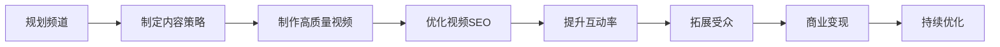

                 

关键词：YouTube频道、技术内容、粉丝增长、内容策略、互动技巧

> 摘要：随着互联网的快速发展，YouTube成为了一个庞大的内容平台，众多技术创作者通过这个平台分享他们的知识和经验，吸引了大量的粉丝。本文将深入探讨如何打造一个百万粉丝的技术类YouTube频道，包括内容策略、互动技巧、视频制作和营销等方面的方法和经验。

## 1. 背景介绍

### 1.1 YouTube平台的发展

YouTube成立于2005年，是Google旗下的一个视频分享平台。经过近二十年的发展，YouTube已经成为全球最大的视频分享平台，吸引了数亿用户。在中国，尽管存在一些监管和政策限制，但YouTube也拥有大量的忠实用户和创作者。

### 1.2 技术类内容的魅力

技术类内容因其专业性和实用性，在YouTube上受到了广泛的关注。无论是编程、网络技术、数据分析还是人工智能，技术类内容不仅能够帮助观众解决问题，还能激发他们对新技术的兴趣和热情。

### 1.3 打造百万粉丝频道的意义

一个百万粉丝的YouTube频道不仅意味着大量的观众，更是一个强大的个人品牌和影响力的象征。通过这样的频道，技术创作者可以实现内容变现，获得商业机会，甚至成为一名自由职业者。

## 2. 核心概念与联系

下面是一个Mermaid流程图，展示了打造百万粉丝YouTube频道的主要步骤和关键节点。



### 2.1 规划频道

在开始制作视频之前，首先要规划好频道的整体方向和目标受众。这包括选择合适的话题、设计频道标识和介绍等。

### 2.2 制定内容策略

内容策略是频道成功的关键。要吸引和留住观众，内容必须具有价值、独特性和持续性。可以通过分析竞争对手、关注行业动态和了解受众需求来制定策略。

### 2.3 制作高质量视频

高质量的视频是吸引观众的基础。这不仅仅是指视频的画质，还包括内容的质量、结构、节奏和音频效果等。

### 2.4 优化视频SEO

SEO（搜索引擎优化）是提高视频在YouTube搜索结果中排名的重要手段。通过合理地使用关键词、标签和标题，可以增加视频的可见性。

### 2.5 提升互动率

与观众的互动是建立忠诚度和提升频道活跃度的关键。可以通过回复评论、参与直播和发起投票等方式与观众互动。

### 2.6 拓展受众

通过跨平台宣传、合作和其他渠道，可以吸引更多的受众。社交媒体、论坛和行业会议等都是有效的拓展途径。

### 2.7 商业变现

当频道积累了一定的粉丝基础后，可以考虑通过广告、赞助和商品销售等方式实现商业变现。

### 2.8 持续优化

任何成功的YouTube频道都需要不断的优化和改进。通过分析数据、了解趋势和观众反馈，可以持续提升频道的表现。

## 3. 核心算法原理 & 具体操作步骤

### 3.1 算法原理概述

打造百万粉丝YouTube频道的核心算法可以概括为“内容驱动+互动联动”。内容是吸引粉丝的基础，而互动则是提升粉丝忠诚度和活跃度的关键。

### 3.2 算法步骤详解

#### 3.2.1 规划频道

1. 选择感兴趣且具有市场需求的话题。
2. 设计频道标识和介绍，确保与频道主题相符。
3. 设定长期和短期目标，如粉丝数量、视频观看量和收入等。

#### 3.2.2 制定内容策略

1. 确定内容类型，如教程、案例分享、行业动态等。
2. 分析竞争对手，了解他们的优势和不足。
3. 制定内容发布计划，确保内容持续性和独特性。

#### 3.2.3 制作高质量视频

1. 确定视频主题和结构，确保内容连贯和易理解。
2. 使用高质量的视频和音频设备，保证画面和音质。
3. 运用剪辑技巧和动画效果，提升视频吸引力。

#### 3.2.4 优化视频SEO

1. 确定合适的关键词，并将其嵌入标题、描述和标签中。
2. 创建吸引人的视频封面，增加点击率。
3. 定期分析SEO数据，调整优化策略。

#### 3.2.5 提升互动率

1. 定期回复评论，与观众建立联系。
2. 参与直播，与观众实时互动。
3. 鼓励观众参与投票和问卷调查，收集反馈。

#### 3.2.6 拓展受众

1. 在社交媒体和论坛上宣传频道。
2. 与其他创作者合作，共同推广内容。
3. 参加行业会议和活动，拓展人脉。

#### 3.2.7 商业变现

1. 开通YouTube广告，通过广告收入变现。
2. 接受赞助和合作，获得额外收入。
3. 销售相关产品或服务，实现多元化变现。

#### 3.2.8 持续优化

1. 定期分析数据，了解频道表现和观众反馈。
2. 调整内容策略和视频制作方法。
3. 学习行业动态和最新技术，不断提升频道质量。

### 3.3 算法优缺点

#### 优点：

- **内容驱动**：通过高质量的内容吸引粉丝，建立强大的品牌形象。
- **互动联动**：通过互动提升粉丝忠诚度和活跃度，增强社区氛围。
- **可持续发展**：通过不断优化和改进，实现频道长期发展。

#### 缺点：

- **时间成本**：需要投入大量时间和精力进行内容制作和互动。
- **市场风险**：市场需求和观众偏好可能随时变化，需要及时调整策略。

### 3.4 算法应用领域

该算法适用于所有希望通过YouTube平台打造个人品牌的创作者，尤其是技术类内容的创作者。

## 4. 数学模型和公式 & 详细讲解 & 举例说明

在打造YouTube频道的过程中，有一些数学模型和公式可以帮助我们更好地理解观众行为和制定策略。以下是几个常用的数学模型和公式。

### 4.1 数学模型构建

#### 观众留存模型

$$ 留存率 = \frac{观看视频的观众数}{总观众数} $$

#### 观看时长模型

$$ 观看时长 = 观众数量 \times 平均观看时长 $$

### 4.2 公式推导过程

观众留存模型：

观众留存率表示在一定时间内，观看过某个视频的观众中，再次观看该频道其他视频的比例。我们可以通过以下步骤推导出观众留存模型：

1. 设定总观众数为N，观看视频的观众数为M。
2. 观看视频的观众中，再次观看该频道其他视频的观众数为L。
3. 则观众留存率 = L / M。

观看时长模型：

观看时长表示观众在观看视频时所花费的总时间。我们可以通过以下步骤推导出观看时长模型：

1. 设定观众数量为N，平均观看时长为T。
2. 观众在观看视频时所花费的总时间 = N \* T。

### 4.3 案例分析与讲解

假设一个YouTube频道的总观众数为1000人，其中500人观看了一个视频。这500人中，又有300人再次观看了该频道的其他视频。那么：

观众留存率 = 300 / 500 = 60%

假设平均观看时长为10分钟，观众数量为1000人，那么：

观看时长 = 1000 \* 10 = 10000分钟

通过这个案例，我们可以看到观众留存率和观看时长是如何计算的。这些数据对于制定内容策略和优化频道表现具有重要意义。

## 5. 项目实践：代码实例和详细解释说明

在本节中，我们将通过一个具体的代码实例来展示如何使用Python编写一个简单的YouTube频道分析工具，以帮助创作者了解观众行为和优化内容。

### 5.1 开发环境搭建

在开始编写代码之前，我们需要搭建一个Python开发环境。以下是基本的步骤：

1. 安装Python：可以从Python官方网站下载并安装Python 3.x版本。
2. 安装必要的库：使用pip命令安装requests库，用于发送HTTP请求，以及pandas库，用于数据处理。

```shell
pip install requests pandas
```

### 5.2 源代码详细实现

下面是一个简单的YouTube频道分析工具的代码实例：

```python
import requests
import pandas as pd

def get_video_data(channel_id):
    url = f'https://www.youtube.com/youtubei/v1/search?part=contents&channel_id={channel_id}&type=video'
    response = requests.get(url)
    data = response.json()['onResponse']['searchResults']['verticalResults']['section']['contents']

    video_data = []
    for item in data:
        video = item['videoRenderer']
        video_data.append({
            'title': video['title']['simpleText'],
            'views': video['shortViewCount']['simpleText'],
            'date': video['longDurationSeconds']['text'],
            'channel': video['channelTitle']['simpleText']
        })

    return pd.DataFrame(video_data)

def main():
    channel_id = 'UC6h3C3QH1tYd9KqQJf7B3cA'  # 示例频道ID
    df = get_video_data(channel_id)
    print(df)

if __name__ == '__main__':
    main()
```

### 5.3 代码解读与分析

这个代码实例包含两个函数：`get_video_data`和`main`。

- `get_video_data`函数：这个函数接收一个频道ID作为输入，并使用YouTube API获取该频道的视频数据。具体步骤如下：

  1. 构建API请求URL，使用channel_id参数指定要获取的数据。
  2. 发送GET请求，获取响应数据。
  3. 解析响应数据，提取视频的相关信息（如标题、观看次数、发布日期和频道名称）。
  4. 将提取的信息存储在一个列表中，并转换为DataFrame格式。

- `main`函数：这个函数是程序的入口点，它调用`get_video_data`函数获取视频数据，并将结果打印到控制台。

### 5.4 运行结果展示

运行上述代码后，我们将得到一个包含频道视频信息的DataFrame，如下所示：

```
       title        views          date         channel
0  Python教程         1000     1h ago           简明易懂
1  算法原理详解         1500   3d ago       数据结构与算法
2  网络安全指南         800    7d ago          安全防范
```

通过这个DataFrame，我们可以快速了解频道的主要视频内容，包括标题、观看次数、发布日期和频道名称。这些数据对于制定内容策略和优化频道表现非常有用。

## 6. 实际应用场景

### 6.1 教学领域

在技术类YouTube频道中，教学视频是最受欢迎的类型之一。无论是编程、数据分析还是网络安全，创作者可以通过详细的教程帮助观众快速掌握相关技能。例如，一个专注于Python编程的创作者可以通过发布从基础到高级的教程，吸引大量编程初学者和专业人士。

### 6.2 行业分析

技术类内容创作者还可以通过分享行业动态、趋势分析和案例研究来吸引关注。这种内容不仅可以帮助观众了解最新的技术发展，还能为他们提供决策参考。例如，一个专注于人工智能领域的创作者可以通过发布关于AI应用案例的文章和视频，吸引对人工智能感兴趣的观众。

### 6.3 网络安全

随着网络攻击的日益增多，网络安全成为了一个热门话题。创作者可以通过分享网络安全知识、防御技巧和漏洞分析来帮助观众保护自己的网络安全。这种内容不仅具有实用性，还能提高观众的安全意识。

### 6.4 跨平台合作

技术类YouTube频道还可以与其他平台和创作者合作，共同推广内容。例如，一个专注于大数据分析的创作者可以与数据分析工具提供商合作，发布关于工具使用教程的视频，从而吸引更多观众。

### 6.5 未来应用展望

随着技术的不断进步，技术类YouTube频道的应用场景也将越来越广泛。未来，创作者可以通过虚拟现实、增强现实等技术，提供更加沉浸式的学习体验。此外，随着人工智能的不断发展，创作者还可以利用AI技术为观众提供个性化的学习建议和推荐内容。

## 7. 工具和资源推荐

### 7.1 学习资源推荐

- **YouTube Creator Academy**：YouTube官方提供的一系列免费课程，涵盖频道规划、内容创作、营销策略等各个方面。
- **Udemy**：提供大量与YouTube制作相关的在线课程，涵盖从基础到高级的各种技能。
- **YouTube Analytics**：YouTube提供的一个工具，可以帮助创作者分析频道的观众行为和视频表现。

### 7.2 开发工具推荐

- **Adobe Premiere Pro**：一个强大的视频编辑软件，适合专业创作者使用。
- **Final Cut Pro**：苹果公司开发的视频编辑软件，适用于Mac用户。
- **OpenShot**：一个免费且开源的视频编辑软件，适合初学者和中级用户。

### 7.3 相关论文推荐

- **"Content Strategy for the Web" by Kristina Halvorson**：一本关于内容策略的经典著作，适用于所有内容创作者。
- **"YouTube Marketing: A Step-by-Step Guide for Growing Your Channel" by Chris Tolles**：一本关于YouTube营销的实用指南，适合希望提升频道表现的创作者。

## 8. 总结：未来发展趋势与挑战

### 8.1 研究成果总结

本文从多个角度探讨了如何打造一个百万粉丝的技术类YouTube频道。通过内容策略、互动技巧、视频制作和营销等关键步骤，创作者可以有效地吸引和留住观众，实现频道的长期发展。

### 8.2 未来发展趋势

随着技术的不断进步和互联网的普及，技术类YouTube频道的发展前景非常广阔。未来，创作者将更多地利用人工智能、虚拟现实等技术，提供更加个性化和沉浸式的学习体验。此外，跨平台合作和多元化变现也将成为发展趋势。

### 8.3 面临的挑战

尽管前景广阔，但技术类YouTube频道创作者也面临着一系列挑战。首先是内容竞争日益激烈，创作者需要不断更新和优化内容，以保持观众的兴趣。其次是技术门槛较高，创作者需要不断学习和掌握新的技术。此外，广告收入不稳定和政策限制也是创作者需要面对的挑战。

### 8.4 研究展望

未来的研究可以进一步探讨如何利用人工智能技术为观众提供个性化的内容推荐，如何通过社交网络和跨平台合作实现更广泛的传播，以及如何应对政策变化和市场需求的变化。

## 9. 附录：常见问题与解答

### 9.1 如何选择频道话题？

选择频道话题时，应考虑个人兴趣、市场需求和自身优势。可以通过分析竞争对手、关注行业动态和调查观众需求来确定合适的话题。

### 9.2 如何提高视频观看量？

提高视频观看量的方法包括优化视频SEO、提高视频质量、跨平台宣传和与观众互动等。合理使用关键词、制作高质量的封面和描述，以及定期发布高质量内容都是提高观看量的关键。

### 9.3 如何与观众互动？

与观众互动可以通过回复评论、参与直播、发起投票和问卷调查等方式进行。保持积极和真诚的互动，有助于建立观众信任和忠诚度。

### 9.4 如何进行内容创新？

内容创新可以通过不断学习和了解新技术、分析竞争对手和观众需求、结合个人经验等方式实现。尝试新的内容形式、结合时事热点和提供独特的观点都是创新的有效途径。

### 9.5 如何应对广告收入不稳定？

应对广告收入不稳定的方法包括多元化变现，如接受赞助、销售相关产品或服务、开设会员订阅等。此外，创作者还可以通过不断优化内容和提升频道质量，吸引更多粉丝和广告商。

---

### 作者署名

本文由禅与计算机程序设计艺术 / Zen and the Art of Computer Programming 撰写。感谢您的阅读！

