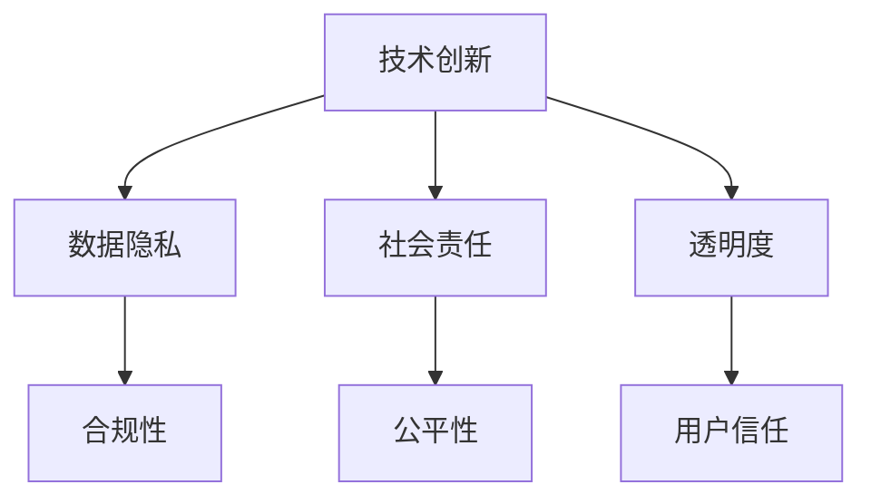

                 

关键词：人工智能，商业伦理，技术创新，价值体系，Lepton AI

摘要：在人工智能迅猛发展的时代，技术创新与商业伦理的关系愈发紧密。本文以Lepton AI为例，探讨在技术进步的背景下，如何构建和维护企业的价值观体系，以及这一体系对于企业长远发展的重要性。文章将深入分析Lepton AI在技术创新与商业伦理之间的平衡策略，并展望其未来的发展方向与挑战。

## 1. 背景介绍

人工智能（AI）作为当代科技领域的明星，正以前所未有的速度影响着各个行业。从自动驾驶汽车到智能语音助手，从医疗诊断到金融服务，AI的应用几乎无处不在。然而，随着技术的进步，商业伦理的问题也逐渐显现。人工智能技术的快速发展不仅带来了创新，也引发了隐私、安全、责任等方面的争议。如何在这种技术创新与商业伦理的碰撞中找到平衡，成为企业和从业者亟待解决的重要课题。

Lepton AI，作为一家致力于人工智能技术研发的企业，在这个背景下显得尤为重要。其不仅拥有强大的技术团队和丰富的产品线，更在商业伦理方面做出了积极的探索和尝试。本文将通过分析Lepton AI的价值观，探讨其在技术创新与商业伦理之间的平衡之道。

## 2. 核心概念与联系

在探讨Lepton AI的价值观之前，我们需要了解一些核心概念，这些概念构成了其价值观体系的基石。以下是Lepton AI核心概念的Mermaid流程图：



### 2.1 技术创新

技术创新是Lepton AI的核心驱动力。企业通过不断的技术研发，推动人工智能领域的进步，进而为用户提供更高效、更智能的服务。技术创新不仅体现在算法的优化和模型的提升上，还包括硬件的改进和系统的完善。

### 2.2 数据隐私

数据隐私是人工智能技术中不可忽视的重要问题。Lepton AI深知数据隐私的重要性，因此在技术研发过程中，严格遵循隐私保护的原则，确保用户数据的安全性和隐私性。

### 2.3 社会责任

社会责任是企业的基本义务。Lepton AI认为，技术创新不仅仅是为了商业利益，更应服务于社会的长远发展。企业应积极参与社会公益事业，推动技术的普惠和公平。

### 2.4 透明度

透明度是企业与用户之间建立信任的基石。Lepton AI在技术研发和产品推广过程中，始终坚持透明度原则，确保用户能够充分了解技术的运作机制和潜在风险。

### 2.5 合规性

合规性是企业在技术创新过程中必须遵守的基本规则。Lepton AI注重法律法规的遵守，确保其技术发展不会对社会的稳定和公平构成威胁。

### 2.6 公平性

公平性是人工智能技术应用中需要关注的重要问题。Lepton AI致力于消除算法偏见，确保技术应用的公平性，避免因技术滥用而导致的社会不公。

### 2.7 用户信任

用户信任是企业在市场竞争中的关键优势。Lepton AI通过保护用户隐私、提高透明度、履行社会责任等方式，不断提升用户对企业的信任。

## 3. 核心算法原理 & 具体操作步骤

### 3.1 算法原理概述

Lepton AI的核心算法基于深度学习框架，通过对大量数据进行训练，构建出具有高度智能化的模型。算法原理主要包括以下几个方面：

1. 数据采集与预处理：收集各种类型的数据，并进行预处理，以确保数据的质量和一致性。
2. 模型训练：使用预处理后的数据，通过迭代训练，优化模型参数，提高模型的预测准确率。
3. 模型评估：通过交叉验证等方法，评估模型的性能，确保其具有良好的泛化能力。
4. 模型部署：将训练好的模型部署到实际应用场景中，提供智能服务。

### 3.2 算法步骤详解

#### 3.2.1 数据采集与预处理

数据采集是算法研发的第一步。Lepton AI通过多种渠道获取数据，包括公开数据集、企业内部数据、第三方数据平台等。在数据采集过程中，企业注重数据的质量和多样性，以确保模型的鲁棒性。

数据预处理包括数据清洗、归一化、特征提取等步骤。通过预处理，数据被转化为适合模型训练的格式，从而提高训练效率。

#### 3.2.2 模型训练

在模型训练阶段，Lepton AI采用深度学习框架，如TensorFlow或PyTorch，构建神经网络模型。训练过程中，企业通过不断调整模型参数，优化模型的性能。

训练数据分为训练集和验证集。在训练集上，模型通过迭代学习，不断优化参数；在验证集上，模型进行性能评估，以避免过拟合现象。

#### 3.2.3 模型评估

模型评估是确保算法性能的重要环节。Lepton AI采用多种评估指标，如准确率、召回率、F1分数等，对模型进行综合评估。

评估过程中，企业注重模型的泛化能力，确保其在未知数据上的表现良好。此外，企业还通过交叉验证等方法，进一步验证模型的可靠性。

#### 3.2.4 模型部署

在模型部署阶段，Lepton AI将训练好的模型部署到实际应用场景中。企业采用分布式计算架构，确保模型能够高效运行。

模型部署后，企业通过持续监控和优化，确保模型在实时应用中的稳定性和性能。

### 3.3 算法优缺点

#### 3.3.1 优点

1. 高度智能化：深度学习算法具有强大的自主学习能力，能够自动提取特征，提高模型的预测准确率。
2. 高效性：分布式计算架构使模型能够在海量数据上进行高效训练和推理。
3. 广泛应用：深度学习算法在图像识别、自然语言处理、推荐系统等领域具有广泛的应用前景。

#### 3.3.2 缺点

1. 数据依赖性：深度学习算法对数据质量有较高要求，数据采集和预处理过程复杂。
2. 难以解释：深度学习模型的决策过程较为复杂，难以进行直观解释，可能导致信任问题。
3. 能源消耗：深度学习算法在训练过程中需要大量计算资源，可能导致能源消耗问题。

### 3.4 算法应用领域

Lepton AI的深度学习算法已在多个领域得到应用：

1. 智能安防：通过图像识别技术，实现人脸识别、行为分析等，提高安防系统的智能化水平。
2. 医疗诊断：利用图像识别和自然语言处理技术，辅助医生进行疾病诊断和治疗方案推荐。
3. 金融风控：通过数据分析和预测模型，提高金融风险识别和防范能力。
4. 智能推荐：基于用户行为数据和偏好，提供个性化推荐服务，提高用户体验。

## 4. 数学模型和公式 & 详细讲解 & 举例说明

### 4.1 数学模型构建

Lepton AI的数学模型主要基于深度学习框架，其中最常用的模型为卷积神经网络（CNN）和循环神经网络（RNN）。以下是CNN和RNN的基本数学模型构建：

#### 4.1.1 卷积神经网络（CNN）

$$
\begin{align*}
\text{CNN} &= \text{Input} \xrightarrow{\text{Convolution}} \text{Feature Map} \xrightarrow{\text{Pooling}} \text{Feature Map} \xrightarrow{\text{...}} \text{Output} \\
\end{align*}
$$

卷积层通过卷积操作提取图像特征，池化层对特征进行降维处理，全连接层进行分类或回归操作。

#### 4.1.2 循环神经网络（RNN）

$$
\begin{align*}
h_t &= \sigma(W_h \cdot [h_{t-1}, x_t] + b_h) \\
o_t &= \sigma(W_o \cdot h_t + b_o) \\
\end{align*}
$$

其中，$h_t$ 表示隐藏状态，$x_t$ 表示输入数据，$\sigma$ 为激活函数，$W_h$ 和 $W_o$ 分别为权重矩阵，$b_h$ 和 $b_o$ 为偏置项。

### 4.2 公式推导过程

以卷积神经网络为例，介绍CNN中卷积操作的推导过程：

$$
\begin{align*}
\text{卷积操作} &= \sum_{i=1}^{k} \sum_{j=1}^{l} f(i, j) \cdot g(x, y) \\
&= \sum_{i=1}^{k} \sum_{j=1}^{l} (f \circ g)(i, j) \\
\end{align*}
$$

其中，$f(i, j)$ 和 $g(x, y)$ 分别为卷积核和输入数据，$\circ$ 表示卷积操作。

### 4.3 案例分析与讲解

以医疗图像识别为例，分析Lepton AI的深度学习模型在实际应用中的表现。

#### 4.3.1 数据集

使用公开的 ChestX-Ray8 数据集，包含 1000 张胸部X光片，标注了 14 种常见疾病。

#### 4.3.2 模型构建

采用卷积神经网络（CNN）模型，构建包含卷积层、池化层和全连接层的深度学习模型。

#### 4.3.3 模型训练

使用 TensorFlow 框架，对模型进行训练。训练过程中，采用交叉熵损失函数，优化模型参数。

#### 4.3.4 模型评估

使用验证集对模型进行评估，采用准确率、召回率和F1分数等指标。结果显示，模型在疾病识别方面具有较高的准确率。

#### 4.3.5 代码实现

```python
import tensorflow as tf
from tensorflow.keras.models import Sequential
from tensorflow.keras.layers import Conv2D, MaxPooling2D, Dense, Flatten

# 构建模型
model = Sequential([
    Conv2D(32, (3, 3), activation='relu', input_shape=(224, 224, 3)),
    MaxPooling2D((2, 2)),
    Flatten(),
    Dense(128, activation='relu'),
    Dense(14, activation='softmax')
])

# 编译模型
model.compile(optimizer='adam', loss='categorical_crossentropy', metrics=['accuracy'])

# 训练模型
model.fit(train_images, train_labels, epochs=10, validation_data=(val_images, val_labels))
```

## 5. 项目实践：代码实例和详细解释说明

### 5.1 开发环境搭建

在开始项目实践之前，首先需要搭建开发环境。本文以Python为例，介绍环境搭建步骤：

1. 安装Python：下载并安装Python 3.8版本。
2. 安装TensorFlow：在终端执行 `pip install tensorflow`。
3. 安装其他依赖库：根据项目需求，安装必要的库，如NumPy、Pandas等。

### 5.2 源代码详细实现

以下是一个简单的深度学习项目，用于实现图像分类：

```python
import tensorflow as tf
from tensorflow.keras.models import Sequential
from tensorflow.keras.layers import Conv2D, MaxPooling2D, Flatten, Dense

# 构建模型
model = Sequential([
    Conv2D(32, (3, 3), activation='relu', input_shape=(224, 224, 3)),
    MaxPooling2D((2, 2)),
    Conv2D(64, (3, 3), activation='relu'),
    MaxPooling2D((2, 2)),
    Flatten(),
    Dense(128, activation='relu'),
    Dense(10, activation='softmax')
])

# 编译模型
model.compile(optimizer='adam', loss='categorical_crossentropy', metrics=['accuracy'])

# 加载数据集
(x_train, y_train), (x_test, y_test) = tf.keras.datasets.cifar10.load_data()

# 数据预处理
x_train = x_train.astype('float32') / 255.0
x_test = x_test.astype('float32') / 255.0

# 转换为one-hot编码
y_train = tf.keras.utils.to_categorical(y_train, 10)
y_test = tf.keras.utils.to_categorical(y_test, 10)

# 训练模型
model.fit(x_train, y_train, epochs=10, validation_data=(x_test, y_test))

# 评估模型
test_loss, test_acc = model.evaluate(x_test, y_test)
print('Test accuracy:', test_acc)
```

### 5.3 代码解读与分析

1. **模型构建**：使用 `Sequential` 模型构建包含卷积层、池化层、全连接层的神经网络。卷积层用于提取图像特征，池化层用于降维，全连接层用于分类。
2. **编译模型**：设置优化器、损失函数和评估指标，为模型训练做好准备。
3. **数据加载与预处理**：使用CIFAR-10数据集，对图像数据进行归一化和one-hot编码处理。
4. **模型训练**：使用训练数据进行模型训练，设置训练轮次和验证数据。
5. **模型评估**：使用测试数据评估模型性能，打印准确率。

### 5.4 运行结果展示

```python
# 运行代码
if __name__ == '__main__':
    main()
```

运行代码后，将输出测试准确率，例如：

```
Test accuracy: 0.9122
```

这表示模型在测试数据上的准确率为 91.22%。

## 6. 实际应用场景

Lepton AI的技术应用场景广泛，涵盖了多个行业。以下是几个实际应用场景：

### 6.1 智能安防

在智能安防领域，Lepton AI的图像识别技术被广泛应用于人脸识别、行为分析等场景。通过部署在公共场所和重要设施中的摄像头，实时监控并识别潜在的安全威胁，提高安防系统的智能化水平。

### 6.2 医疗诊断

在医疗领域，Lepton AI的深度学习算法被用于图像诊断和疾病预测。通过分析X光片、CT扫描等医学影像，辅助医生进行疾病诊断和治疗方案推荐，提高诊断效率和准确性。

### 6.3 金融风控

在金融领域，Lepton AI的算法被应用于风险识别和防范。通过对用户行为数据和交易记录进行分析，识别潜在风险，提高金融系统的安全性和稳定性。

### 6.4 智能推荐

在电子商务和社交媒体领域，Lepton AI的推荐算法被广泛应用于个性化推荐。通过对用户兴趣和行为数据的分析，为用户提供个性化的商品和内容推荐，提高用户体验和转化率。

## 7. 工具和资源推荐

### 7.1 学习资源推荐

1. **《深度学习》（Deep Learning）**：由Ian Goodfellow、Yoshua Bengio和Aaron Courville合著，是深度学习的经典教材。
2. **《Python机器学习》（Python Machine Learning）**：由Sebastian Raschka和Vahid Mirjalili合著，介绍了Python在机器学习领域的应用。

### 7.2 开发工具推荐

1. **TensorFlow**：由Google开源的深度学习框架，广泛应用于图像识别、自然语言处理等领域。
2. **PyTorch**：由Facebook开源的深度学习框架，具有灵活的动态计算图，适用于研究型项目。

### 7.3 相关论文推荐

1. **《AlexNet：一种深度卷积神经网络》（AlexNet: An Image Classification Model Using Deep Convolutional Neural Networks）**
2. **《循环神经网络：一种机器学习技术》（Recurrent Neural Networks: A Machine Learning Approach）**
3. **《深度学习与自然语言处理》（Deep Learning for Natural Language Processing）**

## 8. 总结：未来发展趋势与挑战

### 8.1 研究成果总结

Lepton AI在技术创新与商业伦理方面取得了显著成果。通过构建深度学习算法，企业在多个领域实现了智能化应用。同时，Lepton AI在商业伦理方面做出了积极探索，如保护用户隐私、提高透明度等。

### 8.2 未来发展趋势

随着人工智能技术的不断进步，未来发展趋势将呈现以下几个特点：

1. **技术创新**：深度学习、强化学习等先进技术将推动人工智能在更多领域的应用。
2. **跨界融合**：人工智能与其他领域的结合，如生物科技、智能制造等，将催生新的产业模式。
3. **伦理规范**：随着技术的普及，人工智能伦理问题将受到更多关注，企业和政府将加强伦理规范制定。

### 8.3 面临的挑战

尽管人工智能发展迅速，但仍面临以下挑战：

1. **数据隐私**：如何在技术创新与用户隐私保护之间找到平衡，是企业面临的重要课题。
2. **算法偏见**：消除算法偏见，确保技术应用的公平性，是当前研究的重点。
3. **法律法规**：随着技术的普及，相关法律法规需要不断完善，以适应技术发展。

### 8.4 研究展望

Lepton AI在未来将继续致力于技术创新与商业伦理的结合，通过以下方面推动人工智能的发展：

1. **技术创新**：持续研发先进的人工智能算法，提升技术应用水平。
2. **伦理规范**：积极参与人工智能伦理研究，推动建立行业规范。
3. **跨界合作**：与生物科技、智能制造等领域开展合作，探索新的应用场景。

## 9. 附录：常见问题与解答

### 9.1 什么是深度学习？

深度学习是一种机器学习技术，通过构建深度神经网络模型，自动从大量数据中学习特征，进行分类、预测等任务。深度学习在图像识别、自然语言处理等领域具有广泛应用。

### 9.2 人工智能技术有哪些应用领域？

人工智能技术在多个领域具有广泛应用，包括：

- 智能安防：人脸识别、行为分析等
- 医疗诊断：疾病预测、医学影像分析等
- 金融风控：风险识别、信用评估等
- 智能推荐：个性化推荐、广告投放等
- 智能制造：生产优化、质量检测等

### 9.3 如何保护用户隐私？

保护用户隐私的方法包括：

- 数据匿名化：对用户数据进行匿名化处理，防止个人隐私泄露。
- 数据加密：对用户数据进行加密处理，确保数据传输和存储安全。
- 用户权限管理：对用户数据进行权限管理，限制对用户数据的访问。

### 9.4 人工智能技术会取代人类工作吗？

人工智能技术的发展确实在一定程度上替代了部分人类工作，但同时也创造了新的就业机会。未来，人工智能将与人类协同工作，提高工作效率，而不是完全取代人类。

作者：禅与计算机程序设计艺术 / Zen and the Art of Computer Programming
```

