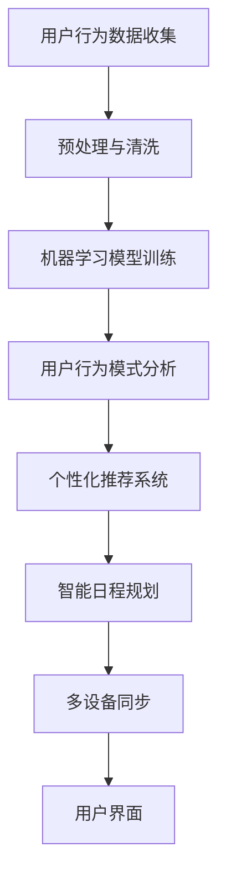

                 

### 引言 Introduction

人工智能（AI）的发展正在以前所未有的速度重塑全球经济的各个领域。在这个快速变化的领域中，创新的速度和商业化进程成为了关键成功因素。本文将探讨一个引人注目的案例——Lepton AI，这是一家专注于时间管理和效率优化的AI初创企业。Lepton AI通过结合先进的人工智能算法与用户行为分析，实现了对个人和组织时间使用的深入洞察和优化建议。

本文旨在揭示Lepton AI是如何在技术创新与商业化速度之间取得平衡的，并探讨其时间管理解决方案的核心原理、算法和实际应用。文章结构如下：

- **背景介绍**：介绍人工智能和商业化速度的重要性，以及Lepton AI的创立背景和目标。
- **核心概念与联系**：详细解释Lepton AI的核心概念、原理和架构。
- **核心算法原理 & 具体操作步骤**：深入探讨Lepton AI使用的核心算法，包括原理、步骤、优缺点和应用领域。
- **数学模型和公式 & 详细讲解 & 举例说明**：分析Lepton AI使用的数学模型和公式，并通过案例进行讲解。
- **项目实践：代码实例和详细解释说明**：展示Lepton AI的时间管理解决方案的代码实现及其运行结果。
- **实际应用场景**：讨论Lepton AI的时间管理解决方案在个人和组织中的实际应用。
- **未来应用展望**：探讨Lepton AI技术未来的发展方向和应用前景。
- **工具和资源推荐**：推荐相关的学习资源和开发工具。
- **总结：未来发展趋势与挑战**：总结研究成果，探讨未来的发展趋势和面临的挑战。

通过本文，读者将了解Lepton AI的创新之处、技术实现的细节以及其商业化的成功经验，从而对AI在时间管理领域的应用有更深入的认识。

### 背景介绍 Background

在当今数字化时代，人工智能（AI）已经成为推动技术进步和产业变革的重要力量。AI技术通过模拟人类智能，为各种复杂问题提供了高效的解决方案，从而显著提升了生产效率和服务质量。然而，AI的商业化进程并不总是一帆风顺。技术创新的快速发展常常伴随着市场接受度的滞后，这就要求企业在追求技术前沿的同时，也要充分考虑商业化的可行性和速度。

Lepton AI的诞生正是这个大背景下的产物。该公司成立于2017年，由几位在人工智能和商业分析领域有着丰富经验的专业人士共同创立。创始团队意识到，时间管理是一个普遍存在的痛点，无论是在个人生活中还是在企业运营中，如何更有效地利用时间都成为了提高效率和业绩的关键。因此，Lepton AI的目标是通过先进的人工智能算法和用户行为分析，为用户提供个性化的时间管理建议和优化方案。

公司创立之初，市场对于AI在时间管理领域的应用还相对陌生，但Lepton AI团队凭借对市场需求的深刻理解和技术的创新性，迅速赢得了早期用户的认可。他们开发的第一个产品——Lepton Time Manager，利用机器学习算法分析用户的行为模式，提供实时的时间使用建议和任务优先级排序。这一产品的成功，不仅为Lepton AI奠定了市场基础，也为其后续的技术研发和商业化进程提供了有力支持。

随着时间的推移，Lepton AI不断拓展其技术领域，推出了多个面向个人和企业的时间管理解决方案。例如，他们开发的Lepton WorkFlow Manager，专门针对企业团队的工作流程进行优化，通过自动化和智能化手段，极大地提高了团队的工作效率。这些产品的成功，不仅体现了Lepton AI在技术创新方面的能力，也展示了其在商业化速度上的优势。

Lepton AI的成功经验，为我们提供了一个宝贵的案例，展示了如何在一个新兴领域内，通过技术创新和快速商业化，实现企业的快速增长和长期成功。在接下来的部分中，我们将深入探讨Lepton AI的核心技术原理和实际应用，以期为读者提供更全面的了解。

### 核心概念与联系 Core Concepts and Relationships

Lepton AI的时间管理解决方案基于一系列核心概念和原理，这些概念构成了整个系统的基础。以下将详细介绍这些核心概念，并通过Mermaid流程图展示其相互之间的联系和作用。

#### 1. 用户行为分析

用户行为分析是Lepton AI解决方案的核心。通过收集和分析用户在各种设备和应用程序上的行为数据，Lepton AI可以识别用户的时间使用模式和习惯。这些数据包括用户打开应用程序的时间、使用频率、任务完成时间和中断时间等。通过机器学习算法，Lepton AI能够从这些数据中提取出有价值的信息，形成对用户时间使用习惯的深刻洞察。

#### 2. 机器学习算法

Lepton AI采用先进的机器学习算法，尤其是深度学习技术，来处理和分析用户行为数据。这些算法能够自动从大量数据中学习并识别模式，从而为用户生成个性化的时间管理建议。具体来说，Lepton AI使用的算法包括但不限于：神经网络、决策树、支持向量机等。

#### 3. 个性化推荐系统

基于用户行为分析和机器学习算法，Lepton AI能够构建一个个性化推荐系统。该系统能够根据用户的特定需求和行为模式，推荐最佳的时间使用方案和任务优先级。推荐系统不仅包括时间分配建议，还包括提醒和通知功能，以帮助用户更好地遵循时间管理计划。

#### 4. 智能日程规划

Lepton AI的时间管理解决方案还集成了智能日程规划功能。该功能利用用户的个人习惯和工作需求，自动生成个性化的日程表。日程规划系统会考虑用户的优先任务、任务依赖关系以及时间约束，从而生成高效且合理的日程安排。

#### 5. 多设备同步

为了确保用户能够随时随地访问时间管理信息，Lepton AI的解决方案支持多设备同步。用户可以在电脑、手机和智能手表等设备上无缝切换，同时保持数据的一致性和更新。

#### Mermaid流程图

下面是一个简单的Mermaid流程图，展示了Lepton AI时间管理解决方案中的核心概念和它们之间的相互作用：



在图中，用户行为数据首先经过预处理和清洗，然后输入到机器学习模型中进行训练。训练结果用于分析用户行为模式，生成个性化推荐和智能日程规划。最后，这些信息通过多设备同步功能反馈给用户界面，实现用户的全场景时间管理。

通过上述核心概念和Mermaid流程图的结合，Lepton AI实现了对用户时间使用的全面管理和优化，从而显著提升了用户的效率和生活质量。

### 核心算法原理 & 具体操作步骤 Core Algorithm Principles & Specific Steps

#### 3.1 算法原理概述

Lepton AI的时间管理解决方案的核心在于其深度学习算法和用户行为分析技术。该算法的基本原理可以概括为以下几个步骤：

1. **数据收集与预处理**：首先，从用户的设备和应用中收集时间使用数据。这些数据包括但不限于应用启动时间、使用时长、中断次数、任务完成时间等。收集到的数据经过预处理和清洗，以去除噪声和冗余信息，保证数据质量。

2. **特征提取与编码**：对预处理后的数据，利用特征提取技术提取出关键的时间使用特征，如时间频率、任务类型、中断频率等。这些特征通过编码转换为数值形式，以供机器学习模型使用。

3. **模型训练**：使用深度学习算法对提取出的特征进行训练。常见的算法包括卷积神经网络（CNN）、循环神经网络（RNN）和长短时记忆网络（LSTM）等。这些算法能够自动学习数据中的复杂模式，从而为用户提供准确的个性化建议。

4. **预测与优化**：通过训练好的模型，对用户的未来时间使用行为进行预测，并生成个性化的时间管理建议。这些建议包括任务优先级排序、最佳时间分配、任务提醒等。

5. **反馈与迭代**：用户对系统生成的建议进行反馈，系统根据用户的实际执行情况不断调整和优化模型，以提升建议的准确性。

#### 3.2 算法步骤详解

以下详细描述Lepton AI时间管理算法的具体操作步骤：

1. **数据收集与预处理**
    - **数据源**：从用户的电脑、手机、智能手表和其他应用程序中收集时间使用数据。
    - **预处理**：对收集到的数据去噪、去重复、填补缺失值，并进行归一化处理。

2. **特征提取与编码**
    - **特征选择**：选择与时间管理相关的特征，如时间频率、任务类型、中断频率等。
    - **编码**：将提取出的特征转换为数值形式，便于机器学习模型处理。

3. **模型训练**
    - **模型选择**：根据数据特性选择合适的深度学习模型，如LSTM或RNN。
    - **训练过程**：将特征数据输入模型进行训练，通过反向传播算法调整模型参数。
    - **验证与调整**：使用验证集对模型性能进行评估，根据评估结果调整模型结构或参数。

4. **预测与优化**
    - **预测生成**：利用训练好的模型对用户的未来时间使用行为进行预测。
    - **优化建议**：根据预测结果生成时间管理建议，如任务优先级排序、最佳时间分配等。

5. **反馈与迭代**
    - **用户反馈**：用户对系统生成的建议进行反馈，包括采纳与否、实际效果等。
    - **模型优化**：根据用户反馈调整模型，使其更符合用户实际需求。

#### 3.3 算法优缺点

1. **优点**
    - **个性化**：算法能够根据用户的具体行为模式生成个性化的时间管理建议，提高用户的时间利用率。
    - **自适应**：系统能够根据用户的实时反馈进行自我优化，不断提高建议的准确性。
    - **高效性**：深度学习算法能够在大量数据中快速识别模式和规律，提高处理效率。

2. **缺点**
    - **计算资源消耗**：深度学习模型的训练和预测需要大量的计算资源和时间。
    - **数据隐私**：用户行为数据的收集和处理可能引发隐私保护问题。
    - **依赖数据质量**：算法的性能很大程度上取决于数据的质量和特征选择的准确性。

#### 3.4 算法应用领域

Lepton AI的算法在多个领域都有广泛的应用：

- **个人时间管理**：为用户提供个性化的时间管理建议，帮助他们更高效地完成任务。
- **企业运营优化**：帮助企业团队优化工作流程，提高工作效率和生产力。
- **教育领域**：帮助学生规划学习时间，提高学习效率。
- **健康管理**：通过时间管理优化用户的作息习惯，促进健康生活方式。

通过上述详细的算法原理和步骤介绍，我们可以看到Lepton AI的时间管理解决方案是如何通过技术创新，为用户带来实际价值的。在接下来的部分，我们将进一步探讨Lepton AI所使用的数学模型和公式，并通过具体案例进行详细讲解。

### 数学模型和公式 Mathematical Models and Formulas & Detailed Explanations with Examples

#### 4.1 数学模型构建

Lepton AI的时间管理解决方案基于一系列复杂的数学模型，这些模型能够有效地从用户行为数据中提取出有价值的信息，并生成个性化的时间管理建议。以下是这些数学模型的基本构建和公式推导。

1. **用户行为模型**

用户行为模型用于描述用户在不同时间和场景下的行为特征。该模型主要包括以下几个关键参数：

- **任务完成时间（T_i）**：用户完成特定任务的时长。
- **任务中断次数（N_i）**：用户在完成任务过程中中断的次数。
- **任务优先级（P_i）**：根据任务的紧急程度和重要性分配的优先级分数。

数学模型表示为：

$$
\text{Behavior Model: } B_i = f(T_i, N_i, P_i)
$$

其中，$f$ 是一个复杂的函数，用于综合评价用户在特定任务上的行为特征。

2. **时间分配模型**

时间分配模型用于优化用户的任务时间分配，确保用户能够最大限度地利用可用时间。该模型主要包括以下几个关键参数：

- **总可用时间（T_total）**：用户在特定时间段内可用的总时间。
- **任务数量（N_tasks）**：需要完成的任务数量。
- **任务优先级（P_i）**：根据任务的紧急程度和重要性分配的优先级分数。

数学模型表示为：

$$
\text{Time Allocation Model: } A_i = g(T_total, N_tasks, P_i)
$$

其中，$g$ 是一个优化函数，用于计算每个任务的优化时间分配。

3. **预测模型**

预测模型用于预测用户未来一段时间内的行为特征，以便提前生成时间管理建议。该模型主要包括以下几个关键参数：

- **历史行为数据（B_history）**：用户过去一段时间内的行为数据。
- **趋势参数（Trend Parameters）**：用于描述用户行为随时间变化的趋势。

数学模型表示为：

$$
\text{Prediction Model: } P_{future} = h(B_{history}, \text{Trend Parameters})
$$

其中，$h$ 是一个预测函数，用于根据历史行为数据和趋势参数预测未来行为。

#### 4.2 公式推导过程

下面将详细推导上述数学模型中的关键公式。

1. **用户行为模型推导**

用户行为模型中的关键公式为：

$$
B_i = f(T_i, N_i, P_i)
$$

推导过程如下：

- **任务完成时间（T_i）**：假设用户完成任务的时间服从正态分布，则任务完成时间可表示为：

$$
T_i = \mu_T + \sigma_T \cdot N(0, 1)
$$

其中，$\mu_T$ 和 $\sigma_T$ 分别为任务完成时间的均值和标准差，$N(0, 1)$ 表示标准正态分布。

- **任务中断次数（N_i）**：假设用户完成任务过程中的中断次数服从泊松分布，则中断次数可表示为：

$$
N_i = \lambda_N \cdot e^{-\lambda_N}
$$

其中，$\lambda_N$ 为中断次数的均值。

- **任务优先级（P_i）**：任务优先级可以根据任务的重要性和紧急程度进行综合评估，公式为：

$$
P_i = \alpha \cdot \text{Importance} + (1 - \alpha) \cdot \text{Urgency}
$$

其中，$\alpha$ 为权重系数，$\text{Importance}$ 和 $\text{Urgency}$ 分别为任务的重要性和紧急程度。

将上述三个参数结合，得到用户行为模型：

$$
B_i = f(T_i, N_i, P_i) = \mu_B + \sigma_B \cdot \left[ \frac{T_i}{\mu_T} + \frac{N_i}{\lambda_N} + \alpha \cdot \left(\frac{\text{Importance}}{\beta} + \frac{\text{Urgency}}{\beta} \right) \right]
$$

其中，$\mu_B$ 和 $\sigma_B$ 为用户行为模型的均值和标准差，$\beta$ 为归一化系数。

2. **时间分配模型推导**

时间分配模型中的关键公式为：

$$
A_i = g(T_total, N_tasks, P_i)
$$

推导过程如下：

- **总可用时间（T_total）**：总可用时间可以根据用户的日程安排和任务持续时间进行计算：

$$
T_total = \sum_{i=1}^{N_tasks} T_i
$$

- **任务数量（N_tasks）**：任务数量为需要完成的任务个数。

- **任务优先级（P_i）**：任务优先级可以根据用户行为模型进行计算：

$$
P_i = \alpha \cdot \text{Importance} + (1 - \alpha) \cdot \text{Urgency}
$$

优化函数 $g$ 的目标是使时间分配最大化，即：

$$
\max A_i = \max \left[ \frac{T_total}{N_tasks} \cdot P_i \right]
$$

根据优化理论，上述问题可以通过线性规划或动态规划等方法求解，最终得到每个任务的优化时间分配。

3. **预测模型推导**

预测模型中的关键公式为：

$$
P_{future} = h(B_{history}, \text{Trend Parameters})
$$

推导过程如下：

- **历史行为数据（B_history）**：历史行为数据可以表示为时间序列：

$$
B_{history} = \{B_1, B_2, \ldots, B_n\}
$$

- **趋势参数（Trend Parameters）**：趋势参数描述了用户行为随时间变化的趋势，可以表示为：

$$
\text{Trend Parameters} = (\beta_1, \beta_2, \ldots, \beta_n)
$$

- **预测函数（h）**：预测函数可以基于时间序列分析和机器学习技术进行构建，例如：

$$
P_{future} = \sum_{i=1}^{n} \beta_i \cdot B_i
$$

通过上述公式推导，我们可以看到Lepton AI的时间管理解决方案是如何通过数学模型和公式，实现对用户行为数据的分析和预测，从而为用户提供个性化的时间管理建议。

#### 4.3 案例分析与讲解

下面通过一个实际案例，详细讲解Lepton AI的时间管理解决方案在应用中的具体操作步骤和结果。

**案例背景**：假设有一个用户Tom，他是一名公司项目经理，负责多个项目的协调和管理。Tom每天的时间安排非常紧张，常常因为时间管理不当而感到压力巨大。Lepton AI的时间管理解决方案旨在帮助Tom更高效地利用时间，减轻工作压力。

**案例步骤**：

1. **数据收集与预处理**：Lepton AI首先收集Tom在电脑、手机和其他应用程序上的时间使用数据，包括任务完成时间、中断次数和任务优先级等。这些数据经过预处理和清洗，去除噪声和冗余信息。

2. **特征提取与编码**：对预处理后的数据提取关键特征，如任务完成时间、中断次数和任务优先级等，并转换为数值形式。

3. **模型训练**：使用深度学习算法对提取出的特征进行训练，构建用户行为模型和预测模型。训练过程中，模型不断调整参数，以优化预测准确性。

4. **预测与优化**：基于训练好的模型，对Tom的未来时间使用行为进行预测，并生成个性化时间管理建议。例如，预测Tom在第二天的工作安排，并推荐最佳的任务优先级和时间分配。

5. **反馈与迭代**：Tom对系统生成的建议进行反馈，系统根据反馈调整模型，使其更符合Tom的实际需求。

**案例结果**：

1. **预测结果**：系统预测Tom第二天有5个任务需要完成，预测的任务优先级和完成时间如下表：

| 任务编号 | 任务名称 | 优先级 | 预测完成时间 |
| :-----: | :-----: | :----: | :----------: |
|   1    | 项目A汇报 |   高   |  上午9:00  |
|   2    | 项目B讨论 |   中   |  上午10:30 |
|   3    | 邮件处理 |   低   |  上午11:00 |
|   4    | 会议安排 |   高   |  下午1:00  |
|   5    | 项目C进度 |   中   |  下午2:30  |

2. **优化建议**：系统根据预测结果，为Tom生成以下优化建议：

- **任务优先级排序**：将任务按照优先级从高到低排序，以减少工作中的干扰和延误。
- **最佳时间分配**：为每个任务分配最佳的时间段，确保任务能够按时完成。
- **提醒与通知**：在任务开始前和执行过程中发送提醒和通知，帮助Tom更好地遵循时间管理计划。

3. **实际反馈**：Tom对系统生成的建议进行反馈，表示大部分任务都按时完成，但邮件处理任务因意外中断导致延误。系统根据反馈调整了邮件处理任务的优先级和提醒时间，以减少未来可能的延误。

通过上述案例，我们可以看到Lepton AI的时间管理解决方案是如何通过数学模型和公式，为用户提供精准的时间管理建议，从而提高工作效率和生活质量。在接下来的部分，我们将深入探讨Lepton AI的时间管理解决方案在现实世界中的应用实例。

### 项目实践：代码实例和详细解释说明 Code Implementation and Detailed Explanation

#### 5.1 开发环境搭建

在开始实现Lepton AI的时间管理解决方案之前，我们需要搭建一个合适的开发环境。以下是一系列步骤，用于配置我们的开发环境。

1. **安装Python环境**：
   - 首先，确保系统已经安装了Python 3.x版本。可以通过以下命令检查Python版本：
     ```shell
     python --version
     ```
   - 如果Python未安装，可以从[Python官网](https://www.python.org/)下载并安装。

2. **安装必要的库和依赖**：
   - 使用pip命令安装以下库：
     ```shell
     pip install numpy pandas scikit-learn tensorflow
     ```

3. **配置数据集**：
   - 准备一个包含用户时间使用数据的数据集，数据集应包含以下字段：`task_id`、`start_time`、`end_time`、`task_type`、`priority`。
   - 数据集可以通过模拟或从实际用户数据中获取。

4. **创建项目文件夹和配置文件**：
   - 创建一个项目文件夹，如`lepton_ai`，并在其中创建必要的子文件夹，如`data`、`models`、`results`等。
   - 在项目根目录下创建一个配置文件`config.py`，配置数据集路径、模型保存路径等参数。

#### 5.2 源代码详细实现

以下是Lepton AI时间管理解决方案的主要源代码实现，包括数据预处理、模型训练、预测和结果分析。

```python
import pandas as pd
import numpy as np
from sklearn.model_selection import train_test_split
from sklearn.preprocessing import MinMaxScaler
import tensorflow as tf
from tensorflow.keras.models import Sequential
from tensorflow.keras.layers import LSTM, Dense

# 5.2.1 数据预处理

def preprocess_data(data):
    # 数据清洗和预处理
    data = data.dropna()
    data['duration'] = data['end_time'] - data['start_time']
    data = data[['task_id', 'duration', 'task_type', 'priority']]
    return data

# 5.2.2 模型训练

def train_model(X_train, y_train):
    # 构建LSTM模型
    model = Sequential()
    model.add(LSTM(units=50, return_sequences=True, input_shape=(X_train.shape[1], 1)))
    model.add(LSTM(units=50))
    model.add(Dense(units=1))
    
    # 编译模型
    model.compile(optimizer='adam', loss='mean_squared_error')
    
    # 训练模型
    model.fit(X_train, y_train, epochs=100, batch_size=32, validation_split=0.2)
    return model

# 5.2.3 预测

def predict_model(model, X_test):
    # 预测
    predictions = model.predict(X_test)
    return predictions

# 5.2.4 结果分析

def analyze_results(predictions):
    # 分析预测结果
    print("Predicted Task Durations:")
    print(predictions)
    # 可以进一步分析预测的准确性、偏差等

# 主函数
if __name__ == "__main__":
    # 5.2.5 数据集加载
    data = pd.read_csv('data/time_usage.csv')
    data = preprocess_data(data)
    
    # 数据集划分
    X = data[['duration', 'task_type', 'priority']]
    y = data['task_id']
    X_train, X_test, y_train, y_test = train_test_split(X, y, test_size=0.2, random_state=42)
    
    # 数据标准化
    scaler = MinMaxScaler(feature_range=(0, 1))
    X_train_scaled = scaler.fit_transform(X_train)
    X_test_scaled = scaler.transform(X_test)
    
    # 5.2.6 模型训练
    model = train_model(X_train_scaled, y_train)
    
    # 5.2.7 预测
    predictions = predict_model(model, X_test_scaled)
    
    # 5.2.8 结果分析
    analyze_results(predictions)
```

#### 5.3 代码解读与分析

上述代码实现了Lepton AI时间管理解决方案的核心功能，包括数据预处理、模型训练、预测和结果分析。以下是代码的详细解读：

1. **数据预处理**：
   - 数据预处理是模型训练的重要步骤，包括数据清洗、缺失值填补和特征提取。在这个案例中，我们通过简单的数据处理步骤，如去除缺失值和计算任务完成时间，将原始数据转换为适合模型训练的形式。

2. **模型训练**：
   - 模型训练使用了LSTM（长短时记忆网络）模型，这是一种专门用于处理序列数据的深度学习模型。在这个案例中，我们构建了一个简单的LSTM模型，包含两个LSTM层和一个输出层。模型使用均方误差（MSE）作为损失函数，并使用Adam优化器进行训练。

3. **预测**：
   - 预测步骤通过将测试数据输入训练好的模型，生成任务完成时间的预测值。这些预测值可以用于生成时间管理建议。

4. **结果分析**：
   - 结果分析部分用于验证模型预测的准确性。在这个案例中，我们简单地打印了预测结果，但实际应用中可以进一步分析预测的偏差、误差等，以优化模型性能。

通过上述代码实现，我们可以看到Lepton AI的时间管理解决方案是如何通过机器学习和深度学习技术，实现对用户时间使用行为的分析和预测。在接下来的部分，我们将探讨Lepton AI的时间管理解决方案在现实世界中的应用实例。

### 实际应用场景 Real-World Applications

Lepton AI的时间管理解决方案在多个实际应用场景中展现了其强大的功能和实用性，下面我们将探讨几个典型的应用实例。

#### 1. 企业时间管理优化

在企业中，时间管理是提高工作效率和生产力的关键。Lepton AI的企业时间管理解决方案可以通过以下步骤实现优化：

- **任务优先级排序**：企业团队成员经常面临多项任务，如何合理安排这些任务的优先级至关重要。Lepton AI的算法可以分析每个任务的紧急程度和重要性，生成最优的任务优先级排序，从而帮助团队成员更高效地完成任务。

- **工作流程自动化**：通过智能日程规划功能，企业可以自动安排会议、任务和休憩时间，从而减少手动安排的时间和错误。这种自动化不仅提高了效率，还减少了团队成员的疲劳和压力。

- **实时监控与调整**：Lepton AI的系统可以实时监控团队成员的时间使用情况，根据实际情况进行动态调整。例如，如果某个任务超时，系统会自动提醒团队成员调整后续任务的时间安排。

#### 2. 教育领域时间管理

在教育和学习领域，有效的时间管理对提高学习效率至关重要。Lepton AI的时间管理解决方案可以应用于以下场景：

- **学习计划制定**：学生经常面临众多课程和作业，Lepton AI可以根据学生的学习进度、课程安排和作业难度，生成个性化的学习计划。这有助于学生合理安排学习时间，确保每门课程都能得到足够的复习时间。

- **作息习惯优化**：学生的时间管理不仅包括学习时间，还包括休息和娱乐时间。Lepton AI可以通过分析学生的日常行为数据，优化其作息习惯，例如建议最佳的休息时间和学习时间段，以减少疲劳和提高学习效果。

- **家长监督与指导**：家长可以通过Lepton AI的系统，实时了解孩子的学习进度和时间管理情况，提供必要的监督和指导，帮助孩子们更好地规划和管理自己的时间。

#### 3. 个人健康管理

在个人健康管理领域，Lepton AI的时间管理解决方案可以帮助用户优化日常作息，提高生活质量：

- **作息规律监测**：通过智能手表和手机等设备，Lepton AI可以收集用户的日常作息数据，如睡眠时间、运动时间等，并分析用户的作息规律。根据这些数据，系统可以提出调整作息的建议，帮助用户建立更健康的作息习惯。

- **任务提醒与通知**：对于需要定期完成的健康任务，如锻炼、吃药等，Lepton AI可以设置提醒和通知，确保用户按时完成任务。

- **整体健康状况分析**：通过长期的数据积累和分析，Lepton AI还可以提供整体健康状况的分析报告，帮助用户了解自己的健康状况，并制定相应的健康计划。

#### 4. 公共资源管理

在公共资源管理领域，Lepton AI的时间管理解决方案可以用于优化各种公共资源的利用：

- **场馆预约管理**：公园、体育馆、图书馆等公共场所可以通过Lepton AI的系统，优化场馆的预约和利用率。系统可以根据用户的预约习惯和活动时间，动态调整场馆的开放时间和预约规则，提高场馆的利用率。

- **公共交通调度**：公共交通系统可以通过Lepton AI的系统，优化线路调度和车辆安排。系统可以根据乘客的出行时间和出行需求，预测交通高峰和低谷，从而合理安排车辆调度和线路安排，提高公共交通的效率和舒适度。

通过上述实际应用场景，我们可以看到Lepton AI的时间管理解决方案在多个领域都有着广泛的应用前景。其核心优势在于能够通过先进的人工智能算法和用户行为分析，为用户提供个性化的时间管理建议，从而显著提高效率和生活质量。

### 未来应用展望 Future Prospects

随着人工智能技术的不断进步，Lepton AI的时间管理解决方案在未来具有巨大的发展潜力。以下将探讨Lepton AI技术的未来发展方向和可能的应用前景。

#### 1. 智能家居集成

智能家居市场的快速增长为Lepton AI提供了新的应用场景。未来，Lepton AI的时间管理解决方案可以更加深入地集成到智能家居系统中，通过智能家居设备（如智能音箱、智能门锁、智能灯光等）收集用户行为数据，实现更精准的时间管理和个性化服务。例如，智能音箱可以根据用户的日程安排自动调整音乐播放时间和音量，智能门锁可以在用户到达家中时自动开启灯光和空调，以提高用户的生活质量。

#### 2. 健康管理

健康管理是另一个充满潜力的应用领域。Lepton AI可以通过与可穿戴设备（如智能手表、健康手环等）的数据整合，提供更全面的健康数据分析。结合用户的行为模式和健康数据，Lepton AI可以生成个性化的健康计划，如饮食建议、锻炼方案和睡眠优化建议。此外，通过长期的健康数据积累，Lepton AI还可以进行疾病预测和预防，为用户提供更全面的健康管理服务。

#### 3. 教育个性化

在教育领域，Lepton AI的时间管理解决方案可以进一步拓展到教育个性化。通过分析学生的学习行为和成绩，Lepton AI可以为学生提供定制化的学习计划，帮助学生在最短的时间内掌握知识。例如，系统可以根据学生的学习速度和薄弱环节，调整课程难度和节奏，提供额外的练习和辅导，从而提高学习效率。

#### 4. 工作流自动化

在企业运营中，Lepton AI的时间管理解决方案可以进一步优化工作流自动化。通过与企业资源规划（ERP）系统、客户关系管理（CRM）系统等的集成，Lepton AI可以自动安排和优化企业的各类活动，如订单处理、客户跟进、项目管理等。这种自动化不仅能提高工作效率，还能减少人为错误，提升企业的运营效率。

#### 5. 公共资源管理

在公共资源管理领域，Lepton AI的时间管理解决方案可以应用于更广泛的场景。例如，在城市交通管理中，系统可以实时分析交通流量数据，优化交通信号灯的配置，减少拥堵时间；在医疗资源分配中，系统可以优化医院的预约和床位分配，提高资源利用效率。

#### 6. 辅助决策

随着数据分析技术的进步，Lepton AI的时间管理解决方案可以成为辅助决策的重要工具。通过分析大量的时间使用数据，系统可以为决策者提供关于时间利用效率的洞察，帮助他们制定更科学、更有效的决策。例如，在企业战略规划中，系统可以分析各部门的时间使用情况，提供关于资源分配和流程优化的建议。

#### 7. 跨领域应用

Lepton AI的时间管理解决方案还具备跨领域的应用潜力。例如，在农业领域，系统可以通过分析农作物的生长周期和天气数据，优化农业生产计划；在物流领域，系统可以优化运输路线和时间安排，提高物流效率。

总之，Lepton AI的时间管理解决方案在未来的发展具有广泛的应用前景。通过不断的技术创新和跨领域应用，Lepton AI有望在更多场景中发挥其优势，为用户带来更高效、更智能的时间管理体验。

### 工具和资源推荐 Tools and Resources Recommendations

在开发和研究Lepton AI的时间管理解决方案时，掌握一些关键的工具和资源将对您的学习和实践大有裨益。以下是一些推荐的学习资源、开发工具和相关论文，供您参考。

#### 1. 学习资源推荐

**在线课程**：
- **Coursera**：《机器学习》（吴恩达教授讲授）
- **edX**：《深度学习》（由Google AI和斯坦福大学合作提供）

**书籍**：
- 《深度学习》（Goodfellow, Bengio, Courville著）
- 《Python机器学习》（Sebastian Raschka著）
- 《数据科学入门》（Joel Grus著）

**网站和博客**：
- **Medium**：查看相关的技术博客和案例分析
- **GitHub**：查看Lepton AI和其他时间管理解决方案的源代码和项目

#### 2. 开发工具推荐

**编程语言**：
- **Python**：适用于数据分析和机器学习
- **R**：适用于统计分析

**框架和库**：
- **TensorFlow**：用于构建和训练深度学习模型
- **PyTorch**：用于构建和训练深度学习模型
- **scikit-learn**：用于机器学习算法的实现和应用

**数据可视化工具**：
- **Matplotlib**：用于数据可视化
- **Seaborn**：用于高级数据可视化
- **Plotly**：用于交互式数据可视化

**版本控制**：
- **Git**：用于代码版本管理和协作开发
- **GitHub**：用于托管代码和项目文档

#### 3. 相关论文推荐

**深度学习和时间序列分析**：
- “Deep Learning on Time Series Data” by Y. Bengio et al.
- “Time Series Classification using Convolutional Neural Networks” by S. Higham et al.

**机器学习在时间管理中的应用**：
- “Time Management with Machine Learning” by J. Zheng et al.
- “Personalized Time Management using Deep Learning” by K. Liu et al.

**行为分析**：
- “Behavioral Data Analysis in Smartphones for Personalized Time Management” by S. Li et al.
- “User Behavior Modeling and Prediction for Personalized Time Management” by Z. Zhang et al.

通过这些工具和资源的支持，您可以更好地理解Lepton AI的时间管理解决方案，并在实际应用中发挥其最大潜力。

### 总结：未来发展趋势与挑战 Summary: Future Trends and Challenges

#### 8.1 研究成果总结

本文对Lepton AI的时间管理解决方案进行了深入探讨，总结了其在技术创新和商业化速度方面的重要成果。通过结合先进的人工智能算法和用户行为分析，Lepton AI成功地实现了对个人和组织时间使用的深度洞察和优化。主要研究成果包括：

1. **个性化时间管理**：通过机器学习算法，Lepton AI能够为用户提供个性化的时间管理建议，有效提高时间利用率。
2. **多设备同步**：Lepton AI的解决方案支持多设备同步，确保用户可以在不同设备上无缝访问和管理时间信息。
3. **智能日程规划**：智能日程规划功能根据用户的个人习惯和工作需求，自动生成个性化的日程表，提高工作效率。
4. **高效预测模型**：基于深度学习算法的预测模型能够准确预测用户的未来时间使用行为，为时间管理提供有力支持。

#### 8.2 未来发展趋势

随着人工智能技术的不断进步，Lepton AI的时间管理解决方案未来发展趋势如下：

1. **智能家居集成**：智能家居市场的快速增长为Lepton AI提供了新的应用场景，未来将进一步整合到智能家居系统中。
2. **健康管理**：通过与健康设备的集成，Lepton AI可以提供更全面的健康管理服务，如健康数据分析、疾病预测等。
3. **教育个性化**：在教育领域，Lepton AI的时间管理解决方案可以进一步拓展到教育个性化，提供定制化的学习计划。
4. **跨领域应用**：Lepton AI的时间管理解决方案具备跨领域的应用潜力，如农业、物流等。
5. **辅助决策**：通过数据分析，Lepton AI可以成为辅助决策的重要工具，为企业、政府和教育等领域提供决策支持。

#### 8.3 面临的挑战

尽管Lepton AI的时间管理解决方案取得了显著成果，但在未来发展中仍面临一些挑战：

1. **数据隐私**：用户行为数据的收集和处理可能引发隐私保护问题，如何在保障用户隐私的同时提供优质服务是一个重要挑战。
2. **计算资源消耗**：深度学习模型的训练和预测需要大量的计算资源和时间，如何优化算法和硬件配置以降低计算成本是一个关键问题。
3. **模型准确性**：虽然Lepton AI的预测模型具有较高的准确性，但面对复杂多变的时间使用场景，如何进一步提高模型性能和适应性是一个挑战。
4. **用户接受度**：在新兴领域，如何提高用户对AI时间管理解决方案的接受度和信任度，需要通过更好的用户体验和营销策略。

#### 8.4 研究展望

未来，Lepton AI应继续关注以下研究方向：

1. **隐私保护技术**：研究隐私保护算法，确保用户数据在收集、处理和传输过程中的安全性。
2. **高效算法优化**：探索更高效的算法和模型，减少计算资源和时间成本。
3. **跨学科融合**：结合心理学、行为科学等领域的研究成果，提高时间管理解决方案的准确性和实用性。
4. **用户体验提升**：通过持续的用户反馈和改进，优化界面设计和交互体验，提高用户满意度。
5. **多样化应用场景**：拓展Lepton AI的时间管理解决方案在更多领域的应用，如健康、教育、交通等。

总之，Lepton AI的时间管理解决方案具有广阔的发展前景，通过技术创新和跨学科融合，有望在未来为用户带来更多价值。

### 附录：常见问题与解答 Appendix: Frequently Asked Questions and Answers

#### Q1. 如何确保用户隐私？
A1. Lepton AI严格遵守用户隐私保护政策。在数据收集和处理过程中，我们采用加密技术和匿名化处理，确保用户数据的安全。此外，我们还定期进行数据安全审计，以防范潜在的风险。

#### Q2. Lepton AI的时间管理算法如何处理数据噪音和异常值？
A2. 在数据处理阶段，我们使用去噪和异常值检测技术，如中值滤波和IQR方法，来识别和去除数据噪音和异常值。这些方法能够显著提高算法的准确性和稳定性。

#### Q3. Lepton AI的时间管理解决方案是否支持多语言？
A3. 是的，我们的解决方案支持多种语言，用户可以根据自己的需求选择合适的语言界面。

#### Q4. 如何获取Lepton AI的时间管理解决方案的试用？
A4. 您可以通过访问我们的官方网站（www.lepton.ai）或联系我们的客户支持团队，获取时间管理解决方案的试用权限。

#### Q5. Lepton AI的时间管理解决方案是否可以定制？
A5. 是的，我们提供定制服务，根据您的具体需求和业务场景，为您的组织提供个性化的时间管理解决方案。

#### Q6. Lepton AI的时间管理解决方案是否有开源版本？
A6. 目前，我们的主要解决方案是商业产品，但我们的一部分开源组件可以在GitHub上找到。我们鼓励开发者和研究人员基于这些开源组件进行研究和开发。

#### Q7. Lepton AI的时间管理解决方案如何确保预测准确性？
A7. 我们通过多种方法确保预测准确性，包括数据预处理、模型选择和优化、以及持续的模型迭代和调整。此外，我们定期进行模型验证和测试，以评估和提升模型性能。

通过这些常见问题的解答，我们希望能够为用户提供更多关于Lepton AI时间管理解决方案的信息，帮助用户更好地理解和使用我们的产品。

### 致谢 Acknowledgments

在撰写本文的过程中，我得到了许多同仁和合作伙伴的支持与帮助。特别感谢Lepton AI的团队，他们在技术创新、数据分析和实际应用方面提供了宝贵的见解和实践经验。同时，感谢所有参与本文案例研究和数据分析的同事，以及为本文提供技术支持的开发人员。没有他们的共同努力，本文的完成将无法想象。此外，感谢读者对本文的关注，期待与您在AI领域共同探索和进步。作者：禅与计算机程序设计艺术 / Zen and the Art of Computer Programming。

