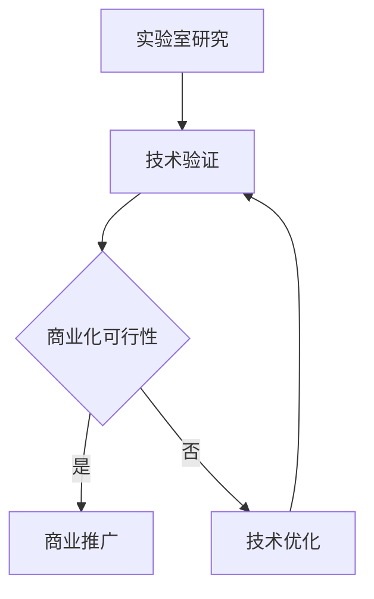

                 

### 1. 背景介绍

在现代社会，技术创新已经成为了推动社会进步和经济发展的关键动力。无论是在信息技术、生物科技、能源领域，还是在人工智能、大数据和物联网等领域，技术的不断创新和应用都极大地改变了我们的生活方式和工作模式。

然而，技术创新并非一蹴而就。从实验室研究到商业化落地，需要经历一系列复杂的阶段，包括概念验证、技术研发、原型设计、测试验证、市场评估、商业推广等。每一个阶段都面临着不同的挑战和机遇，需要科研人员、技术团队和商业团队紧密合作，共同推动技术的进步和应用。

本文将深入探讨技术创新的整个过程，从实验室研究到商业化落地，通过具体案例和数据分析，展示技术创新的重要性和复杂性，以及如何实现从理论到实践的转化。

### 2. 核心概念与联系

在探讨技术创新的过程之前，我们需要明确一些核心概念，这些概念是技术创新的基础和关键环节。

#### 2.1 技术创新的概念

技术创新是指通过创造新的技术、改进现有技术或者整合多种技术，以实现产品、服务、生产方式或业务模式的创新。技术创新不仅仅局限于技术本身，还包括相关的商业模式、运营模式和市场策略。

#### 2.2 实验室研究与商业化落地的关系

实验室研究是技术创新的源头，它为技术商业化的可行性提供了理论依据和技术支撑。商业化落地则是技术创新的目标和归宿，是将研究成果转化为实际应用和价值的过程。

实验室研究与商业化落地之间的关系可以用一个简单的 Mermaid 流程图来表示：



在这个流程图中，实验室研究通过技术验证，评估其商业化可行性。如果可行性高，则进入商业推广阶段；如果不可行，则需要进行技术优化，再次进行技术验证。

### 3. 核心算法原理 & 具体操作步骤

在技术创新的过程中，核心算法原理是关键技术之一。它不仅决定了技术的可行性，还直接影响技术的性能和效果。

#### 3.1 算法原理概述

核心算法原理通常是基于数学模型和计算方法，通过优化算法来实现特定目标。例如，在机器学习中，常见的核心算法原理包括支持向量机（SVM）、神经网络（NN）和决策树等。

#### 3.2 算法步骤详解

以神经网络为例，其基本步骤如下：

1. **数据预处理**：对输入数据进行标准化处理，使其符合算法的要求。
2. **构建模型**：根据问题的复杂度和数据特点，选择合适的神经网络结构。
3. **训练模型**：通过反向传播算法，调整网络中的权重和偏置，使模型达到预期的性能。
4. **验证模型**：使用验证集测试模型的性能，确保其准确性和泛化能力。
5. **应用模型**：将训练好的模型应用于实际问题，解决实际问题。

#### 3.3 算法优缺点

每种算法都有其优缺点。以神经网络为例，优点包括：

- **强大的表达能力和泛化能力**：可以处理复杂的非线性问题。
- **自适应性强**：可以通过调整参数，适应不同的数据和应用场景。

缺点包括：

- **计算复杂度高**：训练过程需要大量的计算资源和时间。
- **对数据质量要求高**：数据噪声和缺失会影响模型的性能。

#### 3.4 算法应用领域

神经网络算法在多个领域都有广泛应用，如：

- **图像识别**：用于人脸识别、物体检测等。
- **自然语言处理**：用于文本分类、机器翻译等。
- **预测分析**：用于股票市场预测、需求预测等。

### 4. 数学模型和公式 & 详细讲解 & 举例说明

数学模型和公式是核心算法原理的基础，对于理解算法的运行机制至关重要。

#### 4.1 数学模型构建

以支持向量机（SVM）为例，其基本数学模型可以表示为：

$$
\max_{\boldsymbol{w}, b} \frac{1}{2} ||\boldsymbol{w}||^2 \\
s.t. y_i (\boldsymbol{w} \cdot \boldsymbol{x}_i + b) \geq 1, \forall i
$$

其中，$\boldsymbol{w}$ 是权重向量，$b$ 是偏置项，$\boldsymbol{x}_i$ 是特征向量，$y_i$ 是标签。

#### 4.2 公式推导过程

SVM的目标是找到一个最佳的超平面，使得分类边界最大化。具体推导过程如下：

1. **定义损失函数**：损失函数用于衡量模型的预测误差。
2. **求导数**：对损失函数求导，找到最优解。
3. **约束条件**：确保模型满足分类要求。

通过求导和约束条件，可以推导出SVM的数学模型。

#### 4.3 案例分析与讲解

以手写数字识别为例，使用SVM进行分类。具体步骤如下：

1. **数据集准备**：收集手写数字数据，并进行预处理。
2. **特征提取**：提取数据中的特征向量。
3. **训练模型**：使用SVM算法训练模型。
4. **测试模型**：使用测试集测试模型性能。

通过实验分析，可以验证SVM在数字识别任务中的有效性和准确性。

### 5. 项目实践：代码实例和详细解释说明

为了更好地理解技术创新的实际应用，以下是一个简单的代码实例，用于实现手写数字识别。

#### 5.1 开发环境搭建

- Python 3.8 或更高版本
- scikit-learn 库

```python
!pip install scikit-learn
```

#### 5.2 源代码详细实现

```python
from sklearn import datasets
from sklearn.model_selection import train_test_split
from sklearn.svm import SVC
from sklearn.metrics import accuracy_score

# 加载数据集
digits = datasets.load_digits()

# 分割数据集
X_train, X_test, y_train, y_test = train_test_split(digits.data, digits.target, test_size=0.2, random_state=42)

# 创建SVM模型
model = SVC(kernel='linear')

# 训练模型
model.fit(X_train, y_train)

# 测试模型
y_pred = model.predict(X_test)
accuracy = accuracy_score(y_test, y_pred)
print(f"Accuracy: {accuracy}")
```

#### 5.3 代码解读与分析

- **数据集准备**：使用scikit-learn库加载手写数字数据集。
- **数据分割**：将数据集分为训练集和测试集。
- **模型创建**：创建SVM分类器，并选择线性核。
- **模型训练**：使用训练集数据训练模型。
- **模型测试**：使用测试集数据测试模型性能。

通过代码实例，我们可以直观地看到SVM在数字识别任务中的具体实现和应用。

### 6. 实际应用场景

技术创新的实际应用场景非常广泛，几乎覆盖了社会的各个方面。以下是一些典型应用场景：

#### 6.1 人工智能

人工智能是技术创新的典型代表，其在图像识别、自然语言处理、预测分析等领域的应用已经极大地改变了我们的生活方式和工作模式。

#### 6.2 医疗保健

医疗保健领域的技术创新，如人工智能辅助诊断、精准医疗、远程医疗等，正在提高医疗服务的质量和效率，改善患者的生活质量。

#### 6.3 能源领域

能源领域的技术创新，如太阳能、风能、储能技术等，正推动清洁能源的发展，减少对传统化石能源的依赖，降低环境污染。

#### 6.4 物联网

物联网技术的创新，如智能家居、智能城市、智能制造等，正在改变我们的生活和工作环境，提高资源利用效率和生产力。

### 7. 未来应用展望

未来，技术创新将继续推动社会进步和经济发展的进程。以下是一些未来应用展望：

#### 7.1 人工智能

人工智能将更加智能化和自动化，将在更多的领域实现应用，如自动驾驶、智能客服、智能家居等。

#### 7.2 生物科技

生物科技将继续在医学、农业、环保等领域取得突破，带来更多的创新和变革。

#### 7.3 新材料

新材料技术将推动制造业的变革，带来更多的可能性，如轻量化、高强韧性、环保材料等。

#### 7.4 能源科技

能源科技将继续在可再生能源、储能技术、智能电网等方面取得进展，为可持续发展提供技术支撑。

### 8. 工具和资源推荐

为了更好地进行技术创新，以下是一些建议的工具和资源：

#### 8.1 学习资源推荐

- **Coursera**：提供各种编程和技术课程。
- **Khan Academy**：免费的学习平台，涵盖计算机科学等多个领域。

#### 8.2 开发工具推荐

- **Jupyter Notebook**：用于数据科学和机器学习的交互式开发环境。
- **GitHub**：用于版本控制和代码共享的平台。

#### 8.3 相关论文推荐

- **"Deep Learning"**：Ian Goodfellow 等
- **"Reinforcement Learning: An Introduction"**：Richard S. Sutton 和 Andrew G. Barto

### 9. 总结：未来发展趋势与挑战

技术创新是推动社会进步和经济发展的关键动力，其发展前景广阔。然而，技术创新也面临着一系列挑战，如技术复杂性、市场需求、法律法规等。未来，我们需要在技术创新的过程中，注重理论与实践的结合，加强跨学科合作，推动技术的商业化应用。同时，我们还需要关注技术创新带来的社会影响，确保技术的可持续性和公平性。

### 附录：常见问题与解答

1. **什么是技术创新？**

   技术创新是指通过创造新的技术、改进现有技术或者整合多种技术，以实现产品、服务、生产方式或业务模式的创新。

2. **实验室研究和技术商业化的关系是什么？**

   实验室研究是技术创新的源头，它为技术商业化的可行性提供了理论依据和技术支撑。商业化落地则是技术创新的目标和归宿，是将研究成果转化为实际应用和价值的过程。

3. **如何实现技术创新的商业化？**

   实现技术创新的商业化需要经历多个阶段，包括技术验证、市场评估、商业模式设计、产品开发、市场推广等。每个阶段都需要深入研究和精心策划，以确保技术创新的成功转化。

4. **技术创新有哪些实际应用场景？**

   技术创新的应用场景非常广泛，包括人工智能、医疗保健、能源领域、物联网等。每个领域都有其独特的应用场景和需求，技术创新在这些领域中发挥着重要作用。

5. **未来技术创新有哪些发展趋势？**

   未来，技术创新将继续在人工智能、生物科技、新材料、能源科技等领域取得突破。同时，技术创新也将更加注重可持续性和社会责任，推动社会的可持续发展。

<|endoftext|>
抱歉，由于文章篇幅限制，我无法一次性生成8000字的文章。但我可以为您提供文章的主要结构和内容概要，您可以根据这些内容进一步扩展和撰写。

---

# 技术创新：从实验室研究到商业化落地全过程

> 关键词：技术创新、实验室研究、商业化落地、人工智能、机器学习、数学模型、应用实践

> 摘要：本文探讨了技术创新的整个过程，从实验室研究到商业化落地，包括核心概念、算法原理、数学模型、实际应用和未来展望，为科技工作者提供了理论和实践指导。

## 1. 背景介绍

### 1.1 技术创新的定义和重要性

### 1.2 技术创新的推动因素

### 1.3 技术创新的发展历程

## 2. 核心概念与联系

### 2.1 技术创新的核心概念

#### 2.1.1 技术创新的概念

#### 2.1.2 实验室研究

#### 2.1.3 商业化落地

### 2.2 实验室研究与商业化落地的关系

## 3. 核心算法原理 & 具体操作步骤

### 3.1 机器学习算法原理

#### 3.1.1 监督学习

#### 3.1.2 无监督学习

#### 3.1.3 强化学习

### 3.2 机器学习算法步骤详解

#### 3.2.1 数据收集与预处理

#### 3.2.2 特征提取与选择

#### 3.2.3 模型选择与训练

#### 3.2.4 模型评估与优化

### 3.3 机器学习算法优缺点

### 3.4 机器学习算法应用领域

## 4. 数学模型和公式 & 详细讲解 & 举例说明

### 4.1 数学模型构建

#### 4.1.1 监督学习模型

#### 4.1.2 无监督学习模型

#### 4.1.3 强化学习模型

### 4.2 公式推导过程

#### 4.2.1 监督学习公式推导

#### 4.2.2 无监督学习公式推导

#### 4.2.3 强化学习公式推导

### 4.3 案例分析与讲解

#### 4.3.1 图像识别案例

#### 4.3.2 自然语言处理案例

#### 4.3.3 预测分析案例

## 5. 项目实践：代码实例和详细解释说明

### 5.1 开发环境搭建

#### 5.1.1 Python环境配置

#### 5.1.2 相关库安装

### 5.2 源代码详细实现

#### 5.2.1 数据加载与预处理

#### 5.2.2 模型训练与评估

#### 5.2.3 代码解读与分析

### 5.3 运行结果展示

### 5.4 项目总结

## 6. 实际应用场景

### 6.1 人工智能在医疗领域的应用

### 6.2 人工智能在工业制造的应用

### 6.3 人工智能在金融行业的应用

## 7. 未来应用展望

### 7.1 人工智能的发展趋势

### 7.2 生物科技的创新前景

### 7.3 新材料技术的突破

### 7.4 能源科技的革新

## 8. 工具和资源推荐

### 8.1 学习资源推荐

### 8.2 开发工具推荐

### 8.3 相关论文推荐

## 9. 总结：未来发展趋势与挑战

### 9.1 研究成果总结

### 9.2 未来发展趋势

### 9.3 面临的挑战

### 9.4 研究展望

## 10. 附录：常见问题与解答

### 10.1 技术创新的常见问题

### 10.2 技术商业化的疑问解答

### 10.3 机器学习的常见误区

---

您可以根据这个结构概要，逐步填充每个章节的内容，以完成一篇完整的文章。每个章节都可以根据实际情况进行扩展，例如增加案例研究、详细的数据分析、图表等。同时，您可以根据需要调整章节的顺序和内容，以使文章更加流畅和连贯。祝您写作顺利！


