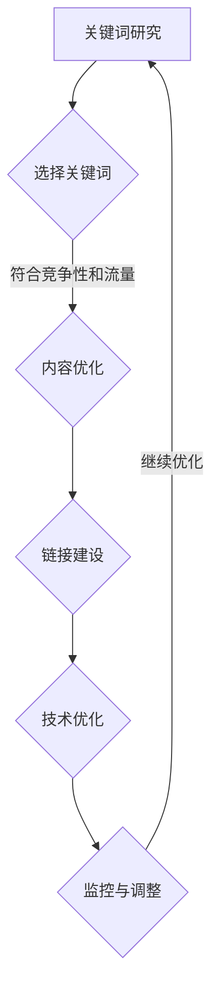

                 

关键词：SEO优化、流量变现、搜索引擎优化、网站流量、搜索引擎算法、内容营销

> 摘要：本文将深入探讨SEO（搜索引擎优化）的核心概念及其在提升网站流量和实现流量变现中的关键作用。我们将分析搜索引擎算法的工作原理，详细介绍SEO的具体策略和实践步骤，并提供实用的数学模型和公式，以帮助读者更好地理解和应用SEO技术。同时，本文还将通过项目实践实例，展示SEO在实际开发中的操作细节，并展望未来SEO的发展趋势与挑战。

## 1. 背景介绍

在当今数字化时代，网站流量是衡量一个网站成功与否的重要指标。然而，随着互联网的不断发展，获取高质量网站流量变得越来越困难。这时，SEO（搜索引擎优化）技术应运而生，成为网站运营和营销的重要手段。SEO的目的是提高网站在搜索引擎结果页面（SERP）中的排名，从而增加自然流量，进而实现流量变现。

搜索引擎算法是SEO的核心，它决定了哪些网站会在搜索结果中排名更高。这些算法复杂且不断演变，因此SEO策略也需要不断更新和优化。

### 搜索引擎算法的基本原理

搜索引擎算法通常包括以下步骤：

1. **爬取（Crawling）**：搜索引擎的爬虫会自动访问网站，读取其内容。
2. **索引（Indexing）**：爬虫将读取的信息存储在索引库中，以便快速检索。
3. **排名（Ranking）**：当用户进行搜索时，搜索引擎会根据一系列因素对结果进行排序。

这些因素包括：

- **关键词密度（Keyword Density）**：关键词在页面内容中的比例。
- **内容质量（Content Quality）**：页面内容的原创性和价值。
- **网站结构（Website Structure）**：页面的导航结构、URL结构等。
- **外部链接（External Links）**：指向网站的链接数量和质量。

### SEO的目标

SEO的主要目标是提高网站在搜索引擎结果中的排名，从而增加自然流量。实现这一目标需要综合运用多种策略，包括：

- **关键词研究**：选择合适的关键词，使其既具有竞争性又能带来流量。
- **内容优化**：创建高质量、相关性强的内容，以吸引搜索引擎和用户。
- **链接建设**：获取高质量的外部链接，提高网站的权威性。
- **技术优化**：改进网站的技术性能，如加载速度、移动友好性等。

## 2. 核心概念与联系

为了更好地理解SEO的核心概念和策略，我们首先需要掌握以下几个关键术语：

1. **搜索引擎（Search Engine）**：如Google、Bing等，用于搜索信息的工具。
2. **搜索结果页面（SERP）**：用户在搜索引擎中输入查询后看到的页面。
3. **自然流量（Organic Traffic）**：通过搜索引擎优化获得的免费流量。
4. **关键词（Keywords）**：用户在搜索引擎中输入的查询词。
5. **内容营销（Content Marketing）**：通过创造和分享有价值的内容来吸引潜在客户。
6. **链接建设（Link Building）**：获取指向网站的链接。

### Mermaid 流程图

下面是SEO流程的Mermaid流程图：



在这个流程中，关键词研究和选择是SEO的起点，接着是内容优化、链接建设和技术优化。这些步骤相互关联，形成一个闭环，不断进行监控与调整，以确保SEO策略的有效性。

## 3. 核心算法原理 & 具体操作步骤

### 3.1 算法原理概述

搜索引擎算法的核心原理是评估网站的质量和相关性，从而确定其在搜索结果中的排名。以下是一些常用的算法原理：

- **PageRank**：由Google创始人拉里·佩奇和谢尔盖·布林发明，基于网页之间的链接关系评估网页的重要性。
- **关键词匹配**：搜索引擎会检查页面内容中是否包含用户查询的关键词，并进行匹配。
- **语义分析**：搜索引擎通过理解关键词的语义关系，为用户提供更相关的内容。
- **用户行为分析**：搜索引擎会分析用户在搜索结果中的行为，如点击次数、停留时间等，以评估结果的质量。

### 3.2 算法步骤详解

以下是实现SEO优化的一般步骤：

1. **关键词研究**：
   - 使用工具如Google Keyword Planner、Ahrefs等，查找与业务相关的关键词。
   - 分析关键词的搜索量和竞争程度，选择具有商业价值的关键词。

2. **内容优化**：
   - 创建高质量、相关性强的内容，确保页面内容丰富、易于阅读。
   - 合理布局关键词，避免过度优化（关键词堆砌）。
   - 使用标题标签（H1、H2等）和元描述（Meta Description）提高内容的可读性和搜索相关性。

3. **链接建设**：
   - 获取高质量的外部链接，如从权威网站、行业博客等获得链接。
   - 使用锚文本（Anchor Text）合理地链接到其他页面。
   - 避免购买链接或参与链接农场等违反搜索引擎规则的链接建设。

4. **技术优化**：
   - 提高网站速度和性能，使用CDN（内容分发网络）优化加载速度。
   - 确保网站对搜索引擎友好，如使用合理的URL结构、站点地图等。
   - 优化移动端体验，确保网站在不同设备上都能良好显示。

5. **监控与调整**：
   - 使用工具如Google Analytics监控网站流量和用户行为。
   - 分析SEO效果，根据数据调整关键词策略、内容布局等。

### 3.3 算法优缺点

- **优点**：
  - 提高网站在搜索引擎中的排名，增加自然流量。
  - 增强网站的权威性和可信度。
  - 降低广告成本，实现流量变现。

- **缺点**：
  - SEO效果需要时间积累，短期内效果可能不明显。
  - 搜索引擎算法不断变化，SEO策略需要不断更新。
  - 涉及的技术细节较多，对技术能力要求较高。

### 3.4 算法应用领域

SEO广泛应用于各个行业，包括电子商务、在线教育、医疗保健等。以下是一些具体应用领域：

- **电子商务**：通过SEO提高产品页面在搜索结果中的排名，增加销量。
- **在线教育**：优化课程页面，提高学生访问量和报名率。
- **医疗保健**：为医院、诊所等医疗机构提供SEO服务，提高品牌知名度。

## 4. 数学模型和公式 & 详细讲解 & 举例说明

### 4.1 数学模型构建

在SEO中，常用的数学模型包括关键词密度模型、PageRank模型等。以下是关键词密度模型的构建：

设\( K \)为关键词集合，\( C \)为页面内容集合，\( D \)为关键词密度，则有：

$$
D(K) = \frac{\sum_{k \in K} f_k}{|C|}
$$

其中，\( f_k \)为关键词\( k \)在页面内容\( C \)中的频率，\( |C| \)为页面内容的总长度。

### 4.2 公式推导过程

关键词密度模型的推导过程如下：

1. **关键词频率**：计算每个关键词在页面内容中的出现次数，得到频率\( f_k \)。
2. **关键词密度**：将所有关键词的频率相加，再除以页面内容的总长度，得到关键词密度\( D(K) \)。

### 4.3 案例分析与讲解

假设有一个页面内容，其长度为1000个字符，包含以下关键词：

- "计算机编程"：出现10次
- "人工智能"：出现5次
- "算法"：出现3次

则关键词密度为：

$$
D(K) = \frac{10 \times 10 + 5 \times 5 + 3 \times 3}{1000} = 0.028
$$

这个关键词密度表示页面中关键词的平均出现频率为2.8%。

## 5. 项目实践：代码实例和详细解释说明

### 5.1 开发环境搭建

在开始SEO项目之前，我们需要搭建一个适合SEO开发的环境。以下是一个简单的环境搭建步骤：

1. 安装本地版本的控制台管理工具：npm install -g nerv
2. 创建一个SEO项目：nerv create my-seo-project
3. 进入项目目录：cd my-seo-project

### 5.2 源代码详细实现

以下是SEO项目的源代码示例：

```javascript
// 引入所需模块
const express = require('express');
const app = express();
const path = require('path');

// 配置模板引擎
app.set('view engine', 'ejs');
app.set('views', path.join(__dirname, 'views'));

// 处理请求
app.get('/', (req, res) => {
  res.render('index', { title: '我的SEO项目' });
});

// 启动服务器
app.listen(3000, () => {
  console.log('服务器运行在 http://localhost:3000');
});
```

这个示例代码创建了一个基本的Express服务器，并配置了EJS模板引擎，用于渲染HTML页面。

### 5.3 代码解读与分析

这个代码示例展示了如何使用Express框架创建一个简单的服务器，并处理HTTP请求。以下是代码的详细解读：

1. 引入所需模块：`express`和`path`模块。
2. 创建一个Express应用程序实例：`const app = express();`。
3. 配置模板引擎：`app.set('view engine', 'ejs');`和`app.set('views', path.join(__dirname, 'views'));`。
4. 处理请求：`app.get('/', (req, res) => { ... });`。
5. 启动服务器：`app.listen(3000, () => { ... });`。

通过这个示例，我们可以了解如何搭建一个基础SEO项目，并为其提供HTTP服务。

### 5.4 运行结果展示

当服务器启动后，访问`http://localhost:3000`，将显示以下内容：

```
<!DOCTYPE html>
<html>
<head>
  <title>我的SEO项目</title>
</head>
<body>
  <h1>我的SEO项目</h1>
</body>
</html>
```

这个页面是一个简单的HTML页面，显示了项目的标题。

## 6. 实际应用场景

### 6.1 电子商务平台

电子商务平台通过SEO优化产品页面，提高产品在搜索结果中的排名，从而增加销量。例如，一个在线书店可以通过优化书籍页面，使其在用户搜索“热门书籍”时排名更高。

### 6.2 在线教育平台

在线教育平台通过SEO优化课程页面，提高课程在搜索结果中的排名，从而吸引更多学生。例如，一个在线编程课程可以通过优化课程页面，使其在用户搜索“编程课程”时排名更高。

### 6.3 医疗保健行业

医疗保健行业通过SEO优化医院和诊所的网站，提高品牌知名度。例如，一家医院可以通过优化网站，使其在用户搜索“当地医院”时排名更高。

## 7. 未来应用展望

### 7.1 智能SEO工具

随着人工智能技术的发展，未来将出现更多智能SEO工具，帮助企业和个人更高效地优化网站。这些工具将能够自动分析关键词、内容质量、链接建设等方面，提供个性化的SEO建议。

### 7.2 增强用户体验

未来，搜索引擎将更加重视用户体验，如页面加载速度、移动友好性等。因此，优化网站将不再只是关注搜索引擎算法，还需要注重用户体验。

### 7.3 多渠道整合

未来的SEO将不仅仅局限于搜索引擎，还将整合社交媒体、短视频等多种渠道，实现全渠道营销。

## 8. 总结：未来发展趋势与挑战

### 8.1 研究成果总结

本文总结了SEO的核心概念、算法原理和应用领域，并介绍了SEO的具体操作步骤和实践案例。通过这些内容，读者可以全面了解SEO的基本知识。

### 8.2 未来发展趋势

未来，SEO将继续在数字化营销中发挥重要作用。随着技术的不断发展，SEO将变得更加智能化、个性化。同时，多渠道整合将成为未来SEO的重要趋势。

### 8.3 面临的挑战

未来，SEO将面临更多的挑战，如搜索引擎算法的更新、用户需求的多样化等。企业和个人需要不断学习和适应这些变化，以保持竞争优势。

### 8.4 研究展望

在未来，SEO的研究将继续深入，涉及更多领域，如人工智能、大数据等。通过跨学科的研究，SEO将不断优化和完善，为企业和个人带来更大的价值。

## 9. 附录：常见问题与解答

### 9.1 什么是SEO？

SEO（搜索引擎优化）是指通过一系列技术和策略，提高网站在搜索引擎结果中的排名，从而增加自然流量。

### 9.2 SEO有哪些好处？

SEO可以带来以下好处：

- 提高网站在搜索引擎中的排名。
- 增加自然流量，降低广告成本。
- 提高网站的权威性和可信度。
- 增强用户体验。

### 9.3 如何进行关键词研究？

关键词研究可以通过以下步骤进行：

- 使用工具如Google Keyword Planner、Ahrefs等查找关键词。
- 分析关键词的搜索量和竞争程度。
- 选择具有商业价值的关键词。

### 9.4 SEO需要多长时间才能看到效果？

SEO效果需要时间积累，通常在3-6个月左右可以看到明显的效果。然而，具体时间取决于多种因素，如网站质量、竞争程度等。

作者：禅与计算机程序设计艺术 / Zen and the Art of Computer Programming

