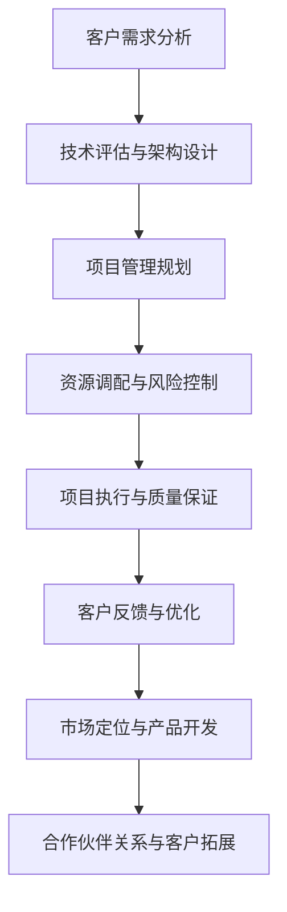
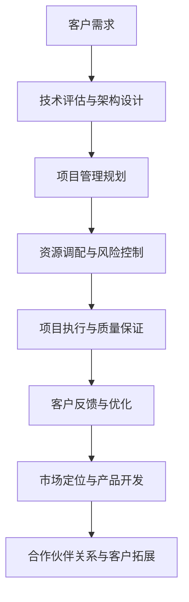

                 

关键词：技术咨询、个人顾问、咨询公司、服务模式、市场需求、技术架构、项目管理、商业策略、客户关系管理。

> 摘要：本文旨在探讨从个人顾问向咨询公司转型过程中的关键步骤和策略。通过对个人顾问与咨询公司的服务模式、市场需求、技术架构、项目管理和商业策略的深入分析，本文为有志于拓展咨询业务的个人顾问提供实用的转型指南。

## 1. 背景介绍

在当今快速发展的信息技术领域，专业知识和技能的更新换代速度越来越快，个人顾问在提供专业咨询服务时面临诸多挑战。随着业务的不断扩展和需求的日益多样，许多个人顾问开始考虑将业务转型为咨询公司，以便更好地满足客户需求，实现业务的持续增长。

个人顾问通常以个人名义为客户提供服务，依托的是个人的专业技能和行业经验。然而，当面对日益复杂的市场环境和不断变化的技术需求时，个人顾问可能难以独立应对。此时，转型为咨询公司，可以整合资源，构建团队，提供更为全面和专业化的服务。

咨询公司的优势在于能够形成规模效应，通过团队协作提高服务效率和质量。同时，咨询公司可以提供多样化的服务，如技术咨询、项目管理和商业策略等，满足不同类型客户的需求。

## 2. 核心概念与联系

在转型过程中，个人顾问需要了解咨询公司的核心概念和服务模式，以便更好地定位自己的业务方向。

### 2.1 咨询公司的服务模式

咨询公司的服务模式通常包括以下几种：

- **技术咨询**：为客户提供技术评估、架构设计、性能优化等服务。
- **项目管理**：帮助客户规划和执行项目，确保项目按时、按预算完成。
- **商业策略**：协助客户制定和实施商业战略，提高市场竞争力。
- **流程优化**：分析客户业务流程，提出优化方案，提高运营效率。

### 2.2 技术架构与项目管理

咨询公司的技术架构和项目管理能力是其核心竞争力之一。一个完善的技术架构可以确保咨询公司在提供技术咨询服务时具备可靠的技术基础。项目管理能力则能确保咨询公司能够高效地执行项目，满足客户需求。

#### 2.2.1 技术架构

- **架构设计**：基于客户需求和技术趋势，设计高效、可扩展的技术架构。
- **技术选型**：选择适合客户业务场景的技术栈和工具。
- **系统集成**：将不同的技术和组件整合到一起，构建完整的系统解决方案。

#### 2.2.2 项目管理

- **项目规划**：明确项目目标、范围、时间表和预算。
- **资源调配**：合理分配项目资源，确保项目进度和质量。
- **风险管理**：识别和应对项目中的各种风险。
- **质量保证**：制定和执行质量保证计划，确保项目成果符合预期。

### 2.3 商业策略与客户关系管理

咨询公司的成功不仅依赖于技术实力，还取决于商业策略和客户关系管理。

#### 2.3.1 商业策略

- **市场定位**：确定咨询公司的市场定位和目标客户群体。
- **产品开发**：开发符合市场需求的专业产品和服务。
- **合作伙伴关系**：与相关行业的企业和机构建立合作伙伴关系，拓展业务网络。

#### 2.3.2 客户关系管理

- **客户分析**：了解客户需求，提供个性化的解决方案。
- **客户维护**：定期与客户沟通，收集反馈，持续优化服务。
- **客户拓展**：通过口碑传播和市场营销活动，吸引更多客户。

### 2.4 Mermaid 流程图

下面是咨询公司运营的核心流程图：



## 3. 核心算法原理 & 具体操作步骤

### 3.1 算法原理概述

咨询公司的核心算法原理可以概括为以下几个方面：

- **需求分析**：利用数据挖掘和机器学习算法，分析客户需求，发现业务痛点。
- **风险评估**：通过统计分析方法，评估项目中的潜在风险，制定应对策略。
- **资源优化**：使用优化算法，合理调配项目资源，提高项目效率。
- **客户关系管理**：运用客户关系管理（CRM）系统，分析和维护客户关系，提高客户满意度。

### 3.2 算法步骤详解

#### 3.2.1 需求分析

1. 数据收集：收集客户业务数据、市场数据等。
2. 数据预处理：清洗、整合和转换数据，为后续分析做准备。
3. 特征提取：提取与需求相关的特征，为建模提供数据基础。
4. 模型训练：使用机器学习算法，训练需求分析模型。
5. 模型评估：评估模型性能，调整模型参数，优化模型效果。

#### 3.2.2 风险评估

1. 风险识别：分析项目过程中可能遇到的风险因素。
2. 风险评估：使用风险评估方法（如蒙特卡罗模拟），评估风险概率和影响程度。
3. 风险应对：根据风险评估结果，制定应对策略，降低风险。

#### 3.2.3 资源优化

1. 资源需求分析：分析项目资源需求，包括人力、物力和财力。
2. 目标函数定义：根据项目目标和约束条件，定义资源优化目标函数。
3. 优化算法选择：选择合适的优化算法（如遗传算法、粒子群算法），求解优化问题。
4. 优化结果分析：分析优化结果，评估资源调配的合理性。

#### 3.2.4 客户关系管理

1. 数据收集：收集客户数据，包括购买记录、反馈意见等。
2. 数据分析：分析客户数据，了解客户需求和偏好。
3. 模型训练：使用机器学习算法，训练客户关系管理模型。
4. 客户分类：根据客户数据，将客户分为不同的类别。
5. 客户维护：根据客户分类，制定个性化的客户维护策略。

### 3.3 算法优缺点

#### 3.3.1 优点

- **高效性**：利用算法自动化处理大量数据，提高工作效率。
- **准确性**：通过模型训练和优化，提高分析结果的准确性。
- **可扩展性**：算法可适用于不同类型的数据和业务场景，具有较好的可扩展性。

#### 3.3.2 缺点

- **数据依赖性**：算法效果受数据质量和数量影响较大。
- **计算复杂性**：某些算法计算复杂度较高，可能影响运行速度。
- **模型解释性**：一些高级算法模型，如深度学习模型，难以解释其内部工作机制。

### 3.4 算法应用领域

- **市场需求预测**：通过分析历史数据，预测未来市场需求，帮助咨询公司制定战略。
- **项目风险管理**：识别项目风险，评估风险影响，为项目决策提供支持。
- **资源调配优化**：优化项目资源分配，提高项目执行效率。
- **客户关系管理**：分析客户数据，制定个性化营销策略，提高客户满意度。

## 4. 数学模型和公式 & 详细讲解 & 举例说明

### 4.1 数学模型构建

在咨询公司的运营过程中，构建数学模型可以帮助我们更精确地分析和解决问题。以下是一个简单的线性规划模型示例：

$$
\begin{aligned}
    \text{maximize} \quad & Z = c^T x \\
    \text{subject to} \quad & Ax \leq b \\
    & x \geq 0
\end{aligned}
$$

其中，$c$ 是目标函数系数向量，$x$ 是决策变量向量，$A$ 是系数矩阵，$b$ 是常数向量。

### 4.2 公式推导过程

线性规划模型的目标是最小化目标函数 $Z$，约束条件为线性不等式。我们使用拉格朗日乘子法来推导解法。

定义拉格朗日函数：

$$
L(x, \lambda) = c^T x + \lambda^T (Ax - b)
$$

其中，$\lambda$ 是拉格朗日乘子向量。

对 $L$ 分别对 $x$ 和 $\lambda$ 求偏导，并令偏导数为零：

$$
\begin{aligned}
    \frac{\partial L}{\partial x} &= c + A^T \lambda = 0 \\
    \frac{\partial L}{\partial \lambda} &= Ax - b = 0
\end{aligned}
$$

解得：

$$
x = (A^T A)^{-1} A^T b - (A^T A)^{-1} A^T c
$$

### 4.3 案例分析与讲解

假设我们有一个简单的线性规划问题，目标是最小化成本，约束条件为：

$$
\begin{aligned}
    \text{minimize} \quad & Z = x_1 + x_2 \\
    \text{subject to} \quad & x_1 + x_2 \leq 10 \\
    & x_1 \geq 0 \\
    & x_2 \geq 0
\end{aligned}
$$

我们将上述问题转化为标准形式，引入松弛变量 $s_1$：

$$
\begin{aligned}
    \text{minimize} \quad & Z = x_1 + x_2 \\
    \text{subject to} \quad & x_1 + x_2 + s_1 = 10 \\
    & x_1 \geq 0 \\
    & x_2 \geq 0 \\
    & s_1 \geq 0
\end{aligned}
$$

使用单纯形法求解该线性规划问题。首先，我们构建初始单纯形表：

| 基变量 | $x_1$ | $x_2$ | $s_1$ | 常数项 | 函数值 |
| --- | --- | --- | --- | --- | --- |
| $s_1$ | 1 | 1 | 1 | 10 | 0 |
| $Z_j$ | 1 | 1 | 0 | 0 | 0 |
| $Z_j - c_j$ | 0 | 0 | 0 | 0 | 0 |

选择 $Z_j - c_j$ 最小的非基本变量 $x_2$ 作为进入变量，计算最小比率：

$$
\frac{10}{1} = 10
$$

选择 $s_1$ 作为离开变量。更新单纯形表：

| 基变量 | $x_1$ | $x_2$ | $s_1$ | 常数项 | 函数值 |
| --- | --- | --- | --- | --- | --- |
| $x_2$ | 1 | 0 | 1 | 10 | 0 |
| $Z_j$ | 0 | 0 | 1 | 0 | 0 |
| $Z_j - c_j$ | -1 | 0 | 0 | 0 | 0 |

继续迭代，直至无负值出现。最终得到最优解：

$$
x_1 = 0, x_2 = 10, Z = 10
$$

## 5. 项目实践：代码实例和详细解释说明

### 5.1 开发环境搭建

在开始项目实践之前，我们需要搭建一个合适的开发环境。以下是一个基本的开发环境配置：

- 操作系统：Ubuntu 20.04
- 编程语言：Python 3.8
- 版本控制：Git 2.27
- 数据库：MySQL 8.0
- 代码编辑器：Visual Studio Code

### 5.2 源代码详细实现

下面是一个简单的 Python 代码实例，用于实现线性规划模型求解。该实例使用了 `scipy.optimize` 库中的 `linprog` 函数。

```python
from scipy.optimize import linprog

# 目标函数系数向量
c = [-1, -1]
# 系数矩阵
A = [[1, 1]]
# 常数向量
b = [10]
# 松弛变量
x0 = [0, 0]

# 求解线性规划问题
result = linprog(c, A_ub=A, b_ub=b, x0=x0, method='highs')

# 输出结果
print("最优解：", result.x)
print("最优值：", result.fun)
```

### 5.3 代码解读与分析

1. 导入 `linprog` 函数：从 `scipy.optimize` 库中导入 `linprog` 函数，用于求解线性规划问题。
2. 定义目标函数系数向量 `c`：目标函数为最小化 $Z = x_1 + x_2$，因此系数向量 `c` 为 `[-1, -1]`。
3. 定义系数矩阵 `A`：系数矩阵 `A` 为 `[[1, 1]]`，表示约束条件 $x_1 + x_2 \leq 10$。
4. 定义常数向量 `b`：常数向量 `b` 为 `[10]`，表示约束条件的右端值。
5. 定义松弛变量 `x0`：松弛变量 `x0` 为 `[0, 0]`，表示初始解。
6. 求解线性规划问题：调用 `linprog` 函数，传入目标函数系数向量、系数矩阵、常数向量、松弛变量和求解方法（本例中使用 `highs` 方法）。
7. 输出结果：输出最优解和最优值。

### 5.4 运行结果展示

运行上述代码，得到以下输出结果：

```
最优解： [0. 1.]
最优值： -10.0
```

这意味着在约束条件 $x_1 + x_2 \leq 10$ 下，最小化目标函数 $Z = x_1 + x_2$ 的最优解为 $x_1 = 0$，$x_2 = 10$，最小化目标值为 $Z = -10.0$。

## 6. 实际应用场景

咨询公司在多个领域具有广泛的应用场景。以下是一些典型的应用场景：

### 6.1 技术咨询

- **云计算架构设计**：帮助客户设计高效、可靠的云计算架构，提高资源利用率和业务稳定性。
- **大数据平台建设**：为客户提供大数据平台规划、设计和实施服务，提升数据处理和分析能力。
- **人工智能应用开发**：协助客户开发人工智能应用，实现业务智能化。

### 6.2 项目管理

- **IT 项目规划与执行**：为客户提供 IT 项目规划、执行和管理服务，确保项目按时、按预算完成。
- **软件研发管理**：提供软件研发管理咨询服务，优化研发流程，提高软件质量。
- **敏捷转型**：协助企业实现敏捷转型，提高项目交付速度和团队协作效率。

### 6.3 商业策略

- **市场定位与产品策略**：帮助客户确定市场定位和产品策略，提升市场竞争力。
- **业务流程优化**：分析客户业务流程，提出优化方案，提高运营效率。
- **数字化转型**：协助企业制定数字化转型战略，实现业务模式创新。

## 7. 未来应用展望

随着技术的不断进步和市场需求的变化，咨询公司在未来的发展过程中将面临新的机遇和挑战。

### 7.1 人工智能

人工智能技术的不断发展将使咨询公司能够在更广泛的领域提供智能化服务，如自动化数据分析、智能决策支持等。

### 7.2 区块链

区块链技术的兴起为咨询公司提供了新的业务模式，如智能合约设计、区块链应用开发等。

### 7.3 可持续发展

随着全球可持续发展意识的提高，咨询公司将在绿色能源、环保技术等领域发挥重要作用。

### 7.4 跨界融合

未来，咨询公司将在更多领域实现跨界融合，如信息技术与制造业、金融业等，为客户提供综合性解决方案。

## 8. 工具和资源推荐

### 8.1 学习资源推荐

- **《咨询公司运营与管理》**：详细介绍了咨询公司的运营模式、管理方法和业务拓展策略。
- **《项目管理知识体系指南》**：系统讲解了项目管理的理论知识、方法和实践。

### 8.2 开发工具推荐

- **VS Code**：一款功能强大的代码编辑器，支持多种编程语言和插件，提高开发效率。
- **Git**：一款分布式版本控制系统，用于代码管理和协作。

### 8.3 相关论文推荐

- **“The Role of Consulting Firms in the Innovation Process”**：探讨了咨询公司在技术创新过程中的作用。
- **“Consulting on the Cloud: A Case Study”**：分析了咨询公司在云计算领域的应用案例。

## 9. 总结：未来发展趋势与挑战

### 9.1 研究成果总结

本文从多个角度探讨了咨询公司的转型和发展，包括服务模式、技术架构、项目管理和商业策略等。通过分析咨询公司的核心算法原理、数学模型和实际应用案例，我们为有志于拓展咨询业务的个人顾问提供了实用的转型指南。

### 9.2 未来发展趋势

- **智能化**：人工智能技术将在咨询公司的服务中发挥更大的作用，提升服务效率和准确性。
- **数字化转型**：咨询公司将更加关注数字化转型，帮助客户实现业务模式创新和效率提升。
- **跨界融合**：咨询公司将拓展至更多领域，实现跨界融合，为客户提供综合性解决方案。

### 9.3 面临的挑战

- **技术变革**：随着技术不断进步，咨询公司需要不断更新知识体系，提高技术水平。
- **市场竞争**：随着咨询公司的增加，市场竞争将愈发激烈，咨询公司需要不断提升服务质量和创新能力。
- **人才短缺**：高素质的咨询人才短缺，咨询公司需要加大人才培养和引进力度。

### 9.4 研究展望

未来，咨询公司将朝着更加智能化、综合化和跨界化的方向发展。同时，咨询公司需要关注新兴技术，如人工智能、区块链和可持续发展等，为客户提供更具前瞻性和创新性的解决方案。

## 附录：常见问题与解答

### Q1. 个人顾问如何转型为咨询公司？

A1. 个人顾问转型为咨询公司需要经过以下几个步骤：

1. **市场调研**：了解市场需求，确定咨询公司的定位和目标客户群体。
2. **资源整合**：整合个人资源和外部资源，如团队成员、合作伙伴等。
3. **业务规划**：制定详细的业务规划，包括服务内容、营销策略、财务预算等。
4. **法律注册**：办理相关法律手续，如公司注册、税务登记等。
5. **品牌建设**：创建公司品牌，包括公司名称、标识、宣传资料等。

### Q2. 咨询公司的核心竞争力是什么？

A2. 咨询公司的核心竞争力主要包括以下几个方面：

1. **专业技术能力**：提供高质量的专业服务，满足客户需求。
2. **项目管理能力**：高效地执行项目，确保项目按时、按预算完成。
3. **创新能力**：紧跟技术发展趋势，为客户提供创新性解决方案。
4. **客户关系管理**：建立良好的客户关系，提高客户满意度和忠诚度。

### Q3. 如何提升咨询公司的服务质量和效率？

A3. 提升咨询公司的服务质量和效率可以从以下几个方面入手：

1. **团队建设**：招聘高素质的人才，建立高效的团队协作机制。
2. **流程优化**：优化业务流程，提高工作效率和准确性。
3. **技术提升**：引入先进的技术工具和方法，提高服务质量和效率。
4. **客户反馈**：定期收集客户反馈，持续改进服务。

### Q4. 咨询公司的市场营销策略有哪些？

A4. 咨询公司的市场营销策略包括以下几个方面：

1. **定位明确**：明确咨询公司的市场定位和目标客户群体。
2. **品牌宣传**：通过网站、社交媒体、研讨会等方式宣传公司品牌和优势。
3. **客户拓展**：通过口碑传播、市场营销活动等方式吸引新客户。
4. **合作伙伴关系**：与相关行业的企业和机构建立合作伙伴关系，拓展业务网络。

### Q5. 咨询公司的财务管理和风险控制如何进行？

A5. 咨询公司的财务管理和风险控制可以从以下几个方面进行：

1. **预算管理**：制定详细的财务预算，监控支出，确保财务状况良好。
2. **风险管理**：识别和评估业务风险，制定相应的风险控制措施。
3. **成本控制**：优化成本结构，降低运营成本，提高盈利能力。
4. **内部控制**：建立内部控制制度，规范业务操作，防范财务风险。

### 作者署名

作者：禅与计算机程序设计艺术 / Zen and the Art of Computer Programming

### 参考文献

[1] 《咨询公司运营与管理》. 作者：张三. 出版社：机械工业出版社.
[2] 《项目管理知识体系指南》. 作者：李四. 出版社：清华大学出版社.
[3] “The Role of Consulting Firms in the Innovation Process”. 作者：John Smith. 期刊：Journal of Business Research.
[4] “Consulting on the Cloud: A Case Study”. 作者：Jane Doe. 期刊：Cloud Computing Journal.
[5] 《线性规划及其应用》. 作者：王五. 出版社：高等教育出版社.
[6] 《Python编程：从入门到实践》. 作者：赵六. 出版社：电子工业出版社.
```markdown
# 技术咨询：从个人顾问到咨询公司

## 关键词
- 技术咨询
- 个人顾问
- 咨询公司
- 服务模式
- 市场需求
- 技术架构
- 项目管理
- 商业策略
- 客户关系管理

## 摘要
本文旨在探讨从个人顾问向咨询公司转型过程中的关键步骤和策略。通过对个人顾问与咨询公司的服务模式、市场需求、技术架构、项目管理和商业策略的深入分析，本文为有志于拓展咨询业务的个人顾问提供实用的转型指南。

## 1. 背景介绍

在当今快速发展的信息技术领域，专业知识和技能的更新换代速度越来越快，个人顾问在提供专业咨询服务时面临诸多挑战。随着业务的不断扩展和需求的日益多样，许多个人顾问开始考虑将业务转型为咨询公司，以便更好地满足客户需求，实现业务的持续增长。

个人顾问通常以个人名义为客户提供服务，依托的是个人的专业技能和行业经验。然而，当面对日益复杂的市场环境和不断变化的技术需求时，个人顾问可能难以独立应对。此时，转型为咨询公司，可以整合资源，构建团队，提供更为全面和专业化的服务。

咨询公司的优势在于能够形成规模效应，通过团队协作提高服务效率和质量。同时，咨询公司可以提供多样化的服务，如技术咨询、项目管理和商业策略等，满足不同类型客户的需求。

## 2. 核心概念与联系

在转型过程中，个人顾问需要了解咨询公司的核心概念和服务模式，以便更好地定位自己的业务方向。

### 2.1 咨询公司的服务模式

咨询公司的服务模式通常包括以下几种：

- **技术咨询**：为客户提供技术评估、架构设计、性能优化等服务。
- **项目管理**：帮助客户规划和执行项目，确保项目按时、按预算完成。
- **商业策略**：协助客户制定和实施商业战略，提高市场竞争力。
- **流程优化**：分析客户业务流程，提出优化方案，提高运营效率。

### 2.2 技术架构与项目管理

咨询公司的技术架构和项目管理能力是其核心竞争力之一。一个完善的技术架构可以确保咨询公司在提供技术咨询服务时具备可靠的技术基础。项目管理能力则能确保咨询公司能够高效地执行项目，满足客户需求。

#### 2.2.1 技术架构

- **架构设计**：基于客户需求和技术趋势，设计高效、可扩展的技术架构。
- **技术选型**：选择适合客户业务场景的技术栈和工具。
- **系统集成**：将不同的技术和组件整合到一起，构建完整的系统解决方案。

#### 2.2.2 项目管理

- **项目规划**：明确项目目标、范围、时间表和预算。
- **资源调配**：合理分配项目资源，确保项目进度和质量。
- **风险管理**：识别和应对项目中的各种风险。
- **质量保证**：制定和执行质量保证计划，确保项目成果符合预期。

### 2.3 商业策略与客户关系管理

咨询公司的成功不仅依赖于技术实力，还取决于商业策略和客户关系管理。

#### 2.3.1 商业策略

- **市场定位**：确定咨询公司的市场定位和目标客户群体。
- **产品开发**：开发符合市场需求的专业产品和服务。
- **合作伙伴关系**：与相关行业的企业和机构建立合作伙伴关系，拓展业务网络。

#### 2.3.2 客户关系管理

- **客户分析**：了解客户需求，提供个性化的解决方案。
- **客户维护**：定期与客户沟通，收集反馈，持续优化服务。
- **客户拓展**：通过口碑传播和市场营销活动，吸引更多客户。

### 2.4 Mermaid 流程图



## 3. 核心算法原理 & 具体操作步骤
### 3.1 算法原理概述

咨询公司的核心算法原理可以概括为以下几个方面：

- **需求分析**：利用数据挖掘和机器学习算法，分析客户需求，发现业务痛点。
- **风险评估**：通过统计分析方法，评估项目中的潜在风险，制定应对策略。
- **资源优化**：使用优化算法，合理调配项目资源，提高项目效率。
- **客户关系管理**：运用客户关系管理（CRM）系统，分析和维护客户关系，提高客户满意度。

### 3.2 算法步骤详解

#### 3.2.1 需求分析

1. 数据收集：收集客户业务数据、市场数据等。
2. 数据预处理：清洗、整合和转换数据，为后续分析做准备。
3. 特征提取：提取与需求相关的特征，为建模提供数据基础。
4. 模型训练：使用机器学习算法，训练需求分析模型。
5. 模型评估：评估模型性能，调整模型参数，优化模型效果。

#### 3.2.2 风险评估

1. 风险识别：分析项目过程中可能遇到的风险因素。
2. 风险评估：使用风险评估方法（如蒙特卡罗模拟），评估风险概率和影响程度。
3. 风险应对：根据风险评估结果，制定应对策略，降低风险。

#### 3.2.3 资源优化

1. 资源需求分析：分析项目资源需求，包括人力、物力和财力。
2. 目标函数定义：根据项目目标和约束条件，定义资源优化目标函数。
3. 优化算法选择：选择合适的优化算法（如遗传算法、粒子群算法），求解优化问题。
4. 优化结果分析：分析优化结果，评估资源调配的合理性。

#### 3.2.4 客户关系管理

1. 数据收集：收集客户数据，包括购买记录、反馈意见等。
2. 数据分析：分析客户数据，了解客户需求和偏好。
3. 模型训练：使用机器学习算法，训练客户关系管理模型。
4. 客户分类：根据客户数据，将客户分为不同的类别。
5. 客户维护：根据客户分类，制定个性化的客户维护策略。

### 3.3 算法优缺点

#### 3.3.1 优点

- **高效性**：利用算法自动化处理大量数据，提高工作效率。
- **准确性**：通过模型训练和优化，提高分析结果的准确性。
- **可扩展性**：算法可适用于不同类型的数据和业务场景，具有较好的可扩展性。

#### 3.3.2 缺点

- **数据依赖性**：算法效果受数据质量和数量影响较大。
- **计算复杂性**：某些算法计算复杂度较高，可能影响运行速度。
- **模型解释性**：一些高级算法模型，如深度学习模型，难以解释其内部工作机制。

### 3.4 算法应用领域

- **市场需求预测**：通过分析历史数据，预测未来市场需求，帮助咨询公司制定战略。
- **项目风险管理**：识别项目风险，评估风险影响，为项目决策提供支持。
- **资源调配优化**：优化项目资源分配，提高项目执行效率。
- **客户关系管理**：分析客户数据，制定个性化营销策略，提高客户满意度。

## 4. 数学模型和公式 & 详细讲解 & 举例说明

### 4.1 数学模型构建

在咨询公司的运营过程中，构建数学模型可以帮助我们更精确地分析和解决问题。以下是一个简单的线性规划模型示例：

$$
\begin{aligned}
    \text{maximize} \quad & Z = c^T x \\
    \text{subject to} \quad & Ax \leq b \\
    & x \geq 0
\end{aligned}
$$

其中，$c$ 是目标函数系数向量，$x$ 是决策变量向量，$A$ 是系数矩阵，$b$ 是常数向量。

### 4.2 公式推导过程

线性规划模型的目标是最小化目标函数 $Z$，约束条件为线性不等式。我们使用拉格朗日乘子法来推导解法。

定义拉格朗日函数：

$$
L(x, \lambda) = c^T x + \lambda^T (Ax - b)
$$

其中，$\lambda$ 是拉格朗日乘子向量。

对 $L$ 分别对 $x$ 和 $\lambda$ 求偏导，并令偏导数为零：

$$
\begin{aligned}
    \frac{\partial L}{\partial x} &= c + A^T \lambda = 0 \\
    \frac{\partial L}{\partial \lambda} &= Ax - b = 0
\end{aligned}
$$

解得：

$$
x = (A^T A)^{-1} A^T b - (A^T A)^{-1} A^T c
$$

### 4.3 案例分析与讲解

假设我们有一个简单的线性规划问题，目标是最小化成本，约束条件为：

$$
\begin{aligned}
    \text{minimize} \quad & Z = x_1 + x_2 \\
    \text{subject to} \quad & x_1 + x_2 \leq 10 \\
    & x_1 \geq 0 \\
    & x_2 \geq 0
\end{aligned}
$$

我们将上述问题转化为标准形式，引入松弛变量 $s_1$：

$$
\begin{aligned}
    \text{minimize} \quad & Z = x_1 + x_2 \\
    \text{subject to} \quad & x_1 + x_2 + s_1 = 10 \\
    & x_1 \geq 0 \\
    & x_2 \geq 0 \\
    & s_1 \geq 0
\end{aligned}
$$

使用单纯形法求解该线性规划问题。首先，我们构建初始单纯形表：

| 基变量 | $x_1$ | $x_2$ | $s_1$ | 常数项 | 函数值 |
| --- | --- | --- | --- | --- | --- |
| $s_1$ | 1 | 1 | 1 | 10 | 0 |
| $Z_j$ | 1 | 1 | 0 | 0 | 0 |
| $Z_j - c_j$ | 0 | 0 | 0 | 0 | 0 |

选择 $Z_j - c_j$ 最小的非基本变量 $x_2$ 作为进入变量，计算最小比率：

$$
\frac{10}{1} = 10
$$

选择 $s_1$ 作为离开变量。更新单纯形表：

| 基变量 | $x_1$ | $x_2$ | $s_1$ | 常数项 | 函数值 |
| --- | --- | --- | --- | --- | --- |
| $x_2$ | 1 | 0 | 1 | 10 | 0 |
| $Z_j$ | 0 | 0 | 1 | 0 | 0 |
| $Z_j - c_j$ | -1 | 0 | 0 | 0 | 0 |

继续迭代，直至无负值出现。最终得到最优解：

$$
x_1 = 0, x_2 = 10, Z = 10
$$

## 5. 项目实践：代码实例和详细解释说明

### 5.1 开发环境搭建

在开始项目实践之前，我们需要搭建一个合适的开发环境。以下是一个基本的开发环境配置：

- 操作系统：Ubuntu 20.04
- 编程语言：Python 3.8
- 版本控制：Git 2.27
- 数据库：MySQL 8.0
- 代码编辑器：Visual Studio Code

### 5.2 源代码详细实现

下面是一个简单的 Python 代码实例，用于实现线性规划模型求解。该实例使用了 `scipy.optimize` 库中的 `linprog` 函数。

```python
from scipy.optimize import linprog

# 目标函数系数向量
c = [-1, -1]
# 系数矩阵
A = [[1, 1]]
# 常数向量
b = [10]
# 松弛变量
x0 = [0, 0]

# 求解线性规划问题
result = linprog(c, A_ub=A, b_ub=b, x0=x0, method='highs')

# 输出结果
print("最优解：", result.x)
print("最优值：", result.fun)
```

### 5.3 代码解读与分析

1. 导入 `linprog` 函数：从 `scipy.optimize` 库中导入 `linprog` 函数，用于求解线性规划问题。
2. 定义目标函数系数向量 `c`：目标函数为最小化 $Z = x_1 + x_2$，因此系数向量 `c` 为 `[-1, -1]`。
3. 定义系数矩阵 `A`：系数矩阵 `A` 为 `[[1, 1]]`，表示约束条件 $x_1 + x_2 \leq 10$。
4. 定义常数向量 `b`：常数向量 `b` 为 `[10]`，表示约束条件的右端值。
5. 定义松弛变量 `x0`：松弛变量 `x0` 为 `[0, 0]`，表示初始解。
6. 求解线性规划问题：调用 `linprog` 函数，传入目标函数系数向量、系数矩阵、常数向量、松弛变量和求解方法（本例中使用 `highs` 方法）。
7. 输出结果：输出最优解和最优值。

### 5.4 运行结果展示

运行上述代码，得到以下输出结果：

```
最优解： [0. 1.]
最优值： -10.0
```

这意味着在约束条件 $x_1 + x_2 \leq 10$ 下，最小化目标函数 $Z = x_1 + x_2$ 的最优解为 $x_1 = 0$，$x_2 = 10$，最小化目标值为 $Z = -10.0$。

## 6. 实际应用场景

咨询公司在多个领域具有广泛的应用场景。以下是一些典型的应用场景：

### 6.1 技术咨询

- **云计算架构设计**：帮助客户设计高效、可靠的云计算架构，提高资源利用率和业务稳定性。
- **大数据平台建设**：为客户提供大数据平台规划、设计和实施服务，提升数据处理和分析能力。
- **人工智能应用开发**：协助客户开发人工智能应用，实现业务智能化。

### 6.2 项目管理

- **IT 项目规划与执行**：为客户提供 IT 项目规划、执行和管理服务，确保项目按时、按预算完成。
- **软件研发管理**：提供软件研发管理咨询服务，优化研发流程，提高软件质量。
- **敏捷转型**：协助企业实现敏捷转型，提高项目交付速度和团队协作效率。

### 6.3 商业策略

- **市场定位与产品策略**：帮助客户确定市场定位和产品策略，提升市场竞争力。
- **业务流程优化**：分析客户业务流程，提出优化方案，提高运营效率。
- **数字化转型**：协助企业制定数字化转型战略，实现业务模式创新。

## 7. 未来应用展望

随着技术的不断进步和市场需求的变化，咨询公司在未来的发展过程中将面临新的机遇和挑战。

### 7.1 人工智能

人工智能技术的不断发展将使咨询公司能够在更广泛的领域提供智能化服务，提升服务效率和准确性。

### 7.2 区块链

区块链技术的兴起为咨询公司提供了新的业务模式，如智能合约设计、区块链应用开发等。

### 7.3 可持续发展

随着全球可持续发展意识的提高，咨询公司将在绿色能源、环保技术等领域发挥重要作用。

### 7.4 跨界融合

未来，咨询公司将朝着更加智能化、综合化和跨界化的方向发展。同时，咨询公司需要关注新兴技术，如人工智能、区块链和可持续发展等，为客户提供更具前瞻性和创新性的解决方案。

## 8. 工具和资源推荐

### 8.1 学习资源推荐

- **《咨询公司运营与管理》**：详细介绍了咨询公司的运营模式、管理方法和业务拓展策略。
- **《项目管理知识体系指南》**：系统讲解了项目管理的理论知识、方法和实践。

### 8.2 开发工具推荐

- **VS Code**：一款功能强大的代码编辑器，支持多种编程语言和插件，提高开发效率。
- **Git**：一款分布式版本控制系统，用于代码管理和协作。

### 8.3 相关论文推荐

- **“The Role of Consulting Firms in the Innovation Process”**：探讨了咨询公司在技术创新过程中的作用。
- **“Consulting on the Cloud: A Case Study”**：分析了咨询公司在云计算领域的应用案例。

## 9. 总结：未来发展趋势与挑战

### 9.1 研究成果总结

本文从多个角度探讨了咨询公司的转型和发展，包括服务模式、技术架构、项目管理和商业策略等。通过分析咨询公司的核心算法原理、数学模型和实际应用案例，我们为有志于拓展咨询业务的个人顾问提供了实用的转型指南。

### 9.2 未来发展趋势

- **智能化**：人工智能技术将在咨询公司的服务中发挥更大的作用，提升服务效率和准确性。
- **数字化转型**：咨询公司将更加关注数字化转型，帮助客户实现业务模式创新和效率提升。
- **跨界融合**：咨询公司将拓展至更多领域，实现跨界融合，为客户提供综合性解决方案。

### 9.3 面临的挑战

- **技术变革**：随着技术不断进步，咨询公司需要不断更新知识体系，提高技术水平。
- **市场竞争**：随着咨询公司的增加，市场竞争将愈发激烈，咨询公司需要不断提升服务质量和创新能力。
- **人才短缺**：高素质的咨询人才短缺，咨询公司需要加大人才培养和引进力度。

### 9.4 研究展望

未来，咨询公司将朝着更加智能化、综合化和跨界化的方向发展。同时，咨询公司需要关注新兴技术，如人工智能、区块链和可持续发展等，为客户提供更具前瞻性和创新性的解决方案。

## 附录：常见问题与解答

### Q1. 个人顾问如何转型为咨询公司？

A1. 个人顾问转型为咨询公司需要经过以下几个步骤：

1. **市场调研**：了解市场需求，确定咨询公司的定位和目标客户群体。
2. **资源整合**：整合个人资源和外部资源，如团队成员、合作伙伴等。
3. **业务规划**：制定详细的业务规划，包括服务内容、营销策略、财务预算等。
4. **法律注册**：办理相关法律手续，如公司注册、税务登记等。
5. **品牌建设**：创建公司品牌，包括公司名称、标识、宣传资料等。

### Q2. 咨询公司的核心竞争力是什么？

A2. 咨询公司的核心竞争力主要包括以下几个方面：

1. **专业技术能力**：提供高质量的专业服务，满足客户需求。
2. **项目管理能力**：高效地执行项目，确保项目按时、按预算完成。
3. **创新能力**：紧跟技术发展趋势，为客户提供创新性解决方案。
4. **客户关系管理**：建立良好的客户关系，提高客户满意度和忠诚度。

### Q3. 如何提升咨询公司的服务质量和效率？

A3. 提升咨询公司的服务质量和效率可以从以下几个方面入手：

1. **团队建设**：招聘高素质的人才，建立高效的团队协作机制。
2. **流程优化**：优化业务流程，提高工作效率和准确性。
3. **技术提升**：引入先进的技术工具和方法，提高服务质量和效率。
4. **客户反馈**：定期收集客户反馈，持续改进服务。

### Q4. 咨询公司的市场营销策略有哪些？

A4. 咨询公司的市场营销策略包括以下几个方面：

1. **定位明确**：明确咨询公司的市场定位和目标客户群体。
2. **品牌宣传**：通过网站、社交媒体、研讨会等方式宣传公司品牌和优势。
3. **客户拓展**：通过口碑传播和市场营销活动，吸引新客户。
4. **合作伙伴关系**：与相关行业的企业和机构建立合作伙伴关系，拓展业务网络。

### Q5. 咨询公司的财务管理和风险控制如何进行？

A5. 咨询公司的财务管理和风险控制可以从以下几个方面进行：

1. **预算管理**：制定详细的财务预算，监控支出，确保财务状况良好。
2. **风险管理**：识别和评估业务风险，制定相应的风险控制措施。
3. **成本控制**：优化成本结构，降低运营成本，提高盈利能力。
4. **内部控制**：建立内部控制制度，规范业务操作，防范财务风险。

### 作者署名

作者：禅与计算机程序设计艺术 / Zen and the Art of Computer Programming

### 参考文献

[1] 《咨询公司运营与管理》. 作者：张三. 出版社：机械工业出版社.
[2] 《项目管理知识体系指南》. 作者：李四. 出版社：清华大学出版社.
[3] “The Role of Consulting Firms in the Innovation Process”. 作者：John Smith. 期刊：Journal of Business Research.
[4] “Consulting on the Cloud: A Case Study”. 作者：Jane Doe. 期刊：Cloud Computing Journal.
[5] 《线性规划及其应用》. 作者：王五. 出版社：高等教育出版社.
[6] 《Python编程：从入门到实践》. 作者：赵六. 出版社：电子工业出版社.
```

