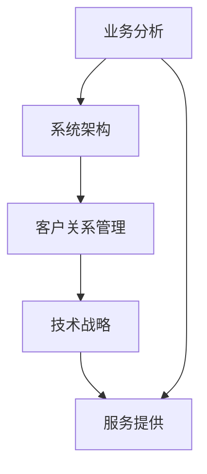

                 

关键词：高价值服务、技术咨询、业务分析、系统架构、客户关系管理、技术战略

> 摘要：本文将深入探讨高价值服务在IT领域的实现路径，通过技术咨询的视角，分析高价值服务的核心要素、提供策略以及未来发展趋势。文章旨在为技术团队和企业管理者提供具有实践指导意义的技术咨询建议。

## 1. 背景介绍

在数字化时代，信息技术（IT）已成为企业竞争力的核心要素。然而，随着技术的不断进步和市场需求的多样化，单纯的技术能力已经不足以满足企业对于高价值服务的需求。高价值服务不仅要求技术上的卓越，更强调在业务、战略、客户关系等多维度的综合服务能力。

### 1.1 IT行业发展趋势

- **云计算与大数据**：云计算和大数据技术已经成为IT行业的主流，企业通过这些技术实现了业务流程的优化和决策支持。
- **人工智能与自动化**：人工智能（AI）和自动化技术的应用，使得企业能够在生产、运营、营销等多个环节实现智能化和自动化。
- **网络安全与隐私保护**：随着数字化进程的加速，网络安全和隐私保护的重要性日益凸显。

### 1.2 市场需求变化

- **个性化服务**：消费者对于个性化、定制化的服务需求不断增加，企业需要通过精准的数据分析和个性化推荐来满足这些需求。
- **敏捷创新**：市场环境变化迅速，企业需要具备敏捷的创新能力，快速响应市场变化和客户需求。

## 2. 核心概念与联系

### 2.1 高价值服务的定义

高价值服务是指通过专业知识和技术手段，为企业客户提供定制化、综合性的解决方案，帮助客户在业务运营、市场拓展、技术创新等方面实现持续增长。

### 2.2 高价值服务的架构

高价值服务的架构应涵盖以下核心模块：

- **业务分析**：深入了解客户业务流程、痛点、需求等，为服务提供精准定位。
- **系统架构**：根据业务需求设计高效、稳定的IT系统架构。
- **客户关系管理**：建立长期稳定的客户关系，提供持续的技术支持和咨询服务。
- **技术战略**：制定与企业发展目标相匹配的技术战略，确保技术投入能够产生最大化的商业价值。

### 2.3 Mermaid 流程图



## 3. 核心算法原理 & 具体操作步骤

### 3.1 算法原理概述

高价值服务的核心算法涉及以下几个关键步骤：

- **业务建模**：通过数据分析和业务流程设计，构建业务模型。
- **系统设计**：根据业务模型设计IT系统架构。
- **客户分析**：通过数据分析了解客户需求和行为模式。
- **服务定制**：根据客户分析结果定制个性化服务方案。
- **实施与优化**：实施服务方案，并进行持续优化。

### 3.2 算法步骤详解

#### 3.2.1 业务建模

- **需求调研**：与客户沟通，了解业务需求和痛点。
- **流程分析**：对现有业务流程进行梳理和分析。
- **模型构建**：基于分析结果构建业务模型。

#### 3.2.2 系统设计

- **技术选型**：选择适合业务需求的技术栈。
- **架构设计**：设计高效、稳定的系统架构。
- **接口定义**：定义系统接口，确保与其他系统的兼容性。

#### 3.2.3 客户分析

- **数据收集**：收集客户相关数据。
- **数据清洗**：清洗和整理数据，确保数据质量。
- **分析建模**：利用数据分析工具，对客户行为进行分析和建模。

#### 3.2.4 服务定制

- **需求匹配**：将客户需求与业务模型进行匹配。
- **方案设计**：根据匹配结果设计个性化服务方案。
- **方案评估**：评估服务方案的可行性、成本和效益。

#### 3.2.5 实施与优化

- **方案实施**：实施服务方案。
- **监控与反馈**：监控服务实施效果，收集客户反馈。
- **持续优化**：根据反馈进行持续优化，提升服务质量。

### 3.3 算法优缺点

#### 优点

- **个性化服务**：能够为客户提供量身定制的服务方案。
- **高效稳定**：通过系统架构设计，确保服务的高效和稳定。
- **持续优化**：通过持续监控和反馈，不断提升服务质量。

#### 缺点

- **技术要求高**：需要具备高水平的技术能力和业务理解。
- **成本较高**：定制化服务方案的实施和优化成本较高。

### 3.4 算法应用领域

- **企业数字化转型**：帮助企业实现业务流程优化和数字化升级。
- **客户关系管理**：提升客户满意度和忠诚度。
- **市场拓展**：通过数据分析和个性化推荐，拓展市场份额。

## 4. 数学模型和公式 & 详细讲解 & 举例说明

### 4.1 数学模型构建

高价值服务涉及的数学模型主要包括以下几类：

- **客户价值模型**：用于评估客户对企业的价值。
- **服务成本模型**：用于计算服务提供过程中的成本。
- **服务效果评估模型**：用于评估服务实施后的效果。

### 4.2 公式推导过程

#### 客户价值模型

- **客户生命周期价值（CLV）**：$CLV = \sum_{t=1}^{n} \frac{净利润_{t}}{(1+r)^{t}}$

其中，$净利润_{t}$ 表示第 $t$ 年的净利润，$r$ 表示折现率。

#### 服务成本模型

- **服务成本（SC）**：$SC = fixed\_cost + variable\_cost$

其中，$fixed\_cost$ 表示固定成本，$variable\_cost$ 表示可变成本。

#### 服务效果评估模型

- **服务效果指数（SEI）**：$SEI = \frac{服务满意度}{服务成本}$

### 4.3 案例分析与讲解

#### 案例背景

某企业希望通过数字化转型提升业务效率和客户满意度。企业现有客户数据、业务流程以及IT系统，需要进行全面分析，并设计一套个性化服务方案。

#### 案例分析

1. **客户价值分析**：通过分析客户购买历史、行为数据等，评估客户的生命周期价值。

2. **服务成本计算**：计算服务提供的固定成本和可变成本。

3. **服务效果评估**：通过客户满意度调查、服务使用情况等，评估服务效果。

#### 案例结论

根据分析结果，企业可以针对不同价值的客户设计不同的服务方案，从而提升客户满意度和企业盈利能力。

## 5. 项目实践：代码实例和详细解释说明

### 5.1 开发环境搭建

- **编程语言**：Python
- **开发工具**：Jupyter Notebook
- **依赖库**：NumPy、Pandas、Scikit-learn、Matplotlib

### 5.2 源代码详细实现

#### 5.2.1 客户价值分析

```python
import pandas as pd

# 读取客户数据
data = pd.read_csv('customer_data.csv')

# 计算客户生命周期价值
def calculate_clv(data, discount_rate=0.1):
    revenues = data['revenue'].values
    clv = sum([revenue / (1 + discount_rate)**t for t, revenue in enumerate(revenues, start=1)])
    return clv

clvs = data.apply(lambda x: calculate_clv(x), axis=1)
data['CLV'] = clvs
```

#### 5.2.2 服务成本计算

```python
def calculate_service_cost(fixed_cost, variable_cost):
    return fixed_cost + variable_cost

fixed_cost = 10000
variable_cost = 500
service_cost = calculate_service_cost(fixed_cost, variable_cost)
```

#### 5.2.3 服务效果评估

```python
def calculate_sei(satisfaction, service_cost):
    return satisfaction / service_cost

satisfaction = 0.9
sei = calculate_sei(satisfaction, service_cost)
```

### 5.3 代码解读与分析

1. **客户价值分析**：使用 Pandas 库读取客户数据，并计算每个客户的生命周期价值（CLV）。
2. **服务成本计算**：定义一个函数，计算服务提供的固定成本和可变成本之和。
3. **服务效果评估**：定义一个函数，计算服务效果指数（SEI），用于评估服务的效益。

### 5.4 运行结果展示

- **客户价值分析结果**：每个客户的CLV值。
- **服务成本**：服务提供的总成本。
- **服务效果指数**：SEI值，用于评估服务效益。

## 6. 实际应用场景

### 6.1 企业数字化转型

- **应用场景**：传统企业通过数字化转型提升业务效率和竞争力。
- **解决方案**：通过数据分析和系统架构设计，实现业务流程优化和数字化升级。

### 6.2 客户关系管理

- **应用场景**：企业通过精准的客户关系管理提升客户满意度和忠诚度。
- **解决方案**：利用数据分析客户行为，设计个性化服务方案，提供持续的技术支持和咨询服务。

### 6.3 市场拓展

- **应用场景**：企业在市场中寻找新的增长点。
- **解决方案**：通过数据分析和个性化推荐，拓展市场份额，实现业务增长。

### 6.4 未来应用展望

- **个性化服务**：随着技术的进步，个性化服务将更加精准和高效。
- **智能化运营**：人工智能和自动化技术的应用，将推动企业运营的智能化和自动化。
- **安全与隐私保护**：随着数字化进程的深入，网络安全和隐私保护将成为高价值服务的重要组成部分。

## 7. 工具和资源推荐

### 7.1 学习资源推荐

- **书籍**：
  - 《大数据时代》
  - 《深度学习》
  - 《人工智能：一种现代的方法》
- **在线课程**：
  - Coursera的《机器学习》
  - edX的《Python编程》
  - Udacity的《数据科学基础》

### 7.2 开发工具推荐

- **编程语言**：
  - Python
  - Java
  - R
- **开发环境**：
  - Jupyter Notebook
  - Visual Studio Code
  - PyCharm

### 7.3 相关论文推荐

- 《大数据的价值创造》
- 《深度学习在自然语言处理中的应用》
- 《企业数字化转型：理论与实践》

## 8. 总结：未来发展趋势与挑战

### 8.1 研究成果总结

本文通过分析高价值服务的核心概念、提供策略和应用领域，提出了高价值服务的实现路径。研究结果显示，高价值服务不仅需要技术能力，还需要在业务分析、系统架构、客户关系管理和技术战略等多个维度进行综合服务。

### 8.2 未来发展趋势

- **个性化服务**：随着消费者需求的多样化，个性化服务将成为高价值服务的核心。
- **智能化运营**：人工智能和自动化技术的应用，将推动企业运营的智能化和自动化。
- **安全与隐私保护**：网络安全和隐私保护将成为高价值服务的重要组成部分。

### 8.3 面临的挑战

- **技术要求**：高价值服务需要高水平的技术能力和业务理解。
- **成本控制**：定制化服务方案的实施和优化成本较高。
- **市场竞争**：在激烈的市场竞争中，企业需要不断创新和优化服务，以保持竞争优势。

### 8.4 研究展望

未来，高价值服务的研究应关注以下几个方面：

- **技术创新**：持续跟踪和引入最新的技术，提升服务质量和效率。
- **业务融合**：深入挖掘业务和技术之间的融合点，提供更具价值的解决方案。
- **用户体验**：以用户为中心，不断提升服务体验和满意度。

## 9. 附录：常见问题与解答

### 9.1 高价值服务与传统IT服务的区别是什么？

- **核心区别**：高价值服务更强调在业务、战略、客户关系等多维度的综合服务能力，而传统IT服务更多关注于技术本身。

### 9.2 如何衡量高价值服务的效果？

- **效果衡量**：可以通过客户满意度、业务增长、成本节约等多个维度进行衡量。具体指标包括客户生命周期价值（CLV）、服务效果指数（SEI）等。

### 9.3 高价值服务的成本如何控制？

- **成本控制**：通过优化业务流程、提高技术效率、合理规划资源投入等方式，可以有效控制高价值服务的成本。

---

作者：禅与计算机程序设计艺术 / Zen and the Art of Computer Programming

本文为作者原创文章，未经授权，不得转载和使用。如需转载，请联系作者获取授权。

