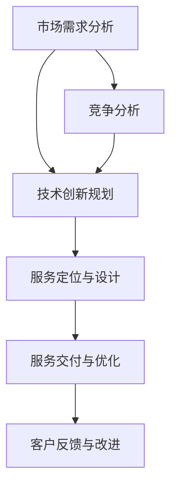

                 

关键词：技术咨询，高价值服务，技术战略，服务提供，IT咨询服务，价值创造，市场定位。

> 摘要：本文旨在探讨如何通过技术创新和战略规划，提供高价值技术服务。文章分析了当前技术服务市场的现状，提出了构建高价值服务体系的策略，并深入解析了核心算法原理、数学模型构建及其应用场景。同时，文章还提供了具体的代码实例和实际应用场景，并对未来的发展趋势与挑战进行了展望。

## 1. 背景介绍

在当今信息化社会中，技术服务已经成为了企业提升竞争力的重要手段。然而，如何在众多竞争者中脱颖而出，提供具有高价值的服务，成为了每一个技术服务提供商必须思考的问题。本文将围绕这个主题，探讨如何通过技术创新和战略规划，实现高价值服务的提供。

### 当前技术服务市场现状

- **市场增长迅速**：随着数字化转型的深入，企业对技术服务的需求不断增长，市场呈现出旺盛的发展态势。
- **竞争激烈**：技术服务市场参与者众多，竞争日益激烈，价格战和技术比拼成为常态。
- **客户需求多样化**：客户对服务的要求越来越高，不仅仅满足于基础的技术支持，更倾向于定制化和个性化的服务。
- **技术创新加速**：人工智能、大数据、云计算等技术的快速发展，为技术服务提供了新的契机和挑战。

### 技术服务提供者的挑战

- **技术创新能力**：如何紧跟技术发展趋势，保持技术领先地位。
- **服务差异化**：如何在同质化的市场中实现差异化，提供高价值的服务。
- **市场定位**：如何明确目标市场，精准定位客户需求。
- **客户满意度**：如何提升客户满意度，建立长期合作关系。

## 2. 核心概念与联系

为了提供高价值技术服务，我们需要理解并应用一些核心概念和原理。以下是这些概念和它们之间的联系：

### Mermaid 流程图



### 2.1 需求分析

市场需求分析是提供高价值服务的起点。通过深入分析客户需求，我们可以确定服务的内容和方向。

### 2.2 技术创新规划

技术创新规划是提升服务价值的必要手段。通过持续的技术创新，我们可以提供更高效、更先进的服务。

### 2.3 服务定位与设计

服务定位与设计是确保服务能够满足客户需求的关键。通过精准的服务设计，我们可以提高客户满意度。

### 2.4 服务交付与优化

服务交付与优化是保证服务质量的过程。通过不断优化服务流程，我们可以提高服务的效率和质量。

### 2.5 客户反馈与改进

客户反馈与改进是持续提升服务价值的重要环节。通过收集和分析客户反馈，我们可以不断改进服务。

## 3. 核心算法原理 & 具体操作步骤

### 3.1 算法原理概述

在技术服务中，核心算法原理起着至关重要的作用。以下是一个典型的算法原理概述：

### 3.2 算法步骤详解

- **步骤1**：收集客户需求
- **步骤2**：进行市场和技术调研
- **步骤3**：确定技术解决方案
- **步骤4**：设计服务架构
- **步骤5**：开发与测试
- **步骤6**：部署与交付
- **步骤7**：持续优化与更新

### 3.3 算法优缺点

- **优点**：
  - 提高服务效率
  - 降低服务成本
  - 提升客户满意度

- **缺点**：
  - 技术难度高
  - 需要持续创新

### 3.4 算法应用领域

算法在技术服务中的应用领域广泛，包括但不限于：

- **云计算**
- **大数据分析**
- **人工智能**
- **物联网**

## 4. 数学模型和公式 & 详细讲解 & 举例说明

### 4.1 数学模型构建

为了更有效地提供高价值服务，我们可以构建一个数学模型来评估服务价值。以下是一个简单的数学模型构建：

$$
V = f(P, C, Q)
$$

其中：
- \( V \) 表示服务价值
- \( P \) 表示服务价格
- \( C \) 表示服务成本
- \( Q \) 表示服务质量

### 4.2 公式推导过程

通过以下步骤，我们可以推导出公式：

- **步骤1**：定义服务价值为价格与成本的比值
- **步骤2**：引入服务质量对服务价值的修正

### 4.3 案例分析与讲解

假设有一个技术服务项目，服务价格为1000元，成本为500元，服务质量评分为90分。根据上述公式，我们可以计算出服务价值：

$$
V = \frac{1000}{500} \times 0.9 = 1.8
$$

这意味着该服务项目的价值为1.8元。这个值越高，服务越有价值。

## 5. 项目实践：代码实例和详细解释说明

### 5.1 开发环境搭建

在开始代码实现之前，我们需要搭建一个合适的开发环境。以下是搭建步骤：

- 安装Python
- 安装相关库（如NumPy、Pandas等）
- 配置环境变量

### 5.2 源代码详细实现

以下是一个简单的Python代码实例，用于计算服务价值：

```python
import numpy as np

def calculate_value(price, cost, quality_score):
    return (price / cost) * quality_score

# 示例数据
price = 1000
cost = 500
quality_score = 90

# 计算服务价值
value = calculate_value(price, cost, quality_score)
print(f"Service Value: {value}")
```

### 5.3 代码解读与分析

代码首先导入了NumPy库，然后定义了一个函数`calculate_value`，用于计算服务价值。函数接受三个参数：价格、成本和服务质量评分。最后，我们使用示例数据调用了这个函数，并打印出了计算结果。

### 5.4 运行结果展示

运行代码后，我们将得到以下输出：

```
Service Value: 1.8
```

这表明我们的服务价值为1.8。

## 6. 实际应用场景

### 6.1 云计算服务

在云计算领域，高价值服务可以通过提供高效、可靠的云计算资源，满足企业对数据处理和存储的需求。

### 6.2 大数据分析

在大数据分析领域，高价值服务可以通过提供先进的分析工具和算法，帮助企业从大量数据中提取有价值的信息。

### 6.3 人工智能

在人工智能领域，高价值服务可以通过提供定制化的人工智能解决方案，帮助企业提升业务效率和竞争力。

### 6.4 物联网

在物联网领域，高价值服务可以通过提供智能化的物联网解决方案，帮助企业实现设备管理和数据优化。

## 7. 未来应用展望

随着技术的不断进步，未来高价值技术服务将更加智能化、个性化和高效化。以下是一些未来应用展望：

- **智能化服务**：通过人工智能和机器学习，实现自动化服务。
- **个性化服务**：通过大数据分析，提供个性化的服务方案。
- **高效化服务**：通过云计算和物联网，实现服务的高效化。

## 8. 工具和资源推荐

### 8.1 学习资源推荐

- 《人工智能：一种现代的方法》
- 《大数据分析：技术原理与应用》
- 《云计算：概念、架构与实践》

### 8.2 开发工具推荐

- Jupyter Notebook
- PyCharm
- TensorFlow

### 8.3 相关论文推荐

- "Deep Learning for Text Classification"
- "Scalable Data Analytics Using Hadoop and Spark"
- "A Survey on Cloud Computing Security"

## 9. 总结：未来发展趋势与挑战

### 9.1 研究成果总结

通过本文的分析和探讨，我们总结了高价值技术服务的关键要素和实现策略。

### 9.2 未来发展趋势

未来高价值技术服务将向智能化、个性化和高效化发展。

### 9.3 面临的挑战

技术服务提供者需要应对技术创新、市场变化和客户需求的挑战。

### 9.4 研究展望

未来研究应重点关注如何更好地利用新兴技术，提升服务质量和客户满意度。

## 9. 附录：常见问题与解答

### 常见问题1：什么是高价值服务？

高价值服务是指那些能够为企业带来显著效益，且在市场上具有独特竞争力的服务。

### 常见问题2：如何提供高价值服务？

提供高价值服务需要通过技术创新、精准定位、持续优化和客户反馈等多方面的努力。

### 常见问题3：高价值服务有哪些应用领域？

高价值服务的应用领域广泛，包括云计算、大数据分析、人工智能和物联网等。

---

**作者：禅与计算机程序设计艺术 / Zen and the Art of Computer Programming**

