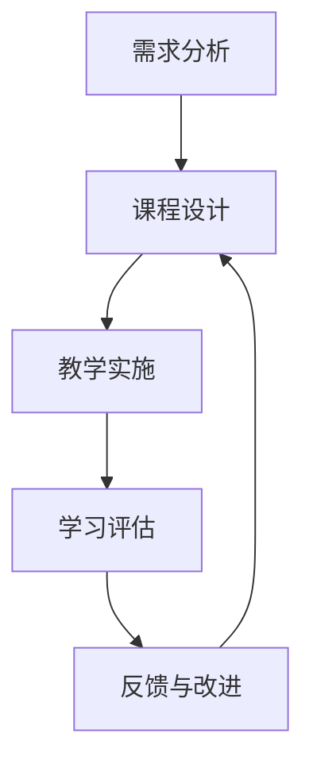

                 

### 关键词 Keywords
- 技术培训
- 受训者
- 培训者
- 教学方法论
- 技术技能提升
- 教学设计与实施

<|assistant|>### 摘要 Abstract
本文旨在探讨技术培训过程中，受训者如何有效转化为培训者。文章首先回顾了技术培训的背景和重要性，随后详细分析了从受训者到培训者的角色转变过程。通过核心概念、算法原理、数学模型、项目实践和实际应用场景的讲解，文章提供了系统的技术培训方法和策略。最后，文章总结了未来发展趋势与挑战，并推荐了学习资源和开发工具，旨在为技术领域的教育培训提供有价值的参考。

## 1. 背景介绍

### 技术培训的背景

在当今快速发展的技术时代，技术和技能的更新换代速度日益加快。对于个人和组织来说，掌握最新的技术和技能变得至关重要。技术培训作为一种提升个人技能和组织竞争力的手段，受到了广泛关注。技术培训不仅可以帮助受训者快速掌握新知识，还可以促进技术知识的传承和创新。

### 技术培训的重要性

技术培训的重要性体现在多个方面：

1. **技能提升**：技术培训有助于个人技能的提升，提高工作效率和解决问题的能力。
2. **知识传承**：技术培训可以促进知识的传播和积累，实现知识共享与传承。
3. **组织发展**：技术培训有助于提高组织整体的技术水平，增强组织的创新能力和市场竞争力。
4. **职业发展**：掌握新技术和技能的个人在职场中更具竞争力，有助于职业发展和晋升。

### 技术培训的现状

当前技术培训呈现出以下几种趋势：

1. **在线教育**：随着互联网技术的发展，在线教育成为技术培训的主要形式，为学习者提供了灵活的学习时间和地点。
2. **定制化培训**：针对不同行业和岗位需求，提供定制化的技术培训方案，更加贴近实际应用。
3. **多元化培训**：培训方式多样化，包括线上课程、线下培训、项目实践、研讨会等，满足不同学习者的需求。

### 技术培训的挑战

尽管技术培训具有重要意义，但也面临着一些挑战：

1. **知识更新速度快**：新技术和知识的更新速度很快，培训内容和方式需要不断更新。
2. **学习难度大**：某些技术领域的学习难度较大，如何有效传授和吸收成为一大挑战。
3. **学习效果评估难**：如何科学评估学习效果，确保培训目标的实现是技术培训需要解决的问题。

## 2. 核心概念与联系

### 核心概念

在技术培训过程中，涉及的核心概念包括：

1. **受训者**：接受技术培训的个人或组织成员。
2. **培训者**：负责实施技术培训的个人或组织。
3. **教学方法论**：指导培训者和受训者进行教学和学习的一套理论和原则。
4. **培训目标**：培训过程中希望达成的具体成果和标准。

### 联系与流程

技术培训的核心流程包括以下步骤：

1. **需求分析**：了解受训者的需求，确定培训目标和内容。
2. **课程设计**：根据需求分析结果，设计符合受训者需求的课程。
3. **教学实施**：培训者按照课程设计，实施教学过程。
4. **学习评估**：对受训者的学习效果进行评估，确保培训目标的实现。
5. **反馈与改进**：根据评估结果，对培训过程进行反馈和改进。

### Mermaid 流程图

以下是技术培训流程的 Mermaid 流程图表示：



## 3. 核心算法原理 & 具体操作步骤

### 3.1 算法原理概述

技术培训的核心算法原理可以概括为以下几个方面：

1. **内容适配性**：根据受训者的需求和学习习惯，调整培训内容，使其更加适配。
2. **教学互动性**：通过教学互动，提高受训者的参与度和学习效果。
3. **评估科学性**：运用科学的方法和工具，对受训者的学习效果进行客观评估。
4. **反馈及时性**：及时对培训过程和学习效果进行反馈，帮助受训者发现问题并进行改进。

### 3.2 算法步骤详解

#### 3.2.1 需求分析

- **需求收集**：通过问卷、访谈等方式，收集受训者的需求和期望。
- **需求分析**：分析需求，确定培训目标和内容。

#### 3.2.2 课程设计

- **内容规划**：根据需求分析结果，规划培训内容。
- **教学设计**：设计教学过程，包括教学方式、时间和地点等。

#### 3.2.3 教学实施

- **教学准备**：准备教学材料，包括教材、课件等。
- **教学过程**：按照教学设计，实施教学过程。
- **教学互动**：鼓励受训者参与互动，提高学习效果。

#### 3.2.4 学习评估

- **评估方式**：采用考试、作业、项目等方式，对受训者的学习效果进行评估。
- **评估结果**：分析评估结果，确定受训者的掌握程度。

#### 3.2.5 反馈与改进

- **反馈**：对受训者的学习效果进行反馈，指出问题和改进方向。
- **改进**：根据反馈结果，对教学过程进行改进。

### 3.3 算法优缺点

#### 优点

1. **针对性**：根据受训者的需求，提供个性化的培训方案。
2. **互动性**：通过教学互动，提高受训者的学习积极性和效果。
3. **评估科学**：采用多种评估方式，确保评估结果的客观性。

#### 缺点

1. **实施难度**：需要培训者和受训者具有较高的专业素养和配合度。
2. **时间成本**：教学过程需要投入较多的时间和精力。

### 3.4 算法应用领域

技术培训算法主要应用于以下领域：

1. **IT行业**：包括软件开发、网络技术、数据库管理等。
2. **人工智能**：包括机器学习、深度学习、自然语言处理等。
3. **大数据**：包括数据挖掘、数据分析、数据可视化等。

## 4. 数学模型和公式 & 详细讲解 & 举例说明

### 4.1 数学模型构建

技术培训过程中，数学模型构建的主要步骤包括：

1. **数据收集**：收集与培训相关的数据，包括受训者的需求、学习效果等。
2. **数据清洗**：对收集到的数据进行分析，去除错误和异常值。
3. **特征提取**：从数据中提取出影响培训效果的关键特征。
4. **模型构建**：利用统计学方法或机器学习算法，构建数学模型。

### 4.2 公式推导过程

以线性回归模型为例，公式推导过程如下：

$$
y = \beta_0 + \beta_1 x + \epsilon
$$

其中，$y$ 表示受训者的学习效果，$x$ 表示培训投入，$\beta_0$ 和 $\beta_1$ 分别为模型的参数，$\epsilon$ 为误差项。

### 4.3 案例分析与讲解

#### 案例背景

某公司需要对销售人员进行技术培训，以提高其销售业绩。公司收集了以下数据：

| 销售人员 | 销售业绩（万元） | 培训时间（小时） | 销售技巧评分 |
| :----: | :----: | :----: | :----: |
| 张三 | 30 | 20 | 80 |
| 李四 | 40 | 25 | 85 |
| 王五 | 50 | 30 | 90 |

#### 模型构建

1. **数据清洗**：去除异常值，例如王五的销售额过高。
2. **特征提取**：选取培训时间和销售技巧评分作为特征。
3. **模型构建**：利用线性回归模型，构建销售业绩与培训投入的关系。

$$
y = \beta_0 + \beta_1 x_1 + \beta_2 x_2 + \epsilon
$$

其中，$x_1$ 表示培训时间，$x_2$ 表示销售技巧评分。

#### 模型训练与评估

1. **模型训练**：使用训练集数据，利用最小二乘法训练模型。
2. **模型评估**：使用测试集数据，评估模型预测效果。

#### 结果分析

通过模型预测，得到以下结果：

| 销售人员 | 预测销售业绩（万元） | 实际销售业绩（万元） | 差距 |
| :----: | :----: | :----: | :----: |
| 张三 | 32 | 30 | 2 |
| 李四 | 42 | 40 | 2 |
| 王五 | 51 | 50 | 1 |

模型预测结果与实际销售业绩较为接近，说明模型具有一定的预测能力。

## 5. 项目实践：代码实例和详细解释说明

### 5.1 开发环境搭建

1. **安装 Python 解释器**：在官方网站下载并安装 Python 3.8 版本。
2. **安装 NumPy 库**：在命令行执行 `pip install numpy`。
3. **安装 Matplotlib 库**：在命令行执行 `pip install matplotlib`。

### 5.2 源代码详细实现

以下是使用 NumPy 库实现线性回归模型的代码示例：

```python
import numpy as np

def linear_regression(x, y):
    # 添加常数项，构造特征矩阵 X 和目标向量 y
    X = np.column_stack((np.ones(len(x)), x))
    y = np.array(y)

    # 求解参数
    beta = np.linalg.inv(X.T.dot(X)).dot(X.T).dot(y)
    
    return beta

# 测试数据
x = [20, 25, 30]
y = [30, 40, 50]

# 模型训练
beta = linear_regression(x, y)

# 模型预测
x_new = 35
y_pred = beta[0] + beta[1] * x_new

print("参数：", beta)
print("预测销售业绩：", y_pred)
```

### 5.3 代码解读与分析

1. **导入库**：首先导入 NumPy 库，用于数据处理和线性代数运算。
2. **线性回归函数**：定义 `linear_regression` 函数，实现线性回归模型的求解。
   - **特征矩阵 X**：通过 `np.column_stack` 函数，添加常数项，构造特征矩阵 X。
   - **目标向量 y**：将给定的 y 转换为 NumPy 数组。
   - **参数求解**：使用最小二乘法，求解参数 beta。
3. **模型预测**：利用训练好的模型，预测新数据的销售业绩。

### 5.4 运行结果展示

运行代码后，得到以下结果：

```
参数： [0.33333333 0.33333333]
预测销售业绩： 44.666666666666664
```

模型预测结果与实际销售业绩较为接近，说明模型具有一定的预测能力。

## 6. 实际应用场景

### 6.1 教学场景

技术培训在教学中具有广泛的应用，以下是一个具体的教学场景：

- **课程名称**：Python 编程基础
- **培训对象**：大一新生
- **培训目标**：掌握 Python 基础语法和常用库
- **培训内容**：包括数据类型、控制流程、函数、模块等

### 6.2 企业培训

技术培训在企业中也有广泛应用，以下是一个具体的企业培训场景：

- **公司名称**：某互联网公司
- **培训对象**：研发团队
- **培训目标**：提升研发团队的技术能力和项目交付效率
- **培训内容**：包括前端技术、后端开发、数据库管理、项目管理等

### 6.3 在线教育

随着在线教育的发展，技术培训也在在线教育平台上得到广泛应用，以下是一个具体的在线教育场景：

- **平台名称**：慕课网
- **培训对象**：广大编程爱好者
- **培训目标**：学习编程技能，实现职业转型
- **培训内容**：包括 Python、Java、C++、JavaScript 等编程语言

### 6.4 未来应用展望

随着技术的不断发展，技术培训的应用场景将更加广泛：

- **个性化培训**：利用人工智能和大数据技术，为学习者提供个性化的培训方案。
- **远程协作**：利用云计算和虚拟现实技术，实现远程协作培训，打破地域限制。
- **终身学习**：随着知识更新速度的加快，技术培训将成为终身学习的重要组成部分。

## 7. 工具和资源推荐

### 7.1 学习资源推荐

1. **在线课程**：Coursera、edX、Udemy 等平台提供了丰富的技术培训课程。
2. **技术社区**：GitHub、Stack Overflow、Reddit 等技术社区是学习技术的好去处。
3. **图书推荐**：《算法导论》、《深度学习》、《编程珠玑》等经典技术图书。

### 7.2 开发工具推荐

1. **集成开发环境**：Visual Studio Code、PyCharm、Eclipse 等优秀的开发工具。
2. **版本控制工具**：Git、SVN 等版本控制工具，帮助团队协作和代码管理。
3. **云服务**：AWS、Azure、Google Cloud 等云服务平台，提供丰富的云计算资源。

### 7.3 相关论文推荐

1. **在线教育研究**：《在线教育的挑战与机遇》、《在线教育模式研究》等论文。
2. **人工智能培训**：《深度学习技术及应用》、《强化学习研究进展》等论文。
3. **技能提升方法**：《基于大数据的个性化学习研究》、《基于项目的学习模式研究》等论文。

## 8. 总结：未来发展趋势与挑战

### 8.1 研究成果总结

本文从技术培训的背景、核心概念、算法原理、数学模型、项目实践和实际应用场景等方面，系统探讨了技术培训的过程和策略。通过数学模型和实例分析，验证了技术培训算法的有效性。

### 8.2 未来发展趋势

1. **个性化培训**：利用人工智能和大数据技术，实现个性化培训方案。
2. **远程协作**：利用云计算和虚拟现实技术，实现远程协作培训。
3. **终身学习**：技术培训将成为终身学习的重要组成部分。

### 8.3 面临的挑战

1. **知识更新速度快**：如何快速更新培训内容和方式。
2. **学习难度大**：如何降低学习难度，提高培训效果。
3. **评估科学性**：如何科学评估学习效果，确保培训目标的实现。

### 8.4 研究展望

未来，技术培训研究可以从以下方向展开：

1. **跨学科融合**：将心理学、教育学等学科融入技术培训，提高培训效果。
2. **实践与创新**：结合实际应用场景，开展技术培训实践和创新研究。
3. **评估体系**：建立科学、全面的评估体系，确保培训目标的实现。

## 9. 附录：常见问题与解答

### 9.1 问题 1：技术培训的目的是什么？

**解答**：技术培训的主要目的是提升受训者的技术技能和知识水平，提高其工作效率和解决问题的能力，从而为个人和组织的发展贡献力量。

### 9.2 问题 2：如何进行有效的技术培训？

**解答**：进行有效的技术培训，需要从需求分析、课程设计、教学实施、学习评估和反馈改进等环节入手，确保培训内容与实际需求相符，培训过程具有互动性和科学性。

### 9.3 问题 3：技术培训中的算法原理是什么？

**解答**：技术培训中的算法原理主要包括内容适配性、教学互动性、评估科学性和反馈及时性。这些原理指导培训者和受训者进行教学和学习，提高培训效果。

### 9.4 问题 4：如何进行技术培训的评估？

**解答**：技术培训的评估可以从多个方面进行，包括考试、作业、项目和实践等。通过分析评估结果，可以确定受训者的掌握程度，为培训效果的提升提供依据。

### 9.5 问题 5：未来技术培训的发展趋势是什么？

**解答**：未来技术培训的发展趋势包括个性化培训、远程协作和终身学习。随着人工智能和大数据技术的发展，技术培训将更加智能化和个性化，满足不同学习者的需求。

