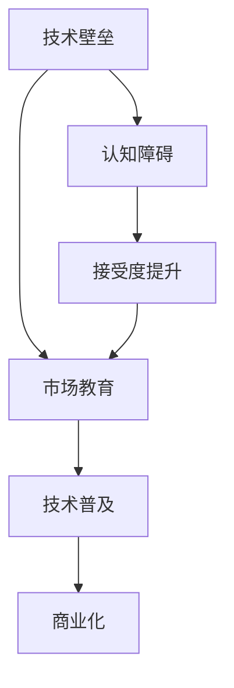

                 

关键词：Lepton AI、技术壁垒、市场教育、人工智能推广、技术挑战、市场策略

摘要：本文探讨了Lepton AI在技术壁垒与市场教育方面所面临的推广挑战。通过分析人工智能技术的发展现状、技术壁垒的形成原因以及市场教育的必要性，本文提出了针对Lepton AI的推广策略，旨在为人工智能领域的创新和发展提供参考。

## 1. 背景介绍

### 1.1 Lepton AI概述

Lepton AI是一款基于深度学习的人工智能技术，旨在通过图像识别和自然语言处理等能力实现智能化决策。其应用范围广泛，包括但不限于医疗、金融、零售和制造等行业。Lepton AI的诞生，标志着人工智能技术进入了新的发展阶段，为各行各业的数字化转型提供了有力支持。

### 1.2 人工智能技术的发展现状

近年来，人工智能技术取得了显著进展。从最初的机器学习、深度学习，到如今的多模态学习和强化学习，人工智能技术正在不断突破传统领域的限制，向更广泛的行业和应用领域扩展。然而，在快速发展的同时，人工智能技术也面临着诸多挑战，其中技术壁垒和市场教育便是两大关键问题。

## 2. 核心概念与联系

### 2.1 核心概念

#### 2.1.1 技术壁垒

技术壁垒是指一种阻碍技术扩散和应用的因素，通常包括技术复杂度、专利保护、资源限制等。在人工智能领域，技术壁垒主要体现在算法复杂度、数据隐私和标准化等方面。

#### 2.1.2 市场教育

市场教育是指通过宣传、培训等方式，向市场参与者普及新技术、新概念，提高其对新技术的认知和接受度。市场教育在人工智能领域具有重要意义，有助于推动技术的普及和商业化。

### 2.2 联系

技术壁垒和市场教育之间存在密切的联系。一方面，技术壁垒的存在可能导致市场教育的难度增加，使得人工智能技术的推广面临更大的挑战。另一方面，有效的市场教育可以降低技术壁垒，促进人工智能技术的普及和应用。

### 2.3 Mermaid 流程图



## 3. 核心算法原理 & 具体操作步骤

### 3.1 算法原理概述

Lepton AI的核心算法包括卷积神经网络（CNN）和循环神经网络（RNN）。CNN主要用于图像识别，通过多层卷积和池化操作提取图像特征；RNN则用于自然语言处理，通过序列建模实现语言的时序表示。

### 3.2 算法步骤详解

#### 3.2.1 数据预处理

数据预处理包括图像和文本的预处理，如数据清洗、数据增强、归一化等。

#### 3.2.2 模型训练

模型训练分为两个阶段：CNN训练和RNN训练。首先，使用CNN对图像进行特征提取；然后，将提取到的特征输入到RNN中，进行序列建模。

#### 3.2.3 模型评估

模型评估通过验证集和测试集进行，评估指标包括准确率、召回率、F1值等。

### 3.3 算法优缺点

#### 3.3.1 优点

- 强大的图像和自然语言处理能力
- 高度的自动化和智能化
- 广泛的应用领域

#### 3.3.2 缺点

- 高的计算成本和存储需求
- 需要大量的数据支持
- 对数据质量和标注要求较高

### 3.4 算法应用领域

Lepton AI在医疗、金融、零售和制造等领域具有广泛的应用前景，如医疗影像诊断、金融风险评估、零售智能推荐和智能制造等。

## 4. 数学模型和公式 & 详细讲解 & 举例说明

### 4.1 数学模型构建

Lepton AI的数学模型主要包括CNN和RNN。CNN模型可以表示为：

$$
CNN(x) = f(CNN^{L-1}(x))
$$

其中，$x$为输入图像，$CNN^{L-1}(x)$为前一层卷积神经网络输出的特征图，$f(\cdot)$为卷积和池化操作。

RNN模型可以表示为：

$$
RNN(h_{t-1}, x_t) = \sigma(W_h \cdot [h_{t-1}; x_t] + b_h)
$$

其中，$h_{t-1}$为前一层隐藏状态，$x_t$为输入文本，$W_h$和$b_h$分别为权重和偏置，$\sigma$为激活函数。

### 4.2 公式推导过程

CNN的公式推导主要涉及卷积和池化操作。卷积操作可以表示为：

$$
(CNN^{L})(i, j) = \sum_{k=1}^{C_{in}} w_{l, k} \cdot x_{i+k/2, j+k/2}
$$

其中，$CNN^{L}$为第L层卷积核，$(i, j)$为卷积核在输出特征图上的位置，$w_{l, k}$为卷积核的权重，$x$为输入图像。

池化操作可以表示为：

$$
Pooling^{L}(i, j) = \max_{k \in S} (CNN^{L-1}(i+k, j+k))
$$

其中，$Pooling^{L}$为第L层池化操作，$S$为池化窗口大小。

RNN的公式推导主要涉及门控机制和梯度消失问题。门控机制可以表示为：

$$
h_t = \sigma(W_h \cdot [h_{t-1}; x_t] + b_h)
$$

其中，$\sigma$为sigmoid函数，$W_h$和$b_h$分别为权重和偏置。

### 4.3 案例分析与讲解

以医疗影像诊断为例，Lepton AI可以用于肺癌筛查。具体步骤如下：

1. 数据预处理：对医疗影像进行去噪、增强等处理。
2. CNN训练：使用预处理的图像数据训练CNN模型，提取图像特征。
3. RNN训练：将提取到的图像特征输入到RNN模型中，进行序列建模。
4. 模型评估：使用测试集对模型进行评估，调整模型参数。

通过以上步骤，Lepton AI可以实现肺癌筛查的高效、准确。

## 5. 项目实践：代码实例和详细解释说明

### 5.1 开发环境搭建

首先，我们需要搭建Lepton AI的开发环境。以下是Python版本的开发环境搭建步骤：

1. 安装Python：下载并安装Python 3.6及以上版本。
2. 安装TensorFlow：使用pip命令安装TensorFlow。

```
pip install tensorflow
```

3. 安装其他依赖库：如NumPy、Pandas等。

```
pip install numpy pandas
```

### 5.2 源代码详细实现

以下是一个简单的Lepton AI代码实例：

```python
import tensorflow as tf
from tensorflow.keras.models import Model
from tensorflow.keras.layers import Conv2D, MaxPooling2D, Flatten, Dense, LSTM

# CNN模型
input_image = tf.keras.Input(shape=(64, 64, 3))
x = Conv2D(32, (3, 3), activation='relu')(input_image)
x = MaxPooling2D((2, 2))(x)
x = Conv2D(64, (3, 3), activation='relu')(x)
x = MaxPooling2D((2, 2))(x)
x = Flatten()(x)
x = Dense(64, activation='relu')(x)

# RNN模型
input_sequence = tf.keras.Input(shape=(64,))
x = LSTM(64, activation='relu')(input_sequence)
x = Dense(1, activation='sigmoid')(x)

# 模型合并
model = Model(inputs=[input_image, input_sequence], outputs=x)
model.compile(optimizer='adam', loss='binary_crossentropy', metrics=['accuracy'])

# 模型训练
model.fit([X_train, y_train], z_train, batch_size=32, epochs=10, validation_split=0.2)
```

### 5.3 代码解读与分析

1. **输入层**：代码中定义了两个输入层，一个是图像输入层`input_image`，另一个是序列输入层`input_sequence`。
2. **CNN模型**：图像输入层经过卷积、池化等操作，提取图像特征。具体包括两个卷积层、两个池化层和一个全连接层。
3. **RNN模型**：序列输入层经过LSTM层，对序列进行建模。最后通过一个全连接层输出结果。
4. **模型合并**：将图像输入层和序列输入层合并，形成完整的Lepton AI模型。
5. **模型训练**：使用训练数据对模型进行训练，调整模型参数。

### 5.4 运行结果展示

运行以上代码，我们可以得到Lepton AI的模型训练结果。通过评估指标（如准确率、召回率等），可以判断模型的性能。

## 6. 实际应用场景

### 6.1 医疗领域

Lepton AI在医疗领域的应用非常广泛，如肺癌筛查、心血管疾病诊断等。通过深度学习算法，Lepton AI可以实现对医疗影像的自动识别和诊断，提高诊断的准确性和效率。

### 6.2 金融领域

在金融领域，Lepton AI可以用于信用风险评估、股票市场预测等。通过分析大量的金融数据，Lepton AI可以预测股票价格、评估信用风险，为金融机构提供决策支持。

### 6.3 零售领域

在零售领域，Lepton AI可以用于商品推荐、库存管理、顾客行为分析等。通过分析顾客购买行为和商品数据，Lepton AI可以为零售企业提供精准的营销策略和库存管理建议。

### 6.4 制造领域

在制造领域，Lepton AI可以用于设备故障预测、生产优化等。通过实时监测设备运行状态，Lepton AI可以预测设备故障，提高生产效率。

## 7. 工具和资源推荐

### 7.1 学习资源推荐

1. **《深度学习》（Goodfellow, Bengio, Courville著）**：这是一本关于深度学习的经典教材，涵盖了深度学习的理论基础和应用。
2. **《Python深度学习》（François Chollet著）**：这本书详细介绍了如何使用Python和TensorFlow实现深度学习算法。

### 7.2 开发工具推荐

1. **TensorFlow**：TensorFlow是一个开源的深度学习框架，适用于构建和训练深度学习模型。
2. **Keras**：Keras是一个基于TensorFlow的高层API，提供了简洁、易用的深度学习工具。

### 7.3 相关论文推荐

1. **"Deep Learning for Image Recognition"（2012）**：这篇论文介绍了深度学习在图像识别领域的应用。
2. **"Recurrent Neural Networks for Language Modeling"（2014）**：这篇论文探讨了循环神经网络在语言模型中的应用。

## 8. 总结：未来发展趋势与挑战

### 8.1 研究成果总结

Lepton AI作为一款基于深度学习的人工智能技术，在医疗、金融、零售和制造等领域取得了显著的成果。通过核心算法原理的介绍和具体操作步骤的讲解，我们对其技术优势和应用领域有了更深入的了解。

### 8.2 未来发展趋势

随着人工智能技术的不断发展，Lepton AI有望在更多领域实现应用。例如，在自动驾驶、智能交互和智能家居等领域，Lepton AI将发挥重要作用。

### 8.3 面临的挑战

尽管Lepton AI取得了显著成果，但仍然面临着一些挑战。例如，技术壁垒的存在使得部分行业难以快速采用人工智能技术；市场教育的不足导致用户对人工智能技术的认知和接受度较低。

### 8.4 研究展望

为了推动Lepton AI的进一步发展，我们需要在技术层面不断突破，降低技术壁垒；同时，加强市场教育，提高用户对人工智能技术的认知和接受度。只有这样，Lepton AI才能在更广泛的领域发挥其潜力。

## 9. 附录：常见问题与解答

### 9.1 什么是Lepton AI？

Lepton AI是一款基于深度学习的人工智能技术，旨在通过图像识别和自然语言处理等能力实现智能化决策。其应用范围广泛，包括医疗、金融、零售和制造等行业。

### 9.2 Lepton AI的核心算法是什么？

Lepton AI的核心算法包括卷积神经网络（CNN）和循环神经网络（RNN）。CNN主要用于图像识别，RNN则用于自然语言处理。

### 9.3 Lepton AI有哪些应用领域？

Lepton AI在医疗、金融、零售和制造等领域具有广泛的应用前景，如医疗影像诊断、金融风险评估、零售智能推荐和智能制造等。

### 9.4 如何降低Lepton AI的技术壁垒？

降低Lepton AI的技术壁垒需要从多个方面入手，包括简化算法实现、提供开源代码和文档、加强技术培训等。

### 9.5 如何提高Lepton AI的市场认知度？

提高Lepton AI的市场认知度需要加强市场教育，通过宣传、培训等方式，向市场参与者普及新技术、新概念，提高其对新技术的认知和接受度。

# 作者署名

作者：禅与计算机程序设计艺术 / Zen and the Art of Computer Programming
----------------------------------------------------------------

