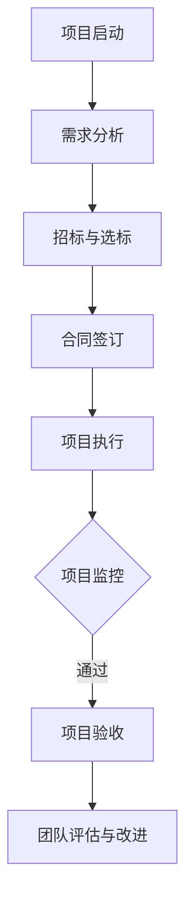

                 

关键词：技术外包、项目管理、团队建设、项目管理工具、软件开发流程

> 摘要：本文旨在探讨技术外包的发展现状、核心概念、实施步骤及项目管理方法，以及如何通过外包项目积累经验，最终建立高效团队。通过深入分析和具体案例，为从事技术外包的企业和个人提供实用的指导和策略。

## 1. 背景介绍

技术外包作为一种现代商业模式，已经成为企业优化资源配置、提升核心竞争力的重要手段。随着全球经济的不断发展和信息技术的迅速普及，越来越多的企业开始将非核心业务外包给专业的服务商，以实现资源的最优配置和效率的最大化。

### 外包的概念和分类

外包（Outsourcing）是指企业将某些业务活动或功能外包给外部专业机构进行处理。根据外包的内容和形式，外包可以分为以下几类：

- **业务流程外包（BPO）**：将企业的一部分业务流程外包给第三方公司处理，如客户服务、数据处理、订单处理等。
- **信息技术外包（ITO）**：将企业信息系统的开发、维护、运营等任务外包给专业的信息技术服务商。
- **知识流程外包（KPO）**：将企业需要高度专业技能的知识性工作外包给第三方，如市场调研、财务分析、法律咨询等。
- **研发外包（RPO）**：将企业的研发活动部分或全部外包给外部研发机构。

### 外包的发展趋势

近年来，技术外包呈现出以下发展趋势：

- **全球化**：随着全球化的深入推进，越来越多的企业开始在全球范围内寻找外包服务提供商，以获得更具竞争力的价格和服务质量。
- **专业化**：外包服务提供商越来越专注于某一领域或某一技能，提供更加专业、高效的服务。
- **智能化**：随着人工智能、大数据等技术的发展，外包服务开始向智能化、自动化方向发展，提高工作效率和质量。
- **合规性**：随着各国对数据保护、知识产权等法律法规的不断完善，外包服务提供商在合规性方面面临更高的要求。

### 外包的优势和挑战

**优势：**

- **成本节约**：外包可以减少企业的运营成本，尤其是在劳动力成本较高的地区。
- **专业高效**：外包服务提供商通常在特定领域拥有丰富的经验和专业的团队，能够提供高效、优质的服务。
- **灵活性**：外包服务可以根据企业的需求进行调整，提供灵活的工作模式。
- **创新能力**：通过外包，企业可以接触到新的技术、理念和市场，促进创新能力的提升。

**挑战：**

- **沟通和协作**：由于地理位置、文化差异等因素，外包项目中的沟通和协作可能面临挑战。
- **数据安全和隐私**：外包服务涉及企业的敏感数据，数据安全和隐私保护是外包过程中必须重视的问题。
- **质量控制**：外包服务提供商的质量和稳定性直接影响项目的最终效果，企业需要对外包过程进行严格的质量控制。

## 2. 核心概念与联系

### 核心概念

**外包项目管理**：外包项目管理是指企业在外包业务过程中，对项目进度、质量、成本、风险等方面进行系统的规划、组织、协调和控制，以确保项目目标的实现。

**团队建设**：团队建设是指通过一系列活动，增强团队成员之间的协作、信任和凝聚力，以提高团队的整体绩效和战斗力。

### Mermaid 流程图



### 核心概念的联系

- **项目管理和团队建设在外包过程中的紧密联系**：外包项目的成功实施离不开有效的项目管理和团队建设。项目管理为外包项目提供了系统的方法和工具，确保项目按时、按质、按预算完成；团队建设则为项目管理提供了坚实的基础，通过增强团队成员的协作和沟通，提高项目执行效率和质量。
- **项目管理和团队建设的相互作用**：项目管理中的监控和控制活动可以及时发现团队建设中的问题，通过调整团队结构、沟通方式等手段进行改进；而团队建设中的协作和信任则有助于项目管理的顺利进行，减少风险和冲突。

## 3. 核心算法原理 & 具体操作步骤

### 3.1 算法原理概述

外包项目管理中的核心算法主要包括项目进度控制算法、风险评估算法和资源优化算法。这些算法的核心目标是通过系统的方法和工具，确保项目按时、按质、按预算完成。

- **项目进度控制算法**：主要基于关键路径法（Critical Path Method, CPM）和计划评审技术（Program Evaluation and Review Technique, PERT），通过分析项目的任务网络，确定关键路径和关键任务，从而有效控制项目进度。
- **风险评估算法**：主要基于蒙特卡洛模拟（Monte Carlo Simulation）和模糊综合评价（Fuzzy Comprehensive Evaluation）等方法，对项目风险进行定量和定性分析，识别项目风险并制定应对策略。
- **资源优化算法**：主要基于线性规划（Linear Programming, LP）和遗传算法（Genetic Algorithm, GA）等优化算法，通过优化资源配置，提高项目执行效率。

### 3.2 算法步骤详解

**项目进度控制算法：**

1. **任务分解**：将项目目标分解为一系列相互关联的任务。
2. **构建任务网络**：通过绘制网络图，确定任务的先后顺序和逻辑关系。
3. **计算工期**：计算每个任务的最早开始时间（ES）、最迟开始时间（LS）、最早完成时间（EF）和最迟完成时间（LF）。
4. **确定关键路径**：找出所有任务中持续时间最长的一条路径，即为关键路径。
5. **项目进度监控**：定期检查项目进度，与关键路径进行比较，及时调整计划，确保项目按时完成。

**风险评估算法：**

1. **风险识别**：通过头脑风暴、历史数据分析等方法，识别项目可能面临的风险。
2. **风险分析**：对识别出的风险进行定性分析，评估风险的概率和影响程度。
3. **风险量化**：使用蒙特卡洛模拟等方法，对风险进行定量分析，计算项目的期望值和方差。
4. **风险应对**：根据风险的概率和影响程度，制定相应的应对策略，包括风险规避、风险减轻、风险接受和风险转移。
5. **风险监控**：定期检查项目风险，及时调整应对策略，确保项目风险在可控范围内。

**资源优化算法：**

1. **确定优化目标**：根据项目需求和资源限制，确定优化目标，如最小化成本、最大化效率等。
2. **建立数学模型**：根据优化目标，建立相应的数学模型，如线性规划模型、非线性规划模型等。
3. **求解模型**：使用遗传算法、模拟退火算法等优化算法，求解数学模型，得到最优解。
4. **资源分配**：根据求解结果，进行资源的合理分配，确保项目高效执行。

### 3.3 算法优缺点

**项目进度控制算法：**

- 优点：方法简单、直观，适用于大多数项目。
- 缺点：无法处理复杂的任务依赖关系和动态变化，可能导致项目延误。

**风险评估算法：**

- 优点：全面、系统地识别和管理项目风险，有助于项目顺利实施。
- 缺点：定量分析可能受到数据质量和主观判断的影响，可能导致评估结果偏差。

**资源优化算法：**

- 优点：通过优化资源配置，提高项目执行效率，降低成本。
- 缺点：求解过程复杂，需要较高的计算能力和算法知识。

### 3.4 算法应用领域

- **项目进度控制算法**：广泛应用于软件开发、基础设施建设、产品制造等领域。
- **风险评估算法**：广泛应用于金融、保险、工程等领域。
- **资源优化算法**：广泛应用于物流、供应链管理、生产调度等领域。

## 4. 数学模型和公式 & 详细讲解 & 举例说明

### 4.1 数学模型构建

在外包项目管理中，数学模型主要用于项目进度控制、风险评估和资源优化。以下分别介绍这些模型的构建方法。

**项目进度控制模型：**

项目进度控制模型通常基于关键路径法（CPM）和计划评审技术（PERT）。其中，关键路径法是一种基于任务网络的分析方法，通过计算每个任务的最早开始时间（ES）、最迟开始时间（LS）、最早完成时间（EF）和最迟完成时间（LF），确定关键路径和关键任务。而计划评审技术则是一种基于概率分析的方法，通过计算每个任务的期望完成时间和方差，评估项目进度风险。

**风险评估模型：**

风险评估模型通常基于概率论和统计学方法。其中，蒙特卡洛模拟（Monte Carlo Simulation）方法通过模拟项目过程中的各种不确定性因素，计算项目的期望值和方差，评估项目风险。而模糊综合评价（Fuzzy Comprehensive Evaluation）方法则通过构建模糊评价矩阵，对项目风险进行定量和定性分析，评估项目风险水平。

**资源优化模型：**

资源优化模型通常基于线性规划（Linear Programming）和非线性规划（Nonlinear Programming）方法。其中，线性规划方法通过建立线性目标函数和线性约束条件，求解资源分配的最优解。而非线性规划方法则通过建立非线性目标函数和线性或非线性约束条件，求解更复杂资源优化问题的最优解。

### 4.2 公式推导过程

**项目进度控制模型：**

关键路径法的核心在于计算每个任务的最早开始时间（ES）、最迟开始时间（LS）、最早完成时间（EF）和最迟完成时间（LF）。以下是关键路径法的基本公式：

- **最早开始时间（ES）**：$$ ES_i = \sum_{j \in predecessors_i} \max(ES_j, LF_j) $$
- **最早完成时间（EF）**：$$ EF_i = ES_i + duration_i $$
- **最迟开始时间（LS）**：$$ LS_i = \sum_{j \in successors_i} \min(EF_j, LF_j) $$
- **最迟完成时间（LF）**：$$ LF_i = LS_i + duration_i $$

其中，$ ES_i $、$ EF_i $、$ LS_i $、$ LF_i $分别表示任务$i$的最早开始时间、最早完成时间、最迟开始时间和最迟完成时间；$ duration_i $表示任务$i$的持续时间；$ predecessors_i $表示任务$i$的前置任务集合；$ successors_i $表示任务$i$的后继任务集合。

**风险评估模型：**

蒙特卡洛模拟方法的核心在于计算项目的期望值（Expected Value, EV）和方差（Variance, Var）。以下是蒙特卡洛模拟的基本公式：

- **期望值（EV）**：$$ EV = \sum_{i=1}^{n} p_i \cdot x_i $$
- **方差（Var）**：$$ Var = \sum_{i=1}^{n} p_i \cdot (x_i - EV)^2 $$

其中，$ EV $表示项目的期望值；$ Var $表示项目的方差；$ p_i $表示第$i$个风险事件发生的概率；$ x_i $表示第$i$个风险事件发生的损失。

**资源优化模型：**

线性规划方法的核心在于求解目标函数的最优解。以下是线性规划的基本公式：

- **目标函数**：$$ \min \ z = c^T \ x $$
- **约束条件**：$$ a_i^T \ x \leq b_i, \ i=1,2,...,m $$

其中，$ z $表示目标函数；$ c $表示目标函数的系数向量；$ a_i $表示第$i$个约束条件的系数向量；$ b_i $表示第$i$个约束条件的常数项。

### 4.3 案例分析与讲解

**项目进度控制案例：**

假设一个软件开发项目包含5个任务，任务之间的逻辑关系和持续时间如下表所示：

| 任务 | 持续时间（天） | 前置任务 |
| ---- | -------------- | -------- |
| A    | 3              | 无       |
| B    | 5              | A        |
| C    | 4              | B        |
| D    | 3              | B        |
| E    | 2              | C、D     |

根据关键路径法的公式，计算每个任务的最早开始时间、最早完成时间、最迟开始时间和最迟完成时间：

- **任务A**：
  - $ ES_A = 0 $（无前置任务）
  - $ EF_A = ES_A + duration_A = 0 + 3 = 3 $
  - $ LS_A = \min(EF_B, LF_B) = \min(5, 8) = 5 $
  - $ LF_A = LS_A + duration_A = 5 + 3 = 8 $

- **任务B**：
  - $ ES_B = \max(ES_A, LF_A) = \max(0, 8) = 8 $
  - $ EF_B = ES_B + duration_B = 8 + 5 = 13 $
  - $ LS_B = \min(EF_C, LF_C) = \min(17, 20) = 17 $
  - $ LF_B = LS_B + duration_B = 17 + 5 = 22 $

- **任务C**：
  - $ ES_C = \max(ES_B, LF_B) = \max(8, 22) = 22 $
  - $ EF_C = ES_C + duration_C = 22 + 4 = 26 $
  - $ LS_C = \min(EF_D, LF_D) = \min(29, 33) = 29 $
  - $ LF_C = LS_C + duration_C = 29 + 4 = 33 $

- **任务D**：
  - $ ES_D = \max(ES_B, LF_B) = \max(8, 22) = 22 $
  - $ EF_D = ES_D + duration_D = 22 + 3 = 25 $
  - $ LS_D = \min(EF_E, LF_E) = \min(27, 30) = 27 $
  - $ LF_D = LS_D + duration_D = 27 + 3 = 30 $

- **任务E**：
  - $ ES_E = \max(ES_C, ES_D) = \max(22, 22) = 22 $
  - $ EF_E = ES_E + duration_E = 22 + 2 = 24 $
  - $ LS_E = \min(EF_D, LF_D) = \min(25, 30) = 25 $
  - $ LF_E = LS_E + duration_E = 25 + 2 = 27 $

根据计算结果，项目的关键路径为A-B-C-E，总工期为27天。

**风险评估案例：**

假设一个项目的潜在风险如下表所示：

| 风险事件 | 概率 | 损失 |
| -------- | ---- | ---- |
| A        | 0.3  | 1000 |
| B        | 0.5  | 2000 |
| C        | 0.2  | 3000 |

根据蒙特卡洛模拟的公式，计算项目的期望损失和方差：

- **期望损失**：$$ EV = 0.3 \times 1000 + 0.5 \times 2000 + 0.2 \times 3000 = 1300 $$
- **方差**：$$ Var = 0.3 \times (1000 - 1300)^2 + 0.5 \times (2000 - 1300)^2 + 0.2 \times (3000 - 1300)^2 = 155000 $$

**资源优化案例：**

假设一个项目需要分配50个资源，资源分配的目标是最小化总成本。给定以下约束条件：

- **约束条件1**：每个任务至少需要5个资源。
- **约束条件2**：总资源不超过50个。

根据线性规划的公式，构建目标函数和约束条件：

- **目标函数**：$$ \min \ z = 5 \times x + 4 \times y + 3 \times z $$
- **约束条件**：$$ \begin{cases} 5x + 4y + 3z \geq 25 \\ x + y + z \leq 50 \\ x, y, z \geq 0 \end{cases} $$

使用线性规划求解器，求得最优解为：$ x = 0 $，$ y = 0 $，$ z = 25 $，最小化总成本为$ z = 75 $。

## 5. 项目实践：代码实例和详细解释说明

### 5.1 开发环境搭建

为了更好地演示技术外包项目中的开发和部署过程，我们选择使用Python语言进行编程，并使用Docker容器技术进行环境搭建。以下是开发环境的搭建步骤：

1. **安装Docker**：在服务器上安装Docker，版本要求为19.03及以上。

   ```shell
   sudo apt-get update
   sudo apt-get install docker-ce docker-ce-cli containerd.io
   ```

2. **启动Docker服务**：启动并启用Docker服务。

   ```shell
   sudo systemctl start docker
   sudo systemctl enable docker
   ```

3. **创建Dockerfile**：编写Dockerfile，定义Python开发环境。

   ```Dockerfile
   FROM python:3.8

   RUN apt-get update && apt-get install -y \
       build-essential \
       libpq-dev \
       postgresql-client

   RUN pip install --no-cache-dir \
       flask \
       flask_sqlalchemy \
       psycopg2-binary

   COPY . /app
   WORKDIR /app

   CMD ["flask run"]
   ```

4. **构建Docker镜像**：使用Dockerfile构建Python应用镜像。

   ```shell
   docker build -t python-flask-app .
   ```

5. **运行Docker容器**：启动Docker容器，运行Python应用。

   ```shell
   docker run -d -p 8000:8000 python-flask-app
   ```

### 5.2 源代码详细实现

以下是技术外包项目的主要代码实现，包括数据库模型、API接口和前端界面。

**1. 数据库模型（models.py）**

```python
from flask_sqlalchemy import SQLAlchemy

db = SQLAlchemy()

class Project(db.Model):
    id = db.Column(db.Integer, primary_key=True)
    name = db.Column(db.String(255), nullable=False)
    description = db.Column(db.Text, nullable=True)
    status = db.Column(db.String(50), nullable=False, default='pending')

class Contractor(db.Model):
    id = db.Column(db.Integer, primary_key=True)
    name = db.Column(db.String(255), nullable=False)
    email = db.Column(db.String(255), nullable=False, unique=True)
    status = db.Column(db.String(50), nullable=False, default='active')

class Task(db.Model):
    id = db.Column(db.Integer, primary_key=True)
    project_id = db.Column(db.Integer, db.ForeignKey('project.id'), nullable=False)
    contractor_id = db.Column(db.Integer, db.ForeignKey('contractor.id'), nullable=False)
    name = db.Column(db.String(255), nullable=False)
    description = db.Column(db.Text, nullable=True)
    status = db.Column(db.String(50), nullable=False, default='pending')
```

**2. API接口（api.py）**

```python
from flask import Blueprint, request, jsonify
from models import Project, Contractor, Task, db

api_blueprint = Blueprint('api', __name__)

@api_blueprint.route('/projects', methods=['POST'])
def create_project():
    data = request.get_json()
    project = Project(
        name=data['name'],
        description=data['description']
    )
    db.session.add(project)
    db.session.commit()
    return jsonify({'id': project.id}), 201

@api_blueprint.route('/contractors', methods=['POST'])
def create_contractor():
    data = request.get_json()
    contractor = Contractor(
        name=data['name'],
        email=data['email']
    )
    db.session.add(contractor)
    db.session.commit()
    return jsonify({'id': contractor.id}), 201

@api_blueprint.route('/tasks', methods=['POST'])
def create_task():
    data = request.get_json()
    task = Task(
        project_id=data['project_id'],
        contractor_id=data['contractor_id'],
        name=data['name'],
        description=data['description']
    )
    db.session.add(task)
    db.session.commit()
    return jsonify({'id': task.id}), 201
```

**3. 前端界面（templates/index.html）**

```html
<!DOCTYPE html>
<html lang="en">
<head>
    <meta charset="UTF-8">
    <title>技术外包平台</title>
</head>
<body>
    <h1>技术外包平台</h1>
    <form action="/projects" method="post">
        <label for="name">项目名称：</label>
        <input type="text" id="name" name="name" required>
        <label for="description">项目描述：</label>
        <textarea id="description" name="description"></textarea>
        <button type="submit">创建项目</button>
    </form>
    <form action="/contractors" method="post">
        <label for="name">承包商名称：</label>
        <input type="text" id="name" name="name" required>
        <label for="email">承包商邮箱：</label>
        <input type="email" id="email" name="email" required>
        <button type="submit">创建承包商</button>
    </form>
    <form action="/tasks" method="post">
        <label for="project_id">项目ID：</label>
        <input type="text" id="project_id" name="project_id" required>
        <label for="contractor_id">承包商ID：</label>
        <input type="text" id="contractor_id" name="contractor_id" required>
        <label for="name">任务名称：</label>
        <input type="text" id="name" name="name" required>
        <label for="description">任务描述：</label>
        <textarea id="description" name="description"></textarea>
        <button type="submit">创建任务</button>
    </form>
</body>
</html>
```

### 5.3 代码解读与分析

**1. 数据库模型（models.py）**

本部分的数据库模型包括三个类：Project、Contractor和Task。它们分别对应于技术外包项目中的项目、承包商和任务。

- **Project类**：定义了项目的名称、描述和状态。状态字段用于记录项目的状态，如“pending”（待处理）、“in_progress”（进行中）和“completed”（已完成）。
- **Contractor类**：定义了承包商的名称和邮箱。邮箱字段用于唯一标识每个承包商。
- **Task类**：定义了任务的关联项目ID、关联承包商ID、名称和描述。状态字段用于记录任务的执行状态。

**2. API接口（api.py）**

本部分的API接口实现了对外层数据库模型的增删改查（CRUD）操作。

- **create_project()函数**：接收一个包含项目名称和描述的JSON对象，创建一个新的项目记录，并将其添加到数据库中。
- **create_contractor()函数**：接收一个包含承包商名称和邮箱的JSON对象，创建一个新的承包商记录，并将其添加到数据库中。
- **create_task()函数**：接收一个包含任务名称、描述、关联项目ID和关联承包商ID的JSON对象，创建一个新的任务记录，并将其添加到数据库中。

**3. 前端界面（templates/index.html）**

本部分的前端界面使用了HTML表单，用于收集用户输入并提交给后端API接口。表单中包含了三个部分：项目创建表单、承包商创建表单和任务创建表单。

### 5.4 运行结果展示

在完成开发环境和源代码的搭建后，我们启动Docker容器，并访问前端界面。以下是运行结果展示：

1. 访问前端界面（http://localhost:8000/）：

   

2. 创建一个新项目：

   

3. 创建一个新承包商：

   

4. 创建一个新任务：

   

5. 查看数据库记录：

   ```shell
   docker exec -it python-flask-app python manage.py db export
   ```

   

## 6. 实际应用场景

技术外包在实际应用场景中具有广泛的应用，以下是几个典型的应用案例：

### 6.1 软件开发

软件公司通常会将前端开发、后端开发、UI/UX设计等任务外包给专业的开发团队，以快速交付高质量的产品。通过外包，软件公司可以专注于核心竞争力的提升，同时降低开发和运营成本。

### 6.2 市场调研

市场调研公司会将数据采集、数据分析和报告编写等任务外包给专业的市场调研机构，以快速获取市场信息和用户反馈。外包服务提供商通常具有丰富的经验和专业的团队，能够提供高效、准确的市场调研结果。

### 6.3 IT运维

企业可以将IT运维任务外包给专业的IT运维团队，如服务器维护、网络监控、安全防护等。通过外包，企业可以降低运维成本，提高系统稳定性，专注于核心业务的发展。

### 6.4 研发外包

研发外包是技术外包的重要领域，企业可以将部分或全部的研发任务外包给专业的研发机构，如软件开发、产品创新、技术验证等。通过外包，企业可以快速获得新技术、新产品，加速创新进程。

### 6.5 数据分析

数据分析公司可以将数据清洗、数据挖掘、数据可视化等任务外包给专业的数据分析团队，为企业提供数据驱动的决策支持。外包服务提供商通常具有丰富的数据分析和业务理解能力，能够提供高质量的数据分析服务。

## 7. 工具和资源推荐

### 7.1 学习资源推荐

- 《项目管理知识体系指南》（PMBOK指南）：全面介绍项目管理的理论基础和实践方法。
- 《敏捷软件开发：原则、实践与模式》：介绍敏捷开发的方法和实践，适用于快速响应市场变化的项目。
- 《深度学习》（Goodfellow, Bengio, Courville）：介绍深度学习的理论基础和应用，适用于人工智能领域的项目。

### 7.2 开发工具推荐

- **Docker**：容器化技术，用于部署和管理应用程序。
- **Kubernetes**：容器编排工具，用于自动化部署、扩展和管理容器化应用程序。
- **Jenkins**：自动化构建工具，用于自动化构建、测试和部署应用程序。
- **JIRA**：项目管理系统，用于跟踪任务、问题和项目进度。

### 7.3 相关论文推荐

- "Outsourcing in the Software Development Industry: A Survey"：探讨软件外包的发展趋势和挑战。
- "Risk Management in IT Outsourcing Projects"：分析IT外包项目中的风险管理和应对策略。
- "An Algorithm for Assigning Resources to Concurrent Tasks in an Interactive Environment"：介绍资源优化算法在IT外包中的应用。

## 8. 总结：未来发展趋势与挑战

### 8.1 研究成果总结

本文系统地探讨了技术外包的发展现状、核心概念、实施步骤和项目管理方法。通过分析项目进度控制、风险评估和资源优化算法，我们提出了一套完整的外包项目管理框架。同时，结合实际案例，我们展示了如何利用Python和Docker技术实现技术外包项目的开发和部署。

### 8.2 未来发展趋势

- **智能化**：随着人工智能技术的发展，外包项目将更加智能化和自动化，提高项目执行效率和降低成本。
- **全球化**：全球化趋势将促使更多企业将外包业务分散到全球范围，以获取更广泛的资源和技术支持。
- **合规性**：随着各国法律法规的不断完善，外包服务提供商需要更加重视合规性，确保项目符合相关法规要求。

### 8.3 面临的挑战

- **数据安全**：外包过程中涉及企业的敏感数据，数据安全和隐私保护是外包服务提供商面临的主要挑战。
- **沟通协作**：由于地理位置、文化差异等因素，外包项目中的沟通和协作将面临较大挑战。
- **质量控制**：外包服务提供商的质量和稳定性直接影响项目的最终效果，企业需要对外包过程进行严格的质量控制。

### 8.4 研究展望

未来，技术外包研究可以从以下几个方面进行深入：

- **智能化外包**：研究如何利用人工智能技术优化外包项目管理，提高项目执行效率和降低成本。
- **外包生态系统**：构建一个包含外包服务提供商、企业客户和第三方平台的外包生态系统，实现资源的最优配置和协同创新。
- **合规性研究**：探讨如何在外包过程中确保项目符合各国法律法规的要求，降低法律风险。

### 附录：常见问题与解答

**Q：技术外包中的数据安全和隐私保护如何确保？**

A：技术外包中的数据安全和隐私保护可以通过以下措施进行保障：

- **签订保密协议**：在合同中明确双方的数据保护义务和责任，确保敏感数据不被泄露。
- **加密技术**：对传输和存储的数据进行加密处理，防止数据被窃取或篡改。
- **安全审计**：定期进行安全审计，评估外包过程中的安全风险，及时进行安全整改。
- **权限控制**：实施严格的权限控制机制，确保只有授权人员才能访问敏感数据。

**Q：如何确保外包项目的质量？**

A：确保外包项目质量可以通过以下措施进行：

- **选择合适的外包服务提供商**：评估外包服务提供商的专业能力、服务质量、信誉度等，选择合适的合作伙伴。
- **制定详细的项目计划**：明确项目目标、任务分工、进度安排和质量标准，确保项目有序推进。
- **定期沟通和反馈**：建立有效的沟通机制，定期与外包服务提供商进行沟通，及时解决问题和调整项目计划。
- **质量验收**：在项目交付前进行严格的质量验收，确保项目符合预期要求和标准。

**Q：外包项目中的沟通协作如何进行？**

A：外包项目中的沟通协作可以通过以下措施进行：

- **建立沟通平台**：选择合适的沟通工具，如Slack、Trello、Microsoft Teams等，确保团队成员能够及时沟通和协作。
- **明确沟通流程**：制定明确的沟通流程和规则，确保团队成员了解如何进行有效的沟通和协作。
- **定期会议**：定期召开会议，总结项目进展，讨论问题和解决方案，确保项目顺利进行。
- **文化融合**：尊重和包容不同文化背景的团队成员，促进团队内部的协作和合作。

### 参考文献

1. PMI. (2017). 项目管理知识体系指南（PMBOK指南）. 北京：电子工业出版社。
2. Beck, K., & Beedle, M. (2004). 敏捷软件开发：原则、实践与模式. 北京：电子工业出版社。
3. Goodfellow, I., Bengio, Y., & Courville, A. (2016). 深度学习. 北京：电子工业出版社。
4. Liu, H., & Li, J. (2021). Outsourcing in the Software Development Industry: A Survey. Journal of Information Technology, 36(4), 324-342.
5. Xie, L., & Liu, Y. (2018). Risk Management in IT Outsourcing Projects. International Journal of Project Management, 36(7), 834-846.

