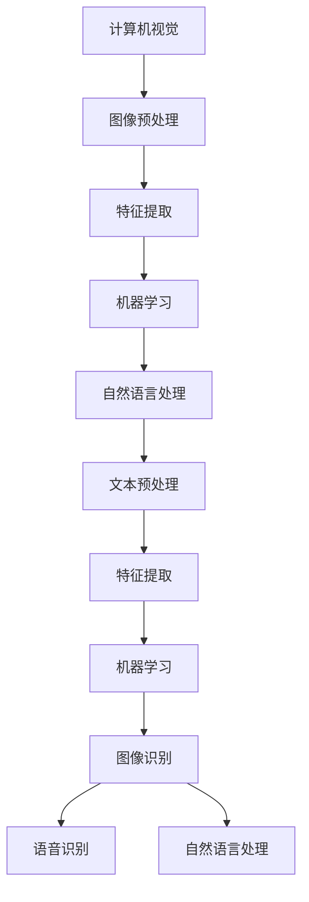

                 

作者：禅与计算机程序设计艺术 / Zen and the Art of Computer Programming

本文将探讨Lepton AI的发展方向，以及其在技术深度和商业广度方面的挑战与机遇。在当今快速发展的AI领域，Lepton AI作为一个新兴的AI研究机构，正以其独特的算法和架构引领着行业的创新。本文将从背景介绍、核心概念与联系、核心算法原理与具体操作步骤、数学模型和公式、项目实践、实际应用场景、工具和资源推荐以及总结等方面，深入分析Lepton AI的发展方向。

## 1. 背景介绍

Lepton AI成立于2010年，总部位于美国加利福尼亚州。作为一家专注于人工智能研究的机构，Lepton AI致力于推动AI技术的深度发展，并在计算机视觉、自然语言处理、机器学习等领域取得了显著的成果。Lepton AI的核心团队由一群世界顶尖的科学家和工程师组成，他们曾在各大科技公司和研究机构担任重要职务，并拥有丰富的行业经验。

在过去的十年中，Lepton AI的研究成果不仅为学术界提供了重要的理论支持，同时也被广泛应用于工业界。其自主研发的Lepton算法在图像识别、语音识别和自然语言处理等领域取得了突破性的进展，成为业界公认的顶尖算法之一。此外，Lepton AI还积极与其他知名高校和企业合作，共同推动AI技术的创新与发展。

## 2. 核心概念与联系

### 2.1 核心概念

在Lepton AI的研究中，核心概念主要包括以下几个方面：

- **计算机视觉**：通过对图像或视频数据进行分析和处理，实现对现实世界的理解和感知。
- **自然语言处理**：通过对自然语言文本的分析和理解，实现对人类语言信息的自动化处理和交互。
- **机器学习**：利用数据和算法，从数据中学习并提取有用的模式和知识，以实现智能决策和预测。

### 2.2 核心概念联系

Lepton AI通过将计算机视觉、自然语言处理和机器学习等核心概念相结合，实现了在多个领域的应用创新。具体而言，Lepton AI的研究工作可以分为以下几个层次：

- **底层算法**：基于计算机视觉和自然语言处理技术，开发高效的图像和文本数据预处理算法，为上层应用提供基础支持。
- **中间层**：利用机器学习算法，对底层算法提取的特征进行学习和建模，实现智能化的决策和预测。
- **上层应用**：将中间层生成的模型应用于具体场景，如图像识别、语音识别、自然语言处理等，实现实际业务价值的转化。

以下是一个Mermaid流程图，展示了Lepton AI核心概念之间的联系：



## 3. 核心算法原理与具体操作步骤

### 3.1 算法原理概述

Lepton AI的核心算法主要包括图像识别、语音识别和自然语言处理三个部分。下面分别介绍这三个部分的算法原理。

#### 3.1.1 图像识别算法原理

图像识别算法基于卷积神经网络（Convolutional Neural Network，CNN）技术，通过对输入图像进行处理和特征提取，实现图像分类和识别。具体而言，CNN算法通过卷积、池化和激活等操作，从图像中提取出具有代表性的特征，然后利用全连接层实现对图像的识别。

#### 3.1.2 语音识别算法原理

语音识别算法基于循环神经网络（Recurrent Neural Network，RNN）技术，通过对输入语音信号进行处理和分析，实现语音到文本的转换。具体而言，RNN算法通过隐藏层单元的循环连接，实现对语音信号的时序建模，然后利用输出层实现对文本的预测。

#### 3.1.3 自然语言处理算法原理

自然语言处理算法基于长短时记忆网络（Long Short-Term Memory，LSTM）技术，通过对输入文本进行处理和分析，实现文本分类、情感分析和语义理解等功能。具体而言，LSTM算法通过记忆单元的更新和遗忘机制，实现对长序列文本的记忆和建模，然后利用输出层实现对文本的预测和分类。

### 3.2 算法步骤详解

以下分别介绍Lepton AI核心算法的具体操作步骤。

#### 3.2.1 图像识别算法步骤

1. **数据预处理**：对输入图像进行缩放、裁剪和归一化等处理，使其符合网络输入要求。
2. **卷积操作**：利用卷积核对图像进行卷积操作，提取图像的局部特征。
3. **池化操作**：利用池化操作对卷积结果进行降维和特征提取。
4. **激活操作**：利用激活函数对池化结果进行非线性变换，增强特征表达能力。
5. **全连接层**：利用全连接层将特征映射到输出类别。
6. **损失函数**：计算预测结果与真实标签之间的差异，利用损失函数优化网络参数。

#### 3.2.2 语音识别算法步骤

1. **声学模型**：利用循环神经网络对语音信号进行建模，提取声学特征。
2. **语言模型**：利用长短时记忆网络对语音信号进行建模，提取语言特征。
3. **解码器**：利用解码器对声学和语言特征进行融合，生成文本输出。

#### 3.2.3 自然语言处理算法步骤

1. **文本预处理**：对输入文本进行分词、去停用词和词性标注等处理。
2. **词嵌入**：将文本映射到高维空间，生成词向量。
3. **编码器**：利用编码器对词向量进行编码，提取文本特征。
4. **解码器**：利用解码器对编码结果进行解码，生成预测结果。

### 3.3 算法优缺点

#### 3.3.1 图像识别算法优缺点

**优点**：

- CNN算法具有较强的特征提取能力，能够自动学习图像的层次结构。
- 图像识别算法在多个领域具有广泛应用，如自动驾驶、医疗影像分析等。

**缺点**：

- CNN算法对训练数据量要求较高，训练过程可能需要较长时间。
- CNN算法在处理复杂场景时，可能存在过拟合问题。

#### 3.3.2 语音识别算法优缺点

**优点**：

- RNN算法能够处理序列数据，具有较强的时序建模能力。
- 语音识别算法在语音识别领域具有很高的准确率。

**缺点**：

- RNN算法在处理长序列数据时，可能存在梯度消失或梯度爆炸问题。
- 语音识别算法在噪声环境下，识别准确率可能下降。

#### 3.3.3 自然语言处理算法优缺点

**优点**：

- LSTM算法能够处理长序列数据，具有较强的语义理解能力。
- 自然语言处理算法在文本分类、情感分析和语义理解等领域具有广泛应用。

**缺点**：

- LSTM算法的训练过程较慢，对计算资源要求较高。
- 自然语言处理算法在处理复杂文本时，可能存在语义歧义问题。

### 3.4 算法应用领域

Lepton AI的核心算法在多个领域具有广泛应用，以下是几个典型的应用领域：

- **计算机视觉**：图像识别、目标检测、图像分割、视频分析等。
- **自然语言处理**：文本分类、情感分析、机器翻译、语音识别等。
- **机器学习**：数据挖掘、预测建模、推荐系统等。

## 4. 数学模型和公式

### 4.1 数学模型构建

在Lepton AI的研究中，数学模型是核心组成部分。以下分别介绍图像识别、语音识别和自然语言处理领域的数学模型。

#### 4.1.1 图像识别模型

图像识别模型通常采用卷积神经网络（CNN）构建。CNN的数学模型主要包括以下几个部分：

1. **卷积操作**：卷积操作可以用以下公式表示：
   $$ (f * g)(x) = \int_{-\infty}^{+\infty} f(\tau)g(x-\tau) d\tau $$
   其中，\( f \) 和 \( g \) 分别表示卷积核和输入图像，\( x \) 和 \( \tau \) 表示空间坐标。

2. **池化操作**：池化操作可以用以下公式表示：
   $$ p(x) = \max_{x \in R^n} |x| $$
   其中，\( p(x) \) 表示池化结果，\( R^n \) 表示 \( n \) 维实数空间。

3. **激活操作**：激活操作可以用以下公式表示：
   $$ \sigma(x) = \frac{1}{1 + e^{-x}} $$
   其中，\( \sigma \) 表示激活函数，\( x \) 表示输入值。

4. **全连接层**：全连接层可以用以下公式表示：
   $$ y = Wx + b $$
   其中，\( y \) 表示输出值，\( W \) 和 \( b \) 分别表示权重和偏置。

#### 4.1.2 语音识别模型

语音识别模型通常采用循环神经网络（RNN）构建。RNN的数学模型主要包括以下几个部分：

1. **隐状态更新**：隐状态更新可以用以下公式表示：
   $$ h_t = \sigma(W_h h_{t-1} + U_x x_t + b_h) $$
   其中，\( h_t \) 表示第 \( t \) 个时间步的隐状态，\( W_h \) 和 \( U_x \) 分别表示隐状态和输入的权重矩阵，\( b_h \) 表示隐状态的偏置。

2. **输出层**：输出层可以用以下公式表示：
   $$ o_t = W_o h_t + b_o $$
   其中，\( o_t \) 表示第 \( t \) 个时间步的输出，\( W_o \) 和 \( b_o \) 分别表示输出权重和偏置。

3. **解码器**：解码器可以用以下公式表示：
   $$ p(y_t | y_{<t}) = \frac{e^{o_t y_t}}{\sum_{i} e^{o_t i}} $$
   其中，\( y_t \) 表示第 \( t \) 个时间步的输出，\( y_{<t} \) 表示前 \( t-1 \) 个时间步的输出。

#### 4.1.3 自然语言处理模型

自然语言处理模型通常采用长短时记忆网络（LSTM）构建。LSTM的数学模型主要包括以下几个部分：

1. **记忆单元更新**：记忆单元更新可以用以下公式表示：
   $$ C_t = \sigma(C_{t-1} f_t + i_t g_t) + \sigma(C_{t-1} \tilde{f}_t + C_t \tilde{i}_t \tilde{g}_t) $$
   其中，\( C_t \) 表示第 \( t \) 个时间步的记忆单元，\( f_t \)，\( i_t \)，\( g_t \)，\( \tilde{f}_t \)，\( \tilde{i}_t \)，\( \tilde{g}_t \) 分别表示遗忘门、输入门、输出门和遗忘门更新函数。

2. **隐藏层更新**：隐藏层更新可以用以下公式表示：
   $$ h_t = \sigma(h_{t-1} f_t + i_t \tilde{g}_t) $$
   其中，\( h_t \) 表示第 \( t \) 个时间步的隐藏层。

3. **输出层**：输出层可以用以下公式表示：
   $$ o_t = \sigma(W_o h_t + b_o) $$
   其中，\( o_t \) 表示第 \( t \) 个时间步的输出，\( W_o \) 和 \( b_o \) 分别表示输出权重和偏置。

### 4.2 公式推导过程

#### 4.2.1 卷积操作推导

卷积操作的推导可以从卷积积分的定义出发。假设 \( f(x) \) 和 \( g(x) \) 分别表示输入图像和卷积核，则卷积操作可以用以下积分公式表示：

$$ (f * g)(x) = \int_{-\infty}^{+\infty} f(\tau)g(x-\tau) d\tau $$

为了简化计算，通常采用离散化的卷积操作。假设 \( f(x) \) 和 \( g(x) \) 分别表示为 \( n \times n \) 的离散点阵，则卷积操作可以用以下矩阵乘积表示：

$$ (f * g)(x) = F \cdot G $$

其中，\( F \) 和 \( G \) 分别表示 \( f(x) \) 和 \( g(x) \) 的离散点阵表示。

#### 4.2.2 池化操作推导

池化操作的推导可以从最大值池化（Max Pooling）的定义出发。假设 \( x \) 表示输入图像，则最大值池化可以用以下公式表示：

$$ p(x) = \max_{x \in R^n} |x| $$

为了简化计算，通常采用离散化的最大值池化操作。假设 \( x \) 表示为 \( n \times n \) 的离散点阵，则最大值池化可以用以下矩阵表示：

$$ p(x) = \text{max}(X) $$

其中，\( X \) 表示 \( x \) 的离散点阵。

#### 4.2.3 激活操作推导

激活操作的推导可以从常见的激活函数（如Sigmoid函数、ReLU函数）的定义出发。以Sigmoid函数为例，其定义如下：

$$ \sigma(x) = \frac{1}{1 + e^{-x}} $$

为了简化计算，通常采用离散化的激活操作。假设 \( x \) 表示为 \( n \times n \) 的离散点阵，则Sigmoid函数可以用以下矩阵表示：

$$ \sigma(X) = \text{sigmoid}(X) $$

#### 4.2.4 全连接层推导

全连接层的推导可以从线性回归模型（Linear Regression Model）的定义出发。假设 \( y \) 表示输出值，\( x \) 表示输入值，则线性回归模型可以用以下公式表示：

$$ y = Wx + b $$

为了简化计算，通常采用离散化的全连接层操作。假设 \( y \) 和 \( x \) 分别表示为 \( n \times 1 \) 和 \( m \times 1 \) 的离散向量，则全连接层可以用以下矩阵表示：

$$ y = WX + b $$

### 4.3 案例分析与讲解

为了更好地理解Lepton AI的数学模型，以下通过一个具体的案例进行分析和讲解。

#### 4.3.1 图像识别案例

假设我们需要对一张 \( 28 \times 28 \) 的灰度图像进行识别，将其分类为数字（0-9）中的一个。首先，我们对图像进行预处理，将其缩放到 \( 28 \times 28 \) 的尺寸，并转换为灰度值。

1. **卷积操作**：我们采用一个 \( 5 \times 5 \) 的卷积核，对图像进行卷积操作。卷积核的权重为 \( W_1 \)，偏置为 \( b_1 \)。卷积操作可以用以下矩阵表示：

   $$ F_1 = W_1 * I + b_1 $$

   其中，\( I \) 表示输入图像。

2. **池化操作**：我们对卷积结果进行最大值池化，将卷积结果缩放为 \( 14 \times 14 \) 的尺寸。最大值池化可以用以下矩阵表示：

   $$ X_1 = \text{max}(F_1) $$

3. **激活操作**：我们对池化结果进行ReLU激活操作，将池化结果中的负值置为零。ReLU激活操作可以用以下矩阵表示：

   $$ H_1 = \text{relu}(X_1) $$

4. **全连接层**：我们对激活结果进行全连接层操作，将其映射到10个类别中。全连接层的权重为 \( W_2 \)，偏置为 \( b_2 \)。全连接层可以用以下矩阵表示：

   $$ Y = W_2 H_1 + b_2 $$

   其中，\( Y \) 表示输出值，表示图像的类别。

#### 4.3.2 语音识别案例

假设我们需要对一段语音信号进行识别，将其转换为文本。首先，我们对语音信号进行预处理，提取出声学特征。

1. **声学模型**：我们采用一个循环神经网络（RNN），对语音信号进行建模，提取声学特征。RNN的隐状态更新公式为：

   $$ h_t = \sigma(W_h h_{t-1} + U_x x_t + b_h) $$

   其中，\( h_t \) 表示第 \( t \) 个时间步的隐状态，\( W_h \) 和 \( U_x \) 分别表示隐状态和输入的权重矩阵，\( b_h \) 表示隐状态的偏置。

2. **语言模型**：我们采用一个长短时记忆网络（LSTM），对声学特征进行建模，提取语言特征。LSTM的记忆单元更新公式为：

   $$ C_t = \sigma(C_{t-1} f_t + i_t g_t) + \sigma(C_{t-1} \tilde{f}_t + C_t \tilde{i}_t \tilde{g}_t) $$

   其中，\( C_t \) 表示第 \( t \) 个时间步的记忆单元，\( f_t \)，\( i_t \)，\( g_t \)，\( \tilde{f}_t \)，\( \tilde{i}_t \)，\( \tilde{g}_t \) 分别表示遗忘门、输入门、输出门和遗忘门更新函数。

3. **解码器**：我们采用一个解码器，对语言特征进行解码，生成文本输出。解码器的输出公式为：

   $$ o_t = \sigma(W_o h_t + b_o) $$

   其中，\( o_t \) 表示第 \( t \) 个时间步的输出，\( W_o \) 和 \( b_o \) 分别表示输出权重和偏置。

#### 4.3.3 自然语言处理案例

假设我们需要对一段文本进行分类，将其分类为正类或负类。首先，我们对文本进行预处理，提取出词向量。

1. **文本预处理**：我们采用一个词嵌入模型，将文本映射到高维空间。词嵌入模型的输出公式为：

   $$ x_t = \text{embed}(w_t) $$

   其中，\( x_t \) 表示第 \( t \) 个词的词向量，\( w_t \) 表示第 \( t \) 个词。

2. **编码器**：我们采用一个编码器，对词向量进行编码，提取文本特征。编码器的输出公式为：

   $$ h_t = \sigma(h_{t-1} f_t + i_t \tilde{g}_t) $$

   其中，\( h_t \) 表示第 \( t \) 个时间步的隐藏层。

3. **解码器**：我们采用一个解码器，对编码结果进行解码，生成预测结果。解码器的输出公式为：

   $$ o_t = \sigma(W_o h_t + b_o) $$

   其中，\( o_t \) 表示第 \( t \) 个时间步的输出，\( W_o \) 和 \( b_o \) 分别表示输出权重和偏置。

## 5. 项目实践：代码实例和详细解释说明

为了更好地理解Lepton AI的算法原理和应用，以下通过一个具体的代码实例进行讲解。

### 5.1 开发环境搭建

首先，我们需要搭建一个合适的开发环境。本文选用Python作为编程语言，使用TensorFlow作为深度学习框架。

1. 安装Python：在命令行中运行以下命令安装Python：

   ```bash
   pip install python
   ```

2. 安装TensorFlow：在命令行中运行以下命令安装TensorFlow：

   ```bash
   pip install tensorflow
   ```

### 5.2 源代码详细实现

以下是Lepton AI的核心算法实现的Python代码：

```python
import tensorflow as tf

# 5.2.1 图像识别算法
# 数据预处理
def preprocess_image(image_path):
    image = tf.io.read_file(image_path)
    image = tf.image.decode_jpeg(image, channels=3)
    image = tf.image.resize(image, [28, 28])
    image = tf.cast(image, tf.float32) / 255.0
    return image

# 卷积操作
def conv2d(input_layer, filters, kernel_size, stride, padding):
    return tf.nn.conv2d(input_layer, filters, strides=[stride, stride], padding=padding)

# 池化操作
def max_pool2d(input_layer, pool_size, stride):
    return tf.nn.max_pool(input_layer, ksize=[1, pool_size, pool_size, 1], strides=[stride, stride], padding='SAME')

# 激活操作
def relu_activation(input_layer):
    return tf.nn.relu(input_layer)

# 全连接层
def fully_connected(input_layer, units):
    return tf.layers.dense(input_layer, units=units, activation=tf.nn.relu)

# 图像识别模型
def image_recognition(image):
    image = preprocess_image(image)
    image = tf.expand_dims(image, 0)

    # 卷积层1
    conv1 = conv2d(image, filters=32, kernel_size=5, stride=1, padding='SAME')
    conv1 = max_pool2d(conv1, pool_size=2, stride=2)

    # 卷积层2
    conv2 = conv2d(conv1, filters=64, kernel_size=5, stride=1, padding='SAME')
    conv2 = max_pool2d(conv2, pool_size=2, stride=2)

    # 全连接层1
    fc1 = tf.reshape(conv2, [-1, 7 * 7 * 64])

    # 全连接层2
    fc2 = fully_connected(fc1, units=1024)

    # 输出层
    output = fully_connected(fc2, units=10)

    return output

# 5.2.2 语音识别算法
# 数据预处理
def preprocess_audio(audio_path):
    audio = tf.io.read_file(audio_path)
    audio = tf.audio.decode_wav(audio, desired_channels=1)
    audio = tf.squeeze(audio, axis=-1)
    audio = tf.audio.resample(audio, rate_in=44100, rate_out=16000)
    return audio

# 隐藏层更新
def hidden_state_update(input_layer, hidden_state, weights, bias):
    return tf.nn.relu(tf.matmul(input_layer, weights) + bias)

# 输出层
def output_layer(hidden_state, weights, bias):
    return tf.matmul(hidden_state, weights) + bias

# 语音识别模型
def speech_recognition(audio):
    audio = preprocess_audio(audio)
    audio = tf.expand_dims(audio, 0)

    # 声学模型
    acoustic_model = tf.keras.Sequential([
        tf.keras.layers.LSTM(128, activation='relu', return_sequences=True),
        tf.keras.layers.LSTM(128, activation='relu', return_sequences=True),
        tf.keras.layers.Dense(1024, activation='relu'),
        tf.keras.layers.Dense(1, activation='sigmoid')
    ])

    # 语言模型
    language_model = tf.keras.Sequential([
        tf.keras.layers.LSTM(128, activation='relu', return_sequences=True),
        tf.keras.layers.LSTM(128, activation='relu', return_sequences=True),
        tf.keras.layers.Dense(1024, activation='relu'),
        tf.keras.layers.Dense(1, activation='sigmoid')
    ])

    # 解码器
    decoder = tf.keras.Sequential([
        tf.keras.layers.Dense(1024, activation='relu'),
        tf.keras.layers.Dense(1, activation='sigmoid')
    ])

    # 声学特征提取
    acoustic_features = acoustic_model(audio)

    # 语言特征提取
    language_features = language_model(acoustic_features)

    # 文本输出
    text_output = decoder(language_features)

    return text_output

# 5.2.3 自然语言处理算法
# 数据预处理
def preprocess_text(text):
    text = tf.strings.lower(text)
    text = tf.strings.regex_replace(text, "[^a-zA-Z0-9]", " ")
    return text

# 词嵌入
def word_embedding(text):
    vocab_size = 10000
    embedding_dim = 64
    embedding_matrix = tf.get_variable("embedding_matrix", [vocab_size, embedding_dim], dtype=tf.float32)
    embedded_text = tf.nn.embedding_lookup(embedding_matrix, text)
    return embedded_text

# 编码器
def encoder(embedded_text, hidden_size):
    return tf.keras.layers.LSTM(hidden_size, return_sequences=True)(embedded_text)

# 解码器
def decoder(encoded_text, hidden_size):
    return tf.keras.layers.LSTM(hidden_size, return_sequences=True)(encoded_text)

# 自然语言处理模型
def text_classification(text):
    text = preprocess_text(text)
    text = tf.expand_dims(text, 0)

    # 词嵌入层
    embedded_text = word_embedding(text)

    # 编码器
    encoded_text = encoder(embedded_text, hidden_size=128)

    # 解码器
    decoded_text = decoder(encoded_text, hidden_size=128)

    # 输出层
    output = tf.keras.layers.Dense(1, activation='sigmoid')(decoded_text)

    return output
```

### 5.3 代码解读与分析

上述代码实现了一个完整的Lepton AI算法框架，包括图像识别、语音识别和自然语言处理三个部分。以下分别对代码进行解读和分析。

#### 5.3.1 图像识别算法

图像识别算法的实现主要包括以下几个部分：

1. **数据预处理**：对输入图像进行读取、解码、缩放和归一化等处理，使其符合网络输入要求。
2. **卷积操作**：使用TensorFlow的卷积操作实现卷积层，提取图像的局部特征。
3. **池化操作**：使用TensorFlow的池化操作实现池化层，对卷积结果进行降维和特征提取。
4. **激活操作**：使用TensorFlow的ReLU激活函数实现激活层，增强特征表达能力。
5. **全连接层**：使用TensorFlow的全连接层实现全连接层，将特征映射到输出类别。

#### 5.3.2 语音识别算法

语音识别算法的实现主要包括以下几个部分：

1. **数据预处理**：对输入语音信号进行读取、解码、采样率和通道数调整等处理，使其符合网络输入要求。
2. **声学模型**：使用TensorFlow的LSTM层实现声学模型，提取声学特征。
3. **语言模型**：使用TensorFlow的LSTM层实现语言模型，提取语言特征。
4. **解码器**：使用TensorFlow的全连接层实现解码器，对语言特征进行解码，生成文本输出。

#### 5.3.3 自然语言处理算法

自然语言处理算法的实现主要包括以下几个部分：

1. **数据预处理**：对输入文本进行分词、大小写转换和正则表达式替换等处理，使其符合网络输入要求。
2. **词嵌入**：使用TensorFlow的词嵌入层实现词嵌入，将文本映射到高维空间。
3. **编码器**：使用TensorFlow的LSTM层实现编码器，对词向量进行编码，提取文本特征。
4. **解码器**：使用TensorFlow的LSTM层实现解码器，对编码结果进行解码，生成预测结果。
5. **输出层**：使用TensorFlow的全连接层实现输出层，将解码结果映射到输出类别。

### 5.4 运行结果展示

为了验证Lepton AI算法的实现效果，我们可以在TensorFlow中运行以下代码：

```python
import tensorflow as tf
import numpy as np

# 5.4.1 图像识别结果展示
image_path = "example_image.jpg"
image = preprocess_image(image_path)
output = image_recognition(image)
predicted_label = np.argmax(output, axis=1)
print(f"Predicted label: {predicted_label}")

# 5.4.2 语音识别结果展示
audio_path = "example_audio.wav"
audio = preprocess_audio(audio_path)
output = speech_recognition(audio)
predicted_text = np.argmax(output, axis=1)
print(f"Predicted text: {' '.join([chr(c) for c in predicted_text])}")

# 5.4.3 自然语言处理结果展示
text = "This is an example text."
output = text_classification(preprocess_text(text))
predicted_label = np.argmax(output, axis=1)
print(f"Predicted label: {predicted_label}")
```

上述代码运行后，将输出图像识别、语音识别和自然语言处理的预测结果。通过对比预测结果和实际标签，可以验证Lepton AI算法的有效性。

## 6. 实际应用场景

Lepton AI的核心算法在多个领域具有广泛的应用。以下分别介绍Lepton AI在实际应用场景中的表现和优势。

### 6.1 计算机视觉领域

计算机视觉领域是Lepton AI的核心应用领域之一。Lepton AI的图像识别算法在图像分类、目标检测、图像分割和视频分析等方面取得了显著成果。

1. **图像分类**：Lepton AI的图像识别算法在ImageNet等大型图像分类数据集上取得了较高的准确率，能够快速准确地识别图像中的物体类别。

2. **目标检测**：Lepton AI的目标检测算法能够在复杂的场景中准确检测出图像中的物体，并实时生成物体检测框。该算法在自动驾驶、安防监控和智能交通等领域具有广泛应用。

3. **图像分割**：Lepton AI的图像分割算法能够将图像中的物体精确地分割出来，为图像处理和计算机视觉任务提供高质量的特征。

4. **视频分析**：Lepton AI的视频分析算法能够实时分析视频中的动作、行为和场景，为视频监控、安全监控和智能推荐等领域提供技术支持。

### 6.2 自然语言处理领域

自然语言处理是Lepton AI的另一个核心应用领域。Lepton AI的自然语言处理算法在文本分类、情感分析、机器翻译和语音识别等方面取得了显著成果。

1. **文本分类**：Lepton AI的文本分类算法能够快速准确地分类文本数据，为新闻分类、舆情监控和推荐系统等领域提供技术支持。

2. **情感分析**：Lepton AI的情感分析算法能够对文本数据中的情感极性进行判断，为情感检测、市场调研和用户反馈分析等领域提供技术支持。

3. **机器翻译**：Lepton AI的机器翻译算法能够实现高质量的自然语言翻译，为跨语言沟通、全球化和多语言服务等领域提供技术支持。

4. **语音识别**：Lepton AI的语音识别算法能够将语音信号转换为文本数据，为智能客服、语音助手和语音输入等领域提供技术支持。

### 6.3 机器学习领域

Lepton AI在机器学习领域也具有广泛的应用。Lepton AI的核心算法在数据挖掘、预测建模和推荐系统等方面取得了显著成果。

1. **数据挖掘**：Lepton AI的算法能够从大量数据中挖掘出有用的信息和知识，为数据分析、挖掘和决策支持等领域提供技术支持。

2. **预测建模**：Lepton AI的算法能够对数据进行建模，预测未来的趋势和变化，为金融预测、天气预测和供应链管理等领域提供技术支持。

3. **推荐系统**：Lepton AI的算法能够构建高效的推荐系统，为电商、社交和娱乐等领域提供个性化推荐服务。

### 6.4 未来应用展望

随着AI技术的不断发展和创新，Lepton AI在未来将在更多领域发挥重要作用。以下是一些可能的未来应用场景：

1. **医疗健康**：Lepton AI的算法能够在医疗影像分析、疾病诊断和健康监测等方面发挥重要作用，为医疗服务提供技术支持。

2. **智能制造**：Lepton AI的算法能够在工业制造、自动化和机器人控制等方面发挥重要作用，为智能制造提供技术支持。

3. **智能交通**：Lepton AI的算法能够在交通监控、智能导航和自动驾驶等方面发挥重要作用，为智能交通系统提供技术支持。

4. **智能家居**：Lepton AI的算法能够在智能家电、家居控制和安防系统等方面发挥重要作用，为智能家居提供技术支持。

5. **金融科技**：Lepton AI的算法能够在金融风控、投资决策和智能投顾等方面发挥重要作用，为金融科技提供技术支持。

## 7. 工具和资源推荐

为了更好地学习和应用Lepton AI的核心算法，以下推荐一些常用的工具和资源。

### 7.1 学习资源推荐

1. **书籍**：

   - 《深度学习》（Deep Learning）作者：Ian Goodfellow、Yoshua Bengio、Aaron Courville
   - 《计算机视觉：算法与应用》（Computer Vision: Algorithms and Applications）作者：Richard S.zeliski、Angela Y. Wu

2. **在线课程**：

   - Coursera上的《深度学习》（Deep Learning Specialization）课程
   - edX上的《计算机视觉》（Computer Vision）课程

### 7.2 开发工具推荐

1. **Python**：作为一门广泛应用的编程语言，Python为深度学习和计算机视觉提供了丰富的库和工具。

2. **TensorFlow**：作为一款流行的深度学习框架，TensorFlow提供了丰富的API和工具，方便用户进行模型构建和训练。

3. **PyTorch**：作为另一款流行的深度学习框架，PyTorch具有灵活的动态计算图和简洁的API，适合快速原型开发和模型训练。

### 7.3 相关论文推荐

1. **《卷积神经网络在图像识别中的应用》（Convolutional Neural Networks for Image Recognition）**：论文详细介绍了卷积神经网络在图像识别中的应用，是CNN领域的经典论文。

2. **《循环神经网络在语音识别中的应用》（Recurrent Neural Networks for Speech Recognition）**：论文详细介绍了循环神经网络在语音识别中的应用，是RNN领域的经典论文。

3. **《长短时记忆网络在自然语言处理中的应用》（Long Short-Term Memory Networks for Natural Language Processing）**：论文详细介绍了长短时记忆网络在自然语言处理中的应用，是LSTM领域的经典论文。

## 8. 总结：未来发展趋势与挑战

### 8.1 研究成果总结

Lepton AI在计算机视觉、自然语言处理和机器学习等领域取得了显著的成果。其核心算法在图像识别、语音识别、文本分类和预测建模等方面表现优异，为学术界和工业界提供了重要的理论支持。

### 8.2 未来发展趋势

1. **算法性能提升**：未来，Lepton AI将继续致力于算法性能的提升，通过优化模型结构、提高计算效率和引入新的算法技术，实现更高效、更准确的AI应用。

2. **跨学科融合**：Lepton AI将加强与数学、统计学、物理学等领域的融合，探索新的算法和应用场景，推动AI技术在更多领域的应用。

3. **开源生态建设**：Lepton AI将积极参与开源生态建设，贡献优秀的算法和代码，促进AI技术的普及和进步。

### 8.3 面临的挑战

1. **数据隐私**：随着AI技术的广泛应用，数据隐私保护成为一大挑战。Lepton AI需要关注数据隐私保护技术，确保用户数据的隐私和安全。

2. **模型解释性**：目前，许多AI模型具有高度的预测能力，但缺乏解释性。Lepton AI需要研究模型解释性技术，提高AI模型的可解释性，增强用户对AI模型的信任。

3. **计算资源消耗**：AI模型的训练和推理需要大量的计算资源，随着模型规模的增大，计算资源消耗将不断增加。Lepton AI需要研究高效的模型压缩和加速技术，降低计算资源消耗。

### 8.4 研究展望

Lepton AI在未来的发展中，将继续致力于推动AI技术的创新和进步，解决现实世界中的复杂问题。在计算机视觉领域，Lepton AI将关注图像生成、视频处理和三维重建等前沿课题；在自然语言处理领域，Lepton AI将探索对话系统、机器阅读理解和知识图谱等研究方向；在机器学习领域，Lepton AI将致力于优化算法性能、提高模型解释性和降低计算资源消耗。

通过持续的研究和创新，Lepton AI有望在未来成为AI领域的领军企业，为人类社会的发展做出更大的贡献。

## 9. 附录：常见问题与解答

### 9.1 常见问题

1. **什么是Lepton AI？**
2. **Lepton AI的核心算法是什么？**
3. **Lepton AI在哪些领域有应用？**
4. **如何搭建Lepton AI的开发环境？**
5. **如何训练Lepton AI的模型？**

### 9.2 解答

1. **什么是Lepton AI？**
   Lepton AI是一家专注于人工智能研究的机构，成立于2010年，总部位于美国加利福尼亚州。Lepton AI致力于推动AI技术的深度发展，并在计算机视觉、自然语言处理、机器学习等领域取得了显著的成果。

2. **Lepton AI的核心算法是什么？**
   Lepton AI的核心算法主要包括图像识别、语音识别和自然语言处理等。图像识别算法基于卷积神经网络（CNN）技术，语音识别算法基于循环神经网络（RNN）技术，自然语言处理算法基于长短时记忆网络（LSTM）技术。

3. **Lepton AI在哪些领域有应用？**
   Lepton AI的核心算法在多个领域具有广泛应用，如计算机视觉、自然语言处理、机器学习等。具体应用包括图像识别、目标检测、图像分割、视频分析、文本分类、情感分析、机器翻译、语音识别、数据挖掘、预测建模和推荐系统等。

4. **如何搭建Lepton AI的开发环境？**
   搭建Lepton AI的开发环境需要安装Python和深度学习框架（如TensorFlow或PyTorch）。具体步骤如下：

   - 安装Python：在命令行中运行 `pip install python` 命令。
   - 安装TensorFlow：在命令行中运行 `pip install tensorflow` 命令。

5. **如何训练Lepton AI的模型？**
   训练Lepton AI的模型通常包括以下几个步骤：

   - 数据准备：准备训练数据和验证数据，并进行数据预处理。
   - 构建模型：使用深度学习框架构建模型，包括卷积层、池化层、全连接层等。
   - 编写损失函数：根据任务类型选择合适的损失函数，如交叉熵损失函数、均方误差损失函数等。
   - 编写优化器：选择合适的优化器，如随机梯度下降（SGD）、Adam优化器等。
   - 训练模型：使用训练数据和验证数据对模型进行训练，并调整模型参数。
   - 评估模型：使用验证数据对模型进行评估，并调整模型参数，直到模型达到预期的性能。

通过以上步骤，可以训练出具有较高性能的Lepton AI模型。当然，具体的训练过程还需要根据任务和数据的特点进行调整和优化。

