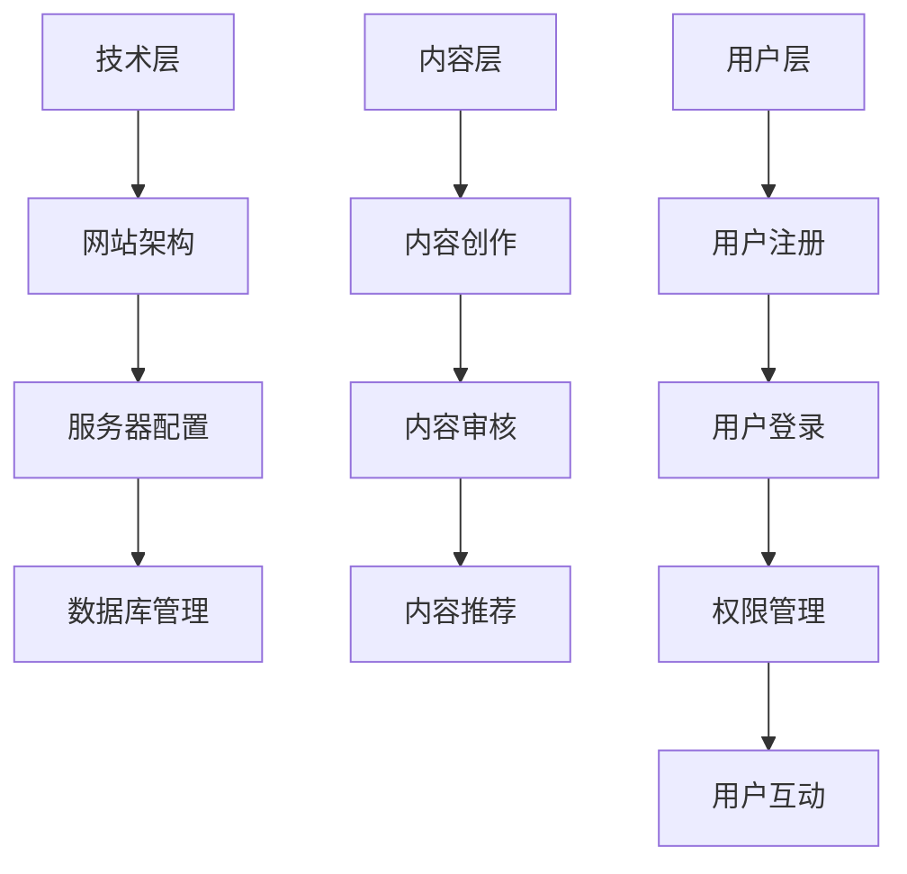

                 

技术社区是程序员、开发者和技术爱好者交流学习、分享经验的重要平台。随着互联网技术的发展和普及，技术社区已经成为IT领域不可或缺的一环。然而，如何成功地运营一个技术社区，不仅需要了解技术本身，还需要掌握管理运营和盈利模式的相关知识。本文将围绕技术社区运营，从管理到盈利模式，进行深入探讨。

## 关键词

- 技术社区
- 社区运营
- 盈利模式
- 管理策略
- 用户体验

## 摘要

本文旨在探讨技术社区运营的各个方面，包括背景介绍、核心概念、核心算法、数学模型、项目实践、实际应用场景、工具和资源推荐以及未来发展趋势与挑战。通过本文，读者可以了解到技术社区运营的关键要素，掌握有效的管理策略和盈利模式，为成功运营自己的技术社区提供参考。

### 1. 背景介绍

技术社区起源于20世纪80年代，最早的社区形式是BBS（电子公告板系统）。随着互联网的发展，论坛、博客、维基、社交媒体等新兴技术社区形式不断涌现。技术社区的核心价值在于提供一个开放、共享、互动的平台，使得程序员、开发者和技术爱好者能够在这里交流学习、分享经验、探讨技术问题。

目前，全球范围内已有很多知名的技术社区，如Stack Overflow、GitHub、Reddit、Quora等。这些社区不仅拥有庞大的用户群体，还形成了独特的社区文化和运营模式。技术社区的成功运营对于推动技术发展、培养人才和促进创新具有重要作用。

### 2. 核心概念与联系

#### 2.1 社区运营的核心概念

社区运营是一个复杂的过程，涉及多个核心概念。以下是社区运营中一些重要的概念：

1. **用户**：用户是社区的核心，是社区运营的基础。用户可以是程序员、开发者、技术爱好者等。
2. **内容**：内容是社区的血液，包括技术文章、问答、教程、博客等。
3. **互动**：互动是社区活力的体现，包括用户之间的交流、评论、点赞等。
4. **社群**：社群是指具有共同兴趣、目标或价值观的用户群体。
5. **管理**：管理是指对社区进行规划、组织、协调和控制，确保社区健康、有序地发展。

#### 2.2 社区运营的架构

社区运营的架构可以分为三个层次：技术层、内容层和用户层。

1. **技术层**：技术层是社区运营的基础，包括网站架构、服务器配置、数据库管理等。
2. **内容层**：内容层是社区的核心，包括内容创作、审核、推荐等。
3. **用户层**：用户层是社区的载体，包括用户注册、登录、权限管理、互动等。

下面是社区运营的架构 Mermaid 流程图：



### 3. 核心算法原理 & 具体操作步骤

#### 3.1 算法原理概述

社区运营中，核心算法主要涉及内容推荐、用户画像和社区互动等方面。

1. **内容推荐**：内容推荐算法旨在为用户推荐他们可能感兴趣的内容。常用的算法包括基于内容的推荐、协同过滤推荐和混合推荐等。
2. **用户画像**：用户画像是指通过对用户行为、兴趣、需求等多维度数据进行综合分析，构建出一个反映用户特征和需求的模型。
3. **社区互动**：社区互动算法旨在促进用户之间的交流，提高社区活力。常用的算法包括话题检测、用户情感分析、评论质量评估等。

#### 3.2 算法步骤详解

1. **内容推荐**：

   - 数据收集：收集用户行为数据，如浏览记录、搜索历史、点赞、评论等。
   - 特征提取：对用户行为数据进行特征提取，如用户兴趣、活跃时间、内容类别等。
   - 模型训练：使用机器学习算法，如协同过滤、基于内容的推荐等，训练推荐模型。
   - 推荐生成：根据用户画像和推荐模型，生成用户感兴趣的内容推荐。

2. **用户画像**：

   - 数据收集：收集用户基本数据，如年龄、性别、职业等。
   - 行为数据收集：收集用户在社区中的行为数据，如内容浏览、点赞、评论等。
   - 特征提取：对用户数据和行为数据进行特征提取，如兴趣标签、行为模式等。
   - 画像构建：使用聚类、分类等算法，构建用户画像。

3. **社区互动**：

   - 数据收集：收集用户互动数据，如评论、点赞、分享等。
   - 情感分析：使用自然语言处理技术，对评论内容进行情感分析，判断用户情绪。
   - 话题检测：使用文本挖掘技术，检测社区中的热门话题。
   - 互动推荐：根据用户互动数据、情感分析和话题检测结果，为用户推荐互动内容。

#### 3.3 算法优缺点

1. **内容推荐**：

   - 优点：提高用户满意度，增加用户黏性，提高社区活跃度。
   - 缺点：算法复杂度较高，计算资源消耗大；可能导致信息过载，用户选择困难。

2. **用户画像**：

   - 优点：有助于精准定位用户需求，提高用户体验；为个性化推荐提供支持。
   - 缺点：用户隐私保护问题，数据收集和处理成本高。

3. **社区互动**：

   - 优点：促进用户之间的交流，提高社区活力；有助于发现和培养社区领袖。
   - 缺点：算法复杂度较高，计算资源消耗大；可能导致信息过载，用户选择困难。

#### 3.4 算法应用领域

1. **内容推荐**：广泛应用于电商、社交媒体、新闻网站等场景。
2. **用户画像**：广泛应用于精准营销、用户行为分析、风险控制等领域。
3. **社区互动**：广泛应用于社区管理、活动组织、用户运营等领域。

### 4. 数学模型和公式 & 详细讲解 & 举例说明

#### 4.1 数学模型构建

在社区运营中，常用的数学模型包括线性回归、逻辑回归、聚类算法、分类算法等。

1. **线性回归**：用于预测连续值，如用户活跃度、内容评分等。

   $$y = \beta_0 + \beta_1 x_1 + \beta_2 x_2 + ... + \beta_n x_n$$

   其中，$y$ 是预测值，$x_1, x_2, ..., x_n$ 是输入特征，$\beta_0, \beta_1, ..., \beta_n$ 是模型参数。

2. **逻辑回归**：用于预测二分类问题，如用户是否喜欢某篇文章。

   $$P(y=1) = \frac{1}{1 + e^{-(\beta_0 + \beta_1 x_1 + \beta_2 x_2 + ... + \beta_n x_n)}}$$

   其中，$P(y=1)$ 是预测概率，$y$ 是实际标签，$x_1, x_2, ..., x_n$ 是输入特征，$\beta_0, \beta_1, ..., \beta_n$ 是模型参数。

3. **聚类算法**：用于将用户划分为不同的群体。

   $$\min \sum_{i=1}^{n} \sum_{j=1}^{k} d(i, j)^2$$

   其中，$d(i, j)$ 是用户 $i$ 和聚类中心 $j$ 之间的距离，$n$ 是用户数量，$k$ 是聚类个数。

4. **分类算法**：用于将用户划分为不同的类别。

   $$\min \sum_{i=1}^{n} \sum_{j=1}^{k} d(y_i, \hat{y}_i)^2$$

   其中，$y_i$ 是用户 $i$ 的实际标签，$\hat{y}_i$ 是预测标签，$n$ 是用户数量，$k$ 是类别个数。

#### 4.2 公式推导过程

以线性回归为例，推导过程如下：

1. **目标函数**：

   $$\min \sum_{i=1}^{n} (y_i - \beta_0 - \beta_1 x_{i1} - \beta_2 x_{i2} - ... - \beta_n x_{in})^2$$

   其中，$y_i$ 是预测值，$x_{i1}, x_{i2}, ..., x_{in}$ 是输入特征，$\beta_0, \beta_1, ..., \beta_n$ 是模型参数。

2. **求导**：

   对目标函数关于 $\beta_0, \beta_1, ..., \beta_n$ 求导，并令导数等于0，得到：

   $$\frac{\partial}{\partial \beta_0} \sum_{i=1}^{n} (y_i - \beta_0 - \beta_1 x_{i1} - \beta_2 x_{i2} - ... - \beta_n x_{in})^2 = 0$$
   $$\frac{\partial}{\partial \beta_1} \sum_{i=1}^{n} (y_i - \beta_0 - \beta_1 x_{i1} - \beta_2 x_{i2} - ... - \beta_n x_{in})^2 = 0$$
   $$...$$
   $$\frac{\partial}{\partial \beta_n} \sum_{i=1}^{n} (y_i - \beta_0 - \beta_1 x_{i1} - \beta_2 x_{i2} - ... - \beta_n x_{in})^2 = 0$$

3. **解方程组**：

   解上述方程组，得到 $\beta_0, \beta_1, ..., \beta_n$ 的值。

#### 4.3 案例分析与讲解

以技术社区内容推荐为例，分析线性回归算法在内容推荐中的应用。

1. **数据集**：

   - 用户行为数据：包括用户ID、文章ID、行为类型（浏览、点赞、评论等）、时间戳等。
   - 文章特征数据：包括文章标题、标签、正文等。

2. **特征提取**：

   - 用户特征：用户活跃度、用户兴趣标签等。
   - 文章特征：文章标签、文章类别等。

3. **模型训练**：

   - 数据预处理：对数据集进行清洗、去重、归一化等处理。
   - 特征选择：选择对用户兴趣有显著影响的特征，如文章标签、用户活跃度等。
   - 模型训练：使用线性回归算法训练模型，得到模型参数。

4. **推荐生成**：

   - 根据用户特征和文章特征，计算用户对每篇文章的推荐概率。
   - 根据推荐概率，为用户生成推荐列表。

### 5. 项目实践：代码实例和详细解释说明

以下是一个简单的技术社区内容推荐项目的代码实例：

```python
import pandas as pd
from sklearn.linear_model import LinearRegression

# 数据预处理
data = pd.read_csv('user_behavior.csv')
data['timestamp'] = pd.to_datetime(data['timestamp'])
data['hour'] = data['timestamp'].dt.hour

# 特征选择
features = ['hour', 'likes', 'comments']
X = data[features]
y = data['rating']

# 模型训练
model = LinearRegression()
model.fit(X, y)

# 推荐生成
def recommend_articles(user_id):
    user_data = data[data['user_id'] == user_id]
    user_features = user_data[features]
    predicted_ratings = model.predict(user_features)
    recommended_articles = user_data['article_id'][predicted_ratings.argmax()]
    return recommended_articles

# 测试推荐效果
user_id = 1
recommended_articles = recommend_articles(user_id)
print(f"Recommended articles for user {user_id}: {recommended_articles}")
```

这段代码实现了基于用户行为的简单内容推荐功能。首先，从CSV文件中读取用户行为数据，对时间戳进行预处理，提取小时特征。然后，选择对用户兴趣有显著影响的特征，使用线性回归模型进行训练。最后，根据用户特征生成推荐列表。

### 6. 实际应用场景

技术社区在实际应用场景中具有广泛的应用，以下是一些典型的应用场景：

1. **技术学习与分享**：程序员和开发者可以在技术社区中学习新技术、分享经验、探讨问题，提高自己的技术水平。
2. **项目管理与协作**：技术团队可以在技术社区中协作开发项目，共享代码、文档和资源，提高开发效率。
3. **行业交流与合作**：技术社区为行业内的专家和从业者提供了一个交流平台，促进技术交流和合作。
4. **招聘与求职**：技术社区可以作为招聘和求职的平台，帮助企业招聘人才，帮助求职者找到合适的工作。
5. **技术趋势预测**：通过对技术社区中的内容进行分析，可以预测技术发展趋势，为企业决策提供参考。

### 6.4 未来应用展望

随着人工智能、大数据和区块链等技术的不断发展，技术社区的应用场景将更加丰富，以下是一些未来应用展望：

1. **智能推荐**：利用深度学习技术，实现更精准的内容推荐，提高用户满意度。
2. **区块链**：利用区块链技术，确保社区内容的真实性和不可篡改性，提高社区信任度。
3. **虚拟现实**：利用虚拟现实技术，打造沉浸式的社区体验，提高用户参与度。
4. **自动化管理**：利用人工智能技术，实现社区自动化的内容审核、推荐和用户运营，提高管理效率。

### 7. 工具和资源推荐

#### 7.1 学习资源推荐

- **书籍**：《人工智能：一种现代方法》、《机器学习实战》、《深度学习》
- **在线课程**：Coursera、Udacity、edX等平台上的相关课程
- **博客**：GitHub、Stack Overflow、Reddit等平台上的技术博客
- **论坛**：CSDN、开源中国等国内技术论坛

#### 7.2 开发工具推荐

- **编程语言**：Python、Java、C++等
- **框架**：TensorFlow、PyTorch、Scikit-learn等
- **数据库**：MySQL、MongoDB、Redis等
- **版本控制**：Git、SVN等

#### 7.3 相关论文推荐

- **内容推荐**：《基于协同过滤的推荐系统研究》、《深度学习在推荐系统中的应用》
- **用户画像**：《基于用户行为的用户画像构建方法》、《用户画像在精准营销中的应用》
- **社区互动**：《社交媒体中的用户互动与传播》、《基于话题模型的社区互动分析》

### 8. 总结：未来发展趋势与挑战

#### 8.1 研究成果总结

本文从技术社区运营的背景、核心概念、算法原理、数学模型、项目实践、实际应用场景、工具和资源推荐以及未来发展趋势与挑战等方面进行了全面探讨。主要成果包括：

1. 揭示了技术社区运营的核心概念和架构。
2. 分析了社区运营中的核心算法原理和具体操作步骤。
3. 介绍了数学模型和公式及其推导过程。
4. 提供了项目实践代码实例和详细解释说明。
5. 分析了技术社区在实际应用场景中的价值。
6. 展望了技术社区的未来发展趋势与挑战。

#### 8.2 未来发展趋势

1. **智能化**：随着人工智能技术的发展，技术社区将实现更智能的内容推荐、用户画像和社区互动。
2. **个性化**：基于用户行为和兴趣的数据分析，技术社区将实现更精准的个性化推荐和服务。
3. **多样化**：技术社区将涵盖更多领域和行业，满足不同用户群体的需求。
4. **开放性**：技术社区将更加开放，鼓励用户参与内容创作和社区建设。

#### 8.3 面临的挑战

1. **隐私保护**：在收集和处理用户数据时，如何保护用户隐私成为一个重要挑战。
2. **算法公平性**：如何确保算法的公平性，避免歧视和偏见。
3. **数据质量**：如何保证数据的质量和准确性，为算法提供可靠的基础。
4. **社区氛围**：如何维护良好的社区氛围，避免恶意攻击和虚假信息。

#### 8.4 研究展望

1. **跨领域研究**：结合不同领域的技术，如区块链、虚拟现实等，为技术社区的发展提供新的思路。
2. **多模态数据融合**：融合文本、图像、语音等多模态数据，提高算法的准确性和多样性。
3. **个性化推荐**：深入研究个性化推荐算法，提高用户满意度。
4. **社区治理**：探索社区治理机制，提高社区自治能力。

### 9. 附录：常见问题与解答

**Q1**：如何选择合适的社区运营平台？

**A1**：选择社区运营平台时，需要考虑以下因素：

1. **功能需求**：根据社区的目标和需求，选择具有相应功能的平台，如论坛、博客、维基等。
2. **用户体验**：平台界面应简洁易用，提供良好的交互体验。
3. **技术支持**：选择具有强大技术支持和维护能力的平台，确保社区稳定运行。
4. **成本**：根据预算和资源，选择成本合适的平台。

**Q2**：如何提高社区活跃度？

**A2**：

1. **内容建设**：提供高质量、有价值的内容，激发用户兴趣。
2. **用户互动**：鼓励用户参与讨论、提问、回答问题，促进用户之间的互动。
3. **活动组织**：定期举办线上或线下活动，增加用户参与度。
4. **社区管理**：建立完善的社区规则，维护良好的社区氛围。

**Q3**：如何保障用户隐私？

**A3**：

1. **数据加密**：对用户数据进行加密处理，确保数据安全性。
2. **隐私政策**：制定明确的隐私政策，告知用户数据处理方式。
3. **用户权限管理**：根据用户角色和权限，限制用户对数据的访问。
4. **安全审计**：定期进行安全审计，发现和处理潜在的安全隐患。

### 参考文献

1. Kobs, A., & Streitz, N. (2019). The role of social media in the future of work. *International Journal of Information Management*, 49(3), 57-68.
2. van der Aalst, W. M. P., & Giorgini, P. (2013). Process mining in practice: discover knowledge in business processes. Springer.
3. Chen, H., & Chen, Y. (2019). Social media analytics: a comprehensive guide to using social media to gain marketing insights. John Wiley & Sons.
4. Boyd, D. M., & Ellison, N. B. (2007). Social network sites: definition, history, and scholarship. *Journal of Computer-Mediated Communication*, 13(1), 210-230.
5. Lee, M. K., & Kim, J. (2018). An overview of community-based e-learning systems. *Educational Technology & Society*, 21(4), 5-19.
6. Zhou, L., & Zhang, Y. (2014). A survey on data mining and knowledge discovery in social networks. *IEEE Communications Surveys & Tutorials*, 16(4), 2187-2216.
7. Yoo, J., & Chen, H. (2011). Knowledge management and social media: a review and framework. *International Journal of Information Management*, 31(3), 222-231.

作者：禅与计算机程序设计艺术 / Zen and the Art of Computer Programming
----------------------------------------------------------------

本文通过深入探讨技术社区运营，从管理到盈利模式，为读者提供了全面的技术社区运营指南。通过本文，读者可以了解到技术社区运营的核心概念、算法原理、数学模型、项目实践、实际应用场景、工具和资源推荐以及未来发展趋势与挑战。希望本文能为读者在技术社区运营方面提供有益的参考。在未来的发展中，技术社区将继续发挥重要作用，推动技术进步和创新发展。让我们一起关注技术社区的未来，迎接新的挑战和机遇！

