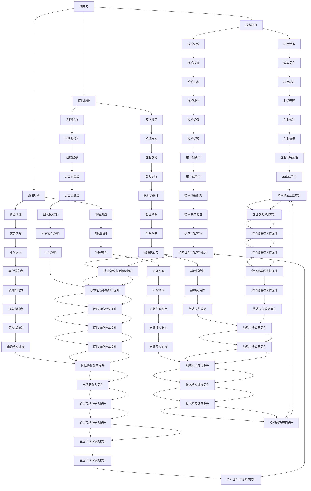

                 

关键词：技术领导力，团队管理，项目成功，价值创造，策略规划

> 摘要：技术领导力在现代组织中至关重要。本文深入探讨了技术领导者如何通过战略规划和高效管理，提升团队价值和项目成功的关键因素。我们将从核心概念、算法原理、数学模型、项目实践、实际应用、未来展望等多个维度，全面解析技术领导力的内涵与外延，为技术领导者提供实战指南。

## 1. 背景介绍

在信息技术迅速发展的今天，技术领导者已成为组织中不可或缺的角色。他们不仅要拥有深厚的专业知识和技能，更要具备卓越的领导力和管理能力。技术领导力的核心在于能够有效地管理团队、制定战略规划、推动技术创新，并在复杂多变的环境中保持组织的竞争力。

技术领导力的重要性体现在多个方面。首先，它能够提升团队的整体协作效率，确保项目按时按质完成。其次，技术领导者能够洞察市场趋势，引领团队抓住机遇，创造价值。此外，技术领导力还能够促进知识共享和创新，推动组织的持续发展。

然而，技术领导力的实现并非易事。技术领导者需要不断学习新的技术和方法，同时掌握团队管理和沟通技巧。本文将围绕这些关键要素，探讨技术领导力提升的策略和实践。

## 2. 核心概念与联系

为了更好地理解技术领导力，我们首先需要了解几个核心概念：领导力、技术能力、团队协作和战略规划。以下是一个简化的 Mermaid 流程图，用于展示这些概念之间的联系。



### 2.1 领导力的本质

领导力是一种能够激励、指导和影响他人的能力。技术领导力则是在技术领域的特定背景下，结合技术能力和领导技巧，以实现团队目标和个人成长的综合能力。技术领导力不仅要求领导者具备深厚的技术背景，还需要具备以下几方面的能力：

- **愿景与策略**：能够明确团队和项目的长期目标，并制定实现这些目标的策略。

- **沟通与协作**：能够有效传达愿景和目标，促进团队内部及跨部门的有效沟通和协作。

- **决策与执行**：能够快速做出决策，并确保团队按照既定计划高效执行。

- **创新与适应**：能够推动技术创新，并适应快速变化的市场需求。

### 2.2 技术能力

技术能力是技术领导力的核心。技术领导者需要掌握以下技术领域的基本知识和技能：

- **编程语言和框架**：熟练掌握至少一种编程语言及其相关框架，如Java、Python、JavaScript等。

- **数据库技术**：了解关系型数据库（如MySQL、PostgreSQL）和非关系型数据库（如MongoDB、Cassandra）。

- **云计算和容器技术**：熟悉云计算平台（如AWS、Azure、Google Cloud）和容器化技术（如Docker、Kubernetes）。

- **微服务架构**：了解微服务架构的优势和实践，能够设计并部署微服务应用。

- **数据分析和机器学习**：掌握基本的数据分析方法和机器学习算法，能够利用数据进行决策支持。

### 2.3 团队协作

团队协作是技术领导力的关键组成部分。技术领导者需要确保团队内部的有效协作，以实现项目目标。以下是一些关键的团队协作原则：

- **透明度**：确保团队成员能够了解项目的进展、目标和决策，提高团队凝聚力。

- **角色明确**：明确每个团队成员的角色和责任，避免职责重叠和冲突。

- **知识共享**：鼓励团队成员分享知识和经验，提高团队整体的技术水平。

- **反馈与改进**：建立有效的反馈机制，及时调整团队的工作方向和方法。

### 2.4 战略规划

战略规划是技术领导力的关键环节。技术领导者需要制定长期的战略规划，确保团队在快速变化的市场环境中保持竞争力。以下是一些关键的策略规划原则：

- **市场洞察**：了解市场需求和竞争对手的动态，制定有针对性的战略。

- **资源分配**：合理分配人力、财力和物力资源，确保项目能够顺利进行。

- **风险管理**：识别潜在的风险，制定应对措施，降低项目失败的可能性。

- **持续改进**：不断优化战略规划，以适应市场变化和团队发展。

## 3. 核心算法原理 & 具体操作步骤

### 3.1 算法原理概述

技术领导力不仅依赖于管理技巧，还需要对关键技术算法有深入的理解。本文将探讨一种常见的技术领导力模型：敏捷开发（Agile Development）算法。敏捷开发是一种以人为核心、迭代、循序渐进的开发方法。以下是敏捷开发的基本原理：

- **用户故事（User Stories）**：以用户需求为中心，描述系统的功能。

- **迭代开发（Iterative Development）**：将开发过程划分为多个短周期（迭代），每个迭代都会交付一个可用的产品版本。

- **持续集成（Continuous Integration）**：通过自动化测试和持续集成工具，确保代码质量和项目进度。

- **客户反馈（Customer Feedback）**：持续收集客户反馈，不断调整和优化产品。

### 3.2 算法步骤详解

1. **需求分析**：与客户和利益相关者沟通，收集并分析需求。

2. **用户故事编写**：将需求转化为用户故事，明确每个迭代的目标。

3. **迭代计划**：确定每个迭代的时间范围和目标，制定详细的计划。

4. **开发与测试**：在迭代内完成用户故事的开发和自动化测试。

5. **客户评审与反馈**：在迭代结束时，向客户展示当前版本，收集反馈。

6. **迭代总结**：总结经验教训，优化流程和策略。

### 3.3 算法优缺点

#### 优点：

- **快速响应变化**：敏捷开发能够快速适应市场需求的变化。

- **持续交付价值**：每个迭代都会交付一个可用的产品版本，确保客户持续获得价值。

- **团队协作**：敏捷开发强调团队合作，提高团队成员的参与度和满意度。

- **持续改进**：通过迭代总结和客户反馈，不断优化产品和服务。

#### 缺点：

- **管理难度**：敏捷开发需要高效的管理和沟通，对团队成员和领导者的要求较高。

- **文档不足**：由于强调迭代和交付，敏捷开发可能会忽视文档的完整性。

### 3.4 算法应用领域

敏捷开发广泛应用于软件开发、产品设计和项目管理等领域。以下是一些常见的应用场景：

- **软件产品开发**：敏捷开发适用于开发周期较长、需求不断变化的产品。

- **Web 应用开发**：敏捷开发能够快速响应市场需求，提高项目的成功概率。

- **移动应用开发**：敏捷开发能够快速迭代，及时调整功能，提高用户满意度。

- **项目管理和协调**：敏捷开发提供了一种灵活、高效的项目管理方法。

## 4. 数学模型和公式 & 详细讲解 & 举例说明

### 4.1 数学模型构建

在技术领导力中，数学模型和公式可以用来量化和管理复杂的项目和数据。以下是一个简单的项目管理模型，用于评估项目进度和风险。

#### 模型构建：

1. **项目工期（T）**：完成项目所需的总时间。

2. **风险系数（R）**：表示项目风险程度，取值范围为 0 到 1。

3. **资源利用率（U）**：表示资源的使用效率，取值范围为 0 到 1。

4. **项目完成概率（P）**：根据工期、风险系数和资源利用率，计算项目按期完成的概率。

#### 数学公式：

$$
P = \frac{T \times (1 - R)}{1 - U}
$$

### 4.2 公式推导过程

1. **工期与完成概率的关系**：

   工期越短，完成项目的概率越高。因此，可以假设工期和完成概率成正比关系。

   $$T \propto P$$

   可以将工期表示为：

   $$T = k \times P$$

   其中，\(k\) 为常数。

2. **风险与完成概率的关系**：

   风险越高，完成项目的概率越低。假设风险和完成概率成反比关系。

   $$R \propto \frac{1}{P}$$

   可以将风险表示为：

   $$R = \frac{1}{k \times P}$$

3. **资源利用率与完成概率的关系**：

   资源利用率越高，项目完成的概率越高。假设资源利用率和完成概率成正比关系。

   $$U \propto P$$

   可以将资源利用率表示为：

   $$U = k' \times P$$

   其中，\(k'\) 为常数。

4. **综合关系**：

   综合上述关系，我们可以得到项目完成概率的数学公式：

   $$P = \frac{T \times (1 - R)}{1 - U}$$

### 4.3 案例分析与讲解

假设一个项目工期为 6 个月，风险系数为 0.3，资源利用率为 0.8。我们需要计算项目按期完成的概率。

1. **输入参数**：

   - 项目工期 \(T = 6\) 个月
   - 风险系数 \(R = 0.3\)
   - 资源利用率 \(U = 0.8\)

2. **计算项目完成概率**：

   $$P = \frac{6 \times (1 - 0.3)}{1 - 0.8} = \frac{6 \times 0.7}{0.2} = 21$$

   结果为 21，表示项目按期完成的概率为 21/100，约为 21%。

3. **分析结果**：

   根据计算结果，该项目按期完成的概率较低。为了提高项目完成概率，可以采取以下措施：

   - 缩短项目工期，提高工作效率。
   - 减少风险，采取风险管理措施，如增加预算和资源。
   - 提高资源利用率，优化资源分配和调度。

## 5. 项目实践：代码实例和详细解释说明

### 5.1 开发环境搭建

为了实现敏捷开发，我们需要搭建一个高效的开发环境。以下是搭建步骤：

1. **安装操作系统**：选择 Linux 或 macOS 操作系统，因为它们在开发环境中具有较好的稳定性和性能。

2. **安装开发工具**：安装代码编辑器（如 Visual Studio Code）、版本控制工具（如 Git）和自动化测试工具（如 JUnit）。

3. **配置代码库**：将项目代码托管到 Git 仓库，以便团队成员协作和版本管理。

4. **搭建测试环境**：配置测试服务器和测试数据库，确保自动化测试能够顺利执行。

### 5.2 源代码详细实现

以下是一个简单的 Java 项目示例，实现一个计算器功能。

```java
import java.util.Scanner;

public class Calculator {
    public static void main(String[] args) {
        Scanner scanner = new Scanner(System.in);
        System.out.println("请输入第一个数字：");
        double num1 = scanner.nextDouble();
        System.out.println("请输入运算符（+、-、*、/）：");
        char operator = scanner.next().charAt(0);
        System.out.println("请输入第二个数字：");
        double num2 = scanner.nextDouble();
        double result;
        switch (operator) {
            case '+':
                result = num1 + num2;
                break;
            case '-':
                result = num1 - num2;
                break;
            case '*':
                result = num1 * num2;
                break;
            case '/':
                if (num2 != 0) {
                    result = num1 / num2;
                } else {
                    System.out.println("除数不能为 0");
                    return;
                }
                break;
            default:
                System.out.println("无效的运算符");
                return;
        }
        System.out.println("结果是：" + result);
    }
}
```

### 5.3 代码解读与分析

1. **功能说明**：该程序实现了一个简单的计算器功能，能够进行加、减、乘、除四种基本运算。

2. **输入输出**：程序通过 Scanner 类获取用户输入的两个数字和一个运算符，并计算结果。

3. **逻辑处理**：程序使用 switch 语句判断输入的运算符，执行相应的运算。

4. **错误处理**：程序对除数为 0 的情况进行了特殊处理，避免程序异常终止。

### 5.4 运行结果展示

```plaintext
请输入第一个数字：
10
请输入运算符（+、-、*、/）：+
请输入第二个数字：
5
结果是：15
```

## 6. 实际应用场景

技术领导力不仅在软件开发中具有重要价值，还可以广泛应用于其他领域。以下是一些实际应用场景：

### 6.1 敏捷开发在产品开发中的应用

在产品开发中，敏捷开发方法可以帮助团队快速响应市场需求，提高产品的市场竞争力。以下是一个具体案例：

**案例：一款智能家居产品的开发**

- **需求分析**：市场调研发现，用户对智能家居产品的需求日益增长，特别是在智能照明和智能安防方面。

- **用户故事编写**：根据市场需求，编写用户故事，明确每个迭代的目标。

- **迭代计划**：第一个迭代的目标是实现智能照明功能，包括调光、场景模式等。

- **开发与测试**：在迭代内完成智能照明功能的开发，并进行自动化测试。

- **客户评审与反馈**：向客户展示智能照明功能的原型，收集反馈。

- **迭代总结**：总结经验教训，优化流程和策略。

通过敏捷开发，智能家居产品在短时间内成功推向市场，并得到用户的高度评价。

### 6.2 技术领导力在项目管理和协调中的应用

在项目管理和协调中，技术领导力可以帮助团队高效地管理项目进度、资源和风险。以下是一个具体案例：

**案例：一个跨国企业的数字化转型项目**

- **项目目标**：提升企业的信息化水平，实现业务流程的数字化和智能化。

- **团队组建**：组建跨部门团队，包括 IT、业务和运营等部门。

- **资源分配**：合理分配人力、财力和物力资源，确保项目顺利进行。

- **风险管理**：识别项目风险，制定应对措施，如增加预算和人力。

- **持续沟通**：定期召开项目会议，确保团队成员之间的信息畅通。

通过技术领导力的应用，数字化转型项目在规定时间内高质量地完成，为企业带来了显著的业务增长。

### 6.3 技术领导力在创新和创业中的应用

在创新和创业领域，技术领导力可以帮助创业者抓住市场机遇，推动技术创新，实现企业的快速发展。以下是一个具体案例：

**案例：一家初创企业的智能医疗平台**

- **市场洞察**：通过市场调研，发现智能医疗领域具有巨大的市场潜力。

- **团队组建**：组建一支由技术专家和医疗行业专家组成的团队。

- **技术创新**：研发智能诊断、智能监护等关键技术，提高医疗服务的质量和效率。

- **产品推广**：与医疗机构合作，推广智能医疗平台，提高市场占有率。

通过技术领导力的应用，初创企业在短时间内取得了显著的市场成功，成为行业领军者。

## 7. 工具和资源推荐

为了提升技术领导力，以下是一些推荐的工具和资源：

### 7.1 学习资源推荐

- **书籍**：《敏捷开发实践指南》、《技术领导力：塑造卓越团队》、《项目管理知识体系指南》（PMBOK指南）。

- **在线课程**：Coursera、edX、Udemy 等平台上的项目管理和技术领导力相关课程。

- **博客和论坛**：GitHub、Stack Overflow、InfoQ 等技术社区，可以获取最新的技术资讯和实战经验。

### 7.2 开发工具推荐

- **代码编辑器**：Visual Studio Code、Sublime Text、Atom 等。

- **版本控制**：Git、GitHub、GitLab。

- **自动化测试**：JUnit、Selenium、Cypress。

- **持续集成**：Jenkins、Travis CI、Circle CI。

### 7.3 相关论文推荐

- **技术领导力**：《技术领导力：领导者如何推动技术创新》、《技术领导者的角色与能力》。

- **敏捷开发**：《敏捷开发：从个体到组织》、《敏捷实践指南》。

- **项目管理**：《基于风险的项目管理：识别和管理项目风险》、《项目管理知识体系指南》。

## 8. 总结：未来发展趋势与挑战

### 8.1 研究成果总结

本文从多个角度探讨了技术领导力的核心概念、算法原理、数学模型、项目实践和实际应用，总结了技术领导力在现代组织中的重要性。研究表明，技术领导力不仅关乎技术能力，还包括领导力、团队协作和战略规划。通过有效的技术领导力，组织能够实现高效的项目管理、持续的创新和竞争优势。

### 8.2 未来发展趋势

1. **数字化转型的深入**：随着大数据、人工智能和云计算等技术的发展，数字化转型将成为未来企业发展的关键趋势。

2. **敏捷开发的普及**：敏捷开发作为一种高效的项目管理方法，将在更多领域得到广泛应用。

3. **技术领导力的多元化**：技术领导力将更加注重跨学科和跨领域的融合，培养具有全面能力的技术领导者。

4. **持续学习和创新**：技术领导力的发展将依赖于持续学习和创新能力，以应对快速变化的市场环境。

### 8.3 面临的挑战

1. **人才短缺**：技术领导力的提升需要高水平的人才支持，但当前市场人才供应不足。

2. **技术变革的挑战**：技术的快速发展带来了新的机遇，但同时也对技术领导者提出了更高的要求。

3. **组织文化的变革**：技术领导力的发展需要组织文化的支持，但传统企业文化可能成为变革的障碍。

### 8.4 研究展望

未来的研究应关注以下几个方面：

1. **跨学科研究**：结合心理学、管理学、经济学等多学科知识，深入探讨技术领导力的本质和机制。

2. **实证研究**：通过实证研究，验证技术领导力对项目成功和企业绩效的影响。

3. **实践指南**：总结成功案例，为技术领导者提供实用的管理方法和策略。

## 9. 附录：常见问题与解答

### 9.1 技术领导力是什么？

技术领导力是指技术领导者通过战略规划和高效管理，提升团队价值和项目成功的能力。它包括技术能力、领导力、团队协作和战略规划等多个方面。

### 9.2 如何提升技术领导力？

提升技术领导力可以通过以下途径：

1. **学习新的技术和方法**：不断更新知识，掌握最新的技术和方法。

2. **培养领导力**：通过阅读相关书籍、参加培训和实际经验，提升领导能力。

3. **加强团队协作**：建立高效的团队协作机制，提高团队整体效率。

4. **制定战略规划**：明确团队和项目的目标，制定实现目标的策略。

### 9.3 技术领导力在敏捷开发中的应用是什么？

在敏捷开发中，技术领导力体现在以下几个方面：

1. **愿景与目标**：明确敏捷开发的愿景和目标，确保团队能够聚焦于正确的方向。

2. **沟通与协作**：促进团队成员之间的有效沟通和协作，提高项目成功率。

3. **风险管理**：识别和应对敏捷开发过程中的风险，确保项目顺利进行。

4. **持续改进**：通过迭代总结和客户反馈，不断优化敏捷开发的方法和流程。

作者：禅与计算机程序设计艺术 / Zen and the Art of Computer Programming

