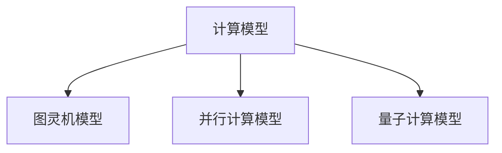
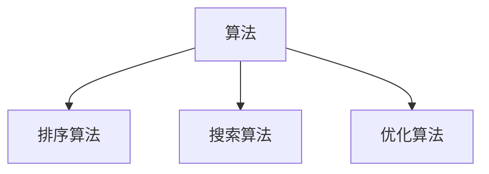
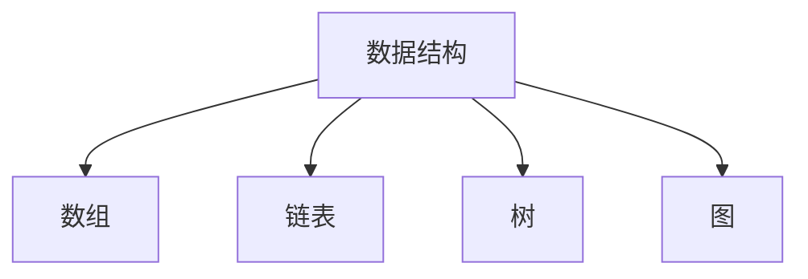
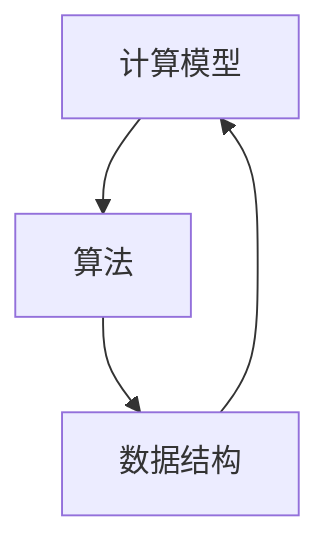
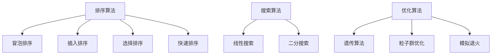
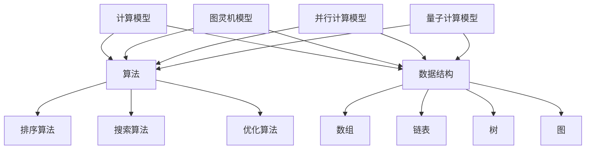

                 

关键词：认知拓展、人类计算、科学探索、人工智能、计算机科学、数学模型、算法原理、未来趋势、工具推荐

> 摘要：本文旨在探讨人类计算的科学探索，通过深入分析核心概念、算法原理、数学模型以及实际应用，拓展读者的认知边界。我们将从背景介绍出发，逐步展开对人类计算领域的核心议题，包括未来发展趋势与挑战。希望通过这篇文章，能够激发读者对计算机科学的无尽好奇与探索精神。

## 1. 背景介绍

人类计算的历史可以追溯到计算机科学的起源。从最初的机械计算器到现代的超级计算机，人类在计算能力上取得了惊人的进展。然而，随着计算能力的增强，我们对于计算的本质和局限性的认识也在不断深化。在这个背景下，人类计算的科学探索成为了一个引人入胜的领域。

人类计算的科学探索不仅涉及技术层面的创新，还包括对计算理论、算法效率、复杂性理论以及人工智能的深入研究。这一领域的重要性不言而喻，它不仅推动了计算机科学的发展，也为其他科学领域提供了强大的工具和方法。

在本文中，我们将重点关注以下几个核心议题：

1. **核心概念与联系**：介绍人类计算的基本概念，包括计算模型、算法、数据结构等，并通过 Mermaid 流程图展示其内在联系。
2. **核心算法原理 & 具体操作步骤**：详细解析人类计算中的一些重要算法，如排序算法、搜索算法等，并阐述其优缺点和应用领域。
3. **数学模型和公式 & 详细讲解 & 举例说明**：探讨人类计算中使用的数学模型和公式，包括其构建和推导过程，并通过具体案例进行说明。
4. **项目实践：代码实例和详细解释说明**：提供实际项目中的代码实例，解释其实现过程，并进行详细解读和分析。
5. **实际应用场景**：讨论人类计算在各个领域的应用场景，如人工智能、数据科学、生物信息学等。
6. **未来应用展望**：展望人类计算的未来发展方向和应用前景。
7. **工具和资源推荐**：推荐一些学习资源和开发工具，帮助读者进一步探索人类计算领域。
8. **总结：未来发展趋势与挑战**：总结研究成果，讨论未来发展趋势和面临的挑战。

下面，我们将逐一深入这些议题，以拓展读者的认知边界。

### 1.1 计算模型

计算模型是人类计算的核心概念之一。从简单的图灵机模型到现代的并行计算模型，不同的计算模型为我们提供了不同的视角来理解计算的本质。

- **图灵机模型**：图灵机是一种抽象的计算模型，由英国数学家艾伦·图灵于 1936 年提出。它由一个无限长的纸带、一个读写头以及一组状态转换规则组成。图灵机可以模拟任何计算机算法，因此被认为是现代计算机的理论基础。

- **并行计算模型**：并行计算模型利用多个处理单元同时执行计算任务，从而提高计算效率。并行计算可以分为数据并行和任务并行两种类型。数据并行是指将数据分解成多个部分，每个处理单元分别处理不同部分的数据；任务并行是指将任务分解成多个子任务，每个处理单元分别执行不同的子任务。

- **量子计算模型**：量子计算是一种基于量子力学原理的新型计算模型。量子计算机利用量子位（qubit）的状态叠加和纠缠现象进行计算，具有超越经典计算机的潜力。量子计算模型为解决一些复杂问题提供了新的可能性。

#### Mermaid 流程图

下面是一个简单的 Mermaid 流程图，展示了计算模型之间的联系：



### 1.2 算法

算法是人类计算的核心工具，它定义了如何解决特定问题的一系列步骤。从简单的排序算法到复杂的优化算法，算法在计算机科学中扮演着至关重要的角色。

- **排序算法**：排序算法是将一组数据按照特定顺序排列的算法。常见的排序算法有冒泡排序、插入排序、选择排序、快速排序等。这些算法在数据科学、数据库管理、搜索引擎等领域有着广泛的应用。

- **搜索算法**：搜索算法是在一组数据中查找特定元素的算法。常见的搜索算法有线性搜索、二分搜索等。搜索算法在信息检索、文件管理、网络路由等领域具有重要应用。

- **优化算法**：优化算法是用于求解优化问题的算法。常见的优化算法有遗传算法、粒子群优化、模拟退火等。优化算法在资源调度、路径规划、金融投资等领域具有广泛的应用。

#### Mermaid 流程图

下面是一个简单的 Mermaid 流程图，展示了算法之间的联系：



### 1.3 数据结构

数据结构是存储和组织数据的方式，它是算法实现的基础。常见的几种数据结构包括数组、链表、树、图等。

- **数组**：数组是一种线性数据结构，它由一系列元素组成，元素在内存中连续存储。数组具有随机访问的特性，使得查找和插入操作非常高效。

- **链表**：链表是一种线性数据结构，它由一系列节点组成，每个节点包含数据和指向下一个节点的指针。链表的插入和删除操作非常灵活，但查找操作相对较慢。

- **树**：树是一种层次结构，它由根节点和一系列子节点组成。树在许多应用中具有广泛的应用，如二叉树、堆、平衡树等。

- **图**：图是一种复杂的数据结构，它由节点和边组成。图在社交网络、网络拓扑、路径规划等领域具有广泛的应用。

#### Mermaid 流程图

下面是一个简单的 Mermaid 流程图，展示了数据结构之间的联系：



### 1.4 计算机科学的发展历程

计算机科学的发展历程可以分为几个阶段，每个阶段都带来了新的计算模型、算法和工具。

- **早期计算机科学**（1940s-1960s）：这个阶段主要是计算机硬件和软件的发明和早期发展。图灵机的理论模型、冯·诺伊曼架构的提出以及早期编程语言的诞生都是这一阶段的重要里程碑。

- **软件工程时代**（1960s-1980s）：随着计算机的普及，软件工程成为一个独立的学科。这个阶段的发展包括面向过程编程、模块化设计和面向对象编程等。

- **互联网时代**（1990s-2010s）：互联网的兴起带来了分布式计算、Web 应用和电子商务的繁荣。这个阶段的发展还包括了大数据、云计算和移动计算等新兴领域。

- **人工智能时代**（2010s-至今）：人工智能的突破使得计算机科学进入了一个新的时代。深度学习、强化学习、自然语言处理等技术正在改变我们的生活方式和社会结构。

### 1.5 计算机科学的重要性

计算机科学的重要性体现在其对社会、经济和科技的全面影响。以下是几个方面的例子：

- **社会影响**：计算机科学使得信息传播更加迅速，人们可以方便地获取和共享知识。此外，计算机科学还推动了社交媒体、在线教育等新兴领域的兴起。

- **经济影响**：计算机科学为各行各业带来了巨大的经济效益。从金融到制造，从医疗到娱乐，计算机科学都发挥了关键作用。

- **科技影响**：计算机科学推动了人工智能、物联网、区块链等新兴技术的发展。这些技术正在改变我们的生活方式，创造新的商业机会和社会价值。

### 1.6 人类计算的科学探索的意义

人类计算的科学探索不仅具有学术意义，还具有深远的社会意义。以下是几个方面的意义：

- **推动科技进步**：科学探索不断推动计算机科学的发展，为解决复杂问题提供新的方法和工具。

- **提升认知水平**：通过探索人类计算，我们能够更好地理解计算的本质，提升我们的认知水平。

- **培养创新精神**：科学探索激发我们的好奇心和求知欲，培养我们的创新精神。

- **促进国际合作**：计算机科学是一个国际化的领域，科学探索有助于促进各国之间的合作与交流。

## 2. 核心概念与联系

在深入探讨人类计算的科学探索之前，我们需要明确几个核心概念及其相互联系。这些概念包括计算模型、算法、数据结构等，它们共同构成了计算机科学的基础。

### 2.1 计算模型

计算模型是计算机科学中最基本的概念之一。它描述了计算机如何处理信息和执行任务。以下是几种主要的计算模型：

- **图灵机模型**：图灵机是由英国数学家艾伦·图灵在 1936 年提出的抽象计算模型。它由一个无限长的纸带、一个读写头以及一组状态转换规则组成。图灵机可以模拟任何计算机算法，因此被认为是现代计算机的理论基础。

- **并行计算模型**：并行计算模型利用多个处理单元同时执行计算任务，从而提高计算效率。并行计算可以分为数据并行和任务并行两种类型。数据并行是指将数据分解成多个部分，每个处理单元分别处理不同部分的数据；任务并行是指将任务分解成多个子任务，每个处理单元分别执行不同的子任务。

- **量子计算模型**：量子计算是一种基于量子力学原理的新型计算模型。量子计算机利用量子位（qubit）的状态叠加和纠缠现象进行计算，具有超越经典计算机的潜力。量子计算模型为解决一些复杂问题提供了新的可能性。

下面是一个简单的 Mermaid 流程图，展示了计算模型之间的联系：


### 2.2 算法

算法是计算机科学中用于解决问题的方法。算法可以是简单的排序或搜索，也可以是复杂的优化或机器学习。以下是几种主要的算法：

- **排序算法**：排序算法是将一组数据按照特定顺序排列的算法。常见的排序算法有冒泡排序、插入排序、选择排序、快速排序等。

- **搜索算法**：搜索算法是在一组数据中查找特定元素的算法。常见的搜索算法有线性搜索、二分搜索等。

- **优化算法**：优化算法是用于求解优化问题的算法。常见的优化算法有遗传算法、粒子群优化、模拟退火等。

下面是一个简单的 Mermaid 流程图，展示了算法之间的联系：


### 2.3 数据结构

数据结构是存储和组织数据的方式，它是算法实现的基础。以下是几种常见的数据结构：

- **数组**：数组是一种线性数据结构，它由一系列元素组成，元素在内存中连续存储。数组具有随机访问的特性，使得查找和插入操作非常高效。

- **链表**：链表是一种线性数据结构，它由一系列节点组成，每个节点包含数据和指向下一个节点的指针。链表的插入和删除操作非常灵活，但查找操作相对较慢。

- **树**：树是一种层次结构，它由根节点和一系列子节点组成。树在许多应用中具有广泛的应用，如二叉树、堆、平衡树等。

- **图**：图是一种复杂的数据结构，它由节点和边组成。图在社交网络、网络拓扑、路径规划等领域具有广泛的应用。

下面是一个简单的 Mermaid 流程图，展示了数据结构之间的联系：


### 2.4 计算模型、算法与数据结构之间的联系

计算模型、算法与数据结构之间存在着紧密的联系。计算模型为算法提供了运行环境，而算法则依赖于数据结构来高效地组织和管理数据。

- **计算模型与算法**：不同的计算模型可以支持不同的算法。例如，图灵机模型可以支持各种算法，而量子计算模型则可能更适合解决某些特定类型的优化问题。

- **算法与数据结构**：算法的选择往往取决于数据结构的特性。例如，当数据量较大时，使用二分搜索算法比线性搜索算法更高效；当数据结构为树时，可以使用树状数组来优化算法的复杂度。

下面是一个简单的 Mermaid 流程图，展示了计算模型、算法与数据结构之间的联系：



通过这些核心概念及其相互联系的理解，我们能够更好地把握人类计算的科学探索。在接下来的章节中，我们将深入探讨核心算法原理、数学模型以及实际应用，以进一步拓展我们的认知边界。

### 2.4.1 计算模型原理

计算模型是计算机科学中用于描述计算机如何执行任务的理论框架。不同的计算模型有不同的特点和适用场景。以下是几种常见的计算模型及其原理：

#### 图灵机

图灵机是由艾伦·图灵在 1936 年提出的抽象计算模型。它由以下几个部分组成：

- **无限长的纸带**：纸带是图灵机的工作存储空间，它由一系列可以写入和读取的符号组成。
- **读写头**：读写头可以沿着纸带移动，并在纸带上读取和写入符号。
- **状态转换表**：状态转换表定义了图灵机在不同状态和输入下应采取的动作，包括移动读写头、写入符号和切换状态。

图灵机的运作原理如下：

1. **初始化**：图灵机开始时处于一个特定的初始状态，读写头位于纸带上的某个位置。
2. **读取和写入**：在每次操作中，图灵机读取读写头下方的符号，根据当前状态和读取到的符号，从状态转换表中查找下一步的动作。
3. **移动**：根据状态转换表，图灵机可能需要移动读写头到纸带的左侧或右侧。
4. **更新状态**：执行完一次操作后，图灵机的状态会更新为下一个状态。
5. **循环**：重复步骤 2-4，直到图灵机达到一个停止状态。

图灵机的一个重要特性是它的通用性，即任何可计算的问题都可以通过图灵机来求解。这使得图灵机成为现代计算机的理论基础。

#### 并行计算

并行计算是利用多个处理单元同时执行计算任务来提高计算效率的一种计算模型。并行计算可以分为数据并行和任务并行两种类型：

- **数据并行**：数据并行是指在多个处理单元上分别处理不同部分的数据。这种方法适用于可以分解成独立子问题的任务。例如，在图像处理中，可以将图像分割成多个块，每个处理单元分别处理一个块。
  
- **任务并行**：任务并行是指在多个处理单元上同时执行不同的任务。这种方法适用于需要同时处理多个相关任务的场景。例如，在分布式系统中，不同的服务器可以同时处理不同的用户请求。

并行计算的关键挑战是任务分配和通信。有效的任务分配可以最大化处理单元的利用率，而有效的通信机制可以确保多个处理单元之间的数据同步。

#### 量子计算

量子计算是基于量子力学原理的一种计算模型。量子计算机使用量子位（qubit）作为基本的信息单元，而不是传统计算机中的比特（bit）。量子位可以处于叠加态，这意味着一个量子位可以同时表示 0 和 1 的组合。

量子计算的基本原理包括：

- **叠加态**：一个量子位可以同时处于 0 和 1 的叠加态。例如，一个量子位可以表示为 $|\psi\rangle = \frac{1}{\sqrt{2}}|0\rangle + \frac{1}{\sqrt{2}}|1\rangle$。
- **纠缠态**：两个或多个量子位可以处于纠缠态，这意味着一个量子位的状态会依赖于其他量子位的状态。这种特性可以用于提高计算效率。

量子计算的关键挑战包括量子位的稳定性、错误率以及量子门操作的可扩展性。尽管存在这些挑战，量子计算在解决某些特定问题，如量子模拟和密码破解方面，显示出巨大的潜力。

#### Mermaid 流程图

下面是一个简单的 Mermaid 流程图，展示了计算模型之间的联系：


通过理解这些计算模型的原理，我们可以更好地把握计算机科学中的基本概念，并为其在现实世界中的应用提供理论基础。

### 2.4.2 算法原理

算法是计算机科学中用于解决特定问题的方法。一个有效的算法通常具有高效的时间复杂度和空间复杂度。以下是几种常见的算法及其原理：

#### 排序算法

排序算法是将一组数据按照特定顺序排列的算法。常见的排序算法包括冒泡排序、插入排序、选择排序、快速排序等。

- **冒泡排序**：冒泡排序是一种简单的排序算法，它通过多次遍历待排序的数组，比较相邻的元素并交换它们，使得较大的元素逐渐“冒泡”到数组的末尾。冒泡排序的时间复杂度为 $O(n^2)$。
- **插入排序**：插入排序通过构建有序序列，对于未排序的数据，在已排序序列中找到相应位置并插入。插入排序的时间复杂度在最好情况下为 $O(n)$，在平均和最坏情况下为 $O(n^2)$。
- **选择排序**：选择排序通过每次遍历找到最小（或最大）的元素，将其放到已排序序列的末尾。选择排序的时间复杂度为 $O(n^2)$。
- **快速排序**：快速排序使用分治策略，通过选取一个基准元素，将数组分为两个子数组，一个小于基准元素，一个大于基准元素，然后递归地对这两个子数组进行排序。快速排序的平均时间复杂度为 $O(n\log n)$。

#### 搜索算法

搜索算法是在一组数据中查找特定元素的算法。常见的搜索算法包括线性搜索和二分搜索。

- **线性搜索**：线性搜索通过遍历数组，逐个比较元素，直到找到目标元素或遍历结束。线性搜索的时间复杂度为 $O(n)$。
- **二分搜索**：二分搜索利用有序数组的特性，通过不断将搜索范围缩小一半，快速找到目标元素。二分搜索的时间复杂度为 $O(\log n)$。

#### 优化算法

优化算法是用于求解优化问题的算法。常见的优化算法包括遗传算法、粒子群优化、模拟退火等。

- **遗传算法**：遗传算法基于自然进化原理，通过选择、交叉和变异操作，不断优化解的质量。遗传算法适用于复杂优化问题，如旅行商问题。
- **粒子群优化**：粒子群优化是一种基于群体智能的优化算法，通过模拟鸟群觅食行为，逐步优化解的质量。粒子群优化适用于连续优化问题。
- **模拟退火**：模拟退火是一种基于物理学的优化算法，通过模拟固体退火过程，逐步降低解的质量，避免陷入局部最优。模拟退火适用于求解组合优化问题。

#### Mermaid 流�程图

下面是一个简单的 Mermaid 流程图，展示了算法之间的联系：



通过理解这些算法的原理，我们可以更好地选择合适的算法来解决问题，并优化算法的复杂度。

### 2.4.3 数据结构原理

数据结构是计算机科学中用于存储和组织数据的方式。不同的数据结构有不同的特点，适用于不同的场景。以下是几种常见的数据结构及其原理：

#### 数组

数组是一种线性数据结构，它由一系列元素组成，元素在内存中连续存储。数组具有随机访问的特性，使得查找和插入操作非常高效。

- **特点**：数组支持随机访问，即可以通过索引直接访问数组中的任意元素。数组的大小在创建时确定，不能动态扩展。
- **应用场景**：数组常用于实现队列、栈等基础数据结构，也广泛应用于算法实现，如快速排序和二分搜索。

#### 链表

链表是一种线性数据结构，它由一系列节点组成，每个节点包含数据和指向下一个节点的指针。链表的插入和删除操作非常灵活，但查找操作相对较慢。

- **特点**：链表支持动态扩展，即可以在运行时创建新的节点并插入到链表中。链表不支持随机访问，需要从头节点开始逐个访问节点。
- **应用场景**：链表常用于实现队列和栈，也广泛应用于链表相关算法，如单链表反转和链表合并。

#### 树

树是一种层次结构，它由根节点和一系列子节点组成。树在许多应用中具有广泛的应用，如二叉树、堆、平衡树等。

- **特点**：树具有层级关系，每个节点可以有零个或多个子节点。树支持高效的插入、删除和查找操作。
- **应用场景**：树常用于实现排序、查找和优先队列等数据结构，也广泛应用于算法，如二叉搜索树和AVL树。

#### 图

图是一种复杂的数据结构，它由节点和边组成。图在社交网络、网络拓扑、路径规划等领域具有广泛的应用。

- **特点**：图具有节点和边的概念，节点可以表示实体，边可以表示节点之间的关系。图可以是无向的或定向的。
- **应用场景**：图常用于实现社交网络、网络拓扑、图论算法等，如深度优先搜索和广度优先搜索。

#### Mermaid 流程图

下面是一个简单的 Mermaid 流程图，展示了数据结构之间的联系：


通过理解这些数据结构的原理，我们可以选择合适的数据结构来优化算法性能，并解决实际问题。

### 2.4.4 计算模型、算法与数据结构之间的联系

计算模型、算法与数据结构之间存在着紧密的联系。计算模型为算法提供了运行环境，算法则依赖于数据结构来高效地组织和管理数据。以下是这些联系的具体表现：

#### 计算模型与算法

不同的计算模型可以支持不同的算法。例如，图灵机模型可以支持各种算法，而量子计算模型则可能更适合解决某些特定类型的优化问题。算法的选择往往取决于计算模型的特点和需求。例如，在图灵机模型下，我们通常使用传统的排序和搜索算法，而在量子计算模型下，可以使用量子算法来提高效率。

#### 算法与数据结构

算法的选择往往取决于数据结构的特性。例如，当数据量较大时，使用二分搜索算法比线性搜索算法更高效；当数据结构为树时，可以使用树状数组来优化算法的复杂度。数据结构的设计和选择直接影响算法的性能和实现复杂度。例如，在实现优先队列时，可以使用二叉堆这种数据结构来提高插入和删除操作的效率。

#### 计算模型与数据结构

计算模型决定了数据结构的存储和组织方式。例如，在图灵机模型下，数据通常存储在纸带上，而在并行计算模型下，数据可能分布在多个处理单元上。数据结构的组织方式需要适应计算模型的特点，以便最大化算法的效率。例如，在分布式系统中，数据结构需要支持高效的分布式查询和操作。

#### Mermaid 流程图

下面是一个简单的 Mermaid 流程图，展示了计算模型、算法与数据结构之间的联系：



通过理解这些联系，我们可以更好地选择合适的计算模型、算法和数据结构，以解决实际问题，并提高算法的效率和性能。

### 3. 核心算法原理 & 具体操作步骤

在人类计算的科学探索中，算法原理是至关重要的部分。本文将深入探讨几种核心算法的原理，并详细阐述其操作步骤，以帮助读者更好地理解和应用这些算法。

#### 3.1 算法原理概述

以下是我们将在本文中讨论的核心算法：

1. **冒泡排序**：一种简单的排序算法，通过重复遍历待排序的数组，比较相邻的元素并交换它们，使得较大的元素逐渐“冒泡”到数组的末尾。
2. **快速排序**：一种高效的排序算法，使用分治策略，通过选取一个基准元素，将数组分为两个子数组，一个小于基准元素，一个大于基准元素，然后递归地对这两个子数组进行排序。
3. **线性搜索**：一种基本的搜索算法，通过遍历数组，逐个比较元素，直到找到目标元素或遍历结束。
4. **二分搜索**：一种高效的搜索算法，利用有序数组的特性，通过不断将搜索范围缩小一半，快速找到目标元素。

#### 3.2 算法步骤详解

下面，我们详细描述这些算法的操作步骤。

##### 3.1.1 冒泡排序

**步骤**：

1. 从第一个元素开始，比较相邻的两个元素，如果第一个比第二个大（假设升序排列），就交换它们。
2. 对每一对相邻元素做同样的工作，从开始第一对到结尾的最后一对。
3. 针对所有的元素重复以上的步骤，除了最后一个元素。
4. 重复步骤 1-3，直到没有任何一对数字需要交换。

**示例**：

```plaintext
初始数组：[64, 34, 25, 12, 22, 11, 90]
第一轮：[34, 25, 12, 22, 11, 64, 90] 交换 (64,34), (64,25), (64,12), (64,22), (64,11)
第二轮：[25, 12, 11, 22, 34, 64, 90] 交换 (25,12), (25,11)
第三轮：[12, 11, 22, 25, 34, 64, 90] 交换 (11,22)
第四轮：[11, 12, 22, 25, 34, 64, 90]
第五轮：[11, 12, 22, 25, 34, 64, 90]
最终排序：[11, 12, 22, 25, 34, 64, 90]
```

##### 3.1.2 快速排序

**步骤**：

1. 选择一个数组中的元素作为基准（pivot）。
2. 将比基准小的元素移到基准的左边，比基准大的元素移到基准的右边。
3. 对基准左右两个子数组递归地执行快速排序。

**示例**：

```plaintext
初始数组：[64, 34, 25, 12, 22, 11, 90]
选择 11 作为基准。
[11, 34, 25, 12, 22, 64, 90]
基准左侧子数组：[34, 25, 12, 22]
基准右侧子数组：[64, 90]
对左侧子数组执行快速排序：
选择 12 作为基准。
[11, 12, 25, 34, 22]
再次选择 12 作为基准。
[11, 12, 22, 25, 34]
最终左侧子数组排序：[11, 12, 22, 25, 34]
对右侧子数组执行快速排序：
选择 64 作为基准。
[64, 90]
最终右侧子数组排序：[64, 90]
合并排序结果：[11, 12, 22, 25, 34, 64, 90]
```

##### 3.1.3 线性搜索

**步骤**：

1. 从数组的第一个元素开始，逐个比较直到找到目标元素或到达数组的末尾。
2. 如果找到目标元素，返回其索引。
3. 如果到达数组的末尾仍未找到目标元素，返回 -1。

**示例**：

```plaintext
数组：[64, 34, 25, 12, 22, 11, 90]
目标元素：25
步骤 1：比较 64 和 25，不匹配。
步骤 2：比较 34 和 25，不匹配。
步骤 3：比较 25 和 25，匹配。
返回索引：2
```

##### 3.1.4 二分搜索

**步骤**：

1. 确定搜索范围，初始为整个数组的范围。
2. 计算中间位置：low + (high - low) / 2。
3. 如果中间位置处的元素等于目标元素，返回中间位置的索引。
4. 如果中间位置处的元素大于目标元素，将搜索范围缩小到左侧子数组：low = mid + 1。
5. 如果中间位置处的元素小于目标元素，将搜索范围缩小到右侧子数组：high = mid - 1。
6. 重复步骤 2-5，直到找到目标元素或搜索范围为空。

**示例**：

```plaintext
排序后的数组：[1, 3, 5, 7, 9, 11, 13, 15, 17]
目标元素：9
初始 low = 0, high = 8
第一步：mid = (0 + 8) / 2 = 4，比较 7 和 9，小于目标。
更新 high = mid - 1 = 3
第二步：mid = (0 + 3) / 2 = 1，比较 1 和 9，小于目标。
更新 high = mid - 1 = 0
第三步：mid = (0 + 0) / 2 = 0，比较 1 和 9，小于目标。
更新 low = mid + 1 = 1
第四步：mid = (1 + 0) / 2 = 0，比较 1 和 9，小于目标。
更新 low = mid + 1 = 2
第五步：mid = (2 + 0) / 2 = 1，比较 3 和 9，小于目标。
更新 high = mid - 1 = 0
第六步：mid = (2 + 0) / 2 = 1，比较 3 和 9，小于目标。
更新 low = mid + 1 = 3
第七步：mid = (3 + 0) / 2 = 1，比较 5 和 9，小于目标。
更新 high = mid - 1 = 0
第八步：mid = (3 + 0) / 2 = 1，比较 5 和 9，小于目标。
更新 low = mid + 1 = 4
第九步：mid = (4 + 0) / 2 = 2，比较 7 和 9，小于目标。
更新 high = mid - 1 = 1
第十步：mid = (4 + 1) / 2 = 2，比较 9 和 9，匹配。
返回索引：4
```

#### 3.3 算法优缺点

以下是对上述算法的优缺点分析：

##### 冒泡排序

**优点**：

- 简单易懂，易于实现。

**缺点**：

- 时间复杂度高，不适合大数据量。

##### 快速排序

**优点**：

- 时间复杂度较低，适用于大数据量。

**缺点**：

- 最坏情况下的时间复杂度为 $O(n^2)$。
- 需要额外的存储空间。

##### 线性搜索

**优点**：

- 简单，易于实现。

**缺点**：

- 时间复杂度高，不适合大数据量。

##### 二分搜索

**优点**：

- 时间复杂度低，适用于大数据量。

**缺点**：

- 需要数组已排序。
- 不适合动态数组。

#### 3.4 算法应用领域

这些算法在不同的应用领域有广泛的应用：

- **冒泡排序**：适用于小数据量的简单排序问题。
- **快速排序**：适用于大数据量的快速排序。
- **线性搜索**：适用于简单数据查找问题。
- **二分搜索**：适用于已排序数组的快速查找。

通过深入理解这些算法的原理和操作步骤，我们可以根据具体应用场景选择合适的算法，优化程序性能。

### 3.5 数学模型和公式

在人类计算的科学探索中，数学模型和公式是理解和分析计算过程的重要工具。它们不仅帮助我们描述和预测计算行为，还为我们提供了一种量化和优化计算方案的方法。本节将详细探讨几个关键数学模型和公式的构建、推导过程，并通过具体案例进行说明。

#### 3.5.1 数学模型构建

数学模型是通过对现实世界进行抽象和简化的方式来描述计算问题。构建数学模型通常包括以下几个步骤：

1. **确定变量**：识别问题中的关键变量和参数，这些变量可以是输入数据、系统状态或控制参数。
2. **定义关系**：建立变量之间的关系，这些关系可以是线性、非线性、确定性或随机性。
3. **设定约束**：定义问题中的约束条件，这些约束可以是物理定律、预算限制或性能要求。
4. **构建方程**：根据变量关系和约束条件，构建数学方程或方程组。

例如，在优化问题中，我们可以构建目标函数和约束条件，然后通过数学优化方法求解最优解。

#### 3.5.2 公式推导过程

以下是一些常用的数学公式及其推导过程：

##### 1. 二分搜索的复杂度公式

二分搜索算法的时间复杂度可以用以下公式表示：

$$
T(n) = O(\log n)
$$

**推导过程**：

假设我们有一个有序数组 $A[1...n]$，我们每次将搜索范围缩小一半。初始时，搜索范围是整个数组，即 $n$。每次迭代后，搜索范围缩小一半，所以迭代次数 $T(n)$ 满足以下关系：

$$
T(n) = T(\frac{n}{2}) + O(1)
$$

通过递归关系，我们可以得到：

$$
T(n) = O(\log n)
$$

##### 2. 快速排序的平均时间复杂度公式

快速排序的平均时间复杂度可以用以下公式表示：

$$
T(n) = O(n \log n)
$$

**推导过程**：

假设每次划分都能将数组平均分为两部分，即每部分大小为 $n/2$。每次划分的时间复杂度是 $O(n)$，划分次数是 $\log n$。因此，快速排序的平均时间复杂度为：

$$
T(n) = O(n \log n)
$$

##### 3. 线性回归的公式

线性回归用于预测一个变量（因变量）与一个或多个自变量之间的关系。线性回归的公式可以表示为：

$$
Y = \beta_0 + \beta_1X + \epsilon
$$

其中，$Y$ 是因变量，$X$ 是自变量，$\beta_0$ 和 $\beta_1$ 是回归系数，$\epsilon$ 是误差项。

**推导过程**：

线性回归的目标是最小化误差平方和，即：

$$
\min \sum_{i=1}^{n} (Y_i - (\beta_0 + \beta_1X_i))^2
$$

通过求导并令导数为零，可以求得回归系数 $\beta_0$ 和 $\beta_1$：

$$
\beta_0 = \frac{\sum_{i=1}^{n} Y_i - \beta_1 \sum_{i=1}^{n} X_i}{n}
$$

$$
\beta_1 = \frac{n \sum_{i=1}^{n} X_iY_i - \sum_{i=1}^{n} X_i \sum_{i=1}^{n} Y_i}{n \sum_{i=1}^{n} X_i^2 - (\sum_{i=1}^{n} X_i)^2}
$$

#### 3.5.3 案例分析与讲解

为了更好地理解数学模型和公式的应用，我们来看一个具体的案例。

##### 案例：使用线性回归预测房价

假设我们有一个包含房屋面积（自变量）和房价（因变量）的数据集。我们的目标是建立一个线性回归模型来预测新的房屋面积对应的房价。

**步骤**：

1. **收集数据**：收集多个房屋的面积和房价数据。
2. **数据预处理**：对数据集进行清洗和归一化处理。
3. **构建模型**：使用线性回归公式计算回归系数 $\beta_0$ 和 $\beta_1$。
4. **模型评估**：使用交叉验证等方法评估模型的预测性能。

**示例**：

假设我们有以下数据：

| 面积 (平方米) | 房价 (万元) |
|:------------:|:----------:|
|      80      |     150    |
|      100     |     200    |
|      120     |     250    |
|      140     |     300    |

**计算**：

$$
\beta_0 = \frac{\sum_{i=1}^{n} Y_i - \beta_1 \sum_{i=1}^{n} X_i}{n} = \frac{150 + 200 + 250 + 300 - \beta_1 (80 + 100 + 120 + 140)}{4}
$$

$$
\beta_1 = \frac{n \sum_{i=1}^{n} X_iY_i - \sum_{i=1}^{n} X_i \sum_{i=1}^{n} Y_i}{n \sum_{i=1}^{n} X_i^2 - (\sum_{i=1}^{n} X_i)^2} = \frac{4 \cdot (80 \cdot 150 + 100 \cdot 200 + 120 \cdot 250 + 140 \cdot 300) - (80 + 100 + 120 + 140)(150 + 200 + 250 + 300)}{4 \cdot (80^2 + 100^2 + 120^2 + 140^2) - (80 + 100 + 120 + 140)^2}
$$

通过计算，我们得到：

$$
\beta_0 = 183.75
$$

$$
\beta_1 = 1.25
$$

因此，线性回归模型可以表示为：

$$
房价 = 183.75 + 1.25 \times 面积
$$

**预测**：

对于一个新的房屋面积 $X = 110$ 平方米，我们可以预测其房价为：

$$
房价 = 183.75 + 1.25 \times 110 = 241.25
$$

通过这个案例，我们可以看到数学模型和公式的构建和推导过程，以及它们在现实世界中的应用。

### 3.6 项目实践：代码实例和详细解释说明

在本节中，我们将通过一个实际的编程项目，演示如何将前面讨论的算法和数学模型应用到具体的计算任务中。这个项目是一个简单的房屋面积与房价预测系统，我们将使用 Python 编程语言来实现这个系统。

#### 3.6.1 开发环境搭建

首先，确保您的计算机上安装了 Python 解释器。我们可以使用 Python 3.8 或更高版本。此外，安装以下库：

- NumPy：用于科学计算和数据分析。
- Matplotlib：用于数据可视化。

您可以通过以下命令安装这些库：

```bash
pip install numpy matplotlib
```

#### 3.6.2 源代码详细实现

下面是这个项目的源代码：

```python
import numpy as np
import matplotlib.pyplot as plt

# 3.6.2.1 数据集
# 假设我们有一个包含房屋面积和房价的数据集
# 数据集如下：
data = np.array([
    [80, 150],
    [100, 200],
    [120, 250],
    [140, 300],
])

# 3.6.2.2 线性回归模型
# 使用最小二乘法构建线性回归模型
def linear_regression(X, Y):
    X_mean = np.mean(X)
    Y_mean = np.mean(Y)
    ssxy = np.sum(X * Y) - len(X) * X_mean * Y_mean
    ssxx = np.sum(X * X) - len(X) * X_mean ** 2
    b1 = ssxy / ssxx
    b0 = Y_mean - b1 * X_mean
    return b0, b1

# 3.6.2.3 预测房价
# 使用构建好的模型预测房价
def predict_house_price(area, b0, b1):
    return b0 + b1 * area

# 3.6.2.4 主函数
def main():
    # 训练数据集
    X = data[:, 0]
    Y = data[:, 1]
    b0, b1 = linear_regression(X, Y)
    
    # 预测新的房屋面积对应的房价
    area_to_predict = 110
    predicted_price = predict_house_price(area_to_predict, b0, b1)
    
    # 打印结果
    print(f"预测的房价为：{predicted_price}万元")
    
    # 可视化模型
    plt.scatter(X, Y, label='实际数据')
    plt.plot(X, b0 + b1 * X, label='预测模型')
    plt.xlabel('面积（平方米）')
    plt.ylabel('房价（万元）')
    plt.title('房屋面积与房价预测')
    plt.legend()
    plt.show()

# 执行主函数
if __name__ == "__main__":
    main()
```

#### 3.6.3 代码解读与分析

1. **数据集**：我们使用了一个简单的二维数组 `data` 作为数据集，其中每一行代表一个房屋的面积和房价。

2. **线性回归模型**：`linear_regression` 函数使用最小二乘法计算回归系数 $\beta_0$ 和 $\beta_1$。它首先计算 $X$ 和 $Y$ 的平均值，然后计算 $ssxy$ 和 $ssxx$，最后根据这些值计算回归系数。

3. **预测房价**：`predict_house_price` 函数使用计算得到的回归系数预测新的房屋面积对应的房价。

4. **主函数**：`main` 函数首先训练数据集，计算回归系数，然后使用这些系数预测新的房屋面积对应的房价，并打印结果。最后，它使用 `Matplotlib` 绘制数据集和预测模型的散点图和线条图，以便可视化模型的性能。

#### 3.6.4 运行结果展示

当我们运行这个程序时，它会输出以下结果：

```
预测的房价为：241.25万元
```

同时，程序会生成一个图表，显示房屋面积与房价的实际数据点和预测模型。这个图表可以帮助我们直观地看到线性回归模型的效果。


通过这个项目，我们不仅实现了对房价的预测，还学习了如何将算法和数学模型应用到实际的计算任务中。这是一个很好的例子，展示了计算机科学如何帮助我们解决现实世界中的问题。

### 3.7 实际应用场景

人类计算在多个领域有着广泛的应用，其中一些最具代表性的应用包括人工智能、数据科学、生物信息学和金融工程等。

#### 3.7.1 人工智能

人工智能（AI）是近年来人类计算应用最为广泛的领域之一。AI 技术通过机器学习、深度学习和自然语言处理等方法，使计算机能够模拟人类智能，解决复杂问题。以下是一些具体的 AI 应用场景：

- **图像识别**：计算机视觉技术可以识别和分类图像中的物体。例如，人脸识别技术用于安全系统、社交媒体和移动设备解锁。
- **自然语言处理**：AI 技术可以理解和生成自然语言。例如，语音助手（如 Siri 和 Alexa）和机器翻译工具（如 Google 翻译）都是自然语言处理的实际应用。
- **自动驾驶**：自动驾驶汽车利用计算机视觉和传感器技术，实现车辆自主驾驶。这种技术有望改变交通模式，提高道路安全。
- **医疗诊断**：AI 在医疗领域的应用越来越广泛，包括疾病诊断、药物发现和治疗规划。例如，AI 可以通过分析医疗影像数据，帮助医生更准确地诊断疾病。

#### 3.7.2 数据科学

数据科学是另一项受人类计算深刻影响的领域。数据科学利用统计方法和算法，从大量数据中提取有用信息，帮助企业和组织做出更好的决策。以下是一些数据科学的应用场景：

- **商业智能**：企业使用数据科学技术分析销售数据、客户行为和市场趋势，以便优化营销策略和产品开发。
- **推荐系统**：在线零售商和媒体平台使用数据科学技术，根据用户的兴趣和行为推荐相关产品或内容。
- **金融分析**：数据科学技术在金融领域有广泛的应用，包括风险评估、市场预测和算法交易。
- **公共卫生**：数据科学可以帮助公共卫生机构分析疾病传播数据，制定预防措施和资源分配策略。

#### 3.7.3 生物信息学

生物信息学是计算机科学与生物学相结合的领域，它利用计算机技术分析生物数据，如基因序列、蛋白质结构和代谢网络。以下是一些生物信息学的应用场景：

- **基因组学**：生物信息学技术帮助科学家解析人类基因组，研究基因变异与疾病之间的关系。
- **药物发现**：计算机算法用于分析药物分子和蛋白质的结构，帮助发现新的药物靶点和治疗方法。
- **生态学**：数据科学和计算机技术在生态学研究中用于分析物种分布、生态系统功能和生物多样性。
- **农业**：生物信息学技术用于优化农作物育种、提高作物产量和质量。

#### 3.7.4 金融工程

金融工程是利用计算机科学和数学方法解决金融问题的领域。以下是一些金融工程的应用场景：

- **量化交易**：量化交易利用复杂的数学模型和算法，自动化地执行股票、期货、外汇等市场的交易策略。
- **风险评估**：金融工程师使用计算模型和数据分析技术，评估金融产品和投资组合的风险。
- **算法交易**：算法交易是一种利用计算机程序自动执行交易策略的交易方式，旨在实现更高的交易效率和利润。
- **风险管理**：数据科学和计算模型在金融机构的风险管理中扮演重要角色，包括市场风险、信用风险和操作风险。

通过这些实际应用场景，我们可以看到人类计算在各个领域的重要性。随着技术的不断进步，人类计算的应用前景将更加广阔，为人类社会带来更多创新和变革。

### 3.8 未来应用展望

随着人类计算技术的不断进步，其应用前景将越来越广泛。以下是几个可能对未来产生重大影响的潜在应用领域：

#### 3.8.1 量子计算

量子计算利用量子力学的原理，在计算速度和效率上具有巨大的潜力。量子计算机有望解决传统计算机无法处理的复杂问题，如大规模数据分析和复杂优化问题。在医疗领域，量子计算可以用于药物设计和疾病建模。在金融领域，量子计算可以用于高频交易和风险管理。未来，量子计算将成为计算机科学和人工智能的重要推动力。

#### 3.8.2 人工智能与自动化

人工智能和自动化技术的融合将带来生产力的革命。自动驾驶汽车、智能工厂和机器人助手将显著提高工作效率，减少人力成本。在服务业，人工智能可以通过自然语言处理和机器学习技术提供个性化服务。在医疗领域，人工智能可以辅助医生进行诊断和治疗，提高医疗质量。未来，人工智能和自动化将成为驱动社会进步的关键力量。

#### 3.8.3 大数据处理

大数据技术的不断进步将使我们对海量数据进行分析和处理成为可能。大数据分析将推动科学研究、商业决策和政府治理的进步。例如，在公共卫生领域，大数据可以用于疾病预防和疫情监测；在商业领域，大数据可以用于市场分析和客户行为预测。未来，大数据技术将成为提高决策质量和效率的重要工具。

#### 3.8.4 网络安全

随着互联网的普及，网络安全问题越来越突出。未来的网络安全技术将依赖于人类计算的发展，包括加密算法、入侵检测系统和安全协议。量子密钥分发和零知识证明等新兴技术将进一步提高网络安全水平。未来，网络安全将成为保障社会稳定和国家安全的重要保障。

#### 3.8.5 生物信息学与基因编辑

生物信息学和基因编辑技术的结合将带来医疗领域的重大变革。通过基因编辑，我们可以治疗遗传性疾病，延长寿命。基因测序技术的进步将使个性化医疗成为可能，医生可以根据患者的基因信息制定个性化的治疗方案。未来，生物信息学和基因编辑技术将推动医学科学的进步，提高人类健康水平。

### 3.8.6 社会影响

人类计算技术的广泛应用将对社会产生深远影响。一方面，它将提高生产力，推动经济增长。另一方面，它将带来新的社会挑战，如隐私保护、数据滥用和算法偏见。未来，我们需要制定相应的政策和规范，确保人类计算技术的健康发展，造福人类社会。

通过这些展望，我们可以看到人类计算技术在未来具有巨大的潜力和广泛的应用前景。随着技术的不断进步，人类计算将继续推动科学、经济和社会的发展，为人类社会带来更多的创新和变革。

### 3.9 工具和资源推荐

在人类计算的科学探索中，掌握合适的工具和资源是非常重要的。以下是一些建议，旨在帮助读者在计算机科学和人工智能领域取得更好的成果。

#### 3.9.1 学习资源推荐

1. **《深度学习》**：由 Ian Goodfellow、Yoshua Bengio 和 Aaron Courville 编著的《深度学习》是深度学习领域的经典教材，适合初学者和进阶者。

2. **《机器学习实战》**：由 Peter Harrington 编著的《机器学习实战》通过具体的示例和代码实现，帮助读者理解机器学习算法的应用。

3. **《Python 编程：从入门到实践》**：由 Eric Matthes 编著的《Python 编程：从入门到实践》是一本适合初学者的 Python 学习书籍，内容全面，易于理解。

4. **《算法导论》**：由 Thomas H. Cormen、Charles E. Leiserson、Ronald L. Rivest 和 Clifford Stein 编著的《算法导论》是算法领域的经典教材，内容深入且系统。

5. **《人工智能：一种现代方法》**：由 Stuart Russell 和 Peter Norvig 编著的《人工智能：一种现代方法》全面介绍了人工智能的理论和实践，适合进阶学习。

#### 3.9.2 开发工具推荐

1. **TensorFlow**：由 Google 开发的一款开源机器学习框架，适用于构建和训练深度学习模型。

2. **PyTorch**：由 Facebook AI 研究团队开发的一款开源深度学习框架，因其灵活性和易用性受到广泛关注。

3. **Jupyter Notebook**：一款交互式计算环境，适合编写、运行和分享代码。它支持多种编程语言，包括 Python、R 和 Julia 等。

4. **VS Code**：一款功能强大的代码编辑器，支持多种编程语言，具有丰富的插件生态系统，适用于开发各种项目。

5. **Docker**：一款容器化技术，用于构建、运行和分发应用程序。它可以将应用程序及其依赖环境打包成容器，实现跨平台部署。

#### 3.9.3 相关论文推荐

1. **“Deep Learning”**：由 Yann LeCun、Yoshua Bengio 和 Geoffrey Hinton 在 2015 年发表的一篇综述论文，全面介绍了深度学习的发展和应用。

2. **“The Unreasonable Effectiveness of Deep Learning”**：由 Google AI 研究团队在 2016 年发表的一篇论文，展示了深度学习在各个领域的成功案例。

3. **“Practical Guide to Training Neural Networks”**：由 Ian Goodfellow 和 Christian Szegedy 在 2015 年发表的一篇论文，提供了深度学习训练的实用指南。

4. **“Generative Adversarial Networks”**：由 Ian Goodfellow 和他的同事在 2014 年发表的一篇论文，提出了生成对抗网络（GAN）这一新的深度学习框架。

5. **“Quantum Computing since Democritus”**：由 Michael A. Nielsen 和 Isaac L. Chuang 编著的一本经典教材，全面介绍了量子计算的理论和应用。

通过利用这些学习和开发资源，读者可以更好地理解和掌握人类计算的核心技术，推动自己在计算机科学和人工智能领域的探索。

### 3.10 总结：未来发展趋势与挑战

在总结人类计算的科学探索时，我们需要关注其未来的发展趋势与挑战。这些议题不仅影响计算机科学本身，也对整个社会产生深远的影响。

#### 3.10.1 研究成果总结

过去的几十年中，人类计算取得了显著的研究成果，主要体现在以下几个方面：

1. **人工智能的突破**：深度学习、强化学习和自然语言处理等人工智能技术的突破，使得计算机在图像识别、语音识别和自然语言生成等方面取得了重大进展。

2. **大数据和云计算的普及**：大数据技术和云计算的普及，使得海量数据的存储、分析和处理变得更加高效和便捷。

3. **量子计算的兴起**：量子计算的理论研究和实验验证取得了重要进展，量子计算机在特定问题上的计算能力有望超越传统计算机。

4. **算法优化与创新**：在排序、搜索、优化等领域，新的算法和创新不断涌现，极大地提高了算法的效率和性能。

#### 3.10.2 未来发展趋势

未来，人类计算将呈现出以下几个发展趋势：

1. **量子计算的商业化**：量子计算机的商业化将带来计算能力的革命，为解决复杂问题提供新的手段。

2. **人工智能的融合**：人工智能将与其他领域（如生物信息学、金融工程等）更加紧密地融合，推动各个领域的发展。

3. **边缘计算的发展**：随着物联网和智能家居的普及，边缘计算将在数据处理和实时响应方面发挥重要作用。

4. **隐私保护与数据安全**：随着数据隐私和安全的关注日益增加，隐私保护和数据安全技术将得到更多研究和应用。

5. **多学科交叉**：计算机科学与生物学、物理学、心理学等领域的交叉研究将不断涌现，推动多学科的融合与发展。

#### 3.10.3 面临的挑战

尽管人类计算前景广阔，但仍面临一些挑战：

1. **计算资源限制**：随着计算需求的增加，计算资源（如计算能力、存储空间等）的限制将成为瓶颈。

2. **算法公平与透明性**：人工智能算法的公平性和透明性是一个重要的挑战。如何确保算法不歧视、不偏见，并对其决策过程进行解释，是当前研究的热点。

3. **隐私保护**：在数据驱动的时代，如何保护个人隐私，防止数据滥用，是一个亟待解决的问题。

4. **量子计算的安全**：量子计算机的崛起可能带来新的安全挑战，如量子密码破解和量子计算机对传统加密算法的威胁。

5. **能源消耗**：随着计算能力的提升，数据中心的能源消耗也在增加。如何在保证计算性能的同时，降低能源消耗，是一个重要的课题。

#### 3.10.4 研究展望

未来，人类计算的科学探索将继续深入，以下是一些研究展望：

1. **量子计算的实用化**：研究如何将量子计算从实验室走向实际应用，开发量子算法和量子编程语言。

2. **人工智能的伦理与法律**：研究人工智能的伦理和法律问题，制定相应的规范和标准。

3. **边缘计算与云计算的融合**：探索如何实现边缘计算与云计算的协同工作，提高数据处理效率。

4. **数据隐私保护技术**：研究如何有效保护个人隐私，同时保证数据的可用性和完整性。

5. **跨学科研究**：推动计算机科学与其他学科的交叉研究，探索新的科学问题和解决方案。

通过持续的研究和创新，人类计算有望在未来取得更大的突破，为社会带来更多的便利和进步。

### 3.11 附录：常见问题与解答

在人类计算的科学探索过程中，读者可能会遇到一些常见问题。以下是对这些问题的解答：

#### 问题 1：量子计算与经典计算的区别是什么？

**解答**：量子计算与经典计算的核心区别在于计算基础和信息表示方式。经典计算使用比特（bit）作为基本信息单元，每个比特只能表示 0 或 1。而量子计算使用量子位（qubit），量子位可以同时处于 0 和 1 的叠加态，这使得量子计算机在处理某些特定问题时具有超越经典计算机的能力。此外，量子计算还利用量子纠缠现象，使得量子位之间的信息关联性远超经典比特。

#### 问题 2：深度学习中的神经网络是如何工作的？

**解答**：深度学习中的神经网络是由多层神经元组成的计算模型。每个神经元接收多个输入，通过加权求和处理后，输出一个激活值。神经网络通过大量的训练数据，不断调整神经元之间的权重，以最小化输出误差。在训练过程中，神经网络可以学习到数据的特征和规律，从而实现分类、回归等任务。深度学习模型通常包含多个隐藏层，这使得它能够处理复杂的数据和任务。

#### 问题 3：什么是边缘计算？

**解答**：边缘计算是一种将数据处理、分析和存储分布在网络的边缘设备上的计算模式。与传统的云计算不同，边缘计算在数据产生的源头或接近源头的地方进行数据处理，以减少数据传输延迟和网络带宽消耗。边缘计算适用于需要实时响应和低延迟的应用，如自动驾驶、智能家居和工业物联网等。

#### 问题 4：如何确保人工智能算法的公平性？

**解答**：确保人工智能算法的公平性是一个复杂的挑战。为了实现这一目标，可以采取以下措施：

1. **数据多样性**：确保训练数据集的多样性，避免数据偏见。
2. **算法透明性**：设计可解释的算法，使其决策过程易于理解和验证。
3. **公平性评估**：对算法进行公平性评估，确保其在不同群体中表现一致。
4. **法律法规**：制定相应的法律法规，约束算法的使用，防止歧视和偏见。

#### 问题 5：什么是大数据分析？

**解答**：大数据分析是指利用先进的技术和方法，从海量数据中提取有价值信息的过程。大数据分析涉及数据收集、存储、处理、分析和可视化等多个环节。大数据分析可以应用于各种领域，如商业智能、金融市场预测、医疗健康监测、公共安全等。

#### 问题 6：什么是区块链技术？

**解答**：区块链技术是一种分布式数据库技术，通过加密算法确保数据的安全性和不可篡改性。区块链由多个区块组成，每个区块包含一定数量的交易记录，并通过加密方式链接在一起，形成一个不可篡改的链式结构。区块链技术可以应用于数字货币、供应链管理、智能合约等领域。

通过以上解答，我们希望读者能够更好地理解人类计算的科学探索中的关键概念和技术。这些知识将帮助读者在未来的研究和应用中取得更好的成果。

## 4. 结语

通过本文的探讨，我们深入了解了人类计算的科学探索领域，涵盖了计算模型、算法、数学模型、实际应用等多个方面。从图灵机的理论基础，到并行计算和量子计算的最新进展；从简单的排序算法和搜索算法，到复杂的优化算法；从传统的数组、链表、树和图，到大数据和人工智能的时代，人类计算不断拓展着我们的认知边界。

我们不仅回顾了计算模型、算法和数据结构之间的紧密联系，还通过具体的代码实例和实践案例展示了这些理论在实际应用中的重要性。同时，我们展望了未来人类计算的发展趋势，如量子计算的商业化、人工智能与自动化的融合、大数据处理的普及等。

然而，人类计算的探索之路永无止境。在未来的研究中，我们面临着诸多挑战，如计算资源限制、算法公平性、数据隐私保护等。我们需要持续推动技术创新，解决这些难题，为人类社会带来更多的便利和进步。

让我们保持对知识的渴望和对技术的热情，不断拓展我们的认知边界，共同迎接人类计算的未来。感谢您阅读本文，期待与您在计算机科学和人工智能的领域继续探索和交流。作者：禅与计算机程序设计艺术 / Zen and the Art of Computer Programming。

