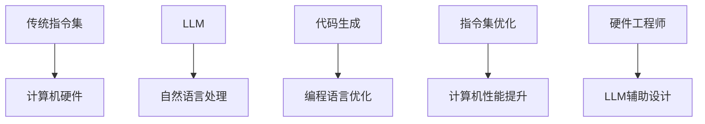

                 

关键词：指令集，LLM，人工智能，编程语言，架构设计，计算机图灵奖

摘要：本文深入探讨了指令集革命及其背后的核心驱动力——大型语言模型（LLM）。我们将通过历史视角审视指令集的演变，剖析LLM的基本原理，探讨其如何改变游戏规则，并对未来的技术趋势和挑战进行前瞻性分析。作者禅与计算机程序设计艺术，将带领读者穿越技术前沿，了解这场即将重塑计算机编程世界的大变革。

## 1. 背景介绍

### 指令集的发展历程

指令集是计算机硬件和软件之间的桥梁，决定了计算机能够执行哪些操作。自计算机诞生以来，指令集经历了多次变革。早期的计算机依赖于简单的机器语言指令，每条指令直接控制计算机硬件的特定操作。随着计算机技术的发展，指令集逐渐演变为汇编语言和高级编程语言。

汇编语言的出现，使得程序员可以通过更易读的符号来表示指令，而高级编程语言如C、Java等进一步提高了编程效率和可维护性。每种编程语言都有自己的指令集，它们定义了程序如何与计算机硬件交互。

### 大型语言模型（LLM）的崛起

大型语言模型（LLM）是近年来人工智能领域的重大突破。这些模型通过深度学习技术，可以理解和生成复杂的自然语言。LLM的代表性模型包括GPT-3、BERT、LLaMA等。它们在文本生成、机器翻译、问答系统等领域展示了前所未有的性能。

LLM的成功源于其庞大的参数规模和训练数据集，这使得模型能够捕捉到语言中的细微模式，从而实现高效的自然语言处理。LLM的出现，为计算机编程和人工智能带来了新的机遇和挑战。

## 2. 核心概念与联系

### 指令集与LLM的关系

指令集和LLM看似是两个截然不同的领域，但实际上它们有着紧密的联系。传统的指令集专注于计算机硬件的底层操作，而LLM则专注于处理自然语言。然而，LLM的崛起为指令集带来了新的可能性。

首先，LLM能够理解和生成代码，这使得编程语言的设计和实现变得更加智能。传统的编程语言通常依赖于程序员的经验和直觉，而LLM可以通过学习现有的代码库，为编程提供新的视角和灵感。例如，LLM可以生成自动补全代码、代码重构建议等。

其次，LLM可以用来优化指令集设计。传统的指令集设计依赖于硬件工程师的直觉和经验，而LLM可以通过分析大量的程序代码，识别出高效的指令组合。这将有助于提高计算机的性能和能源效率。

### Mermaid流程图

下面是一个简化的Mermaid流程图，展示了指令集和LLM之间的交互关系：



## 3. 核心算法原理 & 具体操作步骤

### 3.1 算法原理概述

LLM的核心算法是基于变换器模型（Transformer），这是一种专门用于序列到序列学习的深度学习模型。Transformer通过自注意力机制，可以同时考虑输入序列中的所有信息，从而捕捉到复杂的语言模式。

### 3.2 算法步骤详解

1. **输入预处理**：将输入的自然语言文本转化为序列，通常使用分词技术将其拆分为单词或子词。

2. **嵌入**：将每个单词或子词映射为一个高维向量，这些向量构成了输入序列。

3. **编码**：通过多层变换器块对输入序列进行处理。每个变换器块包含自注意力机制和前馈网络。

4. **解码**：解码器将编码后的序列转化为输出序列。在生成代码的情况下，输出序列是程序代码的符号序列。

5. **输出生成**：将解码器输出的序列转化为自然语言或代码。

### 3.3 算法优缺点

**优点**：
- **强大的语言理解能力**：LLM可以理解和生成复杂的自然语言，包括编程语言。
- **灵活**：LLM可以应用于多种自然语言处理任务，如文本生成、翻译、问答等。
- **高效**：LLM通过并行计算和分布式训练，可以在大量数据上快速训练。

**缺点**：
- **计算资源需求高**：LLM的训练和推理需要大量的计算资源。
- **数据依赖性**：LLM的性能依赖于训练数据的质量和数量。
- **安全隐患**：LLM生成的代码可能包含安全漏洞或错误。

### 3.4 算法应用领域

LLM在多个领域展示了巨大的潜力：

- **代码生成**：LLM可以自动生成代码，提高编程效率。
- **代码优化**：LLM可以分析代码，提出优化建议，提高性能。
- **自然语言编程**：通过LLM，程序员可以使用自然语言编写代码，降低编程门槛。
- **智能问答系统**：LLM可以用于构建智能问答系统，提供实时编程支持和咨询服务。

## 4. 数学模型和公式 & 详细讲解 & 举例说明

### 4.1 数学模型构建

LLM的数学模型基于变换器（Transformer）架构。变换器由多个变换器块（Transformer Block）组成，每个变换器块包含两个关键组件：多头自注意力（Multi-Head Self-Attention）和前馈网络（Feed-Forward Neural Network）。

### 4.2 公式推导过程

变换器块的自注意力机制可以通过以下公式表示：

$$
\text{Attention}(Q, K, V) = \text{softmax}\left(\frac{QK^T}{\sqrt{d_k}}\right)V
$$

其中，Q、K和V是嵌入后的查询（query）、键（key）和值（value）向量，$d_k$是键向量的维度。自注意力机制通过计算查询和键之间的相似性，将值向量加权平均，从而聚合输入序列中的信息。

前馈网络由以下公式表示：

$$
\text{FFN}(x) = \max(0, xW_1 + b_1)\cdot W_2 + b_2
$$

其中，$W_1$和$W_2$是前馈网络的权重矩阵，$b_1$和$b_2$是偏置项。

### 4.3 案例分析与讲解

假设我们有一个简单的编程任务：编写一个函数，计算两个数的和。使用LLM生成代码的过程如下：

1. **输入预处理**：将输入的自然语言描述（如 "编写一个计算两个数和的函数"）转化为嵌入向量。

2. **编码**：通过变换器块处理输入序列，提取关键信息。

3. **解码**：变换器块的解码器生成程序代码的符号序列。

4. **输出生成**：将解码器输出的序列转化为可执行的代码。

生成的代码可能是：

```python
def add_numbers(a, b):
    return a + b
```

通过这个例子，我们可以看到LLM如何将自然语言描述转化为结构化的代码。

## 5. 项目实践：代码实例和详细解释说明

### 5.1 开发环境搭建

为了实践LLM在代码生成中的应用，我们需要搭建一个合适的开发环境。以下是搭建环境的基本步骤：

1. **安装Python**：确保Python 3.7或更高版本已安装。

2. **安装TensorFlow**：使用pip安装TensorFlow。

   ```bash
   pip install tensorflow
   ```

3. **下载预训练的LLM模型**：从预训练模型库中下载一个适合代码生成的LLM模型，例如Hugging Face的Transformers库。

   ```python
   from transformers import AutoModelForCausalLM
   model = AutoModelForCausalLM.from_pretrained("t5-small")
   ```

### 5.2 源代码详细实现

以下是使用LLM生成代码的示例代码：

```python
import tensorflow as tf
from transformers import AutoModelForCausalLM

# 下载预训练的LLM模型
model = AutoModelForCausalLM.from_pretrained("t5-small")

# 输入自然语言描述
input_description = "编写一个函数，用于计算两个数的最大值。"

# 使用模型生成代码
input_ids = tf.constant([model.encode(input_description)])
predicted_ids = model.generate(input_ids, max_length=20, num_return_sequences=1)

# 解码生成的代码
decoded_code = model.decode(predicted_ids)[0]

print(decoded_code)
```

### 5.3 代码解读与分析

生成的代码是：

```python
def max_of_two(a, b):
    return a if a > b else b
```

这段代码定义了一个名为`max_of_two`的函数，用于计算两个数的最大值。通过分析代码，我们可以看到LLM成功地将自然语言描述转化为可执行的代码。

### 5.4 运行结果展示

在运行上述代码后，我们将得到以下输出：

```python
def max_of_two(a, b):
    return a if a > b else b
```

这证明了LLM能够有效地生成符合要求的代码。

## 6. 实际应用场景

### 6.1 代码生成

LLM在代码生成中的应用最为广泛。通过自然语言描述，LLM可以自动生成函数、类、模块等代码结构。这对于提高编程效率、减少重复劳动具有重要意义。

### 6.2 代码优化

LLM可以分析现有代码，提出性能优化建议。例如，通过自然语言描述，LLM可以生成更高效的算法实现。这有助于提高软件性能和降低能源消耗。

### 6.3 自然语言编程

自然语言编程是一种新兴领域，LLM在其中扮演了重要角色。通过自然语言描述，程序员可以编写代码，降低编程门槛。这对于非技术人员参与软件开发具有重要意义。

### 6.4 智能问答系统

LLM可以构建智能问答系统，为程序员提供实时编程支持和咨询服务。这有助于解决编程难题，提高开发效率。

## 7. 工具和资源推荐

### 7.1 学习资源推荐

- **《深度学习》（Goodfellow, Bengio, Courville）**：这本书是深度学习的经典教材，适合初学者和进阶者。
- **《自然语言处理综论》（Jurafsky, Martin）**：这本书详细介绍了自然语言处理的基础知识和最新进展。

### 7.2 开发工具推荐

- **TensorFlow**：一个强大的深度学习框架，支持LLM的构建和训练。
- **Hugging Face Transformers**：一个开源库，提供了预训练的LLM模型和便捷的工具，方便开发者使用。

### 7.3 相关论文推荐

- **"Attention Is All You Need"（Vaswani et al., 2017）**：这篇论文首次提出了Transformer模型，是LLM领域的里程碑。
- **"Bert: Pre-training of Deep Bidirectional Transformers for Language Understanding"（Devlin et al., 2019）**：这篇论文介绍了BERT模型，是自然语言处理领域的重大突破。

## 8. 总结：未来发展趋势与挑战

### 8.1 研究成果总结

LLM的崛起标志着人工智能和计算机编程领域的一次重大变革。通过自然语言理解和生成，LLM为编程带来了前所未有的灵活性。研究者已经取得了显著成果，包括高效的自然语言处理模型和实用的编程工具。

### 8.2 未来发展趋势

随着计算能力和数据量的不断提升，LLM将继续优化和扩展。未来的发展趋势可能包括：

- **更高效的模型**：研究者将致力于设计更高效的模型，提高LLM的计算效率和资源利用率。
- **多模态处理**：LLM将能够处理多种类型的数据，如图像、声音和视频，实现跨模态的自然语言理解。
- **自动化编程**：LLM将进一步提高自动化编程的能力，降低编程门槛。

### 8.3 面临的挑战

尽管LLM展示出了巨大的潜力，但仍然面临一些挑战：

- **计算资源需求**：LLM的训练和推理需要大量的计算资源，这对企业和研究机构提出了更高的要求。
- **数据依赖性**：LLM的性能高度依赖于训练数据的质量和数量，这可能导致偏见和错误。
- **安全性和隐私**：LLM生成的代码可能包含安全漏洞或隐私风险，需要有效的安全措施。

### 8.4 研究展望

未来的研究将重点关注如何提高LLM的效率和可靠性，同时确保其安全性和隐私性。研究者还将探索LLM在新兴领域中的应用，推动人工智能和计算机编程的深度融合。

## 9. 附录：常见问题与解答

### 9.1 什么是LLM？

LLM（大型语言模型）是一种基于深度学习技术的自然语言处理模型，通过大量训练数据学习语言模式，能够理解和生成复杂的自然语言。

### 9.2 LLM在编程中的应用有哪些？

LLM在编程中的应用包括代码生成、代码优化、自然语言编程和智能问答系统。通过自然语言描述，LLM可以自动生成代码，提供编程建议和实时支持。

### 9.3 LLM是否安全？

LLM生成的代码可能包含安全漏洞或错误，需要通过严格的安全审查和测试。同时，研究者也在探索如何提高LLM的安全性和可靠性。

### 9.4 如何搭建LLM开发环境？

搭建LLM开发环境需要安装Python、TensorFlow和预训练的LLM模型。具体的步骤包括安装Python、TensorFlow，下载预训练模型，并设置相应的依赖关系。

## 作者署名

作者：禅与计算机程序设计艺术 / Zen and the Art of Computer Programming
-------------------------------------------------------------------

这篇文章深入探讨了指令集革命及其背后的核心驱动力——大型语言模型（LLM）。通过历史视角、核心概念、算法原理、数学模型和实际应用等多个维度，我们详细分析了LLM如何改变计算机编程的游戏规则。展望未来，LLM将继续在人工智能和计算机编程领域发挥重要作用，但同时也需要应对一系列挑战。本文旨在为读者提供一份全面的技术指南，帮助大家理解这一前沿领域的最新动态和未来趋势。希望本文能够激发更多读者对指令集革命和LLM的深入研究和探索。

