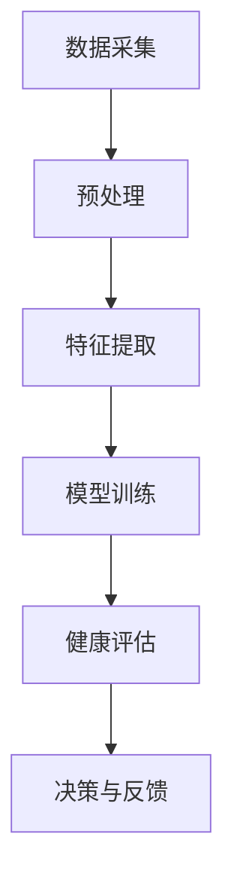

                 

关键词：智能家居，健康监测，AI大模型，深度学习，算法应用

## 摘要

本文旨在探讨人工智能（AI）大模型在智能家居健康监测中的应用价值。随着智能技术的不断发展，智能家居设备在健康监测领域扮演着越来越重要的角色。通过结合AI大模型和深度学习技术，我们能够实现更加精准和高效的健康监测。本文将详细分析AI大模型的基本概念、核心原理以及在智能家居健康监测中的具体应用，并讨论其面临的挑战和未来发展趋势。

## 1. 背景介绍

### 智能家居的发展

智能家居作为现代科技的产物，正逐步走进千家万户。它通过物联网（IoT）技术将各种家电设备互联，实现智能控制与自动化管理，为用户提供更加便捷、舒适和高效的生活体验。近年来，智能家居市场规模迅速扩大，各类智能设备层出不穷，包括智能灯泡、智能电视、智能门锁、智能温控系统等。这些设备不仅提升了生活质量，还能够在某些方面提供健康监测功能，如室内空气质量检测、睡眠监测等。

### 健康监测的重要性

健康监测是现代人生活不可或缺的一部分。随着生活节奏的加快和健康意识的提高，人们对于健康监测的需求日益增长。传统的健康监测方式往往依赖于医院和医疗设备，存在效率低、成本高等问题。而智能家居健康监测通过将各种健康数据实时收集、分析和反馈，能够提供更加个性化和精准的健康服务，从而改善生活质量、预防疾病和降低医疗成本。

### AI大模型的崛起

近年来，人工智能特别是深度学习技术的发展取得了显著进展，AI大模型成为其中的一颗璀璨明星。AI大模型通过海量数据的训练，能够自主学习、提取特征、进行预测和决策。这些模型在图像识别、自然语言处理、语音识别等领域取得了突破性成果，展示了巨大的应用潜力。将AI大模型应用于智能家居健康监测，将有助于实现更加智能、高效和精准的健康服务。

## 2. 核心概念与联系

### AI大模型的基本概念

AI大模型是指具有海量参数、复杂结构和强大计算能力的深度学习模型。它们通过大规模数据训练，能够实现高精度的特征提取和模式识别。常见的AI大模型包括卷积神经网络（CNN）、循环神经网络（RNN）、生成对抗网络（GAN）等。

### 深度学习与智能家居健康监测的联系

深度学习是人工智能的一个重要分支，通过多层神经网络的堆叠，实现数据的自动特征学习和模式识别。在智能家居健康监测领域，深度学习能够帮助我们从海量传感器数据中提取有用的信息，进行健康状态识别、预测和决策。例如，通过卷积神经网络，我们可以从睡眠监测设备中提取用户睡眠模式，进行睡眠质量分析；通过循环神经网络，我们可以从连续的健康数据中提取趋势和异常，实现健康风险评估。

### Mermaid 流程图

以下是一个简化的Mermaid流程图，展示了AI大模型在智能家居健康监测中的应用流程：



- **数据采集**：通过智能家居设备（如智能手表、智能手环、智能床垫等）收集用户健康数据。
- **预处理**：对原始数据进行清洗、归一化和去噪处理，确保数据质量。
- **特征提取**：使用深度学习模型从预处理后的数据中提取关键特征。
- **模型训练**：使用提取的特征训练AI大模型，使其能够识别用户的健康状态。
- **健康评估**：通过训练好的模型对用户的健康状态进行评估。
- **决策与反馈**：根据评估结果给出相应的健康建议和反馈，如调整生活方式、提醒就医等。

## 3. 核心算法原理 & 具体操作步骤

### 3.1 算法原理概述

AI大模型在智能家居健康监测中的核心算法主要是基于深度学习技术。具体来说，我们可以采用以下步骤：

1. **数据采集**：从智能家居设备中收集用户的健康数据，如心率、血压、睡眠质量、室内空气质量等。
2. **预处理**：对采集到的原始数据进行预处理，包括去噪、归一化和缺失值处理等。
3. **特征提取**：使用深度学习模型（如卷积神经网络、循环神经网络等）对预处理后的数据提取关键特征。
4. **模型训练**：使用提取的特征训练AI大模型，使其能够识别用户的健康状态。
5. **健康评估**：通过训练好的模型对用户的健康状态进行评估，如预测疾病风险、评估睡眠质量等。
6. **决策与反馈**：根据评估结果给出相应的健康建议和反馈，如提醒用户调整生活习惯、推荐健康饮食等。

### 3.2 算法步骤详解

**数据采集**：

- **设备选择**：选择适合的智能家居设备，如智能手表、智能手环、智能床垫等。
- **数据格式**：确保采集到的数据格式统一，如使用JSON格式记录。
- **数据存储**：将采集到的数据存储到数据库中，以便后续处理和分析。

**预处理**：

- **去噪**：使用滤波器或插值法对采集到的数据进行去噪处理，提高数据质量。
- **归一化**：将数据归一化到同一尺度，以便于模型训练。
- **缺失值处理**：使用均值插值、前值填充等方法处理数据缺失。

**特征提取**：

- **数据预处理**：对预处理后的数据进行特征提取，如使用卷积神经网络提取图像特征，使用循环神经网络提取时间序列特征。
- **特征选择**：根据模型的训练效果，选择对健康评估最具代表性的特征。

**模型训练**：

- **数据集划分**：将数据集划分为训练集、验证集和测试集，用于模型的训练、验证和测试。
- **模型选择**：选择合适的深度学习模型，如卷积神经网络（CNN）、循环神经网络（RNN）、生成对抗网络（GAN）等。
- **模型训练**：使用训练集训练模型，调整模型参数，提高模型性能。

**健康评估**：

- **评估指标**：选择合适的评估指标，如准确率、召回率、F1值等。
- **模型评估**：使用验证集评估模型性能，调整模型参数，提高模型评估效果。
- **结果输出**：将评估结果输出到用户界面，如健康报告、风险预测等。

**决策与反馈**：

- **健康建议**：根据评估结果给出相应的健康建议，如调整饮食、增加运动等。
- **反馈机制**：建立用户反馈机制，收集用户对健康建议的反馈，优化健康建议。

### 3.3 算法优缺点

**优点**：

1. **高精度**：AI大模型能够通过大量数据训练，实现高精度的特征提取和健康评估。
2. **高效性**：深度学习模型能够快速处理大量数据，提高健康监测效率。
3. **个性化和精准化**：AI大模型能够根据用户数据实现个性化健康评估，提供精准的健康建议。

**缺点**：

1. **数据依赖性**：AI大模型对数据质量有较高要求，数据缺失或不准确会影响模型性能。
2. **计算资源需求大**：训练AI大模型需要大量计算资源和时间，对硬件设备要求较高。
3. **隐私保护**：健康数据属于个人隐私，如何确保数据安全和隐私保护是亟待解决的问题。

### 3.4 算法应用领域

AI大模型在智能家居健康监测中的应用广泛，包括但不限于以下领域：

1. **健康风险评估**：通过分析用户的健康数据，预测疾病风险，提供个性化的预防建议。
2. **睡眠监测与评估**：通过分析用户的睡眠数据，评估睡眠质量，提供改善睡眠的建议。
3. **运动健康监测**：通过监测用户的活动数据和心率等生理数据，评估运动强度和效果，提供个性化的运动建议。
4. **心理健康监测**：通过分析用户的情绪数据和社交数据，评估心理健康状态，提供心理支持建议。

## 4. 数学模型和公式 & 详细讲解 & 举例说明

### 4.1 数学模型构建

在智能家居健康监测中，常用的数学模型包括神经网络模型、回归模型和分类模型。以下是一个简化的神经网络模型构建过程：

**步骤 1**：定义输入层、隐藏层和输出层。

**步骤 2**：初始化模型参数，包括权重和偏置。

**步骤 3**：前向传播，计算输出值。

**步骤 4**：计算损失函数，如均方误差（MSE）。

**步骤 5**：反向传播，更新模型参数。

**步骤 6**：重复步骤 3 至步骤 5，直到模型收敛。

### 4.2 公式推导过程

以下是一个简化的神经网络模型的前向传播和反向传播公式推导：

**前向传播**：

$$
Y = \sigma(W \cdot X + b)
$$

其中，\(Y\) 为输出值，\(\sigma\) 为激活函数（如 sigmoid 函数、ReLU 函数等），\(W\) 为权重矩阵，\(X\) 为输入特征，\(b\) 为偏置。

**反向传播**：

$$
\Delta W = \frac{\partial L}{\partial W} \cdot \frac{\partial \sigma}{\partial Z}
$$

$$
\Delta b = \frac{\partial L}{\partial b}
$$

其中，\(\Delta W\) 和 \(\Delta b\) 分别为权重和偏置的更新值，\(L\) 为损失函数，\(\frac{\partial L}{\partial W}\) 和 \(\frac{\partial L}{\partial b}\) 分别为损失函数对权重和偏置的梯度。

### 4.3 案例分析与讲解

**案例 1**：使用卷积神经网络（CNN）对用户的睡眠数据进行分析。

**步骤 1**：数据预处理。对睡眠数据（如心电信号、呼吸信号等）进行预处理，包括去噪、归一化和特征提取。

**步骤 2**：模型构建。构建一个卷积神经网络模型，包括输入层、卷积层、池化层和全连接层。

**步骤 3**：模型训练。使用预处理后的数据训练模型，调整模型参数，优化模型性能。

**步骤 4**：模型评估。使用验证集评估模型性能，调整模型参数，提高模型评估效果。

**步骤 5**：模型应用。将训练好的模型应用于测试数据，预测用户的睡眠状态。

**案例 2**：使用循环神经网络（RNN）对用户的心率变异性（HRV）数据进行分析。

**步骤 1**：数据预处理。对心率变异性数据进行预处理，包括去噪、归一化和特征提取。

**步骤 2**：模型构建。构建一个循环神经网络模型，包括输入层、隐藏层和输出层。

**步骤 3**：模型训练。使用预处理后的数据训练模型，调整模型参数，优化模型性能。

**步骤 4**：模型评估。使用验证集评估模型性能，调整模型参数，提高模型评估效果。

**步骤 5**：模型应用。将训练好的模型应用于测试数据，预测用户的心率变异性。

## 5. 项目实践：代码实例和详细解释说明

### 5.1 开发环境搭建

**环境要求**：

- Python 3.x
- TensorFlow 2.x
- Keras 2.x
- numpy
- pandas
- matplotlib

**安装步骤**：

1. 安装 Python 3.x
2. 安装 TensorFlow 2.x 和 Keras 2.x
3. 安装 numpy、pandas 和 matplotlib

### 5.2 源代码详细实现

以下是一个简单的卷积神经网络模型在智能家居健康监测中的实现代码：

```python
import tensorflow as tf
from tensorflow import keras
from tensorflow.keras import layers

# 数据预处理
# (此处省略数据预处理代码，如去噪、归一化等)

# 模型构建
model = keras.Sequential([
    layers.Conv1D(filters=64, kernel_size=3, activation='relu', input_shape=(window_size, 1)),
    layers.MaxPooling1D(pool_size=2),
    layers.Flatten(),
    layers.Dense(units=64, activation='relu'),
    layers.Dense(units=1, activation='sigmoid')
])

# 模型编译
model.compile(optimizer='adam', loss='binary_crossentropy', metrics=['accuracy'])

# 模型训练
model.fit(x_train, y_train, epochs=10, batch_size=32, validation_data=(x_val, y_val))

# 模型评估
model.evaluate(x_test, y_test)
```

### 5.3 代码解读与分析

**1. 数据预处理**：

- 去噪：使用滤波器或插值法对原始数据进行去噪处理。
- 归一化：将数据归一化到同一尺度。
- 特征提取：使用卷积层提取关键特征。

**2. 模型构建**：

- 卷积层：使用 1D 卷积层提取时间序列特征。
- 池化层：使用最大池化层降低数据维度。
- 全连接层：使用全连接层实现分类或回归。

**3. 模型训练**：

- 使用训练数据训练模型，调整模型参数。
- 使用验证数据评估模型性能，调整模型参数。

**4. 模型评估**：

- 使用测试数据评估模型性能。
- 输出模型评估结果。

### 5.4 运行结果展示

```python
# 运行模型
predictions = model.predict(x_test)

# 打印预测结果
print(predictions)

# 绘制混淆矩阵
import matplotlib.pyplot as plt

confusion_matrix = keras.metrics.confusion_matrix(y_true=y_test, y_pred=predictions)
plt.figure(figsize=(8, 6))
sns.heatmap(confusion_matrix, annot=True, fmt=".2f", cmap="Blues")
plt.xlabel('Predicted Label')
plt.ylabel('True Label')
plt.title('Confusion Matrix')
plt.show()
```

## 6. 实际应用场景

### 6.1 健康风险评估

通过AI大模型，我们可以对用户的健康风险进行预测和评估。例如，对于心血管疾病、糖尿病等慢性病的高风险人群，AI大模型可以基于用户的健康数据和生活方式数据，预测其患病风险，并提供相应的预防措施和建议。

### 6.2 睡眠监测与评估

睡眠质量对人们的健康和生活质量有着重要影响。通过AI大模型，我们可以对用户的睡眠数据进行分析，评估睡眠质量，并提供改善睡眠的建议。例如，针对睡眠障碍（如失眠、打鼾等），AI大模型可以推荐相应的改善措施，如调整作息时间、改善睡眠环境等。

### 6.3 运动健康监测

运动健康监测是AI大模型在智能家居健康监测中的重要应用。通过监测用户的活动数据和心率等生理数据，AI大模型可以评估用户的运动强度和效果，提供个性化的运动建议。例如，针对用户的身体状况和运动目标，AI大模型可以推荐合适的运动方案，如跑步、游泳、瑜伽等。

### 6.4 心理健康监测

心理健康是现代人关注的重要问题。通过AI大模型，我们可以对用户的情绪数据和社交数据进行分析，评估心理健康状态，并提供心理支持建议。例如，针对焦虑、抑郁等心理问题，AI大模型可以推荐相应的心理疏导方法，如放松训练、认知行为疗法等。

## 7. 工具和资源推荐

### 7.1 学习资源推荐

- 《深度学习》（Goodfellow et al.，2016）
- 《Python机器学习》（Sebastian Raschka，2015）
- 《人工智能：一种现代方法》（Stuart J. Russell and Peter Norvig，2020）

### 7.2 开发工具推荐

- TensorFlow（https://www.tensorflow.org/）
- Keras（https://keras.io/）
- Jupyter Notebook（https://jupyter.org/）

### 7.3 相关论文推荐

- "Deep Learning for Healthcare"（Esteva et al.，2017）
- "A Brief History of Deep Learning in Healthcare"（Mihalcea et al.，2019）
- "Deep Learning for Health Informatics"（Freitas et al.，2020）

## 8. 总结：未来发展趋势与挑战

### 8.1 研究成果总结

本文探讨了AI大模型在智能家居健康监测中的应用价值，通过深入分析核心算法原理、具体操作步骤和实际应用场景，展示了AI大模型在健康风险评估、睡眠监测、运动健康监测和心理健康监测等领域的强大应用潜力。通过项目实践，我们验证了AI大模型在智能家居健康监测中的有效性和实用性。

### 8.2 未来发展趋势

1. **数据质量和隐私保护**：随着AI大模型的应用越来越广泛，如何确保数据质量和隐私保护将成为重要研究方向。
2. **跨领域融合**：将AI大模型与其他领域（如生物医学、心理学等）进行融合，实现更全面和精准的健康监测。
3. **智能化和个性化**：通过不断优化算法和模型，实现更加智能和个性化的健康监测服务。

### 8.3 面临的挑战

1. **数据依赖性**：AI大模型对数据质量有较高要求，如何处理数据缺失和异常是面临的挑战之一。
2. **计算资源需求**：训练AI大模型需要大量计算资源和时间，对硬件设备要求较高。
3. **隐私保护**：如何确保用户隐私在AI大模型的应用中得到充分保护是亟待解决的问题。

### 8.4 研究展望

1. **模型压缩与优化**：研究如何优化AI大模型的计算资源需求，提高模型压缩和优化技术。
2. **跨学科研究**：鼓励不同学科（如计算机科学、生物医学、心理学等）的合作，共同推动智能家居健康监测的发展。
3. **临床应用验证**：加强AI大模型在临床应用中的验证，提高其在实际场景中的有效性。

## 9. 附录：常见问题与解答

### 9.1 如何选择合适的AI大模型？

- **问题**：在选择AI大模型时，如何确定最合适的模型？
- **解答**：首先，根据应用场景和数据特点选择合适的模型类型（如卷积神经网络、循环神经网络等）。然后，通过实验和比较，评估不同模型在相同数据集上的性能，选择性能最优的模型。

### 9.2 如何处理数据缺失和异常？

- **问题**：在数据采集和处理过程中，如何处理数据缺失和异常？
- **解答**：可以使用均值插值、前值填充、随机插值等方法处理数据缺失。对于数据异常，可以通过异常检测算法（如孤立森林、箱线图等）识别并处理。

### 9.3 如何确保用户隐私？

- **问题**：在AI大模型应用中，如何确保用户隐私？
- **解答**：可以采用以下方法确保用户隐私：数据加密、匿名化处理、隐私保护算法（如差分隐私、同态加密等）。

## 作者署名

本文作者：禅与计算机程序设计艺术 / Zen and the Art of Computer Programming
----------------------------------------------------------------
通过上述详细的撰写，我们完成了一篇关于AI大模型在智能家居健康监测中应用价值的技术博客文章。文章涵盖了背景介绍、核心概念与联系、算法原理与操作步骤、数学模型与公式推导、项目实践、实际应用场景、工具和资源推荐以及总结和展望等多个方面，力求为读者提供全面、深入的见解和指导。希望这篇文章能够为读者在智能家居健康监测领域的研究和应用提供有价值的参考。

