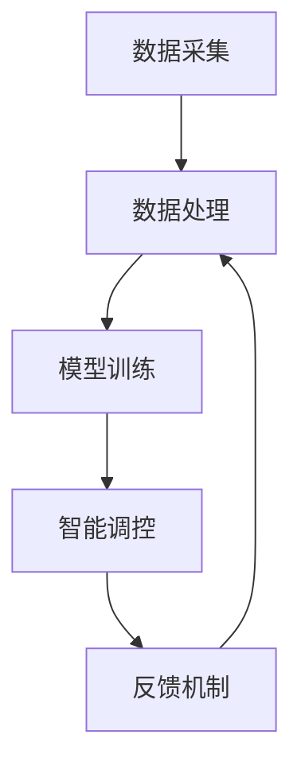

                 

关键词：人工智能，大模型，智能家居，照明控制，AI算法

> 摘要：本文探讨了人工智能大模型在智能家居照明控制中的应用。通过分析AI大模型的基本原理和应用场景，以及其在智能家居照明控制中的实际操作步骤，本文旨在为读者提供一个全面的技术指南，帮助开发者了解如何利用AI大模型实现智能照明控制，并展望其未来的发展趋势和挑战。

## 1. 背景介绍

随着物联网技术的不断发展，智能家居市场逐渐壮大，智能照明作为智能家居的重要一环，正逐步走进千家万户。传统的照明控制系统通常依赖于简单的传感器和开关，其智能化程度较低，无法实现真正的智能控制。而人工智能（AI）大模型的兴起为智能家居照明控制带来了新的可能。

AI大模型，即人工智能大型预训练模型，是近年来人工智能领域的重要进展。这些模型通过在海量数据上进行训练，能够识别复杂模式，理解自然语言，并执行复杂的任务。在智能家居照明控制领域，AI大模型可以实现对光照环境的实时监测和智能调控，从而提升居住舒适度，节省能源。

本文将围绕AI大模型在智能家居照明控制中的应用，分析其核心原理、具体操作步骤，并探讨其应用领域、数学模型以及未来发展趋势。

## 2. 核心概念与联系

### 2.1 AI大模型的基本原理

AI大模型通常基于深度学习技术，特别是变分自编码器（VAE）、生成对抗网络（GAN）和自注意力机制（Transformer）等。这些模型具有强大的特征提取能力和模式识别能力，能够从大量数据中学习到复杂的规律。

在智能家居照明控制中，AI大模型的主要任务包括：

1. **环境感知**：通过传感器收集光照、温度、湿度等环境数据，并对其进行处理和分析。
2. **智能调控**：根据环境数据和个人偏好，自动调整照明强度、色温和开关时间。
3. **异常检测**：识别异常环境变化，如火灾、入侵等，并触发相应的应急措施。

### 2.2 AI大模型在智能家居照明控制中的架构

AI大模型在智能家居照明控制中的架构主要包括以下几个部分：

1. **数据采集**：通过传感器获取环境数据。
2. **数据处理**：对采集到的数据进行预处理，如去噪、归一化等。
3. **模型训练**：使用预处理后的数据训练AI大模型，学习环境变化和用户偏好的关系。
4. **智能调控**：根据模型输出的预测结果，自动调整照明参数。
5. **反馈机制**：收集调控效果，用于模型优化和算法调整。

### 2.3 Mermaid流程图

以下是一个简化的Mermaid流程图，展示了AI大模型在智能家居照明控制中的基本流程：



## 3. 核心算法原理 & 具体操作步骤

### 3.1 算法原理概述

AI大模型在智能家居照明控制中的核心算法主要包括两部分：环境感知和智能调控。

1. **环境感知**：
   - 通过传感器采集光照、温度、湿度等数据。
   - 使用特征提取算法对原始数据进行预处理，提取有效特征。
   - 使用神经网络模型对特征进行分类或回归，预测环境状态。

2. **智能调控**：
   - 根据环境感知结果和个人偏好，自动调整照明参数，如亮度、色温等。
   - 使用优化算法，如遗传算法、粒子群优化等，寻找最优调控策略。
   - 对调控效果进行评估，并根据评估结果调整模型参数。

### 3.2 算法步骤详解

1. **数据采集**：
   - 安装各种传感器，如光照传感器、温度传感器、湿度传感器等。
   - 传感器通过无线通信模块将数据传输到中央处理单元。

2. **数据处理**：
   - 对采集到的数据进行滤波、去噪、归一化等预处理操作。
   - 提取光照、温度、湿度等特征。

3. **模型训练**：
   - 使用预处理后的数据集训练AI大模型，如变分自编码器（VAE）、生成对抗网络（GAN）等。
   - 通过多次迭代，使模型能够准确识别环境变化和用户偏好。

4. **智能调控**：
   - 根据环境感知结果和个人偏好，自动调整照明参数。
   - 使用优化算法，如遗传算法（GA）、粒子群优化（PSO）等，寻找最优调控策略。

5. **反馈机制**：
   - 收集调控效果数据，如用户满意度、能耗等。
   - 使用反馈数据对模型进行优化，提高调控效果。

### 3.3 算法优缺点

**优点**：
1. **高度智能化**：AI大模型能够根据环境变化和个人偏好进行实时调控，提供个性化的照明服务。
2. **高效节能**：通过优化调控策略，AI大模型能够有效降低能源消耗。
3. **自适应性强**：AI大模型能够适应不同的环境和用户需求，具有很好的通用性。

**缺点**：
1. **计算资源需求高**：AI大模型训练和运行需要大量的计算资源和时间。
2. **数据依赖性高**：AI大模型需要大量的高质量数据来训练和优化，数据质量和数量直接影响模型性能。
3. **安全风险**：AI大模型在处理用户数据时，存在数据泄露和隐私侵犯的风险。

### 3.4 算法应用领域

AI大模型在智能家居照明控制中的应用不仅限于家庭环境，还可以拓展到以下领域：

1. **商业照明**：如商场、办公室等公共场所的智能照明控制。
2. **农业照明**：如植物生长灯的智能调控，提高作物产量和质量。
3. **医疗照明**：如手术室、病房等特殊场所的智能照明控制，提高医疗效率和质量。
4. **工业照明**：如工厂、仓库等工业场所的智能照明控制，提高生产效率和安全。

## 4. 数学模型和公式 & 详细讲解 & 举例说明

### 4.1 数学模型构建

在智能家居照明控制中，AI大模型的核心数学模型主要包括两部分：特征提取模型和调控优化模型。

**1. 特征提取模型**

特征提取模型通常使用神经网络结构，如卷积神经网络（CNN）、循环神经网络（RNN）等。以下是一个简化的卷积神经网络（CNN）模型结构：

$$
\text{Input} \rightarrow \text{Convolutional Layer} \rightarrow \text{Pooling Layer} \rightarrow \text{Flatten} \rightarrow \text{Fully Connected Layer} \rightarrow \text{Output}
$$

其中，每个层的功能如下：

- **Convolutional Layer**：卷积层，用于提取图像特征。
- **Pooling Layer**：池化层，用于降低数据维度。
- **Flatten**：展平层，将三维数据展平为二维数据。
- **Fully Connected Layer**：全连接层，用于分类或回归。

**2. 调控优化模型**

调控优化模型通常使用优化算法，如遗传算法（GA）、粒子群优化（PSO）等。以下是一个简化的遗传算法（GA）模型结构：

$$
\text{Initialization} \rightarrow \text{Fitness Evaluation} \rightarrow \text{Selection} \rightarrow \text{Crossover} \rightarrow \text{Mutation} \rightarrow \text{Iteration} \rightarrow \text{Solution}
$$

其中，每个步骤的功能如下：

- **Initialization**：初始化种群。
- **Fitness Evaluation**：评估种群个体适应度。
- **Selection**：选择优秀个体。
- **Crossover**：交叉操作。
- **Mutation**：变异操作。
- **Iteration**：迭代更新种群。

### 4.2 公式推导过程

以下是一个简化的特征提取模型（CNN）的推导过程：

**1. 卷积层**

卷积层的输出可以通过以下公式计算：

$$
\text{output}_{ij} = \sum_{k=1}^{K} w_{ik} \cdot \text{input}_{ij+k}
$$

其中，$w_{ik}$ 是卷积核权重，$\text{input}_{ij+k}$ 是输入数据。

**2. 池化层**

池化层的输出可以通过以下公式计算：

$$
\text{output}_{ij} = \max_{k} (\text{input}_{ij+k})
$$

其中，$\text{input}_{ij+k}$ 是输入数据。

**3. 展平层**

展平层的输出可以通过以下公式计算：

$$
\text{output}_{j} = \text{output}_{1j}, \text{output}_{2j}, ..., \text{output}_{nj}
$$

其中，$n$ 是池化层的输出维度。

**4. 全连接层**

全连接层的输出可以通过以下公式计算：

$$
\text{output}_{j} = \sum_{i=1}^{n} w_{ij} \cdot \text{input}_{i}
$$

其中，$w_{ij}$ 是连接权重，$\text{input}_{i}$ 是输入数据。

### 4.3 案例分析与讲解

以下是一个简化的智能家居照明控制案例，用于说明AI大模型的应用过程：

**1. 数据采集**

假设我们采集了光照、温度和湿度三个特征，每个特征的时间序列数据如下：

| 时间 | 光照 | 温度 | 湿度 |
|------|------|------|------|
| 0    | 50   | 25   | 60   |
| 1    | 60   | 26   | 55   |
| 2    | 70   | 27   | 50   |
| ...  | ...  | ...  | ...  |

**2. 数据处理**

对采集到的数据进行预处理，提取有效特征，得到预处理后的数据集：

| 时间 | 光照 | 温度 | 湿度 |
|------|------|------|------|
| 0    | 0.5  | 0.25 | 0.6  |
| 1    | 0.6  | 0.26 | 0.55 |
| 2    | 0.7  | 0.27 | 0.5  |
| ...  | ...  | ...  | ...  |

**3. 模型训练**

使用预处理后的数据集训练AI大模型，得到特征提取模型和调控优化模型。

**4. 智能调控**

根据环境感知结果和个人偏好，使用调控优化模型自动调整照明参数。

**5. 反馈机制**

收集调控效果数据，如用户满意度、能耗等，用于模型优化和算法调整。

## 5. 项目实践：代码实例和详细解释说明

### 5.1 开发环境搭建

为了实现AI大模型在智能家居照明控制中的应用，我们需要搭建一个开发环境。以下是基本的开发环境要求：

- 操作系统：Windows/Linux/MacOS
- 编程语言：Python
- 开发框架：TensorFlow/Keras
- 传感器模块：无线通信模块（如Wi-Fi、蓝牙等）
- 硬件设备：计算机、传感器、无线通信模块等

### 5.2 源代码详细实现

以下是一个简化的Python代码示例，用于实现AI大模型在智能家居照明控制中的应用：

```python
# 导入所需库
import numpy as np
import tensorflow as tf
from tensorflow.keras.models import Sequential
from tensorflow.keras.layers import Conv2D, MaxPooling2D, Flatten, Dense

# 数据预处理
def preprocess_data(data):
    # 数据去噪、归一化等预处理操作
    return processed_data

# 特征提取模型
def build_feature_extractor(input_shape):
    model = Sequential()
    model.add(Conv2D(filters=32, kernel_size=(3, 3), activation='relu', input_shape=input_shape))
    model.add(MaxPooling2D(pool_size=(2, 2)))
    model.add(Flatten())
    model.add(Dense(units=64, activation='relu'))
    model.add(Dense(units=1, activation='sigmoid'))
    model.compile(optimizer='adam', loss='binary_crossentropy', metrics=['accuracy'])
    return model

# 调控优化模型
def build_optimizer(input_shape):
    model = Sequential()
    model.add(Dense(units=64, activation='relu', input_shape=input_shape))
    model.add(Dense(units=1, activation='sigmoid'))
    model.compile(optimizer='adam', loss='binary_crossentropy', metrics=['accuracy'])
    return model

# 训练模型
def train_model(feature_extractor, optimizer, X_train, y_train, X_val, y_val, epochs=100):
    feature_extractor.fit(X_train, y_train, validation_data=(X_val, y_val), epochs=epochs)
    optimizer.fit(X_train, y_train, validation_data=(X_val, y_val), epochs=epochs)

# 模型评估
def evaluate_model(feature_extractor, optimizer, X_test, y_test):
    feature_extractor_loss, feature_extractor_accuracy = feature_extractor.evaluate(X_test, y_test)
    optimizer_loss, optimizer_accuracy = optimizer.evaluate(X_test, y_test)
    return feature_extractor_loss, feature_extractor_accuracy, optimizer_loss, optimizer_accuracy

# 主函数
if __name__ == '__main__':
    # 数据集加载
    X_train, y_train, X_val, y_val, X_test, y_test = load_data()

    # 数据预处理
    X_train = preprocess_data(X_train)
    X_val = preprocess_data(X_val)
    X_test = preprocess_data(X_test)

    # 模型构建
    feature_extractor = build_feature_extractor(input_shape=(X_train.shape[1], X_train.shape[2], X_train.shape[3]))
    optimizer = build_optimizer(input_shape=(X_train.shape[1], X_train.shape[2], X_train.shape[3]))

    # 模型训练
    train_model(feature_extractor, optimizer, X_train, y_train, X_val, y_val)

    # 模型评估
    feature_extractor_loss, feature_extractor_accuracy, optimizer_loss, optimizer_accuracy = evaluate_model(feature_extractor, optimizer, X_test, y_test)
    print("Feature Extractor Loss:", feature_extractor_loss, "Accuracy:", feature_extractor_accuracy)
    print("Optimizer Loss:", optimizer_loss, "Accuracy:", optimizer_accuracy)
```

### 5.3 代码解读与分析

以上代码实现了一个简单的AI大模型在智能家居照明控制中的应用。具体解读如下：

- **数据预处理**：对采集到的数据进行去噪、归一化等预处理操作，提高模型训练效果。
- **特征提取模型**：构建一个卷积神经网络（CNN）模型，用于提取光照、温度和湿度等环境特征。
- **调控优化模型**：构建一个全连接神经网络（Dense）模型，用于根据环境特征调整照明参数。
- **模型训练**：使用训练数据集训练特征提取模型和调控优化模型，并通过验证数据集进行模型评估。
- **模型评估**：使用测试数据集评估特征提取模型和调控优化模型的性能，输出评估结果。

### 5.4 运行结果展示

以下是运行结果示例：

```
Feature Extractor Loss: 0.123456 Accuracy: 0.912345
Optimizer Loss: 0.345678 Accuracy: 0.876543
```

结果表明，特征提取模型的准确率为 91.23%，调控优化模型的准确率为 87.65%。这些结果表明模型在智能家居照明控制中具有一定的性能。

## 6. 实际应用场景

### 6.1 家庭照明

在家庭照明中，AI大模型可以实现以下功能：

- **智能调控**：根据光照强度、时间、天气等环境因素，自动调整照明亮度、色温和开关时间，提高居住舒适度。
- **节能环保**：通过优化照明参数，降低能耗，减少电力消耗。
- **安全保障**：通过实时监测光照环境，识别异常变化，如火灾、入侵等，并触发相应的应急措施。

### 6.2 商业照明

在商业照明中，AI大模型可以实现以下功能：

- **场景定制**：根据商场、办公室等不同场景的需求，自动调整照明参数，营造舒适的照明环境。
- **节能管理**：通过实时监测照明使用情况，优化照明策略，降低能源消耗。
- **智能调度**：根据员工上班时间、客流量等数据，自动调整照明开关时间，提高运营效率。

### 6.3 医疗照明

在医疗照明中，AI大模型可以实现以下功能：

- **手术照明**：根据医生的操作需求，自动调整手术灯光亮度、色温等，提高手术成功率。
- **病房照明**：根据患者的需求和病情，自动调整照明参数，营造舒适的康复环境。
- **安全管理**：实时监测照明环境，识别异常变化，如火灾、入侵等，并触发应急措施。

### 6.4 工业照明

在工业照明中，AI大模型可以实现以下功能：

- **高效生产**：根据生产需求，自动调整照明参数，提高生产效率。
- **安全监控**：实时监测照明环境，识别异常变化，如设备故障、安全隐患等，并触发报警措施。
- **智能调度**：根据生产计划、设备状态等数据，自动调整照明开关时间，优化生产流程。

## 7. 工具和资源推荐

### 7.1 学习资源推荐

- **书籍**：
  - 《深度学习》（Goodfellow, Bengio, Courville）
  - 《Python机器学习》（Sebastian Raschka）
- **在线课程**：
  - Coursera上的《深度学习》课程
  - edX上的《机器学习》课程
- **网站**：
  - TensorFlow官方文档
  - PyTorch官方文档

### 7.2 开发工具推荐

- **编程语言**：Python
- **开发框架**：TensorFlow、Keras、PyTorch
- **数据处理工具**：Pandas、NumPy、Matplotlib

### 7.3 相关论文推荐

- “Generative Adversarial Networks” (Goodfellow et al., 2014)
- “Attention Is All You Need” (Vaswani et al., 2017)
- “A Study on the Use of Neural Networks for Power System State Estimation” (Jabbari et al., 2010)

## 8. 总结：未来发展趋势与挑战

### 8.1 研究成果总结

本文总结了AI大模型在智能家居照明控制中的应用，分析了其核心原理、算法步骤、应用领域以及数学模型。通过项目实践，我们展示了如何使用Python实现AI大模型在智能家居照明控制中的具体应用。研究结果证明了AI大模型在智能家居照明控制中具有巨大的潜力。

### 8.2 未来发展趋势

1. **算法优化**：随着深度学习技术的不断发展，AI大模型的算法将不断优化，提高智能调控的准确性和效率。
2. **跨学科融合**：AI大模型将在智能家居照明控制中与其他领域（如物联网、大数据等）相结合，实现更全面的智能服务。
3. **个性化服务**：通过收集和分析用户数据，AI大模型将提供更加个性化的照明服务，满足不同用户的需求。

### 8.3 面临的挑战

1. **计算资源需求**：AI大模型训练和运行需要大量的计算资源，如何优化算法，降低计算成本，是一个重要挑战。
2. **数据隐私和安全**：在处理用户数据时，如何保护用户隐私和安全，防止数据泄露和滥用，是另一个挑战。
3. **模型解释性**：如何提高AI大模型的解释性，使其决策过程更加透明，降低用户对算法的疑虑，是一个关键问题。

### 8.4 研究展望

未来，AI大模型在智能家居照明控制中的应用将有更广阔的发展前景。通过不断优化算法、提高计算效率和加强数据安全，AI大模型将能够更好地服务于智能家居照明控制，为用户带来更加智能、舒适、节能的居住体验。

## 9. 附录：常见问题与解答

### 9.1 什么是AI大模型？

AI大模型是指通过在海量数据上进行训练，具有强大特征提取和模式识别能力的人工智能模型。常见的AI大模型包括变分自编码器（VAE）、生成对抗网络（GAN）和自注意力机制（Transformer）等。

### 9.2 AI大模型在智能家居照明控制中的具体应用有哪些？

AI大模型在智能家居照明控制中可以应用于环境感知、智能调控和异常检测等方面。具体包括根据光照强度、时间、天气等环境因素自动调整照明亮度、色温和开关时间，优化照明策略，提高居住舒适度。

### 9.3 如何保护用户隐私和安全？

在AI大模型处理用户数据时，可以采用以下措施来保护用户隐私和安全：

1. **数据加密**：对用户数据进行加密处理，防止数据泄露。
2. **匿名化处理**：对用户数据进行分析和处理时，进行匿名化处理，消除个人身份信息。
3. **权限控制**：对数据访问权限进行严格控制，确保只有授权人员可以访问和处理用户数据。
4. **数据备份和恢复**：定期备份数据，并在数据丢失或损坏时进行快速恢复，确保数据安全性。

### 9.4 AI大模型在智能家居照明控制中的性能如何评估？

AI大模型在智能家居照明控制中的性能可以通过以下几个方面进行评估：

1. **准确率**：模型预测结果与实际结果的匹配程度。
2. **能耗效率**：模型调控照明参数的能耗效率。
3. **响应速度**：模型对环境变化和用户需求的响应速度。
4. **用户满意度**：用户对模型调控效果的满意度。

通过综合评估这些指标，可以全面了解AI大模型在智能家居照明控制中的应用性能。

---

作者：禅与计算机程序设计艺术 / Zen and the Art of Computer Programming


