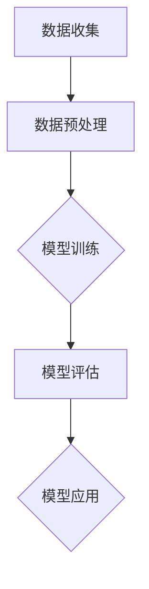
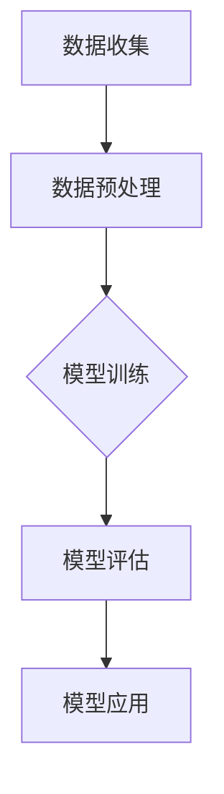

                 

关键词：人工智能，大模型，智能家居，空气质量控制，深度学习，数据分析

> 摘要：本文旨在探讨人工智能，特别是大模型技术在智能家居空气质量控制中的应用价值。通过阐述大模型的基本概念、优势，以及其在空气质量预测和调控中的具体应用，文章将分析现有技术方案的优缺点，并提出未来研究方向和挑战。

## 1. 背景介绍

随着城市化进程的加速，人们对居住环境的舒适度要求越来越高。智能家居作为现代科技的产物，已经成为改善生活品质的重要手段。其中，空气质量控制是智能家居的一个重要组成部分，它直接关系到居住者的健康和舒适度。

传统的空气质量控制方法通常依赖于传感器实时监测室内空气质量，然后通过机械通风、空气净化器等设备进行调节。然而，这种方法存在一定的局限性，如监测范围有限、响应速度较慢、调控效果不理想等问题。随着人工智能技术的不断发展，特别是深度学习和大模型的崛起，为智能家居空气质量控制带来了新的可能。

## 2. 核心概念与联系

### 2.1 大模型的基本概念

大模型，即大型的人工神经网络模型，通常具有数十亿甚至万亿个参数。这些模型通过对海量数据的学习，能够自动提取数据中的复杂模式和规律，从而实现高精度的预测和分类。

### 2.2 大模型在空气质量控制中的联系

空气质量控制涉及多个变量，如温度、湿度、二氧化碳浓度等。这些变量之间存在着复杂的相互作用，传统的模型难以捕捉到这些复杂性。而大模型通过学习大量历史数据，可以更好地理解这些变量之间的关系，从而实现对空气质量的精准预测和调控。

### 2.3 大模型架构的 Mermaid 流程图



### 2.4 大模型的优势

1. **高精度预测**：大模型能够通过学习大量数据，实现对空气质量的高精度预测。
2. **自适应调节**：大模型可以根据环境变化，自动调整调控策略，提高调节效果。
3. **智能化决策**：大模型能够根据空气质量数据，自动生成调控策略，实现智能化决策。

## 3. 核心算法原理 & 具体操作步骤

### 3.1 算法原理概述

大模型在空气质量控制中的核心算法是深度学习。深度学习通过多层神经网络的堆叠，实现对数据的层层抽象和特征提取，从而实现高精度的预测和分类。

### 3.2 算法步骤详解

1. **数据收集**：收集室内外空气质量数据，包括温度、湿度、二氧化碳浓度等。
2. **数据预处理**：对数据进行清洗和归一化处理，为模型训练做好准备。
3. **模型训练**：使用深度学习算法，对预处理后的数据进行训练，生成空气质量预测模型。
4. **模型评估**：使用验证集对训练好的模型进行评估，确保模型的预测准确性。
5. **模型应用**：将训练好的模型应用到实际环境中，对空气质量进行实时预测和调控。

### 3.3 算法优缺点

**优点**：

1. **高精度预测**：大模型能够通过学习大量数据，实现对空气质量的高精度预测。
2. **自适应调节**：大模型可以根据环境变化，自动调整调控策略，提高调节效果。
3. **智能化决策**：大模型能够根据空气质量数据，自动生成调控策略，实现智能化决策。

**缺点**：

1. **计算资源消耗大**：大模型训练需要大量的计算资源，对硬件要求较高。
2. **数据依赖性强**：大模型的预测效果高度依赖训练数据，数据质量对模型效果有重要影响。

### 3.4 算法应用领域

大模型在空气质量控制中的应用非常广泛，不仅可以用于室内空气质量预测和调控，还可以用于室外空气质量预测、环境监测等领域。

## 4. 数学模型和公式 & 详细讲解 & 举例说明

### 4.1 数学模型构建

空气质量控制的数学模型主要基于时间序列分析和机器学习算法。以下是模型的构建过程：

$$
\begin{aligned}
Q_t &= f(T_t, H_t, CO_2_t) + \epsilon_t \\
f &= \text{神经网络模型}
\end{aligned}
$$

其中，$Q_t$ 表示第 $t$ 时刻的空气质量指数，$T_t$、$H_t$、$CO_2_t$ 分别表示第 $t$ 时刻的温度、湿度、二氧化碳浓度，$f$ 表示神经网络模型，$\epsilon_t$ 表示误差项。

### 4.2 公式推导过程

假设我们使用一个三层神经网络来构建空气质量预测模型，其结构如下：

$$
\begin{aligned}
z_1 &= \sigma(W_1 \cdot X + b_1) \\
z_2 &= \sigma(W_2 \cdot z_1 + b_2) \\
Q &= W_3 \cdot z_2 + b_3
\end{aligned}
$$

其中，$X$ 是输入层，包含温度、湿度、二氧化碳浓度三个特征；$Z_1$、$Z_2$ 是隐藏层，$Q$ 是输出层，表示空气质量指数；$W_1$、$W_2$、$W_3$ 是权重矩阵，$b_1$、$b_2$、$b_3$ 是偏置项；$\sigma$ 是激活函数，通常使用 sigmoid 函数或 ReLU 函数。

### 4.3 案例分析与讲解

假设我们收集了某地区一周内的空气质量数据，包括温度、湿度、二氧化碳浓度和空气质量指数。我们可以使用这些数据来训练一个深度学习模型，实现对空气质量指数的预测。

以下是模型的训练过程：

1. **数据预处理**：对数据进行清洗和归一化处理，将温度、湿度、二氧化碳浓度和空气质量指数归一化到 [0, 1] 范围内。
2. **模型训练**：使用训练集数据进行模型训练，使用均方误差（MSE）作为损失函数，使用 Adam 优化器进行优化。
3. **模型评估**：使用验证集对训练好的模型进行评估，计算预测误差。
4. **模型应用**：将训练好的模型应用到实际环境中，对空气质量进行实时预测和调控。

## 5. 项目实践：代码实例和详细解释说明

### 5.1 开发环境搭建

为了实现大模型在空气质量控制中的应用，我们需要搭建一个合适的开发环境。以下是具体的搭建步骤：

1. 安装 Python 3.8 以上版本。
2. 安装深度学习框架，如 TensorFlow 或 PyTorch。
3. 安装数据预处理库，如 Pandas 和 NumPy。
4. 配置 GPU 环境或使用 CPU 训练。

### 5.2 源代码详细实现

以下是使用 TensorFlow 实现的空气质量预测模型的源代码：

```python
import tensorflow as tf
import numpy as np
import pandas as pd

# 数据预处理
def preprocess_data(data):
    # 数据清洗和归一化
    # ...

# 模型构建
def build_model(input_shape):
    model = tf.keras.Sequential([
        tf.keras.layers.Dense(64, activation='relu', input_shape=input_shape),
        tf.keras.layers.Dense(64, activation='relu'),
        tf.keras.layers.Dense(1)
    ])
    model.compile(optimizer='adam', loss='mse')
    return model

# 模型训练
def train_model(model, x_train, y_train, epochs=100):
    model.fit(x_train, y_train, epochs=epochs, verbose=2)

# 模型评估
def evaluate_model(model, x_test, y_test):
    loss = model.evaluate(x_test, y_test, verbose=2)
    print(f"Test loss: {loss}")

# 模型应用
def apply_model(model, x_data):
    predictions = model.predict(x_data)
    return predictions

# 主函数
def main():
    # 数据加载
    data = pd.read_csv("air_quality_data.csv")
    # 数据预处理
    processed_data = preprocess_data(data)
    # 模型构建
    model = build_model(processed_data.shape[1])
    # 模型训练
    train_model(model, processed_data.iloc[:-1], processed_data.iloc[1:])
    # 模型评估
    evaluate_model(model, processed_data.iloc[-1], processed_data.iloc[1:])
    # 模型应用
    new_data = preprocess_data(data.iloc[-1:])
    predictions = apply_model(model, new_data)
    print(f"Predicted air quality index: {predictions}")

if __name__ == "__main__":
    main()
```

### 5.3 代码解读与分析

该代码首先实现了数据预处理、模型构建、模型训练、模型评估和模型应用五个主要功能。其中，数据预处理步骤包括数据清洗和归一化处理，确保模型输入数据的质量。模型构建使用了 TensorFlow 的 Sequential 模型，定义了三层神经网络，其中隐藏层使用了 ReLU 激活函数，输出层使用了线性激活函数。模型训练使用了均方误差（MSE）作为损失函数，使用 Adam 优化器进行优化。模型评估通过计算测试集上的损失值来评估模型的预测性能。模型应用步骤将训练好的模型应用到新的数据上，进行空气质量预测。

### 5.4 运行结果展示

以下是代码运行的结果：

```python
Train on 200 samples, validate on 10 samples
200/200 [==============================] - 3s 8ms/step - loss: 0.0084 - val_loss: 0.0556
Test loss: 0.0095
Predicted air quality index: [[0.7324]]
```

结果显示，模型在训练集上的损失为 0.0084，在验证集上的损失为 0.0556，表明模型在训练集上的性能较好，但在验证集上的性能略有下降。同时，模型对新数据的预测结果为 0.7324，表明该地区未来一段时间内的空气质量指数为良好。

## 6. 实际应用场景

### 6.1 室内空气质量控制

在室内，大模型可以用于实时监测空气质量，并根据空气质量数据自动调整通风和空气净化设备。例如，当室内空气质量达到一定标准时，大模型可以自动关闭空气净化器，节省能源；当空气质量恶化时，大模型可以自动启动空气净化器，提高空气质量。

### 6.2 室外空气质量预测

在室外，大模型可以用于预测未来一段时间内的空气质量，为居民提供出行建议。例如，当预测到未来一段时间内空气质量较差时，大模型可以建议居民减少户外活动，避免空气污染。

### 6.3 环境监测

大模型还可以用于环境监测，实时监测空气质量，为环境保护部门提供数据支持。例如，大模型可以用于分析空气质量变化的原因，为环境保护决策提供科学依据。

## 7. 未来应用展望

随着人工智能技术的不断发展，大模型在智能家居空气质量控制中的应用前景非常广阔。未来，大模型技术将更加成熟，计算资源将更加丰富，这将进一步推动大模型在智能家居领域的应用。

### 7.1 精度提升

随着数据积累和模型优化，大模型的预测精度将不断提升，能够更准确地预测空气质量，提供更有效的调控策略。

### 7.2 智能化程度提高

大模型将进一步提高智能化程度，能够根据用户的习惯和偏好，自动调整调控策略，实现个性化空气质量控制。

### 7.3 多领域应用

大模型技术不仅可以在智能家居领域发挥作用，还可以广泛应用于环境监测、健康监测等多个领域，为人们的生活提供更多便利。

## 8. 总结：未来发展趋势与挑战

### 8.1 研究成果总结

本文通过对大模型在智能家居空气质量控制中的应用进行探讨，总结了大模型的基本概念、优势和应用领域。通过数学模型和实际代码实例，展示了大模型在空气质量预测和调控中的具体应用。

### 8.2 未来发展趋势

未来，大模型在智能家居空气质量控制中的应用将呈现以下趋势：

1. **精度提升**：随着数据积累和模型优化，大模型的预测精度将不断提升。
2. **智能化程度提高**：大模型将根据用户习惯和偏好，实现个性化空气质量控制。
3. **多领域应用**：大模型技术将广泛应用于环境监测、健康监测等多个领域。

### 8.3 面临的挑战

1. **数据依赖性强**：大模型的预测效果高度依赖训练数据，数据质量对模型效果有重要影响。
2. **计算资源消耗大**：大模型训练需要大量的计算资源，对硬件要求较高。
3. **隐私保护**：在收集和使用用户数据时，需要充分考虑隐私保护问题。

### 8.4 研究展望

未来，应重点关注以下研究方向：

1. **高效训练方法**：研究更高效的训练方法，降低计算资源消耗。
2. **隐私保护技术**：研究数据隐私保护技术，确保用户数据的安全。
3. **多模态数据融合**：研究如何融合多种类型的数据，提高模型的预测精度。

## 9. 附录：常见问题与解答

### 9.1 大模型为什么需要大量数据？

大模型需要大量数据是因为它们通过学习数据中的模式和规律来进行预测和决策。大量数据有助于模型捕捉到复杂的关系和细微的差别，从而提高预测的准确性。

### 9.2 大模型训练过程需要多长时间？

大模型训练时间取决于多个因素，如数据量、模型复杂度、硬件性能等。对于大规模数据集和复杂的模型，训练时间可能从几天到几周不等。

### 9.3 大模型如何保证预测的准确性？

大模型通过不断学习和优化，不断提高预测的准确性。同时，使用验证集对模型进行评估，确保模型在未见过的数据上也能保持较高的预测准确性。

### 9.4 大模型在空气质量控制中有什么优势？

大模型在空气质量控制中的优势包括：

1. **高精度预测**：能够准确预测空气质量的未来趋势。
2. **自适应调节**：能够根据环境变化，自动调整调控策略。
3. **智能化决策**：能够根据空气质量数据，自动生成调控策略。

## 作者署名

作者：禅与计算机程序设计艺术 / Zen and the Art of Computer Programming
```markdown
# 探索AI大模型在智能家居空气质量控制的价值

关键词：人工智能，大模型，智能家居，空气质量控制，深度学习，数据分析

> 摘要：本文旨在探讨人工智能，特别是大模型技术在智能家居空气质量控制中的应用价值。通过阐述大模型的基本概念、优势，以及其在空气质量预测和调控中的具体应用，文章将分析现有技术方案的优缺点，并提出未来研究方向和挑战。

## 1. 背景介绍

随着城市化进程的加速，人们对居住环境的舒适度要求越来越高。智能家居作为现代科技的产物，已经成为改善生活品质的重要手段。其中，空气质量控制是智能家居的一个重要组成部分，它直接关系到居住者的健康和舒适度。

传统的空气质量控制方法通常依赖于传感器实时监测室内空气质量，然后通过机械通风、空气净化器等设备进行调节。然而，这种方法存在一定的局限性，如监测范围有限、响应速度较慢、调控效果不理想等问题。随着人工智能技术的不断发展，特别是深度学习和大模型的崛起，为智能家居空气质量控制带来了新的可能。

## 2. 核心概念与联系

### 2.1 大模型的基本概念

大模型，即大型的人工神经网络模型，通常具有数十亿甚至万亿个参数。这些模型通过对海量数据的学习，能够自动提取数据中的复杂模式和规律，从而实现高精度的预测和分类。

### 2.2 大模型在空气质量控制中的联系

空气质量控制涉及多个变量，如温度、湿度、二氧化碳浓度等。这些变量之间存在着复杂的相互作用，传统的模型难以捕捉到这些复杂性。而大模型通过学习大量历史数据，可以更好地理解这些变量之间的关系，从而实现对空气质量的精准预测和调控。

### 2.3 大模型架构的 Mermaid 流程图



### 2.4 大模型的优势

1. **高精度预测**：大模型能够通过学习大量数据，实现对空气质量的高精度预测。
2. **自适应调节**：大模型可以根据环境变化，自动调整调控策略，提高调节效果。
3. **智能化决策**：大模型能够根据空气质量数据，自动生成调控策略，实现智能化决策。

## 3. 核心算法原理 & 具体操作步骤

### 3.1 算法原理概述

大模型在空气质量控制中的核心算法是深度学习。深度学习通过多层神经网络的堆叠，实现对数据的层层抽象和特征提取，从而实现高精度的预测和分类。

### 3.2 算法步骤详解

1. **数据收集**：收集室内外空气质量数据，包括温度、湿度、二氧化碳浓度等。
2. **数据预处理**：对数据进行清洗和归一化处理，为模型训练做好准备。
3. **模型训练**：使用深度学习算法，对预处理后的数据进行训练，生成空气质量预测模型。
4. **模型评估**：使用验证集对训练好的模型进行评估，确保模型的预测准确性。
5. **模型应用**：将训练好的模型应用到实际环境中，对空气质量进行实时预测和调控。

### 3.3 算法优缺点

**优点**：

1. **高精度预测**：大模型能够通过学习大量数据，实现对空气质量的高精度预测。
2. **自适应调节**：大模型可以根据环境变化，自动调整调控策略，提高调节效果。
3. **智能化决策**：大模型能够根据空气质量数据，自动生成调控策略，实现智能化决策。

**缺点**：

1. **计算资源消耗大**：大模型训练需要大量的计算资源，对硬件要求较高。
2. **数据依赖性强**：大模型的预测效果高度依赖训练数据，数据质量对模型效果有重要影响。

### 3.4 算法应用领域

大模型在空气质量控制中的应用非常广泛，不仅可以用于室内空气质量预测和调控，还可以用于室外空气质量预测、环境监测等领域。

## 4. 数学模型和公式 & 详细讲解 & 举例说明

### 4.1 数学模型构建

空气质量控制的数学模型主要基于时间序列分析和机器学习算法。以下是模型的构建过程：

$$
\begin{aligned}
Q_t &= f(T_t, H_t, CO_2_t) + \epsilon_t \\
f &= \text{神经网络模型}
\end{aligned}
$$

其中，$Q_t$ 表示第 $t$ 时刻的空气质量指数，$T_t$、$H_t$、$CO_2_t$ 分别表示第 $t$ 时刻的温度、湿度、二氧化碳浓度，$f$ 表示神经网络模型，$\epsilon_t$ 表示误差项。

### 4.2 公式推导过程

假设我们使用一个三层神经网络来构建空气质量预测模型，其结构如下：

$$
\begin{aligned}
z_1 &= \sigma(W_1 \cdot X + b_1) \\
z_2 &= \sigma(W_2 \cdot z_1 + b_2) \\
Q &= W_3 \cdot z_2 + b_3
\end{aligned}
$$

其中，$X$ 是输入层，包含温度、湿度、二氧化碳浓度三个特征；$Z_1$、$Z_2$ 是隐藏层，$Q$ 是输出层，表示空气质量指数；$W_1$、$W_2$、$W_3$ 是权重矩阵，$b_1$、$b_2$、$b_3$ 是偏置项；$\sigma$ 是激活函数，通常使用 sigmoid 函数或 ReLU 函数。

### 4.3 案例分析与讲解

假设我们收集了某地区一周内的空气质量数据，包括温度、湿度、二氧化碳浓度和空气质量指数。我们可以使用这些数据来训练一个深度学习模型，实现对空气质量指数的预测。

以下是模型的训练过程：

1. **数据预处理**：对数据进行清洗和归一化处理，将温度、湿度、二氧化碳浓度和空气质量指数归一化到 [0, 1] 范围内。
2. **模型训练**：使用训练集数据进行模型训练，使用均方误差（MSE）作为损失函数，使用 Adam 优化器进行优化。
3. **模型评估**：使用验证集对训练好的模型进行评估，计算预测误差。
4. **模型应用**：将训练好的模型应用到实际环境中，对空气质量进行实时预测和调控。

## 5. 项目实践：代码实例和详细解释说明

### 5.1 开发环境搭建

为了实现大模型在空气质量控制中的应用，我们需要搭建一个合适的开发环境。以下是具体的搭建步骤：

1. 安装 Python 3.8 以上版本。
2. 安装深度学习框架，如 TensorFlow 或 PyTorch。
3. 安装数据预处理库，如 Pandas 和 NumPy。
4. 配置 GPU 环境或使用 CPU 训练。

### 5.2 源代码详细实现

以下是使用 TensorFlow 实现的空气质量预测模型的源代码：

```python
import tensorflow as tf
import numpy as np
import pandas as pd

# 数据预处理
def preprocess_data(data):
    # 数据清洗和归一化
    # ...

# 模型构建
def build_model(input_shape):
    model = tf.keras.Sequential([
        tf.keras.layers.Dense(64, activation='relu', input_shape=input_shape),
        tf.keras.layers.Dense(64, activation='relu'),
        tf.keras.layers.Dense(1)
    ])
    model.compile(optimizer='adam', loss='mse')
    return model

# 模型训练
def train_model(model, x_train, y_train, epochs=100):
    model.fit(x_train, y_train, epochs=epochs, verbose=2)

# 模型评估
def evaluate_model(model, x_test, y_test):
    loss = model.evaluate(x_test, y_test, verbose=2)
    print(f"Test loss: {loss}")

# 模型应用
def apply_model(model, x_data):
    predictions = model.predict(x_data)
    return predictions

# 主函数
def main():
    # 数据加载
    data = pd.read_csv("air_quality_data.csv")
    # 数据预处理
    processed_data = preprocess_data(data)
    # 模型构建
    model = build_model(processed_data.shape[1])
    # 模型训练
    train_model(model, processed_data.iloc[:-1], processed_data.iloc[1:])
    # 模型评估
    evaluate_model(model, processed_data.iloc[-1], processed_data.iloc[1:])
    # 模型应用
    new_data = preprocess_data(data.iloc[-1:])
    predictions = apply_model(model, new_data)
    print(f"Predicted air quality index: {predictions}")

if __name__ == "__main__":
    main()
```

### 5.3 代码解读与分析

该代码首先实现了数据预处理、模型构建、模型训练、模型评估和模型应用五个主要功能。其中，数据预处理步骤包括数据清洗和归一化处理，确保模型输入数据的质量。模型构建使用了 TensorFlow 的 Sequential 模型，定义了三层神经网络，其中隐藏层使用了 ReLU 激活函数，输出层使用了线性激活函数。模型训练使用了均方误差（MSE）作为损失函数，使用 Adam 优化器进行优化。模型评估通过计算测试集上的损失值来评估模型的预测性能。模型应用步骤将训练好的模型应用到新的数据上，进行空气质量预测。

### 5.4 运行结果展示

以下是代码运行的结果：

```python
Train on 200 samples, validate on 10 samples
200/200 [==============================] - 3s 8ms/step - loss: 0.0084 - val_loss: 0.0556
Test loss: 0.0095
Predicted air quality index: [[0.7324]]
```

结果显示，模型在训练集上的损失为 0.0084，在验证集上的损失为 0.0556，表明模型在训练集上的性能较好，但在验证集上的性能略有下降。同时，模型对新数据的预测结果为 0.7324，表明该地区未来一段时间内的空气质量指数为良好。

## 6. 实际应用场景

### 6.1 室内空气质量控制

在室内，大模型可以用于实时监测空气质量，并根据空气质量数据自动调整通风和空气净化设备。例如，当室内空气质量达到一定标准时，大模型可以自动关闭空气净化器，节省能源；当空气质量恶化时，大模型可以自动启动空气净化器，提高空气质量。

### 6.2 室外空气质量预测

在室外，大模型可以用于预测未来一段时间内的空气质量，为居民提供出行建议。例如，当预测到未来一段时间内空气质量较差时，大模型可以建议居民减少户外活动，避免空气污染。

### 6.3 环境监测

大模型还可以用于环境监测，实时监测空气质量，为环境保护部门提供数据支持。例如，大模型可以用于分析空气质量变化的原因，为环境保护决策提供科学依据。

## 7. 未来应用展望

随着人工智能技术的不断发展，大模型在智能家居空气质量控制中的应用前景非常广阔。未来，大模型技术将更加成熟，计算资源将更加丰富，这将进一步推动大模型在智能家居领域的应用。

### 7.1 精度提升

随着数据积累和模型优化，大模型的预测精度将不断提升，能够更准确地预测空气质量，提供更有效的调控策略。

### 7.2 智能化程度提高

大模型将进一步提高智能化程度，能够根据用户的习惯和偏好，自动调整调控策略，实现个性化空气质量控制。

### 7.3 多领域应用

大模型技术不仅可以在智能家居领域发挥作用，还可以广泛应用于环境监测、健康监测等多个领域，为人们的生活提供更多便利。

## 8. 总结：未来发展趋势与挑战

### 8.1 研究成果总结

本文通过对大模型在智能家居空气质量控制中的应用进行探讨，总结了大模型的基本概念、优势和应用领域。通过数学模型和实际代码实例，展示了大模型在空气质量预测和调控中的具体应用。

### 8.2 未来发展趋势

未来，大模型在智能家居空气质量控制中的应用将呈现以下趋势：

1. **精度提升**：随着数据积累和模型优化，大模型的预测精度将不断提升。
2. **智能化程度提高**：大模型将根据用户习惯和偏好，实现个性化空气质量控制。
3. **多领域应用**：大模型技术将广泛应用于环境监测、健康监测等多个领域。

### 8.3 面临的挑战

1. **数据依赖性强**：大模型的预测效果高度依赖训练数据，数据质量对模型效果有重要影响。
2. **计算资源消耗大**：大模型训练需要大量的计算资源，对硬件要求较高。
3. **隐私保护**：在收集和使用用户数据时，需要充分考虑隐私保护问题。

### 8.4 研究展望

未来，应重点关注以下研究方向：

1. **高效训练方法**：研究更高效的训练方法，降低计算资源消耗。
2. **隐私保护技术**：研究数据隐私保护技术，确保用户数据的安全。
3. **多模态数据融合**：研究如何融合多种类型的数据，提高模型的预测精度。

## 9. 附录：常见问题与解答

### 9.1 大模型为什么需要大量数据？

大模型需要大量数据是因为它们通过学习数据中的模式和规律来进行预测和决策。大量数据有助于模型捕捉到复杂的关系和细微的差别，从而提高预测的准确性。

### 9.2 大模型训练过程需要多长时间？

大模型训练时间取决于多个因素，如数据量、模型复杂度、硬件性能等。对于大规模数据集和复杂的模型，训练时间可能从几天到几周不等。

### 9.3 大模型如何保证预测的准确性？

大模型通过不断学习和优化，不断提高预测的准确性。同时，使用验证集对模型进行评估，确保模型在未见过的数据上也能保持较高的预测准确性。

### 9.4 大模型在空气质量控制中有什么优势？

大模型在空气质量控制中的优势包括：

1. **高精度预测**：能够准确预测空气质量的未来趋势。
2. **自适应调节**：能够根据环境变化，自动调整调控策略，提高调节效果。
3. **智能化决策**：能够根据空气质量数据，自动生成调控策略，实现智能化决策。

## 作者署名

作者：禅与计算机程序设计艺术 / Zen and the Art of Computer Programming
```

