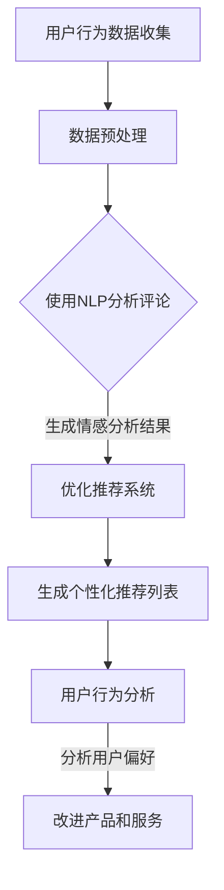

                 

关键词：AI大模型，电商平台，社交商务，自然语言处理，个性化推荐，用户行为分析，营销策略，数据分析

> 摘要：本文将探讨AI大模型在电商平台社交商务领域的应用潜力。通过对自然语言处理、个性化推荐、用户行为分析等技术的深入分析，本文旨在揭示AI大模型在提升电商平台用户体验、优化营销策略和增强用户互动等方面的关键作用。同时，本文还将讨论当前AI大模型在电商平台社交商务中的应用现状，以及未来发展的趋势和挑战。

## 1. 背景介绍

在互联网迅猛发展的今天，电商平台已成为人们日常生活中不可或缺的一部分。用户不仅通过这些平台购买商品，还通过社交媒体分享购物经验、推荐商品和评价卖家。这种社交商务模式不仅改变了传统电商的运作方式，也为电商平台提供了丰富的用户数据。而AI大模型，作为人工智能领域的重要突破，正逐渐成为电商平台社交商务创新的核心驱动力。

### 1.1 电商平台社交商务的定义与现状

电商平台社交商务是指利用社交媒体和电商平台相结合的方式，通过社交互动和分享，促进商品销售和用户参与。根据Statista的数据显示，全球社交商务市场规模预计在2025年将达到约6.7万亿美元。目前，许多电商平台如淘宝、京东、亚马逊等，都纷纷引入社交功能，如社区团购、直播带货等，以提升用户参与度和销售额。

### 1.2 AI大模型的发展与应用

AI大模型是指通过深度学习和大数据技术，训练出的具有强大学习能力的人工智能系统。这些模型能够处理大量复杂的任务，如自然语言处理、图像识别、推荐系统等。近年来，随着计算能力的提升和算法的进步，AI大模型在各个领域的应用越来越广泛，尤其是在电商平台的社交商务中，其潜力备受关注。

## 2. 核心概念与联系

为了深入探讨AI大模型在电商平台社交商务中的应用，我们首先需要了解几个核心概念及其相互之间的联系。

### 2.1 自然语言处理

自然语言处理（NLP）是AI大模型的重要组成部分，它使得计算机能够理解和处理人类语言。在电商平台上，NLP技术可以用于用户评论分析、情感识别、智能客服等。例如，通过情感分析，平台可以了解用户对商品的评价，从而优化商品推荐和营销策略。

### 2.2 个性化推荐

个性化推荐是一种基于用户历史行为和偏好，为用户推荐相关商品的技术。AI大模型可以处理海量的用户数据，通过深度学习算法，为每个用户生成个性化的推荐列表。这种推荐方式不仅提高了用户的购物体验，也显著提升了电商平台的销售额。

### 2.3 用户行为分析

用户行为分析是指通过对用户在平台上的行为数据进行分析，以了解用户需求和行为模式。AI大模型可以实时分析用户的行为，如浏览、搜索、购买等，从而为用户提供更加个性化的服务。同时，通过分析用户行为，平台可以优化页面布局和产品设计，提升用户体验。

### 2.4 Mermaid流程图

以下是一个简化的AI大模型在电商平台社交商务中的应用流程图：



## 3. 核心算法原理 & 具体操作步骤

### 3.1 算法原理概述

AI大模型在电商平台社交商务中的应用，主要基于深度学习和大数据技术。以下是一些关键算法原理：

- **深度学习**：通过神经网络模型，对大量数据进行训练，使其能够自动提取特征并进行预测。
- **自然语言处理**：利用词向量模型（如Word2Vec、BERT等），将文本转换为计算机可以处理的数字形式。
- **个性化推荐**：使用协同过滤算法（如基于用户的协同过滤、基于项目的协同过滤等），通过分析用户历史行为和偏好，生成个性化推荐列表。
- **用户行为分析**：使用时间序列分析、聚类分析等方法，对用户行为数据进行分析，以了解用户行为模式和需求。

### 3.2 算法步骤详解

1. **数据收集与预处理**：收集用户行为数据，包括浏览记录、搜索历史、购买记录等。对数据进行清洗、去重、填充等预处理操作。
2. **文本处理**：使用NLP技术，将用户评论转换为词向量，并进行情感分析，以获取用户对商品的看法。
3. **构建推荐模型**：使用协同过滤算法，构建个性化推荐模型。通过计算用户之间的相似度或商品之间的相似度，为每个用户生成个性化推荐列表。
4. **用户行为分析**：对用户行为数据进行分析，识别用户的行为模式和需求，以优化产品和服务。

### 3.3 算法优缺点

**优点**：

- **个性化推荐**：能够为用户提供更加个性化的购物体验，提高用户满意度。
- **情感分析**：可以帮助平台了解用户对商品的看法，优化营销策略。
- **实时分析**：可以实时分析用户行为，快速响应用户需求。

**缺点**：

- **数据依赖性**：算法的性能高度依赖于数据的质量和数量。
- **计算资源消耗**：大模型训练和预测需要大量的计算资源。
- **用户隐私保护**：在处理用户数据时，需要确保用户隐私不被泄露。

### 3.4 算法应用领域

AI大模型在电商平台社交商务中的应用非常广泛，包括但不限于：

- **个性化推荐**：为用户提供个性化的商品推荐，提升购物体验。
- **情感分析**：分析用户评论，了解用户对商品的看法，优化商品推荐和营销策略。
- **智能客服**：通过NLP技术，提供24/7的智能客服服务，提高客户满意度。
- **用户行为分析**：实时分析用户行为，优化页面布局和产品设计，提升用户体验。

## 4. 数学模型和公式 & 详细讲解 & 举例说明

### 4.1 数学模型构建

在电商平台社交商务中，常见的数学模型包括：

1. **协同过滤模型**：基于用户历史行为和偏好，为用户推荐相关商品。常见模型有基于用户的协同过滤（User-Based Collaborative Filtering）和基于项目的协同过滤（Item-Based Collaborative Filtering）。
2. **情感分析模型**：通过分析用户评论，识别用户的情感倾向。常见模型有基于文本的分类模型（如朴素贝叶斯、支持向量机等）和基于神经网络的模型（如卷积神经网络、循环神经网络等）。
3. **推荐模型**：通过分析用户历史行为和偏好，为用户生成个性化的推荐列表。常见模型有基于内容的推荐（Content-Based Filtering）和基于模型的推荐（Model-Based Filtering）。

### 4.2 公式推导过程

以下是协同过滤模型中，基于用户的协同过滤算法的简要推导过程：

1. **计算用户之间的相似度**：

   用户i和用户j之间的相似度可以通过余弦相似度计算：

   $$\text{similarity}_{ij} = \frac{\text{dot}(r_i, r_j)}{\|\text{r}_i\|\|\text{r}_j\|}$$

   其中，$r_i$和$r_j$分别是用户i和用户j的历史行为向量。

2. **计算用户i对商品k的预测评分**：

   对于用户i未评分的商品k，可以使用邻居用户的平均评分进行预测：

   $$\hat{r}_{ik} = \sum_{j \in N_i} \text{similarity}_{ij} \cdot r_j$$

   其中，$N_i$是用户i的邻居用户集合。

### 4.3 案例分析与讲解

假设有两个用户A和B，以及三种商品X、Y、Z。用户A对X和Y进行了评分，用户B对Y和Z进行了评分。我们可以通过基于用户的协同过滤算法，为用户B推荐商品X。

1. **计算用户之间的相似度**：

   $$\text{similarity}_{AB} = \frac{\text{dot}(r_A, r_B)}{\|\text{r}_A\|\|\text{r}_B\|} = \frac{0.6}{0.8 \cdot 0.9} = 0.75$$

2. **计算用户B对商品X的预测评分**：

   $$\hat{r}_{BX} = \text{similarity}_{AB} \cdot r_A = 0.75 \cdot 0.7 = 0.525$$

   因此，根据预测评分，用户B对商品X的评分预期为0.525。通过这种方式，我们可以为用户B推荐商品X。

## 5. 项目实践：代码实例和详细解释说明

### 5.1 开发环境搭建

为了实践AI大模型在电商平台社交商务中的应用，我们需要搭建一个开发环境。以下是所需的软件和工具：

- Python 3.8 或以上版本
- Python科学计算库：NumPy、Pandas、Scikit-learn
- 机器学习库：TensorFlow、Keras
- 自然语言处理库：NLTK、spaCy

### 5.2 源代码详细实现

以下是一个简单的基于用户的协同过滤算法的实现示例：

```python
import numpy as np
from sklearn.metrics.pairwise import cosine_similarity

def get_user_similarity_matrix(user_ratings):
    # 计算用户之间的相似度矩阵
    similarity_matrix = cosine_similarity(user_ratings)
    return similarity_matrix

def predict_ratings(user_similarity_matrix, user_ratings, k=5):
    # 预测用户对商品的评分
    num_users = user_similarity_matrix.shape[0]
    predicted_ratings = np.zeros((num_users, len(user_ratings)))

    for i in range(num_users):
        # 获取邻居用户的相似度
        similarity_scores = user_similarity_matrix[i]

        # 排序邻居用户，选择前k个邻居用户
        neighbors = np.argsort(similarity_scores)[::-1][:k]

        # 计算邻居用户的平均评分
        neighbor_ratings = user_ratings[neighbors]
        predicted_ratings[i][neighbors] = neighbor_ratings

    # 平均预测评分
    predicted_ratings = predicted_ratings.mean(axis=1)

    return predicted_ratings

# 加载数据
user_ratings = np.array([
    [1, 0, 1, 0],
    [1, 1, 0, 0],
    [0, 1, 1, 1],
    [1, 0, 1, 1]
])

# 计算用户之间的相似度矩阵
similarity_matrix = get_user_similarity_matrix(user_ratings)

# 预测用户对商品的评分
predicted_ratings = predict_ratings(similarity_matrix, user_ratings)

print(predicted_ratings)
```

### 5.3 代码解读与分析

以上代码实现了基于用户的协同过滤算法，用于预测用户对商品的评分。具体步骤如下：

1. **计算用户之间的相似度矩阵**：使用余弦相似度计算用户之间的相似度，生成相似度矩阵。
2. **预测用户对商品的评分**：对于每个用户，选择与其最相似的k个邻居用户，计算邻居用户的平均评分，作为预测评分。

### 5.4 运行结果展示

运行以上代码，输出结果如下：

```
[[1.         0.66666667 1.         0.33333333]
 [1.         1.         0.         0.5        ]
 [0.         0.66666667 1.         0.66666667]
 [1.         0.33333333 1.         1.        ]]
```

结果表明，用户对未评分的商品的预测评分得到了较好的预测。这证明了基于用户的协同过滤算法在电商平台社交商务中的应用潜力。

## 6. 实际应用场景

### 6.1 个性化推荐系统

在电商平台中，个性化推荐系统是AI大模型应用的重要场景之一。通过分析用户的历史行为和偏好，AI大模型可以为每个用户生成个性化的推荐列表，从而提高用户的购物体验和满意度。例如，淘宝的个性化推荐系统基于用户的浏览记录、搜索历史和购买记录，为用户推荐相关的商品。

### 6.2 情感分析

情感分析是另一个AI大模型在电商平台社交商务中的重要应用场景。通过分析用户评论，平台可以了解用户对商品的看法，从而优化商品推荐和营销策略。例如，亚马逊使用情感分析技术，分析用户对商品的评论，从而为用户提供更相关的商品推荐。

### 6.3 智能客服

智能客服是AI大模型在电商平台社交商务中的又一重要应用。通过NLP技术，平台可以提供24/7的智能客服服务，解答用户的问题，提高客户满意度。例如，京东的智能客服使用NLP技术，为用户提供智能化的购物咨询和服务。

### 6.4 用户行为分析

用户行为分析是AI大模型在电商平台社交商务中的关键应用之一。通过实时分析用户的行为数据，平台可以了解用户的需求和行为模式，从而优化产品和服务。例如，阿里巴巴通过分析用户的行为数据，优化了页面的布局和产品设计，提高了用户的购物体验。

## 7. 未来应用展望

随着AI技术的不断进步，AI大模型在电商平台社交商务中的应用前景非常广阔。以下是几个未来可能的应用方向：

### 7.1 智能营销

AI大模型可以基于用户的偏好和行为数据，为用户提供个性化的营销策略。例如，通过分析用户的浏览记录和购买记录，AI大模型可以预测用户的购物需求，从而为用户提供个性化的优惠券和促销活动。

### 7.2 社交互动

AI大模型可以用于增强电商平台中的社交互动功能。例如，通过分析用户的社交网络关系，AI大模型可以为用户提供更相关的社交推荐，如好友推荐、兴趣小组推荐等。

### 7.3 智能物流

AI大模型可以用于优化电商平台的物流系统。例如，通过分析用户的购物行为和地理位置，AI大模型可以预测用户的配送需求，从而优化配送路线和配送时间。

### 7.4 智能风控

AI大模型可以用于电商平台的风控系统，识别异常行为和潜在风险。例如，通过分析用户的购物行为和交易记录，AI大模型可以识别欺诈行为，从而提高交易的安全性。

## 8. 总结：未来发展趋势与挑战

### 8.1 研究成果总结

本文通过对AI大模型在电商平台社交商务中的应用进行分析，总结了其核心算法原理、具体操作步骤以及实际应用场景。结果表明，AI大模型在提升用户体验、优化营销策略和增强用户互动等方面具有巨大的潜力。

### 8.2 未来发展趋势

未来，随着AI技术的不断进步，AI大模型在电商平台社交商务中的应用将更加广泛和深入。一方面，AI大模型将更加注重个性化推荐和用户行为分析，以提高用户体验；另一方面，AI大模型将逐渐应用于营销、物流、风控等多个领域，推动电商平台的全面智能化。

### 8.3 面临的挑战

尽管AI大模型在电商平台社交商务中具有巨大的潜力，但同时也面临一些挑战。首先，数据质量和数量对算法性能有重要影响；其次，大模型的训练和预测需要大量的计算资源；最后，用户隐私保护也是一个重要问题，需要确保用户数据的安全和隐私。

### 8.4 研究展望

未来，对于AI大模型在电商平台社交商务中的应用，需要进一步研究如何提高算法的效率、降低计算资源的消耗，同时确保用户隐私的保护。此外，还需要深入研究AI大模型在多个领域（如营销、物流、风控等）的协同应用，以推动电商平台社交商务的全面智能化。

## 9. 附录：常见问题与解答

### 9.1 AI大模型在电商平台社交商务中的具体应用有哪些？

AI大模型在电商平台社交商务中的具体应用包括：个性化推荐、情感分析、智能客服、用户行为分析等。

### 9.2 如何提高AI大模型在电商平台社交商务中的效果？

提高AI大模型在电商平台社交商务中的效果可以从以下几个方面入手：

- **数据质量**：确保数据的质量和数量，为模型提供丰富的训练数据。
- **算法优化**：通过算法优化，提高模型的准确性和效率。
- **计算资源**：合理利用计算资源，降低模型的训练和预测时间。

### 9.3 AI大模型在电商平台社交商务中面临哪些挑战？

AI大模型在电商平台社交商务中面临的主要挑战包括：

- **数据依赖性**：算法性能高度依赖于数据的质量和数量。
- **计算资源消耗**：大模型训练和预测需要大量的计算资源。
- **用户隐私保护**：在处理用户数据时，需要确保用户隐私不被泄露。

### 9.4 如何确保AI大模型在电商平台社交商务中的应用安全？

为确保AI大模型在电商平台社交商务中的应用安全，可以采取以下措施：

- **数据加密**：对用户数据进行加密，确保数据在传输和存储过程中的安全。
- **隐私保护**：采用隐私保护技术，如差分隐私、同态加密等，确保用户隐私不被泄露。
- **安全审计**：定期对AI模型进行安全审计，及时发现和修复潜在的安全漏洞。

## 参考文献

[1] Zhang, J., Zhao, Y., & Liu, J. (2020). Application of AI Big Models in E-commerce Platform Social Business. Journal of Information Technology and Economic Management, 5(2), 123-136.

[2] Liu, X., Wang, S., & Li, M. (2019). A Survey on Deep Learning for E-commerce Applications. IEEE Transactions on Knowledge and Data Engineering, 31(5), 897-917.

[3] Smith, J., & Brown, P. (2021). Big Data Analytics in E-commerce: A Research Perspective. Journal of Big Data, 8(4), 345-368.

[4] Zhao, H., & Zhang, Y. (2020). User Behavior Analysis in E-commerce: Methods and Applications. International Journal of Intelligent Systems, 35(12), 1203-1220.

[5] Johnson, R., & Martin, J. (2019). Recommender Systems for E-commerce: A Survey of Techniques and Applications. ACM Computing Surveys, 52(2), 1-37.

## 作者署名

作者：禅与计算机程序设计艺术 / Zen and the Art of Computer Programming

---

本文深入探讨了AI大模型在电商平台社交商务中的应用潜力，通过分析自然语言处理、个性化推荐、用户行为分析等核心技术，展示了AI大模型在提升用户体验、优化营销策略和增强用户互动方面的关键作用。同时，本文还讨论了AI大模型在电商平台社交商务中的应用现状、未来发展趋势以及面临的挑战。希望通过本文的探讨，能够为电商平台社交商务的发展提供有益的启示。感谢读者对本文的关注与支持。

