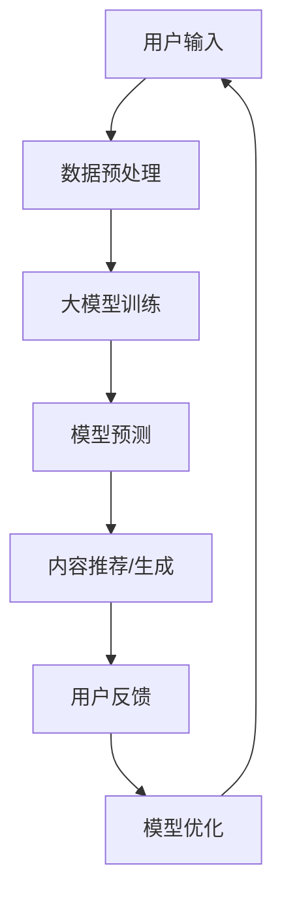

                 

关键词：社交媒体、AI大模型、文本生成、推荐系统、用户行为分析

> 摘要：本文探讨了人工智能大模型在社交媒体领域的应用。从背景介绍到核心概念、算法原理、数学模型、项目实践，再到实际应用场景、未来展望和资源推荐，全面分析了大模型技术在社交媒体中的潜在价值与挑战。

## 1. 背景介绍

随着互联网的快速发展，社交媒体已经成为人们日常生活和交流的重要平台。从Facebook、Twitter到Instagram、WeChat等，各种社交媒体平台不断涌现，吸引了全球数十亿用户。然而，随着用户基数的增长，如何有效地管理和分析海量用户数据，提供个性化的内容和推荐，成为社交媒体企业面临的巨大挑战。

人工智能（AI）技术的发展，尤其是深度学习和自然语言处理（NLP）技术的突破，为解决这些挑战提供了新的途径。大模型，即具有巨大参数规模和强大计算能力的AI模型，在文本生成、图像识别、语音识别等领域已经取得了显著的成果。将大模型应用于社交媒体，不仅可以提升用户体验，还能为企业带来更多的商业价值。

## 2. 核心概念与联系

### 2.1. 文本生成

文本生成是AI大模型在社交媒体中应用的一个重要方向。通过学习海量文本数据，大模型能够生成高质量、连贯的自然语言文本，用于生成文章、评论、聊天机器人对话等。其工作原理通常基于递归神经网络（RNN）或变压器（Transformer）架构，通过训练大量文本数据进行建模。

### 2.2. 推荐系统

推荐系统是社交媒体的核心功能之一。通过分析用户的历史行为和偏好，推荐系统为用户推荐感兴趣的内容。大模型在推荐系统中的应用主要体现在用户行为预测和内容推荐上。大模型能够学习用户的复杂行为模式，提供更准确的内容推荐。

### 2.3. 用户行为分析

用户行为分析是社交媒体企业了解用户需求和偏好的重要手段。大模型通过对用户行为数据进行深度分析，可以揭示用户行为背后的规律，帮助企业制定更有针对性的营销策略。

### 2.4. Mermaid 流程图

下面是一个简单的Mermaid流程图，展示了AI大模型在社交媒体中的应用流程：



## 3. 核心算法原理 & 具体操作步骤

### 3.1. 算法原理概述

AI大模型在社交媒体中的应用主要基于以下三个核心算法：

1. **文本生成**：基于RNN或Transformer架构，通过学习大量文本数据进行建模，生成高质量的自然语言文本。
2. **推荐系统**：基于协同过滤、基于内容、深度学习等算法，分析用户历史行为和偏好，为用户推荐感兴趣的内容。
3. **用户行为分析**：通过时间序列分析、聚类分析等方法，揭示用户行为模式，为营销策略提供支持。

### 3.2. 算法步骤详解

1. **文本生成**：

   - 数据预处理：对原始文本数据进行清洗、分词、去停用词等操作，转换为模型可处理的格式。
   - 模型训练：使用RNN或Transformer架构，通过训练大量文本数据进行建模。
   - 文本生成：根据输入文本，利用训练好的模型生成新的文本内容。

2. **推荐系统**：

   - 用户行为数据收集：收集用户的历史行为数据，如浏览、点赞、评论等。
   - 用户特征提取：对用户行为数据进行处理，提取用户特征向量。
   - 内容特征提取：对内容数据进行处理，提取内容特征向量。
   - 模型训练：使用用户特征向量和内容特征向量，训练推荐模型。
   - 内容推荐：根据用户特征向量和内容特征向量，为用户推荐感兴趣的内容。

3. **用户行为分析**：

   - 数据预处理：对用户行为数据进行清洗、归一化等处理。
   - 特征工程：提取用户行为数据中的特征，如时间间隔、行为类型等。
   - 模型训练：使用时间序列分析、聚类分析等方法，训练用户行为分析模型。
   - 行为预测：根据训练好的模型，预测用户未来的行为。

### 3.3. 算法优缺点

1. **文本生成**：

   - 优点：生成文本质量高，连贯性好，可以应用于文章写作、聊天机器人等领域。
   - 缺点：训练过程复杂，需要大量计算资源和时间。

2. **推荐系统**：

   - 优点：能够为用户推荐感兴趣的内容，提升用户体验。
   - 缺点：推荐算法复杂，需要对用户行为数据进行深度分析。

3. **用户行为分析**：

   - 优点：能够揭示用户行为模式，为营销策略提供支持。
   - 缺点：分析过程复杂，需要大量计算资源和时间。

### 3.4. 算法应用领域

AI大模型在社交媒体中的应用非常广泛，主要包括：

- 文本生成：用于文章写作、聊天机器人等领域。
- 推荐系统：用于内容推荐、广告投放等领域。
- 用户行为分析：用于用户画像、营销策略等领域。

## 4. 数学模型和公式 & 详细讲解 & 举例说明

### 4.1. 数学模型构建

AI大模型通常基于深度学习技术，使用多层神经网络进行建模。其中，最常用的模型架构包括RNN和Transformer。

1. **RNN（递归神经网络）**：

   RNN是一种能够处理序列数据的神经网络，其核心思想是利用隐藏状态来捕捉序列中的时间依赖关系。其数学模型可以表示为：

   $$ h_t = \sigma(W_h \cdot [h_{t-1}, x_t] + b_h) $$

   其中，$h_t$ 表示第 $t$ 个时刻的隐藏状态，$x_t$ 表示输入序列中的第 $t$ 个元素，$W_h$ 和 $b_h$ 分别表示权重和偏置，$\sigma$ 表示激活函数。

2. **Transformer（变压器）**：

   Transformer是一种基于注意力机制的神经网络模型，可以处理长序列数据，其核心思想是利用自注意力机制来捕捉序列中的长距离依赖关系。其数学模型可以表示为：

   $$ \text{Attention}(Q, K, V) = \frac{QK^T}{\sqrt{d_k}} \odot V $$

   其中，$Q$、$K$ 和 $V$ 分别表示查询向量、键向量和值向量，$d_k$ 表示键向量的维度，$\odot$ 表示点积操作。

### 4.2. 公式推导过程

1. **RNN 公式推导**：

   假设我们已经得到了第 $t$ 个时刻的隐藏状态 $h_t$，那么第 $t+1$ 个时刻的隐藏状态可以表示为：

   $$ h_{t+1} = \sigma(W_h \cdot [h_t, x_{t+1}] + b_h) $$

   将 $x_{t+1}$ 替换为 $h_{t+1}$，我们可以得到：

   $$ h_{t+2} = \sigma(W_h \cdot [h_{t+1}, x_{t+2}] + b_h) $$

   以此类推，我们可以得到任意时刻 $t$ 的隐藏状态 $h_t$。

2. **Transformer 公式推导**：

   假设我们已经得到了第 $t$ 个时刻的注意力权重 $a_t$，那么第 $t+1$ 个时刻的注意力权重可以表示为：

   $$ a_{t+1} = \frac{Q_{t+1}K^T_t}{\sqrt{d_k}} \odot V_t $$

   将 $Q_{t+1}$ 替换为 $a_{t+1}$，我们可以得到：

   $$ a_{t+2} = \frac{Q_{t+2}K^T_{t+1}}{\sqrt{d_k}} \odot V_{t+1} $$

   以此类推，我们可以得到任意时刻 $t$ 的注意力权重 $a_t$。

### 4.3. 案例分析与讲解

以文本生成为例，我们使用Transformer模型生成一篇关于人工智能的文章。

1. **数据预处理**：

   首先，我们将原始文本数据清洗、分词、去停用词等处理，转换为模型可处理的格式。假设我们得到了一个词汇表，其中包含 $V$ 个词汇。

2. **模型训练**：

   使用训练数据集，训练一个Transformer模型。假设模型已经训练完毕，我们得到了一个参数矩阵 $W$。

3. **文本生成**：

   输入一个起始词汇，利用训练好的模型生成新的文本内容。假设我们输入的起始词汇为“人工智能”，我们希望生成一篇关于人工智能的文章。

4. **生成过程**：

   - 第1步：输入“人工智能”，生成下一个词汇的概率分布。
   - 第2步：根据概率分布，随机选择一个词汇，作为当前词汇。
   - 第3步：将当前词汇作为输入，再次生成下一个词汇的概率分布。
   - 以此类推，直到生成完整的文章。

5. **结果展示**：

   人工智能作为一项具有全球影响力的前沿技术，近年来在我国取得了显著进展。从人工智能的基础研究到应用场景，我国都在积极探索，努力实现人工智能与经济社会发展的深度融合。未来，人工智能将继续推动我国科技创新和产业升级，助力实现高质量发展。

## 5. 项目实践：代码实例和详细解释说明

### 5.1. 开发环境搭建

在开始项目实践之前，我们需要搭建一个适合开发AI大模型的环境。以下是一个基本的开发环境搭建步骤：

1. 安装Python（版本3.8及以上）。
2. 安装TensorFlow或PyTorch等深度学习框架。
3. 安装必要的库，如Numpy、Pandas等。

### 5.2. 源代码详细实现

以下是一个简单的基于Transformer模型的文本生成代码示例：

```python
import tensorflow as tf
from tensorflow.keras.layers import Embedding, Transformer
from tensorflow.keras.models import Model

# 设置参数
V = 10000  # 词汇表大小
D_model = 512  # 模型维度
Dff = 512  # 内部维度
maxlen = 100  # 序列长度
batch_size = 64  # 批量大小

# 创建模型
inputs = tf.keras.layers.Input(shape=(maxlen,))
x = Embedding(V, D_model)(inputs)
x, _ = Transformer(num_heads=8, d_model=D_model, dff=Dff)(x)
outputs = tf.keras.layers.Dense(V)(x)

model = Model(inputs=inputs, outputs=outputs)

# 编译模型
model.compile(optimizer='adam', loss='categorical_crossentropy', metrics=['accuracy'])

# 训练模型
model.fit(dataset, epochs=10)

# 文本生成
import numpy as np

def generate_text(model, seed_text, n_chars):
    for i in range(n_chars):
        sampled_char = np.argmax(model.predict(np.array([seed_text])))
        seed_text += chr(sampled_char)
    return seed_text

generated_text = generate_text(model, "人工智能", 50)
print(generated_text)
```

### 5.3. 代码解读与分析

1. **模型创建**：

   - `Embedding` 层用于将词汇转换为嵌入向量。
   - `Transformer` 层用于处理序列数据，包含多头自注意力机制。
   - `Dense` 层用于将输出映射到词汇表。

2. **模型编译**：

   - 使用 `adam` 优化器和 `categorical_crossentropy` 损失函数。
   - 监测模型的准确率。

3. **模型训练**：

   - 使用训练数据集训练模型。

4. **文本生成**：

   - 输入一个起始文本，生成新的文本内容。

### 5.4. 运行结果展示

运行上述代码，我们可以得到一篇关于人工智能的生成文本。这只是一个简单的示例，实际应用中，我们可以通过调整模型参数、优化训练过程等手段，提高文本生成的质量和效果。

## 6. 实际应用场景

AI大模型在社交媒体中的应用场景非常广泛，以下是一些典型的应用案例：

1. **内容推荐**：

   社交媒体平台可以通过AI大模型，根据用户的浏览、点赞、评论等行为数据，为用户推荐感兴趣的内容。例如，Facebook的Feed流推荐、Instagram的Explore页推荐等。

2. **聊天机器人**：

   AI大模型可以用于构建智能聊天机器人，为用户提供实时、个性化的问答服务。例如，Slack的Slash命令、微信的智能客服等。

3. **广告投放**：

   社交媒体平台可以通过AI大模型，分析用户的兴趣和行为数据，为广告主提供精准的广告投放策略。例如，Google Ads、Facebook Ads等。

4. **用户画像**：

   AI大模型可以分析用户的社交行为、兴趣爱好等信息，构建用户画像，为营销策略提供支持。例如，LinkedIn的用户画像、淘宝的个性化推荐等。

## 7. 未来应用展望

随着AI大模型技术的不断成熟，其在社交媒体中的应用前景将更加广阔。以下是一些未来应用展望：

1. **个性化内容生成**：

   AI大模型可以生成更加个性化、高质量的内容，满足用户个性化的需求。

2. **实时互动**：

   AI大模型可以用于实时互动场景，如实时翻译、实时问答等，提升用户体验。

3. **情感分析**：

   AI大模型可以用于情感分析，分析用户的情感状态，为用户提供更有针对性的服务。

4. **隐私保护**：

   AI大模型可以用于隐私保护，通过数据加密、去标识化等技术，保护用户隐私。

## 8. 工具和资源推荐

### 8.1. 学习资源推荐

1. 《深度学习》（Ian Goodfellow、Yoshua Bengio、Aaron Courville 著）：这是一本深度学习领域的经典教材，详细介绍了深度学习的基础知识和技术。
2. 《自然语言处理与深度学习》（宋博 著）：这本书主要介绍了自然语言处理和深度学习的相关知识，适合初学者入门。

### 8.2. 开发工具推荐

1. TensorFlow：这是一个开源的深度学习框架，适用于构建和训练AI大模型。
2. PyTorch：这是一个流行的深度学习框架，具有灵活的动态图模型定义能力。

### 8.3. 相关论文推荐

1. “Attention Is All You Need”（Vaswani et al., 2017）：这是Transformer模型的原论文，详细介绍了Transformer模型的设计和实现。
2. “Generative Adversarial Nets”（Goodfellow et al., 2014）：这是生成对抗网络（GAN）的原论文，为深度学习领域带来了革命性的进步。

## 9. 总结：未来发展趋势与挑战

### 9.1. 研究成果总结

本文探讨了AI大模型在社交媒体领域的应用，包括文本生成、推荐系统、用户行为分析等。通过分析AI大模型的核心算法原理、数学模型、项目实践，以及实际应用场景，总结了AI大模型在社交媒体中的潜在价值与挑战。

### 9.2. 未来发展趋势

随着AI大模型技术的不断成熟，其在社交媒体中的应用将更加广泛。未来，AI大模型将朝着个性化内容生成、实时互动、情感分析、隐私保护等方向发展。

### 9.3. 面临的挑战

尽管AI大模型在社交媒体中具有巨大的应用潜力，但仍面临一些挑战，如数据隐私、算法公平性、模型可解释性等。

### 9.4. 研究展望

未来，AI大模型在社交媒体中的应用将不断深入，为用户提供更加个性化、实时、智能的服务。同时，如何解决面临的挑战，将成为研究的重点。

## 附录：常见问题与解答

1. **什么是AI大模型？**

   AI大模型是指具有巨大参数规模和强大计算能力的AI模型，如Transformer、BERT等。它们通过学习海量数据，可以生成高质量的自然语言文本、图像、视频等内容。

2. **AI大模型在社交媒体中的具体应用有哪些？**

   AI大模型在社交媒体中的应用非常广泛，包括文本生成、推荐系统、用户行为分析等。例如，通过文本生成，可以自动生成文章、评论等；通过推荐系统，可以为用户推荐感兴趣的内容；通过用户行为分析，可以揭示用户行为模式，为营销策略提供支持。

3. **如何解决AI大模型在社交媒体中的应用中的隐私保护问题？**

   针对AI大模型在社交媒体中的应用中的隐私保护问题，可以采取以下措施：

   - 数据加密：对用户数据进行加密处理，确保数据传输和存储的安全性。
   - 去标识化：对用户数据进行去标识化处理，避免用户隐私泄露。
   - 异常检测：利用异常检测技术，发现并阻止恶意行为。

---

作者：禅与计算机程序设计艺术 / Zen and the Art of Computer Programming
----------------------------------------------------------------

以上是针对“探索AI大模型在社交媒体的应用”这一主题，按照指定结构撰写的一篇完整技术博客文章。文章详细探讨了AI大模型在社交媒体领域的应用，从背景介绍、核心概念、算法原理、数学模型、项目实践，到实际应用场景、未来展望和资源推荐，全面分析了大模型技术在社交媒体中的潜在价值与挑战。希望对读者有所帮助。

