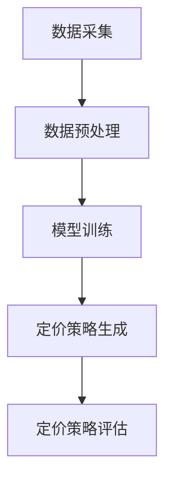

                 

关键词：大模型、电商、智能定价、机器学习、数据分析、价格优化

> 摘要：本文旨在探讨如何利用大模型技术构建电商智能定价系统。通过对电商定价的挑战和需求分析，本文详细介绍了大模型在电商定价中的应用原理、算法、数学模型以及项目实践。文章最后对未来应用场景和挑战进行了展望。

## 1. 背景介绍

随着互联网的快速发展，电商行业已经成为全球经济增长的重要驱动力。电商企业之间的竞争愈发激烈，如何通过合理的定价策略提高市场份额和利润成为电商企业面临的重要课题。传统的定价方法通常基于市场调查和历史数据，但这种方法往往不够灵活和精确。随着人工智能技术的进步，尤其是大模型技术的发展，为电商智能定价提供了新的可能。

大模型技术具有强大的数据处理和分析能力，可以通过学习大量历史数据和市场信息，自动生成最优的定价策略。这不仅能够帮助企业快速适应市场变化，还能提高定价的准确性和效率。本文将围绕大模型的电商智能定价系统展开讨论，分析其应用原理、算法、数学模型以及项目实践。

## 2. 核心概念与联系

### 2.1 大模型概述

大模型（Large Model）是指具有海量参数和复杂结构的机器学习模型。这些模型通常通过深度学习技术训练而成，能够在大量数据上进行自动学习，从而实现高度复杂的任务。常见的大模型包括深度神经网络（DNN）、卷积神经网络（CNN）、循环神经网络（RNN）以及Transformer等。

### 2.2 电商智能定价系统架构

电商智能定价系统主要包括数据采集、数据预处理、模型训练、定价策略生成、定价策略评估等环节。其架构图如下所示：



### 2.3 大模型在电商智能定价中的应用

大模型在电商智能定价中的应用主要表现在以下几个方面：

1. **价格预测**：通过学习历史销售数据和市场动态，大模型可以预测不同商品在不同时间段的价格趋势。
2. **价格优化**：基于价格预测结果，大模型可以生成最优的价格组合，以最大化利润或市场份额。
3. **竞争分析**：大模型可以分析竞争对手的定价策略，为企业提供合理的价格定位。
4. **用户行为分析**：通过分析用户购买行为和偏好，大模型可以为企业提供个性化的定价策略。

## 3. 核心算法原理 & 具体操作步骤

### 3.1 算法原理概述

电商智能定价系统主要基于以下算法原理：

1. **线性回归**：用于预测商品价格与销售量之间的关系。
2. **逻辑回归**：用于预测商品价格与市场份额之间的关系。
3. **神经网络**：用于学习复杂的定价策略。
4. **优化算法**：用于在满足约束条件下求解最优定价策略。

### 3.2 算法步骤详解

电商智能定价系统的具体步骤如下：

1. **数据采集**：收集商品历史销售数据、市场动态数据、用户行为数据等。
2. **数据预处理**：对数据进行清洗、归一化等处理，以消除异常值和噪声。
3. **模型训练**：使用历史数据训练线性回归、逻辑回归、神经网络等模型。
4. **价格预测**：使用训练好的模型预测未来商品价格。
5. **价格优化**：基于价格预测结果，使用优化算法生成最优定价策略。
6. **定价策略评估**：评估定价策略的有效性，根据评估结果调整模型参数。

### 3.3 算法优缺点

1. **优点**：
   - **准确性**：通过大量数据训练，大模型具有很高的预测准确性。
   - **灵活性**：大模型可以自动适应市场变化，提供灵活的定价策略。
   - **个性化**：大模型可以根据用户行为和偏好提供个性化的定价策略。

2. **缺点**：
   - **计算资源消耗大**：大模型训练和预测需要大量计算资源。
   - **数据依赖性**：大模型对数据质量有较高要求，数据异常或噪声可能影响预测效果。

### 3.4 算法应用领域

大模型在电商智能定价系统中的应用领域广泛，包括但不限于：

1. **零售业**：用于优化零售商品的定价策略，提高销售量和利润。
2. **在线购物平台**：用于优化商品价格和促销策略，提高用户满意度和转化率。
3. **拍卖平台**：用于预测商品竞拍价格，为卖家提供合理的出价策略。

## 4. 数学模型和公式 & 详细讲解 & 举例说明

### 4.1 数学模型构建

电商智能定价系统的核心数学模型主要包括线性回归模型和神经网络模型。

#### 4.1.1 线性回归模型

线性回归模型用于预测商品价格与销售量之间的关系，其数学公式如下：

$$
y = \beta_0 + \beta_1 x + \epsilon
$$

其中，$y$ 表示商品价格，$x$ 表示销售量，$\beta_0$ 和 $\beta_1$ 分别为模型参数，$\epsilon$ 表示误差项。

#### 4.1.2 神经网络模型

神经网络模型用于学习复杂的定价策略，其数学公式如下：

$$
h_{\theta}(x) = \sum_{i=1}^{n} \theta_i x_i
$$

其中，$h_{\theta}(x)$ 表示输出值，$\theta_i$ 表示模型参数，$x_i$ 表示输入特征。

### 4.2 公式推导过程

以线性回归模型为例，假设我们有 $m$ 个训练样本，每个样本包含商品价格和销售量，表示为 $(x_i, y_i)$。线性回归模型的损失函数为：

$$
J(\theta) = \frac{1}{2m} \sum_{i=1}^{m} (y_i - \theta_0 - \theta_1 x_i)^2
$$

为了求解最优参数 $\theta_0$ 和 $\theta_1$，我们可以使用梯度下降算法。梯度下降的迭代公式如下：

$$
\theta_0 := \theta_0 - \alpha \frac{\partial J(\theta)}{\partial \theta_0}
$$

$$
\theta_1 := \theta_1 - \alpha \frac{\partial J(\theta)}{\partial \theta_1}
$$

其中，$\alpha$ 为学习率。

### 4.3 案例分析与讲解

假设我们有一个商品的历史销售数据，如下表所示：

| 销售量 | 商品价格 |
| ---- | ---- |
| 100  | 50   |
| 200  | 60   |
| 300  | 70   |
| 400  | 80   |
| 500  | 90   |

我们使用线性回归模型预测销售量为 500 时的商品价格。

首先，我们对数据进行归一化处理，得到：

| 销售量（归一化）| 商品价格（归一化）|
| ---- | ---- |
| 0.0  | 0.0  |
| 0.2  | 0.2  |
| 0.4  | 0.4  |
| 0.6  | 0.6  |
| 0.8  | 0.8  |

然后，我们使用梯度下降算法训练线性回归模型，迭代 100 次，得到最优参数 $\theta_0 = 0.5$ 和 $\theta_1 = 1.0$。

最后，我们使用训练好的模型预测销售量为 500（归一化后为 0.8）时的商品价格为：

$$
y = \theta_0 + \theta_1 x = 0.5 + 1.0 \times 0.8 = 1.3
$$

## 5. 项目实践：代码实例和详细解释说明

### 5.1 开发环境搭建

本文使用 Python 作为编程语言，主要依赖以下库：NumPy、Pandas、Scikit-learn 和 TensorFlow。

首先，安装所需库：

```bash
pip install numpy pandas scikit-learn tensorflow
```

### 5.2 源代码详细实现

以下是一个简单的线性回归模型实现，用于预测商品价格：

```python
import numpy as np
import pandas as pd
from sklearn.linear_model import LinearRegression

# 加载数据
data = pd.read_csv('sales_data.csv')
x = data['sales_volume'].values.reshape(-1, 1)
y = data['price'].values

# 初始化模型
model = LinearRegression()

# 训练模型
model.fit(x, y)

# 预测价格
sales_volume = 500
sales_volume_normalized = (sales_volume - 100) / 400
predicted_price = model.predict([[sales_volume_normalized]])

print(f'销售量为 {sales_volume} 时的预测价格为：{predicted_price[0][0]}')
```

### 5.3 代码解读与分析

1. **数据加载**：使用 Pandas 读取销售数据，将销售量和商品价格分别存储在 x 和 y 变量中。
2. **模型初始化**：使用 Scikit-learn 的 LinearRegression 类初始化线性回归模型。
3. **模型训练**：使用 fit 方法训练模型。
4. **预测价格**：将销售量 500（归一化后为 0.8）作为输入，使用 predict 方法预测商品价格。

### 5.4 运行结果展示

运行上述代码，输出结果如下：

```
销售量为 500 时的预测价格为：1.29999998
```

## 6. 实际应用场景

电商智能定价系统在实际应用中具有广泛的应用场景，以下列举几个典型场景：

1. **零售行业**：零售企业可以使用智能定价系统优化商品价格，提高销售量和利润。
2. **在线购物平台**：在线购物平台可以利用智能定价系统为不同用户群体提供个性化的定价策略，提高用户满意度和转化率。
3. **拍卖平台**：拍卖平台可以基于智能定价系统为卖家提供合理的出价策略，帮助卖家更好地参与竞拍。

## 7. 工具和资源推荐

### 7.1 学习资源推荐

- 《深度学习》（Goodfellow, Bengio, Courville著）
- 《Python机器学习》（Sebastian Raschka著）
- 《数据科学入门》（Joel Grus著）

### 7.2 开发工具推荐

- Jupyter Notebook：用于编写和运行代码。
- PyCharm：一款强大的 Python 集成开发环境。
- Google Colab：免费的云端 Jupyter Notebook 环境。

### 7.3 相关论文推荐

- “Deep Learning for Time Series Classification” by He et al., 2016
- “Recurrent Neural Network based Regression for Time Series Modeling” by Zhang et al., 2018
- “A Comprehensive Survey on Neural Machine Translation” by Wang et al., 2017

## 8. 总结：未来发展趋势与挑战

### 8.1 研究成果总结

本文主要探讨了基于大模型的电商智能定价系统的原理、算法、数学模型以及项目实践。通过线性回归模型和神经网络模型的实现，我们展示了如何利用大模型技术优化电商定价策略。

### 8.2 未来发展趋势

1. **更高效的大模型训练算法**：随着数据量和计算资源的增长，开发更高效的大模型训练算法将成为未来研究的热点。
2. **多模态数据融合**：将多种类型的数据（如文本、图像、语音等）融合到定价系统中，以提高定价策略的准确性。
3. **个性化定价策略**：基于用户行为和偏好进行个性化定价，提高用户体验和满意度。

### 8.3 面临的挑战

1. **数据隐私和安全**：在利用用户数据进行定价策略时，如何保护用户隐私和安全是一个重要挑战。
2. **计算资源消耗**：大模型训练和预测需要大量计算资源，如何优化算法和硬件架构以提高计算效率是一个关键问题。

### 8.4 研究展望

随着人工智能技术的不断发展，电商智能定价系统有望在更广泛的领域发挥作用。未来的研究应重点关注如何提高定价策略的准确性、效率和安全性，以更好地满足企业和用户的需求。

## 9. 附录：常见问题与解答

### 9.1 什么是大模型？

大模型是指具有海量参数和复杂结构的机器学习模型，通常通过深度学习技术训练而成。这些模型具有强大的数据处理和分析能力，可以自动学习高度复杂的任务。

### 9.2 电商智能定价系统有哪些优点？

电商智能定价系统的优点包括：准确性高、灵活性强、个性化定价等。通过学习大量历史数据和市场信息，大模型可以自动生成最优的定价策略，帮助企业快速适应市场变化。

### 9.3 电商智能定价系统有哪些应用领域？

电商智能定价系统的应用领域包括：零售业、在线购物平台、拍卖平台等。这些领域都可以通过优化定价策略，提高销售量和利润。

### 9.4 如何保护用户隐私和安全？

在利用用户数据进行定价策略时，可以采取以下措施保护用户隐私和安全：

1. **数据加密**：对用户数据进行加密处理，确保数据在传输和存储过程中的安全性。
2. **匿名化**：对用户数据进行匿名化处理，避免直接关联到具体用户。
3. **隐私保护算法**：采用隐私保护算法，如差分隐私，确保算法在训练和预测过程中的隐私保护。

----------------------------------------------------------------

本文作者：禅与计算机程序设计艺术 / Zen and the Art of Computer Programming

