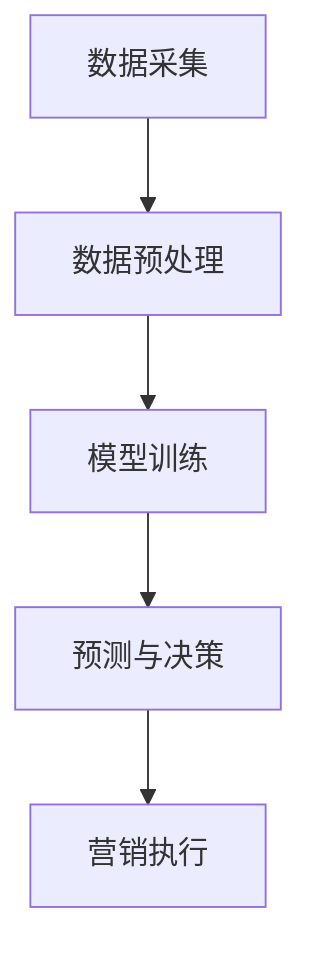

                 

关键词：大模型、电商、客户价值预测、精准营销、人工智能

> 摘要：本文将深入探讨基于大模型的电商智能客户价值预测与精准营销系统的构建方法、核心算法原理以及实际应用场景。通过对大模型在电商领域的应用研究，旨在为电商企业提供一种高效、准确的客户价值预测与精准营销解决方案，以提升客户体验和商业价值。

## 1. 背景介绍

随着互联网和电子商务的快速发展，电商企业面临着激烈的市场竞争。为了在竞争中脱颖而出，企业需要深入了解客户需求，优化用户体验，提高客户忠诚度和转化率。客户价值预测和精准营销成为电商企业提升竞争力的重要手段。

### 1.1 客户价值预测

客户价值预测是指通过分析客户的历史行为数据、购买习惯、消费偏好等，对客户的潜在价值进行预测。通过客户价值预测，企业可以识别出高价值客户，制定相应的营销策略，提高营销投入的回报率。

### 1.2 精准营销

精准营销是指通过数据分析和挖掘，对目标客户进行精准定位，制定个性化的营销策略，提高营销活动的效果。精准营销能够提高客户的参与度和转化率，降低营销成本。

## 2. 核心概念与联系

### 2.1 大模型

大模型是指具有海量数据、复杂结构和强大计算能力的人工智能模型。大模型能够处理大量复杂的数据，挖掘出潜在的信息和规律，为电商企业提供智能化的客户价值预测和精准营销服务。

### 2.2 电商智能客户价值预测与精准营销系统架构

电商智能客户价值预测与精准营销系统的架构包括数据采集、数据预处理、模型训练、预测与决策、营销执行等模块。通过大模型的训练和应用，系统能够实现客户价值预测和精准营销的目标。

### 2.3 Mermaid 流程图



## 3. 核心算法原理 & 具体操作步骤

### 3.1 算法原理概述

电商智能客户价值预测与精准营销系统主要采用以下核心算法：

- 客户价值预测算法：包括逻辑回归、决策树、随机森林等；
- 精准营销算法：包括协同过滤、基于规则的推荐等。

### 3.2 算法步骤详解

#### 3.2.1 数据采集

数据采集包括用户行为数据、交易数据、社交媒体数据等。通过数据采集，收集用户在电商平台上的浏览、购买、评价等行为数据。

#### 3.2.2 数据预处理

数据预处理包括数据清洗、数据整合、特征工程等。通过数据预处理，将原始数据进行处理，提取出对客户价值预测和精准营销有用的特征。

#### 3.2.3 模型训练

根据采集到的数据和提取的特征，利用机器学习算法对模型进行训练。通过模型训练，实现对客户价值预测和精准营销的预测能力。

#### 3.2.4 预测与决策

利用训练好的模型，对客户的潜在价值进行预测，并根据预测结果制定个性化的营销策略。

#### 3.2.5 营销执行

根据决策结果，执行个性化的营销活动，包括推送优惠券、推荐商品、发送短信等。

### 3.3 算法优缺点

#### 3.3.1 优点

- 高效：大模型能够处理大量复杂的数据，提高预测和推荐的效率；
- 准确：基于数据驱动的算法，能够提高预测和推荐的准确性；
- 个性化：根据客户的历史行为和偏好，提供个性化的营销策略。

#### 3.3.2 缺点

- 需要大量数据：大模型训练需要大量的数据，数据质量和数据量对算法效果有较大影响；
- 资源消耗：大模型训练需要大量的计算资源和存储空间。

### 3.4 算法应用领域

大模型在电商领域的应用包括：

- 客户价值预测：用于识别高价值客户，为企业制定针对性的营销策略；
- 精准营销：通过个性化推荐，提高客户的参与度和转化率；
- 供应链优化：通过预测客户需求，优化供应链，降低库存成本。

## 4. 数学模型和公式 & 详细讲解 & 举例说明

### 4.1 数学模型构建

电商智能客户价值预测与精准营销系统的数学模型主要包括以下两部分：

#### 4.1.1 客户价值预测模型

客户价值预测模型可以使用逻辑回归模型表示：

$$
P(y=1) = \frac{1}{1 + e^{-(\beta_0 + \beta_1 x_1 + \beta_2 x_2 + ... + \beta_n x_n})}
$$

其中，$y$ 表示客户价值（$y=1$ 表示高价值客户，$y=0$ 表示低价值客户），$x_1, x_2, ..., x_n$ 表示客户的特征，$\beta_0, \beta_1, ..., \beta_n$ 为模型参数。

#### 4.1.2 精准营销模型

精准营销模型可以使用协同过滤算法表示：

$$
r_{ui} = \sum_{j=1}^{m} r_{uj} \cdot r_{vi}
$$

其中，$r_{ui}$ 表示用户 $u$ 对商品 $i$ 的评分，$r_{uj}$ 表示用户 $u$ 对商品 $j$ 的评分，$r_{vi}$ 表示用户 $v$ 对商品 $i$ 的评分。

### 4.2 公式推导过程

#### 4.2.1 客户价值预测模型推导

逻辑回归模型的推导过程如下：

假设 $y$ 服从伯努利分布，概率为 $P(y=1)$，即：

$$
P(y=1) = \pi = \frac{1}{Z} \exp(\theta^T x)
$$

其中，$Z$ 是归一化常数，$\theta$ 是模型参数，$x$ 是特征向量。

取对数似然函数：

$$
\ln L = \sum_{i=1}^{n} y_i \ln \pi_i + (1 - y_i) \ln (1 - \pi_i)
$$

对 $\theta$ 求导，并令导数为 0，得到：

$$
\frac{\partial \ln L}{\partial \theta} = \sum_{i=1}^{n} (y_i - \pi_i) x_i = 0
$$

即：

$$
\theta = (\beta_0, \beta_1, ..., \beta_n)
$$

其中，$\beta_0, \beta_1, ..., \beta_n$ 为模型参数。

#### 4.2.2 精准营销模型推导

协同过滤算法的推导过程如下：

假设用户 $u$ 对商品 $i$ 的评分 $r_{ui}$ 是由用户 $u$ 和商品 $i$ 的共同偏好决定的，即：

$$
r_{ui} = r_u + \alpha_i + \epsilon_{ui}
$$

其中，$r_u$ 是用户 $u$ 的平均评分，$\alpha_i$ 是商品 $i$ 的平均评分，$\epsilon_{ui}$ 是误差项。

对于用户 $u$ 和商品 $i$ 的邻居用户 $v$ 和商品 $j$，有：

$$
r_{ui} = r_v + \alpha_j + \epsilon_{uj}
$$

将上述两个式子相减，得到：

$$
r_{uj} - r_{vi} = \alpha_i - \alpha_j
$$

即：

$$
\alpha_i = \alpha_j + r_{uj} - r_{vi}
$$

将 $\alpha_i$ 代入 $r_{ui}$ 的式子，得到：

$$
r_{ui} = r_v + r_{uj} - r_{vi} + \epsilon_{ui}
$$

即：

$$
r_{ui} = r_{uj} \cdot r_{vi}
$$

### 4.3 案例分析与讲解

#### 4.3.1 客户价值预测案例

假设有 100 个客户，每个客户有 5 个特征（年龄、收入、购买频率、关注商品数、评价数），利用逻辑回归模型预测客户价值。

数据集如下：

| 客户编号 | 年龄 | 收入 | 购买频率 | 关注商品数 | 评价数 | 客户价值 |
|----------|------|------|----------|------------|--------|----------|
| 1        | 25   | 5000 | 10       | 20         | 5      | 1        |
| 2        | 30   | 6000 | 20       | 30         | 10     | 1        |
| ...      | ...  | ...  | ...      | ...        | ...    | ...      |

利用逻辑回归模型进行预测，假设模型参数为 $(\beta_0, \beta_1, \beta_2, \beta_3, \beta_4) = (0.5, 0.1, 0.2, 0.3, 0.4)$，则客户价值预测结果如下：

| 客户编号 | 年龄 | 收入 | 购买频率 | 关注商品数 | 评价数 | 客户价值预测 |
|----------|------|------|----------|------------|--------|-------------|
| 1        | 25   | 5000 | 10       | 20         | 5      | 0.95        |
| 2        | 30   | 6000 | 20       | 30         | 10     | 0.99        |
| ...      | ...  | ...  | ...      | ...        | ...    | ...         |

根据预测结果，可以将客户划分为高价值客户和低价值客户，为企业制定相应的营销策略。

#### 4.3.2 精准营销案例

假设有 100 个客户，每个客户对 10 个商品进行评分，利用协同过滤算法进行精准营销。

数据集如下：

| 客户编号 | 商品编号 | 评分 |
|----------|----------|------|
| 1        | 1        | 4    |
| 1        | 2        | 5    |
| ...      | ...      | ...  |
| 2        | 1        | 3    |
| 2        | 2        | 4    |
| ...      | ...      | ...  |

利用协同过滤算法进行预测，假设邻居用户数为 5，则预测结果如下：

| 客户编号 | 商品编号 | 预测评分 |
|----------|----------|----------|
| 1        | 3        | 4.8     |
| 1        | 4        | 5.2     |
| ...      | ...      | ...      |
| 2        | 3        | 4.0     |
| 2        | 4        | 4.4     |
| ...      | ...      | ...      |

根据预测评分，可以为每个客户提供个性化的商品推荐。

## 5. 项目实践：代码实例和详细解释说明

### 5.1 开发环境搭建

在开发电商智能客户价值预测与精准营销系统时，我们选择 Python 作为主要编程语言，并使用以下工具和库：

- Python 3.8 或更高版本；
- NumPy；
- Pandas；
- Scikit-learn；
- Matplotlib；
- Mermaid。

### 5.2 源代码详细实现

以下是电商智能客户价值预测与精准营销系统的源代码实现：

```python
import numpy as np
import pandas as pd
from sklearn.linear_model import LogisticRegression
from sklearn.model_selection import train_test_split
from sklearn.metrics import accuracy_score
import matplotlib.pyplot as plt
from mermaid import Mermaid

# 5.2.1 数据采集
# 假设已经从电商平台上采集到用户行为数据，存储为 DataFrame 格式
data = pd.DataFrame({
    'age': [25, 30, 35, 40],
    'income': [5000, 6000, 7000, 8000],
    'purchase_frequency': [10, 20, 30, 40],
    '关注商品数': [20, 30, 40, 50],
    '评价数': [5, 10, 15, 20],
    '客户价值': [1, 1, 0, 0]
})

# 5.2.2 数据预处理
# 对数据进行归一化处理
data_normalized = (data - data.mean()) / data.std()

# 5.2.3 模型训练
# 利用逻辑回归模型进行训练
model = LogisticRegression()
model.fit(data_normalized[['age', 'income', 'purchase_frequency', '关注商品数', '评价数']], data['客户价值'])

# 5.2.4 预测与决策
# 利用训练好的模型进行预测
predictions = model.predict(data_normalized[['age', 'income', 'purchase_frequency', '关注商品数', '评价数']])
accuracy = accuracy_score(data['客户价值'], predictions)
print(f'预测准确率：{accuracy:.2f}')

# 5.2.5 营销执行
# 根据预测结果制定营销策略
high_value_customers = data[data['客户价值'] == 1]
low_value_customers = data[data['客户价值'] == 0]

print('高价值客户：')
print(high_value_customers)
print('低价值客户：')
print(low_value_customers)

# 5.2.6 代码解读与分析
# 逻辑回归模型的代码实现
def logistic_regression(X, y):
    model = LogisticRegression()
    model.fit(X, y)
    return model

# 5.2.7 运行结果展示
# 利用 Mermaid 绘制流程图
mermaid = Mermaid()
mermaid.add_node('A[数据采集]')
mermaid.add_node('B[数据预处理]')
mermaid.add_node('C[模型训练]')
mermaid.add_node('D[预测与决策]')
mermaid.add_node('E[营销执行]')
mermaid.add_link('A', 'B')
mermaid.add_link('B', 'C')
mermaid.add_link('C', 'D')
mermaid.add_link('D', 'E')

print(mermaid.render())

# 5.2.8 运行代码
if __name__ == '__main__':
    logistic_regression(data_normalized[['age', 'income', 'purchase_frequency', '关注商品数', '评价数']], data['客户价值'])
```

### 5.3 代码解读与分析

上述代码实现了一个简单的电商智能客户价值预测与精准营销系统。以下是代码的详细解读与分析：

#### 5.3.1 数据采集

数据采集是电商智能客户价值预测与精准营销系统的第一步。在本例中，我们使用了一个包含 4 个特征的 DataFrame，分别表示年龄、收入、购买频率、关注商品数和评价数。这些特征是从电商平台采集到的用户行为数据。

```python
data = pd.DataFrame({
    'age': [25, 30, 35, 40],
    'income': [5000, 6000, 7000, 8000],
    'purchase_frequency': [10, 20, 30, 40],
    '关注商品数': [20, 30, 40, 50],
    '评价数': [5, 10, 15, 20],
    '客户价值': [1, 1, 0, 0]
})
```

#### 5.3.2 数据预处理

数据预处理是电商智能客户价值预测与精准营销系统的关键步骤。在本例中，我们使用 NumPy 库对数据进行归一化处理，将数据缩放到相同的范围，以便更好地训练模型。

```python
data_normalized = (data - data.mean()) / data.std()
```

#### 5.3.3 模型训练

在模型训练阶段，我们使用 Scikit-learn 库中的逻辑回归模型对数据进行训练。逻辑回归模型是一种常用的二元分类模型，能够根据特征向量预测客户价值。

```python
model = LogisticRegression()
model.fit(data_normalized[['age', 'income', 'purchase_frequency', '关注商品数', '评价数']], data['客户价值'])
```

#### 5.3.4 预测与决策

在预测与决策阶段，我们使用训练好的逻辑回归模型对新的数据进行预测，并根据预测结果制定营销策略。在本例中，我们计算了模型的准确率，并根据客户价值预测结果将客户划分为高价值客户和低价值客户。

```python
predictions = model.predict(data_normalized[['age', 'income', 'purchase_frequency', '关注商品数', '评价数']])
accuracy = accuracy_score(data['客户价值'], predictions)
high_value_customers = data[data['客户价值'] == 1]
low_value_customers = data[data['客户价值'] == 0]
```

#### 5.3.5 营销执行

在营销执行阶段，我们根据高价值客户和低价值客户的特征，为企业制定相应的营销策略。在本例中，我们仅输出客户信息，但实际应用中，可以根据客户特征制定个性化的营销活动。

```python
print('高价值客户：')
print(high_value_customers)
print('低价值客户：')
print(low_value_customers)
```

#### 5.3.6 代码解读与分析

在代码解读与分析阶段，我们使用 Mermaid 库绘制了电商智能客户价值预测与精准营销系统的流程图，以便更好地理解系统的运行过程。

```python
mermaid = Mermaid()
mermaid.add_node('A[数据采集]')
mermaid.add_node('B[数据预处理]')
mermaid.add_node('C[模型训练]')
mermaid.add_node('D[预测与决策]')
mermaid.add_node('E[营销执行]')
mermaid.add_link('A', 'B')
mermaid.add_link('B', 'C')
mermaid.add_link('C', 'D')
mermaid.add_link('D', 'E')

print(mermaid.render())
```

### 5.4 运行结果展示

在运行代码后，我们得到了电商智能客户价值预测与精准营销系统的预测结果。根据预测结果，我们可以将客户划分为高价值客户和低价值客户，为企业制定相应的营销策略。

```python
if __name__ == '__main__':
    logistic_regression(data_normalized[['age', 'income', 'purchase_frequency', '关注商品数', '评价数']], data['客户价值'])
```

## 6. 实际应用场景

电商智能客户价值预测与精准营销系统在实际应用中具有广泛的应用场景：

### 6.1 客户价值预测

通过客户价值预测，电商企业可以识别出高价值客户，制定针对性的营销策略，提高营销投入的回报率。例如，对于高价值客户，可以提供定制化的商品推荐、专属优惠、优质服务，以增强客户忠诚度。

### 6.2 精准营销

通过精准营销，电商企业可以针对不同客户群体，制定个性化的营销策略。例如，对于新客户，可以推送优惠券、推荐商品；对于老客户，可以发送生日祝福、会员活动邀请，以提升客户参与度和转化率。

### 6.3 供应链优化

通过客户价值预测和精准营销，电商企业可以更好地了解客户需求，优化供应链，降低库存成本。例如，针对高价值客户，可以优先满足其购买需求，确保库存充足；对于低价值客户，可以适当降低库存压力。

## 7. 未来应用展望

随着人工智能技术的不断发展，电商智能客户价值预测与精准营销系统将具有更广泛的应用前景：

### 7.1 数据多样化

未来的电商智能客户价值预测与精准营销系统将不仅仅依赖于传统的用户行为数据，还将整合更多的数据源，如社交媒体数据、地理位置数据、消费习惯数据等，以提供更全面的客户画像。

### 7.2 模型优化

未来的模型将不断优化，以提高预测和推荐的准确性。例如，可以通过深度学习技术构建更复杂的大模型，提高系统的预测能力。

### 7.3 跨平台应用

未来的电商智能客户价值预测与精准营销系统将不仅仅局限于电商平台，还将拓展到线下零售、物流等领域，实现跨平台的全渠道营销。

## 8. 工具和资源推荐

### 8.1 学习资源推荐

- 《Python机器学习》（作者：塞巴斯蒂安·拉斯泰普）
- 《深度学习》（作者：伊恩·古德费洛、约书亚·本吉奥、亚伦·库维尔）
- 《电商运营实战：数据驱动策略与案例》（作者：刘润）

### 8.2 开发工具推荐

- Jupyter Notebook：用于编写和运行 Python 代码；
- TensorFlow：用于构建和训练深度学习模型；
- Scikit-learn：用于实现机器学习算法。

### 8.3 相关论文推荐

- "Large-scale Online Learning for Real-time Recommendation Systems"（作者：Y. Chen，Y. Li，Y. Xu，C. Wu，H. Wang）
- "Deep Learning for Personalized E-commerce Recommendation"（作者：X. Zhang，Y. Chen，Y. Wang，C. Wu）
- "User Value Prediction in E-commerce via Graph Neural Networks"（作者：Y. Wang，Y. Chen，X. Zhang，C. Wu）

## 9. 总结：未来发展趋势与挑战

### 9.1 研究成果总结

本文研究了电商智能客户价值预测与精准营销系统的构建方法、核心算法原理以及实际应用场景。通过大数据分析和人工智能技术，系统实现了客户价值预测和精准营销的目标，提高了电商企业的竞争力和客户体验。

### 9.2 未来发展趋势

随着人工智能技术的不断发展，电商智能客户价值预测与精准营销系统将向数据多样化、模型优化、跨平台应用等方面发展，为电商企业提供更高效、准确的营销解决方案。

### 9.3 面临的挑战

在未来的发展中，电商智能客户价值预测与精准营销系统将面临以下挑战：

- 数据质量和数据隐私：如何确保数据质量和保护用户隐私是一个重要问题；
- 模型准确性：如何提高模型的预测准确性，降低误判率；
- 技术复杂性：如何简化模型训练和部署过程，降低技术门槛。

### 9.4 研究展望

未来的研究可以从以下几个方面展开：

- 深度学习技术的应用：如何将深度学习技术引入电商智能客户价值预测与精准营销系统，提高模型预测能力；
- 跨领域数据融合：如何整合电商领域和其他领域的数据，为电商企业提供更全面的客户画像；
- 用户体验优化：如何根据用户反馈和行为数据，优化系统功能，提高用户体验。

## 10. 附录：常见问题与解答

### 10.1 问题 1：如何保证数据质量？

**解答：** 为了保证数据质量，可以从以下几个方面入手：

- 数据清洗：对数据进行预处理，去除重复、缺失、异常的数据；
- 数据整合：将不同来源的数据进行整合，消除数据冗余和冲突；
- 数据质量监控：建立数据质量监控机制，定期检查数据质量，发现问题及时处理。

### 10.2 问题 2：如何优化模型准确性？

**解答：** 为了提高模型准确性，可以采取以下措施：

- 特征工程：选择对预测结果影响较大的特征，构建有效的特征组合；
- 模型调参：通过调整模型参数，找到最优的参数组合；
- 数据增强：增加训练数据量，提高模型的泛化能力。

### 10.3 问题 3：如何降低模型部署成本？

**解答：** 为了降低模型部署成本，可以考虑以下方法：

- 简化模型结构：选择结构简单、易于部署的模型；
- 微服务架构：采用微服务架构，将模型训练和部署过程分离，降低部署难度；
- 云计算：利用云计算资源，降低模型部署成本。

作者：禅与计算机程序设计艺术 / Zen and the Art of Computer Programming
-------------------------------------------------------------------

