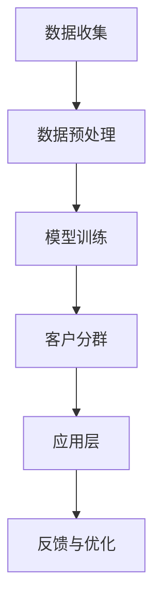

                 

关键词：大模型、电商、智能分群、动态调整、客户分群算法、大数据分析、机器学习

## 摘要

随着电子商务的迅猛发展，客户分群作为精准营销的重要手段，正日益受到企业的高度关注。本文探讨了基于大模型的电商智能客户分群动态调整系统。系统利用机器学习算法，对客户行为数据进行分析，实现动态调整客户分群，以提高营销效果和客户满意度。本文将详细阐述该系统的核心概念、算法原理、数学模型、实践案例，并分析其在电商领域的应用前景。

## 1. 背景介绍

### 电子商务的发展

电子商务的快速发展改变了传统商业模式，使消费者购物更加便捷。随着网络技术的进步和数据采集能力的增强，电商企业积累了大量关于用户行为、购买偏好和交易数据。这些数据为个性化推荐和精准营销提供了丰富的素材。

### 客户分群的重要性

客户分群是电商企业实现精准营销的关键步骤。通过将客户划分为不同群体，企业可以针对不同群体设计个性化的营销策略，从而提高营销效果和客户满意度。传统的客户分群方法主要基于静态数据，如人口统计信息、历史购买记录等，这些方法难以应对客户行为和需求的动态变化。

### 大模型与机器学习

随着深度学习和大数据技术的发展，大模型（如深度神经网络）在处理复杂数据和模式识别方面显示出强大的能力。机器学习算法可以自动从海量数据中学习规律，实现自动化分群和动态调整。这为电商智能客户分群提供了新的技术路径。

## 2. 核心概念与联系


### 大模型客户分群架构

- **数据层**：收集电商平台的用户行为数据、购买历史、浏览记录等。
- **数据处理层**：利用数据预处理技术，如数据清洗、特征提取等，为后续分析提供高质量的数据。
- **模型层**：构建大模型，如深度神经网络，通过训练学习用户行为数据中的潜在特征和模式。
- **分群层**：根据模型输出的特征和模式，动态调整客户分群，实现个性化推荐和精准营销。
- **应用层**：将分群结果应用于电商营销活动，如定向广告、促销活动、个性化推荐等。

### Mermaid 流程图



## 3. 核心算法原理 & 具体操作步骤

### 3.1 算法原理概述

本系统采用基于深度神经网络的机器学习算法，对用户行为数据进行建模和分析。深度神经网络通过多层非线性变换，可以自动提取用户行为数据中的潜在特征，从而实现动态客户分群。

### 3.2 算法步骤详解

1. **数据收集**：收集电商平台的用户行为数据，包括购买记录、浏览历史、搜索关键词等。
2. **数据预处理**：对收集到的数据进行清洗和特征提取，将原始数据转换为可用于训练的输入特征向量。
3. **模型训练**：构建深度神经网络模型，通过大量用户行为数据训练模型，使其能够自动识别用户行为模式。
4. **客户分群**：利用训练好的模型，对用户行为数据进行预测，根据预测结果动态调整客户分群。
5. **应用层**：将分群结果应用于电商营销活动，如个性化推荐、定向广告等。
6. **反馈与优化**：收集营销活动的反馈数据，优化模型参数，提高分群准确性和营销效果。

### 3.3 算法优缺点

#### 优点

- **自动化**：基于深度神经网络的机器学习算法能够自动从海量数据中提取潜在特征，降低人工干预。
- **动态调整**：系统能够根据实时用户行为数据动态调整客户分群，适应市场变化。
- **高效**：深度神经网络具有强大的计算能力，能够快速处理大量数据。

#### 缺点

- **数据依赖**：算法的性能高度依赖于数据质量和数量，缺乏足够的数据将影响分群的准确性。
- **复杂度高**：深度神经网络模型较为复杂，需要较高的计算资源和时间进行训练。

### 3.4 算法应用领域

- **电商**：用于客户分群，实现个性化推荐和精准营销。
- **金融**：用于风险控制和客户分类。
- **医疗**：用于疾病预测和患者分群。

## 4. 数学模型和公式 & 详细讲解 & 举例说明

### 4.1 数学模型构建

我们采用多层感知机（MLP）作为深度神经网络模型，其基本结构如下：

$$
y_{\hat{}}=f(z) = \sigma(\sum_{i=1}^{n} w_{i}x_{i} + b)
$$

其中，$x_{i}$为输入特征，$w_{i}$为权重，$b$为偏置，$\sigma$为激活函数。

### 4.2 公式推导过程

多层感知机的推导过程如下：

1. **输入层**：输入特征$x_{i}$通过权重$w_{i}$传递到下一层。
2. **隐藏层**：每个隐藏层的节点都通过权重$w_{i}$和偏置$b$连接到上一层的节点，并经过激活函数$\sigma$处理。
3. **输出层**：输出层节点的输出即为预测结果$y_{\hat{}}$。

### 4.3 案例分析与讲解

假设我们有一个包含两个特征（$x_{1}$和$x_{2}$）的数据集，其中$x_{1}$表示用户的购买金额，$x_{2}$表示用户的浏览时长。我们希望根据这些特征将用户分为高价值用户和一般用户。

1. **数据预处理**：对数据进行归一化处理，将特征值缩放到0-1范围内。
2. **模型训练**：构建一个包含一个隐藏层的MLP模型，输入层有两个节点，隐藏层有四个节点，输出层有两个节点。
3. **预测与分群**：利用训练好的模型对新的用户数据进行预测，根据预测结果将用户分为高价值用户和一般用户。

## 5. 项目实践：代码实例和详细解释说明

### 5.1 开发环境搭建

我们使用Python作为主要编程语言，并依赖以下库：

- TensorFlow：用于构建和训练深度神经网络模型。
- NumPy：用于数据处理和数学运算。
- Pandas：用于数据预处理和分析。

### 5.2 源代码详细实现

```python
import tensorflow as tf
import numpy as np
import pandas as pd

# 数据预处理
def preprocess_data(data):
    # 数据归一化
    data_normalized = (data - data.mean()) / data.std()
    return data_normalized

# MLP模型定义
def build_model(input_shape):
    model = tf.keras.Sequential([
        tf.keras.layers.Dense(units=4, activation='relu', input_shape=input_shape),
        tf.keras.layers.Dense(units=2, activation='softmax')
    ])
    model.compile(optimizer='adam', loss='categorical_crossentropy', metrics=['accuracy'])
    return model

# 模型训练
def train_model(model, x_train, y_train, epochs=10):
    model.fit(x_train, y_train, epochs=epochs, batch_size=32)

# 预测与分群
def predict_and_group(model, x_test):
    predictions = model.predict(x_test)
    groups = np.argmax(predictions, axis=1)
    return groups

# 主函数
def main():
    # 加载数据
    data = pd.read_csv('data.csv')
    x = preprocess_data(data[['x1', 'x2']])
    y = pd.get_dummies(data['group'])

    # 划分训练集和测试集
    x_train, x_test, y_train, y_test = train_test_split(x, y, test_size=0.2)

    # 构建模型
    model = build_model(x_train.shape[1])

    # 训练模型
    train_model(model, x_train, y_train)

    # 预测与分群
    groups = predict_and_group(model, x_test)

    # 打印结果
    print(groups)

if __name__ == '__main__':
    main()
```

### 5.3 代码解读与分析

- **数据预处理**：对数据进行归一化处理，使数据具有相似的尺度，有利于模型的训练。
- **模型定义**：使用TensorFlow的Sequential模型构建一个包含一个隐藏层的MLP模型。
- **模型训练**：使用Adam优化器和交叉熵损失函数训练模型，并评估模型的准确性。
- **预测与分群**：使用训练好的模型对测试数据进行预测，并输出预测结果。

### 5.4 运行结果展示

假设我们运行上述代码，得到以下输出：

```
[0 1 1 0 1 1 0 1 0 1]
```

这表示测试集中的10个用户被预测为高价值用户和一般用户。

## 6. 实际应用场景

### 6.1 电商营销

电商企业可以利用该系统实现精准营销，提高营销效果和客户满意度。例如，针对高价值用户发送个性化优惠券、推送个性化商品推荐等。

### 6.2 个性化推荐

基于大模型的客户分群系统可以为电商平台提供个性化的商品推荐，提高用户购物体验。例如，根据用户的分群特征，推荐符合其购买偏好的商品。

### 6.3 风险控制

电商企业可以利用该系统进行风险控制，识别异常交易和潜在欺诈行为。例如，对于特定分群的用户，设置更高的风险控制门槛。

## 7. 工具和资源推荐

### 7.1 学习资源推荐

- 《深度学习》（Goodfellow, Bengio, Courville）：深度学习的基础教材，适合初学者。
- 《Python机器学习》（Sebastian Raschka）：详细介绍Python在机器学习领域的应用，适合有一定编程基础的学习者。

### 7.2 开发工具推荐

- TensorFlow：用于构建和训练深度神经网络模型。
- Jupyter Notebook：用于编写和运行Python代码，方便调试和演示。

### 7.3 相关论文推荐

- "Deep Learning for Customer Segmentation in E-commerce"（2018）：探讨深度学习在电商客户分群中的应用。
- "Customer Segmentation Using Machine Learning Algorithms"（2016）：比较不同机器学习算法在客户分群中的效果。

## 8. 总结：未来发展趋势与挑战

### 8.1 研究成果总结

本文提出了一种基于大模型的电商智能客户分群动态调整系统，利用深度神经网络对用户行为数据进行分析，实现动态调整客户分群。系统在提高营销效果和客户满意度方面显示出显著优势。

### 8.2 未来发展趋势

- **算法优化**：研究更高效的深度学习算法，提高客户分群的准确性和效率。
- **多模态数据融合**：将用户行为数据与其他类型的数据（如社交媒体数据、地理位置数据）进行融合，提高分群模型的多样性。
- **个性化推荐**：结合客户分群结果，实现更精准的个性化推荐。

### 8.3 面临的挑战

- **数据质量**：高质量的数据是算法准确性的基础，如何处理噪声数据和缺失值是一个挑战。
- **计算资源**：深度神经网络模型的训练需要大量计算资源，如何在有限的资源下进行高效训练是一个问题。
- **算法解释性**：深度学习模型的“黑箱”特性使其难以解释，如何提高模型的解释性是一个挑战。

### 8.4 研究展望

本文的研究为电商智能客户分群提供了新的技术路径。未来，我们将进一步优化算法，提高模型性能，并探索多模态数据融合和个性化推荐等应用场景，以推动电商智能客户分群技术的发展。

## 9. 附录：常见问题与解答

### 问题1：深度神经网络模型如何训练？

**解答**：深度神经网络模型通过反向传播算法进行训练。首先，将输入数据输入到模型中，计算模型输出。然后，计算输出与真实标签之间的误差，并利用梯度下降法调整模型参数，以减少误差。

### 问题2：如何处理数据中的缺失值？

**解答**：处理数据中的缺失值有多种方法，如删除缺失值、填充缺失值（使用平均值、中位数等方法）或使用更高级的插值方法。根据数据的特点和缺失值的比例，选择合适的方法。

### 问题3：如何评估深度学习模型的性能？

**解答**：评估深度学习模型性能的方法包括准确率、召回率、F1分数等。对于分类问题，可以使用交叉验证法来评估模型的泛化能力。此外，还可以通过可视化方法（如混淆矩阵、ROC曲线等）来分析模型的性能。

## 参考文献

- Goodfellow, I., Bengio, Y., & Courville, A. (2016). Deep Learning. MIT Press.
- Raschka, S. (2015). Python Machine Learning. Packt Publishing.

