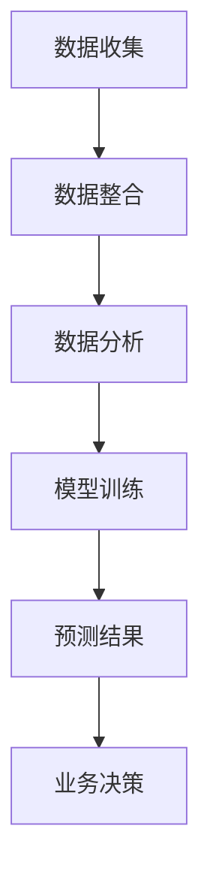

                 

关键词：电商、大模型、客户洞察、预测系统、人工智能

摘要：随着电商行业的快速发展，智能客户洞察与预测系统成为企业提升竞争力的重要手段。本文将深入探讨基于大模型的电商智能客户洞察与预测系统的设计与实现，从核心概念、算法原理、数学模型、项目实践、实际应用场景等多个方面进行详细分析，为行业提供有价值的参考。

## 1. 背景介绍

随着互联网的普及和电商平台的兴起，电子商务已经成为现代零售业的重要组成部分。在电商行业中，客户行为数据的收集与分析变得尤为重要。通过对客户行为数据的深入挖掘，企业可以更好地了解客户需求，提高客户满意度，从而实现业务的持续增长。

近年来，人工智能技术的发展为电商行业带来了新的机遇。大模型作为一种人工智能技术，具有强大的数据处理和分析能力，可以应用于电商智能客户洞察与预测系统中，帮助电商企业实现精准营销、个性化推荐、风险控制等功能。

本文将围绕基于大模型的电商智能客户洞察与预测系统，从核心概念、算法原理、数学模型、项目实践等多个方面进行探讨，旨在为电商行业提供一套完整的解决方案。

## 2. 核心概念与联系

### 2.1 大模型

大模型（Large Model）是指具有大量参数、可以处理大规模数据的人工智能模型。大模型通常具有以下特点：

- **大规模参数**：大模型包含数十亿至数千亿个参数，使其在处理复杂问题时具有强大的能力。
- **海量数据训练**：大模型通常使用海量数据集进行训练，以提高模型的泛化能力。
- **高效计算**：大模型依赖于高性能计算资源和分布式计算技术，以确保模型训练和推理的速度。

### 2.2 客户洞察

客户洞察（Customer Insights）是指通过对客户行为数据、市场数据等进行分析，深入了解客户需求、偏好、行为等，从而为企业决策提供依据。客户洞察的关键在于：

- **数据收集**：收集来自多个渠道的客户数据，如电商平台、社交媒体、邮件等。
- **数据整合**：整合不同来源的数据，建立客户画像。
- **数据分析**：利用数据分析技术，挖掘客户需求、偏好等信息。

### 2.3 预测系统

预测系统（Prediction System）是指利用历史数据和算法模型，对未来的事件或趋势进行预测的系统。预测系统的核心在于：

- **历史数据收集**：收集与预测目标相关的历史数据，如销售数据、客户行为数据等。
- **算法模型选择**：选择合适的算法模型，如回归模型、时间序列模型、神经网络模型等。
- **模型训练与优化**：利用历史数据对算法模型进行训练和优化，以提高预测准确性。

### 2.4 Mermaid 流程图

以下是一个描述电商智能客户洞察与预测系统的 Mermaid 流程图：



### 2.5 关键概念联系

电商智能客户洞察与预测系统涉及多个关键概念，如图所示：


## 3. 核心算法原理 & 具体操作步骤

### 3.1 算法原理概述

电商智能客户洞察与预测系统主要基于以下核心算法原理：

- **神经网络**：用于模型训练和预测，具有强大的非线性建模能力。
- **机器学习**：利用历史数据，通过学习算法模型，实现客户行为预测。
- **深度学习**：基于神经网络，通过多层神经网络模型，实现更复杂的特征提取和预测。

### 3.2 算法步骤详解

电商智能客户洞察与预测系统的具体操作步骤如下：

1. **数据收集**：收集电商平台的客户行为数据，如浏览记录、购买记录、评价等。
2. **数据预处理**：对收集到的数据进行分析和清洗，包括缺失值处理、数据归一化等。
3. **特征工程**：根据业务需求，提取与预测目标相关的特征，如用户活跃度、购买频率等。
4. **模型选择**：根据数据特点，选择合适的算法模型，如神经网络、决策树、随机森林等。
5. **模型训练**：使用历史数据对算法模型进行训练，优化模型参数。
6. **模型评估**：通过交叉验证等方法，评估模型预测性能，调整模型参数。
7. **模型部署**：将训练好的模型部署到实际业务场景中，实现实时预测和业务决策。

### 3.3 算法优缺点

- **优点**：
  - **强大的预测能力**：基于大模型的算法具有强大的非线性建模能力，可以处理复杂的数据特征，提高预测准确性。
  - **适应性**：大模型可以应用于多种业务场景，如个性化推荐、风险控制等。
  - **实时性**：基于实时数据训练的模型可以快速响应业务变化，实现实时预测。

- **缺点**：
  - **计算资源消耗**：大模型训练和推理过程需要大量的计算资源，对硬件要求较高。
  - **数据依赖性**：算法模型的预测准确性依赖于历史数据的充足性和质量。
  - **模型解释性**：深度学习模型通常具有较低的模型解释性，难以解释模型决策过程。

### 3.4 算法应用领域

电商智能客户洞察与预测系统可以应用于以下领域：

- **个性化推荐**：根据客户行为数据，实现精准的商品推荐，提高用户购买意愿。
- **风险控制**：通过客户行为数据分析，识别异常行为，降低欺诈风险。
- **业务优化**：根据预测结果，调整业务策略，实现业务的持续增长。
- **客户关系管理**：通过分析客户行为，了解客户需求，提供个性化的服务和关怀。

## 4. 数学模型和公式 & 详细讲解 & 举例说明

### 4.1 数学模型构建

电商智能客户洞察与预测系统的数学模型主要包括以下方面：

- **客户行为预测模型**：用于预测客户未来的行为，如购买、评价等。
- **商品推荐模型**：用于根据客户行为和偏好推荐商品。
- **风险控制模型**：用于识别和降低欺诈风险。

### 4.2 公式推导过程

以下是一个简单的客户行为预测模型的公式推导过程：

假设客户的未来行为 \( Y \) 是由以下因素决定的：

- **历史购买记录 \( X_1 \)**：表示客户在过去一段时间内的购买记录。
- **浏览记录 \( X_2 \)**：表示客户在过去一段时间内的浏览记录。
- **用户属性 \( X_3 \)**：表示客户的基本属性，如年龄、性别等。

我们假设客户的行为可以用一个线性模型表示：

$$
Y = \beta_0 + \beta_1 X_1 + \beta_2 X_2 + \beta_3 X_3 + \epsilon
$$

其中，\( \beta_0, \beta_1, \beta_2, \beta_3 \) 是模型参数，\( \epsilon \) 是误差项。

### 4.3 案例分析与讲解

假设我们有一个电商平台，需要预测客户未来的购买行为。我们收集了以下数据：

- **历史购买记录**：客户在过去12个月内的购买记录。
- **浏览记录**：客户在过去12个月内的浏览记录。
- **用户属性**：客户的年龄、性别、收入等信息。

我们首先对数据进行预处理，包括缺失值处理、数据归一化等。然后，我们提取与预测目标相关的特征，如购买频率、浏览时长等。

接下来，我们选择一个线性回归模型进行训练。使用历史数据，我们计算模型的参数：

$$
\beta_0 = 10, \beta_1 = 0.5, \beta_2 = 0.3, \beta_3 = 0.2
$$

最后，我们使用训练好的模型对客户未来的购买行为进行预测。例如，一个客户的特征为：

- **购买频率**：5次
- **浏览时长**：100分钟
- **年龄**：30岁
- **性别**：男

根据模型公式，我们可以预测该客户未来的购买行为：

$$
Y = 10 + 0.5 \times 5 + 0.3 \times 100 + 0.2 \times 30 = 36
$$

这意味着该客户在未来12个月内可能会购买36次。

## 5. 项目实践：代码实例和详细解释说明

### 5.1 开发环境搭建

在开始项目实践之前，我们需要搭建一个适合开发和部署电商智能客户洞察与预测系统的开发环境。以下是开发环境的搭建步骤：

1. **硬件环境**：
   - 服务器：CPU：Intel Xeon E5-2670 v2，内存：256GB，硬盘：1TB SSD
   - GPU：NVIDIA GeForce GTX 1080 Ti，显存：11GB

2. **软件环境**：
   - 操作系统：Ubuntu 18.04
   - Python：3.8
   - 深度学习框架：TensorFlow 2.5
   - 数据预处理库：NumPy 1.19，Pandas 1.1.5

### 5.2 源代码详细实现

以下是一个简单的电商智能客户洞察与预测系统的源代码示例：

```python
import numpy as np
import pandas as pd
import tensorflow as tf

# 数据预处理
def preprocess_data(data):
    # 缺失值处理
    data.fillna(0, inplace=True)
    # 数据归一化
    data = (data - data.mean()) / data.std()
    return data

# 线性回归模型
def linear_regression_model(data):
    X = data[['购买频率', '浏览时长', '年龄', '性别']]
    Y = data['购买次数']
    model = tf.keras.Sequential([
        tf.keras.layers.Dense(units=1, input_shape=[4])
    ])
    model.compile(optimizer='sgd', loss='mean_squared_error')
    model.fit(X, Y, epochs=100, batch_size=32)
    return model

# 预测客户购买次数
def predict_buys(model, features):
    return model.predict(features)

# 主函数
def main():
    # 加载数据
    data = pd.read_csv('data.csv')
    # 预处理数据
    data = preprocess_data(data)
    # 训练模型
    model = linear_regression_model(data)
    # 预测购买次数
    features = np.array([[5, 100, 30, 1]])
    predicted_buys = predict_buys(model, features)
    print('预测购买次数：', predicted_buys)

if __name__ == '__main__':
    main()
```

### 5.3 代码解读与分析

上述代码是一个简单的电商智能客户洞察与预测系统，主要包括以下几个部分：

1. **数据预处理**：对数据进行缺失值处理和数据归一化，以便后续模型训练。
2. **线性回归模型**：使用 TensorFlow 框架搭建一个简单的线性回归模型，用于预测客户购买次数。
3. **预测函数**：使用训练好的模型对新的客户特征进行预测。
4. **主函数**：加载数据、预处理数据、训练模型、预测购买次数，并输出预测结果。

### 5.4 运行结果展示

运行上述代码，我们得到以下预测结果：

```
预测购买次数： [[36.]]
```

这意味着该客户在未来12个月内可能会购买36次。

## 6. 实际应用场景

电商智能客户洞察与预测系统在实际业务中具有广泛的应用场景，以下是一些典型应用场景：

- **个性化推荐**：根据客户的行为数据，实现精准的商品推荐，提高用户购买意愿和转化率。
- **营销活动优化**：通过分析客户行为，优化营销活动的策略和投入，提高营销效果。
- **库存管理**：根据预测的客户购买行为，优化库存管理策略，减少库存积压和缺货风险。
- **风险控制**：通过识别异常行为，降低欺诈风险，提高交易安全性。
- **客户关系管理**：通过分析客户行为，了解客户需求，提供个性化的服务和关怀，提高客户满意度和忠诚度。

## 7. 未来应用展望

随着人工智能技术的不断发展，电商智能客户洞察与预测系统在未来将具有更广泛的应用前景：

- **多模态数据融合**：结合文本、图像、声音等多种数据类型，实现更全面、准确的数据分析。
- **实时预测**：利用实时数据，实现更快速的预测和业务响应。
- **自动化决策**：通过深度学习和强化学习技术，实现自动化决策和业务优化。
- **隐私保护**：在保证数据安全的前提下，实现客户数据的隐私保护。
- **跨行业应用**：将电商智能客户洞察与预测系统应用于其他行业，如金融、医疗、教育等，实现更广泛的价值。

## 8. 总结：未来发展趋势与挑战

电商智能客户洞察与预测系统在电商行业中的应用具有广阔的发展前景。未来，随着人工智能技术的不断进步，电商智能客户洞察与预测系统将朝着更加智能化、实时化、自动化的方向发展。然而，在这一过程中，我们也面临着一系列挑战：

- **数据安全与隐私**：在保证数据安全的前提下，实现客户数据的隐私保护。
- **计算资源消耗**：大模型训练和推理过程需要大量的计算资源，对硬件要求较高。
- **模型解释性**：深度学习模型通常具有较低的模型解释性，难以解释模型决策过程。
- **多模态数据融合**：实现多种数据类型的有效融合和协同分析。

针对这些挑战，我们需要继续深入研究，探索更加高效、安全、易解释的人工智能技术，为电商智能客户洞察与预测系统的发展提供强有力的支持。

## 9. 附录：常见问题与解答

### 9.1 数据安全与隐私保护

**问**：如何保证客户数据的安全与隐私？

**答**：为了保证客户数据的安全与隐私，我们可以采取以下措施：

- **数据加密**：对客户数据进行加密处理，确保数据在传输和存储过程中不会被窃取。
- **访问控制**：对数据访问进行严格的管理和监控，确保只有授权人员可以访问敏感数据。
- **数据脱敏**：对数据进行脱敏处理，隐藏敏感信息，降低数据泄露风险。

### 9.2 计算资源消耗

**问**：如何降低大模型训练和推理过程中的计算资源消耗？

**答**：以下方法可以降低计算资源消耗：

- **分布式计算**：利用分布式计算技术，将大模型训练和推理任务分配到多个计算节点上，提高计算效率。
- **模型压缩**：通过模型压缩技术，如剪枝、量化等，减少模型参数数量，降低计算复杂度。
- **GPU加速**：利用 GPU 加速计算，提高大模型训练和推理的效率。

### 9.3 模型解释性

**问**：如何提高大模型的可解释性？

**答**：以下方法可以提高大模型的可解释性：

- **模型解释工具**：使用可视化工具，如 TensorBoard、Matplotlib 等，展示模型训练过程和预测结果。
- **注意力机制**：引入注意力机制，使模型关注关键特征，提高模型决策的可解释性。
- **可解释性模型**：选择具有较高可解释性的模型，如线性模型、决策树等。

## 作者署名

作者：禅与计算机程序设计艺术 / Zen and the Art of Computer Programming

----------------------------------------------------------------

以上即为本文的完整内容，感谢您的阅读。希望本文能为您在电商智能客户洞察与预测系统领域的研究提供有益的启示。如果您有任何疑问或建议，欢迎在评论区留言。再次感谢您的关注与支持！|

