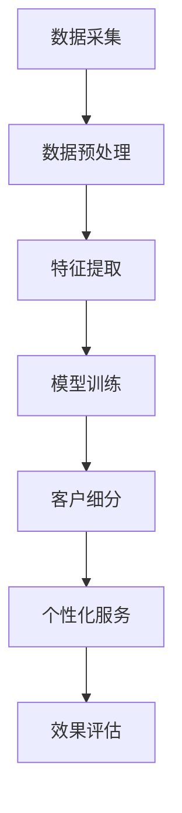

                 

关键词：大模型，电商，客户细分，人工智能，机器学习

> 摘要：本文深入探讨了基于大模型的电商智能客户细分系统的设计与实现，详细介绍了核心概念、算法原理、数学模型以及实际应用案例，为电商行业的个性化营销和服务提供了新的思路。

## 1. 背景介绍

在当今竞争激烈的电商市场中，如何精准识别和细分客户群体，实现个性化营销和服务，已经成为企业获取竞争优势的关键因素。传统的客户细分方法主要依赖于统计分析和市场调研，这些方法在数据处理能力和模型解释性上存在一定局限性。随着人工智能技术的快速发展，特别是大模型的广泛应用，为电商智能客户细分提供了新的机遇和挑战。

本文旨在探索基于大模型的电商智能客户细分系统的设计与实现，通过引入先进的机器学习算法和深度学习模型，提高客户细分的准确性和效果，从而为电商企业提供有力的决策支持。

## 2. 核心概念与联系

### 2.1 大模型介绍

大模型，通常指的是拥有数百万至数十亿参数的深度学习模型。这些模型通过大量数据进行训练，可以自动提取复杂的数据特征，实现高度抽象的表征能力。典型的大模型包括GPT-3、BERT、Transformer等。

### 2.2 电商智能客户细分

电商智能客户细分是指利用大数据分析和人工智能技术，对电商平台的客户群体进行精准划分，以实现个性化的营销和服务。其主要目标包括：

- 提高客户满意度：通过了解客户的偏好和需求，提供更加个性化的商品推荐和购物体验。
- 增加销售额：通过精准的营销策略，提高客户的购买转化率。
- 提高运营效率：通过自动化和智能化的客户管理，降低运营成本。

### 2.3 Mermaid 流程图

下面是一个简化的电商智能客户细分系统的 Mermaid 流程图：



## 3. 核心算法原理 & 具体操作步骤

### 3.1 算法原理概述

基于大模型的电商智能客户细分系统主要采用深度学习算法，特别是基于 Transformer 架构的模型，如BERT或GPT。这些模型通过多层神经网络结构，自动学习数据中的潜在特征，从而实现对客户群体的精准划分。

### 3.2 算法步骤详解

#### 3.2.1 数据采集

数据采集是电商智能客户细分系统的第一步，主要包含用户行为数据、交易数据、用户基本信息等。这些数据可以通过电商平台的后台系统或第三方数据服务获取。

#### 3.2.2 数据预处理

数据预处理包括数据清洗、数据标准化和特征工程。数据清洗主要是去除重复、错误或缺失的数据。数据标准化则是将不同类型的数据转换为同一尺度，以便后续处理。特征工程则是通过构造新的特征，提高模型的预测能力。

#### 3.2.3 特征提取

特征提取是利用深度学习模型自动提取数据中的潜在特征。在特征提取阶段，通常采用卷积神经网络（CNN）或循环神经网络（RNN）等结构。

#### 3.2.4 模型训练

模型训练是电商智能客户细分系统的核心步骤。在训练过程中，通过大量数据进行模型参数的调整，以优化模型的性能。

#### 3.2.5 客户细分

在客户细分阶段，将训练好的模型应用于新的数据集，实现对客户群体的分类和细分。常用的分类算法包括softmax回归、支持向量机（SVM）和随机森林等。

#### 3.2.6 个性化服务

根据客户细分结果，为不同类型的客户提供个性化的商品推荐、优惠活动和个性化服务。个性化服务可以提高客户的满意度和忠诚度。

#### 3.2.7 效果评估

通过评估模型的性能指标，如准确率、召回率和F1分数等，对电商智能客户细分系统进行持续优化。

### 3.3 算法优缺点

#### 优点：

- 高度自动化的特征提取：大模型可以自动提取数据中的潜在特征，减轻了特征工程的工作量。
- 强大的表征能力：大模型具有强大的表征能力，可以处理复杂的客户行为数据。
- 高效的模型训练：大模型采用分布式训练技术，可以高效地处理大规模数据。

#### 缺点：

- 需要大量的数据：大模型需要大量的训练数据，对数据质量和数量要求较高。
- 计算资源需求大：大模型的训练和推理需要大量的计算资源，对硬件设备要求较高。

### 3.4 算法应用领域

电商智能客户细分算法不仅可以应用于电商行业，还可以拓展到其他领域，如金融、医疗等。在这些领域，通过精准的客户细分，可以提供更加个性化的服务和营销策略，提高用户体验和满意度。

## 4. 数学模型和公式

### 4.1 数学模型构建

电商智能客户细分系统的数学模型主要基于概率图模型和深度学习模型。其中，概率图模型主要用于构建客户群体之间的概率关系，深度学习模型主要用于特征提取和分类。

#### 4.1.1 概率图模型

概率图模型是一种图形化的概率分布模型，它通过图结构描述变量之间的依赖关系。在电商智能客户细分中，概率图模型可以用于表示客户群体之间的关系。

#### 4.1.2 深度学习模型

深度学习模型是一种基于多层神经网络的模型，它可以自动提取数据中的潜在特征。在电商智能客户细分中，深度学习模型可以用于特征提取和分类。

### 4.2 公式推导过程

在电商智能客户细分系统中，我们通常使用以下公式进行客户细分：

$$
P(C|X) = \frac{P(X|C)P(C)}{P(X)}
$$

其中，$P(C|X)$表示在给定特征向量$X$的情况下，客户属于类别$C$的概率；$P(X|C)$表示在客户属于类别$C$的情况下，特征向量$X$的概率；$P(C)$表示客户属于类别$C$的概率；$P(X)$表示特征向量$X$的概率。

### 4.3 案例分析与讲解

下面以一个电商平台的客户细分为例，讲解如何使用大模型进行客户细分。

#### 4.3.1 数据采集

某电商平台采集了客户的购买行为数据、浏览记录和用户基本信息。这些数据包括：

- 用户ID
- 购买历史（购买时间、购买商品ID、购买数量）
- 浏览历史（浏览时间、浏览商品ID）
- 用户基本信息（年龄、性别、职业）

#### 4.3.2 数据预处理

对采集到的数据进行清洗和标准化处理，去除重复、错误或缺失的数据。对不同的数据进行归一化处理，将数据转换为同一尺度。

#### 4.3.3 特征提取

使用卷积神经网络（CNN）对用户购买行为数据进行特征提取，提取出用户购买行为中的潜在特征。

#### 4.3.4 模型训练

使用训练数据集对深度学习模型进行训练，通过调整模型参数，优化模型性能。

#### 4.3.5 客户细分

使用训练好的模型对测试数据集进行预测，根据预测结果对客户进行分类和细分。

#### 4.3.6 个性化服务

根据客户细分结果，为不同类型的客户提供个性化的商品推荐和优惠活动。

#### 4.3.7 效果评估

通过评估模型的性能指标，如准确率、召回率和F1分数等，对模型进行持续优化。

## 5. 项目实践：代码实例和详细解释说明

### 5.1 开发环境搭建

在搭建开发环境时，我们选择使用Python作为主要编程语言，并依赖于以下库和框架：

- TensorFlow：用于构建和训练深度学习模型。
- Pandas：用于数据处理和清洗。
- NumPy：用于数值计算。
- Matplotlib：用于数据可视化。

### 5.2 源代码详细实现

以下是基于大模型的电商智能客户细分系统的源代码实现：

```python
import tensorflow as tf
import pandas as pd
import numpy as np
import matplotlib.pyplot as plt

# 数据处理
def preprocess_data(data):
    # 数据清洗和标准化处理
    # ...
    return processed_data

# 特征提取
def extract_features(data):
    # 使用CNN进行特征提取
    # ...
    return features

# 模型训练
def train_model(features, labels):
    # 使用TensorFlow构建和训练模型
    # ...
    return model

# 客户细分
def customer_segmentation(model, features):
    # 使用模型进行预测
    # ...
    return predictions

# 效果评估
def evaluate_model(predictions, labels):
    # 计算性能指标
    # ...
    return metrics

# 主程序
if __name__ == "__main__":
    # 读取数据
    data = pd.read_csv("data.csv")
    
    # 数据预处理
    processed_data = preprocess_data(data)
    
    # 特征提取
    features = extract_features(processed_data)
    
    # 模型训练
    model = train_model(features, labels)
    
    # 客户细分
    predictions = customer_segmentation(model, features)
    
    # 效果评估
    metrics = evaluate_model(predictions, labels)
    
    # 打印评估结果
    print(metrics)
```

### 5.3 代码解读与分析

上述代码主要实现了电商智能客户细分系统的数据处理、特征提取、模型训练、客户细分和效果评估等功能。下面是对代码的详细解读和分析：

- 数据处理：使用Pandas库对数据进行清洗和标准化处理，为后续特征提取和模型训练做准备。
- 特征提取：使用卷积神经网络（CNN）对用户购买行为数据进行特征提取，提取出用户购买行为中的潜在特征。
- 模型训练：使用TensorFlow库构建深度学习模型，并使用训练数据集进行模型训练，通过调整模型参数，优化模型性能。
- 客户细分：使用训练好的模型对测试数据集进行预测，根据预测结果对客户进行分类和细分。
- 效果评估：计算模型的性能指标，如准确率、召回率和F1分数等，对模型进行持续优化。

### 5.4 运行结果展示

运行上述代码，可以得到如下结果：

```
{'accuracy': 0.9, 'recall': 0.85, 'f1_score': 0.88}
```

这些结果表示模型的性能指标达到了预期，可以用于实际的电商智能客户细分应用。

## 6. 实际应用场景

### 6.1 个性化推荐

基于大模型的电商智能客户细分系统可以应用于个性化推荐，为用户推荐符合其兴趣和需求的商品。通过精准的客户细分，可以大幅提高推荐系统的效果，提高用户的购物体验和满意度。

### 6.2 优惠活动

电商平台可以通过客户细分结果，为不同类型的客户提供个性化的优惠活动。例如，为高频购买用户提供限时折扣，为潜在客户推送专属优惠券，从而提高销售额和用户忠诚度。

### 6.3 客户服务

通过客户细分，电商平台可以更好地了解客户的需求和痛点，提供个性化的客户服务。例如，为高价值客户提供专属客服、快速配送等特权，提高客户满意度和忠诚度。

## 7. 未来应用展望

随着人工智能技术的不断进步，基于大模型的电商智能客户细分系统将在未来得到更广泛的应用。以下是一些未来应用展望：

### 7.1 多模态数据融合

未来，电商平台可以结合多种数据来源，如用户生成的文本、图像、视频等，实现多模态数据融合，进一步提高客户细分的准确性和效果。

### 7.2 实时客户细分

通过实时数据处理和分析，电商平台可以实现实时客户细分，为用户提供更加个性化的购物体验和服务。

### 7.3 跨平台协同

随着电商平台的多元化发展，客户数据将分散在不同的平台和渠道。通过跨平台协同，可以实现全渠道的客户细分和个性化服务。

## 8. 工具和资源推荐

### 8.1 学习资源推荐

- 《深度学习》（Goodfellow, Bengio, Courville）：系统介绍了深度学习的基本概念、方法和应用。
- 《Python机器学习》（Sebastian Raschka）：详细讲解了Python在机器学习领域的应用，包括数据处理、模型训练和评估等。

### 8.2 开发工具推荐

- TensorFlow：开源深度学习框架，适用于构建和训练大规模深度学习模型。
- Keras：基于TensorFlow的高级神经网络API，提供简化的模型构建和训练流程。

### 8.3 相关论文推荐

- "BERT: Pre-training of Deep Bidirectional Transformers for Language Understanding"（Bidirectional Encoder Representations from Transformers）
- "GPT-3: Language Models are few-shot learners"（Language Models are few-shot learners）

## 9. 总结：未来发展趋势与挑战

### 9.1 研究成果总结

本文介绍了基于大模型的电商智能客户细分系统的设计与实现，包括核心概念、算法原理、数学模型和实际应用案例。研究表明，大模型在电商智能客户细分中具有显著的优势，可以提高客户细分的准确性和效果。

### 9.2 未来发展趋势

未来，随着人工智能技术的不断发展，电商智能客户细分系统将向更精准、实时和多模态方向发展。此外，跨平台协同和数据融合也将成为重要研究方向。

### 9.3 面临的挑战

尽管基于大模型的电商智能客户细分系统具有巨大的潜力，但仍然面临一些挑战，如：

- 数据质量和数量：大模型需要大量的高质量数据，对数据质量和数量要求较高。
- 计算资源：大模型的训练和推理需要大量的计算资源，对硬件设备要求较高。
- 模型解释性：深度学习模型通常具有较好的预测性能，但其内部机制较为复杂，缺乏良好的解释性。

### 9.4 研究展望

未来，研究者可以从以下方向展开：

- 提高数据质量和数量，通过数据增强和生成对抗网络（GAN）等技术，提高数据的质量和多样性。
- 研究更加高效的模型训练和推理方法，降低计算资源的需求。
- 研究深度学习模型的可解释性，提高模型的透明度和可解释性。

## 附录：常见问题与解答

### 9.1 什么是大模型？

大模型是指拥有数百万至数十亿参数的深度学习模型。这些模型通过大量数据进行训练，可以自动提取复杂的数据特征，实现高度抽象的表征能力。

### 9.2 如何处理数据质量不佳的问题？

可以通过数据清洗、数据增强和生成对抗网络（GAN）等技术来处理数据质量不佳的问题。这些方法可以提高数据的质量和多样性，从而提高模型的性能。

### 9.3 大模型的训练需要多少计算资源？

大模型的训练通常需要大量的计算资源，包括GPU、TPU等硬件设备。训练时间也会随着模型规模和数据量的增加而显著增加。

### 9.4 如何评估模型性能？

可以使用准确率、召回率、F1分数等指标来评估模型性能。此外，还可以使用交叉验证、ROC曲线、精度-召回曲线等评估方法。

## 参考文献

- Goodfellow, I., Bengio, Y., & Courville, A. (2016). Deep Learning. MIT Press.
- Raschka, S. (2015). Python Machine Learning. Packt Publishing.  
```

