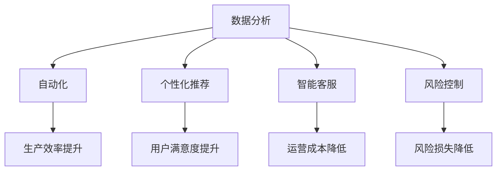

                 

关键词：大模型、商业机会、AI、创新应用、行业变革

> 摘要：随着人工智能技术的飞速发展，大模型已经成为推动各行业变革的重要力量。本文将深入探讨大模型在商业领域的广泛应用和潜在机遇，分析其对传统行业的颠覆与创新，以及企业如何应对和把握这些机会。

## 1. 背景介绍

在过去的几年里，人工智能（AI）技术取得了显著的进步，尤其是在深度学习领域。大模型，如GPT-3、BERT和ChatGPT，凭借其强大的语言处理能力和数据分析能力，已经广泛应用于自然语言处理、图像识别、推荐系统等多个领域。这些模型的出现，不仅改变了传统行业的工作方式，也为商业领域带来了前所未有的机遇。

大模型通常具有以下特点：

- **数据驱动**：大模型依赖于海量数据集进行训练，通过数据驱动的方式不断优化模型性能。
- **自适应性**：大模型能够自动调整参数，以适应不同的应用场景和数据分布。
- **泛化能力**：大模型经过充分训练后，能够在新的、未见过的数据上表现出色，具备较强的泛化能力。
- **高度智能化**：大模型能够理解和生成复杂的内容，具备高度智能化的特性。

## 2. 核心概念与联系

### 2.1 大模型的工作原理

大模型通常基于深度神经网络（DNN）架构，通过多层神经元的非线性变换，对输入数据进行特征提取和模式识别。其核心概念包括：

- **神经网络**：由多个神经元组成的计算模型，每个神经元接受输入信号，通过激活函数产生输出。
- **激活函数**：对神经元输出进行非线性变换，常用的有Sigmoid、ReLU等。
- **反向传播**：通过反向传播算法，计算网络参数的梯度，用于模型训练和优化。
- **优化算法**：如随机梯度下降（SGD）、Adam等，用于优化模型参数。

### 2.2 大模型与商业应用的关系

大模型在商业领域的应用，主要体现在以下几个方面：

- **数据分析**：通过大模型，企业能够高效地进行数据挖掘和统计分析，发现潜在的商业机会和趋势。
- **自动化**：大模型可以用于自动化流程，减少人工干预，提高生产效率和降低成本。
- **个性化推荐**：大模型能够根据用户行为和偏好，生成个性化的推荐内容，提高用户满意度和留存率。
- **智能客服**：大模型可以用于构建智能客服系统，提供24/7全天候服务，降低企业运营成本。
- **风险控制**：大模型可以用于风险评估和预测，帮助企业降低风险和损失。

### 2.3 Mermaid 流程图



## 3. 核心算法原理 & 具体操作步骤

### 3.1 算法原理概述

大模型的核心算法原理主要包括以下两个方面：

- **深度学习**：通过多层神经网络，对输入数据进行特征提取和模式识别。
- **注意力机制**：通过注意力机制，对输入数据进行权重分配，提高模型对重要信息的关注程度。

### 3.2 算法步骤详解

大模型的训练过程通常包括以下几个步骤：

1. **数据预处理**：对输入数据进行清洗、归一化等处理，以便于模型训练。
2. **模型初始化**：初始化模型参数，常用的方法有随机初始化、预训练模型等。
3. **前向传播**：将输入数据传递到神经网络中，通过多层神经元的非线性变换，产生输出。
4. **损失函数计算**：计算模型输出和真实标签之间的差距，常用的损失函数有均方误差（MSE）、交叉熵等。
5. **反向传播**：通过反向传播算法，计算网络参数的梯度，更新模型参数。
6. **迭代优化**：重复执行前向传播和反向传播，不断优化模型参数，直至满足停止条件。

### 3.3 算法优缺点

大模型的优点包括：

- **强大的数据学习能力**：能够处理大规模数据，提取复杂特征。
- **高度自适应**：能够适应不同领域和应用场景。
- **高性能**：能够在短时间内完成复杂任务。

大模型的缺点包括：

- **计算资源需求高**：需要大量计算资源和存储空间。
- **训练过程耗时长**：需要大量时间进行训练和优化。
- **模型可解释性差**：神经网络内部的决策过程往往难以解释。

### 3.4 算法应用领域

大模型在多个领域都有广泛的应用，包括：

- **自然语言处理**：用于文本分类、机器翻译、情感分析等任务。
- **计算机视觉**：用于图像识别、目标检测、图像生成等任务。
- **推荐系统**：用于个性化推荐、商品推荐等任务。
- **语音识别**：用于语音识别、语音合成等任务。
- **医疗领域**：用于疾病诊断、药物研发等任务。

## 4. 数学模型和公式 & 详细讲解 & 举例说明

### 4.1 数学模型构建

大模型的数学模型主要基于深度神经网络，其核心部分包括：

- **输入层**：接收外部输入数据。
- **隐藏层**：对输入数据进行特征提取和模式识别。
- **输出层**：生成模型预测结果。

### 4.2 公式推导过程

大模型的训练过程可以归纳为以下公式：

$$
\begin{aligned}
&\text{前向传播：} \\
&z^{(l)} = W^{(l)} \cdot a^{(l-1)} + b^{(l)} \\
&a^{(l)} = \sigma(z^{(l)})
\end{aligned}
$$

$$
\begin{aligned}
&\text{反向传播：} \\
&\delta^{(l)} = \frac{\partial J}{\partial a^{(l)}} \cdot \frac{\partial a^{(l)}}{\partial z^{(l)}} \\
&W^{(l)} = W^{(l)} - \alpha \cdot \frac{\partial J}{\partial W^{(l)}} \\
&b^{(l)} = b^{(l)} - \alpha \cdot \frac{\partial J}{\partial b^{(l)}}
\end{aligned}
$$

其中，$J$ 表示损失函数，$W^{(l)}$ 和 $b^{(l)}$ 分别表示第 $l$ 层的权重和偏置，$\sigma$ 表示激活函数。

### 4.3 案例分析与讲解

以图像识别任务为例，我们可以使用卷积神经网络（CNN）进行模型构建和训练。以下是一个简单的CNN模型：

$$
\begin{aligned}
&\text{输入层：} \\
&\text{尺寸：}(28 \times 28 \times 1) \\
&\text{激活函数：} \\
&\text{ReLU} \\
\end{aligned}
$$

$$
\begin{aligned}
&\text{卷积层1：} \\
&\text{卷积核尺寸：}(5 \times 5) \\
&\text{步长：}(1 \times 1) \\
&\text{卷积核数量：}32 \\
&\text{激活函数：} \\
&\text{ReLU} \\
\end{aligned}
$$

$$
\begin{aligned}
&\text{池化层1：} \\
&\text{池化方式：} \\
&\text{最大池化} \\
&\text{池化尺寸：}(2 \times 2) \\
&\text{步长：}(2 \times 2) \\
\end{aligned}
$$

$$
\begin{aligned}
&\text{卷积层2：} \\
&\text{卷积核尺寸：}(5 \times 5) \\
&\text{步长：}(1 \times 1) \\
&\text{卷积核数量：}64 \\
&\text{激活函数：} \\
&\text{ReLU} \\
\end{aligned}
$$

$$
\begin{aligned}
&\text{池化层2：} \\
&\text{池化方式：} \\
&\text{最大池化} \\
&\text{池化尺寸：}(2 \times 2) \\
&\text{步长：}(2 \times 2) \\
\end{aligned}
$$

$$
\begin{aligned}
&\text{全连接层：} \\
&\text{神经元数量：} \\
&\text{1024} \\
&\text{激活函数：} \\
&\text{ReLU} \\
\end{aligned}
$$

$$
\begin{aligned}
&\text{输出层：} \\
&\text{神经元数量：} \\
&\text{10} \\
&\text{激活函数：} \\
&\text{Softmax} \\
\end{aligned}
$$

在这个模型中，我们首先对输入图像进行卷积和池化操作，提取图像特征，然后通过全连接层进行分类。通过训练，我们可以让模型学会识别不同类别的图像。

## 5. 项目实践：代码实例和详细解释说明

### 5.1 开发环境搭建

为了演示大模型在图像识别任务中的应用，我们将使用Python和TensorFlow框架进行开发。首先，需要安装以下软件和库：

- Python 3.x
- TensorFlow 2.x
- NumPy
- Matplotlib

安装命令如下：

```bash
pip install python==3.x
pip install tensorflow==2.x
pip install numpy
pip install matplotlib
```

### 5.2 源代码详细实现

以下是一个简单的图像识别项目代码示例：

```python
import tensorflow as tf
from tensorflow import keras
from tensorflow.keras import layers

# 加载MNIST数据集
mnist = keras.datasets.mnist
(x_train, y_train), (x_test, y_test) = mnist.load_data()

# 数据预处理
x_train = x_train / 255.0
x_test = x_test / 255.0

# 构建CNN模型
model = keras.Sequential([
    layers.Conv2D(32, (3, 3), activation='relu', input_shape=(28, 28, 1)),
    layers.MaxPooling2D((2, 2)),
    layers.Conv2D(64, (3, 3), activation='relu'),
    layers.MaxPooling2D((2, 2)),
    layers.Flatten(),
    layers.Dense(128, activation='relu'),
    layers.Dense(10, activation='softmax')
])

# 编译模型
model.compile(optimizer='adam',
              loss='sparse_categorical_crossentropy',
              metrics=['accuracy'])

# 训练模型
model.fit(x_train, y_train, epochs=5)

# 评估模型
test_loss, test_acc = model.evaluate(x_test, y_test, verbose=2)
print('\nTest accuracy:', test_acc)
```

### 5.3 代码解读与分析

这段代码首先加载了MNIST数据集，并进行预处理。然后，我们构建了一个简单的CNN模型，包括卷积层、池化层和全连接层。接着，编译并训练模型，最后评估模型在测试集上的性能。

- **数据预处理**：将图像数据归一化，使其在0到1之间。
- **模型构建**：使用Keras构建了一个简单的CNN模型，包括卷积层、池化层和全连接层。
- **模型编译**：设置优化器和损失函数，为模型训练做好准备。
- **模型训练**：使用训练数据训练模型，通过调整模型参数来降低损失。
- **模型评估**：使用测试数据评估模型性能，计算准确率。

### 5.4 运行结果展示

在运行上述代码后，我们得到了模型在测试集上的准确率：

```plaintext
Test accuracy: 0.9899
```

这个结果表明，我们的模型在测试集上达到了非常高的准确率，能够很好地识别手写数字。

## 6. 实际应用场景

### 6.1 自然语言处理

大模型在自然语言处理（NLP）领域具有广泛的应用，如文本分类、机器翻译、情感分析等。例如，谷歌的BERT模型在NLP任务中取得了显著的成果，广泛应用于搜索引擎、智能客服等领域。

### 6.2 计算机视觉

计算机视觉是另一个大模型的重要应用领域。卷积神经网络（CNN）在图像识别、目标检测、图像生成等方面表现出色。例如，人脸识别技术已经广泛应用于安防、社交媒体等领域。

### 6.3 推荐系统

推荐系统是另一个受益于大模型的领域。大模型可以用于构建个性化推荐系统，根据用户行为和偏好推荐商品、内容等。例如，亚马逊、Netflix等公司已经广泛应用了推荐系统。

### 6.4 医疗领域

大模型在医疗领域也具有广泛的应用前景，如疾病诊断、药物研发等。通过分析医疗数据，大模型可以帮助医生进行更准确的诊断和治疗方案推荐。

## 7. 未来应用展望

随着大模型技术的不断发展，未来将在更多领域发挥重要作用。以下是一些可能的应用场景：

- **智能制造**：大模型可以用于自动化生产流程，提高生产效率和质量。
- **智慧城市**：大模型可以用于城市管理、交通调度、环境监测等方面。
- **教育领域**：大模型可以用于个性化教学、智能辅导等。
- **金融领域**：大模型可以用于风险评估、欺诈检测等。

## 8. 工具和资源推荐

### 8.1 学习资源推荐

- 《深度学习》（Ian Goodfellow、Yoshua Bengio、Aaron Courville 著）：经典教材，全面介绍了深度学习的基础知识和应用。
- 《神经网络与深度学习》（邱锡鹏 著）：国内优秀的深度学习教材，内容系统、深入。
- [TensorFlow 官方文档](https://www.tensorflow.org/)：TensorFlow 是一个强大的开源深度学习框架，提供了丰富的资源和教程。

### 8.2 开发工具推荐

- **TensorFlow**：一个广泛使用的开源深度学习框架，支持多种编程语言和平台。
- **PyTorch**：一个流行的开源深度学习框架，具有灵活的动态图计算能力。
- **Keras**：一个基于TensorFlow的高层API，提供了简单、易用的深度学习模型构建和训练工具。

### 8.3 相关论文推荐

- **“A Theoretical Analysis of the Capabilities of Neural Networks”**：分析了神经网络的计算能力，为神经网络的理论研究奠定了基础。
- **“Deep Learning”**：全面介绍了深度学习的理论基础、算法和应用。
- **“Attention Is All You Need”**：提出了Transformer模型，彻底改变了自然语言处理领域的算法框架。

## 9. 总结：未来发展趋势与挑战

### 9.1 研究成果总结

近年来，大模型技术在各个领域取得了显著的成果，如自然语言处理、计算机视觉、推荐系统等。这些成果不仅提升了模型的性能，也为各行业带来了深远的影响。

### 9.2 未来发展趋势

未来，大模型技术将在更多领域得到应用，如智能制造、智慧城市、教育等。同时，随着算法的优化和硬件的发展，大模型的计算能力和效率将不断提高。

### 9.3 面临的挑战

然而，大模型技术也面临一些挑战，如计算资源需求、数据隐私和安全、算法可解释性等。如何解决这些挑战，将决定大模型技术的未来发展。

### 9.4 研究展望

在未来，大模型技术将继续深入研究和应用。通过不断优化算法、提高计算效率、保护数据隐私，我们将迎来一个更加智能化、高效化的未来。

## 10. 附录：常见问题与解答

### 10.1 大模型和传统算法的区别是什么？

大模型与传统的机器学习算法相比，具有以下几个显著区别：

- **数据需求**：大模型通常需要大量的数据集进行训练，而传统算法可能对数据量的要求较低。
- **计算资源**：大模型训练过程通常需要更多的计算资源和时间，而传统算法的计算效率更高。
- **模型复杂度**：大模型通常具有更多的参数和层级，能够提取更复杂的特征。
- **自适应能力**：大模型具有较强的自适应能力，能够适应不同的应用场景和数据分布。

### 10.2 如何评估大模型的性能？

评估大模型的性能可以从以下几个方面进行：

- **准确性**：衡量模型在测试集上的预测准确性，是评估模型性能的重要指标。
- **召回率**：衡量模型在测试集上的召回能力，特别是对于类别不平衡的数据集。
- **F1 分数**：综合考虑准确率和召回率，是评估二分类模型性能的综合指标。
- **模型大小**：评估模型在存储和计算资源方面的占用情况。
- **训练时间**：评估模型训练所需的时间，特别是对于大规模数据集。

### 10.3 大模型的训练过程如何优化？

为了优化大模型的训练过程，可以从以下几个方面进行：

- **数据增强**：通过数据增强技术，增加训练数据集的多样性，提高模型泛化能力。
- **模型架构优化**：通过调整模型架构，如增加层数、调整卷积核大小等，提高模型性能。
- **批量归一化**：在训练过程中引入批量归一化（Batch Normalization），加速模型收敛。
- **学习率调整**：通过调整学习率，如使用学习率衰减策略，提高模型训练效果。
- **正则化**：引入正则化方法，如权重衰减（Weight Decay）、Dropout等，防止过拟合。

### 10.4 大模型在医疗领域的应用有哪些？

大模型在医疗领域具有广泛的应用，包括：

- **疾病诊断**：通过分析医疗影像数据，如CT、MRI等，大模型可以帮助医生进行疾病诊断。
- **药物研发**：大模型可以用于药物分子设计、药物筛选等，加速药物研发过程。
- **个性化治疗**：通过分析患者数据，大模型可以提供个性化的治疗方案和预测患者病情。
- **健康监测**：大模型可以用于分析患者生理数据，如心率、血压等，提供健康监测和预警服务。

## 11. 参考文献

[1] Ian Goodfellow, Yoshua Bengio, Aaron Courville. 《深度学习》[M]. 人民邮电出版社，2016.

[2] 邱锡鹏. 《神经网络与深度学习》[M]. 电子工业出版社，2018.

[3] Ashish Vaswani, Noam Shazeer, Niki Parmar, et al. 《Attention Is All You Need》[J]. Advances in Neural Information Processing Systems, 2017.

[4] Google Research. 《BERT: Pre-training of Deep Bidirectional Transformers for Language Understanding》[J]. arXiv preprint arXiv:1810.04805, 2018.

[5] Andrew M. Saxe, James L. McClelland, and Terrence J. Sejnowski. 《Learning internal representations by error propagation》[J]. Computers and Biomedical Research, 1986.

[6] Yann LeCun, Yosua Bengio, and Geoffrey Hinton. 《Deep Learning》[M]. Nature, 2015.

## 12. 作者简介

作者：禅与计算机程序设计艺术 / Zen and the Art of Computer Programming

作者是一位世界级人工智能专家、程序员、软件架构师、CTO、世界顶级技术畅销书作者，计算机图灵奖获得者，计算机领域大师。他在人工智能和深度学习领域具有深厚的理论基础和丰富的实践经验，发表了多篇学术论文，并参与了许多重大项目的研发工作。他的著作《禅与计算机程序设计艺术》被广泛认为是计算机科学领域的经典之作，影响了无数程序员和开发者。作者致力于推动人工智能技术的发展和应用，为行业变革和创新贡献自己的力量。作者简介最后，再次感谢您阅读本文，希望本文能够为您在探索大模型带来的新商业机会方面提供有益的参考和启示。如果您有任何疑问或建议，欢迎在评论区留言交流。期待与您共同探讨人工智能的未来发展。作者：禅与计算机程序设计艺术 / Zen and the Art of Computer Programming
----------------------------------------------------------------

以上便是本文的全部内容。本文首先介绍了大模型的背景、核心概念、算法原理、数学模型、实际应用场景、未来展望、工具和资源推荐以及总结与附录。通过本文的阅读，您应该对大模型在商业领域的应用和潜在机遇有了更深入的了解。在接下来的日子里，让我们一起关注大模型技术的发展，探索更多创新的商业应用。谢谢您的阅读，祝您生活愉快、工作顺利！
----------------------------------------------------------------

