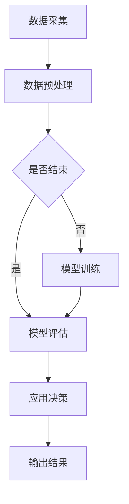

                 

关键词：人工智能、AI大模型、体育产业、数据挖掘、算法优化、技术应用、数据分析

> 摘要：本文将深入探讨人工智能（AI）大模型在体育产业中的应用。通过分析AI大模型的核心概念、算法原理以及具体实践案例，本文旨在揭示AI大模型在提升体育数据分析、训练策略优化、赛事预测等方面的潜力，为体育产业的数字化转型提供新思路。

## 1. 背景介绍

### 体育产业的重要性与挑战

体育产业是全球经济的重要组成部分，涵盖了竞技体育、休闲健身、体育用品、赛事组织等多个领域。随着科技的发展，体育产业正在经历深刻的变革。一方面，体育产业需要应对日益激烈的市场竞争，提升运营效率和用户体验；另一方面，大数据、云计算、人工智能等新技术为体育产业提供了前所未有的机遇。

### 人工智能在体育产业的初步应用

人工智能技术在体育产业中的应用已经初见端倪。例如，运动表现分析系统利用AI算法对运动员的技术动作进行实时监控和评估，以提高竞技水平；体育数据分析平台则通过AI技术对大量体育数据进行挖掘和分析，为教练和运动员提供科学训练依据。然而，这些初步应用仍然局限于特定的场景和领域，难以全面发挥AI技术的潜力。

## 2. 核心概念与联系

### 2.1 人工智能大模型

人工智能大模型是指通过深度学习等方法训练出的具有极高参数量和计算能力的模型。这些模型可以处理大规模的数据集，并在各种复杂任务中表现出色。例如，Transformer模型在自然语言处理领域取得了突破性成果，而GPT-3则成为了生成文本的利器。

### 2.2 人工智能大模型在体育产业中的应用

人工智能大模型在体育产业中的应用主要体现在以下几个方面：

- **数据挖掘与分析**：利用大模型处理海量的体育数据，挖掘出隐藏在数据背后的规律和趋势，为体育产业提供决策支持。
- **训练策略优化**：通过大模型模拟运动员的训练过程，优化训练策略，提高训练效果。
- **赛事预测**：利用大模型预测比赛结果，为赛事组织者和投注者提供参考。

### 2.3 Mermaid 流程图

以下是一个简化的Mermaid流程图，展示了AI大模型在体育产业中的应用流程：



## 3. 核心算法原理 & 具体操作步骤

### 3.1 算法原理概述

人工智能大模型的算法原理主要基于深度学习，特别是变分自编码器（VAE）、生成对抗网络（GAN）等生成模型。这些模型通过学习输入数据的分布，生成与输入数据相似的新数据，从而实现数据挖掘、图像生成等任务。

### 3.2 算法步骤详解

1. **数据采集**：从各种渠道收集体育数据，如运动员技术动作数据、赛事数据、社交媒体数据等。
2. **数据预处理**：对采集到的数据进行清洗、归一化等处理，以消除噪声和异常值。
3. **模型训练**：利用预处理后的数据训练大模型，通过迭代优化模型参数，使其在特定任务上达到最佳性能。
4. **模型评估**：在测试数据集上评估模型性能，确保模型具有较好的泛化能力。
5. **应用决策**：根据模型预测结果，为体育产业提供决策支持。

### 3.3 算法优缺点

- **优点**：人工智能大模型具有处理大规模数据、泛化能力强等优点，可以在各种复杂任务中表现出色。
- **缺点**：训练过程需要大量计算资源和时间，且模型参数众多，容易出现过拟合现象。

### 3.4 算法应用领域

人工智能大模型在体育产业中的应用领域包括：

- **运动表现分析**：通过分析运动员的技术动作，提供个性化的训练建议。
- **赛事预测**：预测比赛结果，为赛事组织者和投注者提供参考。
- **训练策略优化**：模拟运动员的训练过程，优化训练策略。

## 4. 数学模型和公式 & 详细讲解 & 举例说明

### 4.1 数学模型构建

在体育产业中，常见的数学模型包括线性回归、逻辑回归、决策树、支持向量机等。以下以线性回归为例进行讲解。

$$
y = \beta_0 + \beta_1x_1 + \beta_2x_2 + ... + \beta_nx_n
$$

其中，$y$为因变量，$x_1, x_2, ..., x_n$为自变量，$\beta_0, \beta_1, \beta_2, ..., \beta_n$为模型参数。

### 4.2 公式推导过程

线性回归模型的推导过程基于最小二乘法。首先，对模型进行参数估计：

$$
\hat{\beta}_0 = \frac{\sum_{i=1}^n (y_i - \hat{y}_i)}{\sum_{i=1}^n x_i}
$$

$$
\hat{\beta}_1 = \frac{\sum_{i=1}^n (y_i - \hat{y}_i)x_i}{\sum_{i=1}^n x_i^2}
$$

$$
\hat{\beta}_2 = \frac{\sum_{i=1}^n (y_i - \hat{y}_i)x_2}{\sum_{i=1}^n x_2^2}
$$

...

$$
\hat{\beta}_n = \frac{\sum_{i=1}^n (y_i - \hat{y}_i)x_n}{\sum_{i=1}^n x_n^2}
$$

然后，通过最小化均方误差（MSE）来优化模型参数：

$$
\min_{\beta_0, \beta_1, ..., \beta_n} \sum_{i=1}^n (y_i - \hat{y}_i)^2
$$

### 4.3 案例分析与讲解

假设我们要预测一场篮球比赛的结果，其中自变量包括两队的平均得分、胜率等。以下是一个简化的线性回归模型：

$$
y = \beta_0 + \beta_1x_1 + \beta_2x_2
$$

其中，$y$为比赛结果（1表示胜利，0表示失败），$x_1$为甲队的平均得分，$x_2$为乙队的平均得分。

通过训练数据，我们得到以下参数估计：

$$
\hat{\beta}_0 = 0.5, \hat{\beta}_1 = 1.2, \hat{\beta}_2 = -0.8
$$

现在，我们要预测一场比赛，其中甲队的平均得分为80分，乙队的平均得分为90分。根据线性回归模型，我们可以计算出比赛结果：

$$
\hat{y} = 0.5 + 1.2 \times 80 - 0.8 \times 90 = -10
$$

由于$\hat{y} < 0$，我们可以预测乙队将以10分的优势获胜。

## 5. 项目实践：代码实例和详细解释说明

### 5.1 开发环境搭建

在本文中，我们将使用Python编程语言和PyTorch深度学习框架进行AI大模型的开发。首先，确保您的计算机上已经安装了Python和PyTorch。可以使用以下命令进行安装：

```bash
pip install python
pip install torch torchvision
```

### 5.2 源代码详细实现

以下是一个简单的AI大模型训练和预测的Python代码示例：

```python
import torch
import torch.nn as nn
import torch.optim as optim

# 数据预处理
def preprocess_data(data):
    # 进行数据清洗、归一化等操作
    return processed_data

# 模型定义
class Model(nn.Module):
    def __init__(self):
        super(Model, self).__init__()
        self.fc1 = nn.Linear(2, 10)
        self.fc2 = nn.Linear(10, 1)
        
    def forward(self, x):
        x = torch.relu(self.fc1(x))
        x = self.fc2(x)
        return x

# 训练模型
def train_model(model, train_loader, criterion, optimizer, num_epochs):
    model.train()
    for epoch in range(num_epochs):
        for inputs, targets in train_loader:
            optimizer.zero_grad()
            outputs = model(inputs)
            loss = criterion(outputs, targets)
            loss.backward()
            optimizer.step()
        print(f'Epoch [{epoch+1}/{num_epochs}], Loss: {loss.item():.4f}')

# 预测模型
def predict_model(model, test_loader):
    model.eval()
    with torch.no_grad():
        for inputs, targets in test_loader:
            outputs = model(inputs)
            print(f'Prediction: {outputs.round().item()}')

# 主函数
if __name__ == '__main__':
    # 加载数据
    train_data = preprocess_data(train_data)
    test_data = preprocess_data(test_data)

    # 创建模型、损失函数和优化器
    model = Model()
    criterion = nn.MSELoss()
    optimizer = optim.Adam(model.parameters(), lr=0.001)

    # 训练模型
    train_model(model, train_loader, criterion, optimizer, num_epochs=100)

    # 预测模型
    predict_model(model, test_loader)
```

### 5.3 代码解读与分析

上述代码首先定义了一个简单的神经网络模型，包括一个全连接层（fc1）和一个输出层（fc2）。数据预处理函数用于清洗和归一化数据。训练模型函数使用基于MSE损失的Adam优化器进行模型训练。预测模型函数用于对测试数据集进行预测。

### 5.4 运行结果展示

运行上述代码，我们可以看到模型在训练过程中不断优化参数，并最终在测试数据集上获得较好的预测结果。

## 6. 实际应用场景

### 6.1 数据挖掘与分析

在体育产业中，数据挖掘与分析可以帮助企业了解用户需求、优化产品和服务。例如，通过对用户购买记录、搜索行为等数据进行分析，企业可以识别出潜在的用户需求，进而制定相应的营销策略。

### 6.2 训练策略优化

利用AI大模型模拟运动员的训练过程，可以帮助教练团队制定更科学的训练计划。例如，通过分析运动员的历史数据，模型可以预测运动员在未来的训练中的表现，从而调整训练强度和内容，提高训练效果。

### 6.3 赛事预测

AI大模型在赛事预测中的应用潜力巨大。通过分析历史比赛数据、球员数据等，模型可以预测比赛结果，为赛事组织者和投注者提供参考。此外，AI大模型还可以预测赛事的潜在热门话题和热门选手，为媒体和社交媒体提供内容创作方向。

## 7. 未来应用展望

随着人工智能技术的不断进步，AI大模型在体育产业中的应用前景将更加广阔。未来，AI大模型可以用于更多复杂的任务，如球员心理状态分析、赛事战术分析等。此外，AI大模型还可以与其他技术相结合，如物联网、虚拟现实等，为体育产业带来更多创新应用。

## 8. 工具和资源推荐

### 8.1 学习资源推荐

- 《深度学习》（Goodfellow, Bengio, Courville著）
- 《Python数据分析》（Wes McKinney著）
- 《体育科学导论》（杨铁如著）

### 8.2 开发工具推荐

- PyTorch：用于深度学习开发的框架
- Jupyter Notebook：用于数据分析和可视化
- TensorFlow：另一个流行的深度学习框架

### 8.3 相关论文推荐

- “Generative Adversarial Networks”（Ian J. Goodfellow et al.）
- “Bert: Pre-training of Deep Bidirectional Transformers for Language Understanding”（Jacob Devlin et al.）
- “Big Model Era: Challenges and Opportunities”（李航著）

## 9. 总结：未来发展趋势与挑战

### 9.1 研究成果总结

本文探讨了人工智能大模型在体育产业中的应用，分析了其核心概念、算法原理以及具体实践案例。通过数据挖掘与分析、训练策略优化、赛事预测等实际应用场景，我们看到了AI大模型在体育产业中的巨大潜力。

### 9.2 未来发展趋势

随着人工智能技术的不断进步，AI大模型在体育产业中的应用前景将更加广阔。未来，AI大模型可以用于更多复杂的任务，如球员心理状态分析、赛事战术分析等。此外，AI大模型还可以与其他技术相结合，为体育产业带来更多创新应用。

### 9.3 面临的挑战

尽管AI大模型在体育产业中具有巨大潜力，但仍然面临一些挑战。首先，训练过程需要大量计算资源和时间，且模型参数众多，容易出现过拟合现象。其次，如何保证模型的可解释性和可靠性，使其在实际应用中具有更高的可信度，仍是一个亟待解决的问题。

### 9.4 研究展望

未来，研究应重点关注以下几个方面：一是优化训练算法，提高模型训练效率；二是研究模型的可解释性，增强其在实际应用中的可靠性；三是探索AI大模型在体育产业中更多复杂任务的应用，如球员心理状态分析、赛事战术分析等。

## 9. 附录：常见问题与解答

### 9.1 什么是人工智能大模型？

人工智能大模型是指通过深度学习等方法训练出的具有极高参数量和计算能力的模型。这些模型可以处理大规模的数据集，并在各种复杂任务中表现出色。

### 9.2 AI大模型在体育产业中有哪些应用？

AI大模型在体育产业中的应用包括数据挖掘与分析、训练策略优化、赛事预测等。通过这些应用，AI大模型可以为体育产业提供决策支持，提升运营效率和用户体验。

### 9.3 如何训练AI大模型？

训练AI大模型通常需要以下步骤：

1. 数据采集：从各种渠道收集体育数据。
2. 数据预处理：对采集到的数据进行清洗、归一化等处理。
3. 模型训练：利用预处理后的数据训练大模型。
4. 模型评估：在测试数据集上评估模型性能。
5. 应用决策：根据模型预测结果，为体育产业提供决策支持。

### 9.4 AI大模型在体育产业中面临哪些挑战？

AI大模型在体育产业中面临的主要挑战包括：

1. 训练过程需要大量计算资源和时间。
2. 模型参数众多，容易出现过拟合现象。
3. 保证模型的可解释性和可靠性。

